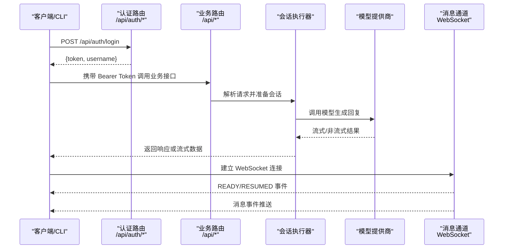
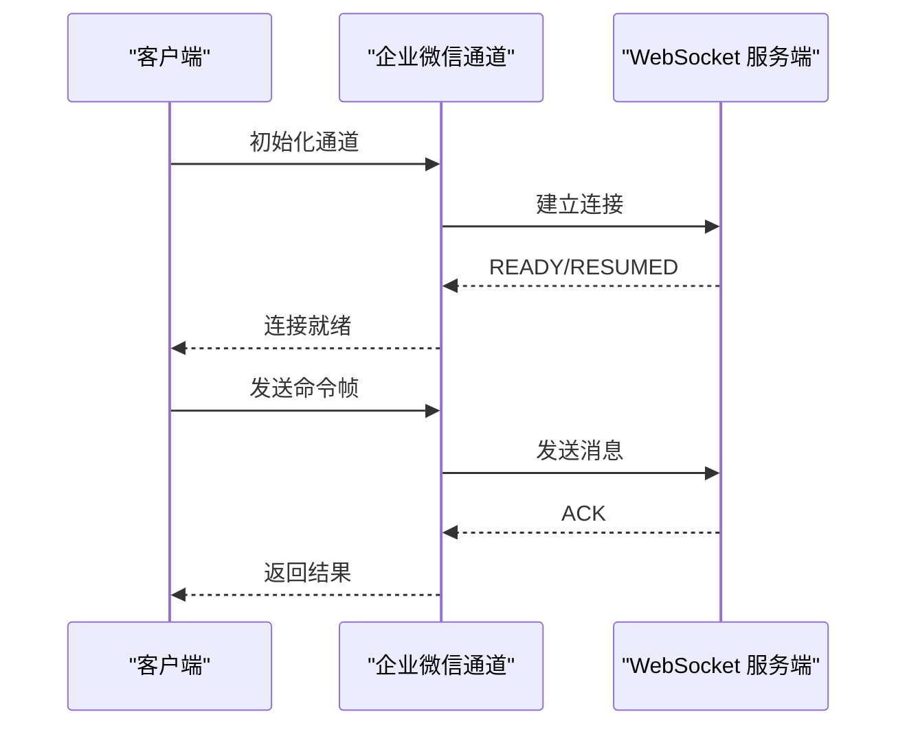
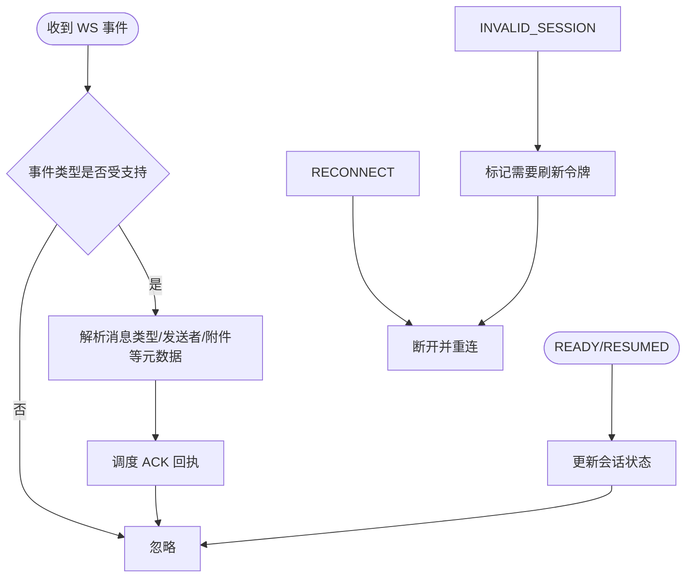
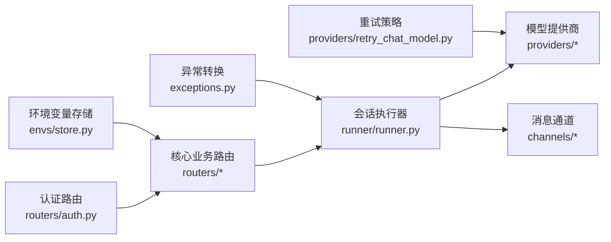

# API参考

<cite>
**本文引用的文件**
- [auth.py](file://src/qwenpaw/app/routers/auth.py)
- [api-tutorial.en.md](file://website/public/docs/api-tutorial.en.md)
- [cli.en.md](file://website/public/docs/cli.en.md)
- [store.py](file://src/qwenpaw/envs/store.py)
- [exceptions.py](file://src/qwenpaw/exceptions.py)
- [runner.py](file://src/qwenpaw/app/runner/runner.py)
- [retry_chat_model.py](file://src/qwenpaw/providers/retry_chat_model.py)
- [channel.py（企业微信）](file://src/qwenpaw/app/channels/wecom/channel.py)
- [channel.py（QQ）](file://src/qwenpaw/app/channels/qq/channel.py)
- [channel.py（小艺）](file://src/qwenpaw/app/channels/xiaoyi/channel.py)
- [SKILL.md（定时任务技能）](file://src/qwenpaw/agents/skills/cron-en/SKILL.md)
</cite>

## 目录
1. [简介](#简介)
2. [项目结构](#项目结构)
3. [核心组件](#核心组件)
4. [架构总览](#架构总览)
5. [详细组件分析](#详细组件分析)
6. [依赖关系分析](#依赖关系分析)
7. [性能考虑](#性能考虑)
8. [故障排查指南](#故障排查指南)
9. [结论](#结论)
10. [附录](#附录)

## 简介
本文件为 QwenPaw 的完整 API 参考，覆盖以下内容：
- RESTful API：端点、HTTP 方法、URL 模式、请求/响应模型与认证方式
- WebSocket 接口：连接处理、消息格式、事件类型与实时交互模式
- CLI 命令：命令语法、参数选项与使用示例
- 配置项：环境变量、配置文件与运行时参数
- 最佳实践、错误处理策略与性能优化建议
- 第三方集成与程序化操作的技术参考

## 项目结构
QwenPaw 后端基于 FastAPI 提供 REST API，并通过多种通道（如企业微信、QQ、小艺等）实现消息通道的 WebSocket 实时交互；前端控制台提供管理与调试能力；CLI 提供命令行工具以进行安装、配置、任务调度与应用生命周期管理。

```mermaid
graph TB
subgraph "后端服务"
Routers["路由模块<br/>routers/*"]
Runner["会话执行器<br/>runner/runner.py"]
Providers["模型提供商适配<br/>providers/*"]
Channels["消息通道<br/>channels/*"]
Auth["认证模块<br/>routers/auth.py"]
end
subgraph "前端控制台"
Console["控制台页面<br/>console/pages/*"]
end
subgraph "CLI"
CLI["命令行工具<br/>cli/*"]
end
subgraph "配置与环境"
EnvStore["环境变量存储<br/>envs/store.py"]
end
Console --> Routers
CLI --> Routers
Routers --> Runner
Runner --> Providers
Runner --> Channels
Auth --> Routers
EnvStore --> Routers
```

图表来源
- [auth.py:1-63](file://src/qwenpaw/app/routers/auth.py#L1-L63)
- [runner.py:728-763](file://src/qwenpaw/app/runner/runner.py#L728-L763)
- [store.py:220-262](file://src/qwenpaw/envs/store.py#L220-L262)

章节来源
- [auth.py:1-63](file://src/qwenpaw/app/routers/auth.py#L1-L63)
- [runner.py:728-763](file://src/qwenpaw/app/runner/runner.py#L728-L763)
- [store.py:220-262](file://src/qwenpaw/envs/store.py#L220-L262)

## 核心组件
- 认证与授权：登录、注册、令牌撤销与状态查询
- 会话与聊天：消息输入、会话管理、流式输出
- 通道与消息：多渠道接入（企业微信、QQ、小艺等）的 WebSocket 连接与事件处理
- 定时任务：基于 Cron 的计划任务管理
- CLI：应用生命周期、通道管理、任务调度、环境变量与诊断工具
- 错误处理与重试：统一异常转换、速率限制与重试策略

章节来源
- [auth.py:1-63](file://src/qwenpaw/app/routers/auth.py#L1-L63)
- [api-tutorial.en.md:696-854](file://website/public/docs/api-tutorial.en.md#L696-L854)
- [cli.en.md:285-570](file://website/public/docs/cli.en.md#L285-L570)
- [exceptions.py:54-253](file://src/qwenpaw/exceptions.py#L54-L253)
- [retry_chat_model.py:124-160](file://src/qwenpaw/providers/retry_chat_model.py#L124-L160)

## 架构总览
下图展示从客户端到后端服务的整体调用链路，包括认证、路由、会话执行与通道交互。



图表来源
- [auth.py:49-63](file://src/qwenpaw/app/routers/auth.py#L49-L63)
- [runner.py:728-763](file://src/qwenpaw/app/runner/runner.py#L728-L763)
- [channel.py（企业微信）:711-737](file://src/qwenpaw/app/channels/wecom/channel.py#L711-L737)
- [channel.py（QQ）:1488-1522](file://src/qwenpaw/app/channels/qq/channel.py#L1488-L1522)

## 详细组件分析

### RESTful API 参考

- 认证相关
  - 登录
    - 方法与路径：POST /api/auth/login
    - 请求体字段：username, password, expires_in（可选）
    - 响应体字段：token, username
    - 行为说明：支持自定义过期时间，0 或 -1 表示永久；未启用认证时返回空 token
    - 认证方式：无（或本地回绕），启用后需携带 Bearer Token
  - 注册
    - 方法与路径：POST /api/auth/register
    - 请求体字段：username, password, expires_in（可选）
    - 响应体字段：token, username
  - 获取认证状态
    - 方法与路径：GET /api/auth/status
    - 响应体字段：enabled, has_users
  - 撤销单个令牌
    - 方法与路径：POST /api/auth/revoke-token
    - 请求体字段：token（可选，默认撤销当前会话令牌）
    - 响应体字段：message, revoked, revoked_current_token
  - 撤销全部令牌
    - 方法与路径：POST /api/auth/revoke-all-tokens
    - 响应体字段：message, revoked
  - 更新凭据（改密）
    - 方法与路径：POST /api/auth/update-profile
    - 请求体字段：current_password, new_password
    - 响应体字段：message

- 控制台聊天
  - 发送消息
    - 方法与路径：POST /api/console/chat
    - 头部要求：Authorization: Bearer <token>, X-Agent-Id: <agent_id>
    - 请求体字段：input（消息数组）、session_id、user_id、channel
    - 响应：即时响应或流式响应（取决于实现）

- 其他常用路由
  - 会话与代理管理、技能、插件、工作区、备份、设置、环境变量等均在 routers/* 中定义，遵循统一的前缀与标签组织方式。

章节来源
- [auth.py:23-47](file://src/qwenpaw/app/routers/auth.py#L23-L47)
- [auth.py:49-63](file://src/qwenpaw/app/routers/auth.py#L49-L63)
- [api-tutorial.en.md:696-854](file://website/public/docs/api-tutorial.en.md#L696-L854)

### WebSocket 接口参考

- 企业微信通道
  - 连接与会话
    - 使用内部发送辅助函数向 WebSocket 发送命令帧并等待确认
    - 支持会话 ID、序列号、重连尝试次数、心跳与快速断开计数等状态管理
  - 消息事件
    - 事件类型映射到消息类型与发送者键值
    - 收到消息后进行 ACK 调度与元数据提取
  - 心跳与重连
    - 通过心跳控制器管理周期性心跳
    - 对服务器重连请求、无效会话等情况进行处理

- QQ 通道
  - 消息事件规范
    - 定义不同事件类型的规范（C2C、AT、DIRECT、GROUP_AT），包含消息类型、发送者键与额外元数据键
  - 会话状态
    - 维护 session_id、last_seq、reconnect_attempts、identify_fail_count、should_refresh_token 等
  - 事件处理
    - READY/RESUMED：更新会话状态
    - DISPATCH：根据事件类型分发到消息处理
    - HEARTBEAT_ACK：日志记录
    - RECONNECT/INVALID_SESSION：触发断开或刷新令牌逻辑

- 小艺通道
  - 连接复用
    - 当存在活跃连接时，新实例接管旧连接状态，避免重复连接
    - 标记旧实例不再拥有连接并停止其任务



图表来源
- [channel.py（企业微信）:711-737](file://src/qwenpaw/app/channels/wecom/channel.py#L711-L737)



图表来源
- [channel.py（QQ）:107-127](file://src/qwenpaw/app/channels/qq/channel.py#L107-L127)
- [channel.py（QQ）:1488-1522](file://src/qwenpaw/app/channels/qq/channel.py#L1488-L1522)

章节来源
- [channel.py（企业微信）:711-737](file://src/qwenpaw/app/channels/wecom/channel.py#L711-L737)
- [channel.py（QQ）:107-127](file://src/qwenpaw/app/channels/qq/channel.py#L107-L127)
- [channel.py（QQ）:1488-1522](file://src/qwenpaw/app/channels/qq/channel.py#L1488-L1522)
- [channel.py（小艺）:278-293](file://src/qwenpaw/app/channels/xiaoyi/channel.py#L278-L293)

### CLI 命令参考

- 通道管理
  - 列表、发送、安装、添加、移除、交互配置等子命令
  - 注意：使用 config 进行交互式配置；移除自定义通道使用 remove

- 定时任务
  - 创建、列出、获取、暂停、恢复、删除、立即执行等子命令
  - 支持 JSON 文件批量创建
  - Cron 表达式五段式：分钟 小时 日 月 星期

- 其他常用命令
  - 应用生命周期（启动、关闭、守护进程）、代理与工具管理、插件、环境变量、诊断工具等

章节来源
- [cli.en.md:285-570](file://website/public/docs/cli.en.md#L285-L570)
- [SKILL.md（定时任务技能）:192-205](file://src/qwenpaw/agents/skills/cron-en/SKILL.md#L192-L205)

### 配置选项参考

- 环境变量
  - 通过 envs.store 提供的接口进行加载、保存、设置与删除
  - 启动时可将安全的环境变量注入到 os.environ，且不会覆盖已存在的系统/运行时变量
  - 支持保护键（不注入到进程环境）与持久化映射

- 配置文件
  - 与环境变量协同工作，用于持久化配置与跨会话可用

- 运行时参数
  - 通过 CLI 与控制台界面进行交互式配置与动态变更

章节来源
- [store.py:220-262](file://src/qwenpaw/envs/store.py#L220-L262)

## 依赖关系分析



图表来源
- [auth.py:1-63](file://src/qwenpaw/app/routers/auth.py#L1-L63)
- [runner.py:728-763](file://src/qwenpaw/app/runner/runner.py#L728-L763)
- [exceptions.py:165-253](file://src/qwenpaw/exceptions.py#L165-L253)
- [retry_chat_model.py:124-160](file://src/qwenpaw/providers/retry_chat_model.py#L124-L160)
- [store.py:220-262](file://src/qwenpaw/envs/store.py#L220-L262)

章节来源
- [auth.py:1-63](file://src/qwenpaw/app/routers/auth.py#L1-L63)
- [runner.py:728-763](file://src/qwenpaw/app/runner/runner.py#L728-L763)
- [exceptions.py:165-253](file://src/qwenpaw/exceptions.py#L165-L253)
- [retry_chat_model.py:124-160](file://src/qwenpaw/providers/retry_chat_model.py#L124-L160)
- [store.py:220-262](file://src/qwenpaw/envs/store.py#L220-L262)

## 性能考虑
- 速率限制与重试
  - 对 429 等可重试状态码进行自动重试与退避
  - 从异常头中解析 Retry-After 并按秒级退避
- 异常转换与调试
  - 将模型相关异常转换为统一的运行时异常，保留原始错误详情
  - 在会话执行失败时写入调试转储文件，便于定位问题
- 连接复用与心跳
  - 通道层维护会话状态与心跳，减少频繁重连带来的抖动
  - 小艺通道在存在活跃连接时进行实例状态接管，避免重复握手

章节来源
- [retry_chat_model.py:124-160](file://src/qwenpaw/providers/retry_chat_model.py#L124-L160)
- [exceptions.py:165-253](file://src/qwenpaw/exceptions.py#L165-L253)
- [runner.py:728-763](file://src/qwenpaw/app/runner/runner.py#L728-L763)
- [channel.py（小艺）:278-293](file://src/qwenpaw/app/channels/xiaoyi/channel.py#L278-L293)

## 故障排查指南
- 认证问题
  - 令牌过期或无效：重新登录获取新令牌；必要时撤销旧令牌或修改密码
  - 本地回绕：来自 127.0.0.1 或 ::1 的请求可能跳过认证
- 通道连接问题
  - 企业微信：检查命令帧发送与 ACK 等待流程；关注会话状态与心跳
  - QQ：识别失败计数、无效会话与重连请求的处理逻辑
  - 小艺：确认连接接管是否成功，旧实例任务是否正确停止
- 模型调用异常
  - 401/403：检查鉴权与配额
  - 429：遵循 Retry-After 退避重试
  - 超时/上下文超限：调整请求参数或模型配置
- 调试与排错
  - 使用 CLI 诊断工具与网络连通性检查
  - 查看会话执行器产生的调试转储文件定位问题

章节来源
- [api-tutorial.en.md:696-854](file://website/public/docs/api-tutorial.en.md#L696-L854)
- [channel.py（企业微信）:711-737](file://src/qwenpaw/app/channels/wecom/channel.py#L711-L737)
- [channel.py（QQ）:1488-1522](file://src/qwenpaw/app/channels/qq/channel.py#L1488-L1522)
- [channel.py（小艺）:278-293](file://src/qwenpaw/app/channels/xiaoyi/channel.py#L278-L293)
- [exceptions.py:165-253](file://src/qwenpaw/exceptions.py#L165-L253)
- [runner.py:728-763](file://src/qwenpaw/app/runner/runner.py#L728-L763)

## 结论
本文档提供了 QwenPaw 的 REST API、WebSocket 接口、CLI 与配置的权威参考。结合统一的异常转换与重试机制，用户可在生产环境中稳定地集成与扩展。建议在第三方集成时优先采用 Bearer Token 认证、合理设置令牌有效期，并利用 CLI 与控制台进行自动化运维与监控。

## 附录

### 认证最佳实践
- 使用 expires_in 控制令牌有效期，避免长期有效令牌带来的风险
- 在多设备场景下谨慎撤销单个令牌或修改密码以批量失效
- 将令牌安全存储，避免硬编码在客户端或脚本中

章节来源
- [api-tutorial.en.md:696-854](file://website/public/docs/api-tutorial.en.md#L696-L854)