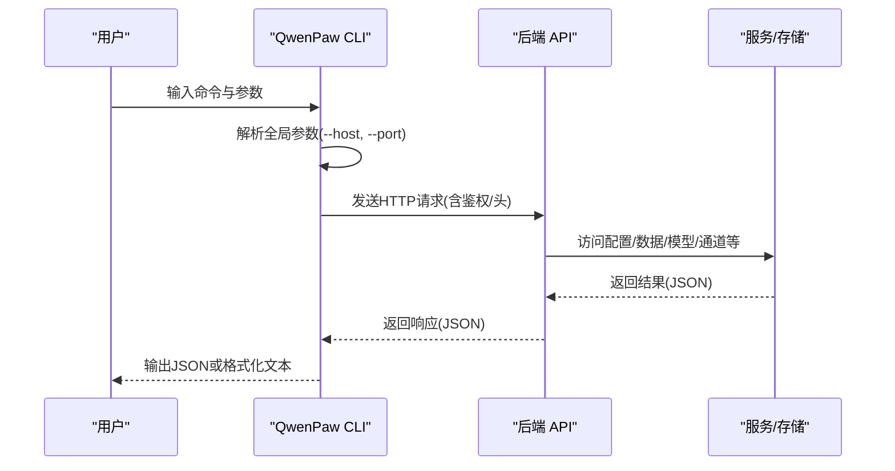
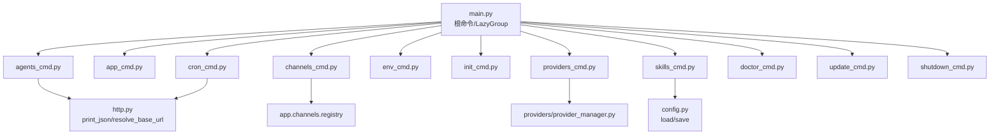
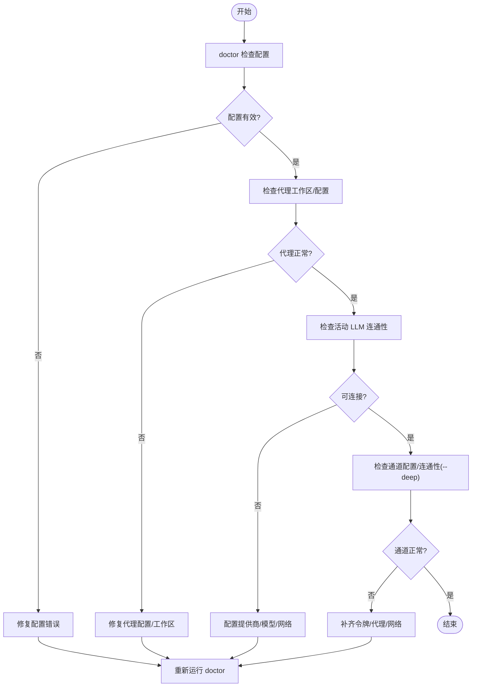

# CLI命令

<cite>
**本文引用的文件**
- [src/qwenpaw/cli/main.py](file://src/qwenpaw/cli/main.py)
- [src/qwenpaw/__main__.py](file://src/qwenpaw/__main__.py)
- [src/qwenpaw/cli/agents_cmd.py](file://src/qwenpaw/cli/agents_cmd.py)
- [src/qwenpaw/cli/app_cmd.py](file://src/qwenpaw/cli/app_cmd.py)
- [src/qwenpaw/cli/channels_cmd.py](file://src/qwenpaw/cli/channels_cmd.py)
- [src/qwenpaw/cli/cron_cmd.py](file://src/qwenpaw/cli/cron_cmd.py)
- [src/qwenpaw/cli/env_cmd.py](file://src/qwenpaw/cli/env_cmd.py)
- [src/qwenpaw/cli/init_cmd.py](file://src/qwenpaw/cli/init_cmd.py)
- [src/qwenpaw/cli/providers_cmd.py](file://src/qwenpaw/cli/providers_cmd.py)
- [src/qwenpaw/cli/skills_cmd.py](file://src/qwenpaw/cli/skills_cmd.py)
- [src/qwenpaw/cli/doctor_cmd.py](file://src/qwenpaw/cli/doctor_cmd.py)
- [src/qwenpaw/cli/update_cmd.py](file://src/qwenpaw/cli/update_cmd.py)
- [src/qwenpaw/cli/shutdown_cmd.py](file://src/qwenpaw/cli/shutdown_cmd.py)
</cite>

## 目录
1. [简介](#简介)
2. [项目结构](#项目结构)
3. [核心组件](#核心组件)
4. [架构总览](#架构总览)
5. [详细组件分析](#详细组件分析)
6. [依赖分析](#依赖分析)
7. [性能考虑](#性能考虑)
8. [故障排查指南](#故障排查指南)
9. [结论](#结论)
10. [附录](#附录)

## 简介
本参考文档面向系统管理员与开发者，全面梳理 QwenPaw CLI 命令体系，覆盖命令语法、参数类型与默认值、输出格式、错误处理、配置文件位置与格式、环境变量影响，以及批量与自动化脚本编写建议。读者无需深入源码即可高效使用 CLI 完成日常运维与管理任务。

## 项目结构
QwenPaw CLI 通过 Click 组织命令分组与子命令，采用延迟加载（LazyGroup）以优化启动性能。根命令解析全局主机与端口参数，并将之传递给各子命令；子命令通过 HTTP 客户端调用后端 API，实现对应用、代理、通道、技能、模型等资源的统一管理。

```mermaid
graph TB
Root["根命令<br/>QwenPaw CLI"] --> Group_Agents["agents 子命令组"]
Root --> Group_App["app 子命令"]
Root --> Group_Channels["channels 子命令组"]
Root --> Group_Cron["cron 子命令组"]
Root --> Group_Env["env 子命令组"]
Root --> Group_Init["init 子命令"]
Root --> Group_Models["models 子命令组"]
Root --> Group_Skills["skills 子命令组"]
Root --> Group_Doctor["doctor 子命令"]
Root --> Group_Update["update 子命令"]
Root --> Group_Shutdown["shutdown 子命令"]
Group_Agents --> Cmd_Agents_List["list"]
Group_Agents --> Cmd_Agents_Create["create"]
Group_Agents --> Cmd_Agents_Delete["delete"]
Group_Agents --> Cmd_Agents_Chat["chat"]
Group_Channels --> Cmd_Channels_List["list"]
Group_Channels --> Cmd_Channels_Config["config"]
Group_Channels --> Cmd_Channels_Install["install"]
Group_Cron --> Cmd_Cron_List["list"]
Group_Cron --> Cmd_Cron_Get["get"]
Group_Cron --> Cmd_Cron_State["state"]
Group_Cron --> Cmd_Cron_Create["create"]
Group_Cron --> Cmd_Cron_Delete["delete"]
Group_Cron --> Cmd_Cron_Pause["pause"]
Group_Cron --> Cmd_Cron_Resume["resume"]
Group_Cron --> Cmd_Cron_Run["run"]
Group_Models --> Cmd_Models_List["list"]
Group_Models --> Cmd_Models_Config["config"]
Group_Models --> Cmd_Models_ConfigKey["config-key"]
Group_Models --> Cmd_Models_SetLLM["set-llm"]
Group_Models --> Cmd_Models_AddProvider["add-provider"]
Group_Models --> Cmd_Models_RemoveProvider["remove-provider"]
Group_Models --> Cmd_Models_AddModel["add-model"]
Group_Models --> Cmd_Models_RemoveModel["remove-model"]
Group_Models --> Cmd_Models_Download["download"]
Group_Models --> Cmd_Models_Local["local"]
Group_Skills --> Cmd_Skills_List["list"]
Group_Skills --> Cmd_Skills_Config["config"]
Group_Skills --> Cmd_Skills_Info["info"]
Group_Env --> Cmd_Env_List["list"]
Group_Env --> Cmd_Env_Set["set"]
Group_Env --> Cmd_Env_Delete["delete"]
```

图表来源
- [src/qwenpaw/cli/main.py:95-151](file://src/qwenpaw/cli/main.py#L95-L151)
- [src/qwenpaw/cli/agents_cmd.py:445-800](file://src/qwenpaw/cli/agents_cmd.py#L445-L800)
- [src/qwenpaw/cli/channels_cmd.py:27-800](file://src/qwenpaw/cli/channels_cmd.py#L27-L800)
- [src/qwenpaw/cli/cron_cmd.py:27-480](file://src/qwenpaw/cli/cron_cmd.py#L27-L480)
- [src/qwenpaw/cli/providers_cmd.py:476-819](file://src/qwenpaw/cli/providers_cmd.py#L476-L819)
- [src/qwenpaw/cli/skills_cmd.py:214-317](file://src/qwenpaw/cli/skills_cmd.py#L214-L317)
- [src/qwenpaw/cli/env_cmd.py:10-99](file://src/qwenpaw/cli/env_cmd.py#L10-L99)

章节来源
- [src/qwenpaw/cli/main.py:1-178](file://src/qwenpaw/cli/main.py#L1-L178)
- [src/qwenpaw/__main__.py:1-7](file://src/qwenpaw/__main__.py#L1-L7)

## 核心组件
- 根命令与全局参数
  - 全局参数：--host、--port。若未显式提供，优先从上次运行记录中读取，否则回退到默认值 127.0.0.1:8088。该信息会缓存以便后续命令复用。
  - 启动时进行标准流编码设置（Windows），确保中文与非 ASCII 字符正确显示。
- 延迟加载机制
  - 使用 LazyGroup 将子命令按需导入，减少启动时间与内存占用。
- 子命令组织
  - 通过 Click group 聚合同类命令，如 agents、channels、cron、models、skills、env 等，便于扩展与维护。

章节来源
- [src/qwenpaw/cli/main.py:58-178](file://src/qwenpaw/cli/main.py#L58-L178)

## 架构总览
CLI 通过 Click 解析命令与参数，随后根据子命令逻辑构建 HTTP 请求，调用后端 FastAPI 应用提供的 REST 接口，完成对工作区、代理、通道、技能、模型等资源的查询、创建、更新与删除。全局参数 --host 与 --port 决定 API 基础地址。

图表来源
- [src/qwenpaw/cli/main.py:154-178](file://src/qwenpaw/cli/main.py#L154-L178)
- [src/qwenpaw/cli/agents_cmd.py:724-800](file://src/qwenpaw/cli/agents_cmd.py#L724-L800)
- [src/qwenpaw/cli/cron_cmd.py:36-123](file://src/qwenpaw/cli/cron_cmd.py#L36-L123)

## 详细组件分析

### agents 子命令组
- 命令概览
  - list：列出已配置代理，输出 JSON。
  - create：创建本地代理，支持指定名称、ID、描述、语言、模板、初始技能、默认活跃模型（提供者+模型）。
  - delete：删除代理，可选择同时删除本地工作区目录。
  - chat：代理间对话，支持流式与最终响应模式、后台任务提交与状态轮询、会话复用、超时控制、JSON 输出。
- 关键参数与行为
  - 列表与创建：支持 --base-url 覆盖全局主机/端口；创建时若未指定 agent-id，自动生成唯一 ID；工作区路径默认位于 WORKING_DIR/workspaces/<id>。
  - 删除：支持 --remove-workspace 与 --yes；当需要删除工作区但无法解析路径时，返回明确错误提示。
  - 对话：
    - 必填参数：--from-agent、--to-agent、--text（除非检查后台任务状态）。
    - --background 与 --task-id：提交后台任务并返回 task_id；使用 --task-id 可轮询任务状态。
    - --mode：stream（增量）、final（仅最终结果，默认）。
    - --json-output：输出完整 JSON 而非纯文本。
    - --timeout：请求超时秒数，默认 300。
    - --session-id：复用会话上下文，注意并发风险。
- 输出与错误
  - 成功：list/create/delete/chat 均输出 JSON；chat 在流式模式下逐行输出增量内容。
  - 失败：打印错误信息并退出；后台任务轮询遇到 404 返回“任务不存在”提示。
- 实际应用场景
  - 批量创建代理并初始化技能池，统一配置默认活跃模型。
  - 通过后台任务异步执行复杂问答，避免阻塞交互。
  - 使用会话 ID 在多轮对话中保持上下文一致性。

章节来源
- [src/qwenpaw/cli/agents_cmd.py:445-800](file://src/qwenpaw/cli/agents_cmd.py#L445-L800)

### app 子命令
- 功能：启动 QwenPaw FastAPI 应用，支持绑定主机、端口、自动重载、日志级别、隐藏访问日志路径、工作进程数（已弃用）。
- 关键参数与行为
  - --host/--port：默认 127.0.0.1:8088；当 host 为 0.0.0.0 时，持久化 last API 地址为 127.0.0.1:port。
  - --reload：开发模式启用自动重载；内部设置环境变量以兼容 Windows 浏览器控制。
  - --log-level：支持 critical/error/warning/info/debug/trace；在 debug/trace 下输出初始化耗时。
  - --hide-access-paths：隐藏特定路径的访问日志。
  - --workers：已弃用，始终使用 1 个工作进程。
- 输出与错误
  - 启动成功：uvicorn 运行日志；失败时输出错误并终止。
- 实际应用场景
  - 开发调试：--reload + 适当日志级别。
  - 生产部署：固定主机与端口，关闭自动重载，合理设置日志级别。

章节来源
- [src/qwenpaw/cli/app_cmd.py:15-112](file://src/qwenpaw/cli/app_cmd.py#L15-L112)

### channels 子命令组
- 命令概览
  - list：列出可用通道类型与状态。
  - config：交互式配置通道（iMessage、Discord、Telegram、钉钉、飞书、QQ、Console、Voice 等）。
  - install：安装自定义通道模板文件。
- 关键参数与行为
  - list：展示通道键名、显示名、启用状态；敏感字段（如 bot_token、client_secret）在列表中掩码显示。
  - config：交互式引导填写各项配置（如令牌、代理、前缀等），支持插件通道的自定义配置器。
  - install：生成自定义通道模板，供二次开发使用。
- 输出与错误
  - 成功：保存配置并输出当前配置摘要；失败：提示具体错误并退出。
- 实际应用场景
  - 一键配置多通道，快速接入企业 IM 平台。
  - 自定义通道适配第三方平台消息协议。

章节来源
- [src/qwenpaw/cli/channels_cmd.py:27-800](file://src/qwenpaw/cli/channels_cmd.py#L27-L800)

### cron 子命令组
- 命令概览
  - list：列出所有定时任务。
  - get：按任务 ID 获取任务详情。
  - state：获取任务运行状态（如下次执行时间、暂停状态）。
  - create：创建定时任务，支持从 JSON 文件或内联参数创建。
  - delete：删除任务。
  - pause/resume：暂停/恢复任务。
  - run：立即触发一次任务执行。
- 关键参数与行为
  - 通用：--base-url 覆盖全局主机/端口；--agent-id 默认 default。
  - create：
    - 支持 -f/--file 传入完整 CronJobSpec；或通过 --type/--name/--cron/--channel/--target-user/--target-session/--text/--timezone/--enabled/--mode 等内联参数组合。
    - 任务类型：text（向通道发送固定内容）、agent（向代理提问并将回复发送至通道）。
    - 时间区域：默认使用用户时区，可通过 --timezone 指定。
    - 分发模式：--mode stream（增量）或 final（仅最终）。
- 输出与错误
  - 成功：返回 JSON；失败：打印错误并退出（如任务不存在、参数缺失）。
- 实际应用场景
  - 定时巡检、日报/周报自动发送、代理问答推送。

章节来源
- [src/qwenpaw/cli/cron_cmd.py:27-480](file://src/qwenpaw/cli/cron_cmd.py#L27-L480)

### env 子命令组
- 命令概览
  - list：列出所有环境变量。
  - set：设置环境变量（KEY VALUE）。
  - delete：删除环境变量。
- 关键参数与行为
  - set/delete：严格校验键名；delete 不存在时报错并退出。
  - 交互式配置：init_cmd 中提供交互式添加/编辑环境变量流程。
- 输出与错误
  - 成功：输出确认信息；失败：输出红色错误并退出。
- 实际应用场景
  - 配置第三方服务密钥、代理设置、模型提供商凭据等。

章节来源
- [src/qwenpaw/cli/env_cmd.py:10-99](file://src/qwenpaw/cli/env_cmd.py#L10-L99)

### init 子命令
- 功能：交互式初始化工作区，生成 config.json 与 HEARTBEAT.md，配置心跳、通道、LLM 提供商、技能、环境变量等。
- 关键参数与行为
  - --force：覆盖现有配置与 HEARTBEAT.md。
  - --defaults：仅使用默认值，不进行交互（适合脚本与容器场景）。
  - --accept-security：跳过安全声明确认（配合 --defaults 使用）。
  - 安全提示与遥测收集：首次运行弹出安全警告与遥测说明；可选择同意或拒绝。
  - 初始化步骤：默认工作区、QA 代理、技能池、心跳配置、语言与音频模式、通道配置、LLM 提供商配置、技能同步、环境变量配置、MD 文件复制与编辑器集成。
- 输出与错误
  - 成功：输出各阶段完成信息；失败：根据具体环节输出错误并中止。
- 实际应用场景
  - 新环境快速落地、CI/CD 初始化、容器卷挂载后的最小化配置。

章节来源
- [src/qwenpaw/cli/init_cmd.py:119-523](file://src/qwenpaw/cli/init_cmd.py#L119-L523)

### models 子命令组
- 命令概览
  - list：列出所有提供商及其模型、当前激活槽位。
  - config：交互式配置提供商与模型（包括 API Key、URL、模型添加/移除、激活）。
  - config-key：配置指定提供商的 API Key。
  - set-llm：交互式设置当前激活的 LLM。
  - add-provider/remove-provider：增删自定义提供商。
  - add-model/remove-model：增删用户自定义模型（Ollama 不支持手动增删）。
  - download/local：下载本地模型仓库与列出已下载模型。
- 关键参数与行为
  - list：展示提供商类型（内置/本地/自定义）、基础 URL、API Key（掩码）、模型清单与当前激活槽位。
  - config：按提供商逐一配置，支持本地提供商直接激活模型；非本地提供商可添加模型后激活。
  - download：支持从 huggingface 或 modelscope 下载仓库级模型；旧的 --file 已弃用。
  - set-llm：在已配置的提供商与模型中选择当前激活槽位。
- 输出与错误
  - 成功：输出配置摘要或下载进度；失败：输出错误并退出（如模型下载超时/取消、权限不足）。
- 实际应用场景
  - 多提供商切换、本地模型管理、模型下载与激活。

章节来源
- [src/qwenpaw/cli/providers_cmd.py:476-819](file://src/qwenpaw/cli/providers_cmd.py#L476-L819)

### skills 子命令组
- 命令概览
  - list：列出代理工作区中的技能，显示启用/禁用状态。
  - config：交互式选择启用/禁用技能，支持从技能池下载并同步。
  - info：查看指定技能的详细信息（启用状态、通道、来源、路径、描述）。
- 关键参数与行为
  - list：统计总数、启用数与禁用数。
  - config：支持多选，预览变更并确认应用；可包含技能池候选。
  - info：定位技能目录，输出来源与描述。
- 输出与错误
  - 成功：输出列表/摘要/详情；失败：提示技能不存在并退出。
- 实际应用场景
  - 批量启用/禁用技能、统一技能版本与来源。

章节来源
- [src/qwenpaw/cli/skills_cmd.py:214-317](file://src/qwenpaw/cli/skills_cmd.py#L214-L317)

### doctor 子命令
- 功能：只读健康检查与保守修复建议，涵盖配置、代理工作区、通道、MCP 客户端、技能布局、浏览器自动化、安全基线、内存/嵌入、工作区整洁度、Cron 文件、工作目录、日志可写性、控制台静态文件、Web 认证、提供商概览、活动 LLM 连通性等。
- 关键参数与行为
  - --deep：深度检查（如通道连通性）。
  - 修复：doctor fix 支持干运行与按修复 ID 选择，部分修复无需 --yes。
  - 服务器对比：比较 doctor CLI 与运行中服务器的 Python 环境差异。
- 输出与错误
  - 成功：输出 OK 与路径/版本/配置摘要；失败：输出 FAIL 与修复建议。
- 实际应用场景
  - 系统巡检、问题定位、自动化修复预案。

章节来源
- [src/qwenpaw/cli/doctor_cmd.py:370-800](file://src/qwenpaw/cli/doctor_cmd.py#L370-L800)

### update 子命令
- 功能：升级当前 Python 环境中的 QwenPaw 包，检测运行中的服务并可强制停止后再升级。
- 关键参数与行为
  - --yes：静默模式，跳过确认。
  - 检测：从 PyPI 获取最新版本；识别安装来源（PyPI、editable、VCS、本地文件）。
  - 升级：优先使用 uv pip，其次使用 pip；在 Windows 上分离子进程以避免锁定。
  - 强制停止：检测到运行中的服务时，可交互确认并执行 shutdown。
- 输出与错误
  - 成功：输出升级完成与重启提示；失败：输出安装器错误并退出。
- 实际应用场景
  - CI/CD 自动化升级、生产环境滚动更新。

章节来源
- [src/qwenpaw/cli/update_cmd.py:631-731](file://src/qwenpaw/cli/update_cmd.py#L631-L731)

### shutdown 子命令
- 功能：强制停止正在监听指定端口的后端、前端开发进程、桌面包装器进程及相关的父进程树。
- 关键参数与行为
  - --port：默认使用全局 --port；通过系统工具扫描监听 PID 并递归终止。
  - Windows：使用 taskkill 与 PowerShell 停止进程树；Unix：使用 pgrep/kill 递归终止。
- 输出与错误
  - 成功：输出已停止的 PID 列表；失败：输出无法停止的进程并抛出异常。
- 实际应用场景
  - 升级前停机、调试中断清理、批量管理。

章节来源
- [src/qwenpaw/cli/shutdown_cmd.py:303-386](file://src/qwenpaw/cli/shutdown_cmd.py#L303-L386)

## 依赖分析
- 组件耦合
  - 根命令与子命令通过 Click group 与 LazyGroup 解耦；子命令通过 HTTP 客户端与后端 API 交互，降低模块间耦合。
  - 子命令内部依赖配置加载、模型管理、通道注册、技能管理等模块，但均通过导入与调用封装，保持清晰边界。
- 外部依赖
  - Click：命令行解析与分组。
  - httpx：HTTP 客户端，用于与后端 API 通信。
  - uvicorn：应用运行（app 子命令）。
  - packaging、metadata：版本比较与安装信息检测（update 子命令）。
- 循环依赖
  - 未发现循环导入；延迟加载策略有效避免了启动时的循环依赖风险。

图表来源
- [src/qwenpaw/cli/main.py:95-151](file://src/qwenpaw/cli/main.py#L95-L151)
- [src/qwenpaw/cli/agents_cmd.py:28-29](file://src/qwenpaw/cli/agents_cmd.py#L28-L29)
- [src/qwenpaw/cli/cron_cmd.py:10-11](file://src/qwenpaw/cli/cron_cmd.py#L10-L11)
- [src/qwenpaw/cli/skills_cmd.py:18-19](file://src/qwenpaw/cli/skills_cmd.py#L18-L19)
- [src/qwenpaw/cli/providers_cmd.py:15-17](file://src/qwenpaw/cli/providers_cmd.py#L15-L17)
- [src/qwenpaw/cli/channels_cmd.py:34-36](file://src/qwenpaw/cli/channels_cmd.py#L34-L36)

## 性能考虑
- 启动性能
  - LazyGroup 按需加载子命令，显著降低冷启动时间与内存占用。
  - 导入计时日志在 debug/trace 日志级别下输出，便于定位瓶颈。
- I/O 与网络
  - chat 命令支持流式输出，避免长时间等待；后台任务模式适合长耗时任务。
  - cron 任务的调度与分发采用独立线程/进程模型，避免阻塞主流程。
- 日志与可观测性
  - app 子命令支持隐藏特定路径的访问日志，减少噪声；日志级别可调。
  - doctor 子命令提供详尽的系统与配置诊断，便于问题定位。

## 故障排查指南
- 常见错误与处理
  - 任务不存在：后台任务轮询返回“任务不存在”，检查 task_id 是否正确或是否已过期。
  - 参数缺失：create/cron 等命令缺少必要参数时，直接提示并退出。
  - 权限不足：删除代理且选择删除工作区时，若路径不在允许范围内，提示不可删除。
  - 配置无效：doctor 检查 config.json 有效性，修复后重试。
  - 通道未配置：channels config 提示缺少令牌或代理配置，按提示补齐。
  - LLM 未配置：models list 显示未激活模型槽位，先配置提供商与模型再激活。
- 诊断流程图

图表来源
- [src/qwenpaw/cli/doctor_cmd.py:370-800](file://src/qwenpaw/cli/doctor_cmd.py#L370-L800)

章节来源
- [src/qwenpaw/cli/agents_cmd.py:190-290](file://src/qwenpaw/cli/agents_cmd.py#L190-L290)
- [src/qwenpaw/cli/channels_cmd.py:27-800](file://src/qwenpaw/cli/channels_cmd.py#L27-L800)
- [src/qwenpaw/cli/providers_cmd.py:476-819](file://src/qwenpaw/cli/providers_cmd.py#L476-L819)
- [src/qwenpaw/cli/doctor_cmd.py:370-800](file://src/qwenpaw/cli/doctor_cmd.py#L370-L800)

## 结论
QwenPaw CLI 提供了完善的系统管理与自动化能力，覆盖代理、通道、技能、模型、定时任务、环境变量、初始化、健康检查与升级等关键领域。通过延迟加载与清晰的命令分层，CLI 在易用性与性能之间取得良好平衡。建议在生产环境中结合 doctor 健康检查与 update 升级流程，配合 shutdown 命令实现平滑运维。

## 附录

### 命令与参数速查
- 根命令
  - qwenpaw [--host HOST] [--port PORT] <命令> ...
  - 默认：--host 127.0.0.1；--port 8088；若未提供则读取上次运行记录。
- agents
  - list [--base-url BASE_URL]
  - create --name NAME [--agent-id AGENT_ID] [--description DESCRIPTION] [--workspace-dir WORKSPACE_DIR] [--language LANGUAGE] [--template TEMPLATE] [--skill SKILL ...] [--provider-id PROVIDER_ID] [--model-id MODEL_ID]
  - delete AGENT_ID [--remove-workspace] [--yes] [--base-url BASE_URL]
  - chat --from-agent/--agent-id FROM_AGENT --to-agent TO_AGENT --text TEXT [--session-id SESSION_ID] [--mode {stream,final}] [--background] [--task-id TASK_ID] [--timeout TIMEOUT] [--json-output] [--base-url BASE_URL]
- app
  - app --host HOST --port PORT [--reload] [--log-level {critical,error,warning,info,debug,trace}] [--hide-access-paths PATH ...] [--workers WORKERS]
- channels
  - channels list
  - channels config
  - channels install <key>
- cron
  - cron list [--base-url BASE_URL] [--agent-id AGENT_ID]
  - cron get JOB_ID [--base-url BASE_URL] [--agent-id AGENT_ID]
  - cron state JOB_ID [--base-url BASE_URL] [--agent-id AGENT_ID]
  - cron create -f FILE | --type {text,agent} --name NAME --cron CRON --channel CHANNEL --target-user TARGET_USER --target-session TARGET_SESSION --text TEXT [--timezone TIMEZONE] [--enabled/--no-enabled] [--mode {stream,final}] [--base-url BASE_URL] [--agent-id AGENT_ID]
  - cron delete JOB_ID [--base-url BASE_URL] [--agent-id AGENT_ID]
  - cron pause JOB_ID [--base-url BASE_URL] [--agent-id AGENT_ID]
  - cron resume JOB_ID [--base-url BASE_URL] [--agent-id AGENT_ID]
  - cron run JOB_ID [--base-url BASE_URL] [--agent-id AGENT_ID]
- env
  - env list
  - env set KEY VALUE
  - env delete KEY
- init
  - init [--force] [--defaults] [--accept-security]
- models
  - models list
  - models config
  - models config-key [PROVIDER_ID]
  - models set-llm
  - models add-provider PROVIDER_ID --name NAME [--base-url BASE_URL] [--api-key-prefix API_KEY_PREFIX]
  - models remove-provider PROVIDER_ID [--yes]
  - models add-model PROVIDER_ID --model-id MODEL_ID --model-name MODEL_NAME
  - models remove-model PROVIDER_ID --model-id MODEL_ID
  - models download REPO_ID [--source {huggingface,modelscope}]
  - models local
- skills
  - skills list [--agent-id AGENT_ID]
  - skills config [--agent-id AGENT_ID]
  - skills info SKILL_NAME [--agent-id AGENT_ID]
- doctor
  - doctor [--deep] [--timeout SECONDS] [--llm-timeout SECONDS]
  - doctor fix [--dry-run] [--yes] [--non-interactive] [--only IDS] [--no-backup] [--backup-dir DIR]
- update
  - update [--yes]
- shutdown
  - shutdown [--port PORT]

章节来源
- [src/qwenpaw/cli/main.py:154-178](file://src/qwenpaw/cli/main.py#L154-L178)
- [src/qwenpaw/cli/agents_cmd.py:465-800](file://src/qwenpaw/cli/agents_cmd.py#L465-L800)
- [src/qwenpaw/cli/app_cmd.py:15-112](file://src/qwenpaw/cli/app_cmd.py#L15-L112)
- [src/qwenpaw/cli/channels_cmd.py:27-800](file://src/qwenpaw/cli/channels_cmd.py#L27-L800)
- [src/qwenpaw/cli/cron_cmd.py:27-480](file://src/qwenpaw/cli/cron_cmd.py#L27-L480)
- [src/qwenpaw/cli/env_cmd.py:10-99](file://src/qwenpaw/cli/env_cmd.py#L10-L99)
- [src/qwenpaw/cli/init_cmd.py:119-523](file://src/qwenpaw/cli/init_cmd.py#L119-L523)
- [src/qwenpaw/cli/providers_cmd.py:476-819](file://src/qwenpaw/cli/providers_cmd.py#L476-L819)
- [src/qwenpaw/cli/skills_cmd.py:214-317](file://src/qwenpaw/cli/skills_cmd.py#L214-L317)
- [src/qwenpaw/cli/doctor_cmd.py:370-800](file://src/qwenpaw/cli/doctor_cmd.py#L370-L800)
- [src/qwenpaw/cli/update_cmd.py:631-731](file://src/qwenpaw/cli/update_cmd.py#L631-L731)
- [src/qwenpaw/cli/shutdown_cmd.py:303-386](file://src/qwenpaw/cli/shutdown_cmd.py#L303-L386)

### 配置文件与环境变量
- 配置文件
  - config.json：工作区根目录下的配置文件，包含代理、通道、技能、提供商、心跳等配置项。
  - HEARTBEAT.md：心跳检查清单文件，可由 init 生成或编辑。
- 环境变量
  - LOG_LEVEL_ENV：用于设置日志级别（app 子命令）。
  - QWENPAW_RELOAD_MODE：开发模式下启用同步 Playwright 控制（app 子命令）。
  - QWENPAW_AUTH_USERNAME/QWENPAW_AUTH_PASSWORD：登录认证用户名/密码（doctor/web 认证检查）。
  - CONSOLE_STATIC_ENV：指向控制台静态文件目录（doctor 检查）。
  - QWENPAW_WORKING_DIR（或 COPAW_WORKING_DIR）：工作区根目录（doctor 检查）。
- 影响
  - doctor 子命令会检查这些环境变量与文件的存在性与可写性，作为健康检查的一部分。

章节来源
- [src/qwenpaw/cli/app_cmd.py:83-90](file://src/qwenpaw/cli/app_cmd.py#L83-L90)
- [src/qwenpaw/cli/doctor_cmd.py:18-58](file://src/qwenpaw/cli/doctor_cmd.py#L18-L58)

### 输出格式与错误信息
- 输出格式
  - 大多数命令输出 JSON；部分命令（如 skills list、channels list）输出表格化文本。
  - chat 命令在 --json-output 时输出完整响应 JSON；否则输出纯文本内容。
- 错误信息
  - 参数缺失：直接提示并退出。
  - 资源不存在：如任务/代理/通道/技能等，提示“未找到”。
  - 权限/路径错误：如删除工作区超出允许范围，提示不可删除。
  - 网络/连通性：doctor 与 models 子命令会输出具体错误与修复建议。

章节来源
- [src/qwenpaw/cli/agents_cmd.py:190-290](file://src/qwenpaw/cli/agents_cmd.py#L190-L290)
- [src/qwenpaw/cli/skills_cmd.py:214-317](file://src/qwenpaw/cli/skills_cmd.py#L214-L317)
- [src/qwenpaw/cli/doctor_cmd.py:370-800](file://src/qwenpaw/cli/doctor_cmd.py#L370-L800)

### 批量操作与自动化脚本
- 批量代理管理
  - 使用 agents create 的 --defaults 与 --template 选项，结合脚本循环批量创建代理。
  - 使用 agents chat 的 --background 与 --task-id，实现异步批量问答。
- 批量通道配置
  - 使用 channels config 的交互式流程，或在 init --defaults 下一次性配置。
- 批量技能同步
  - 使用 skills config 的多选流程，或在 init --defaults 下自动下载并启用全部技能。
- 批量模型管理
  - 使用 models config 与 set-llm，结合脚本批量切换提供商与模型。
- 升级与停机
  - 使用 update --yes 与 shutdown --port，在 CI/CD 中实现平滑滚动升级。

章节来源
- [src/qwenpaw/cli/init_cmd.py:362-423](file://src/qwenpaw/cli/init_cmd.py#L362-L423)
- [src/qwenpaw/cli/agents_cmd.py:724-800](file://src/qwenpaw/cli/agents_cmd.py#L724-L800)
- [src/qwenpaw/cli/providers_cmd.py:440-474](file://src/qwenpaw/cli/providers_cmd.py#L440-L474)
- [src/qwenpaw/cli/update_cmd.py:631-731](file://src/qwenpaw/cli/update_cmd.py#L631-L731)
- [src/qwenpaw/cli/shutdown_cmd.py:303-386](file://src/qwenpaw/cli/shutdown_cmd.py#L303-L386)