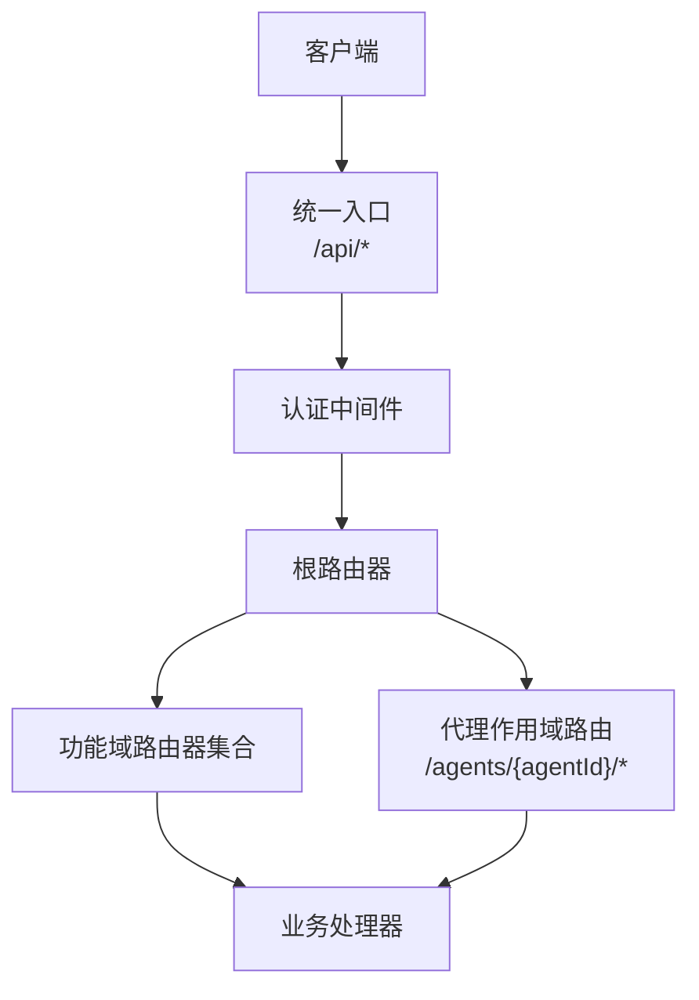
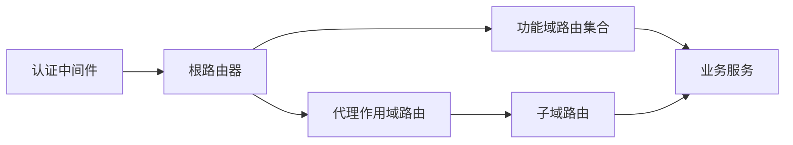

# RESTful API

<cite>
**本文引用的文件**
- [src/qwenpaw/app/routers/__init__.py](file://src/qwenpaw/app/routers/__init__.py)
- [src/qwenpaw/app/routers/agent.py](file://src/qwenpaw/app/routers/agent.py)
- [src/qwenpaw/app/routers/agent_scoped.py](file://src/qwenpaw/app/routers/agent_scoped.py)
- [src/qwenpaw/app/routers/agents.py](file://src/qwenpaw/app/routers/agents.py)
- [src/qwenpaw/app/routers/auth.py](file://src/qwenpaw/app/routers/auth.py)
- [src/qwenpaw/app/routers/backup.py](file://src/qwenpaw/app/routers/backup.py)
- [src/qwenpaw/app/routers/config.py](file://src/qwenpaw/app/routers/config.py)
- [src/qwenpaw/app/routers/console.py](file://src/qwenpaw/app/routers/console.py)
- [src/qwenpaw/app/routers/envs.py](file://src/qwenpaw/app/routers/envs.py)
- [src/qwenpaw/app/routers/files.py](file://src/qwenpaw/app/routers/files.py)
- [src/qwenpaw/app/routers/local_models.py](file://src/qwenpaw/app/routers/local_models.py)
- [src/qwenpaw/app/routers/mcp.py](file://src/qwenpaw/app/routers/mcp.py)
- [src/qwenpaw/app/routers/messages.py](file://src/qwenpaw/app/routers/messages.py)
- [src/qwenpaw/app/routers/plugins.py](file://src/qwenpaw/app/routers/plugins.py)
- [src/qwenpaw/app/routers/providers.py](file://src/qwenpaw/app/routers/providers.py)
- [src/qwenpaw/app/routers/schemas_config.py](file://src/qwenpaw/app/routers/schemas_config.py)
- [src/qwenpaw/app/routers/settings.py](file://src/qwenpaw/app/routers/settings.py)
- [src/qwenpaw/app/routers/skills.py](file://src/qwenpaw/app/routers/skills.py)
- [src/qwenpaw/app/routers/skills_stream.py](file://src/qwenpaw/app/routers/skills_stream.py)
- [src/qwenpaw/app/routers/token_usage.py](file://src/qwenpaw/app/routers/token_usage.py)
- [src/qwenpaw/app/routers/workspace.py](file://src/qwenpaw/app/routers/workspace.py)
- [src/qwenpaw/app/auth.py](file://src/qwenpaw/app/auth.py)
- [src/qwenpaw/constant.py](file://src/qwenpaw/constant.py)
- [website/public/docs/api-tutorial.en.md](file://website/public/docs/api-tutorial.en.md)
- [website/public/docs/api-tutorial.zh.md](file://website/public/docs/api-tutorial.zh.md)
- [README.md](file://README.md)
- [README_zh.md](file://README_zh.md)
</cite>

## 目录
1. [简介](#简介)
2. [项目结构](#项目结构)
3. [核心组件](#核心组件)
4. [架构总览](#架构总览)
5. [详细组件分析](#详细组件分析)
6. [依赖分析](#依赖分析)
7. [性能考虑](#性能考虑)
8. [故障排除指南](#故障排除指南)
9. [结论](#结论)
10. [附录](#附录)

## 简介
本文件为 QwenPaw 的 RESTful API 完整文档，覆盖所有 HTTP 端点的规范与行为，包括：
- 端点路径、HTTP 方法（GET/POST/PUT/DELETE）、请求参数、响应格式与状态码
- 认证与权限控制机制
- 分页、过滤、排序等通用能力
- 版本控制与向后兼容策略
- 第三方集成指南与常见错误处理建议

QwenPaw 提供统一的后端服务入口，前端通过 API 路由模块进行组织，核心路由集中在应用层的路由器目录中。

## 项目结构
后端采用模块化路由设计，按功能域划分多个路由器，并在根级聚合注册。关键结构如下：
- 根路由器：集中注册各功能域子路由
- 功能域路由器：如 agents、auth、backup、console、envs、files、local_models、mcp、messages、plugins、providers、schemas_config、settings、skills、skills_stream、token_usage、workspace 等
- 代理作用域路由：以 /agents/{agentId} 为前缀，聚合该代理下的子域路由（agent、chats、config、cron、mcp、skills、tools、workspace、console、plugins）

```mermaid
graph TB
Root["根路由器<br/>src/qwenpaw/app/routers/__init__.py"] --> Agents["代理列表路由<br/>src/qwenpaw/app/routers/agents.py"]
Root --> AgentScoped["代理作用域路由<br/>src/qwenpaw/app/routers/agent_scoped.py"]
Root --> Auth["认证路由<br/>src/qwenpaw/app/routers/auth.py"]
Root --> Backup["备份路由<br/>src/qwenpaw/app/routers/backup.py"]
Root --> Console["控制台路由<br/>src/qwenpaw/app/routers/console.py"]
Root --> Envs["环境变量路由<br/>src/qwenpaw/app/routers/envs.py"]
Root --> Files["文件路由<br/>src/qwenpaw/app/routers/files.py"]
Root --> LocalModels["本地模型路由<br/>src/qwenpaw/app/routers/local_models.py"]
Root --> MCP["MCP 路由<br/>src/qwenpaw/app/routers/mcp.py"]
Root --> Messages["消息路由<br/>src/qwenpaw/app/routers/messages.py"]
Root --> Plugins["插件路由<br/>src/qwenpaw/app/routers/plugins.py"]
Root --> Providers["提供商路由<br/>src/qwenpaw/app/routers/providers.py"]
Root --> SchemasConfig["模式配置路由<br/>src/qwenpaw/app/routers/schemas_config.py"]
Root --> Settings["设置路由<br/>src/qwenpaw/app/routers/settings.py"]
Root --> Skills["技能路由<br/>src/qwenpaw/app/routers/skills.py"]
Root --> SkillsStream["技能流路由<br/>src/qwenpaw/app/routers/skills_stream.py"]
Root --> TokenUsage["令牌用量路由<br/>src/qwenpaw/app/routers/token_usage.py"]
Root --> Workspace["工作区路由<br/>src/qwenpaw/app/routers/workspace.py"]
AgentScoped --> AgentScopedSub["代理作用域子路由<br/>agent/chats/config/cron/mcp/skills/tools/workspace/console/plugins"]
```

图表来源
- [src/qwenpaw/app/routers/__init__.py](file://src/qwenpaw/app/routers/__init__.py)
- [src/qwenpaw/app/routers/agent_scoped.py](file://src/qwenpaw/app/routers/agent_scoped.py)

章节来源
- [src/qwenpaw/app/routers/__init__.py](file://src/qwenpaw/app/routers/__init__.py)
- [src/qwenpaw/app/routers/agent_scoped.py](file://src/qwenpaw/app/routers/agent_scoped.py)

## 核心组件
- 根路由器：负责挂载所有功能域路由，形成统一的 API 前缀与命名空间
- 认证与权限：基于 JWT 的认证体系，支持单点与全局撤销；本地回环地址可绕过认证
- 代理作用域路由：以 /agents/{agentId} 为前缀，聚合该代理下的子域路由，便于按代理维度管理资源
- 通用能力：分页、过滤、排序等通过查询参数实现，遵循 REST 设计原则

章节来源
- [src/qwenpaw/app/routers/__init__.py](file://src/qwenpaw/app/routers/__init__.py)
- [src/qwenpaw/app/routers/agent_scoped.py](file://src/qwenpaw/app/routers/agent_scoped.py)
- [src/qwenpaw/app/auth.py](file://src/qwenpaw/app/auth.py)
- [src/qwenpaw/constant.py](file://src/qwenpaw/constant.py)

## 架构总览
下图展示 API 的总体交互关系：客户端通过统一前缀访问各功能域；认证中间件在进入业务逻辑前进行鉴权；代理作用域路由将请求定向到对应代理的子域。

图表来源
- [src/qwenpaw/app/routers/__init__.py](file://src/qwenpaw/app/routers/__init__.py)
- [src/qwenpaw/app/routers/agent_scoped.py](file://src/qwenpaw/app/routers/agent_scoped.py)
- [src/qwenpaw/app/auth.py](file://src/qwenpaw/app/auth.py)

## 详细组件分析

### 认证与授权（/api/auth）
- 功能概述
  - 登录、登出、更新资料、撤销单个或全部令牌
  - 支持从本地回环地址绕过认证
  - 令牌有效期可配置，默认约 7 天，最大可达 100 年
- 关键端点
  - POST /api/auth/login
  - POST /api/auth/logout
  - POST /api/auth/revoke-token
  - POST /api/auth/revoke-all-tokens
  - POST /api/auth/update-profile
- 请求与响应
  - 登录：用户名/密码换取 JWT；成功返回 token 及用户信息
  - 撤销令牌：支持按当前会话撤销或指定 token 撤销；支持全量撤销
  - 更新资料：修改密码时会旋转密钥，导致旧令牌失效
- 状态码
  - 成功：200/201
  - 参数错误/鉴权失败：400/401
  - 资源不存在/冲突：404/409
  - 服务器错误：500
- 示例
  - 登录成功响应包含 token 字段
  - 撤销单个令牌成功响应包含 revoked 与 revoked_current_token 字段
  - 全量撤销成功响应包含 revoked 字段
- 错误处理
  - 令牌过期或无效：401
  - 密码错误：400
  - 需要管理员权限：403
  - 服务器异常：500

章节来源
- [src/qwenpaw/app/routers/auth.py](file://src/qwenpaw/app/routers/auth.py)
- [src/qwenpaw/app/auth.py](file://src/qwenpaw/app/auth.py)
- [website/public/docs/api-tutorial.en.md](file://website/public/docs/api-tutorial.en.md)
- [website/public/docs/api-tutorial.zh.md](file://website/public/docs/api-tutorial.zh.md)

### 代理管理（/api/agents）
- 功能概述
  - 列出代理、创建代理、更新代理、删除代理
  - 获取代理详情、统计信息
- 关键端点
  - GET /api/agents
  - POST /api/agents
  - GET /api/agents/{agentId}
  - PUT /api/agents/{agentId}
  - DELETE /api/agents/{agentId}
  - GET /api/agents/{agentId}/stats
- 查询参数
  - 分页：page、size
  - 过滤：status、provider、name 等（视具体实现而定）
  - 排序：created_at、updated_at 等
- 请求体字段
  - 创建/更新时需提供代理配置（名称、模型、描述等）
- 响应
  - 列表：分页对象，包含数据数组与元信息
  - 单条：代理对象
  - 统计：时间序列或汇总指标
- 状态码
  - 成功：200/201
  - 参数错误/鉴权失败：400/401
  - 资源不存在：404
  - 冲突/服务器错误：409/500

章节来源
- [src/qwenpaw/app/routers/agents.py](file://src/qwenpaw/app/routers/agents.py)
- [src/qwenpaw/app/routers/agent.py](file://src/qwenpaw/app/routers/agent.py)
- [src/qwenpaw/app/routers/agent_stats.py](file://src/qwenpaw/app/routers/agent_stats.py)

### 代理作用域路由（/api/agents/{agentId}/*）
- 功能概述
  - 将代理相关的子域路由聚合到统一前缀下，便于按代理维度管理
  - 子域包括：agent、chats、config、cron、mcp、skills、tools、workspace、console、plugins
- 使用方式
  - 所有子域均以 /api/agents/{agentId} 为前缀
  - 通过 agentId 限定资源范围，避免跨代理访问
- 注意事项
  - 子域路由各自维护其内部的 CRUD 行为与参数规范
  - 权限控制以代理维度进行校验

章节来源
- [src/qwenpaw/app/routers/agent_scoped.py](file://src/qwenpaw/app/routers/agent_scoped.py)

### 控制台与会话（/api/console, /api/messages）
- 功能概述
  - 控制台推送、心跳、消息收发
  - 支持流式输出与非流式输出
- 关键端点
  - GET /api/console/push-store
  - POST /api/messages/send
  - GET /api/messages/stream
- 流式接口
  - 通过 SSE 或长连接实现事件流
  - 客户端需正确处理断线重连与错误恢复
- 状态码
  - 成功：200
  - 参数错误/鉴权失败：400/401
  - 服务器错误：500

章节来源
- [src/qwenpaw/app/routers/console.py](file://src/qwenpaw/app/routers/console.py)
- [src/qwenpaw/app/routers/messages.py](file://src/qwenpaw/app/routers/messages.py)

### 备份与恢复（/api/backup）
- 功能概述
  - 创建备份、列出备份、恢复备份、删除备份
- 关键端点
  - POST /api/backup/create
  - GET /api/backup/list
  - POST /api/backup/restore
  - DELETE /api/backup/{id}
- 请求体与响应
  - 创建：触发后台任务，返回任务 ID
  - 列表：分页返回备份清单
  - 恢复：选择备份 ID 触发恢复流程
  - 删除：删除指定备份文件
- 状态码
  - 成功：200/201
  - 参数错误/鉴权失败：400/401
  - 资源不存在：404
  - 服务器错误：500

章节来源
- [src/qwenpaw/app/routers/backup.py](file://src/qwenpaw/app/routers/backup.py)

### 环境变量与设置（/api/envs, /api/settings）
- 功能概述
  - 管理运行时环境变量与系统设置
- 关键端点
  - GET /api/envs
  - PUT /api/envs
  - GET /api/settings
  - PUT /api/settings
- 请求体与响应
  - 环境变量：键值对集合
  - 设置：系统配置项集合
- 状态码
  - 成功：200
  - 参数错误/鉴权失败：400/401
  - 服务器错误：500

章节来源
- [src/qwenpaw/app/routers/envs.py](file://src/qwenpaw/app/routers/envs.py)
- [src/qwenpaw/app/routers/settings.py](file://src/qwenpaw/app/routers/settings.py)

### 文件与本地模型（/api/files, /api/local-models）
- 功能概述
  - 文件上传、下载、删除与列表
  - 本地模型管理（下载、安装、卸载）
- 关键端点
  - POST /api/files/upload
  - GET /api/files/download/{fileId}
  - DELETE /api/files/{fileId}
  - GET /api/files
  - POST /api/local-models/download
  - POST /api/local-models/install
  - POST /api/local-models/uninstall
- 请求体与响应
  - 文件：multipart/form-data 上传；返回文件元信息
  - 本地模型：返回任务 ID 与进度
- 状态码
  - 成功：200/201
  - 参数错误/鉴权失败：400/401
  - 服务器错误：500

章节来源
- [src/qwenpaw/app/routers/files.py](file://src/qwenpaw/app/routers/files.py)
- [src/qwenpaw/app/routers/local_models.py](file://src/qwenpaw/app/routers/local_models.py)

### MCP（/api/mcp）
- 功能概述
  - MCP 客户端与服务端交互，支持状态同步与观察者模式
- 关键端点
  - GET /api/mcp/state
  - POST /api/mcp/watch
  - POST /api/mcp/unwatch
- 请求体与响应
  - watch/unwatch：订阅/取消订阅 MCP 状态变更
  - state：返回当前 MCP 状态快照
- 状态码
  - 成功：200
  - 参数错误/鉴权失败：400/401
  - 服务器错误：500

章节来源
- [src/qwenpaw/app/routers/mcp.py](file://src/qwenpaw/app/routers/mcp.py)

### 技能与工具（/api/skills, /api/tools）
- 功能概述
  - 技能管理（启用/禁用、批量操作）
  - 工具管理（注册、执行、结果查询）
- 关键端点
  - GET /api/skills
  - POST /api/skills/batch-action
  - GET /api/tools
  - POST /api/tools/execute
- 请求体与响应
  - 批量操作：传入技能 ID 列表与动作类型
  - 工具执行：传入工具参数，返回执行结果
- 状态码
  - 成功：200/201
  - 参数错误/鉴权失败：400/401
  - 服务器错误：500

章节来源
- [src/qwenpaw/app/routers/skills.py](file://src/qwenpaw/app/routers/skills.py)
- [src/qwenpaw/app/routers/skills_stream.py](file://src/qwenpaw/app/routers/skills_stream.py)
- [src/qwenpaw/app/routers/tools.py](file://src/qwenpaw/app/routers/tools.py)

### 插件与提供商（/api/plugins, /api/providers）
- 功能概述
  - 插件生命周期管理（安装、卸载、启用、禁用）
  - 提供商配置与能力探测
- 关键端点
  - GET /api/plugins
  - POST /api/plugins/install
  - POST /api/plugins/uninstall
  - GET /api/providers
  - POST /api/providers/detect-capabilities
- 请求体与响应
  - 插件：返回安装任务 ID 与状态
  - 提供商：返回能力清单与可用性
- 状态码
  - 成功：200/201
  - 参数错误/鉴权失败：400/401
  - 服务器错误：500

章节来源
- [src/qwenpaw/app/routers/plugins.py](file://src/qwenpaw/app/routers/plugins.py)
- [src/qwenpaw/app/routers/providers.py](file://src/qwenpaw/app/routers/providers.py)

### 模式配置（/api/schemas-config）
- 功能概述
  - 动态模式配置与校验
- 关键端点
  - GET /api/schemas-config
  - PUT /api/schemas-config
- 请求体与响应
  - 返回当前模式配置与校验规则
- 状态码
  - 成功：200
  - 参数错误/鉴权失败：400/401
  - 服务器错误：500

章节来源
- [src/qwenpaw/app/routers/schemas_config.py](file://src/qwenpaw/app/routers/schemas_config.py)

### 令牌用量（/api/token-usage）
- 功能概述
  - 查询代理或系统的令牌用量统计
- 关键端点
  - GET /api/token-usage
- 查询参数
  - 时间范围、代理 ID、模型类型等
- 响应
  - 返回用量时间序列或汇总
- 状态码
  - 成功：200
  - 参数错误/鉴权失败：400/401
  - 服务器错误：500

章节来源
- [src/qwenpaw/app/routers/token_usage.py](file://src/qwenpaw/app/routers/token_usage.py)

### 工作区（/api/workspace）
- 功能概述
  - 工作区资源管理（创建、更新、删除、克隆）
- 关键端点
  - GET /api/workspace
  - POST /api/workspace
  - PUT /api/workspace/{id}
  - DELETE /api/workspace/{id}
- 请求体与响应
  - 返回工作区清单或单个工作区详情
- 状态码
  - 成功：200/201
  - 参数错误/鉴权失败：400/401
  - 服务器错误：500

章节来源
- [src/qwenpaw/app/routers/workspace.py](file://src/qwenpaw/app/routers/workspace.py)

## 依赖分析
- 路由耦合
  - 根路由器集中注册各功能域路由，降低上层调用复杂度
  - 代理作用域路由通过 include_router 聚合子域，保持清晰的命名空间
- 中间件与认证
  - 认证中间件在进入业务逻辑前统一拦截，确保安全边界
- 外部依赖
  - 提供商对接、文件存储、本地模型下载等依赖外部系统，需关注超时与重试策略

图表来源
- [src/qwenpaw/app/routers/__init__.py](file://src/qwenpaw/app/routers/__init__.py)
- [src/qwenpaw/app/routers/agent_scoped.py](file://src/qwenpaw/app/routers/agent_scoped.py)
- [src/qwenpaw/app/auth.py](file://src/qwenpaw/app/auth.py)

## 性能考虑
- 分页与过滤
  - 列表接口默认支持分页参数（page、size），建议客户端按需请求，避免一次性拉取大量数据
  - 过滤与排序参数需结合索引优化，避免全表扫描
- 流式输出
  - 技能流与消息流采用事件流传输，注意客户端的缓冲与背压处理
- 缓存与并发
  - 对于只读查询，可在网关或应用层引入缓存，减少重复计算
  - 并发写入需关注锁竞争与幂等性设计

## 故障排除指南
- 认证失败
  - 检查 Authorization 头是否携带有效 JWT；确认本地回环地址是否被正确识别
  - 若令牌被撤销，请重新登录获取新令牌
- 404 资源不存在
  - 确认路径参数（如 agentId、fileId）是否正确
  - 检查资源是否已被删除或未初始化
- 500 服务器错误
  - 查看服务端日志定位异常堆栈
  - 对于长时间运行的任务（如备份、模型下载），检查任务队列与存储状态
- 速率限制
  - 避免过于频繁的请求，合理退避重试
- 本地回环绕过
  - 在开发环境，127.0.0.1 或 ::1 的请求可能跳过认证，生产环境请确保网络隔离

章节来源
- [src/qwenpaw/app/auth.py](file://src/qwenpaw/app/auth.py)
- [website/public/docs/api-tutorial.en.md](file://website/public/docs/api-tutorial.en.md)

## 结论
QwenPaw 的 RESTful API 采用模块化路由设计，围绕代理维度提供细粒度的资源管理能力。通过统一的认证与权限控制、完善的分页与过滤机制，以及对流式输出与任务型接口的支持，满足多场景的集成需求。建议第三方在生产环境中严格管理令牌、合理使用分页与过滤、关注流式接口的断线重连与错误恢复。

## 附录

### 通用查询参数与分页
- 分页：page、size
- 过滤：根据资源类型支持 status、provider、name、created_at 等
- 排序：支持 asc/desc，按 created_at、updated_at 等字段排序

章节来源
- [src/qwenpaw/app/routers/agents.py](file://src/qwenpaw/app/routers/agents.py)
- [src/qwenpaw/app/routers/backup.py](file://src/qwenpaw/app/routers/backup.py)
- [src/qwenpaw/app/routers/files.py](file://src/qwenpaw/app/routers/files.py)
- [src/qwenpaw/app/routers/skills.py](file://src/qwenpaw/app/routers/skills.py)

### 版本控制与向后兼容
- API 前缀：/api/*
- 版本策略：当前仓库未显式声明 API 版本号，建议客户端固定前缀并监控变更
- 向后兼容：新增字段以可选形式提供，不破坏现有客户端；删除字段或变更语义时需谨慎

章节来源
- [src/qwenpaw/app/routers/__init__.py](file://src/qwenpaw/app/routers/__init__.py)
- [README.md](file://README.md)
- [README_zh.md](file://README_zh.md)

### 第三方集成最佳实践
- 认证
  - 使用 /api/auth/login 获取 JWT，并在后续请求头中携带 Authorization: Bearer <token>
  - 本地开发可利用回环地址绕过认证，但生产环境必须启用鉴权
- 错误处理
  - 对 4xx 错误进行参数修正与重试；对 5xx 错误进行指数退避与告警
- 流式接口
  - 正确解析事件流，处理断开与重连；对异常事件进行降级处理
- 任务型接口
  - 对耗时操作（备份、模型下载）轮询任务状态，避免阻塞主线程

章节来源
- [src/qwenpaw/app/routers/auth.py](file://src/qwenpaw/app/routers/auth.py)
- [src/qwenpaw/app/routers/backup.py](file://src/qwenpaw/app/routers/backup.py)
- [src/qwenpaw/app/routers/local_models.py](file://src/qwenpaw/app/routers/local_models.py)
- [website/public/docs/api-tutorial.en.md](file://website/public/docs/api-tutorial.en.md)