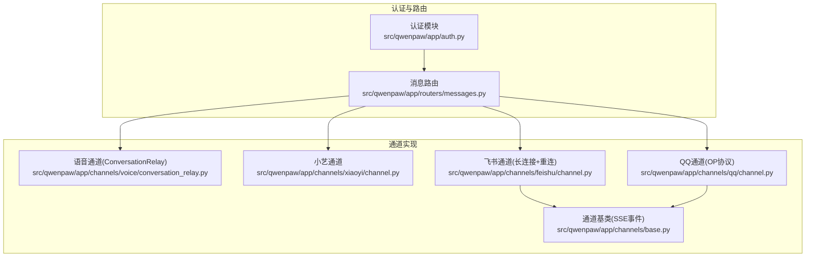
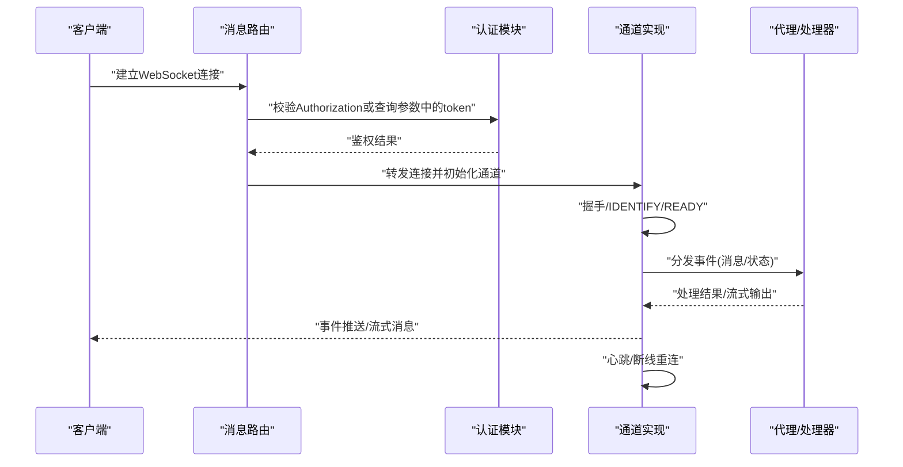
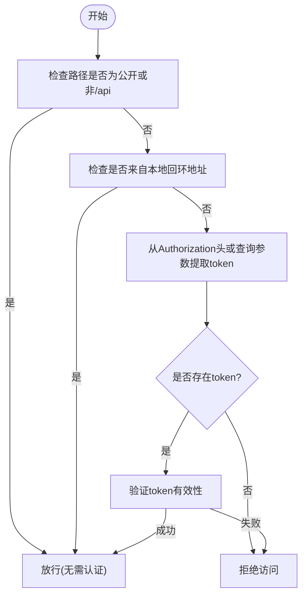
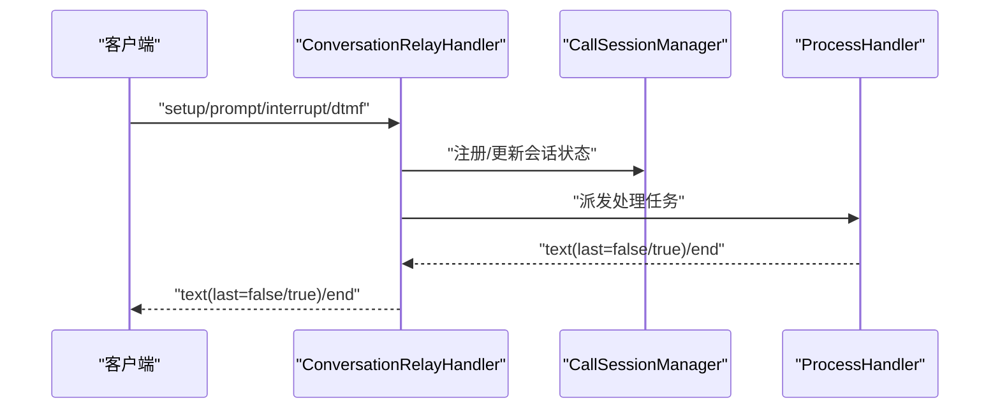
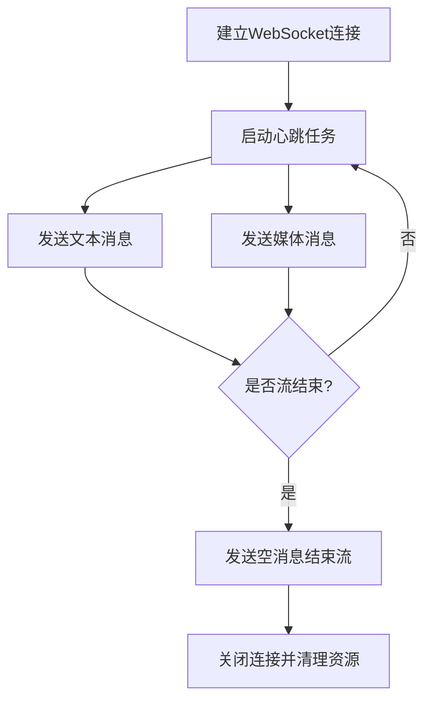
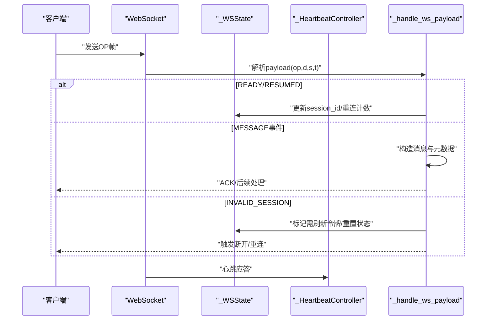
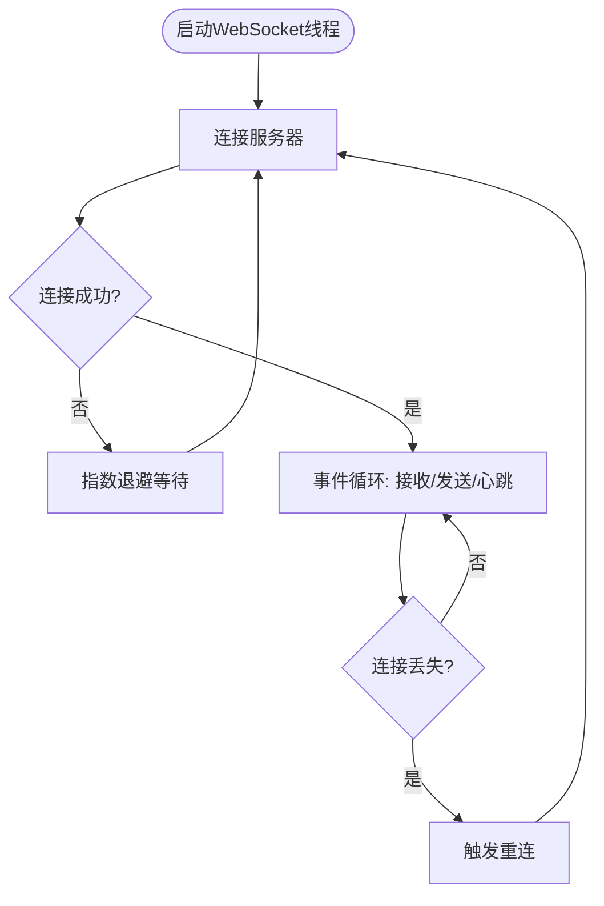
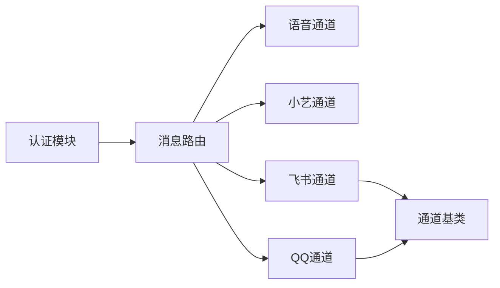

# WebSocket接口

<cite>
**本文引用的文件**
- [src/qwenpaw/app/auth.py](file://src/qwenpaw/app/auth.py)
- [src/qwenpaw/app/channels/voice/conversation_relay.py](file://src/qwenpaw/app/channels/voice/conversation_relay.py)
- [src/qwenpaw/app/channels/xiaoyi/channel.py](file://src/qwenpaw/app/channels/xiaoyi/channel.py)
- [src/qwenpaw/app/channels/qq/channel.py](file://src/qwenpaw/app/channels/qq/channel.py)
- [src/qwenpaw/app/channels/feishu/channel.py](file://src/qwenpaw/app/channels/feishu/channel.py)
- [src/qwenpaw/app/channels/base.py](file://src/qwenpaw/app/channels/base.py)
- [src/qwenpaw/app/routers/messages.py](file://src/qwenpaw/app/routers/messages.py)
- [website/public/docs/api-tutorial.zh.md](file://website/public/docs/api-tutorial.zh.md)
</cite>

## 目录
1. [简介](#简介)
2. [项目结构](#项目结构)
3. [核心组件](#核心组件)
4. [架构总览](#架构总览)
5. [详细组件分析](#详细组件分析)
6. [依赖关系分析](#依赖关系分析)
7. [性能考虑](#性能考虑)
8. [故障排查指南](#故障排查指南)
9. [结论](#结论)
10. [附录](#附录)

## 简介
本文件面向需要在QwenPaw系统中集成实时通信能力的开发者，提供WebSocket接口的权威技术参考。内容涵盖连接建立流程、认证机制与连接参数、消息格式规范（JSON结构、字段定义与数据类型）、事件类型处理（消息推送、状态更新、技能流传输等）、客户端连接示例与消息收发代码片段路径、连接管理与重连策略、错误处理与最佳实践，以及性能优化建议。

## 项目结构
QwenPaw的WebSocket相关实现主要分布在以下模块：
- 认证与授权：负责从HTTP头部或WebSocket查询参数提取令牌并进行鉴权
- 语音通道（Twilio ConversationRelay）：提供基于FastAPI WebSocket的双向消息通道
- 小艺通道（XiaoYi）：实现WebSocket连接、心跳、消息发送与最终消息结束标记
- QQ频道通道：实现Discord风格的OP码协议、事件分发、心跳与断线恢复
- 飞书通道：实现WebSocket长连接、指数退避重连、线程化运行与状态检查
- 基类通道：统一SSE事件输出格式，便于理解事件流的通用模式
- 路由层：提供消息相关接口，支撑WebSocket上游业务

**图表来源**
- [src/qwenpaw/app/auth.py](file://src/qwenpaw/app/auth.py)
- [src/qwenpaw/app/routers/messages.py](file://src/qwenpaw/app/routers/messages.py)
- [src/qwenpaw/app/channels/voice/conversation_relay.py](file://src/qwenpaw/app/channels/voice/conversation_relay.py)
- [src/qwenpaw/app/channels/xiaoyi/channel.py](file://src/qwenpaw/app/channels/xiaoyi/channel.py)
- [src/qwenpaw/app/channels/qq/channel.py](file://src/qwenpaw/app/channels/qq/channel.py)
- [src/qwenpaw/app/channels/feishu/channel.py](file://src/qwenpaw/app/channels/feishu/channel.py)
- [src/qwenpaw/app/channels/base.py](file://src/qwenpaw/app/channels/base.py)

**章节来源**
- [src/qwenpaw/app/auth.py](file://src/qwenpaw/app/auth.py)
- [src/qwenpaw/app/routers/messages.py](file://src/qwenpaw/app/routers/messages.py)
- [src/qwenpaw/app/channels/voice/conversation_relay.py](file://src/qwenpaw/app/channels/voice/conversation_relay.py)
- [src/qwenpaw/app/channels/xiaoyi/channel.py](file://src/qwenpaw/app/channels/xiaoyi/channel.py)
- [src/qwenpaw/app/channels/qq/channel.py](file://src/qwenpaw/app/channels/qq/channel.py)
- [src/qwenpaw/app/channels/feishu/channel.py](file://src/qwenpaw/app/channels/feishu/channel.py)
- [src/qwenpaw/app/channels/base.py](file://src/qwenpaw/app/channels/base.py)

## 核心组件
- 认证与授权
  - 支持从Authorization头或WebSocket查询参数提取Bearer令牌
  - 对特定路径与来源（如本地回环地址）进行豁免处理
- 语音通道（ConversationRelay）
  - 使用FastAPI WebSocket处理单次通话会话
  - 定义了setup、prompt、interrupt、dtmf等输入事件与text、end等输出事件
- 小艺通道
  - 实现WebSocket连接、心跳、媒体与文本消息发送
  - 提供最终空消息以结束流式传输
- QQ通道
  - 实现Discord风格的OP码协议（IDENTIFY、HEARTBEAT、EVENT等）
  - 维护会话状态、序列号、心跳控制器与重连计数
- 飞书通道
  - 基于线程的WebSocket事件循环，支持指数退避重连
  - 提供健康检查与状态报告
- 通道基类
  - 统一SSE事件输出格式，便于理解事件流的通用模式

**章节来源**
- [src/qwenpaw/app/auth.py](file://src/qwenpaw/app/auth.py)
- [src/qwenpaw/app/channels/voice/conversation_relay.py](file://src/qwenpaw/app/channels/voice/conversation_relay.py)
- [src/qwenpaw/app/channels/xiaoyi/channel.py](file://src/qwenpaw/app/channels/xiaoyi/channel.py)
- [src/qwenpaw/app/channels/qq/channel.py](file://src/qwenpaw/app/channels/qq/channel.py)
- [src/qwenpaw/app/channels/feishu/channel.py](file://src/qwenpaw/app/channels/feishu/channel.py)
- [src/qwenpaw/app/channels/base.py](file://src/qwenpaw/app/channels/base.py)

## 架构总览
下图展示了WebSocket在QwenPaw中的整体交互：客户端通过路由接入，经认证后进入具体通道；通道根据协议实现连接、心跳、事件分发与消息收发。

**图表来源**
- [src/qwenpaw/app/routers/messages.py](file://src/qwenpaw/app/routers/messages.py)
- [src/qwenpaw/app/auth.py](file://src/qwenpaw/app/auth.py)
- [src/qwenpaw/app/channels/qq/channel.py](file://src/qwenpaw/app/channels/qq/channel.py)
- [src/qwenpaw/app/channels/feishu/channel.py](file://src/qwenpaw/app/channels/feishu/channel.py)
- [src/qwenpaw/app/channels/voice/conversation_relay.py](file://src/qwenpaw/app/channels/voice/conversation_relay.py)
- [src/qwenpaw/app/channels/xiaoyi/channel.py](file://src/qwenpaw/app/channels/xiaoyi/channel.py)

## 详细组件分析

### 认证与连接参数
- 认证来源
  - Authorization头：Bearer <token>
  - WebSocket查询参数：token=<token>
  - 本地回环地址（127.0.0.1、::1）可豁免认证
- 公开路径与前缀豁免：对非/api路径或公开前缀路径不强制鉴权
- 令牌有效期与撤销：登录接口支持自定义有效期，提供单令牌撤销与全部令牌撤销接口

**图表来源**
- [src/qwenpaw/app/auth.py](file://src/qwenpaw/app/auth.py)
- [website/public/docs/api-tutorial.zh.md](file://website/public/docs/api-tutorial.zh.md)

**章节来源**
- [src/qwenpaw/app/auth.py](file://src/qwenpaw/app/auth.py)
- [website/public/docs/api-tutorial.zh.md](file://website/public/docs/api-tutorial.zh.md)

### 语音通道（ConversationRelay）
- 输入事件
  - setup：建立会话，携带通话标识与发起方信息
  - prompt：语音转写文本
  - interrupt：中断信息
  - dtmf：按键输入
- 输出事件
  - text：流式文本块，last=false表示持续，last=true表示结束
  - end：会话结束
- 会话管理
  - 单次通话一个WebSocket会话
  - 异常时返回统一错误消息

**图表来源**
- [src/qwenpaw/app/channels/voice/conversation_relay.py](file://src/qwenpaw/app/channels/voice/conversation_relay.py)

**章节来源**
- [src/qwenpaw/app/channels/voice/conversation_relay.py](file://src/qwenpaw/app/channels/voice/conversation_relay.py)

### 小艺通道（XiaoYi）
- 连接与心跳
  - 维护WebSocket连接状态，发送心跳包
- 消息发送
  - 文本消息：send(to_handle, text, meta)
  - 媒体消息：send_media(to_handle, part, meta)
  - 结束流：send_final_message(session_id, task_id, message_id)
- 断开与清理
  - 停止时取消任务、关闭WebSocket、注销活动连接

**图表来源**
- [src/qwenpaw/app/channels/xiaoyi/channel.py](file://src/qwenpaw/app/channels/xiaoyi/channel.py)

**章节来源**
- [src/qwenpaw/app/channels/xiaoyi/channel.py](file://src/qwenpaw/app/channels/xiaoyi/channel.py)

### QQ通道（Discord风格OP协议）
- 协议要点
  - OP码：IDENTIFY、HEARTBEAT、EVENT、RECONNECT、INVALID_SESSION等
  - 事件类型：READY、RESUMED、消息事件等
  - 维护会话ID、序列号、重连次数与心跳控制器
- 事件分发
  - 根据事件类型映射到消息处理逻辑
  - 构造元数据（消息类型、发送者、附件等）

**图表来源**
- [src/qwenpaw/app/channels/qq/channel.py](file://src/qwenpaw/app/channels/qq/channel.py)

**章节来源**
- [src/qwenpaw/app/channels/qq/channel.py](file://src/qwenpaw/app/channels/qq/channel.py)

### 飞书通道（长连接+指数退避重连）
- 运行模型
  - 线程化事件循环，封装WebSocket生命周期
  - 指数退避重连，避免频繁重试
- 健康检查
  - 提供状态检查与问题诊断
  - 日志覆盖连接、断开、重连、异常等关键节点

**图表来源**
- [src/qwenpaw/app/channels/feishu/channel.py](file://src/qwenpaw/app/channels/feishu/channel.py)

**章节来源**
- [src/qwenpaw/app/channels/feishu/channel.py](file://src/qwenpaw/app/channels/feishu/channel.py)

### 通道基类与SSE事件
- SSE事件输出
  - 统一以data: <JSON>\n\n形式输出
  - 支持对象序列化或字符串兜底
- 事件元数据
  - 可附加会话Webhook、机器人前缀等

**章节来源**
- [src/qwenpaw/app/channels/base.py](file://src/qwenpaw/app/channels/base.py)

## 依赖关系分析
- 认证模块被路由层调用，确保WebSocket接入前的身份校验
- 各通道实现独立维护连接状态与协议细节，但共享统一的事件/消息处理思想
- 飞书与QQ通道体现了不同协议风格（线程化长连接 vs Discord风格OP码）

**图表来源**
- [src/qwenpaw/app/auth.py](file://src/qwenpaw/app/auth.py)
- [src/qwenpaw/app/routers/messages.py](file://src/qwenpaw/app/routers/messages.py)
- [src/qwenpaw/app/channels/voice/conversation_relay.py](file://src/qwenpaw/app/channels/voice/conversation_relay.py)
- [src/qwenpaw/app/channels/xiaoyi/channel.py](file://src/qwenpaw/app/channels/xiaoyi/channel.py)
- [src/qwenpaw/app/channels/qq/channel.py](file://src/qwenpaw/app/channels/qq/channel.py)
- [src/qwenpaw/app/channels/feishu/channel.py](file://src/qwenpaw/app/channels/feishu/channel.py)
- [src/qwenpaw/app/channels/base.py](file://src/qwenpaw/app/channels/base.py)

**章节来源**
- [src/qwenpaw/app/auth.py](file://src/qwenpaw/app/auth.py)
- [src/qwenpaw/app/routers/messages.py](file://src/qwenpaw/app/routers/messages.py)
- [src/qwenpaw/app/channels/voice/conversation_relay.py](file://src/qwenpaw/app/channels/voice/conversation_relay.py)
- [src/qwenpaw/app/channels/xiaoyi/channel.py](file://src/qwenpaw/app/channels/xiaoyi/channel.py)
- [src/qwenpaw/app/channels/qq/channel.py](file://src/qwenpaw/app/channels/qq/channel.py)
- [src/qwenpaw/app/channels/feishu/channel.py](file://src/qwenpaw/app/channels/feishu/channel.py)
- [src/qwenpaw/app/channels/base.py](file://src/qwenpaw/app/channels/base.py)

## 性能考虑
- 心跳与保活
  - 保持合理的心跳周期，避免过于频繁导致带宽浪费
  - 在高延迟网络中适当增大心跳间隔
- 流式传输
  - 使用小块增量推送，降低首字节延迟
  - 在结束时发送空消息标记流结束，避免客户端阻塞
- 重连策略
  - 指数退避+抖动，防止雪崩效应
  - 设置最大重连次数与超时时间，避免无限占用资源
- 资源管理
  - 及时取消任务、关闭连接、释放会话资源
  - 对异常断开进行幂等处理，避免重复处理

## 故障排查指南
- 认证失败
  - 检查Authorization头或查询参数中的token是否正确传递
  - 确认令牌未过期且未被撤销
- 连接断开
  - 查看通道日志中的断开原因（如INVALID_SESSION、RECONNECT）
  - 对于飞书/小艺通道，确认线程事件循环状态与健康检查结果
- 消息未达
  - 确认事件类型映射与消息元数据构造是否正确
  - 检查通道是否处于已连接状态
- 重连异常
  - 观察指数退避是否生效，是否存在快速连续重连
  - 检查网络状况与服务端限流策略

**章节来源**
- [src/qwenpaw/app/channels/qq/channel.py](file://src/qwenpaw/app/channels/qq/channel.py)
- [src/qwenpaw/app/channels/feishu/channel.py](file://src/qwenpaw/app/channels/feishu/channel.py)
- [src/qwenpaw/app/channels/xiaoyi/channel.py](file://src/qwenpaw/app/channels/xiaoyi/channel.py)

## 结论
QwenPaw提供了多样化的WebSocket实现，覆盖语音、消息与长连接等多种场景。通过统一的认证与路由机制，结合各通道的协议适配与健壮的重连策略，能够满足复杂实时通信需求。建议在生产环境中遵循本文的连接参数、消息格式与重连策略，并结合性能与故障排查建议进行落地。

## 附录

### 连接参数与认证
- 认证方式
  - Authorization: Bearer <token>
  - 查询参数: token=<token>
- 本地豁免
  - 来自127.0.0.1或::1的请求可跳过认证
- 令牌管理
  - 登录接口支持自定义有效期
  - 支持单令牌撤销与全部令牌撤销

**章节来源**
- [src/qwenpaw/app/auth.py](file://src/qwenpaw/app/auth.py)
- [website/public/docs/api-tutorial.zh.md](file://website/public/docs/api-tutorial.zh.md)

### 消息格式规范（JSON结构）
- 语音通道事件
  - 输入：setup、prompt、interrupt、dtmf
  - 输出：text(last=false/true)、end
- 小艺通道消息
  - 文本消息：包含会话ID、任务ID、内容部件与最后标记
  - 媒体消息：包含媒体类型与内容
  - 结束消息：空文本、last=true、final=true
- QQ通道事件
  - 事件类型：READY、RESUMED、消息事件等
  - 元数据：消息类型、发送者、消息ID、附件等

**章节来源**
- [src/qwenpaw/app/channels/voice/conversation_relay.py](file://src/qwenpaw/app/channels/voice/conversation_relay.py)
- [src/qwenpaw/app/channels/xiaoyi/channel.py](file://src/qwenpaw/app/channels/xiaoyi/channel.py)
- [src/qwenpaw/app/channels/qq/channel.py](file://src/qwenpaw/app/channels/qq/channel.py)

### 客户端连接示例与消息收发（代码片段路径）
- 语音通道
  - 输入事件：[setup/prompt/interrupt/dtmf](file://src/qwenpaw/app/channels/voice/conversation_relay.py)
  - 输出事件：[text/end](file://src/qwenpaw/app/channels/voice/conversation_relay.py)
- 小艺通道
  - 发送文本：[send](file://src/qwenpaw/app/channels/xiaoyi/channel.py)
  - 发送媒体：[send_media](file://src/qwenpaw/app/channels/xiaoyi/channel.py)
  - 结束流：[send_final_message](file://src/qwenpaw/app/channels/xiaoyi/channel.py)
- QQ通道
  - 事件分发：[dispatch](file://src/qwenpaw/app/channels/qq/channel.py)
  - 状态更新：[READY/RESUMED](file://src/qwenpaw/app/channels/qq/channel.py)
- 飞书通道
  - 重连与日志：[reconnect/backoff/logging](file://src/qwenpaw/app/channels/feishu/channel.py)

**章节来源**
- [src/qwenpaw/app/channels/voice/conversation_relay.py](file://src/qwenpaw/app/channels/voice/conversation_relay.py)
- [src/qwenpaw/app/channels/xiaoyi/channel.py](file://src/qwenpaw/app/channels/xiaoyi/channel.py)
- [src/qwenpaw/app/channels/qq/channel.py](file://src/qwenpaw/app/channels/qq/channel.py)
- [src/qwenpaw/app/channels/feishu/channel.py](file://src/qwenpaw/app/channels/feishu/channel.py)