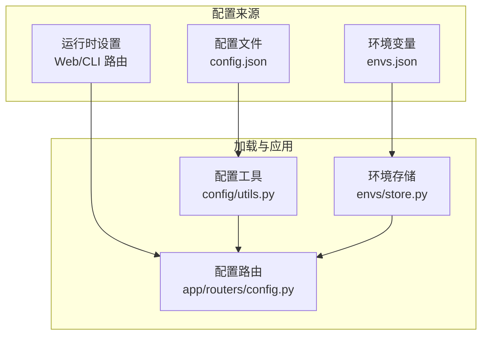
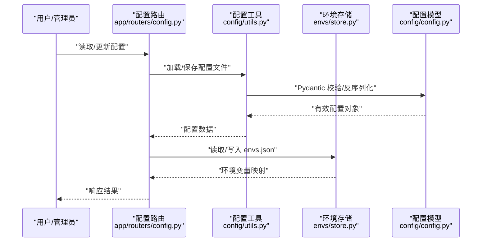
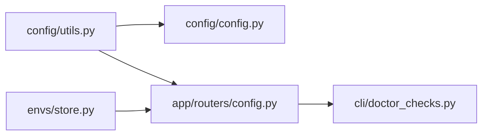

# 配置选项

<cite>
**本文引用的文件**
- [src/qwenpaw/config/config.py](file://src/qwenpaw/config/config.py)
- [src/qwenpaw/config/utils.py](file://src/qwenpaw/config/utils.py)
- [src/qwenpaw/envs/store.py](file://src/qwenpaw/envs/store.py)
- [src/qwenpaw/app/routers/config.py](file://src/qwenpaw/app/routers/config.py)
- [src/qwenpaw/app/routers/schemas_config.py](file://src/qwenpaw/app/routers/schemas_config.py)
- [src/qwenpaw/cli/doctor_checks.py](file://src/qwenpaw/cli/doctor_checks.py)
- [website/public/docs/config.zh.md](file://website/public/docs/config.zh.md)
- [website/public/docs/skills.zh.md](file://website/public/docs/skills.zh.md)
- [deploy/config/supervisord.conf.template](file://deploy/config/supervisord.conf.template)
- [scripts/docker_build.sh](file://scripts/docker_build.sh)
- [scripts/install.sh](file://scripts/install.sh)
- [scripts/install.bat](file://scripts/install.bat)
- [scripts/install.ps1](file://scripts/install.ps1)
- [README_zh.md](file://README_zh.md)
</cite>

## 目录
1. [简介](#简介)
2. [项目结构](#项目结构)
3. [核心组件](#核心组件)
4. [架构总览](#架构总览)
5. [详细组件分析](#详细组件分析)
6. [依赖分析](#依赖分析)
7. [性能考虑](#性能考虑)
8. [故障排查指南](#故障排查指南)
9. [结论](#结论)
10. [附录](#附录)

## 简介
本文件面向系统管理员与开发者，提供 QwenPaw 的配置选项完整指南。内容涵盖：
- 所有可用配置项：环境变量、配置文件参数、运行时设置
- 每个配置项的作用、默认值、允许范围与影响范围
- 配置文件完整示例与推荐模板
- 配置项之间的依赖关系与冲突
- 不同部署场景下的配置建议与最佳实践
- 配置优先级顺序与覆盖规则

## 项目结构
QwenPaw 的配置体系由“配置文件 + 环境变量 + 运行时设置”三部分组成，分别在以下模块中实现与管理：
- 配置文件：基于 Pydantic 模型定义，支持自动修复与严格校验
- 环境变量：持久化存储于 envs.json，并在启动时安全注入进程环境
- 运行时设置：通过 Web 控制台或 CLI 提供的路由接口进行读写

图表来源
- [src/qwenpaw/config/utils.py:491-588](file://src/qwenpaw/config/utils.py#L491-L588)
- [src/qwenpaw/envs/store.py:242-262](file://src/qwenpaw/envs/store.py#L242-L262)
- [src/qwenpaw/app/routers/config.py](file://src/qwenpaw/app/routers/config.py)

章节来源
- [src/qwenpaw/config/utils.py:491-588](file://src/qwenpaw/config/utils.py#L491-L588)
- [src/qwenpaw/envs/store.py:242-262](file://src/qwenpaw/envs/store.py#L242-L262)
- [src/qwenpaw/app/routers/config.py](file://src/qwenpaw/app/routers/config.py)

## 核心组件
- 配置模型与加载
  - 配置文件采用 Pydantic 模型进行结构化定义与校验，支持自动修复常见 JSON 语法问题，并在不可修复时回退到默认配置。
  - 支持严格校验模式用于诊断，不进行自动修复。
- 环境变量管理
  - 环境变量持久化为 envs.json；启动时仅注入非受保护键，且不覆盖已存在的系统/进程环境变量。
  - 提供增删改查接口，便于运行时维护。
- 运行时设置
  - 通过 Web 控制台与 CLI 路由暴露配置读写能力，支持按需更新并落盘保存。

章节来源
- [src/qwenpaw/config/utils.py:436-588](file://src/qwenpaw/config/utils.py#L436-L588)
- [src/qwenpaw/envs/store.py:220-262](file://src/qwenpaw/envs/store.py#L220-L262)
- [src/qwenpaw/app/routers/config.py](file://src/qwenpaw/app/routers/config.py)

## 架构总览
下图展示配置从文件到运行时的整体流程与关键交互点：

图表来源
- [src/qwenpaw/app/routers/config.py](file://src/qwenpaw/app/routers/config.py)
- [src/qwenpaw/config/utils.py:491-588](file://src/qwenpaw/config/utils.py#L491-L588)
- [src/qwenpaw/envs/store.py:220-262](file://src/qwenpaw/envs/store.py#L220-L262)
- [src/qwenpaw/config/config.py](file://src/qwenpaw/config/config.py)

## 详细组件分析

### 配置模型与字段定义
- 配置模型由 Pydantic 定义，包含根级字段与分组字段（如 agents、tools 等）。未知顶层键会被识别并报告，避免误用。
- 加载流程包含：
  - 文件存在性检查
  - JSON 读取与修复
  - 路径归一化与向后兼容字段迁移
  - Pydantic 校验与错误字段剔除后的二次校验
  - 回退策略：不可修复时备份原文件并返回默认配置

章节来源
- [src/qwenpaw/config/utils.py:456-531](file://src/qwenpaw/config/utils.py#L456-L531)
- [src/qwenpaw/cli/doctor_checks.py:254-281](file://src/qwenpaw/cli/doctor_checks.py#L254-L281)

### 环境变量管理
- 存储与注入
  - envs.json 持久化环境变量；启动时仅注入非受保护键，且不覆盖现有系统/进程环境变量。
  - 提供 set_env_var、delete_env_var、load_envs、save_envs 等接口。
- 技能注入
  - 技能元数据中声明的 env 依赖将被注入为环境变量；未声明的键仍可通过完整 JSON 读取。
  - 宿主进程已存在的同名环境变量不会被覆盖。

章节来源
- [src/qwenpaw/envs/store.py:220-262](file://src/qwenpaw/envs/store.py#L220-L262)
- [website/public/docs/skills.zh.md:282-337](file://website/public/docs/skills.zh.md#L282-L337)

### 运行时设置与控制台集成
- Web 路由
  - 提供配置读取与更新接口，支持增量更新与全量保存。
- CLI 诊断
  - 未知键扫描与严格校验，帮助定位配置错误。

章节来源
- [src/qwenpaw/app/routers/config.py](file://src/qwenpaw/app/routers/config.py)
- [src/qwenpaw/app/routers/schemas_config.py](file://src/qwenpaw/app/routers/schemas_config.py)
- [src/qwenpaw/cli/doctor_checks.py:246-281](file://src/qwenpaw/cli/doctor_checks.py#L246-L281)

### 配置优先级与覆盖规则
- 启动阶段
  - envs.json 注入到进程环境，但不覆盖系统/进程环境变量。
- 运行时
  - Web/CLI 更新的配置优先于静态配置文件，保存后生效。
- 技能注入
  - 仅注入受 requires.env 声明的键；宿主进程同名变量不被覆盖。

章节来源
- [src/qwenpaw/envs/store.py:242-262](file://src/qwenpaw/envs/store.py#L242-L262)
- [src/qwenpaw/app/routers/config.py](file://src/qwenpaw/app/routers/config.py)
- [website/public/docs/skills.zh.md:282-337](file://website/public/docs/skills.zh.md#L282-L337)

### 配置项分类与说明
以下为常见配置项类别与要点（具体字段以实际模型为准）：
- 全局设置
  - 作用：应用级基础行为控制（如调试、时区、心跳等）
  - 默认值：遵循模型默认
  - 允许范围：模型约束范围
  - 影响范围：全局
- 代理相关（agents）
  - 作用：代理工作区、模型选择、提示词模板等
  - 默认值：遵循模型默认
  - 允许范围：模型约束范围
  - 影响范围：对应代理
- 工具相关（tools）
  - 作用：工具启用、参数与权限控制
  - 默认值：遵循模型默认
  - 允许范围：模型约束范围
  - 影响范围：对应工具
- 渠道相关（channels）
  - 作用：各渠道接入参数（如机器人令牌、前缀等）
  - 默认值：遵循模型默认
  - 允许范围：模型约束范围
  - 影响范围：对应渠道
- 提供商相关（providers）
  - 作用：模型提供商凭据与能力开关
  - 默认值：遵循模型默认
  - 允许范围：模型约束范围
  - 影响范围：对应提供商
- 环境变量（envs）
  - 作用：持久化环境变量，启动时安全注入
  - 默认值：空映射
  - 允许范围：字符串键值
  - 影响范围：进程环境（受保护键除外）

章节来源
- [src/qwenpaw/config/utils.py:491-588](file://src/qwenpaw/config/utils.py#L491-L588)
- [src/qwenpaw/envs/store.py:220-262](file://src/qwenpaw/envs/store.py#L220-L262)

### 配置文件示例与推荐模板
- 完整示例
  - 参考文档中的示例章节，包含各分组字段与典型值。
- 推荐模板
  - 基础模板：包含全局设置、至少一个代理、常用工具与渠道的基础参数。
  - 生产模板：开启调试日志、设置时区、配置心跳与资源限制。
  - 开发模板：启用详细日志、关闭生产级限制、便于本地联调。

章节来源
- [website/public/docs/config.zh.md](file://website/public/docs/config.zh.md)

### 部署场景与最佳实践
- 单机开发
  - 使用默认端口与本地模型；开启详细日志；禁用生产级安全限制。
- 容器化部署
  - 通过环境变量注入敏感信息；使用 envs.json 管理非敏感配置；容器内只挂载必要卷。
- 守护进程/Supervisor
  - 使用模板配置进程管理；确保配置文件与日志目录权限正确。
- Windows/macOS 安装脚本
  - 使用安装脚本初始化环境；注意路径与权限差异。

章节来源
- [deploy/config/supervisord.conf.template](file://deploy/config/supervisord.conf.template)
- [scripts/docker_build.sh](file://scripts/docker_build.sh)
- [scripts/install.sh](file://scripts/install.sh)
- [scripts/install.bat](file://scripts/install.bat)
- [scripts/install.ps1](file://scripts/install.ps1)

## 依赖分析
- 组件耦合
  - 配置工具依赖配置模型；环境存储独立于配置模型，但与启动流程耦合。
  - Web 路由同时依赖配置工具与环境存储，负责对外暴露配置能力。
- 外部依赖
  - JSON 修复库用于容错；Pydantic 用于强类型校验。
- 冲突与边界
  - 系统/进程环境变量优先于 envs.json 注入。
  - 未知顶层键会被识别并报告，避免误用。

图表来源
- [src/qwenpaw/config/utils.py:491-588](file://src/qwenpaw/config/utils.py#L491-L588)
- [src/qwenpaw/envs/store.py:220-262](file://src/qwenpaw/envs/store.py#L220-L262)
- [src/qwenpaw/app/routers/config.py](file://src/qwenpaw/app/routers/config.py)
- [src/qwenpaw/cli/doctor_checks.py:254-281](file://src/qwenpaw/cli/doctor_checks.py#L254-L281)

章节来源
- [src/qwenpaw/config/utils.py:491-588](file://src/qwenpaw/config/utils.py#L491-L588)
- [src/qwenpaw/envs/store.py:220-262](file://src/qwenpaw/envs/store.py#L220-L262)
- [src/qwenpaw/app/routers/config.py](file://src/qwenpaw/app/routers/config.py)
- [src/qwenpaw/cli/doctor_checks.py:254-281](file://src/qwenpaw/cli/doctor_checks.py#L254-L281)

## 性能考虑
- 配置读取
  - 尽量减少频繁保存；批量更新后再保存，降低磁盘 IO。
- 环境变量注入
  - 避免注入大量敏感或冗余变量；仅注入必要的受保护键。
- 日志级别
  - 生产环境建议使用 INFO 或更高级别，避免过量日志影响性能。

## 故障排查指南
- 配置文件损坏
  - 自动修复：常见语法问题会被修复；修复后记录警告。
  - 不可修复：备份原文件并回退到默认配置。
- 严格校验失败
  - 使用严格校验模式查看具体错误位置与原因。
- 未知键告警
  - 顶层或分组字段出现未知键时，会列出具体位置，需修正拼写或移除无效字段。
- 环境变量冲突
  - 若系统/进程环境变量与 envs.json 键冲突，系统变量优先。

章节来源
- [src/qwenpaw/config/utils.py:436-531](file://src/qwenpaw/config/utils.py#L436-L531)
- [src/qwenpaw/cli/doctor_checks.py:254-281](file://src/qwenpaw/cli/doctor_checks.py#L254-L281)
- [src/qwenpaw/envs/store.py:242-262](file://src/qwenpaw/envs/store.py#L242-L262)

## 结论
QwenPaw 的配置体系以“模型驱动 + 容错修复 + 安全注入”为核心设计，既保证了配置的强类型与一致性，又提供了灵活的运行时调整能力。通过明确的优先级与覆盖规则，以及完善的诊断与备份机制，可在不同部署场景下稳定运行。

## 附录
- 快速参考
  - 配置文件路径：通过工具函数获取；默认位于用户目录下的配置文件夹。
  - 环境变量文件：envs.json；启动时安全注入。
  - 运行时接口：Web 控制台与 CLI 路由提供统一读写入口。
- 相关文档
  - 配置文档：包含示例与模板
  - 技能注入文档：说明如何将配置注入为环境变量

章节来源
- [src/qwenpaw/config/utils.py:491-588](file://src/qwenpaw/config/utils.py#L491-L588)
- [src/qwenpaw/envs/store.py:220-262](file://src/qwenpaw/envs/store.py#L220-L262)
- [website/public/docs/config.zh.md](file://website/public/docs/config.zh.md)
- [website/public/docs/skills.zh.md](file://website/public/docs/skills.zh.md)
- [README_zh.md](file://README_zh.md)