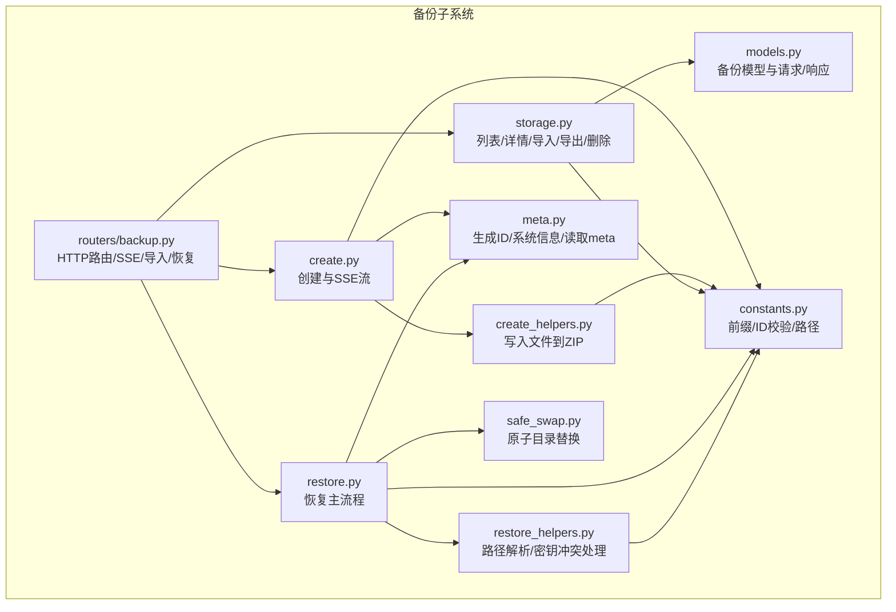
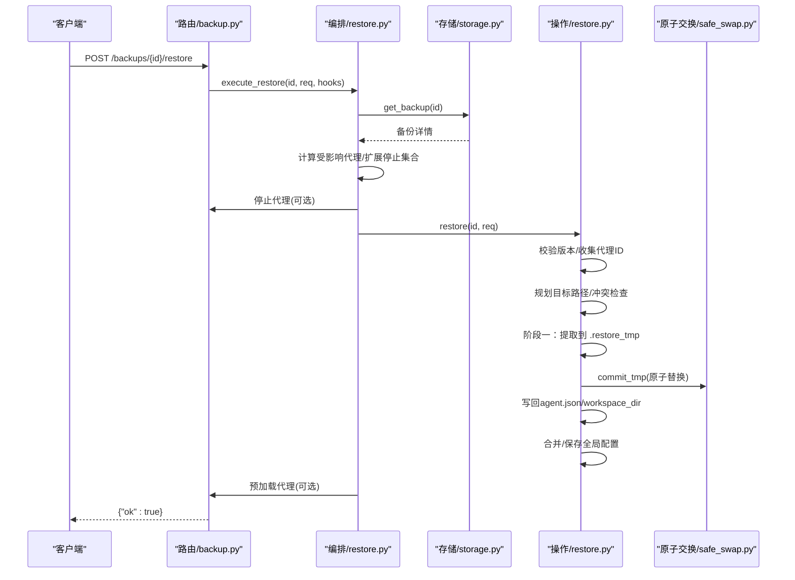
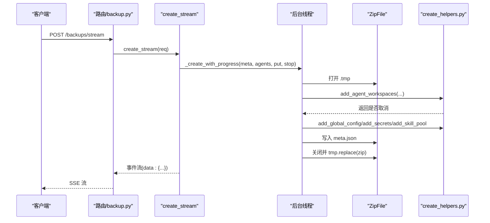
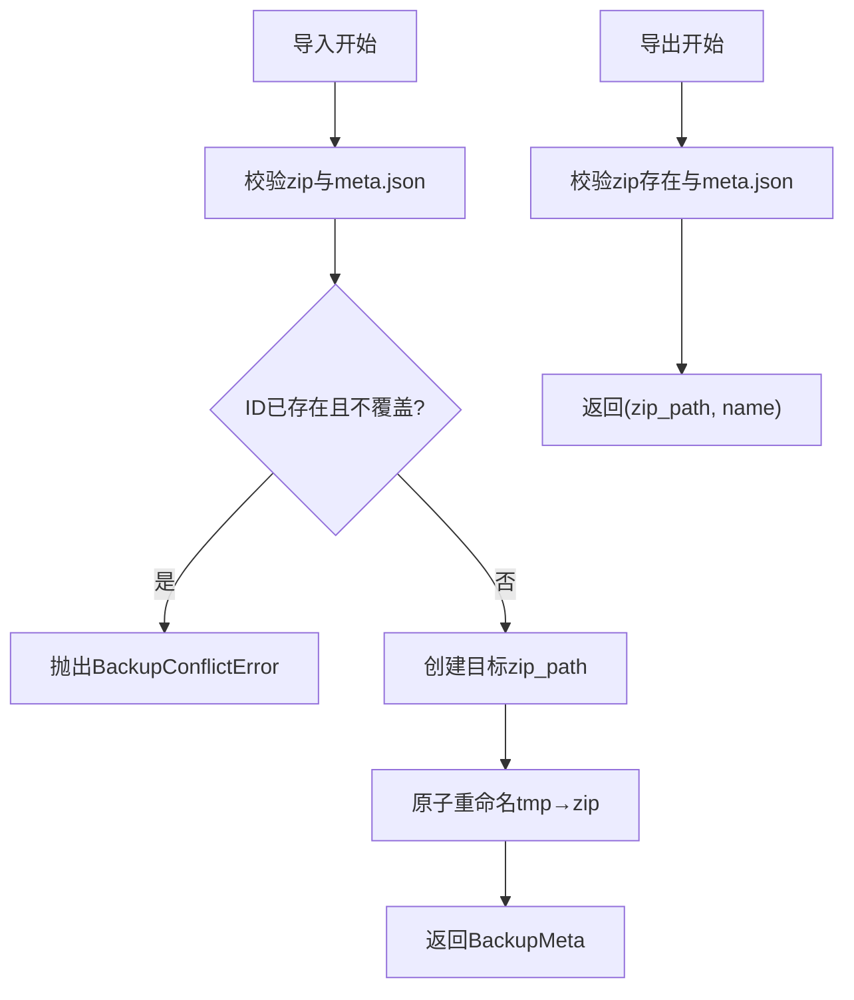
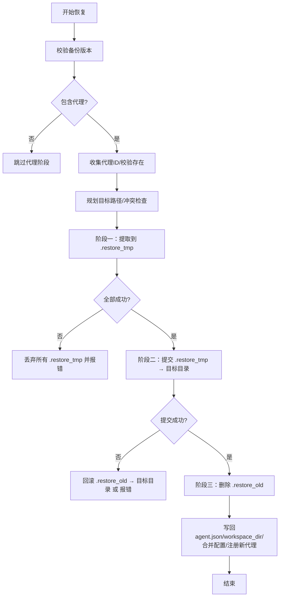
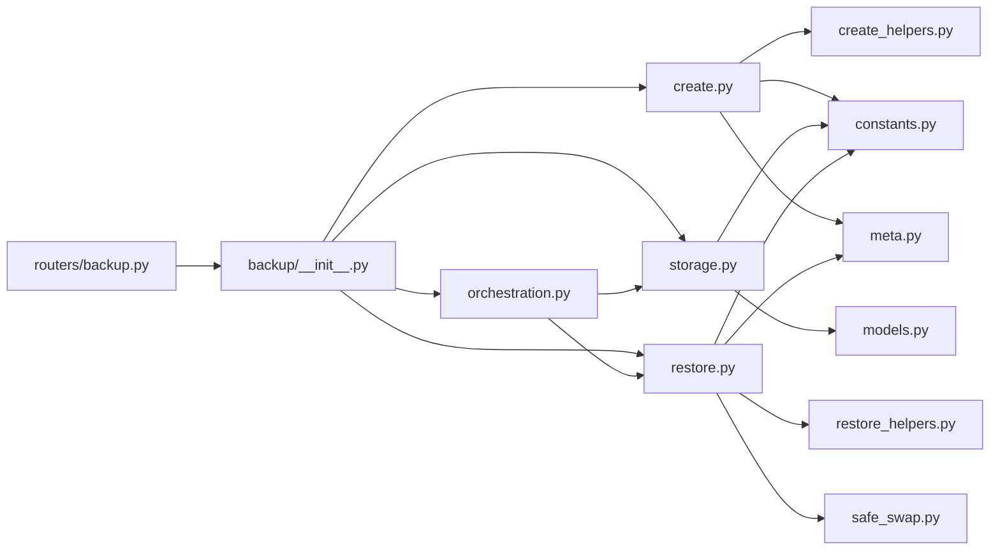

# 备份与恢复

<cite>
**本文引用的文件**
- [src/qwenpaw/backup/__init__.py](file://src/qwenpaw/backup/__init__.py)
- [src/qwenpaw/backup/models.py](file://src/qwenpaw/backup/models.py)
- [src/qwenpaw/backup/orchestration.py](file://src/qwenpaw/backup/orchestration.py)
- [src/qwenpaw/backup/_ops/create.py](file://src/qwenpaw/backup/_ops/create.py)
- [src/qwenpaw/backup/_ops/create_helpers.py](file://src/qwenpaw/backup/_ops/create_helpers.py)
- [src/qwenpaw/backup/_ops/restore.py](file://src/qwenpaw/backup/_ops/restore.py)
- [src/qwenpaw/backup/_ops/restore_helpers.py](file://src/qwenpaw/backup/_ops/restore_helpers.py)
- [src/qwenpaw/backup/_ops/storage.py](file://src/qwenpaw/backup/_ops/storage.py)
- [src/qwenpaw/backup/_utils/constants.py](file://src/qwenpaw/backup/_utils/constants.py)
- [src/qwenpaw/backup/_utils/meta.py](file://src/qwenpaw/backup/_utils/meta.py)
- [src/qwenpaw/backup/_utils/safe_swap.py](file://src/qwenpaw/backup/_utils/safe_swap.py)
- [src/qwenpaw/app/routers/backup.py](file://src/qwenpaw/app/routers/backup.py)
</cite>

## 目录
1. [简介](#简介)
2. [项目结构](#项目结构)
3. [核心组件](#核心组件)
4. [架构总览](#架构总览)
5. [详细组件分析](#详细组件分析)
6. [依赖分析](#依赖分析)
7. [性能考虑](#性能考虑)
8. [故障排查指南](#故障排查指南)
9. [结论](#结论)
10. [附录](#附录)

## 简介
本文件面向系统管理员与运维工程师，系统化阐述 QwenPaw 的备份与恢复体系：从备份策略（数据分类、备份频率与存储位置）、备份执行流程（代理数据、配置文件、密钥与技能池），到恢复机制（全量/自定义模式、目标路径规划、原子替换与回滚），再到灾难恢复、迁移与跨平台同步、监控与告警、故障恢复最佳实践，形成一套企业级数据保护与业务连续性保障方案。

## 项目结构
备份子系统位于 src/qwenpaw/backup 下，采用“模型-操作-工具-路由”的分层组织：
- 模型层：定义备份元数据、请求/响应模型与错误类型
- 操作层：创建、存储、恢复、辅助函数
- 工具层：常量、元数据、安全交换（原子目录替换）
- 路由层：FastAPI 接口，暴露 SSE 流式创建、导入/导出、删除、详情、恢复等能力

图表来源
- [src/qwenpaw/backup/models.py:13-133](file://src/qwenpaw/backup/models.py#L13-L133)
- [src/qwenpaw/backup/_ops/create.py:21-219](file://src/qwenpaw/backup/_ops/create.py#L21-L219)
- [src/qwenpaw/backup/_ops/create_helpers.py:138-179](file://src/qwenpaw/backup/_ops/create_helpers.py#L138-L179)
- [src/qwenpaw/backup/_ops/storage.py:29-229](file://src/qwenpaw/backup/_ops/storage.py#L29-L229)
- [src/qwenpaw/backup/_ops/restore.py:49-562](file://src/qwenpaw/backup/_ops/restore.py#L49-L562)
- [src/qwenpaw/backup/_ops/restore_helpers.py:24-157](file://src/qwenpaw/backup/_ops/restore_helpers.py#L24-L157)
- [src/qwenpaw/backup/_utils/constants.py:10-38](file://src/qwenpaw/backup/_utils/constants.py#L10-L38)
- [src/qwenpaw/backup/_utils/meta.py:24-61](file://src/qwenpaw/backup/_utils/meta.py#L24-L61)
- [src/qwenpaw/backup/_utils/safe_swap.py:1-289](file://src/qwenpaw/backup/_utils/safe_swap.py#L1-L289)
- [src/qwenpaw/app/routers/backup.py:65-275](file://src/qwenpaw/app/routers/backup.py#L65-L275)

章节来源
- [src/qwenpaw/backup/__init__.py:1-22](file://src/qwenpaw/backup/__init__.py#L1-22)
- [src/qwenpaw/app/routers/backup.py:37-37](file://src/qwenpaw/app/routers/backup.py#L37-L37)

## 核心组件
- 备份元数据与范围
  - BackupMeta：包含备份ID、名称、描述、时间戳、版本、作用域、代理数量、QwenPaw版本与系统信息
  - BackupScope：控制是否包含代理工作区、全局配置、密钥目录、技能池
- 请求/响应模型
  - CreateBackupRequest：备份名称、描述、作用域、代理ID列表
  - RestoreBackupRequest：恢复选项（是否恢复代理、指定代理ID、是否恢复全局配置/密钥/技能池、默认工作区目录、恢复模式 full/custom）
  - DeleteBackupsRequest/DeleteBackupsResponse：批量删除
- 公共API
  - create_stream、list_backups、get_backup、delete_backups、export_backup、import_backup、execute_restore

章节来源
- [src/qwenpaw/backup/models.py:13-133](file://src/qwenpaw/backup/models.py#L13-L133)
- [src/qwenpaw/backup/__init__.py:3-21](file://src/qwenpaw/backup/__init__.py#L3-L21)

## 架构总览
备份与恢复通过 HTTP 路由器统一入口，内部按职责拆分为“创建/存储/恢复”三大操作模块，并辅以工具模块保证安全性与可维护性。

图表来源
- [src/qwenpaw/app/routers/backup.py:230-255](file://src/qwenpaw/app/routers/backup.py#L230-L255)
- [src/qwenpaw/backup/orchestration.py:44-149](file://src/qwenpaw/backup/orchestration.py#L44-L149)
- [src/qwenpaw/backup/_ops/storage.py:58-111](file://src/qwenpaw/backup/_ops/storage.py#L58-L111)
- [src/qwenpaw/backup/_ops/restore.py:361-413](file://src/qwenpaw/backup/_ops/restore.py#L361-L413)
- [src/qwenpaw/backup/_utils/safe_swap.py:256-271](file://src/qwenpaw/backup/_utils/safe_swap.py#L256-L271)

## 详细组件分析

### 备份创建流程（含SSE进度）
- 设计要点
  - 使用异步生成器与后台线程分离 CPU 密集型压缩，避免阻塞事件循环
  - 通过 asyncio.Queue + loop.call_soon_threadsafe 实现线程安全事件推送
  - 支持客户端断开时优雅取消（设置 stop_event）
  - 写入临时 .tmp 文件，成功后原子替换为 .zip，失败清理
  - 进度事件：start、agent、saving、done、error
- 数据范围
  - 代理工作区：按配置中有效代理逐个打包
  - 全局配置：config.json
  - 密钥目录：secrets（可选）
  - 技能池：skill_pool（可选）
- 事件流
  - 生成 BackupMeta，计算代理数量与系统信息
  - 逐代理压缩并上报百分比
  - 写入 meta.json，最终返回完成事件

图表来源
- [src/qwenpaw/app/routers/backup.py:65-87](file://src/qwenpaw/app/routers/backup.py#L65-L87)
- [src/qwenpaw/backup/_ops/create.py:21-219](file://src/qwenpaw/backup/_ops/create.py#L21-L219)
- [src/qwenpaw/backup/_ops/create_helpers.py:138-179](file://src/qwenpaw/backup/_ops/create_helpers.py#L138-L179)

章节来源
- [src/qwenpaw/backup/_ops/create.py:21-219](file://src/qwenpaw/backup/_ops/create.py#L21-L219)
- [src/qwenpaw/backup/_ops/create_helpers.py:21-179](file://src/qwenpaw/backup/_ops/create_helpers.py#L21-L179)
- [src/qwenpaw/backup/_utils/meta.py:24-61](file://src/qwenpaw/backup/_utils/meta.py#L24-L61)
- [src/qwenpaw/backup/_utils/constants.py:10-38](file://src/qwenpaw/backup/_utils/constants.py#L10-L38)

### 存储与导入/导出
- 列表与详情
  - 遍历 BACKUP_DIR 下 .zip 文件，读取根部 meta.json 并反序列化为 BackupMeta/BackupDetail
  - 详情统计每个代理的文件数与大小，并尝试读取 agent.json 获取人类可读名称
- 删除
  - 批量删除，记录成功/失败列表
- 导入
  - 校验 zip 与 meta.json；校验备份ID合法性；若存在且未覆盖则抛出 BackupConflictError
  - 原子重命名 .upload_tmp 至 .zip
- 导出
  - 返回 zip 绝对路径与备份名称

图表来源
- [src/qwenpaw/backup/_ops/storage.py:169-229](file://src/qwenpaw/backup/_ops/storage.py#L169-L229)
- [src/qwenpaw/backup/_utils/constants.py:27-38](file://src/qwenpaw/backup/_utils/constants.py#L27-L38)

章节来源
- [src/qwenpaw/backup/_ops/storage.py:29-229](file://src/qwenpaw/backup/_ops/storage.py#L29-L229)
- [src/qwenpaw/backup/_utils/constants.py:10-38](file://src/qwenpaw/backup/_utils/constants.py#L10-L38)

### 恢复机制（全量/自定义、原子替换、路径规划）
- 恢复模式
  - full：完全替换，包含 agents.profiles
  - custom：合并策略，顶层键来自备份，仅对实际恢复的代理ID更新其 profile，避免“幽灵代理”
- 目标路径规划
  - resolve_workspace_dst：优先使用当前配置中的 workspace_dir；若不存在则回退到默认路径；返回是否为新代理
  - 冲突检测：同一批次内不同代理不能映射到相同物理路径；新代理不能覆盖非本次恢复的现有代理路径
- 原子替换与回滚
  - 提取到 .restore_tmp → 旧目录重命名为 .restore_old → 临时目录重命名为目标目录 → 删除 .restore_old
  - 失败时回滚：若第二阶段失败，尝试将 .restore_old 重命名为原目录
- 安全与兼容
  - 密钥冲突处理：当备份中的 master_key 与本地不一致时，先备份当前 master_key 到备份目录，再进行替换
  - Zip Slip 防护：在提取时对逻辑路径进行校验，拒绝越界路径
  - 并发控制：对同一目标目录加锁，防止并发恢复交错
- 服务编排
  - execute_restore 在恢复前后调用外部钩子停止/预加载代理，确保文件句柄释放与重启

图表来源
- [src/qwenpaw/backup/_ops/restore.py:49-562](file://src/qwenpaw/backup/_ops/restore.py#L49-L562)
- [src/qwenpaw/backup/_ops/restore_helpers.py:24-157](file://src/qwenpaw/backup/_ops/restore_helpers.py#L24-L157)
- [src/qwenpaw/backup/_utils/safe_swap.py:176-271](file://src/qwenpaw/backup/_utils/safe_swap.py#L176-L271)

章节来源
- [src/qwenpaw/backup/_ops/restore.py:49-562](file://src/qwenpaw/backup/_ops/restore.py#L49-L562)
- [src/qwenpaw/backup/_ops/restore_helpers.py:35-157](file://src/qwenpaw/backup/_ops/restore_helpers.py#L35-L157)
- [src/qwenpaw/backup/_utils/safe_swap.py:65-289](file://src/qwenpaw/backup/_utils/safe_swap.py#L65-L289)
- [src/qwenpaw/backup/orchestration.py:44-149](file://src/qwenpaw/backup/orchestration.py#L44-L149)

### HTTP 路由与前端交互
- SSE 创建：/backups/stream，事件格式 data: {...}，禁用代理缓冲
- 列表/详情/删除：/backups、/backups/{backup_id}
- 导入：/backups/import，支持首次上传与二次确认（pending_token）
- 导出：/backups/{backup_id}/export
- 恢复：/backups/{backup_id}/restore，调用 execute_restore，必要时通过 MultiAgentManager 停止/预加载代理

章节来源
- [src/qwenpaw/app/routers/backup.py:65-275](file://src/qwenpaw/app/routers/backup.py#L65-L275)

## 依赖分析
- 模块耦合
  - 路由层仅依赖公共 API（create_stream/list_backups/get_backup/delete_backups/export_backup/import_backup/execute_restore）
  - 操作层内部通过工具层解耦路径/常量/元数据/原子替换
  - 恢复流程通过编排层与运行时管理器解耦，便于测试与扩展
- 外部依赖
  - FastAPI（路由与响应）
  - Python 标准库（asyncio、threading、zipfile、pathlib、logging、tempfile 等）

图表来源
- [src/qwenpaw/backup/__init__.py:3-21](file://src/qwenpaw/backup/__init__.py#L3-L21)
- [src/qwenpaw/app/routers/backup.py:15-23](file://src/qwenpaw/app/routers/backup.py#L15-L23)

章节来源
- [src/qwenpaw/backup/__init__.py:1-22](file://src/qwenpaw/backup/__init__.py#L1-22)
- [src/qwenpaw/app/routers/backup.py:37-37](file://src/qwenpaw/app/routers/backup.py#L37-L37)

## 性能考虑
- I/O 与并发
  - 备份压缩在后台线程执行，避免阻塞事件循环；SSE 事件通过队列传递
  - 恢复阶段对同一目标目录加锁，避免并发交错导致的文件损坏
- 原子性与可靠性
  - 采用 .tmp/.restore_tmp/.restore_old 三段协议，崩溃不破坏目标目录
  - Windows 上避免因打开句柄导致的目录重命名失败，先停止相关代理
- 空间与网络
  - 导入/导出基于磁盘文件，建议在具备足够磁盘空间的介质上进行
  - 导入时保留 .upload_tmp 以便用户确认后重试，减少重复上传

[本节为通用指导，无需特定文件来源]

## 故障排查指南
- 备份创建失败
  - 检查 BACKUP_DIR 可写性与磁盘空间
  - 查看 SSE 错误事件，定位具体阶段（代理、保存、完成）
  - 若客户端断开，确认 .tmp 是否被清理
- 恢复失败
  - full 模式下 agents.profiles 将被替换；custom 模式仅更新实际恢复的代理
  - 若出现“目标路径冲突”，请调整 default_workspace_dir 或确保代理映射唯一
  - 密钥冲突：系统会自动备份当前 master_key，可在备份目录查看历史备份
- 导入冲突
  - 返回 409 时，使用 pending_token 重新发送导入请求以覆盖
- 原子替换异常
  - 若提交阶段失败，系统尝试回滚；如仍失败，检查 .restore_old 是否存在并手动恢复

章节来源
- [src/qwenpaw/backup/_ops/create.py:140-144](file://src/qwenpaw/backup/_ops/create.py#L140-L144)
- [src/qwenpaw/backup/_ops/restore.py:308-359](file://src/qwenpaw/backup/_ops/restore.py#L308-L359)
- [src/qwenpaw/backup/_ops/restore_helpers.py:108-157](file://src/qwenpaw/backup/_ops/restore_helpers.py#L108-L157)
- [src/qwenpaw/backup/_ops/storage.py:169-229](file://src/qwenpaw/backup/_ops/storage.py#L169-L229)
- [src/qwenpaw/app/routers/backup.py:108-137](file://src/qwenpaw/app/routers/backup.py#L108-L137)

## 结论
QwenPaw 的备份与恢复体系以“可观察、可恢复、可迁移”为目标，通过清晰的模型定义、严格的原子替换协议与灵活的恢复模式，为企业级部署提供了稳健的数据保护与业务连续性保障。配合合理的监控与告警策略，可进一步提升运维效率与系统韧性。

[本节为总结，无需特定文件来源]

## 附录

### 备份策略设计原则
- 数据分类
  - 代理工作区：包含对话历史、插件状态、缓存等
  - 全局配置：提供者、通道、工具等顶层配置
  - 密钥目录：凭据与加密密钥（谨慎包含）
  - 技能池：技能脚本与资源
- 备份频率
  - 生产环境：每日增量 + 周/月全量
  - 开发/测试：变更触发或定时
- 存储位置
  - 本地磁盘（高吞吐）+ 远程对象存储（异地容灾）
  - 导入/导出接口支持跨平台传输

[本节为概念性内容，无需特定文件来源]

### 恢复机制与数据完整性
- 全量/自定义模式
  - full：彻底替换，适合全新部署或迁移
  - custom：最小化变更，适合增量恢复与多租户隔离
- 版本兼容
  - 严格校验备份版本，不支持的版本直接拒绝
- 数据完整性
  - 通过 meta.json 记录系统信息与代理统计，便于核对
  - 原子替换避免部分写入导致的数据损坏

章节来源
- [src/qwenpaw/backup/_ops/restore.py:60-66](file://src/qwenpaw/backup/_ops/restore.py#L60-L66)
- [src/qwenpaw/backup/_utils/meta.py:49-61](file://src/qwenpaw/backup/_utils/meta.py#L49-L61)

### 灾难恢复与迁移
- 跨主机/跨平台
  - 使用自定义 default_workspace_dir 适配不同路径
  - master_key 冲突自动备份，确保凭据可解密
- 迁移策略
  - 从旧版本导入时，custom 模式可保留现有代理配置
  - 导入后建议执行一次健康检查与功能回归

章节来源
- [src/qwenpaw/backup/_ops/restore_helpers.py:35-76](file://src/qwenpaw/backup/_ops/restore_helpers.py#L35-L76)
- [src/qwenpaw/backup/_ops/restore_helpers.py:108-157](file://src/qwenpaw/backup/_ops/restore_helpers.py#L108-L157)

### 监控、告警与故障恢复最佳实践
- 监控指标
  - 备份任务成功率/耗时/大小
  - 恢复任务成功率/阶段耗时
  - 备份文件数量与存储占用
- 告警
  - 备份/恢复失败、版本不匹配、导入冲突、原子替换失败
- 最佳实践
  - 定期演练恢复流程
  - 对密钥目录的包含/排除进行权限与审计
  - 使用独立磁盘/卷存放备份，避免与业务数据同盘

[本节为通用指导，无需特定文件来源]