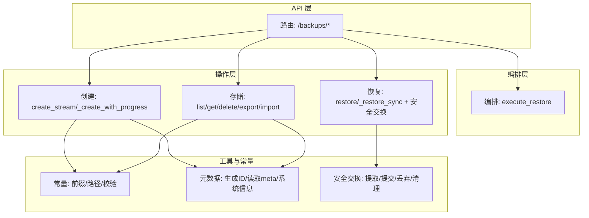
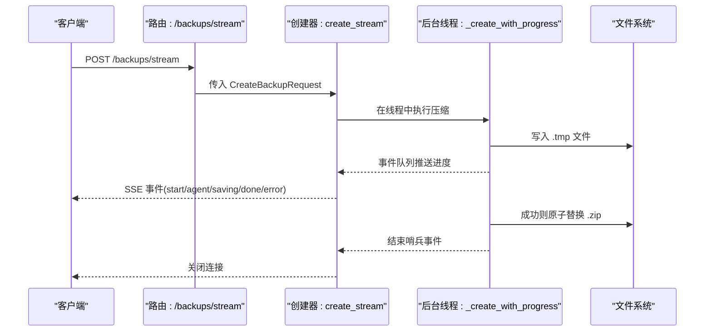
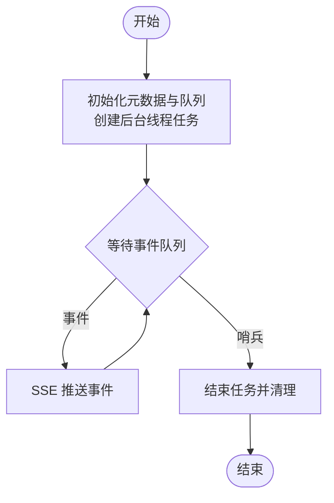
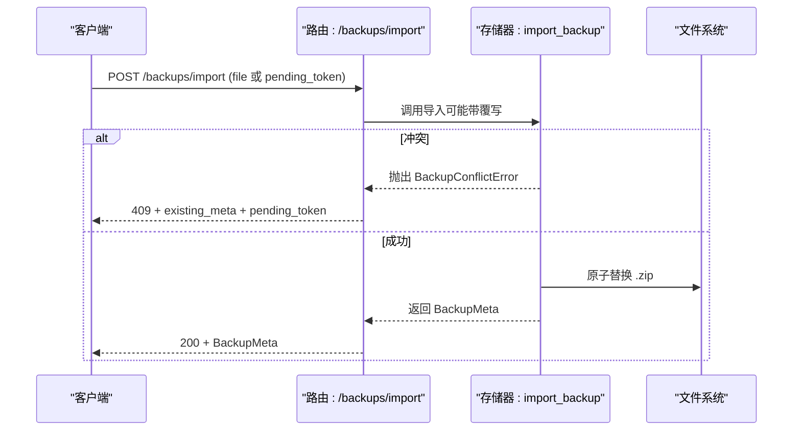
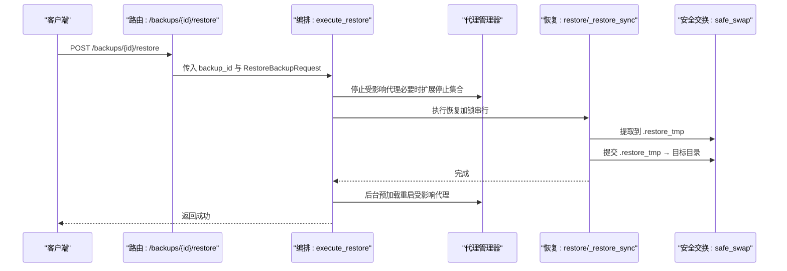
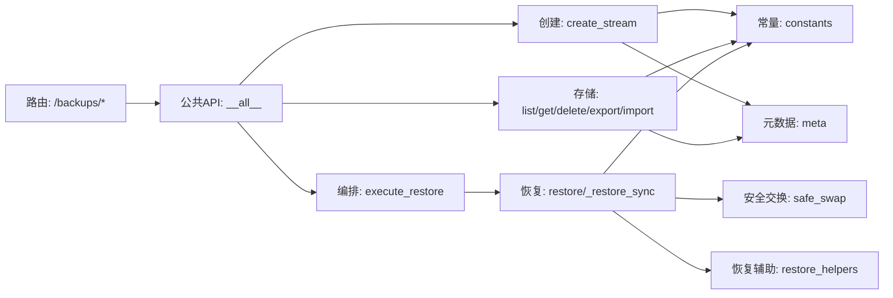

# 备份操作流程

<cite>
**本文引用的文件**
- [src/qwenpaw/backup/__init__.py](file://src/qwenpaw/backup/__init__.py)
- [src/qwenpaw/backup/models.py](file://src/qwenpaw/backup/models.py)
- [src/qwenpaw/backup/orchestration.py](file://src/qwenpaw/backup/orchestration.py)
- [src/qwenpaw/backup/_ops/create.py](file://src/qwenpaw/backup/_ops/create.py)
- [src/qwenpaw/backup/_ops/create_helpers.py](file://src/qwenpaw/backup/_ops/create_helpers.py)
- [src/qwenpaw/backup/_ops/restore.py](file://src/qwenpaw/backup/_ops/restore.py)
- [src/qwenpaw/backup/_ops/restore_helpers.py](file://src/qwenpaw/backup/_ops/restore_helpers.py)
- [src/qwenpaw/backup/_ops/storage.py](file://src/qwenpaw/backup/_ops/storage.py)
- [src/qwenpaw/backup/_utils/constants.py](file://src/qwenpaw/backup/_utils/constants.py)
- [src/qwenpaw/backup/_utils/meta.py](file://src/qwenpaw/backup/_utils/meta.py)
- [src/qwenpaw/backup/_utils/safe_swap.py](file://src/qwenpaw/backup/_utils/safe_swap.py)
- [src/qwenpaw/app/routers/backup.py](file://src/qwenpaw/app/routers/backup.py)
</cite>

## 目录
1. [简介](#简介)
2. [项目结构](#项目结构)
3. [核心组件](#核心组件)
4. [架构总览](#架构总览)
5. [详细组件分析](#详细组件分析)
6. [依赖分析](#依赖分析)
7. [性能考虑](#性能考虑)
8. [故障排查指南](#故障排查指南)
9. [结论](#结论)
10. [附录](#附录)

## 简介
本文件面向系统管理员与开发者，系统性阐述 QwenPaw 的备份与恢复能力，覆盖从“预检查—数据收集—压缩加密—存储提交”的完整流程；解释触发条件、执行时机与并发控制；给出进度跟踪、状态管理与错误处理策略；并提供监控指标、性能优化建议与故障恢复方案。同时，明确支持的备份类型（批量、全量、自定义）与实现要点。

## 项目结构
备份子系统由“API 路由层”“业务编排层”“操作实现层”“工具与常量层”组成，采用异步与线程混合模型，确保 SSE 进度流与高吞吐压缩不阻塞事件循环；通过安全交换工具保障恢复过程的原子性与可回滚性。

图表来源
- [src/qwenpaw/app/routers/backup.py:65-87](file://src/qwenpaw/app/routers/backup.py#L65-L87)
- [src/qwenpaw/backup/orchestration.py:44-149](file://src/qwenpaw/backup/orchestration.py#L44-L149)
- [src/qwenpaw/backup/_ops/create.py:21-81](file://src/qwenpaw/backup/_ops/create.py#L21-L81)
- [src/qwenpaw/backup/_ops/storage.py:29-50](file://src/qwenpaw/backup/_ops/storage.py#L29-L50)
- [src/qwenpaw/backup/_ops/restore.py:49-52](file://src/qwenpaw/backup/_ops/restore.py#L49-L52)
- [src/qwenpaw/backup/_utils/constants.py:10-37](file://src/qwenpaw/backup/_utils/constants.py#L10-L37)
- [src/qwenpaw/backup/_utils/meta.py:24-60](file://src/qwenpaw/backup/_utils/meta.py#L24-L60)
- [src/qwenpaw/backup/_utils/safe_swap.py:65-144](file://src/qwenpaw/backup/_utils/safe_swap.py#L65-L144)

章节来源
- [src/qwenpaw/app/routers/backup.py:65-87](file://src/qwenpaw/app/routers/backup.py#L65-L87)
- [src/qwenpaw/backup/__init__.py:1-22](file://src/qwenpaw/backup/__init__.py#L1-L22)

## 核心组件
- 公共 API：对外暴露创建、列举、详情、删除、导出、导入与恢复编排入口。
- 数据模型：备份范围、元数据、请求体与响应体，以及冲突异常类型。
- 编排器：在恢复前停止受影响代理、执行恢复、失败后仍尝试后台预加载重启。
- 创建器：异步生成器输出 SSE 事件，后台线程压缩写入临时文件，最终原子替换。
- 存储器：对备份目录进行枚举、读取、删除、导出、导入（含冲突处理）。
- 恢复器：版本校验、目标规划、分阶段提取与提交、全局配置合并、工作区路径修正。
- 工具集：常量前缀、路径与校验；元数据生成与读取；安全目录交换（三段式原子替换）。

章节来源
- [src/qwenpaw/backup/__init__.py:3-11](file://src/qwenpaw/backup/__init__.py#L3-L11)
- [src/qwenpaw/backup/models.py:13-133](file://src/qwenpaw/backup/models.py#L13-L133)
- [src/qwenpaw/backup/orchestration.py:44-149](file://src/qwenpaw/backup/orchestration.py#L44-L149)
- [src/qwenpaw/backup/_ops/create.py:21-81](file://src/qwenpaw/backup/_ops/create.py#L21-L81)
- [src/qwenpaw/backup/_ops/storage.py:29-138](file://src/qwenpaw/backup/_ops/storage.py#L29-L138)
- [src/qwenpaw/backup/_ops/restore.py:49-562](file://src/qwenpaw/backup/_ops/restore.py#L49-L562)
- [src/qwenpaw/backup/_utils/constants.py:10-37](file://src/qwenpaw/backup/_utils/constants.py#L10-L37)
- [src/qwenpaw/backup/_utils/meta.py:24-60](file://src/qwenpaw/backup/_utils/meta.py#L24-L60)
- [src/qwenpaw/backup/_utils/safe_swap.py:65-289](file://src/qwenpaw/backup/_utils/safe_swap.py#L65-L289)

## 架构总览
备份与恢复遵循“路由—编排—操作—工具”的分层设计，API 层负责输入校验与错误映射，编排层协调系统状态（如停止/重启代理），操作层完成具体 IO 与并发控制，工具层提供跨模块共享的能力。

图表来源
- [src/qwenpaw/app/routers/backup.py:65-87](file://src/qwenpaw/app/routers/backup.py#L65-L87)
- [src/qwenpaw/backup/_ops/create.py:21-81](file://src/qwenpaw/backup/_ops/create.py#L21-L81)
- [src/qwenpaw/backup/_ops/create.py:116-144](file://src/qwenpaw/backup/_ops/create.py#L116-L144)

## 详细组件分析

### 组件一：备份创建（SSE 流）
- 触发条件：客户端发起“流式创建备份”请求。
- 执行时机：路由层启动异步生成器，内部在独立线程中执行压缩，使用事件循环安全回调向消费者推送事件。
- 并发控制：线程内串行压缩；事件通过队列与回调避免阻塞主循环；支持客户端断开时的取消点。
- 进度跟踪：事件类型包含 start、agent、saving、done、error；百分比区间按阶段分配。
- 错误处理：捕获异常并以 error 事件返回；最终发送结束哨兵以关闭生成器。
- 存储提交：先写 .tmp，成功后原子替换为 .zip，失败则清理临时文件。

图表来源
- [src/qwenpaw/backup/_ops/create.py:21-81](file://src/qwenpaw/backup/_ops/create.py#L21-L81)
- [src/qwenpaw/backup/_ops/create.py:116-144](file://src/qwenpaw/backup/_ops/create.py#L116-L144)

章节来源
- [src/qwenpaw/backup/_ops/create.py:21-81](file://src/qwenpaw/backup/_ops/create.py#L21-L81)
- [src/qwenpaw/backup/_ops/create.py:116-144](file://src/qwenpaw/backup/_ops/create.py#L116-L144)
- [src/qwenpaw/backup/_ops/create_helpers.py:138-179](file://src/qwenpaw/backup/_ops/create_helpers.py#L138-L179)

### 组件二：备份存储与导入导出
- 列表/详情：扫描备份目录，解析每个 zip 中的 meta.json，构建元数据列表与带统计的详情。
- 删除：批量删除，记录成功与失败项。
- 导出：返回 zip 路径与名称。
- 导入：校验 zip 与 meta，ID 校验，冲突处理（默认抛出冲突异常，支持覆写令牌重试）。

图表来源
- [src/qwenpaw/app/routers/backup.py:193-216](file://src/qwenpaw/app/routers/backup.py#L193-L216)
- [src/qwenpaw/backup/_ops/storage.py:169-183](file://src/qwenpaw/backup/_ops/storage.py#L169-L183)
- [src/qwenpaw/backup/_ops/storage.py:186-228](file://src/qwenpaw/backup/_ops/storage.py#L186-L228)

章节来源
- [src/qwenpaw/backup/_ops/storage.py:29-138](file://src/qwenpaw/backup/_ops/storage.py#L29-L138)
- [src/qwenpaw/backup/_ops/storage.py:146-161](file://src/qwenpaw/backup/_ops/storage.py#L146-L161)
- [src/qwenpaw/backup/_ops/storage.py:169-228](file://src/qwenpaw/backup/_ops/storage.py#L169-L228)
- [src/qwenpaw/app/routers/backup.py:193-216](file://src/qwenpaw/app/routers/backup.py#L193-L216)

### 组件三：备份恢复（编排与原子化提交）
- 触发条件：客户端调用“恢复备份”接口。
- 执行时机：路由层调用编排器，先获取备份详情，再决定停止哪些代理，随后执行恢复，最后在 finally 中后台预加载重启。
- 并发控制：恢复阶段使用锁串行化文件操作，避免多并发交错导致的目录重命名失败（尤其 Windows）。
- 进度跟踪：恢复流程本身不直接产生 SSE 事件；可通过外部轮询或前端监听代理加载状态。
- 错误处理：恢复失败会记录错误并抛出；编排器保证即使失败也会尝试重启受影响代理。
- 原子化提交：采用“提取到 .restore_tmp → 旧目录移为 .restore_old → 临时目录改名为目标 → 清理旧目录”的三段式协议，确保崩溃不破坏数据。

图表来源
- [src/qwenpaw/app/routers/backup.py:230-255](file://src/qwenpaw/app/routers/backup.py#L230-L255)
- [src/qwenpaw/backup/orchestration.py:44-149](file://src/qwenpaw/backup/orchestration.py#L44-L149)
- [src/qwenpaw/backup/_ops/restore.py:49-52](file://src/qwenpaw/backup/_ops/restore.py#L49-L52)
- [src/qwenpaw/backup/_utils/safe_swap.py:227-289](file://src/qwenpaw/backup/_utils/safe_swap.py#L227-L289)

章节来源
- [src/qwenpaw/backup/orchestration.py:44-149](file://src/qwenpaw/backup/orchestration.py#L44-L149)
- [src/qwenpaw/backup/_ops/restore.py:49-562](file://src/qwenpaw/backup/_ops/restore.py#L49-L562)
- [src/qwenpaw/backup/_utils/safe_swap.py:65-289](file://src/qwenpaw/backup/_utils/safe_swap.py#L65-L289)

### 组件四：数据收集与打包
- 代理工作区：按配置中的工作区路径递归收集文件，按 agent_id 归档到 data/workspaces/{aid}/。
- 全局配置：data/config.json。
- 秘钥目录：data/secrets/。
- 技能池：data/skill_pool/。
- 支持取消：在每个阶段检测停止事件，及时退出并清理临时文件。

章节来源
- [src/qwenpaw/backup/_ops/create_helpers.py:21-179](file://src/qwenpaw/backup/_ops/create_helpers.py#L21-L179)
- [src/qwenpaw/backup/_utils/constants.py:10-19](file://src/qwenpaw/backup/_utils/constants.py#L10-L19)

### 组件五：恢复细节与模式
- 版本校验：仅支持特定版本号。
- 目标规划：根据请求与现有配置计算目标路径，避免新旧代理路径冲突。
- 配置合并：支持“全量替换”和“自定义选择”两种模式；自定义模式下仅对实际恢复的代理更新配置。
- 主密钥保护：当备份与当前密钥不一致时，保留旧密钥到备份目录，避免凭据不可解密。
- 工作区路径修正：修复 agent.json 中的 workspace_dir，确保跨主机一致性。

章节来源
- [src/qwenpaw/backup/_ops/restore.py:41-46](file://src/qwenpaw/backup/_ops/restore.py#L41-L46)
- [src/qwenpaw/backup/_ops/restore.py:78-146](file://src/qwenpaw/backup/_ops/restore.py#L78-L146)
- [src/qwenpaw/backup/_ops/restore.py:463-562](file://src/qwenpaw/backup/_ops/restore.py#L463-L562)
- [src/qwenpaw/backup/_ops/restore_helpers.py:108-157](file://src/qwenpaw/backup/_ops/restore_helpers.py#L108-L157)

## 依赖分析
- 路由层依赖公共 API 出口，统一暴露创建、存储与恢复能力。
- 编排层依赖存储层获取备份详情，依赖恢复层执行文件操作。
- 恢复层依赖安全交换工具保证原子性，依赖配置与常量工具进行路径与前缀管理。
- 创建层依赖常量与元数据工具，依赖线程与事件队列实现非阻塞进度推送。

图表来源
- [src/qwenpaw/backup/__init__.py:3-11](file://src/qwenpaw/backup/__init__.py#L3-L11)
- [src/qwenpaw/app/routers/backup.py:15-23](file://src/qwenpaw/app/routers/backup.py#L15-L23)
- [src/qwenpaw/backup/_ops/restore.py:49-52](file://src/qwenpaw/backup/_ops/restore.py#L49-L52)
- [src/qwenpaw/backup/_utils/safe_swap.py:227-289](file://src/qwenpaw/backup/_utils/safe_swap.py#L227-L289)
- [src/qwenpaw/backup/_utils/constants.py:10-37](file://src/qwenpaw/backup/_utils/constants.py#L10-L37)
- [src/qwenpaw/backup/_utils/meta.py:24-60](file://src/qwenpaw/backup/_utils/meta.py#L24-L60)

章节来源
- [src/qwenpaw/backup/__init__.py:1-22](file://src/qwenpaw/backup/__init__.py#L1-L22)
- [src/qwenpaw/app/routers/backup.py:15-23](file://src/qwenpaw/app/routers/backup.py#L15-L23)

## 性能考虑
- 压缩与 IO：创建阶段使用后台线程与流式写入，避免阻塞事件循环；建议在磁盘 IO 较优的环境中运行，减少 .tmp 写入与原子替换的开销。
- 并发与锁：恢复阶段通过锁串行化文件操作，避免 Windows 上因打开句柄导致的目录重命名失败；在高并发导入场景下，建议错峰执行。
- 进度与网络：SSE 使用无缓冲头，确保事件即时到达；客户端应具备断线重连与取消处理。
- 资源占用：恢复前停止受影响代理可降低文件句柄争用；自定义模式仅恢复指定代理，缩小 IO 范围。
- 可观测性：利用日志级别区分警告与错误；结合备份详情中的 per-agent 统计评估体积与耗时。

## 故障排查指南
- 备份创建失败
  - 现象：收到 error 事件或异常。
  - 排查：检查备份目录权限、磁盘空间、客户端断开是否触发取消；查看日志中异常堆栈。
  - 处理：清理 .tmp 文件后重试；确认网络稳定。
- 备份导入冲突
  - 现象：409 冲突，返回 existing_meta 与 pending_token。
  - 排查：备份 ID 已存在。
  - 处理：使用 pending_token 重新提交以覆写；或更换备份 ID。
- 恢复失败
  - 现象：恢复中断、部分目录已提交。
  - 排查：查看日志中“已提交/已丢弃”记录；确认是否存在打开句柄。
  - 处理：安全交换会自动清理残留 artifacts；若失败发生在提交阶段，系统会回滚旧目录。
- 代理无法重启
  - 现象：恢复完成后代理未加载。
  - 排查：编排器会在 finally 中尝试后台预加载；检查代理管理器状态。
  - 处理：手动触发预加载或重启服务。

章节来源
- [src/qwenpaw/backup/_ops/create.py:140-144](file://src/qwenpaw/backup/_ops/create.py#L140-L144)
- [src/qwenpaw/app/routers/backup.py:174-190](file://src/qwenpaw/app/routers/backup.py#L174-L190)
- [src/qwenpaw/backup/_ops/restore.py:314-337](file://src/qwenpaw/backup/_ops/restore.py#L314-L337)
- [src/qwenpaw/backup/_utils/safe_swap.py:86-143](file://src/qwenpaw/backup/_utils/safe_swap.py#L86-L143)
- [src/qwenpaw/backup/orchestration.py:140-149](file://src/qwenpaw/backup/orchestration.py#L140-L149)

## 结论
QwenPaw 的备份体系以“SSE 进度流 + 原子化恢复 + 并发串行化”为核心设计，兼顾易用性与可靠性。通过清晰的模式与严格的错误处理，系统可在复杂环境下保持数据一致性与可恢复性。建议在生产环境采用“自定义模式 + 批量选择 + 预停机窗口”的策略，配合监控与告警，确保备份与恢复的稳定性。

## 附录

### 备份类型与实现要点
- 批量备份
  - 通过 CreateBackupRequest 的 agents 字段显式指定要包含的代理 ID；未在配置中找到的 ID 将被跳过并记录。
  - 全局配置、技能池与秘钥目录按 scope 控制是否包含。
- 全量恢复（Full）
  - 完全替换当前实例：全局配置、代理工作区、技能池、秘钥均被替换。
- 自定义恢复（Custom）
  - 仅对请求中列出且存在于备份中的代理工作区进行恢复；全局配置采用“备份优先”的合并策略，但仅对实际恢复的代理覆盖其配置条目，避免幽灵代理。

章节来源
- [src/qwenpaw/backup/models.py:58-108](file://src/qwenpaw/backup/models.py#L58-L108)
- [src/qwenpaw/backup/_ops/restore.py:463-562](file://src/qwenpaw/backup/_ops/restore.py#L463-L562)

### 监控指标与建议
- 指标
  - 备份数量与大小（按 agent 维度统计）。
  - 创建耗时与阶段百分比（start/agent/saving/done/error）。
  - 恢复阶段提交数与失败次数。
  - 导入冲突率与覆写成功率。
- 建议
  - 对关键代理启用周期性批量备份。
  - 在低峰期执行全量或大规模恢复。
  - 记录并定期审计日志，关注警告与错误。

### 标准化流程与质量保证
- 备份流程
  - 明确备份范围（agents/global_config/secrets/skill_pool）。
  - 选择批量/全量/自定义模式。
  - 观察 SSE 进度，记录异常与耗时。
- 恢复流程
  - 恢复前评估影响范围（是否涉及 secrets/skill_pool）。
  - 必要时扩大停止集合以释放文件句柄。
  - 恢复后验证代理加载与配置一致性。
- 质量保证
  - 定期抽样验证导入/恢复可用性。
  - 对主密钥变更场景进行演练，确保凭据可解密。
  - 使用自定义模式最小化风险面，保留历史备份以便回退。