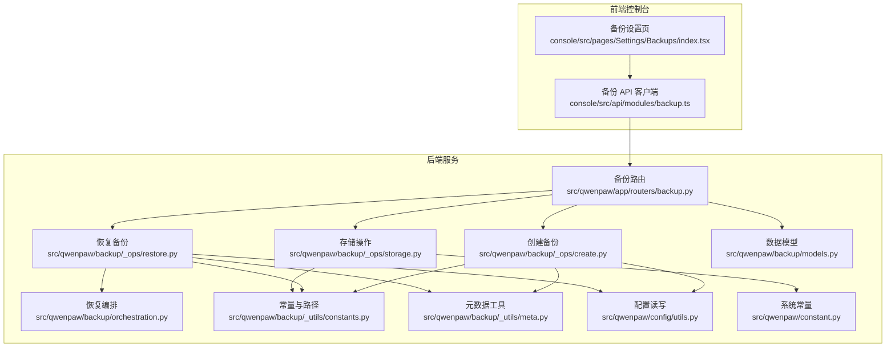
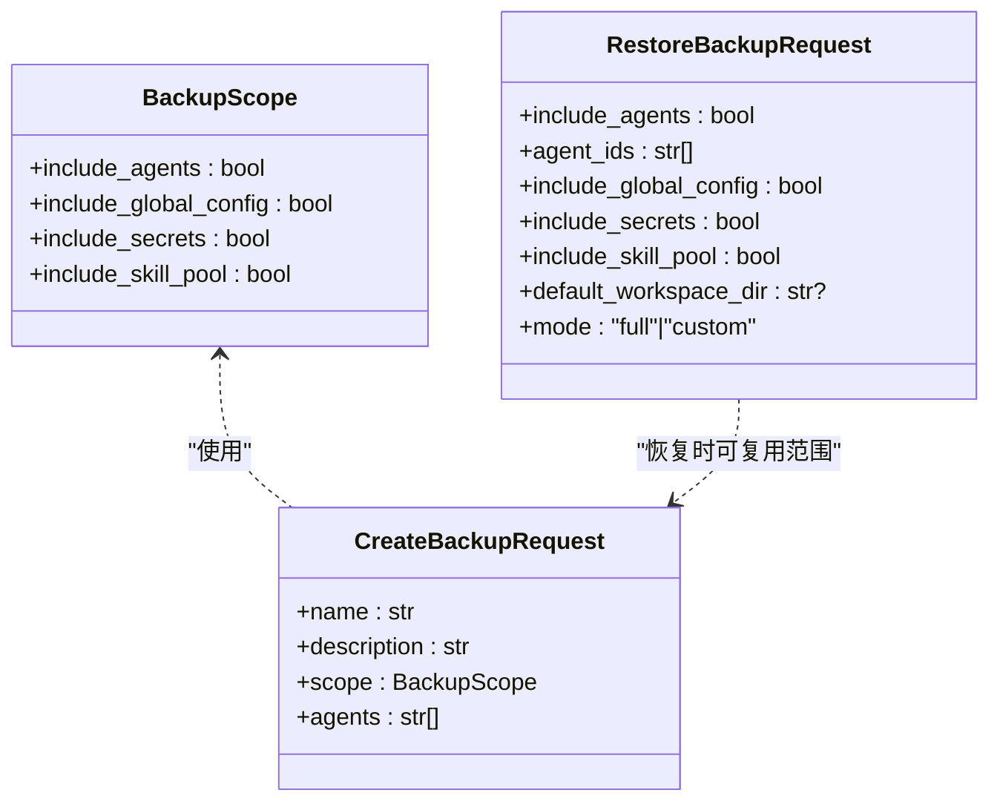
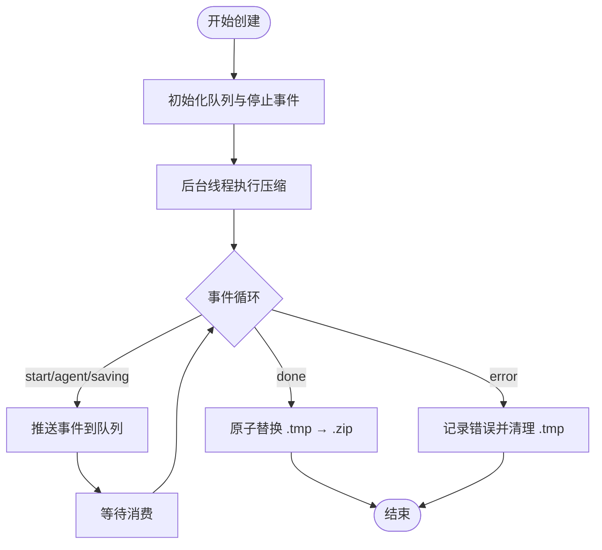
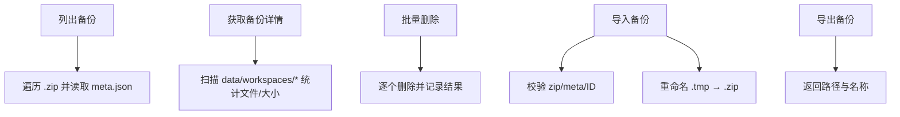
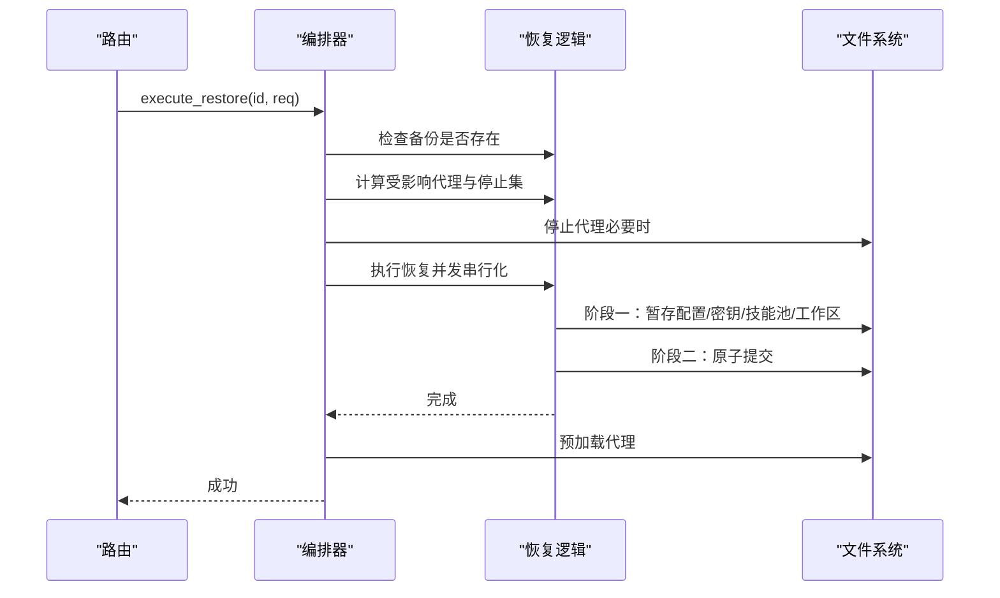
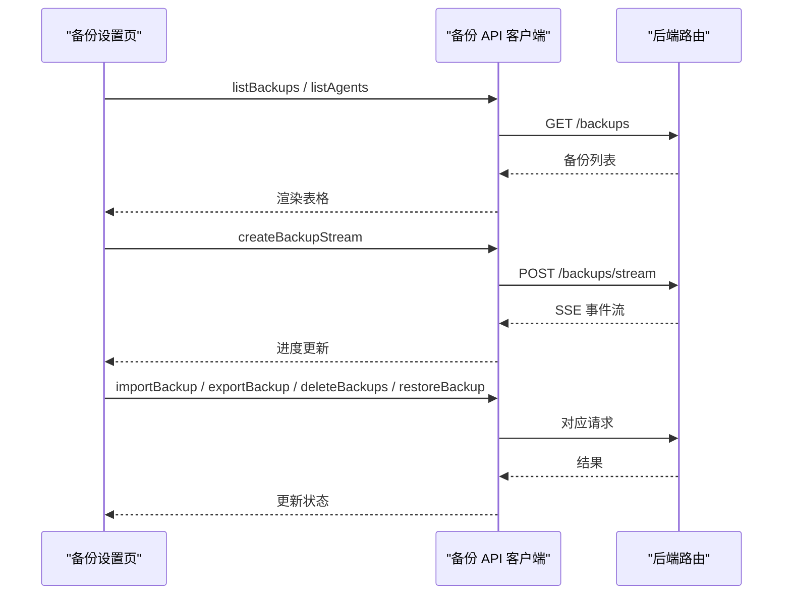
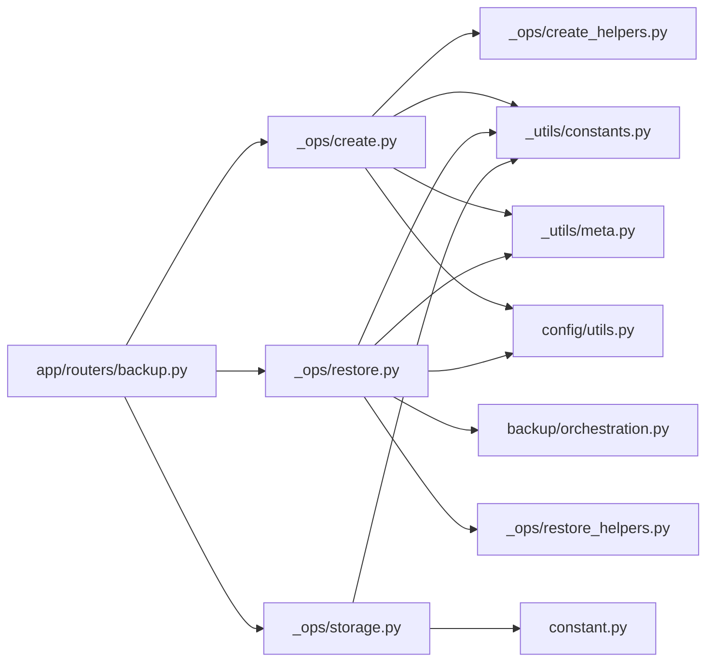

# 备份策略设计

<cite>
**本文引用的文件**
- [src/qwenpaw/backup/__init__.py](file://src/qwenpaw/backup/__init__.py)
- [src/qwenpaw/backup/models.py](file://src/qwenpaw/backup/models.py)
- [src/qwenpaw/backup/orchestration.py](file://src/qwenpaw/backup/orchestration.py)
- [src/qwenpaw/backup/_ops/create.py](file://src/qwenpaw/backup/_ops/create.py)
- [src/qwenpaw/backup/_ops/restore.py](file://src/qwenpaw/backup/_ops/restore.py)
- [src/qwenpaw/backup/_ops/storage.py](file://src/qwenpaw/backup/_ops/storage.py)
- [src/qwenpaw/backup/_ops/create_helpers.py](file://src/qwenpaw/backup/_ops/create_helpers.py)
- [src/qwenpaw/backup/_ops/restore_helpers.py](file://src/qwenpaw/backup/_ops/restore_helpers.py)
- [src/qwenpaw/backup/_utils/constants.py](file://src/qwenpaw/backup/_utils/constants.py)
- [src/qwenpaw/backup/_utils/meta.py](file://src/qwenpaw/backup/_utils/meta.py)
- [src/qwenpaw/app/routers/backup.py](file://src/qwenpaw/app/routers/backup.py)
- [console/src/pages/Settings/Backups/index.tsx](file://console/src/pages/Settings/Backups/index.tsx)
- [console/src/api/modules/backup.ts](file://console/src/api/modules/backup.ts)
- [src/qwenpaw/constant.py](file://src/qwenpaw/constant.py)
- [src/qwenpaw/config/utils.py](file://src/qwenpaw/config/utils.py)
</cite>

## 目录
1. [引言](#引言)
2. [项目结构](#项目结构)
3. [核心组件](#核心组件)
4. [架构总览](#架构总览)
5. [详细组件分析](#详细组件分析)
6. [依赖关系分析](#依赖关系分析)
7. [性能考量](#性能考量)
8. [故障排查指南](#故障排查指南)
9. [结论](#结论)
10. [附录：企业级备份策略制定指南](#附录企业级备份策略制定指南)

## 引言
本文件面向企业与工程团队，系统化阐述 QwenPaw 的备份策略设计与实现，覆盖数据分类原则、备份粒度控制、存储位置选择、备份范围定义、备份频率与保留策略、存储空间优化、合规性与成本效益评估，以及可定制化配置选项与最佳实践。目标是帮助读者在生产环境中安全、可控地实施备份与恢复流程。

## 项目结构
QwenPaw 的备份能力由“后端模块 + 前端页面 + API 路由”三层组成：
- 后端备份模块：负责备份创建、存储、恢复、导入导出与元数据管理
- 前端设置页：提供备份列表、创建、导入、恢复等交互界面
- API 路由：暴露 SSE 流式进度、备份 CRUD、恢复执行等接口



图表来源
- [src/qwenpaw/app/routers/backup.py:1-275](file://src/qwenpaw/app/routers/backup.py#L1-L275)
- [src/qwenpaw/backup/_ops/create.py:1-219](file://src/qwenpaw/backup/_ops/create.py#L1-L219)
- [src/qwenpaw/backup/_ops/restore.py:1-562](file://src/qwenpaw/backup/_ops/restore.py#L1-L562)
- [src/qwenpaw/backup/_ops/storage.py:1-229](file://src/qwenpaw/backup/_ops/storage.py#L1-L229)
- [src/qwenpaw/backup/orchestration.py:1-149](file://src/qwenpaw/backup/orchestration.py#L1-L149)
- [src/qwenpaw/backup/models.py:1-133](file://src/qwenpaw/backup/models.py#L1-L133)
- [src/qwenpaw/backup/_utils/constants.py:1-38](file://src/qwenpaw/backup/_utils/constants.py#L1-L38)
- [src/qwenpaw/backup/_utils/meta.py:1-61](file://src/qwenpaw/backup/_utils/meta.py#L1-L61)
- [src/qwenpaw/config/utils.py:1-735](file://src/qwenpaw/config/utils.py#L1-L735)
- [src/qwenpaw/constant.py:1-325](file://src/qwenpaw/constant.py#L1-L325)

章节来源
- [src/qwenpaw/app/routers/backup.py:1-275](file://src/qwenpaw/app/routers/backup.py#L1-L275)
- [console/src/pages/Settings/Backups/index.tsx:1-147](file://console/src/pages/Settings/Backups/index.tsx#L1-L147)
- [console/src/api/modules/backup.ts:1-124](file://console/src/api/modules/backup.ts#L1-L124)

## 核心组件
- 数据模型与范围定义
  - BackupScope：定义备份范围（是否包含代理工作区、全局配置、密钥目录、技能池）
  - CreateBackupRequest / RestoreBackupRequest：创建与恢复请求参数，支持按代理 ID 精确选择
- 创建与流式进度
  - create_stream：异步压缩到临时文件，使用线程与队列进行事件推送；支持客户端断开取消
  - create_helpers：按范围添加代理工作区、全局配置、密钥、技能池文件
- 存储与查询
  - list/get/delete/export/import：备份清单、详情、删除、导出、导入（含冲突处理）
- 恢复与编排
  - restore：并发串行化、原子化阶段提交、工作区路径修正、主密钥冲突处理
  - orchestration：在恢复前后停止/预加载代理，确保文件句柄释放与服务恢复
- 元数据与常量
  - constants：归档内部路径前缀、备份 ID 正则校验、备份文件路径
  - meta：生成备份 ID、收集系统信息、读取/写入 meta.json

章节来源
- [src/qwenpaw/backup/models.py:13-133](file://src/qwenpaw/backup/models.py#L13-L133)
- [src/qwenpaw/backup/_ops/create.py:21-219](file://src/qwenpaw/backup/_ops/create.py#L21-L219)
- [src/qwenpaw/backup/_ops/create_helpers.py:1-179](file://src/qwenpaw/backup/_ops/create_helpers.py#L1-L179)
- [src/qwenpaw/backup/_ops/storage.py:1-229](file://src/qwenpaw/backup/_ops/storage.py#L1-L229)
- [src/qwenpaw/backup/_ops/restore.py:1-562](file://src/qwenpaw/backup/_ops/restore.py#L1-L562)
- [src/qwenpaw/backup/orchestration.py:1-149](file://src/qwenpaw/backup/orchestration.py#L1-L149)
- [src/qwenpaw/backup/_utils/constants.py:1-38](file://src/qwenpaw/backup/_utils/constants.py#L1-L38)
- [src/qwenpaw/backup/_utils/meta.py:1-61](file://src/qwenpaw/backup/_utils/meta.py#L1-L61)

## 架构总览
下图展示从前端到后端的完整备份生命周期：创建（SSE 进度）、存储、导入/导出、恢复（编排）。

```mermaid
sequenceDiagram
participant FE as "前端控制台"
participant API as "FastAPI 路由"
participant Create as "创建备份"
participant Storage as "存储操作"
participant Restore as "恢复备份"
participant Orchestrator as "恢复编排"
FE->>API : POST /backups/stream
API->>Create : create_stream(CreateBackupRequest)
Create-->>API : SSE 事件(start/agent/saving/done/error)
API-->>FE : 文本事件流
FE->>API : POST /backups/import 或 GET /backups/{id}/export
API->>Storage : import_backup / export_backup
Storage-->>API : BackupMeta / 文件响应
API-->>FE : 结果
FE->>API : POST /backups/{id}/restore
API->>Orchestrator : execute_restore(backup_id, RestoreBackupRequest)
Orchestrator->>Restore : restore(backup_id, req)
Restore-->>Orchestrator : 完成
Orchestrator-->>API : 成功
API-->>FE : {"ok" : true}
```

图表来源
- [src/qwenpaw/app/routers/backup.py:65-275](file://src/qwenpaw/app/routers/backup.py#L65-L275)
- [src/qwenpaw/backup/_ops/create.py:21-80](file://src/qwenpaw/backup/_ops/create.py#L21-L80)
- [src/qwenpaw/backup/_ops/storage.py:146-229](file://src/qwenpaw/backup/_ops/storage.py#L146-L229)
- [src/qwenpaw/backup/_ops/restore.py:49-562](file://src/qwenpaw/backup/_ops/restore.py#L49-L562)
- [src/qwenpaw/backup/orchestration.py:44-149](file://src/qwenpaw/backup/orchestration.py#L44-L149)

## 详细组件分析

### 组件A：备份范围与数据分类
- 范围定义
  - 代理工作区：按代理 ID 列表精确选择；未在当前配置中存在时会跳过
  - 全局配置：config.json（包含 providers、channels、agents.profiles 等）
  - 密钥目录：secrets（包含 master_key 等敏感凭据）
  - 技能池：skills（技能资源与脚本）
- 分类原则
  - 非业务运行必需但可重建：技能池
  - 业务运行必需且易丢失：代理工作区、全局配置
  - 高敏且需审计：密钥目录
- 粒度控制
  - 支持“全量”与“自定义”两种模式；自定义模式下仅对指定代理工作区进行覆盖，避免“幽灵条目”



图表来源
- [src/qwenpaw/backup/models.py:13-109](file://src/qwenpaw/backup/models.py#L13-L109)

章节来源
- [src/qwenpaw/backup/models.py:13-109](file://src/qwenpaw/backup/models.py#L13-L109)
- [src/qwenpaw/backup/_ops/create_helpers.py:138-179](file://src/qwenpaw/backup/_ops/create_helpers.py#L138-L179)
- [src/qwenpaw/backup/_ops/restore.py:463-562](file://src/qwenpaw/backup/_ops/restore.py#L463-L562)

### 组件B：创建备份（SSE 流与进度）
- 并发与取消
  - 在后台线程执行压缩，通过 asyncio 队列与 loop.call_soon_threadsafe 推送事件
  - 客户端断开时设置 stop_event，下次取消点退出，临时文件清理
- 进度事件
  - start：总代理数与百分比
  - agent：逐代理进度
  - saving：写入 meta.json 阶段
  - done/error：完成或错误
- 压缩与原子落盘
  - 先写 .tmp，成功后原子替换为 .zip，避免部分写入



图表来源
- [src/qwenpaw/backup/_ops/create.py:21-80](file://src/qwenpaw/backup/_ops/create.py#L21-L80)
- [src/qwenpaw/backup/_ops/create.py:116-219](file://src/qwenpaw/backup/_ops/create.py#L116-L219)

章节来源
- [src/qwenpaw/backup/_ops/create.py:21-219](file://src/qwenpaw/backup/_ops/create.py#L21-L219)

### 组件C：存储与导入导出
- 列表与详情
  - 遍历 BACKUP_DIR 下 .zip，读取 meta.json 构建 BackupMeta 列表
  - 详情统计每个代理的文件数量与大小，并尝试读取 agent.json 名称
- 删除
  - 批量删除，返回 deleted/failed 列表
- 导入
  - 校验 zip 与 meta.json，校验备份 ID 安全性，支持冲突覆盖
- 导出
  - 返回 zip 路径与备份名称



图表来源
- [src/qwenpaw/backup/_ops/storage.py:29-229](file://src/qwenpaw/backup/_ops/storage.py#L29-L229)
- [src/qwenpaw/backup/_utils/constants.py:10-38](file://src/qwenpaw/backup/_utils/constants.py#L10-L38)

章节来源
- [src/qwenpaw/backup/_ops/storage.py:1-229](file://src/qwenpaw/backup/_ops/storage.py#L1-L229)
- [src/qwenpaw/backup/_utils/constants.py:1-38](file://src/qwenpaw/backup/_utils/constants.py#L1-L38)

### 组件D：恢复与编排（原子化与并发串行化）
- 并发串行化
  - 使用 asyncio.Lock 串行化恢复，避免 Windows 上目录重命名被占用
- 阶段一：分阶段暂存
  - 全局配置：根据 mode 决定全量替换或自定义合并
  - 密钥：检测 master_key 差异，必要时备份当前密钥到独立目录
  - 技能池：原子替换
  - 代理工作区：解析目标路径，避免跨代理覆盖与新代理覆盖既有代理工作区
- 阶段二：原子提交
  - 依次 commit_tmp，失败回滚已提交项
  - 更新 config 中工作区路径，注册新代理
- 编排
  - 当 include_secrets 或 include_skill_pool 时，扩展停止集以释放文件句柄
  - 恢复完成后后台预加载受影响代理



图表来源
- [src/qwenpaw/backup/orchestration.py:44-149](file://src/qwenpaw/backup/orchestration.py#L44-L149)
- [src/qwenpaw/backup/_ops/restore.py:49-562](file://src/qwenpaw/backup/_ops/restore.py#L49-L562)

章节来源
- [src/qwenpaw/backup/orchestration.py:1-149](file://src/qwenpaw/backup/orchestration.py#L1-L149)
- [src/qwenpaw/backup/_ops/restore.py:1-562](file://src/qwenpaw/backup/_ops/restore.py#L1-L562)

### 组件E：前端集成与用户流程
- 控制台页面
  - 并行拉取备份列表与代理列表，渲染表格与工具栏
  - 提供导入冲突弹窗、静默备份、预恢复确认与恢复对话框
- API 客户端
  - SSE 读取事件流，支持中断与错误处理
  - 导入/导出/删除/恢复调用



图表来源
- [console/src/pages/Settings/Backups/index.tsx:1-147](file://console/src/pages/Settings/Backups/index.tsx#L1-L147)
- [console/src/api/modules/backup.ts:1-124](file://console/src/api/modules/backup.ts#L1-L124)
- [src/qwenpaw/app/routers/backup.py:65-275](file://src/qwenpaw/app/routers/backup.py#L65-L275)

章节来源
- [console/src/pages/Settings/Backups/index.tsx:1-147](file://console/src/pages/Settings/Backups/index.tsx#L1-L147)
- [console/src/api/modules/backup.ts:1-124](file://console/src/api/modules/backup.ts#L1-L124)
- [src/qwenpaw/app/routers/backup.py:1-275](file://src/qwenpaw/app/routers/backup.py#L1-L275)

## 依赖关系分析
- 组件耦合
  - 路由层薄，只负责参数校验与异常映射，核心逻辑在 backup 子模块
  - 恢复流程通过编排器与恢复逻辑解耦，便于测试与演进
- 外部依赖
  - 文件系统：zipfile、路径解析、原子替换
  - 配置系统：config.json 读写与路径解析
  - 并发：asyncio.Lock、线程池、队列



图表来源
- [src/qwenpaw/app/routers/backup.py:1-275](file://src/qwenpaw/app/routers/backup.py#L1-L275)
- [src/qwenpaw/backup/_ops/create.py:1-219](file://src/qwenpaw/backup/_ops/create.py#L1-L219)
- [src/qwenpaw/backup/_ops/restore.py:1-562](file://src/qwenpaw/backup/_ops/restore.py#L1-L562)
- [src/qwenpaw/backup/_ops/storage.py:1-229](file://src/qwenpaw/backup/_ops/storage.py#L1-L229)
- [src/qwenpaw/backup/orchestration.py:1-149](file://src/qwenpaw/backup/orchestration.py#L1-L149)
- [src/qwenpaw/backup/_ops/create_helpers.py:1-179](file://src/qwenpaw/backup/_ops/create_helpers.py#L1-L179)
- [src/qwenpaw/backup/_ops/restore_helpers.py:1-157](file://src/qwenpaw/backup/_ops/restore_helpers.py#L1-L157)
- [src/qwenpaw/backup/_utils/constants.py:1-38](file://src/qwenpaw/backup/_utils/constants.py#L1-L38)
- [src/qwenpaw/backup/_utils/meta.py:1-61](file://src/qwenpaw/backup/_utils/meta.py#L1-L61)
- [src/qwenpaw/config/utils.py:1-735](file://src/qwenpaw/config/utils.py#L1-L735)
- [src/qwenpaw/constant.py:1-325](file://src/qwenpaw/constant.py#L1-L325)

章节来源
- [src/qwenpaw/app/routers/backup.py:1-275](file://src/qwenpaw/app/routers/backup.py#L1-L275)
- [src/qwenpaw/backup/_ops/restore.py:1-562](file://src/qwenpaw/backup/_ops/restore.py#L1-L562)

## 性能考量
- I/O 与并发
  - 创建备份采用后台线程压缩，避免阻塞事件循环；SSE 事件通过队列异步推送
  - 恢复阶段使用 asyncio.Lock 串行化，避免 Windows 上目录重命名失败
- 存储与网络
  - 备份文件为 .zip，建议结合对象存储或本地磁盘快照策略；导出/导入支持大文件传输
- 可观测性
  - 详细的日志记录（开始/保存/完成/错误），便于定位问题
  - 前端 SSE 事件流实时反馈进度

[本节为通用指导，不直接分析具体文件]

## 故障排查指南
- 常见错误与处理
  - 备份不存在：404，检查备份 ID 或重新创建
  - 导入冲突：409，前端提供 pending_token 重试覆盖
  - 恢复失败：查看日志，确认是否因文件句柄占用导致提交失败；必要时扩大停止集
  - 主密钥差异：自动备份当前 master_key，避免凭据不可解密
- 建议排查步骤
  - 检查 BACKUP_DIR 权限与磁盘空间
  - 查看恢复阶段的“已提交/已丢弃”日志，定位失败点
  - 确认代理是否在恢复期间被停止，避免文件句柄占用

章节来源
- [src/qwenpaw/app/routers/backup.py:108-216](file://src/qwenpaw/app/routers/backup.py#L108-L216)
- [src/qwenpaw/backup/_ops/restore.py:308-360](file://src/qwenpaw/backup/_ops/restore.py#L308-L360)
- [src/qwenpaw/backup/_ops/restore_helpers.py:108-157](file://src/qwenpaw/backup/_ops/restore_helpers.py#L108-L157)

## 结论
QwenPaw 的备份体系以“可声明范围 + 原子化阶段 + 并发串行化 + 前后端协同”为核心，既满足企业级可靠性需求，又提供灵活的定制化选项。通过合理的备份范围、频率与保留策略，结合存储优化与合规要求，可在保障业务连续性的同时控制成本与风险。

[本节为总结性内容，不直接分析具体文件]

## 附录：企业级备份策略制定指南

### 1. 数据分类与备份粒度
- 代理工作区：按业务单元/项目维度划分，支持按代理 ID 精确选择
- 全局配置：包含 providers、channels、agents.profiles 等，建议纳入全量或自定义模式
- 密钥目录：高敏数据，建议单独加密存储与访问控制
- 技能池：可重建资源，建议定期全量备份

章节来源
- [src/qwenpaw/backup/models.py:13-109](file://src/qwenpaw/backup/models.py#L13-L109)
- [src/qwenpaw/backup/_ops/create_helpers.py:138-179](file://src/qwenpaw/backup/_ops/create_helpers.py#L138-L179)

### 2. 备份范围定义与保护机制
- 范围开关：include_agents / include_global_config / include_secrets / include_skill_pool
- 代理选择：明确 agent_ids 列表，避免遗漏或误覆盖
- 模式选择：full（完全替换）与 custom（选择性合并），custom 模式防止“幽灵代理”
- 路径解析：default_workspace_dir 控制新代理工作区放置位置，避免跨主机路径漂移

章节来源
- [src/qwenpaw/backup/models.py:69-109](file://src/qwenpaw/backup/models.py#L69-L109)
- [src/qwenpaw/backup/_ops/restore_helpers.py:35-76](file://src/qwenpaw/backup/_ops/restore_helpers.py#L35-L76)

### 3. 备份频率与保留周期
- 频率建议
  - 高变更代理：每日增量 + 每周全量
  - 稳定配置：每周全量
  - 密钥：严格审计与最小化暴露窗口
- 保留策略
  - 4-2-1 规则：4 份最近版本、2 份月版本、1 份年版本
  - 法律/合规要求：满足监管要求的最长保留期
  - 成本控制：启用压缩与去重，定期清理无效备份

[本节为通用指导，不直接分析具体文件]

### 4. 存储位置与空间优化
- 存储位置
  - 本地：SSD 快速读写，容量监控告警
  - 对象存储：冷热分层、生命周期策略
- 空间优化
  - 增量备份（如未来扩展）、压缩比优化
  - 去重与重复数据删除（RPO/RTO 评估）

[本节为通用指导，不直接分析具体文件]

### 5. 合规性与性能影响评估
- 合规性
  - 加密传输与静态存储、访问日志、审计追踪
  - 最小权限与职责分离（备份创建/恢复权限）
- 性能影响
  - 备份窗口规划：避开业务高峰
  - 恢复演练：定期验证 RTO/RPO，优化恢复流程

[本节为通用指导，不直接分析具体文件]

### 6. 成本效益分析
- 成本构成：存储、带宽、计算（压缩/解压）、运维（监控/演练）
- 效益评估：业务连续性、合规满足、故障恢复时间缩短
- 优化方向：自动化与标准化、多副本与异地容灾

[本节为通用指导，不直接分析具体文件]

### 7. 定制化配置选项与最佳实践
- 定制化
  - 自定义 default_workspace_dir，统一新代理工作区布局
  - 按业务域划分 agent_ids，精细化备份范围
  - 恢复模式选择：生产环境优先 custom，测试环境可用 full
- 最佳实践
  - 建立备份清单与变更登记
  - 定期演练与验证（含密钥解密）
  - 版本兼容性：meta.version 升级时的迁移策略

章节来源
- [src/qwenpaw/backup/_ops/restore.py:41-46](file://src/qwenpaw/backup/_ops/restore.py#L41-L46)
- [src/qwenpaw/backup/_utils/meta.py:49-61](file://src/qwenpaw/backup/_utils/meta.py#L49-L61)