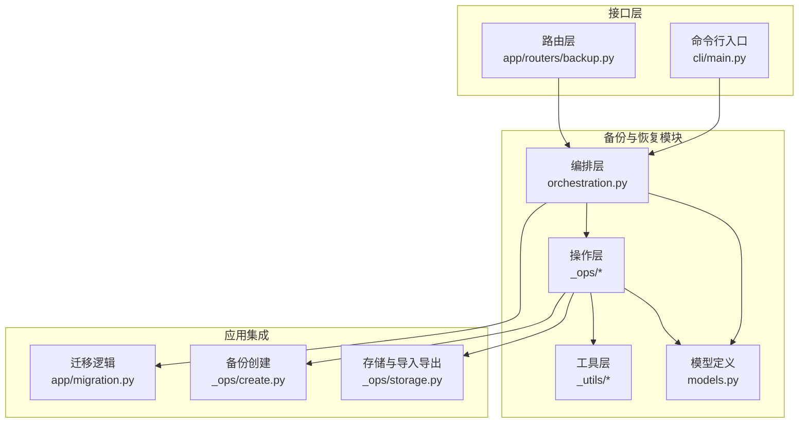
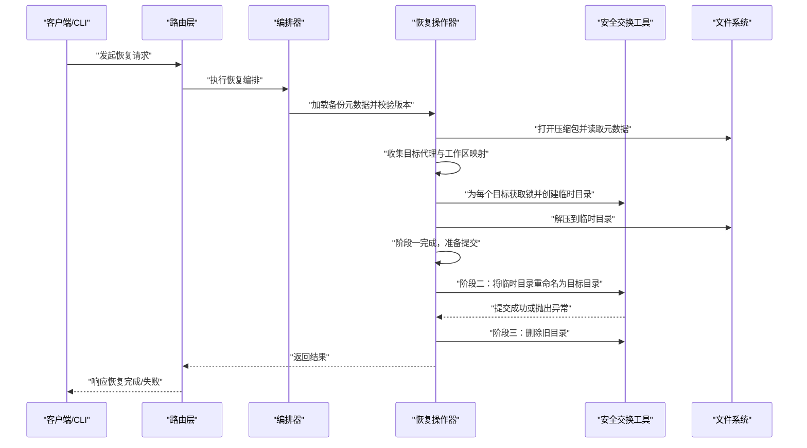
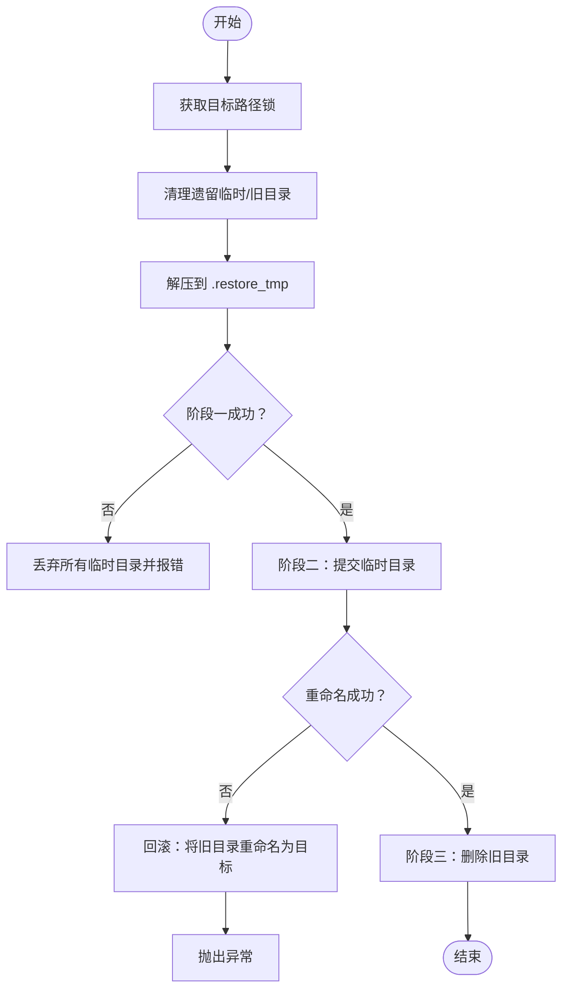
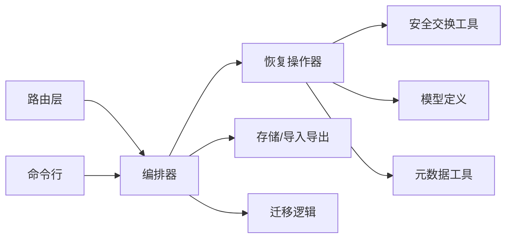

# 恢复机制实现

<cite>
**本文引用的文件**
- [src/qwenpaw/backup/_ops/restore.py](file://src/qwenpaw/backup/_ops/restore.py)
- [src/qwenpaw/backup/_utils/safe_swap.py](file://src/qwenpaw/backup/_utils/safe_swap.py)
- [src/qwenpaw/backup/orchestration.py](file://src/qwenpaw/backup/orchestration.py)
- [src/qwenpaw/backup/models.py](file://src/qwenpaw/backup/models.py)
- [src/qwenpaw/app/migration.py](file://src/qwenpaw/app/migration.py)
- [src/qwenpaw/app/routers/backup.py](file://src/qwenpaw/app/routers/backup.py)
- [src/qwenpaw/cli/main.py](file://src/qwenpaw/cli/main.py)
- [src/qwenpaw/cli/update_cmd.py](file://src/qwenpaw/cli/update_cmd.py)
- [src/qwenpaw/backup/_ops/create.py](file://src/qwenpaw/backup/_ops/create.py)
- [src/qwenpaw/backup/_ops/storage.py](file://src/qwenpaw/backup/_ops/storage.py)
- [src/qwenpaw/backup/_utils/meta.py](file://src/qwenpaw/backup/_utils/meta.py)
- [src/qwenpaw/backup/_utils/constants.py](file://src/qwenpaw/backup/_utils/constants.py)
</cite>

## 目录
1. [引言](#引言)
2. [项目结构](#项目结构)
3. [核心组件](#核心组件)
4. [架构总览](#架构总览)
5. [详细组件分析](#详细组件分析)
6. [依赖关系分析](#依赖关系分析)
7. [性能考虑](#性能考虑)
8. [故障排查指南](#故障排查指南)
9. [结论](#结论)
10. [附录](#附录)

## 引言
本文件面向运维与开发人员，系统化阐述 QwenPaw 的备份与恢复机制实现，重点覆盖以下方面：
- 恢复流程的原子性、事务控制与一致性保障
- 增量恢复、部分恢复与全量恢复的实现差异
- 数据验证、文件替换与依赖修复的关键步骤
- 冲突解决、版本管理与数据迁移策略
- 回滚机制、错误恢复与状态补偿方案
- 性能优化、并发控制与资源管理最佳实践
- 运维安全与风险控制措施

## 项目结构
QwenPaw 的备份与恢复能力由 Python 后端模块提供，核心位于 src/qwenpaw/backup 目录，包含操作层（_ops）、工具层（_utils）与编排层（orchestration）。前端控制台与 CLI 提供入口，路由层暴露 REST 接口。

图表来源
- [src/qwenpaw/backup/orchestration.py](file://src/qwenpaw/backup/orchestration.py)
- [src/qwenpaw/backup/_ops/restore.py](file://src/qwenpaw/backup/_ops/restore.py)
- [src/qwenpaw/backup/_utils/safe_swap.py](file://src/qwenpaw/backup/_utils/safe_swap.py)
- [src/qwenpaw/backup/models.py](file://src/qwenpaw/backup/models.py)
- [src/qwenpaw/app/routers/backup.py](file://src/qwenpaw/app/routers/backup.py)
- [src/qwenpaw/cli/main.py](file://src/qwenpaw/cli/main.py)
- [src/qwenpaw/backup/_ops/create.py](file://src/qwenpaw/backup/_ops/create.py)
- [src/qwenpaw/backup/_ops/storage.py](file://src/qwenpaw/backup/_ops/storage.py)
- [src/qwenpaw/app/migration.py](file://src/qwenpaw/app/migration.py)

章节来源
- [src/qwenpaw/backup/orchestration.py](file://src/qwenpaw/backup/orchestration.py)
- [src/qwenpaw/backup/_ops/restore.py](file://src/qwenpaw/backup/_ops/restore.py)
- [src/qwenpaw/backup/_utils/safe_swap.py](file://src/qwenpaw/backup/_utils/safe_swap.py)
- [src/qwenpaw/backup/models.py](file://src/qwenpaw/backup/models.py)
- [src/qwenpaw/app/routers/backup.py](file://src/qwenpaw/app/routers/backup.py)
- [src/qwenpaw/cli/main.py](file://src/qwenpaw/cli/main.py)
- [src/qwenpaw/backup/_ops/create.py](file://src/qwenpaw/backup/_ops/create.py)
- [src/qwenpaw/backup/_ops/storage.py](file://src/qwenpaw/backup/_ops/storage.py)
- [src/qwenpaw/app/migration.py](file://src/qwenpaw/app/migration.py)

## 核心组件
- 恢复操作器：负责解析备份元数据、收集目标、规划目标路径、分阶段提取与提交、处理全局配置与代理注册、应用工作区路径变更并保存配置。
- 安全交换工具：提供带锁的临时目录与旧目录管理，确保跨平台原子替换与回滚。
- 编排器：统一调度恢复流程，协调版本校验、并发控制与清理。
- 路由与 CLI：对外暴露 REST 接口与命令行入口，传递请求到编排器。
- 迁移与存储：与迁移逻辑协作，支持导入导出与存储后端交互。

章节来源
- [src/qwenpaw/backup/_ops/restore.py](file://src/qwenpaw/backup/_ops/restore.py)
- [src/qwenpaw/backup/_utils/safe_swap.py](file://src/qwenpaw/backup/_utils/safe_swap.py)
- [src/qwenpaw/backup/orchestration.py](file://src/qwenpaw/backup/orchestration.py)
- [src/qwenpaw/app/routers/backup.py](file://src/qwenpaw/app/routers/backup.py)
- [src/qwenpaw/cli/main.py](file://src/qwenpaw/cli/main.py)
- [src/qwenpaw/app/migration.py](file://src/qwenpaw/app/migration.py)

## 架构总览
恢复流程分为三个阶段：阶段一（提取与暂存）、阶段二（原子替换）、阶段三（清理旧目录）。通过临时目录与旧目录的两段重命名实现原子性；并发通过按目标路径加锁避免交错操作；失败时进行回滚与清理。

图表来源
- [src/qwenpaw/backup/orchestration.py](file://src/qwenpaw/backup/orchestration.py)
- [src/qwenpaw/backup/_ops/restore.py](file://src/qwenpaw/backup/_ops/restore.py)
- [src/qwenpaw/backup/_utils/safe_swap.py](file://src/qwenpaw/backup/_utils/safe_swap.py)

## 详细组件分析

### 恢复操作器（阶段划分与原子性）
- 阶段一：提取与暂存
  - 为每个目标路径获取锁，清理遗留的 .restore_tmp/.restore_old。
  - 解压对应内容到 .restore_tmp，记录已暂存目录列表。
  - 失败则逐个丢弃临时目录，保持一致性。
- 阶段二：原子替换
  - 若目标存在，先将原目录重命名为 .restore_old。
  - 将 .restore_tmp 重命名为目标目录；若失败，尝试将 .restore_old 重命名为目标目录以回滚。
- 阶段三：清理
  - 删除 .restore_old，完成收尾。

图表来源
- [src/qwenpaw/backup/_ops/restore.py](file://src/qwenpaw/backup/_ops/restore.py)
- [src/qwenpaw/backup/_utils/safe_swap.py](file://src/qwenpaw/backup/_utils/safe_swap.py)

章节来源
- [src/qwenpaw/backup/_ops/restore.py](file://src/qwenpaw/backup/_ops/restore.py)
- [src/qwenpaw/backup/_utils/safe_swap.py](file://src/qwenpaw/backup/_utils/safe_swap.py)

### 并发控制与线程安全
- 按目标路径建立 per-destination 锁，确保同一目标不会被多个并发调用交错操作。
- 整个阶段一、阶段二、阶段三在持有该锁的情况下执行，避免竞态条件。
- 在清理遗留工件前也必须持有锁，确保幂等清理。

章节来源
- [src/qwenpaw/backup/_utils/safe_swap.py](file://src/qwenpaw/backup/_utils/safe_swap.py)

### 数据验证与版本管理
- 版本校验：从备份元数据中读取版本号，仅允许受支持的版本继续。
- 元数据读取：从压缩包内读取元数据 JSON 并反序列化为模型对象。
- 请求参数校验：根据请求模式（全量/部分/增量）与目标集合进行约束检查。

章节来源
- [src/qwenpaw/backup/_ops/restore.py](file://src/qwenpaw/backup/_ops/restore.py)
- [src/qwenpaw/backup/_utils/meta.py](file://src/qwenpaw/backup/_utils/meta.py)
- [src/qwenpaw/backup/models.py](file://src/qwenpaw/backup/models.py)

### 文件替换与依赖修复
- 代理工作区目录重写：在提交完成后，对新增代理进行工作区路径重写。
- 全局配置合并：仅对实际参与恢复的代理进行配置合并，避免产生幽灵条目。
- 注册新代理：若恢复过程中发现新的代理 ID，将其注册到配置中并保存。

章节来源
- [src/qwenpaw/backup/_ops/restore.py](file://src/qwenpaw/backup/_ops/restore.py)

### 冲突解决与版本迁移
- 工作区路径规划：在恢复前计算目标路径并进行冲突检测（如目标已存在且非空），必要时拒绝或提示。
- 迁移策略：与迁移模块协同，处理历史技能目录、活动/定制化技能的冲突与去重，避免覆盖重要数据。
- 版本兼容：通过版本校验与模型反序列化确保元数据兼容。

章节来源
- [src/qwenpaw/backup/_ops/restore.py](file://src/qwenpaw/backup/_ops/restore.py)
- [src/qwenpaw/app/migration.py](file://src/qwenpaw/app/migration.py)

### 增量恢复、部分恢复与全量恢复
- 全量恢复：默认恢复所有代理工作区与全局配置（受 include_* 参数影响）。
- 部分恢复：通过 agent_ids 指定目标代理集合，仅恢复这些代理的工作区。
- 增量恢复：当前实现以“按代理集合选择”为主，未见独立的“基于时间戳/差异”的增量算法；如需增量，建议结合外部工具或扩展实现。

章节来源
- [src/qwenpaw/backup/_ops/restore.py](file://src/qwenpaw/backup/_ops/restore.py)
- [src/qwenpaw/backup/models.py](file://src/qwenpaw/backup/models.py)

### 回滚机制与错误恢复
- 提交失败回滚：阶段二重命名失败时，尝试将旧目录回滚到目标位置，保证目标目录始终可用。
- 阶段一失败清理：任何阶段一失败都会丢弃所有临时目录，避免残留中间状态。
- 状态补偿：清理遗留工件、重载主密钥（如涉及密钥目录）、更新代理注册表与工作区路径。

章节来源
- [src/qwenpaw/backup/_ops/restore.py](file://src/qwenpaw/backup/_ops/restore.py)
- [src/qwenpaw/backup/_utils/safe_swap.py](file://src/qwenpaw/backup/_utils/safe_swap.py)

### 接口与入口
- 路由层：提供 REST 接口用于触发恢复任务。
- CLI：命令行入口，便于自动化与运维脚本调用。
- 编排器：统一调度版本校验、并发控制、清理与最终落盘。

章节来源
- [src/qwenpaw/app/routers/backup.py](file://src/qwenpaw/app/routers/backup.py)
- [src/qwenpaw/cli/main.py](file://src/qwenpaw/cli/main.py)
- [src/qwenpaw/backup/orchestration.py](file://src/qwenpaw/backup/orchestration.py)

## 依赖关系分析
- 恢复操作器依赖安全交换工具提供的锁与原子替换能力。
- 编排器依赖模型定义与元数据工具，确保版本与元信息正确。
- 存储与导入导出模块为备份来源与目标提供 IO 支持。
- 迁移模块与恢复流程协同，处理历史数据结构变化。

图表来源
- [src/qwenpaw/backup/_ops/restore.py](file://src/qwenpaw/backup/_ops/restore.py)
- [src/qwenpaw/backup/_utils/safe_swap.py](file://src/qwenpaw/backup/_utils/safe_swap.py)
- [src/qwenpaw/backup/models.py](file://src/qwenpaw/backup/models.py)
- [src/qwenpaw/backup/_utils/meta.py](file://src/qwenpaw/backup/_utils/meta.py)
- [src/qwenpaw/backup/_ops/storage.py](file://src/qwenpaw/backup/_ops/storage.py)
- [src/qwenpaw/app/migration.py](file://src/qwenpaw/app/migration.py)
- [src/qwenpaw/backup/orchestration.py](file://src/qwenpaw/backup/orchestration.py)
- [src/qwenpaw/app/routers/backup.py](file://src/qwenpaw/app/routers/backup.py)
- [src/qwenpaw/cli/main.py](file://src/qwenpaw/cli/main.py)

章节来源
- [src/qwenpaw/backup/_ops/restore.py](file://src/qwenpaw/backup/_ops/restore.py)
- [src/qwenpaw/backup/_utils/safe_swap.py](file://src/qwenpaw/backup/_utils/safe_swap.py)
- [src/qwenpaw/backup/_ops/storage.py](file://src/qwenpaw/backup/_ops/storage.py)
- [src/qwenpaw/app/migration.py](file://src/qwenpaw/app/migration.py)
- [src/qwenpaw/backup/orchestration.py](file://src/qwenpaw/backup/orchestration.py)
- [src/qwenpaw/app/routers/backup.py](file://src/qwenpaw/app/routers/backup.py)
- [src/qwenpaw/cli/main.py](file://src/qwenpaw/cli/main.py)

## 性能考虑
- 并发控制：按目标路径加锁，避免锁争用导致的串行化瓶颈；建议在批量恢复时合理分组，减少锁竞争。
- I/O 优化：优先使用本地磁盘作为临时目录与目标目录，减少跨盘移动；利用两段重命名降低复制成本。
- 清理策略：在阶段三及时删除旧目录，避免磁盘空间占用；清理遗留工件时采用幂等策略。
- 压缩与元数据：备份元数据应最小化冗余，避免在恢复时进行不必要的解码与解析。

## 故障排查指南
- 备份不存在或损坏：检查备份文件是否存在与可读，确认元数据完整性。
- 版本不匹配：确认备份版本是否在受支持列表内，必要时升级或降级。
- 目标冲突：当目标路径已存在且非空时，恢复会拒绝；请清理或调整目标路径。
- 权限问题：确保运行用户对目标目录具有读写权限，尤其是阶段二重命名与阶段三删除旧目录。
- 并发冲突：若出现“目标被占用”，等待其他恢复任务释放锁或调整并发策略。
- 回滚失败：若阶段二回滚失败，检查旧目录是否存在且可访问，手动干预后重试。

章节来源
- [src/qwenpaw/backup/_ops/restore.py](file://src/qwenpaw/backup/_ops/restore.py)
- [src/qwenpaw/backup/_utils/safe_swap.py](file://src/qwenpaw/backup/_utils/safe_swap.py)

## 结论
QwenPaw 的恢复机制通过“阶段一提取+阶段二原子替换+阶段三清理”的三段式设计，结合按目标路径加锁与旧目录回滚，实现了高可靠的一致性保障。配合版本校验、冲突检测与迁移策略，能够在复杂场景下安全地完成全量/部分恢复。未来可在增量恢复与更细粒度的并发调度上进一步优化。

## 附录
- 运维建议
  - 恢复前先备份当前工作区，以便快速回退。
  - 使用只读快照或隔离环境进行恢复演练。
  - 对关键代理与全局配置进行单独备份，优先恢复。
  - 监控磁盘空间与 I/O 峰值，避免恢复期间资源不足。
- 风险控制
  - 严格限制并发恢复数量，避免锁争用与磁盘压力。
  - 对外部导入的备份进行签名与完整性校验（建议在存储层增强）。
  - 记录恢复日志与审计轨迹，便于问题定位与合规审查。