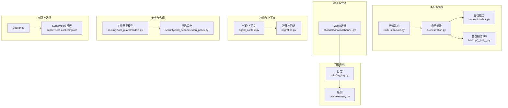
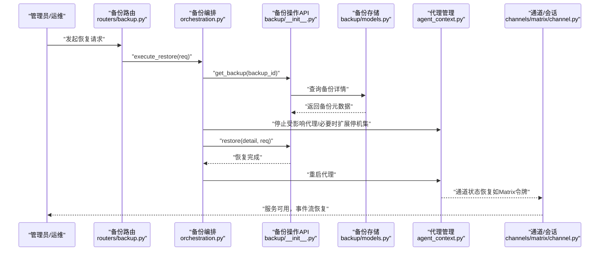
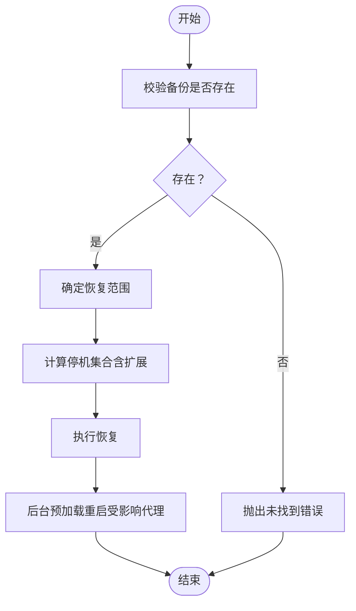
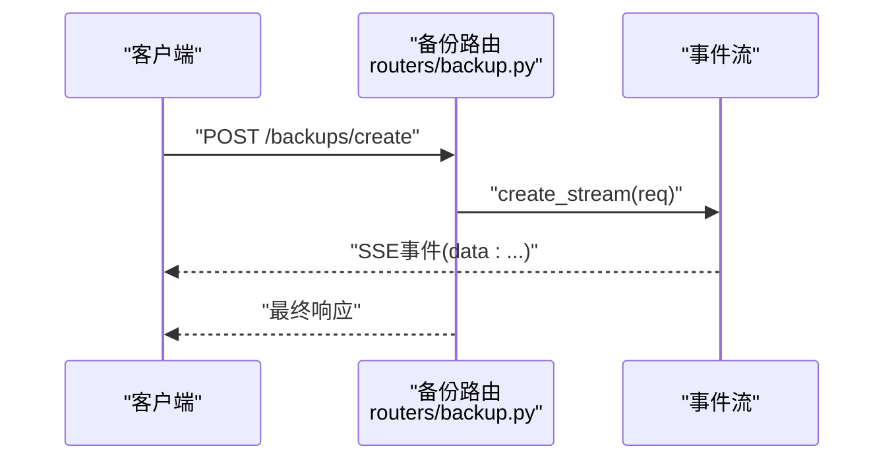
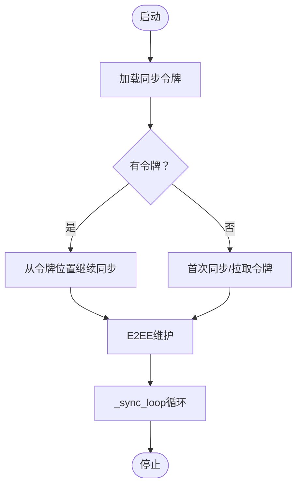
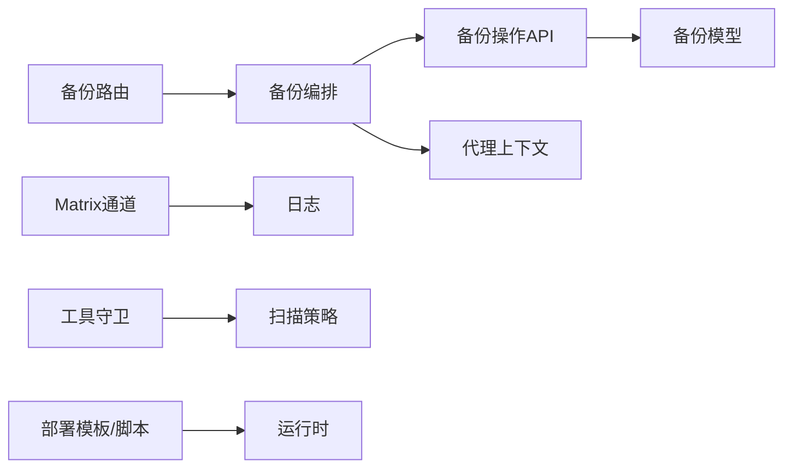

# 灾难恢复计划

<cite>
**本文引用的文件**
- [src/qwenpaw/backup/orchestration.py](file://src/qwenpaw/backup/orchestration.py)
- [src/qwenpaw/backup/__init__.py](file://src/qwenpaw/backup/__init__.py)
- [src/qwenpaw/app/routers/backup.py](file://src/qwenpaw/app/routers/backup.py)
- [src/qwenpaw/backup/models.py](file://src/qwenpaw/backup/models.py)
- [src/qwenpaw/app/channels/matrix/channel.py](file://src/qwenpaw/app/channels/matrix/channel.py)
- [src/qwenpaw/app/agent_context.py](file://src/qwenpaw/app/agent_context.py)
- [src/qwenpaw/app/migration.py](file://src/qwenpaw/app/migration.py)
- [src/qwenpaw/utils/logging.py](file://src/qwenpaw/utils/logging.py)
- [src/qwenpaw/utils/telemetry.py](file://src/qwenpaw/utils/telemetry.py)
- [src/qwenpaw/security/tool_guard/models.py](file://src/qwenpaw/security/tool_guard/models.py)
- [src/qwenpaw/security/skill_scanner/scan_policy.py](file://src/qwenpaw/security/skill_scanner/scan_policy.py)
- [website/public/docs/backup.en.md](file://website/public/docs/backup.en.md)
- [deploy/Dockerfile](file://deploy/Dockerfile)
- [deploy/config/supervisord.conf.template](file://deploy/config/supervisord.conf.template)
- [scripts/docker_build.sh](file://scripts/docker_build.sh)
- [scripts/docker_sync_latest.sh](file://scripts/docker_sync_latest.sh)
- [scripts/install.sh](file://scripts/install.sh)
- [scripts/install.bat](file://scripts/install.bat)
- [scripts/run_tests.py](file://scripts/run_tests.py)
- [README.md](file://README.md)
</cite>

## 目录
1. [引言](#引言)
2. [项目结构](#项目结构)
3. [核心组件](#核心组件)
4. [架构总览](#架构总览)
5. [详细组件分析](#详细组件分析)
6. [依赖关系分析](#依赖关系分析)
7. [性能考量](#性能考量)
8. [故障排查指南](#故障排查指南)
9. [结论](#结论)
10. [附录](#附录)

## 引言
本文件面向企业级灾难恢复（DR）与业务连续性（BC），基于仓库现有备份与通道能力，构建可落地的灾难恢复计划。内容涵盖：RTO/RPO目标设定建议、恢复优先级划分、跨平台数据同步与异地备份、多活部署思路、自动切换与手动接管流程、恢复测试与演练验证、合规与审计、预算与资源规划、以及面向管理层的风险评估与决策支持。

## 项目结构
围绕灾难恢复的关键模块主要分布在以下区域：
- 备份与恢复：备份创建、存储、导入导出、恢复编排与模型定义
- 控制器与路由：备份相关HTTP接口与事件流
- 通道与会话：以Matrix通道为例展示状态持久化与重连机制
- 日志与遥测：统一日志与遥测采集，支撑审计与问题定位
- 安全与扫描：工具守卫与技能扫描策略，支撑合规与安全审计
- 部署与运行：容器化与进程管理模板，支撑多活部署与快速回切

图表来源
- [src/qwenpaw/backup/orchestration.py:1-109](file://src/qwenpaw/backup/orchestration.py#L1-L109)
- [src/qwenpaw/app/routers/backup.py:74-112](file://src/qwenpaw/app/routers/backup.py#L74-L112)
- [src/qwenpaw/backup/models.py](file://src/qwenpaw/backup/models.py)
- [src/qwenpaw/app/channels/matrix/channel.py:316-591](file://src/qwenpaw/app/channels/matrix/channel.py#L316-L591)
- [src/qwenpaw/app/agent_context.py:52-93](file://src/qwenpaw/app/agent_context.py#L52-L93)
- [src/qwenpaw/app/migration.py:739-762](file://src/qwenpaw/app/migration.py#L739-L762)
- [src/qwenpaw/utils/logging.py](file://src/qwenpaw/utils/logging.py)
- [src/qwenpaw/utils/telemetry.py](file://src/qwenpaw/utils/telemetry.py)
- [src/qwenpaw/security/tool_guard/models.py:39-77](file://src/qwenpaw/security/tool_guard/models.py#L39-L77)
- [src/qwenpaw/security/skill_scanner/scan_policy.py:458-475](file://src/qwenpaw/security/skill_scanner/scan_policy.py#L458-L475)
- [deploy/Dockerfile](file://deploy/Dockerfile)
- [deploy/config/supervisord.conf.template](file://deploy/config/supervisord.conf.template)

章节来源
- [src/qwenpaw/backup/orchestration.py:1-109](file://src/qwenpaw/backup/orchestration.py#L1-L109)
- [src/qwenpaw/app/routers/backup.py:74-112](file://src/qwenpaw/app/routers/backup.py#L74-L112)
- [src/qwenpaw/backup/models.py](file://src/qwenpaw/backup/models.py)
- [src/qwenpaw/app/channels/matrix/channel.py:316-591](file://src/qwenpaw/app/channels/matrix/channel.py#L316-L591)
- [src/qwenpaw/app/agent_context.py:52-93](file://src/qwenpaw/app/agent_context.py#L52-L93)
- [src/qwenpaw/app/migration.py:739-762](file://src/qwenpaw/app/migration.py#L739-L762)
- [src/qwenpaw/utils/logging.py](file://src/qwenpaw/utils/logging.py)
- [src/qwenpaw/utils/telemetry.py](file://src/qwenpaw/utils/telemetry.py)
- [src/qwenpaw/security/tool_guard/models.py:39-77](file://src/qwenpaw/security/tool_guard/models.py#L39-L77)
- [src/qwenpaw/security/skill_scanner/scan_policy.py:458-475](file://src/qwenpaw/security/skill_scanner/scan_policy.py#L458-L475)
- [deploy/Dockerfile](file://deploy/Dockerfile)
- [deploy/config/supervisord.conf.template](file://deploy/config/supervisord.conf.template)

## 核心组件
- 备份编排与恢复流程：负责停止受影响代理、执行恢复、重启代理，并在需要时扩展停机范围以释放文件句柄，确保目录重命名成功。
- 备份HTTP接口：提供备份列表、删除、导入、创建流式事件等REST接口；支持SSE事件推送。
- 备份模型与元数据：定义备份请求、恢复请求、备份元信息等数据结构。
- 通道状态持久化：以Matrix通道为例，持久化同步令牌，实现断线重连与消息不重放。
- 日志与遥测：统一日志输出与遥测上报，支撑审计与问题定位。
- 安全与合规：工具守卫威胁分类与扫描策略，支撑合规检查与风险控制。
- 部署与运行：容器化与Supervisord进程管理模板，支撑多活部署与快速回切。

章节来源
- [src/qwenpaw/backup/orchestration.py:20-109](file://src/qwenpaw/backup/orchestration.py#L20-L109)
- [src/qwenpaw/app/routers/backup.py:74-112](file://src/qwenpaw/app/routers/backup.py#L74-L112)
- [src/qwenpaw/backup/models.py](file://src/qwenpaw/backup/models.py)
- [src/qwenpaw/app/channels/matrix/channel.py:520-560](file://src/qwenpaw/app/channels/matrix/channel.py#L520-L560)
- [src/qwenpaw/utils/logging.py](file://src/qwenpaw/utils/logging.py)
- [src/qwenpaw/utils/telemetry.py](file://src/qwenpaw/utils/telemetry.py)
- [src/qwenpaw/security/tool_guard/models.py:39-77](file://src/qwenpaw/security/tool_guard/models.py#L39-L77)
- [src/qwenpaw/security/skill_scanner/scan_policy.py:458-475](file://src/qwenpaw/security/skill_scanner/scan_policy.py#L458-L475)
- [deploy/Dockerfile](file://deploy/Dockerfile)
- [deploy/config/supervisord.conf.template](file://deploy/config/supervisord.conf.template)

## 架构总览
下图展示了灾难恢复从“触发—编排—执行—验证—记录”的闭环流程，映射到实际代码模块：

图表来源
- [src/qwenpaw/app/routers/backup.py:74-112](file://src/qwenpaw/app/routers/backup.py#L74-L112)
- [src/qwenpaw/backup/orchestration.py:81-109](file://src/qwenpaw/backup/orchestration.py#L81-L109)
- [src/qwenpaw/backup/__init__.py:1-21](file://src/qwenpaw/backup/__init__.py#L1-L21)
- [src/qwenpaw/backup/models.py](file://src/qwenpaw/backup/models.py)
- [src/qwenpaw/app/agent_context.py:52-93](file://src/qwenpaw/app/agent_context.py#L52-L93)
- [src/qwenpaw/app/channels/matrix/channel.py:520-560](file://src/qwenpaw/app/channels/matrix/channel.py#L520-L560)

## 详细组件分析

### 备份编排与恢复流程
- 停止受影响代理：根据请求选择特定代理或扩展至所有运行中的代理，避免文件句柄导致目录重命名失败。
- 恢复范围控制：支持“全量恢复”和“自定义恢复”，前者完全替换当前实例，后者按模块与代理粒度选择性恢复。
- 后台预加载：恢复后异步尝试重启受影响代理，失败不影响整体流程。
- 错误处理：对备份不存在、底层恢复异常进行明确错误传播，便于上层路由转换为HTTP响应。

图表来源
- [src/qwenpaw/backup/orchestration.py:81-109](file://src/qwenpaw/backup/orchestration.py#L81-L109)

章节来源
- [src/qwenpaw/backup/orchestration.py:20-109](file://src/qwenpaw/backup/orchestration.py#L20-L109)
- [website/public/docs/backup.en.md:90-108](file://website/public/docs/backup.en.md#L90-L108)

### 备份HTTP接口与事件流
- 流式事件：创建备份采用SSE推送事件，禁用代理缓冲，确保实时反馈。
- 路由注册顺序：固定路径路由需先于动态路径注册，避免冲突。
- 导入/删除/列表：提供导入、删除、列出备份的REST接口，支持批量删除与覆盖导入。

图表来源
- [src/qwenpaw/app/routers/backup.py:74-87](file://src/qwenpaw/app/routers/backup.py#L74-L87)

章节来源
- [src/qwenpaw/app/routers/backup.py:74-112](file://src/qwenpaw/app/routers/backup.py#L74-L112)

### 备份模型与元数据
- 备份请求/恢复请求：定义备份粒度、范围、是否包含代理、密钥与技能池等字段。
- 备份元数据：描述备份时间、大小、包含的工作区统计、版本信息等，用于恢复前确认与审计。

章节来源
- [src/qwenpaw/backup/models.py](file://src/qwenpaw/backup/models.py)

### 通道状态持久化与重连
- 同步令牌持久化：启动时从磁盘加载next_batch令牌，失败则重新拉取，确保断线后能从上次位置继续同步。
- E2EE维护：在每次同步后执行密钥上传、查询、认领与发送设备消息，保证端到端加密正常工作。
- 生命周期管理：stop时取消同步任务、关闭HTTP客户端与Matrix客户端，确保资源释放。

图表来源
- [src/qwenpaw/app/channels/matrix/channel.py:520-591](file://src/qwenpaw/app/channels/matrix/channel.py#L520-L591)

章节来源
- [src/qwenpaw/app/channels/matrix/channel.py:316-591](file://src/qwenpaw/app/channels/matrix/channel.py#L316-L591)

### 日志与遥测
- 日志：统一日志输出，包含备份、恢复、通道、安全等模块的关键事件，便于审计与排障。
- 遥测：采集运行指标与事件，支撑监控告警与容量规划。

章节来源
- [src/qwenpaw/utils/logging.py](file://src/qwenpaw/utils/logging.py)
- [src/qwenpaw/utils/telemetry.py](file://src/qwenpaw/utils/telemetry.py)

### 安全与合规
- 工具守卫威胁分类：涵盖命令注入、敏感文件访问、网络滥用、凭证暴露、资源滥用、提示词注入、代码执行、权限提升等类别。
- 扫描策略：支持置信度阈值、正则长度限制、严重性覆盖与规则禁用列表，便于按企业策略调整。

章节来源
- [src/qwenpaw/security/tool_guard/models.py:39-77](file://src/qwenpaw/security/tool_guard/models.py#L39-L77)
- [src/qwenpaw/security/skill_scanner/scan_policy.py:458-475](file://src/qwenpaw/security/skill_scanner/scan_policy.py#L458-L475)

### 运维与部署
- 容器化：通过Dockerfile构建镜像，配合脚本完成打包与同步。
- 进程管理：Supervisord模板定义进程与重启策略，支撑多活部署与快速回切。
- 安装与测试：提供安装脚本与测试入口，便于环境准备与回归验证。

章节来源
- [deploy/Dockerfile](file://deploy/Dockerfile)
- [deploy/config/supervisord.conf.template](file://deploy/config/supervisord.conf.template)
- [scripts/docker_build.sh](file://scripts/docker_build.sh)
- [scripts/docker_sync_latest.sh](file://scripts/docker_sync_latest.sh)
- [scripts/install.sh](file://scripts/install.sh)
- [scripts/install.bat](file://scripts/install.bat)
- [scripts/run_tests.py](file://scripts/run_tests.py)

## 依赖关系分析
- 备份路由依赖备份编排与备份操作API；备份编排依赖备份存储与代理管理；通道依赖日志与外部存储（如MinIO）进行令牌持久化。
- 安全模块与扫描策略相互独立但共同服务于合规与风险控制。
- 部署模板与脚本支撑多活部署与快速回切，降低RTO。

图表来源
- [src/qwenpaw/app/routers/backup.py:74-112](file://src/qwenpaw/app/routers/backup.py#L74-L112)
- [src/qwenpaw/backup/orchestration.py:81-109](file://src/qwenpaw/backup/orchestration.py#L81-L109)
- [src/qwenpaw/backup/__init__.py:1-21](file://src/qwenpaw/backup/__init__.py#L1-L21)
- [src/qwenpaw/backup/models.py](file://src/qwenpaw/backup/models.py)
- [src/qwenpaw/app/agent_context.py:52-93](file://src/qwenpaw/app/agent_context.py#L52-L93)
- [src/qwenpaw/app/channels/matrix/channel.py:520-560](file://src/qwenpaw/app/channels/matrix/channel.py#L520-L560)
- [src/qwenpaw/utils/logging.py](file://src/qwenpaw/utils/logging.py)
- [src/qwenpaw/security/tool_guard/models.py:39-77](file://src/qwenpaw/security/tool_guard/models.py#L39-L77)
- [src/qwenpaw/security/skill_scanner/scan_policy.py:458-475](file://src/qwenpaw/security/skill_scanner/scan_policy.py#L458-L475)
- [deploy/config/supervisord.conf.template](file://deploy/config/supervisord.conf.template)

## 性能考量
- 恢复窗口（RTO）：通过“后台预加载”与“选择性停机”减少停机时间；自定义恢复可仅恢复关键模块，缩短RTO。
- 数据一致性（RPO）：通道令牌持久化与增量同步降低数据丢失；备份创建采用流式事件，减少阻塞。
- 并发与稳定性：编排层对单个代理失败不阻塞其他代理重启，提升整体恢复成功率。
- 观测性：日志与遥测结合，有助于定位性能瓶颈与异常。

## 故障排查指南
- 备份不存在：编排层会抛出未找到错误，检查备份ID与存储状态。
- 恢复失败：查看底层恢复异常并转换为HTTP响应；结合日志定位具体步骤。
- 通道断线：检查令牌文件是否存在与可读写，确认E2EE维护是否报错；核对同步超时与请求超时配置。
- 安全告警：依据工具守卫威胁分类与扫描策略，逐项核查高危规则与严重性覆盖。

章节来源
- [src/qwenpaw/backup/orchestration.py:73-80](file://src/qwenpaw/backup/orchestration.py#L73-L80)
- [src/qwenpaw/app/channels/matrix/channel.py:520-591](file://src/qwenpaw/app/channels/matrix/channel.py#L520-L591)
- [src/qwenpaw/security/tool_guard/models.py:39-77](file://src/qwenpaw/security/tool_guard/models.py#L39-L77)
- [src/qwenpaw/security/skill_scanner/scan_policy.py:458-475](file://src/qwenpaw/security/skill_scanner/scan_policy.py#L458-L475)

## 结论
本计划以仓库现有备份与通道能力为基础，提出可操作的灾难恢复方案：通过“全量/自定义恢复”控制RTO/RPO，利用通道令牌持久化与增量同步保障数据连续性，结合日志与遥测实现可观测与审计，借助安全扫描与工具守卫强化合规与风控。多活部署与快速回切进一步缩短RTO，配合定期演练与持续改进形成闭环。

## 附录

### RTO/RPO目标与恢复优先级
- RTO/RPO目标：根据业务SLA设定分钟级到小时级目标；对核心代理与通道优先恢复，非关键模块延后。
- 恢复优先级：代理工作区 > 全局设置 > 技能池 > 秘钥；通道与消息优先恢复以保障业务连续性。

### 跨平台数据同步与异地备份
- 跨平台：通道令牌持久化与增量同步适配多平台运行环境。
- 异地备份：备份元数据中包含版本与时间戳，结合SSE事件流实现跨地域传输与校验。

章节来源
- [src/qwenpaw/app/channels/matrix/channel.py:520-560](file://src/qwenpaw/app/channels/matrix/channel.py#L520-L560)
- [src/qwenpaw/backup/models.py](file://src/qwenpaw/backup/models.py)

### 多活部署与自动切换
- 多活：通过Supervisord模板与容器化部署，实现多节点并行运行与负载分担。
- 自动切换：通道层的令牌持久化与断线重连机制，结合健康检查与故障转移策略，实现自动切换。

章节来源
- [deploy/config/supervisord.conf.template](file://deploy/config/supervisord.conf.template)
- [deploy/Dockerfile](file://deploy/Dockerfile)
- [src/qwenpaw/app/channels/matrix/channel.py:520-591](file://src/qwenpaw/app/channels/matrix/channel.py#L520-L591)

### 灾难场景识别、自动切换与手动接管
- 场景识别：通道断线、备份恢复失败、代理不可用等触发告警。
- 自动切换：通道令牌恢复与增量同步；备份编排自动扩展停机范围。
- 手动接管：通过备份路由进行全量/自定义恢复；管理员确认后执行。

章节来源
- [src/qwenpaw/app/channels/matrix/channel.py:520-591](file://src/qwenpaw/app/channels/matrix/channel.py#L520-L591)
- [src/qwenpaw/app/routers/backup.py:74-112](file://src/qwenpaw/app/routers/backup.py#L74-L112)
- [website/public/docs/backup.en.md:90-108](file://website/public/docs/backup.en.md#L90-L108)

### 恢复测试、演练验证与持续改进
- 测试：使用安装脚本与测试入口准备环境，执行备份与恢复流程验证。
- 演练：定期组织跨团队演练，验证自动切换与手动接管流程。
- 改进：基于日志、遥测与安全扫描结果，持续优化恢复策略与参数。

章节来源
- [scripts/install.sh](file://scripts/install.sh)
- [scripts/install.bat](file://scripts/install.bat)
- [scripts/run_tests.py](file://scripts/run_tests.py)
- [src/qwenpaw/utils/logging.py](file://src/qwenpaw/utils/logging.py)
- [src/qwenpaw/utils/telemetry.py](file://src/qwenpaw/utils/telemetry.py)
- [src/qwenpaw/security/skill_scanner/scan_policy.py:458-475](file://src/qwenpaw/security/skill_scanner/scan_policy.py#L458-L475)

### 预算规划、资源配置与实施路径
- 预算：备份存储、通道带宽、多活节点、监控与安全扫描工具成本估算。
- 资源：CPU/内存/存储/网络按峰值与冗余系数配置；通道节点与备份节点分离。
- 实施路径：第一阶段完成备份与通道基础能力；第二阶段完善多活与自动切换；第三阶段建立演练与持续改进体系。

### 合规性、审计与监管报告
- 合规：工具守卫威胁分类与扫描策略满足常见合规要求。
- 审计：统一日志与遥测记录关键事件，支持审计追溯。
- 报告：基于遥测与日志生成运营与安全报告，满足监管要求。

章节来源
- [src/qwenpaw/security/tool_guard/models.py:39-77](file://src/qwenpaw/security/tool_guard/models.py#L39-L77)
- [src/qwenpaw/security/skill_scanner/scan_policy.py:458-475](file://src/qwenpaw/security/skill_scanner/scan_policy.py#L458-L475)
- [src/qwenpaw/utils/logging.py](file://src/qwenpaw/utils/logging.py)
- [src/qwenpaw/utils/telemetry.py](file://src/qwenpaw/utils/telemetry.py)

### 决策支持与风险评估
- 风险评估：基于代理数量、通道类型、备份频率与恢复范围，量化RTO/RPO与成本。
- 决策支持：提供多方案对比（全量/自定义）、多活/单活的成本与收益分析，辅助管理层决策。