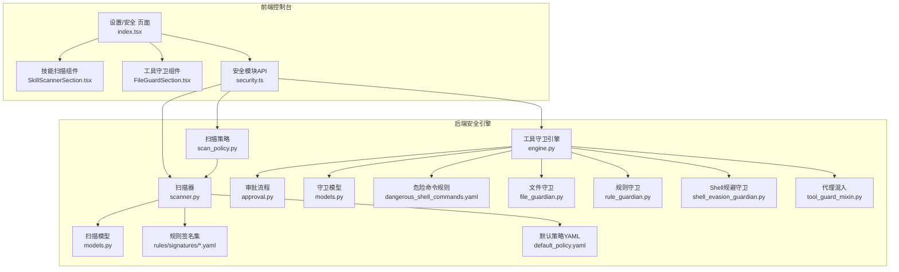
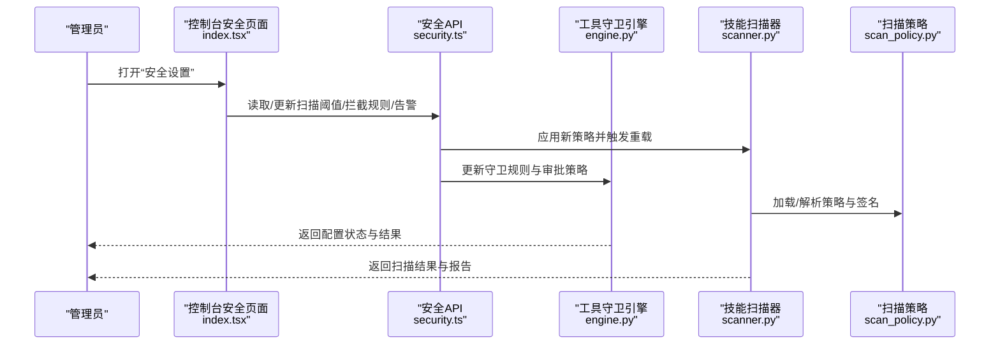
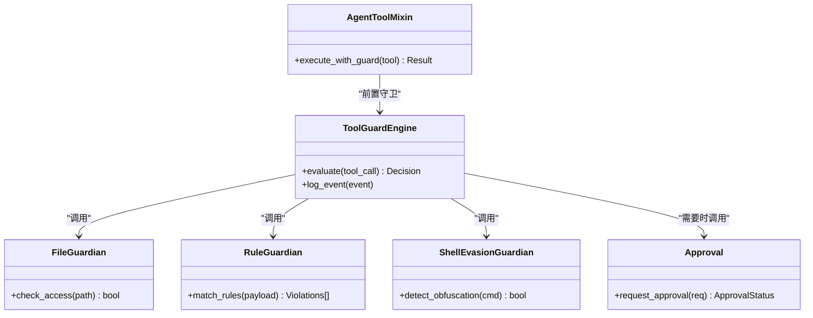
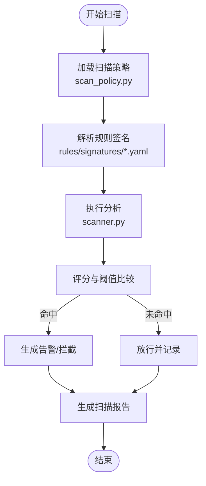
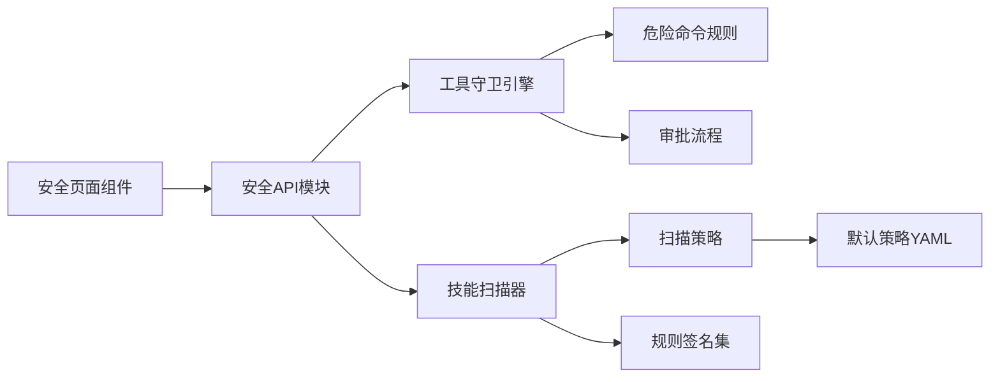

# 安全配置

<cite>
**本文引用的文件**
- [console/src/pages/Settings/Security/index.tsx](file://console/src/pages/Settings/Security/index.tsx)
- [console/src/pages/Settings/Security/components/SkillScannerSection.tsx](file://console/src/pages/Settings/Security/components/SkillScannerSection.tsx)
- [console/src/pages/Settings/Security/components/FileGuardSection.tsx](file://console/src/pages/Settings/Security/components/FileGuardSection.tsx)
- [console/src/pages/Settings/Security/useSkillScanner.ts](file://console/src/pages/Settings/Security/useSkillScanner.ts)
- [console/src/pages/Settings/Security/useToolGuard.ts](file://console/src/pages/Settings/Security/useToolGuard.ts)
- [console/src/api/modules/security.ts](file://console/src/api/modules/security.ts)
- [src/qwenpaw/security/skill_scanner/scan_policy.py](file://src/qwenpaw/security/skill_scanner/scan_policy.py)
- [src/qwenpaw/security/skill_scanner/scanner.py](file://src/qwenpaw/security/skill_scanner/scanner.py)
- [src/qwenpaw/security/skill_scanner/models.py](file://src/qwenpaw/security/skill_scanner/models.py)
- [src/qwenpaw/security/skill_scanner/data/default_policy.yaml](file://src/qwenpaw/security/skill_scanner/data/default_policy.yaml)
- [src/qwenpaw/security/skill_scanner/rules/signatures/command_injection.yaml](file://src/qwenpaw/security/skill_scanner/rules/signatures/command_injection.yaml)
- [src/qwenpaw/security/skill_scanner/rules/signatures/data_exfiltration.yaml](file://src/qwenpaw/security/skill_scanner/rules/signatures/data_exfiltration.yaml)
- [src/qwenpaw/security/skill_scanner/rules/signatures/hardcoded_secrets.yaml](file://src/qwenpaw/security/skill_scanner/rules/signatures/hardcoded_secrets.yaml)
- [src/qwenpaw/security/skill_scanner/rules/signatures/obfuscation.yaml](file://src/qwenpaw/security/skill_scanner/rules/signatures/obfuscation.yaml)
- [src/qwenpaw/security/skill_scanner/rules/signatures/prompt_injection.yaml](file://src/qwenpaw/security/skill_scanner/rules/signatures/prompt_injection.yaml)
- [src/qwenpaw/security/skill_scanner/rules/signatures/social_engineering.yaml](file://src/qwenpaw/security/skill_scanner/rules/signatures/social_engineering.yaml)
- [src/qwenpaw/security/skill_scanner/rules/signatures/supply_chain.yaml](file://src/qwenpaw/security/skill_scanner/rules/signatures/supply_chain.yaml)
- [src/qwenpaw/security/skill_scanner/rules/signatures/unauthorized_tool_use.yaml](file://src/qwenpaw/security/skill_scanner/rules/signatures/unauthorized_tool_use.yaml)
- [src/qwenpaw/security/tool_guard/engine.py](file://src/qwenpaw/security/tool_guard/engine.py)
- [src/qwenpaw/security/tool_guard/approval.py](file://src/qwenpaw/security/tool_guard/approval.py)
- [src/qwenpaw/security/tool_guard/models.py](file://src/qwenpaw/security/tool_guard/models.py)
- [src/qwenpaw/security/tool_guard/guardians/file_guardian.py](file://src/qwenpaw/security/tool_guard/guardians/file_guardian.py)
- [src/qwenpaw/security/tool_guard/guardians/rule_guardian.py](file://src/qwenpaw/security/tool_guard/guardians/rule_guardian.py)
- [src/qwenpaw/security/tool_guard/guardians/shell_evasion_guardian.py](file://src/qwenpaw/security/tool_guard/guardians/shell_evasion_guardian.py)
- [src/qwenpaw/security/tool_guard/rules/dangerous_shell_commands.yaml](file://src/qwenpaw/security/tool_guard/rules/dangerous_shell_commands.yaml)
- [src/qwenpaw/agents/tool_guard_mixin.py](file://src/qwenpaw/agents/tool_guard_mixin.py)
- [website/public/docs/security.en.md](file://website/public/docs/security.en.md)
- [website/public/docs/security.zh.md](file://website/public/docs/security.zh.md)
</cite>

## 目录
1. [简介](#简介)
2. [项目结构](#项目结构)
3. [核心组件](#核心组件)
4. [架构总览](#架构总览)
5. [详细组件分析](#详细组件分析)
6. [依赖关系分析](#依赖关系分析)
7. [性能考量](#性能考量)
8. [故障排除指南](#故障排除指南)
9. [结论](#结论)
10. [附录](#附录)

## 简介
本指南面向QwenPaw管理员与运维人员，围绕Web控制台“安全设置”页面，系统讲解工具守卫（Tool Guard）、技能扫描（Skill Scanner）与访问控制相关配置项的调整方法，并结合后端安全策略实现，给出扫描阈值、拦截规则、告警设置等最佳实践与排障建议。同时提供安全日志查看与分析思路，以及企业级部署与合规性参考。

## 项目结构
安全能力由前端控制台与后端安全引擎共同构成：
- 前端：控制台“设置/安全”页面，提供工具守卫与技能扫描的可视化配置入口。
- 后端：工具守卫与技能扫描两大子系统，分别负责运行时工具调用审批与技能代码/提示风险扫描。

图表来源
- [console/src/pages/Settings/Security/index.tsx:1-200](file://console/src/pages/Settings/Security/index.tsx#L1-L200)
- [console/src/pages/Settings/Security/components/SkillScannerSection.tsx:1-200](file://console/src/pages/Settings/Security/components/SkillScannerSection.tsx#L1-L200)
- [console/src/pages/Settings/Security/components/FileGuardSection.tsx:1-200](file://console/src/pages/Settings/Security/components/FileGuardSection.tsx#L1-L200)
- [console/src/api/modules/security.ts:1-200](file://console/src/api/modules/security.ts#L1-L200)
- [src/qwenpaw/security/skill_scanner/scan_policy.py:1-200](file://src/qwenpaw/security/skill_scanner/scan_policy.py#L1-L200)
- [src/qwenpaw/security/skill_scanner/scanner.py:1-200](file://src/qwenpaw/security/skill_scanner/scanner.py#L1-L200)
- [src/qwenpaw/security/skill_scanner/models.py:1-200](file://src/qwenpaw/security/skill_scanner/models.py#L1-L200)
- [src/qwenpaw/security/skill_scanner/data/default_policy.yaml:1-200](file://src/qwenpaw/security/skill_scanner/data/default_policy.yaml#L1-L200)
- [src/qwenpaw/security/skill_scanner/rules/signatures/command_injection.yaml:1-200](file://src/qwenpaw/security/skill_scanner/rules/signatures/command_injection.yaml#L1-L200)
- [src/qwenpaw/security/tool_guard/engine.py:1-200](file://src/qwenpaw/security/tool_guard/engine.py#L1-L200)
- [src/qwenpaw/security/tool_guard/approval.py:1-200](file://src/qwenpaw/security/tool_guard/approval.py#L1-L200)
- [src/qwenpaw/security/tool_guard/models.py:1-200](file://src/qwenpaw/security/tool_guard/models.py#L1-L200)
- [src/qwenpaw/security/tool_guard/guardians/file_guardian.py:1-200](file://src/qwenpaw/security/tool_guard/guardians/file_guardian.py#L1-L200)
- [src/qwenpaw/security/tool_guard/guardians/rule_guardian.py:1-200](file://src/qwenpaw/security/tool_guard/guardians/rule_guardian.py#L1-L200)
- [src/qwenpaw/security/tool_guard/guardians/shell_evasion_guardian.py:1-200](file://src/qwenpaw/security/tool_guard/guardians/shell_evasion_guardian.py#L1-L200)
- [src/qwenpaw/agents/tool_guard_mixin.py:1-200](file://src/qwenpaw/agents/tool_guard_mixin.py#L1-L200)

章节来源
- [console/src/pages/Settings/Security/index.tsx:1-200](file://console/src/pages/Settings/Security/index.tsx#L1-L200)
- [console/src/pages/Settings/Security/components/SkillScannerSection.tsx:1-200](file://console/src/pages/Settings/Security/components/SkillScannerSection.tsx#L1-L200)
- [console/src/pages/Settings/Security/components/FileGuardSection.tsx:1-200](file://console/src/pages/Settings/Security/components/FileGuardSection.tsx#L1-L200)
- [console/src/api/modules/security.ts:1-200](file://console/src/api/modules/security.ts#L1-L200)

## 核心组件
- 工具守卫（Tool Guard）
  - 负责在执行工具前进行规则校验与审批，支持文件访问限制、危险命令阻断、规则匹配拦截等。
  - 关键实现：引擎、审批流程、文件/规则/Shell规避守卫、危险命令规则集。
- 技能扫描（Skill Scanner）
  - 对技能脚本与提示内容进行静态/动态扫描，识别注入、泄露、混淆、供应链等高危模式。
  - 关键实现：扫描策略、扫描器、规则签名集、默认策略YAML。
- 控制台安全页面
  - 提供可视化界面调整扫描阈值、拦截规则、告警开关等；通过API与后端交互。

章节来源
- [src/qwenpaw/security/tool_guard/engine.py:1-200](file://src/qwenpaw/security/tool_guard/engine.py#L1-L200)
- [src/qwenpaw/security/tool_guard/approval.py:1-200](file://src/qwenpaw/security/tool_guard/approval.py#L1-L200)
- [src/qwenpaw/security/tool_guard/guardians/file_guardian.py:1-200](file://src/qwenpaw/security/tool_guard/guardians/file_guardian.py#L1-L200)
- [src/qwenpaw/security/tool_guard/guardians/rule_guardian.py:1-200](file://src/qwenpaw/security/tool_guard/guardians/rule_guardian.py#L1-L200)
- [src/qwenpaw/security/tool_guard/guardians/shell_evasion_guardian.py:1-200](file://src/qwenpaw/security/tool_guard/guardians/shell_evasion_guardian.py#L1-L200)
- [src/qwenpaw/security/skill_scanner/scan_policy.py:1-200](file://src/qwenpaw/security/skill_scanner/scan_policy.py#L1-L200)
- [src/qwenpaw/security/skill_scanner/scanner.py:1-200](file://src/qwenpaw/security/skill_scanner/scanner.py#L1-L200)
- [console/src/pages/Settings/Security/index.tsx:1-200](file://console/src/pages/Settings/Security/index.tsx#L1-L200)

## 架构总览
下图展示从前端到后端的安全配置与执行链路：

图表来源
- [console/src/pages/Settings/Security/index.tsx:1-200](file://console/src/pages/Settings/Security/index.tsx#L1-L200)
- [console/src/api/modules/security.ts:1-200](file://console/src/api/modules/security.ts#L1-L200)
- [src/qwenpaw/security/tool_guard/engine.py:1-200](file://src/qwenpaw/security/tool_guard/engine.py#L1-L200)
- [src/qwenpaw/security/skill_scanner/scanner.py:1-200](file://src/qwenpaw/security/skill_scanner/scanner.py#L1-L200)
- [src/qwenpaw/security/skill_scanner/scan_policy.py:1-200](file://src/qwenpaw/security/skill_scanner/scan_policy.py#L1-L200)

## 详细组件分析

### 工具守卫（Tool Guard）配置与流程
- 配置入口
  - 文件访问限制、危险命令规则、规则匹配拦截、Shell规避策略等。
- 执行流程
  - 工具调用前触发守卫引擎，按顺序执行文件守卫、规则守卫、Shell规避守卫。
  - 若命中高危规则，进入审批流程；低危或白名单可直接放行。
- 关键实现要点
  - 引擎聚合多个守卫器，统一决策与日志输出。
  - 审批流程支持人工复核与自动放行策略。
  - 代理混入确保所有工具调用均受控。

图表来源
- [src/qwenpaw/security/tool_guard/engine.py:1-200](file://src/qwenpaw/security/tool_guard/engine.py#L1-L200)
- [src/qwenpaw/security/tool_guard/guardians/file_guardian.py:1-200](file://src/qwenpaw/security/tool_guard/guardians/file_guardian.py#L1-L200)
- [src/qwenpaw/security/tool_guard/guardians/rule_guardian.py:1-200](file://src/qwenpaw/security/tool_guard/guardians/rule_guardian.py#L1-L200)
- [src/qwenpaw/security/tool_guard/guardians/shell_evasion_guardian.py:1-200](file://src/qwenpaw/security/tool_guard/guardians/shell_evasion_guardian.py#L1-L200)
- [src/qwenpaw/security/tool_guard/approval.py:1-200](file://src/qwenpaw/security/tool_guard/approval.py#L1-L200)
- [src/qwenpaw/agents/tool_guard_mixin.py:1-200](file://src/qwenpaw/agents/tool_guard_mixin.py#L1-L200)

章节来源
- [console/src/pages/Settings/Security/components/FileGuardSection.tsx:1-200](file://console/src/pages/Settings/Security/components/FileGuardSection.tsx#L1-L200)
- [console/src/pages/Settings/Security/useToolGuard.ts:1-200](file://console/src/pages/Settings/Security/useToolGuard.ts#L1-L200)
- [src/qwenpaw/security/tool_guard/engine.py:1-200](file://src/qwenpaw/security/tool_guard/engine.py#L1-L200)
- [src/qwenpaw/security/tool_guard/approval.py:1-200](file://src/qwenpaw/security/tool_guard/approval.py#L1-L200)
- [src/qwenpaw/agents/tool_guard_mixin.py:1-200](file://src/qwenpaw/agents/tool_guard_mixin.py#L1-L200)

### 技能扫描（Skill Scanner）配置与流程
- 配置入口
  - 扫描阈值、规则集开关、签名强度、默认策略加载。
- 执行流程
  - 加载默认策略与用户自定义策略，解析规则签名，对技能脚本与提示进行扫描。
  - 输出违规类型、置信度、建议处置。
- 关键实现要点
  - 规则签名覆盖命令注入、数据泄露、硬编码密钥、混淆、提示注入、社交工程、供应链、未授权工具使用等。
  - 默认策略YAML提供基线配置，便于快速启用。

图表来源
- [src/qwenpaw/security/skill_scanner/scan_policy.py:1-200](file://src/qwenpaw/security/skill_scanner/scan_policy.py#L1-L200)
- [src/qwenpaw/security/skill_scanner/scanner.py:1-200](file://src/qwenpaw/security/skill_scanner/scanner.py#L1-L200)
- [src/qwenpaw/security/skill_scanner/data/default_policy.yaml:1-200](file://src/qwenpaw/security/skill_scanner/data/default_policy.yaml#L1-L200)
- [src/qwenpaw/security/skill_scanner/rules/signatures/command_injection.yaml:1-200](file://src/qwenpaw/security/skill_scanner/rules/signatures/command_injection.yaml#L1-L200)
- [src/qwenpaw/security/skill_scanner/rules/signatures/data_exfiltration.yaml:1-200](file://src/qwenpaw/security/skill_scanner/rules/signatures/data_exfiltration.yaml#L1-L200)
- [src/qwenpaw/security/skill_scanner/rules/signatures/hardcoded_secrets.yaml:1-200](file://src/qwenpaw/security/skill_scanner/rules/signatures/hardcoded_secrets.yaml#L1-L200)
- [src/qwenpaw/security/skill_scanner/rules/signatures/obfuscation.yaml:1-200](file://src/qwenpaw/security/skill_scanner/rules/signatures/obfuscation.yaml#L1-L200)
- [src/qwenpaw/security/skill_scanner/rules/signatures/prompt_injection.yaml:1-200](file://src/qwenpaw/security/skill_scanner/rules/signatures/prompt_injection.yaml#L1-L200)
- [src/qwenpaw/security/skill_scanner/rules/signatures/social_engineering.yaml:1-200](file://src/qwenpaw/security/skill_scanner/rules/signatures/social_engineering.yaml#L1-L200)
- [src/qwenpaw/security/skill_scanner/rules/signatures/supply_chain.yaml:1-200](file://src/qwenpaw/security/skill_scanner/rules/signatures/supply_chain.yaml#L1-L200)
- [src/qwenpaw/security/skill_scanner/rules/signatures/unauthorized_tool_use.yaml:1-200](file://src/qwenpaw/security/skill_scanner/rules/signatures/unauthorized_tool_use.yaml#L1-L200)

章节来源
- [console/src/pages/Settings/Security/components/SkillScannerSection.tsx:1-200](file://console/src/pages/Settings/Security/components/SkillScannerSection.tsx#L1-L200)
- [console/src/pages/Settings/Security/useSkillScanner.ts:1-200](file://console/src/pages/Settings/Security/useSkillScanner.ts#L1-L200)
- [src/qwenpaw/security/skill_scanner/scan_policy.py:1-200](file://src/qwenpaw/security/skill_scanner/scan_policy.py#L1-L200)
- [src/qwenpaw/security/skill_scanner/scanner.py:1-200](file://src/qwenpaw/security/skill_scanner/scanner.py#L1-L200)

### 访问控制参数与API交互
- 控制台通过安全API模块与后端交互，支持读取当前策略、保存新策略、触发重载等。
- 建议在变更策略后进行灰度验证，避免影响生产流量。

章节来源
- [console/src/api/modules/security.ts:1-200](file://console/src/api/modules/security.ts#L1-L200)

## 依赖关系分析
- 前端组件依赖API模块以获取/提交配置。
- 工具守卫引擎依赖规则集与审批模块，代理混入贯穿工具调用生命周期。
- 技能扫描器依赖策略与规则签名，策略来源于默认策略YAML与用户配置。

图表来源
- [console/src/pages/Settings/Security/index.tsx:1-200](file://console/src/pages/Settings/Security/index.tsx#L1-L200)
- [console/src/api/modules/security.ts:1-200](file://console/src/api/modules/security.ts#L1-L200)
- [src/qwenpaw/security/tool_guard/engine.py:1-200](file://src/qwenpaw/security/tool_guard/engine.py#L1-L200)
- [src/qwenpaw/security/tool_guard/approval.py:1-200](file://src/qwenpaw/security/tool_guard/approval.py#L1-L200)
- [src/qwenpaw/security/tool_guard/rules/dangerous_shell_commands.yaml:1-200](file://src/qwenpaw/security/tool_guard/rules/dangerous_shell_commands.yaml#L1-L200)
- [src/qwenpaw/security/skill_scanner/scan_policy.py:1-200](file://src/qwenpaw/security/skill_scanner/scan_policy.py#L1-L200)
- [src/qwenpaw/security/skill_scanner/data/default_policy.yaml:1-200](file://src/qwenpaw/security/skill_scanner/data/default_policy.yaml#L1-L200)

章节来源
- [console/src/pages/Settings/Security/index.tsx:1-200](file://console/src/pages/Settings/Security/index.tsx#L1-L200)
- [console/src/api/modules/security.ts:1-200](file://console/src/api/modules/security.ts#L1-L200)

## 性能考量
- 扫描策略与规则签名数量直接影响扫描耗时，建议：
  - 分阶段启用高成本规则（如复杂正则/外部检查），并设置合理阈值。
  - 使用默认策略作为基线，逐步引入定制规则，配合灰度发布验证。
- 工具守卫在高频工具调用场景下可能成为瓶颈，建议：
  - 将低风险工具加入白名单，减少守卫检查次数。
  - 合理配置审批队列与超时时间，避免阻塞主流程。
- 日志与告警：
  - 告警风暴可通过分级阈值与去重策略缓解。
  - 结合审计日志与异常检测，定位热点工具与异常模式。

## 故障排除指南
- 常见问题与处理步骤
  - 扫描未生效
    - 检查是否正确加载默认策略与用户策略。
    - 确认规则签名文件存在且格式正确。
    - 参考：[default_policy.yaml:1-200](file://src/qwenpaw/security/skill_scanner/data/default_policy.yaml#L1-L200)，[scan_policy.py:1-200](file://src/qwenpaw/security/skill_scanner/scan_policy.py#L1-L200)
  - 工具调用被误拦截
    - 查看守卫日志与审批记录，确认是文件守卫、规则守卫还是Shell规避守卫触发。
    - 调整规则阈值或加入白名单，必要时关闭特定守卫器。
    - 参考：[engine.py:1-200](file://src/qwenpaw/security/tool_guard/engine.py#L1-L200)，[approval.py:1-200](file://src/qwenpaw/security/tool_guard/approval.py#L1-L200)
  - 配置不持久或回滚
    - 确认API写入成功并触发后端重载。
    - 参考：[security.ts:1-200](file://console/src/api/modules/security.ts#L1-L200)
  - 日志与审计
    - 在后端查看安全事件日志，结合前端告警面板定位问题。
    - 参考：[website/public/docs/security.zh.md:1-200](file://website/public/docs/security.zh.md#L1-L200)

章节来源
- [src/qwenpaw/security/skill_scanner/data/default_policy.yaml:1-200](file://src/qwenpaw/security/skill_scanner/data/default_policy.yaml#L1-L200)
- [src/qwenpaw/security/skill_scanner/scan_policy.py:1-200](file://src/qwenpaw/security/skill_scanner/scan_policy.py#L1-L200)
- [src/qwenpaw/security/tool_guard/engine.py:1-200](file://src/qwenpaw/security/tool_guard/engine.py#L1-L200)
- [src/qwenpaw/security/tool_guard/approval.py:1-200](file://src/qwenpaw/security/tool_guard/approval.py#L1-L200)
- [console/src/api/modules/security.ts:1-200](file://console/src/api/modules/security.ts#L1-L200)
- [website/public/docs/security.zh.md:1-200](file://website/public/docs/security.zh.md#L1-L200)

## 结论
通过“安全设置”页面与后端安全引擎的协同，QwenPaw提供了可配置、可观测、可扩展的安全能力。建议以默认策略为基线，结合业务场景逐步完善工具守卫与技能扫描规则，并建立完善的日志与告警体系，持续优化阈值与规则，保障系统安全与稳定。

## 附录
- 最佳实践建议
  - 默认安全设置：启用默认策略与基础规则签名，开启告警与审批流程。
  - 企业级部署：分环境隔离（开发/测试/生产），差异化策略与阈值；建立审批矩阵与自动化放行白名单。
  - 合规性要求：保留完整审计日志，满足最小权限原则与职责分离；定期评审规则有效性。
- 实际配置示例与排障步骤
  - 示例：提高“命令注入”规则阈值以降低误报，同时保留“硬编码密钥”高敏规则。
  - 排障：若工具调用频繁失败，先查看审批记录与守卫日志，再调整规则或临时放行。
- 参考文档
  - 官方安全文档：[security.en.md:1-200](file://website/public/docs/security.en.md#L1-L200)，[security.zh.md:1-200](file://website/public/docs/security.zh.md#L1-L200)