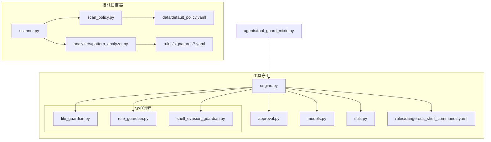
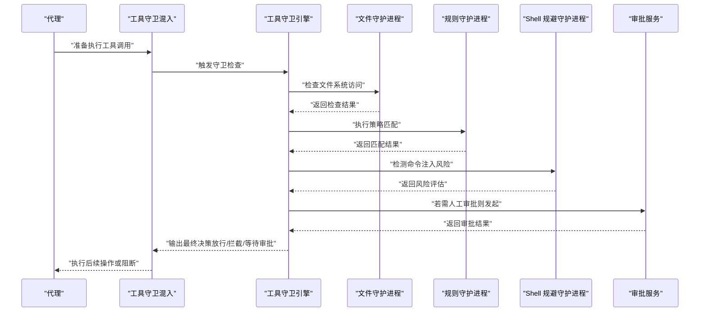
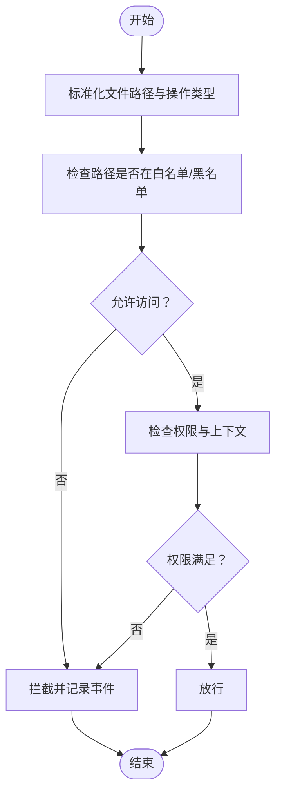
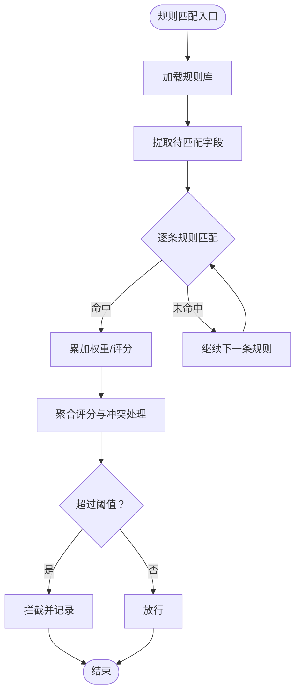
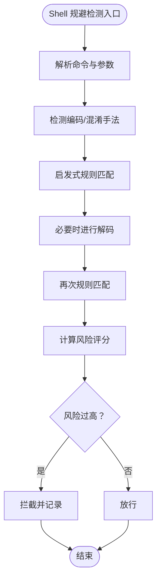
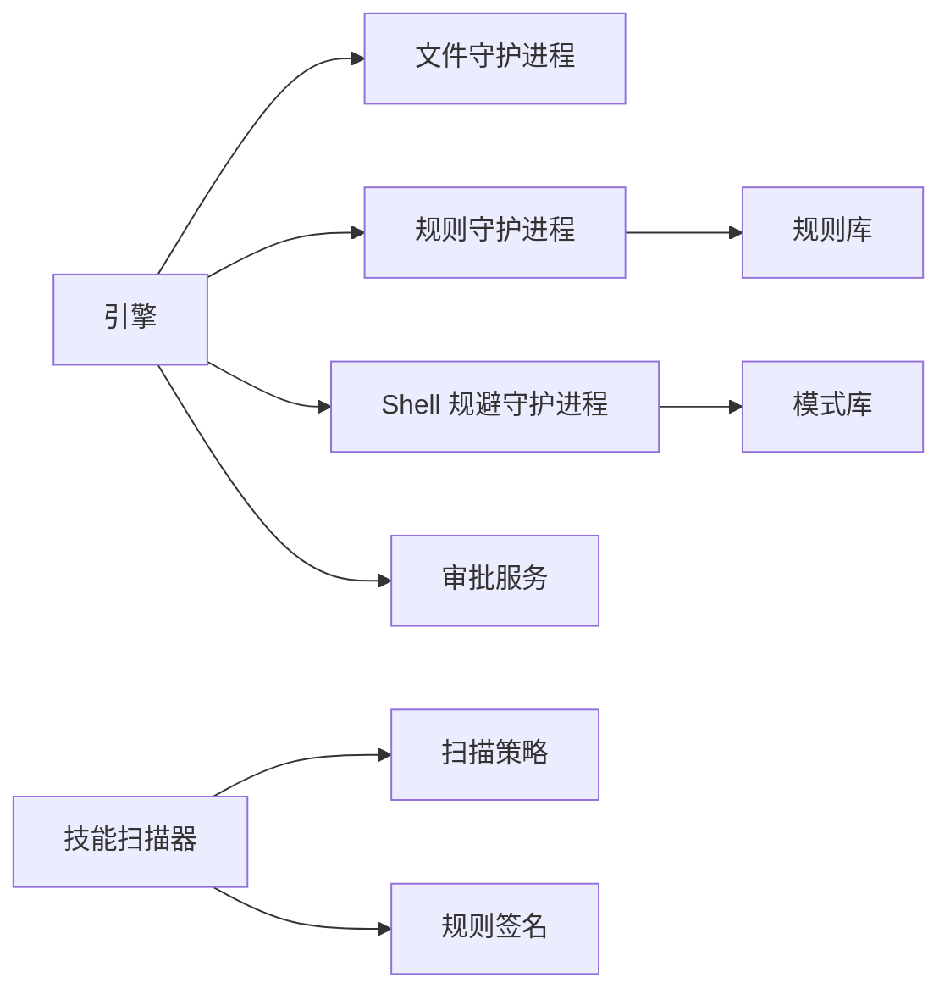

# 工具守卫

<cite>
**本文引用的文件**
- [engine.py](file://src/qwenpaw/security/tool_guard/engine.py)
- [approval.py](file://src/qwenpaw/security/tool_guard/approval.py)
- [models.py](file://src/qwenpaw/security/tool_guard/models.py)
- [utils.py](file://src/qwenpaw/security/tool_guard/utils.py)
- [file_guardian.py](file://src/qwenpaw/security/tool_guard/guardians/file_guardian.py)
- [rule_guardian.py](file://src/qwenpaw/security/tool_guard/guardians/rule_guardian.py)
- [shell_evasion_guardian.py](file://src/qwenpaw/security/tool_guard/guardians/shell_evasion_guardian.py)
- [dangerous_shell_commands.yaml](file://src/qwenpaw/security/tool_guard/rules/dangerous_shell_commands.yaml)
- [tool_guard_mixin.py](file://src/qwenpaw/agents/tool_guard_mixin.py)
- [scanner.py](file://src/qwenpaw/security/skill_scanner/scanner.py)
- [scan_policy.py](file://src/qwenpaw/security/skill_scanner/scan_policy.py)
- [default_policy.yaml](file://src/qwenpaw/security/skill_scanner/data/default_policy.yaml)
- [pattern_analyzer.py](file://src/qwenpaw/security/skill_scanner/analyzers/pattern_analyzer.py)
- [command_injection.yaml](file://src/qwenpaw/security/skill_scanner/rules/signatures/command_injection.yaml)
- [data_exfiltration.yaml](file://src/qwenpaw/security/skill_scanner/rules/signatures/data_exfiltration.yaml)
- [hardcoded_secrets.yaml](file://src/qwenpaw/security/skill_scanner/rules/signatures/hardcoded_secrets.yaml)
- [obfuscation.yaml](file://src/qwenpaw/security/skill_scanner/rules/signatures/obfuscation.yaml)
- [prompt_injection.yaml](file://src/qwenpaw/security/skill_scanner/rules/signatures/prompt_injection.yaml)
- [social_engineering.yaml](file://src/qwenpaw/security/skill_scanner/rules/signatures/social_engineering.yaml)
- [supply_chain.yaml](file://src/qwenpaw/security/skill_scanner/rules/signatures/supply_chain.yaml)
- [unauthorized_tool_use.yaml](file://src/qwenpaw/security/skill_scanner/rules/signatures/unauthorized_tool_use.yaml)
</cite>

## 目录
1. [简介](#简介)
2. [项目结构](#项目结构)
3. [核心组件](#核心组件)
4. [架构总览](#架构总览)
5. [详细组件分析](#详细组件分析)
6. [依赖关系分析](#依赖关系分析)
7. [性能考量](#性能考量)
8. [故障排查指南](#故障排查指南)
9. [结论](#结论)
10. [附录](#附录)

## 简介
本技术文档围绕 QwenPaw 的“工具守卫”系统展开，系统性阐述工具守卫引擎的工作机制与实现细节，包括规则匹配算法、威胁检测逻辑与拦截策略；并深入解析三大守护进程：文件守护进程（文件系统访问控制）、规则守护进程（策略执行）、Shell 规避守护进程（命令注入检测）。同时，文档给出危险命令规则库的配置与管理方法（规则语法、优先级、自定义规则开发），以及工具守卫的配置指南、审批流程管理与误报处理方案，并提供安全最佳实践与可扩展建议。

## 项目结构
工具守卫相关代码主要位于 src/qwenpaw/security/tool_guard 及其子模块，配套的安全扫描器位于 src/qwenpaw/security/skill_scanner，工具守卫混入类位于 src/qwenpaw/agents/tool_guard_mixin.py，用于在代理执行工具调用时集成守卫能力。

图表来源
- [engine.py](file://src/qwenpaw/security/tool_guard/engine.py)
- [approval.py](file://src/qwenpaw/security/tool_guard/approval.py)
- [models.py](file://src/qwenpaw/security/tool_guard/models.py)
- [utils.py](file://src/qwenpaw/security/tool_guard/utils.py)
- [file_guardian.py](file://src/qwenpaw/security/tool_guard/guardians/file_guardian.py)
- [rule_guardian.py](file://src/qwenpaw/security/tool_guard/guardians/rule_guardian.py)
- [shell_evasion_guardian.py](file://src/qwenpaw/security/tool_guard/guardians/shell_evasion_guardian.py)
- [dangerous_shell_commands.yaml](file://src/qwenpaw/security/tool_guard/rules/dangerous_shell_commands.yaml)
- [tool_guard_mixin.py](file://src/qwenpaw/agents/tool_guard_mixin.py)
- [scanner.py](file://src/qwenpaw/security/skill_scanner/scanner.py)
- [scan_policy.py](file://src/qwenpaw/security/skill_scanner/scan_policy.py)
- [default_policy.yaml](file://src/qwenpaw/security/skill_scanner/data/default_policy.yaml)
- [pattern_analyzer.py](file://src/qwenpaw/security/skill_scanner/analyzers/pattern_analyzer.py)
- [command_injection.yaml](file://src/qwenpaw/security/skill_scanner/rules/signatures/command_injection.yaml)

章节来源
- [engine.py](file://src/qwenpaw/security/tool_guard/engine.py)
- [tool_guard_mixin.py](file://src/qwenpaw/agents/tool_guard_mixin.py)

## 核心组件
- 引擎（Engine）：协调各守护进程，统一执行规则匹配与拦截决策，负责与审批流、模型与工具调用链路交互。
- 审批（Approval）：提供审批请求生成、状态流转与结果回传，支持人工复核与自动化阈值控制。
- 模型（Models）：定义守卫事件、规则、拦截策略等数据结构与枚举。
- 工具混入（Tool Guard Mixin）：在代理执行工具调用前注入守卫检查，确保所有工具调用均受控。
- 守护进程：文件守护、规则守护、Shell 规避守护，分别覆盖文件系统访问、策略执行与命令注入检测。
- 规则库：危险 Shell 命令规则集，支持优先级与自定义扩展。

章节来源
- [engine.py](file://src/qwenpaw/security/tool_guard/engine.py)
- [approval.py](file://src/qwenpaw/security/tool_guard/approval.py)
- [models.py](file://src/qwenpaw/security/tool_guard/models.py)
- [tool_guard_mixin.py](file://src/qwenpaw/agents/tool_guard_mixin.py)

## 架构总览
工具守卫采用“引擎 + 多守护进程 + 规则库 + 审批流”的分层架构。代理在调用工具前通过工具混入触发守卫引擎，引擎按序调用各守护进程进行检测，结合规则库与策略做出放行或拦截决策，并在需要时触发审批流程。

图表来源
- [tool_guard_mixin.py](file://src/qwenpaw/agents/tool_guard_mixin.py)
- [engine.py](file://src/qwenpaw/security/tool_guard/engine.py)
- [file_guardian.py](file://src/qwenpaw/security/tool_guard/guardians/file_guardian.py)
- [rule_guardian.py](file://src/qwenpaw/security/tool_guard/guardians/rule_guardian.py)
- [shell_evasion_guardian.py](file://src/qwenpaw/security/tool_guard/guardians/shell_evasion_guardian.py)
- [approval.py](file://src/qwenpaw/security/tool_guard/approval.py)

## 详细组件分析

### 引擎（Engine）
- 职责：编排各守护进程，聚合检查结果，决定是否拦截、放行或进入审批流程；维护与审批服务的交互。
- 关键流程：
  - 输入标准化：将工具调用参数转换为统一的检查对象。
  - 顺序检查：依次调用文件守护、规则守护、Shell 规避守护。
  - 决策合成：根据各守护进程结果与规则权重计算综合评分，决定动作。
  - 审批触发：当风险阈值或规则要求人工复核时，向审批服务提交请求。
- 性能与复杂度：线性叠加各守护进程检查成本，整体为 O(N)；可通过并行化优化（见性能考量）。

章节来源
- [engine.py](file://src/qwenpaw/security/tool_guard/engine.py)

### 文件守护进程（File Guardian）
- 功能：对工具调用涉及的文件系统操作进行访问控制，限制敏感路径、权限与写入行为。
- 实现要点：
  - 路径白名单/黑名单：基于规则库与配置判断目标路径是否允许访问。
  - 权限校验：检查目标文件/目录的读写权限与当前执行上下文。
  - 操作类型过滤：区分读取、写入、删除、执行等操作，不同操作采用不同策略。
- 典型拦截场景：尝试写入系统关键目录、读取敏感配置文件、删除重要日志等。

图表来源
- [file_guardian.py](file://src/qwenpaw/security/tool_guard/guardians/file_guardian.py)

章节来源
- [file_guardian.py](file://src/qwenpaw/security/tool_guard/guardians/file_guardian.py)

### 规则守护进程（Rule Guardian）
- 功能：执行策略匹配与优先级判定，依据规则库与全局策略决定拦截或放行。
- 实现要点：
  - 规则加载：从 YAML 规则库加载规则，解析正则、通配符与表达式。
  - 匹配算法：对输入进行多字段匹配（命令、参数、环境变量等），统计命中权重。
  - 优先级与合并：高优先级规则可覆盖低优先级规则；支持 AND/OR 组合条件。
  - 动态阈值：根据历史事件与风险评分动态调整拦截阈值。
- 典型拦截场景：匹配到高危命令模式、异常参数组合、敏感环境变量被修改等。

图表来源
- [rule_guardian.py](file://src/qwenpaw/security/tool_guard/guardians/rule_guardian.py)
- [dangerous_shell_commands.yaml](file://src/qwenpaw/security/tool_guard/rules/dangerous_shell_commands.yaml)

章节来源
- [rule_guardian.py](file://src/qwenpaw/security/tool_guard/guardians/rule_guardian.py)
- [dangerous_shell_commands.yaml](file://src/qwenpaw/security/tool_guard/rules/dangerous_shell_commands.yaml)

### Shell 规避守护进程（Shell Evasion Guardian）
- 功能：检测命令注入与规避行为，识别编码、拼接、反引号、管道等常见规避手法。
- 实现要点：
  - 模式识别：基于正则与启发式规则识别常见注入与规避模式。
  - 上下文感知：区分命令名、参数、重定向、管道等不同上下文中的风险。
  - 动态解码：对 Base64、十六进制、URL 编码等进行解码后二次检测。
  - 风险评分：为每种规避手法赋予风险分，汇总后参与综合决策。
- 典型拦截场景：命令中夹带恶意 payload、使用反引号执行外部命令、通过管道传递敏感数据等。

图表来源
- [shell_evasion_guardian.py](file://src/qwenpaw/security/tool_guard/guardians/shell_evasion_guardian.py)

章节来源
- [shell_evasion_guardian.py](file://src/qwenpaw/security/tool_guard/guardians/shell_evasion_guardian.py)

### 审批流程（Approval）
- 功能：在高风险或需要人工复核时，发起审批请求，等待管理员确认后执行后续动作。
- 关键点：
  - 审批触发条件：规则阈值、未知命令、跨域敏感操作等。
  - 审批信息：包含事件详情、风险评分、建议处置意见。
  - 状态管理：待审、已批准、已拒绝、超时作废等状态流转。
- 与引擎协作：引擎在决策阶段调用审批服务，审批完成后回传结果并驱动后续动作。

章节来源
- [approval.py](file://src/qwenpaw/security/tool_guard/approval.py)
- [engine.py](file://src/qwenpaw/security/tool_guard/engine.py)

### 工具混入（Tool Guard Mixin）
- 功能：在代理执行工具调用前自动注入守卫检查，保证所有工具调用均受控。
- 关键点：
  - 钩子机制：在工具调用前后插入守卫检查逻辑。
  - 结果传播：将引擎返回的决策传递给上层执行器，决定是否继续执行。
  - 可配置开关：支持按代理或按工具粒度开启/关闭守卫。

章节来源
- [tool_guard_mixin.py](file://src/qwenpaw/agents/tool_guard_mixin.py)

### 危险命令规则库（Dangerous Shell Commands）
- 规则格式：YAML，包含规则 ID、描述、匹配模式、优先级、影响等级、建议处置等字段。
- 加载与应用：引擎启动时加载规则库，规则守护进程在每次检查时进行匹配与评分。
- 自定义规则开发：
  - 新增规则文件：遵循现有字段与命名规范。
  - 优先级设置：通过规则权重与合并策略影响最终决策。
  - 测试验证：在测试环境中验证规则命中与误报情况。

章节来源
- [dangerous_shell_commands.yaml](file://src/qwenpaw/security/tool_guard/rules/dangerous_shell_commands.yaml)
- [rule_guardian.py](file://src/qwenpaw/security/tool_guard/guardians/rule_guardian.py)

### 技能扫描器（Skill Scanner，补充）
- 功能：对技能脚本与提示词进行静态扫描，识别命令注入、数据泄露、硬编码密钥、混淆、提示注入、社交工程、供应链与未授权工具使用等风险。
- 组件：
  - 扫描器：调度分析器与规则签名，生成扫描报告。
  - 策略：默认策略文件定义扫描范围与严重级别阈值。
  - 分析器：模式分析器对脚本进行语法与语义层面的检测。
  - 规则签名：各类风险的规则集合，如命令注入、数据外泄、硬编码密钥等。

章节来源
- [scanner.py](file://src/qwenpaw/security/skill_scanner/scanner.py)
- [scan_policy.py](file://src/qwenpaw/security/skill_scanner/scan_policy.py)
- [default_policy.yaml](file://src/qwenpaw/security/skill_scanner/data/default_policy.yaml)
- [pattern_analyzer.py](file://src/qwenpaw/security/skill_scanner/analyzers/pattern_analyzer.py)
- [command_injection.yaml](file://src/qwenpaw/security/skill_scanner/rules/signatures/command_injection.yaml)
- [data_exfiltration.yaml](file://src/qwenpaw/security/skill_scanner/rules/signatures/data_exfiltration.yaml)
- [hardcoded_secrets.yaml](file://src/qwenpaw/security/skill_scanner/rules/signatures/hardcoded_secrets.yaml)
- [obfuscation.yaml](file://src/qwenpaw/security/skill_scanner/rules/signatures/obfuscation.yaml)
- [prompt_injection.yaml](file://src/qwenpaw/security/skill_scanner/rules/signatures/prompt_injection.yaml)
- [social_engineering.yaml](file://src/qwenpaw/security/skill_scanner/rules/signatures/social_engineering.yaml)
- [supply_chain.yaml](file://src/qwenpaw/security/skill_scanner/rules/signatures/supply_chain.yaml)
- [unauthorized_tool_use.yaml](file://src/qwenpaw/security/skill_scanner/rules/signatures/unauthorized_tool_use.yaml)

## 依赖关系分析
- 组件耦合：
  - 引擎与守护进程：松耦合，通过统一接口交互；新增守护进程只需实现约定接口即可接入。
  - 引擎与审批：弱耦合，仅在需要人工干预时才建立连接。
  - 规则库与守护进程：规则库作为外部资源，守护进程只负责消费与匹配。
- 外部依赖：
  - YAML 解析：用于规则与策略文件加载。
  - 正则表达式：用于模式匹配与规避检测。
  - 审批服务：可替换为任意审批系统，保持接口一致。

图表来源
- [engine.py](file://src/qwenpaw/security/tool_guard/engine.py)
- [file_guardian.py](file://src/qwenpaw/security/tool_guard/guardians/file_guardian.py)
- [rule_guardian.py](file://src/qwenpaw/security/tool_guard/guardians/rule_guardian.py)
- [shell_evasion_guardian.py](file://src/qwenpaw/security/tool_guard/guardians/shell_evasion_guardian.py)
- [dangerous_shell_commands.yaml](file://src/qwenpaw/security/tool_guard/rules/dangerous_shell_commands.yaml)
- [scanner.py](file://src/qwenpaw/security/skill_scanner/scanner.py)
- [scan_policy.py](file://src/qwenpaw/security/skill_scanner/scan_policy.py)

章节来源
- [engine.py](file://src/qwenpaw/security/tool_guard/engine.py)
- [scanner.py](file://src/qwenpaw/security/skill_scanner/scanner.py)

## 性能考量
- 并行化：在不破坏规则顺序的前提下，可将多个守护进程检查并行执行以降低延迟。
- 缓存与索引：对常用规则与签名建立缓存，减少重复匹配开销；对路径与命令建立索引加速查找。
- 规则优化：合并相似规则、减少正则回溯、使用更高效的匹配算法（如 AC 自动机）。
- 审批异步化：审批请求异步提交，避免阻塞主流程；审批完成后再回填结果。
- 日志与指标：增加关键路径耗时与命中率统计，便于持续优化。

## 故障排查指南
- 常见问题
  - 误报：规则过于严格或匹配条件过宽。建议降低优先级、细化匹配条件或引入白名单。
  - 漏报：规避手法新颖或规则未覆盖。建议更新规则库、增强启发式规则或引入机器学习辅助检测。
  - 审批堆积：审批阈值设置过低或审批人响应慢。建议提高阈值、引入自动审批策略或增加审批人。
- 排查步骤
  - 查看守卫事件日志：定位拦截原因与规则命中情况。
  - 核对规则库：确认规则优先级、匹配条件与建议处置是否合理。
  - 回放测试：在测试环境中重现问题，验证修复效果。
  - 监控指标：关注拦截率、误报率、审批通过率与平均响应时间。

章节来源
- [models.py](file://src/qwenpaw/security/tool_guard/models.py)
- [approval.py](file://src/qwenpaw/security/tool_guard/approval.py)

## 结论
工具守卫系统通过“引擎 + 多守护进程 + 规则库 + 审批流”的设计，在保障安全性的同时兼顾灵活性与可扩展性。文件守护、规则守护与 Shell 规避守护三者协同，形成对文件系统访问、策略执行与命令注入的全链路防护。配合完善的审批流程与可观测性，能够有效降低安全风险并提升系统的可控性与可维护性。

## 附录

### 配置指南
- 启用工具守卫：在代理配置中启用工具守卫混入，确保工具调用前自动检查。
- 规则库管理：定期更新危险命令规则库，新增或调整规则时先在测试环境验证。
- 审批策略：根据业务风险设定审批阈值与自动放行策略，平衡安全与效率。
- 日志与审计：开启详细日志与审计事件，保留拦截与审批记录以便追溯。

### 安全最佳实践
- 最小权限原则：文件守护应尽量限制写入与执行权限。
- 多层防护：规则守护与 Shell 规避守护相互补充，避免单一规则被绕过。
- 持续监控：建立告警与报表机制，及时发现异常趋势。
- 定期演练：模拟攻击场景进行演练，验证规则有效性与团队响应能力。