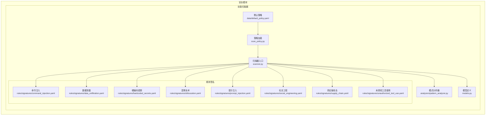
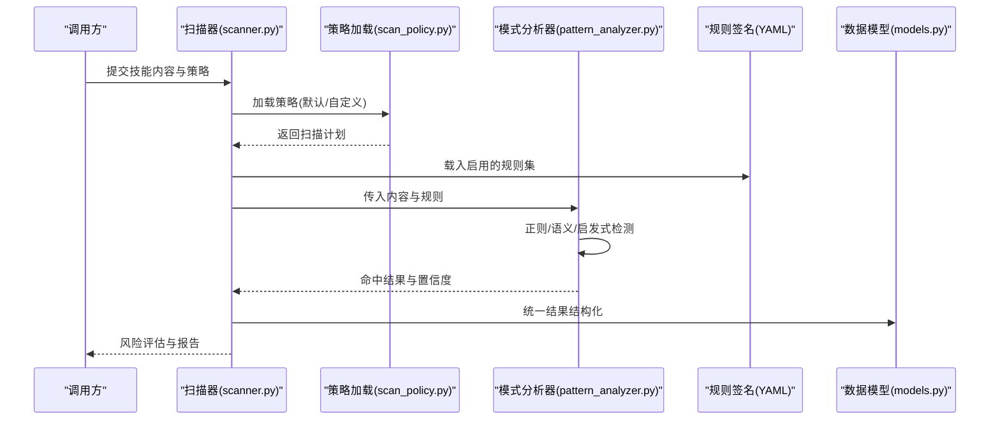
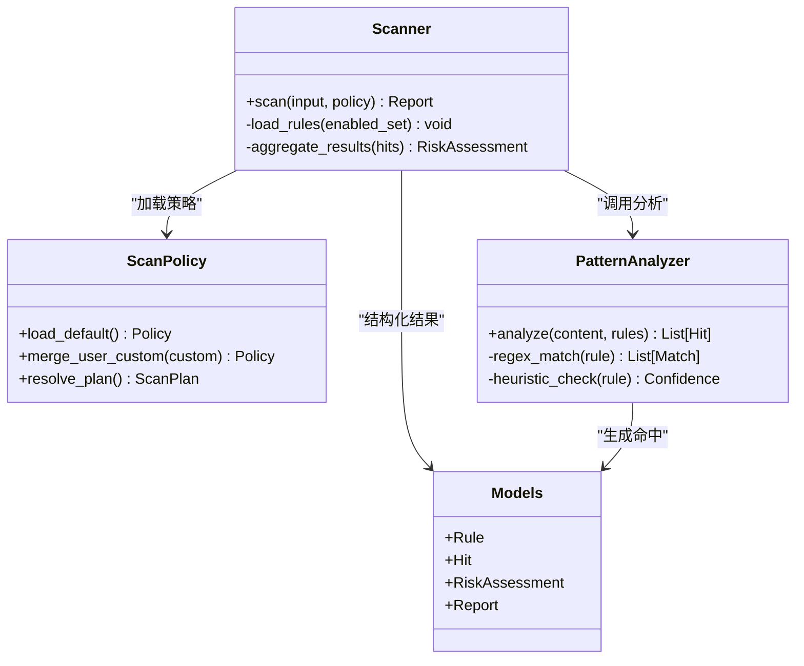
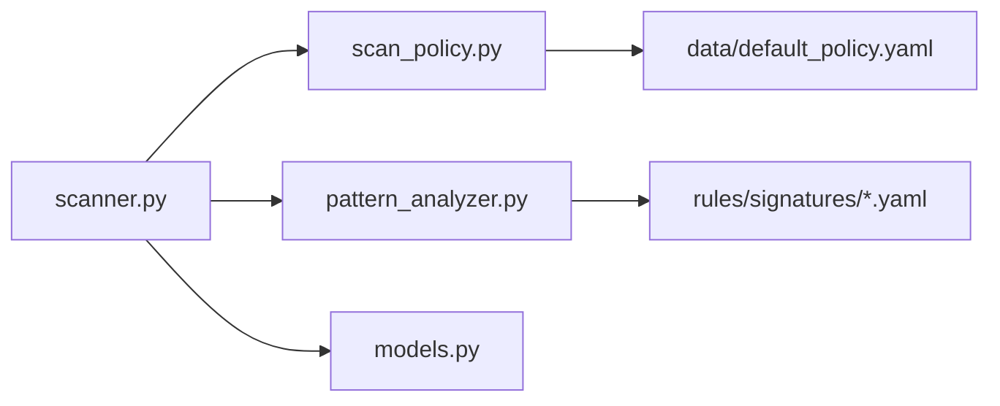

# 技能扫描器

<cite>
**本文引用的文件**
- [scanner.py](file://src/qwenpaw/security/skill_scanner/scanner.py)
- [models.py](file://src/qwenpaw/security/skill_scanner/models.py)
- [scan_policy.py](file://src/qwenpaw/security/skill_scanner/scan_policy.py)
- [pattern_analyzer.py](file://src/qwenpaw/security/skill_scanner/analyzers/pattern_analyzer.py)
- [default_policy.yaml](file://src/qwenpaw/security/skill_scanner/data/default_policy.yaml)
- [command_injection.yaml](file://src/qwenpaw/security/skill_scanner/rules/signatures/command_injection.yaml)
- [data_exfiltration.yaml](file://src/qwenpaw/security/skill_scanner/rules/signatures/data_exfiltration.yaml)
- [hardcoded_secrets.yaml](file://src/qwenpaw/security/skill_scanner/rules/signatures/hardcoded_secrets.yaml)
- [obfuscation.yaml](file://src/qwenpaw/security/skill_scanner/rules/signatures/obfuscation.yaml)
- [prompt_injection.yaml](file://src/qwenpaw/security/skill_scanner/rules/signatures/prompt_injection.yaml)
- [social_engineering.yaml](file://src/qwenpaw/security/skill_scanner/rules/signatures/social_engineering.yaml)
- [supply_chain.yaml](file://src/qwenpaw/security/skill_scanner/rules/signatures/supply_chain.yaml)
- [unauthorized_tool_use.yaml](file://src/qwenpaw/security/skill_scanner/rules/signatures/unauthorized_tool_use.yaml)
</cite>

## 目录
1. [引言](#引言)
2. [项目结构](#项目结构)
3. [核心组件](#核心组件)
4. [架构总览](#架构总览)
5. [详细组件分析](#详细组件分析)
6. [依赖关系分析](#依赖关系分析)
7. [性能考量](#性能考量)
8. [故障排查指南](#故障排查指南)
9. [结论](#结论)
10. [附录](#附录)

## 引言
本文件为 QwenPaw 技能扫描器的技术文档，聚焦于安全模块中“技能扫描”能力，系统阐述其整体架构与工作流程（静态代码分析、动态行为检测、风险评估）、模式分析器的实现原理（正则匹配、语义分析、启发式检测）、默认策略配置与自定义策略开发方法，并对各类威胁签名（命令注入、数据泄露、硬编码密钥、混淆技术、提示注入、社交工程、供应链攻击、未授权工具使用）的检测逻辑进行深入解析。同时提供配置指南、扫描结果解读与风险缓解建议，并辅以实际扫描示例与威胁检测案例，帮助开发者理解技能安全的重要性。

## 项目结构
技能扫描器位于安全子模块下，采用“策略驱动 + 规则签名 + 分析器”的分层设计：
- 策略层：加载并管理扫描策略（默认策略与用户自定义策略）
- 规则层：按威胁类型组织的 YAML 签名规则集合
- 分析器层：执行具体检测逻辑（当前包含模式分析器）
- 扫描器：编排策略与规则，聚合检测结果并输出风险评估

图表来源
- [scanner.py](file://src/qwenpaw/security/skill_scanner/scanner.py)
- [scan_policy.py](file://src/qwenpaw/security/skill_scanner/scan_policy.py)
- [pattern_analyzer.py](file://src/qwenpaw/security/skill_scanner/analyzers/pattern_analyzer.py)
- [models.py](file://src/qwenpaw/security/skill_scanner/models.py)
- [default_policy.yaml](file://src/qwenpaw/security/skill_scanner/data/default_policy.yaml)
- [command_injection.yaml](file://src/qwenpaw/security/skill_scanner/rules/signatures/command_injection.yaml)
- [data_exfiltration.yaml](file://src/qwenpaw/security/skill_scanner/rules/signatures/data_exfiltration.yaml)
- [hardcoded_secrets.yaml](file://src/qwenpaw/security/skill_scanner/rules/signatures/hardcoded_secrets.yaml)
- [obfuscation.yaml](file://src/qwenpaw/security/skill_scanner/rules/signatures/obfuscation.yaml)
- [prompt_injection.yaml](file://src/qwenpaw/security/skill_scanner/rules/signatures/prompt_injection.yaml)
- [social_engineering.yaml](file://src/qwenpaw/security/skill_scanner/rules/signatures/social_engineering.yaml)
- [supply_chain.yaml](file://src/qwenpaw/security/skill_scanner/rules/signatures/supply_chain.yaml)
- [unauthorized_tool_use.yaml](file://src/qwenpaw/security/skill_scanner/rules/signatures/unauthorized_tool_use.yaml)

章节来源
- [scanner.py](file://src/qwenpaw/security/skill_scanner/scanner.py)
- [scan_policy.py](file://src/qwenpaw/security/skill_scanner/scan_policy.py)
- [pattern_analyzer.py](file://src/qwenpaw/security/skill_scanner/analyzers/pattern_analyzer.py)
- [models.py](file://src/qwenpaw/security/skill_scanner/models.py)
- [default_policy.yaml](file://src/qwenpaw/security/skill_scanner/data/default_policy.yaml)

## 核心组件
- 扫描器（scanner.py）：作为扫描流程的编排者，负责加载策略、收集规则、调用分析器、汇总结果并生成风险评估报告。
- 策略加载（scan_policy.py）：负责解析策略文件（默认策略与用户自定义策略），构建可执行的扫描计划。
- 模式分析器（analyzers/pattern_analyzer.py）：执行基于规则的模式匹配与启发式检测，返回命中项与置信度。
- 数据模型（models.py）：定义扫描输入、规则、命中结果、风险等级等核心数据结构。
- 规则签名（rules/signatures/*.yaml）：按威胁类型组织的 YAML 签名集合，描述检测条件、权重与缓解建议。
- 默认策略（data/default_policy.yaml）：内置扫描策略模板，定义启用/禁用规则集、阈值与评估参数。

章节来源
- [scanner.py](file://src/qwenpaw/security/skill_scanner/scanner.py)
- [scan_policy.py](file://src/qwenpaw/security/skill_scanner/scan_policy.py)
- [pattern_analyzer.py](file://src/qwenpaw/security/skill_scanner/analyzers/pattern_analyzer.py)
- [models.py](file://src/qwenpaw/security/skill_scanner/models.py)
- [default_policy.yaml](file://src/qwenpaw/security/skill_scanner/data/default_policy.yaml)

## 架构总览
技能扫描器采用“策略驱动 + 规则签名 + 分析器”的解耦架构。扫描器根据策略选择性地加载规则，交由分析器执行检测，最终汇总为统一的风险评估输出。

图表来源
- [scanner.py](file://src/qwenpaw/security/skill_scanner/scanner.py)
- [scan_policy.py](file://src/qwenpaw/security/skill_scanner/scan_policy.py)
- [pattern_analyzer.py](file://src/qwenpaw/security/skill_scanner/analyzers/pattern_analyzer.py)
- [models.py](file://src/qwenpaw/security/skill_scanner/models.py)

## 详细组件分析

### 扫描器（scanner.py）
- 职责
  - 接收输入（技能文本、上下文、元信息）
  - 加载策略并确定启用规则集
  - 调用分析器执行检测
  - 聚合命中结果，计算风险等级
  - 输出标准化报告（含威胁类型、位置、置信度、缓解建议）
- 关键流程
  - 策略解析：依据策略决定规则集、阈值与评估权重
  - 规则装载：按威胁类型加载 YAML 规则
  - 分析执行：将规则与输入交给模式分析器
  - 结果归并：合并多规则命中，去重与排序
  - 风险评估：综合置信度与权重得出风险等级

章节来源
- [scanner.py](file://src/qwenpaw/security/skill_scanner/scanner.py)

### 策略加载（scan_policy.py）
- 职责
  - 解析策略文件（默认策略与用户自定义策略）
  - 合并策略，生成扫描计划（启用/禁用规则、阈值、权重）
- 设计要点
  - 支持策略覆盖与增量更新
  - 提供默认策略作为基线
  - 兼容不同环境下的策略差异

章节来源
- [scan_policy.py](file://src/qwenpaw/security/skill_scanner/scan_policy.py)
- [default_policy.yaml](file://src/qwenpaw/security/skill_scanner/data/default_policy.yaml)

### 模式分析器（analyzers/pattern_analyzer.py）
- 职责
  - 对输入内容执行模式匹配与启发式检测
  - 返回命中规则、位置范围、置信度与附加信息
- 实现要点
  - 正则表达式匹配：针对固定模式与变体进行稳健匹配
  - 语义分析：结合上下文与关键词组合，降低误报
  - 启发式检测：基于经验规则与统计特征识别潜在风险
- 性能与扩展
  - 可并行处理多个规则
  - 易于扩展新的检测算法或规则格式

章节来源
- [pattern_analyzer.py](file://src/qwenpaw/security/skill_scanner/analyzers/pattern_analyzer.py)

### 数据模型（models.py）
- 职责
  - 定义扫描输入、规则、命中结果、风险评估等核心数据结构
- 关键类型
  - 规则定义：包含威胁类型、匹配条件、权重、缓解建议
  - 命中结果：包含规则标识、匹配片段、位置、置信度
  - 风险评估：包含总体风险等级、各威胁分布、建议修复清单

章节来源
- [models.py](file://src/qwenpaw/security/skill_scanner/models.py)

### 规则签名（rules/signatures/*.yaml）
- 职责
  - 以 YAML 形式描述各类威胁的检测逻辑与缓解建议
- 结构与字段
  - 威胁类型：用于分类与报告
  - 匹配条件：正则、关键词、语义组合
  - 权重与阈值：影响风险评估
  - 缓解建议：指导修复
- 威胁类别
  - 命令注入（command_injection.yaml）
  - 数据泄露（data_exfiltration.yaml）
  - 硬编码密钥（hardcoded_secrets.yaml）
  - 混淆技术（obfuscation.yaml）
  - 提示注入（prompt_injection.yaml）
  - 社交工程（social_engineering.yaml）
  - 供应链攻击（supply_chain.yaml）
  - 未授权工具使用（unauthorized_tool_use.yaml）

章节来源
- [command_injection.yaml](file://src/qwenpaw/security/skill_scanner/rules/signatures/command_injection.yaml)
- [data_exfiltration.yaml](file://src/qwenpaw/security/skill_scanner/rules/signatures/data_exfiltration.yaml)
- [hardcoded_secrets.yaml](file://src/qwenpaw/security/skill_scanner/rules/signatures/hardcoded_secrets.yaml)
- [obfuscation.yaml](file://src/qwenpaw/security/skill_scanner/rules/signatures/obfuscation.yaml)
- [prompt_injection.yaml](file://src/qwenpaw/security/skill_scanner/rules/signatures/prompt_injection.yaml)
- [social_engineering.yaml](file://src/qwenpaw/security/skill_scanner/rules/signatures/social_engineering.yaml)
- [supply_chain.yaml](file://src/qwenpaw/security/skill_scanner/rules/signatures/supply_chain.yaml)
- [unauthorized_tool_use.yaml](file://src/qwenpaw/security/skill_scanner/rules/signatures/unauthorized_tool_use.yaml)

### 类图（代码级）

图表来源
- [scanner.py](file://src/qwenpaw/security/skill_scanner/scanner.py)
- [scan_policy.py](file://src/qwenpaw/security/skill_scanner/scan_policy.py)
- [pattern_analyzer.py](file://src/qwenpaw/security/skill_scanner/analyzers/pattern_analyzer.py)
- [models.py](file://src/qwenpaw/security/skill_scanner/models.py)

## 依赖关系分析
- 组件耦合
  - 扫描器与策略加载强耦合（策略决定规则集）
  - 扫描器与分析器弱耦合（通过接口抽象）
  - 分析器与规则签名松耦合（通过 YAML 描述）
- 外部依赖
  - YAML 解析库（用于加载规则与策略）
  - 正则表达式引擎（用于模式匹配）
  - 可选：语义分析库（如 NLP 工具，用于上下文理解）

图表来源
- [scanner.py](file://src/qwenpaw/security/skill_scanner/scanner.py)
- [scan_policy.py](file://src/qwenpaw/security/skill_scanner/scan_policy.py)
- [pattern_analyzer.py](file://src/qwenpaw/security/skill_scanner/analyzers/pattern_analyzer.py)
- [models.py](file://src/qwenpaw/security/skill_scanner/models.py)
- [default_policy.yaml](file://src/qwenpaw/security/skill_scanner/data/default_policy.yaml)

章节来源
- [scanner.py](file://src/qwenpaw/security/skill_scanner/scanner.py)
- [scan_policy.py](file://src/qwenpaw/security/skill_scanner/scan_policy.py)
- [pattern_analyzer.py](file://src/qwenpaw/security/skill_scanner/analyzers/pattern_analyzer.py)
- [models.py](file://src/qwenpaw/security/skill_scanner/models.py)
- [default_policy.yaml](file://src/qwenpaw/security/skill_scanner/data/default_policy.yaml)

## 性能考量
- 规则数量与复杂度
  - 控制规则数量与正则复杂度，避免 O(n^2) 或指数级匹配
  - 对高频规则进行预编译与缓存
- 并行化
  - 将规则匹配与命中聚合过程并行化，提升吞吐量
- 上下文优化
  - 仅在必要时进行语义分析，减少计算开销
- 内存管理
  - 流式处理输入，避免一次性加载大文本

## 故障排查指南
- 策略加载失败
  - 检查策略文件语法与字段完整性
  - 确认策略覆盖顺序与冲突项
- 规则不生效
  - 核对规则是否被策略启用
  - 检查规则 YAML 语法与字段拼写
- 检测误报/漏报
  - 调整规则权重与阈值
  - 增加上下文约束或启发式条件
- 性能瓶颈
  - 分析热点规则与正则复杂度
  - 启用并行处理与缓存策略

## 结论
QwenPaw 技能扫描器通过“策略驱动 + 规则签名 + 分析器”的架构，实现了对多种威胁类型的系统化检测。默认策略与 YAML 规则提供了良好的可维护性与可扩展性；模式分析器兼顾正则、语义与启发式，能够有效平衡准确率与召回率。建议在生产环境中结合业务场景持续迭代策略与规则，完善风险评估阈值，并建立自动化扫描流水线以保障技能安全。

## 附录

### 配置指南
- 默认策略
  - 使用内置策略作为基线，适用于通用场景
  - 字段参考：启用/禁用规则集、阈值、权重、报告选项
- 自定义策略
  - 在用户策略中覆盖默认策略，实现差异化扫描
  - 注意策略合并与优先级，避免冲突
- 规则签名管理
  - 新增威胁类型时，新增对应 YAML 文件并纳入策略
  - 更新现有规则时，保持向后兼容字段

章节来源
- [default_policy.yaml](file://src/qwenpaw/security/skill_scanner/data/default_policy.yaml)
- [scan_policy.py](file://src/qwenpaw/security/skill_scanner/scan_policy.py)

### 扫描结果解读
- 命中项
  - 规则标识：所属威胁类型
  - 匹配片段：触发位置与上下文
  - 置信度：检测强度评分
- 风险评估
  - 总体风险等级：综合置信度与权重
  - 威胁分布：各类威胁占比
  - 建议修复：逐条缓解建议与优先级

章节来源
- [models.py](file://src/qwenpaw/security/skill_scanner/models.py)
- [scanner.py](file://src/qwenpaw/security/skill_scanner/scanner.py)

### 威胁检测案例与缓解建议
- 命令注入
  - 检测逻辑：识别危险函数调用与外部输入拼接
  - 缓解建议：参数化查询、白名单校验、沙箱执行
- 数据泄露
  - 检测逻辑：识别敏感数据外显与传输路径
  - 缓解建议：最小权限原则、加密传输、访问控制
- 硬编码密钥
  - 检测逻辑：识别明文密钥与证书
  - 缓解建议：密钥管理服务、环境变量注入
- 混淆技术
  - 检测逻辑：识别异常字符密度与编码模式
  - 缓解建议：代码审计、静态分析工具集成
- 提示注入
  - 检测逻辑：识别提示词操控与上下文污染
  - 缓解建议：提示词加固、上下文隔离
- 社交工程
  - 检测逻辑：识别诱导性语言与异常请求
  - 缓解建议：用户教育、多因素验证
- 供应链攻击
  - 检测逻辑：识别不受信任来源与异常依赖
  - 缓解建议：依赖扫描、镜像签名、准入控制
- 未授权工具使用
  - 检测逻辑：识别未登记或越权工具调用
  - 缓解建议：工具白名单、调用审批、日志审计

章节来源
- [command_injection.yaml](file://src/qwenpaw/security/skill_scanner/rules/signatures/command_injection.yaml)
- [data_exfiltration.yaml](file://src/qwenpaw/security/skill_scanner/rules/signatures/data_exfiltration.yaml)
- [hardcoded_secrets.yaml](file://src/qwenpaw/security/skill_scanner/rules/signatures/hardcoded_secrets.yaml)
- [obfuscation.yaml](file://src/qwenpaw/security/skill_scanner/rules/signatures/obfuscation.yaml)
- [prompt_injection.yaml](file://src/qwenpaw/security/skill_scanner/rules/signatures/prompt_injection.yaml)
- [social_engineering.yaml](file://src/qwenpaw/security/skill_scanner/rules/signatures/social_engineering.yaml)
- [supply_chain.yaml](file://src/qwenpaw/security/skill_scanner/rules/signatures/supply_chain.yaml)
- [unauthorized_tool_use.yaml](file://src/qwenpaw/security/skill_scanner/rules/signatures/unauthorized_tool_use.yaml)