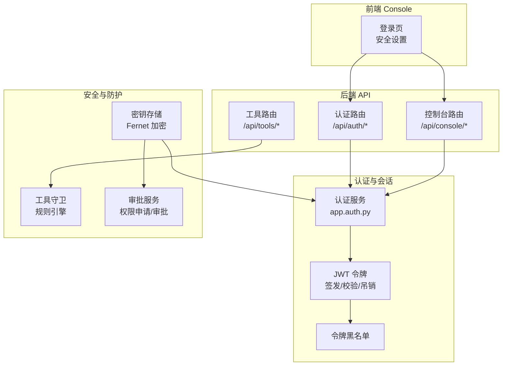
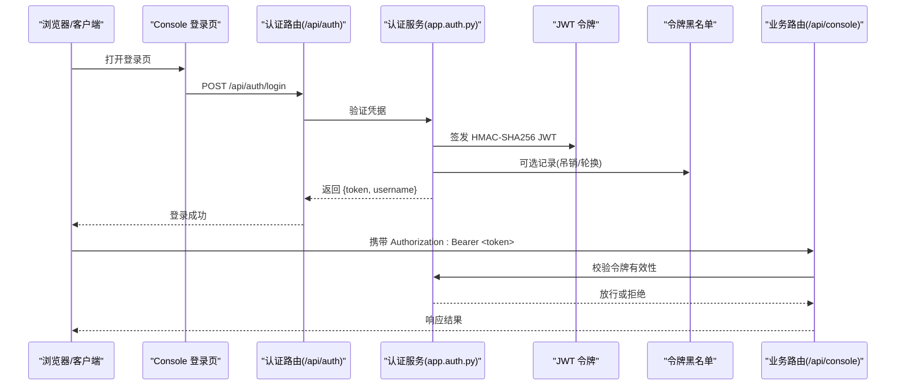
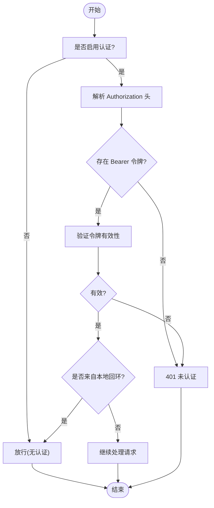
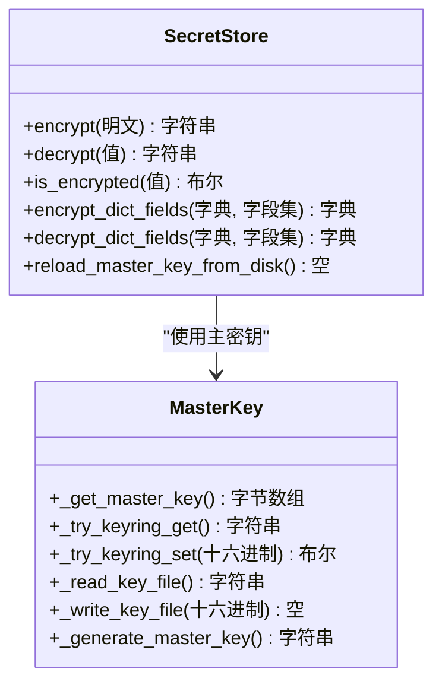
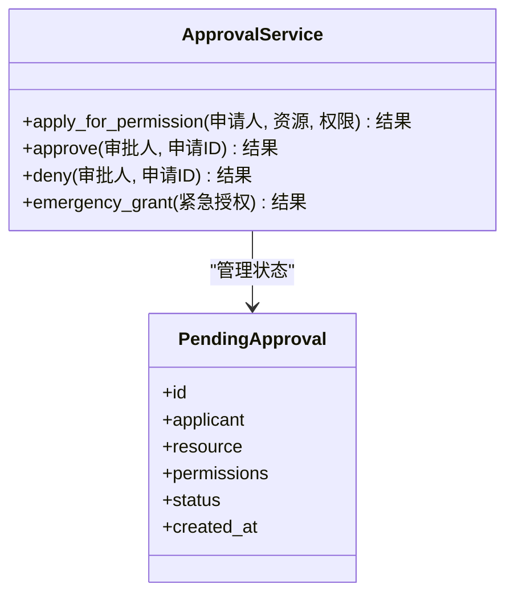
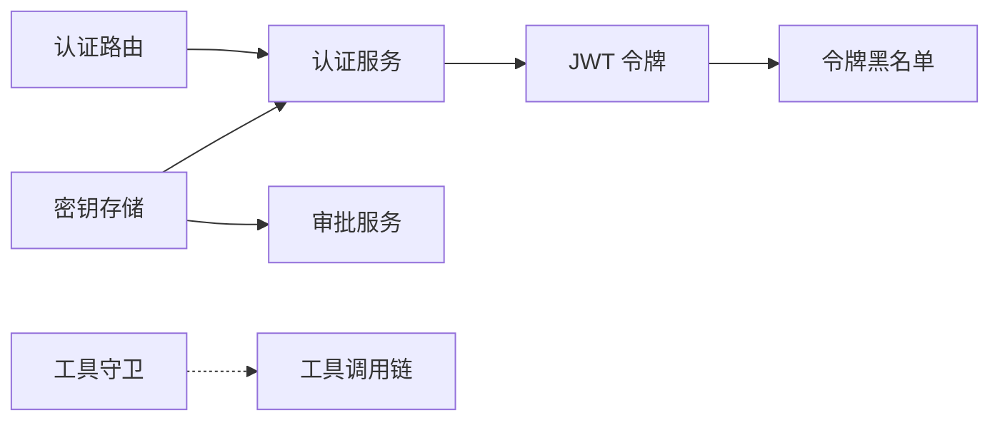

# 访问控制

<cite>
**本文引用的文件**
- [src/qwenpaw/app/routers/auth.py](file://src/qwenpaw/app/routers/auth.py)
- [src/qwenpaw/app/auth.py](file://src/qwenpaw/app/auth.py)
- [src/qwenpaw/security/secret_store.py](file://src/qwenpaw/security/secret_store.py)
- [src/qwenpaw/app/approvals/service.py](file://src/qwenpaw/app/approvals/service.py)
- [src/qwenpaw/app/approvals/__init__.py](file://src/qwenpaw/app/approvals/__init__.py)
- [src/qwenpaw/security/tool_guard/engine.py](file://src/qwenpaw/security/tool_guard/engine.py)
- [src/qwenpaw/security/tool_guard/models.py](file://src/qwenpaw/security/tool_guard/models.py)
- [src/qwenpaw/backup/_ops/restore_helpers.py](file://src/qwenpaw/backup/_ops/restore_helpers.py)
- [website/public/docs/security.en.md](file://website/public/docs/security.en.md)
- [website/public/docs/api-tutorial.en.md](file://website/public/docs/api-tutorial.en.md)
- [SECURITY.md](file://SECURITY.md)
- [tests/unit/security/test_secret_store.py](file://tests/unit/security/test_secret_store.py)
</cite>

## 目录
1. [简介](#简介)
2. [项目结构](#项目结构)
3. [核心组件](#核心组件)
4. [架构总览](#架构总览)
5. [详细组件分析](#详细组件分析)
6. [依赖关系分析](#依赖关系分析)
7. [性能考虑](#性能考虑)
8. [故障排查指南](#故障排查指南)
9. [结论](#结论)
10. [附录](#附录)

## 简介
本文件面向系统管理员与开发者，全面阐述 QwenPaw 的访问控制系统：身份认证机制（登录流程、令牌管理、会话控制）、授权体系（权限模型、角色与资源访问控制）、密钥存储安全（加密存储、密钥轮换、访问审计）、审批服务（权限申请、审批流程、紧急授权），以及配置指南、权限分配策略与安全审计方法。文档同时提供可操作的示例与最佳实践，帮助在生产环境中安全落地。

## 项目结构
QwenPaw 的访问控制由后端路由层、认证服务、工具守卫、密钥存储与审批服务共同组成。前端 Console 提供登录界面与安全设置入口；后端通过统一的认证中间件与路由保护 API 资源；安全模块负责敏感数据加密与运行时防护；审批模块支持权限申请与紧急授权。

图示来源
- [src/qwenpaw/app/routers/auth.py](file://src/qwenpaw/app/routers/auth.py)
- [src/qwenpaw/app/auth.py](file://src/qwenpaw/app/auth.py)
- [src/qwenpaw/security/secret_store.py](file://src/qwenpaw/security/secret_store.py)
- [src/qwenpaw/security/tool_guard/engine.py](file://src/qwenpaw/security/tool_guard/engine.py)
- [src/qwenpaw/app/approvals/service.py](file://src/qwenpaw/app/approvals/service.py)

章节来源
- [src/qwenpaw/app/routers/auth.py](file://src/qwenpaw/app/routers/auth.py)
- [src/qwenpaw/app/auth.py](file://src/qwenpaw/app/auth.py)
- [src/qwenpaw/security/secret_store.py](file://src/qwenpaw/security/secret_store.py)
- [src/qwenpaw/security/tool_guard/engine.py](file://src/qwenpaw/security/tool_guard/engine.py)
- [src/qwenpaw/app/approvals/service.py](file://src/qwenpaw/app/approvals/service.py)

## 核心组件
- 认证与会话：提供登录、登出、令牌签发与吊销、本地回环豁免等能力。
- 授权与资源控制：基于路由与中间件进行访问控制，结合工具守卫与审批服务实现细粒度防护。
- 密钥存储：以 Fernet 对称加密保护敏感字段，支持主密钥在系统钥匙串与文件中的持久化与轮换。
- 审批服务：支持权限申请、审批流程与紧急授权，保障高风险操作的最小授权原则。

章节来源
- [src/qwenpaw/app/routers/auth.py](file://src/qwenpaw/app/routers/auth.py)
- [src/qwenpaw/app/auth.py](file://src/qwenpaw/app/auth.py)
- [src/qwenpaw/security/secret_store.py](file://src/qwenpaw/security/secret_store.py)
- [src/qwenpaw/app/approvals/service.py](file://src/qwenpaw/app/approvals/service.py)

## 架构总览
下图展示从用户登录到 API 请求的典型调用链，以及安全组件在其中的位置与交互。

图示来源
- [src/qwenpaw/app/routers/auth.py](file://src/qwenpaw/app/routers/auth.py)
- [src/qwenpaw/app/auth.py](file://src/qwenpaw/app/auth.py)
- [website/public/docs/api-tutorial.en.md](file://website/public/docs/api-tutorial.en.md)

## 详细组件分析

### 认证与会话控制
- 登录流程
  - 首次访问触发注册流程，创建单管理员账户；后续访问进入登录页。
  - 登录成功返回签名令牌，默认有效期 7 天，可通过参数自定义（最大 100 年）。
  - 本地回环请求（127.0.0.1 / ::1）自动跳过认证；CLI 命令无需令牌。
- 令牌管理
  - 使用 HMAC-SHA256 签名的 JWT；支持单令牌吊销、全部吊销与密码重置导致的全量失效。
  - 吊销机制通过黑名单实现，避免旧令牌继续使用。
- 会话控制
  - 令牌过期、密码重置、签名密钥轮换均会使现有会话失效。
  - 支持自动登出（令牌过期、服务端 401）。

图示来源
- [src/qwenpaw/app/routers/auth.py](file://src/qwenpaw/app/routers/auth.py)
- [website/public/docs/security.en.md](file://website/public/docs/security.en.md)
- [website/public/docs/api-tutorial.en.md](file://website/public/docs/api-tutorial.en.md)

章节来源
- [src/qwenpaw/app/routers/auth.py](file://src/qwenpaw/app/routers/auth.py)
- [website/public/docs/security.en.md](file://website/public/docs/security.en.md)
- [website/public/docs/api-tutorial.en.md](file://website/public/docs/api-tutorial.en.md)

### 授权体系与资源访问控制
- 权限模型
  - 单管理员信任模型：系统假定单一受信操作者，多用户共享通道时仅能按已授予权限执行，不形成强隔离边界。
  - 会话/上下文标识用于路由控制，而非用户级授权边界。
- 角色管理
  - 当前实现采用单管理员模式，未提供多角色/多租户授权边界。
- 资源访问控制
  - 通过路由与中间件统一拦截，结合本地回环豁免与 CLI 免认证策略。
  - 工具调用阶段由工具守卫进行实时扫描与阻断，防止命令注入、路径穿越与数据外泄等危险行为。

章节来源
- [SECURITY.md](file://SECURITY.md)
- [src/qwenpaw/app/routers/auth.py](file://src/qwenpaw/app/routers/auth.py)
- [src/qwenpaw/security/tool_guard/engine.py](file://src/qwenpaw/security/tool_guard/engine.py)

### 密钥存储系统
- 设计目标
  - 对敏感字段（如 API Key、JWT 密钥）进行透明加密存储，区分明文与密文，首次访问时完成迁移。
  - 主密钥优先存放在系统钥匙串，失败时落盘于私有目录并设置严格权限。
- 加密算法与密钥管理
  - 使用 Fernet（AES-128-CBC + HMAC-SHA256），主密钥长度 32 字节。
  - 支持主密钥生成、缓存、双检锁加载、钥匙串同步与文件写入。
- 密钥轮换与恢复
  - 备份/恢复过程中检测主密钥差异，必要时备份当前密钥以便解密旧数据。
  - 恢复后可强制重新加载主密钥，确保进程与钥匙串一致。
- 错误处理与降级
  - 解密失败或密钥变更时返回原始密文，避免系统崩溃，保证平滑降级。

图示来源
- [src/qwenpaw/security/secret_store.py](file://src/qwenpaw/security/secret_store.py)

章节来源
- [src/qwenpaw/security/secret_store.py](file://src/qwenpaw/security/secret_store.py)
- [src/qwenpaw/backup/_ops/restore_helpers.py](file://src/qwenpaw/backup/_ops/restore_helpers.py)
- [tests/unit/security/test_secret_store.py](file://tests/unit/security/test_secret_store.py)

### 审批服务
- 功能概述
  - 支持权限申请、审批流程与紧急授权，满足高风险操作的最小授权与可追溯性要求。
  - 通过服务接口导出，便于在工具调用或系统操作前触发审批。
- 关键对象
  - 审批服务类、待审批状态封装，提供获取实例的工厂方法。

图示来源
- [src/qwenpaw/app/approvals/service.py](file://src/qwenpaw/app/approvals/service.py)
- [src/qwenpaw/app/approvals/__init__.py](file://src/qwenpaw/app/approvals/__init__.py)

章节来源
- [src/qwenpaw/app/approvals/service.py](file://src/qwenpaw/app/approvals/service.py)
- [src/qwenpaw/app/approvals/__init__.py](file://src/qwenpaw/app/approvals/__init__.py)

### 工具守卫（运行时防护）
- 作用
  - 在工具调用前对参数进行实时扫描，识别命令注入、路径穿越、数据外泄等危险模式，阻止潜在攻击。
- 实现要点
  - 基于 YAML 正则规则与专用 Shell 转义规避守护，提供可扩展的规则引擎与模型定义。

章节来源
- [src/qwenpaw/security/tool_guard/engine.py](file://src/qwenpaw/security/tool_guard/engine.py)
- [src/qwenpaw/security/tool_guard/models.py](file://src/qwenpaw/security/tool_guard/models.py)

## 依赖关系分析
- 组件耦合
  - 认证路由依赖认证服务进行凭据校验与令牌签发；令牌校验贯穿各业务路由。
  - 密钥存储为认证与审批等模块提供加密/解密能力，确保敏感字段安全。
  - 工具守卫独立于认证，但与工具调用链路紧密集成，形成第二道防线。
- 外部依赖
  - 密钥存储依赖 cryptography（Fernet）与 keyring（系统钥匙串）。
  - 认证使用标准库哈希与 HMAC 进行密码与令牌处理。

图示来源
- [src/qwenpaw/app/routers/auth.py](file://src/qwenpaw/app/routers/auth.py)
- [src/qwenpaw/app/auth.py](file://src/qwenpaw/app/auth.py)
- [src/qwenpaw/security/secret_store.py](file://src/qwenpaw/security/secret_store.py)
- [src/qwenpaw/app/approvals/service.py](file://src/qwenpaw/app/approvals/service.py)
- [src/qwenpaw/security/tool_guard/engine.py](file://src/qwenpaw/security/tool_guard/engine.py)

## 性能考虑
- 令牌签发与校验为轻量操作，通常不影响整体吞吐。
- 密钥存储采用缓存主密钥与 Fernet 实例，减少重复初始化开销。
- 工具守卫规则扫描建议保持正则简洁，避免复杂匹配导致延迟。
- 令牌黑名单查询需高效索引，建议在内存中维护并定期持久化。

## 故障排查指南
- 登录失败
  - 确认认证已启用且凭据正确；检查密码是否被重置导致旧令牌失效。
- 401 未认证
  - 检查 Authorization 头格式是否为 Bearer；确认令牌未过期或未被吊销。
- 令牌无法吊销
  - 确认已启用认证；检查黑名单写入是否成功；必要时重启服务使变更生效。
- 密钥解密失败
  - 若主密钥被轮换或损坏，系统会返回原始密文；检查备份密钥并恢复。
- 审批流程异常
  - 核对审批服务状态与权限范围；确认紧急授权策略是否正确配置。

章节来源
- [src/qwenpaw/app/routers/auth.py](file://src/qwenpaw/app/routers/auth.py)
- [src/qwenpaw/security/secret_store.py](file://src/qwenpaw/security/secret_store.py)
- [src/qwenpaw/app/approvals/service.py](file://src/qwenpaw/app/approvals/service.py)

## 结论
QwenPaw 的访问控制以“个人助理”信任模型为基础，结合认证、令牌管理、密钥存储与工具守卫，构建了从入口到执行的多层安全防护。对于需要更强隔离与多租户场景，建议通过独立实例与操作系统用户隔离来实现边界划分，并配合严格的密钥轮换与审计策略。

## 附录

### 配置指南与最佳实践
- 认证配置
  - 启用认证后，首次访问进入注册流程；支持自动注册环境变量，适合容器化部署。
  - 本地回环与 CLI 默认豁免认证，生产环境建议关闭自动注册并启用强口令。
- 令牌策略
  - 默认 7 天有效期；根据风险调整至更短周期；避免长期有效令牌。
  - 发生泄露时优先使用单令牌吊销，其次全量吊销或密码重置。
- 密钥存储
  - 优先使用系统钥匙串保存主密钥；若不可用，确保密钥文件权限为 0o600。
  - 定期轮换主密钥并备份当前密钥，恢复后强制重新加载。
- 审批策略
  - 高风险工具调用必须经过审批；紧急授权仅限极端情况并记录审计日志。
- 安全审计
  - 记录登录/登出、令牌吊销、密钥轮换、审批通过/拒绝等事件；定期审查异常行为。

章节来源
- [website/public/docs/security.en.md](file://website/public/docs/security.en.md)
- [website/public/docs/api-tutorial.en.md](file://website/public/docs/api-tutorial.en.md)
- [SECURITY.md](file://SECURITY.md)
- [src/qwenpaw/security/secret_store.py](file://src/qwenpaw/security/secret_store.py)
- [src/qwenpaw/app/approvals/service.py](file://src/qwenpaw/app/approvals/service.py)