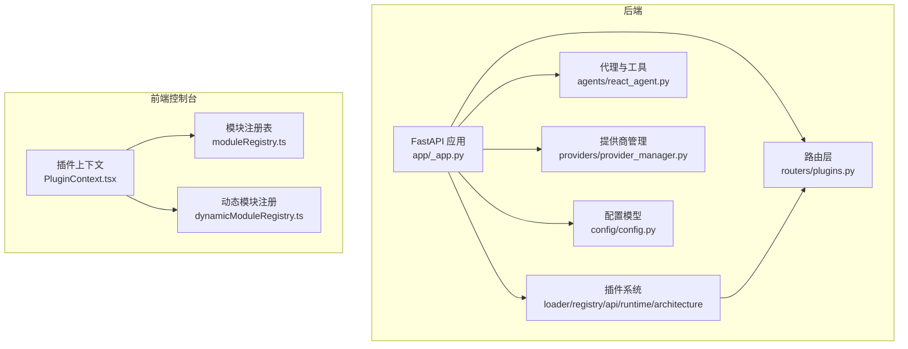
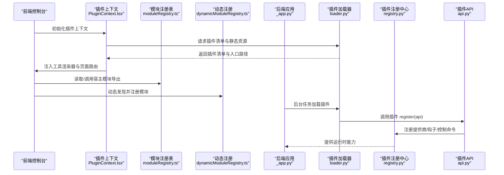
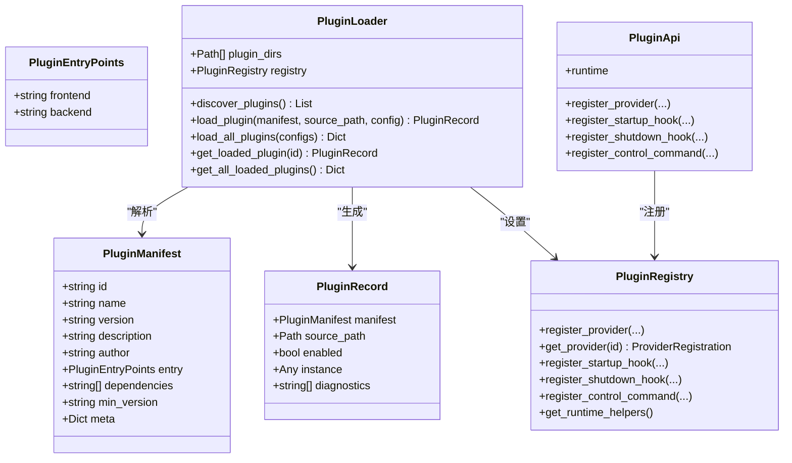
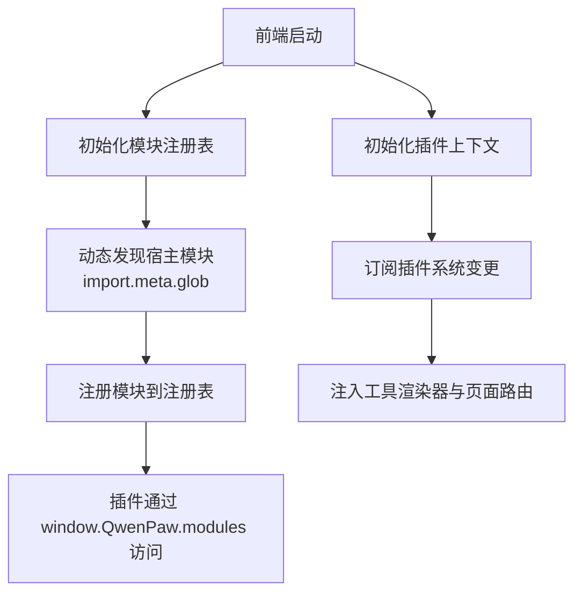
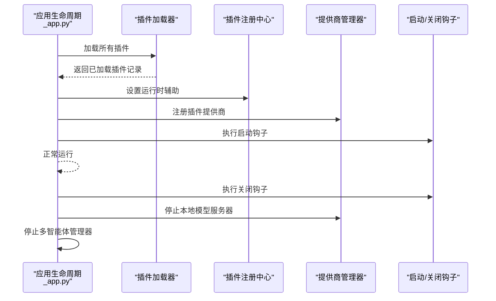
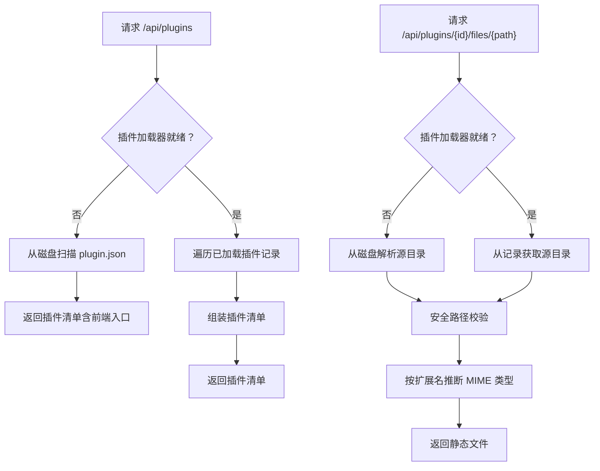
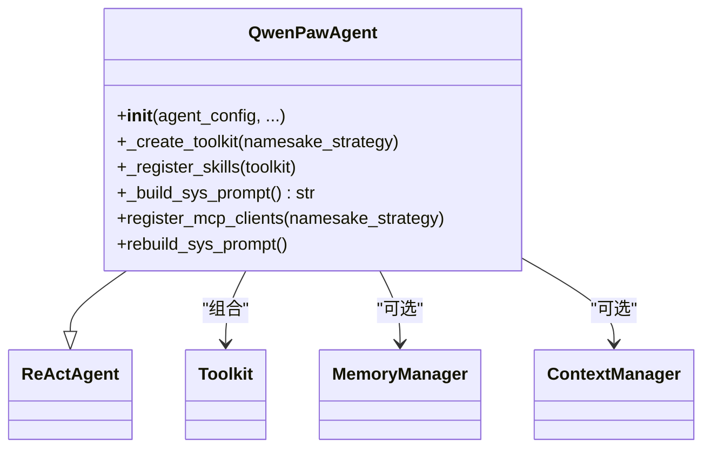
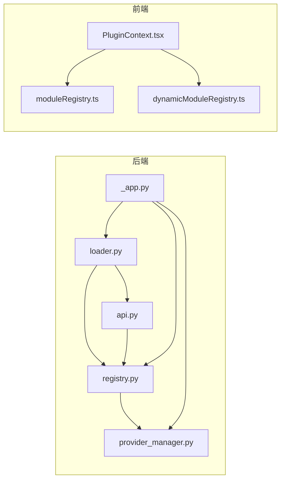

# 开发者指南

<cite>
**本文引用的文件**
- [src/qwenpaw/__init__.py](file://src/qwenpaw/__init__.py)
- [src/qwenpaw/plugins/architecture.py](file://src/qwenpaw/plugins/architecture.py)
- [src/qwenpaw/plugins/loader.py](file://src/qwenpaw/plugins/loader.py)
- [src/qwenpaw/plugins/registry.py](file://src/qwenpaw/plugins/registry.py)
- [src/qwenpaw/plugins/runtime.py](file://src/qwenpaw/plugins/runtime.py)
- [src/qwenpaw/plugins/api.py](file://src/qwenpaw/plugins/api.py)
- [src/qwenpaw/app/routers/plugins.py](file://src/qwenpaw/app/routers/plugins.py)
- [console/src/plugins/PluginContext.tsx](file://console/src/plugins/PluginContext.tsx)
- [console/src/plugins/moduleRegistry.ts](file://console/src/plugins/moduleRegistry.ts)
- [console/src/plugins/dynamicModuleRegistry.ts](file://console/src/plugins/dynamicModuleRegistry.ts)
- [src/qwenpaw/app/_app.py](file://src/qwenpaw/app/_app.py)
- [src/qwenpaw/agents/react_agent.py](file://src/qwenpaw/agents/react_agent.py)
- [src/qwenpaw/providers/provider_manager.py](file://src/qwenpaw/providers/provider_manager.py)
- [src/qwenpaw/config/config.py](file://src/qwenpaw/config/config.py)
- [src/qwenpaw/cli/main.py](file://src/qwenpaw/cli/main.py)
</cite>

## 目录
1. [简介](#简介)
2. [项目结构](#项目结构)
3. [核心组件](#核心组件)
4. [架构总览](#架构总览)
5. [详细组件分析](#详细组件分析)
6. [依赖分析](#依赖分析)
7. [性能考虑](#性能考虑)
8. [故障排查指南](#故障排查指南)
9. [结论](#结论)
10. [附录](#附录)

## 简介
本指南面向希望扩展 QwenPaw 功能或开发自定义插件的开发者，系统阐述项目的整体架构、模块划分、组件交互关系与扩展机制。内容覆盖插件系统的设计与实现、API 接口规范、前端插件运行时、后端生命周期钩子、路由与静态资源分发、以及测试策略、调试技巧与性能优化建议。文档同时提供贡献流程、代码规范与发布流程的参考。

## 项目结构
QwenPaw 采用前后端分离的工程组织方式：
- 后端服务基于 FastAPI，提供统一 API 路由、插件系统、多智能体管理、通道适配器、本地模型管理等能力。
- 前端控制台使用 React + Vite，通过插件系统动态加载 UI 能力与页面路由。
- 插件系统贯穿前后端：后端负责插件发现、加载、注册与生命周期管理；前端负责插件 UI 注册、模块猴子补丁与动态路由注入。

图表来源
- [src/qwenpaw/app/_app.py:517-732](file://src/qwenpaw/app/_app.py#L517-L732)
- [src/qwenpaw/app/routers/plugins.py:15-173](file://src/qwenpaw/app/routers/plugins.py#L15-L173)
- [src/qwenpaw/plugins/loader.py:19-272](file://src/qwenpaw/plugins/loader.py#L19-L272)
- [console/src/plugins/PluginContext.tsx:1-96](file://console/src/plugins/PluginContext.tsx#L1-L96)

章节来源
- [src/qwenpaw/app/_app.py:517-732](file://src/qwenpaw/app/_app.py#L517-L732)
- [src/qwenpaw/app/routers/plugins.py:15-173](file://src/qwenpaw/app/routers/plugins.py#L15-L173)

## 核心组件
- 插件架构与数据模型：定义插件清单、入口点与记录信息，支撑插件元数据与运行时状态管理。
- 插件加载器：扫描插件目录、解析清单、动态导入后端模块、调用插件注册方法。
- 插件注册中心：集中管理提供商、启动/关闭钩子、控制命令处理器与运行时辅助对象。
- 插件 API：为插件开发者提供注册提供商、钩子与控制命令的标准接口。
- 运行时辅助：向插件暴露运行时能力（如获取提供商实例、日志记录等）。
- 后端插件路由：提供插件清单查询与静态资源分发能力，保障前端在后端启动期间也能拉取插件资源。
- 前端插件上下文：订阅插件系统，聚合工具渲染器与页面路由，并支持插件加载失败回退。
- 模块注册表与动态注册：在前端侧对宿主模块进行安全拷贝与访问，支持插件对宿主模块的读取与调用。
- 应用生命周期：后台异步初始化插件系统、注册提供商、执行钩子、注册控制命令，优雅处理关闭阶段的钩子执行与资源回收。
- 代理与工具：集成 ReAct 思维-行动循环、技能加载、内存管理、上下文压缩与工具守卫拦截。
- 提供商管理：内置多家大模型提供商，支持自定义与插件注册提供商，统一模型槽位与模型发现。
- 配置模型：定义代理、通道、心跳、记忆与上下文压缩等配置项，确保系统行为可配置。

章节来源
- [src/qwenpaw/plugins/architecture.py:9-70](file://src/qwenpaw/plugins/architecture.py#L9-L70)
- [src/qwenpaw/plugins/loader.py:19-272](file://src/qwenpaw/plugins/loader.py#L19-L272)
- [src/qwenpaw/plugins/registry.py:42-254](file://src/qwenpaw/plugins/registry.py#L42-L254)
- [src/qwenpaw/plugins/api.py:10-186](file://src/qwenpaw/plugins/api.py#L10-L186)
- [src/qwenpaw/plugins/runtime.py:10-68](file://src/qwenpaw/plugins/runtime.py#L10-L68)
- [src/qwenpaw/app/routers/plugins.py:20-173](file://src/qwenpaw/app/routers/plugins.py#L20-L173)
- [console/src/plugins/PluginContext.tsx:1-96](file://console/src/plugins/PluginContext.tsx#L1-L96)
- [console/src/plugins/moduleRegistry.ts:1-138](file://console/src/plugins/moduleRegistry.ts#L1-L138)
- [console/src/plugins/dynamicModuleRegistry.ts:1-117](file://console/src/plugins/dynamicModuleRegistry.ts#L1-L117)
- [src/qwenpaw/app/_app.py:219-514](file://src/qwenpaw/app/_app.py#L219-L514)
- [src/qwenpaw/agents/react_agent.py:77-800](file://src/qwenpaw/agents/react_agent.py#L77-L800)
- [src/qwenpaw/providers/provider_manager.py:720-800](file://src/qwenpaw/providers/provider_manager.py#L720-L800)
- [src/qwenpaw/config/config.py:43-800](file://src/qwenpaw/config/config.py#L43-L800)

## 架构总览
下图展示后端插件系统与前端插件运行时的整体交互：后端在应用生命周期内完成插件发现、加载与注册；前端通过插件上下文订阅变化，动态注入工具渲染器与页面路由，并通过模块注册表访问宿主模块。

图表来源
- [console/src/plugins/PluginContext.tsx:47-80](file://console/src/plugins/PluginContext.tsx#L47-L80)
- [console/src/plugins/moduleRegistry.ts:39-118](file://console/src/plugins/moduleRegistry.ts#L39-L118)
- [console/src/plugins/dynamicModuleRegistry.ts:22-71](file://console/src/plugins/dynamicModuleRegistry.ts#L22-L71)
- [src/qwenpaw/app/_app.py:297-444](file://src/qwenpaw/app/_app.py#L297-L444)
- [src/qwenpaw/plugins/loader.py:84-228](file://src/qwenpaw/plugins/loader.py#L84-L228)
- [src/qwenpaw/plugins/api.py:43-175](file://src/qwenpaw/plugins/api.py#L43-L175)
- [src/qwenpaw/plugins/registry.py:73-253](file://src/qwenpaw/plugins/registry.py#L73-L253)

## 详细组件分析

### 插件系统（后端）
- 插件架构与数据模型
  - 定义插件清单、入口点与记录信息，支持前端与后端入口声明与兼容旧版入口字段。
- 插件加载器
  - 扫描插件目录，解析 plugin.json 清单，动态导入后端模块，调用插件的 register 方法（同步/异步），并记录加载结果。
- 插件注册中心
  - 单例注册中心，集中管理提供商、启动/关闭钩子、控制命令处理器与运行时辅助对象，支持优先级排序与查询。
- 插件 API
  - 提供注册提供商、启动/关闭钩子、控制命令处理器的能力，并暴露运行时辅助对象。
- 运行时辅助
  - 向插件暴露获取提供商、列出提供商、日志记录等运行时能力。

图表来源
- [src/qwenpaw/plugins/architecture.py:9-70](file://src/qwenpaw/plugins/architecture.py#L9-L70)
- [src/qwenpaw/plugins/loader.py:19-272](file://src/qwenpaw/plugins/loader.py#L19-L272)
- [src/qwenpaw/plugins/registry.py:42-254](file://src/qwenpaw/plugins/registry.py#L42-L254)
- [src/qwenpaw/plugins/api.py:10-186](file://src/qwenpaw/plugins/api.py#L10-L186)

章节来源
- [src/qwenpaw/plugins/architecture.py:9-70](file://src/qwenpaw/plugins/architecture.py#L9-L70)
- [src/qwenpaw/plugins/loader.py:19-272](file://src/qwenpaw/plugins/loader.py#L19-L272)
- [src/qwenpaw/plugins/registry.py:42-254](file://src/qwenpaw/plugins/registry.py#L42-L254)
- [src/qwenpaw/plugins/api.py:10-186](file://src/qwenpaw/plugins/api.py#L10-L186)
- [src/qwenpaw/plugins/runtime.py:10-68](file://src/qwenpaw/plugins/runtime.py#L10-L68)

### 插件系统（前端）
- 插件上下文
  - 订阅插件系统，聚合工具渲染器与页面路由，支持加载状态与错误回退。
- 模块注册表
  - 对宿主模块进行安全拷贝，提供 get/call/getModule 等访问接口，避免直接污染 ES 模块命名空间。
- 动态模块注册
  - 使用 Vite 的 import.meta.glob 自动发现宿主模块，支持懒加载与预加载两种模式，排除测试文件。

图表来源
- [console/src/plugins/moduleRegistry.ts:39-118](file://console/src/plugins/moduleRegistry.ts#L39-L118)
- [console/src/plugins/dynamicModuleRegistry.ts:22-71](file://console/src/plugins/dynamicModuleRegistry.ts#L22-L71)
- [console/src/plugins/PluginContext.tsx:47-80](file://console/src/plugins/PluginContext.tsx#L47-L80)

章节来源
- [console/src/plugins/PluginContext.tsx:1-96](file://console/src/plugins/PluginContext.tsx#L1-L96)
- [console/src/plugins/moduleRegistry.ts:1-138](file://console/src/plugins/moduleRegistry.ts#L1-L138)
- [console/src/plugins/dynamicModuleRegistry.ts:1-117](file://console/src/plugins/dynamicModuleRegistry.ts#L1-L117)

### 应用生命周期与插件加载
- 后台异步启动
  - 在应用生命周期内，后台任务并行启动代理、加载插件、注册提供商、执行启动钩子与控制命令。
- 关闭阶段
  - 执行关闭钩子，停止本地模型服务器与多智能体管理器，确保资源有序释放。

图表来源
- [src/qwenpaw/app/_app.py:297-444](file://src/qwenpaw/app/_app.py#L297-L444)
- [src/qwenpaw/app/_app.py:461-514](file://src/qwenpaw/app/_app.py#L461-L514)

章节来源
- [src/qwenpaw/app/_app.py:219-514](file://src/qwenpaw/app/_app.py#L219-L514)

### 插件路由与静态资源分发
- 列出插件
  - 当插件加载器尚未初始化时，从磁盘扫描插件清单，保证前端在后端启动期间也能获取插件信息。
- 分发静态文件
  - 通过路径拼接与安全校验防止路径穿越，支持 JS/CSS 等媒体类型正确响应。

图表来源
- [src/qwenpaw/app/routers/plugins.py:20-173](file://src/qwenpaw/app/routers/plugins.py#L20-L173)

章节来源
- [src/qwenpaw/app/routers/plugins.py:15-173](file://src/qwenpaw/app/routers/plugins.py#L15-L173)

### 代理与工具系统
- 代理类
  - 继承 ReActAgent，集成工具包、技能加载、内存管理、上下文压缩与命令处理。
- 工具与技能
  - 内置多种工具函数，按配置启用；动态注册技能；支持异步任务管理工具。
- 媒体块处理
  - 多模态提示构建与媒体块自动裁剪，提升跨模型兼容性。

图表来源
- [src/qwenpaw/agents/react_agent.py:77-800](file://src/qwenpaw/agents/react_agent.py#L77-L800)

章节来源
- [src/qwenpaw/agents/react_agent.py:77-800](file://src/qwenpaw/agents/react_agent.py#L77-L800)

### 提供商管理
- 内置提供商
  - 支持多家主流大模型提供商，内置默认模型列表与连接检查逻辑。
- 插件提供商
  - 通过注册中心接收插件注册的提供商，统一纳入提供商管理器。
- 模型槽位
  - 通过配置模型定义活跃模型槽位，支持全局并发限制与速率控制。

章节来源
- [src/qwenpaw/providers/provider_manager.py:720-800](file://src/qwenpaw/providers/provider_manager.py#L720-L800)
- [src/qwenpaw/config/config.py:43-800](file://src/qwenpaw/config/config.py#L43-L800)

### 配置系统
- 配置模型
  - 定义代理运行参数、通道配置、心跳、记忆与上下文压缩等配置项，确保系统行为可配置。
- 代理 ID 校验
  - 提供代理 ID 的长度、字符集、保留词与唯一性校验。

章节来源
- [src/qwenpaw/config/config.py:121-190](file://src/qwenpaw/config/config.py#L121-L190)

### CLI 入口
- 懒加载命令组
  - 通过 LazyGroup 实现命令的延迟加载，减少启动时间与内存占用。

章节来源
- [src/qwenpaw/cli/main.py:58-178](file://src/qwenpaw/cli/main.py#L58-L178)

## 依赖分析
- 后端耦合与内聚
  - 插件系统通过注册中心实现低耦合高内聚，加载器与 API 作为桥接层，运行时辅助对象提供统一访问入口。
  - 应用生命周期将插件系统与提供商管理器、多智能体管理器解耦，通过后台任务并行初始化。
- 前端耦合与扩展
  - 插件上下文与模块注册表形成前端扩展点，动态模块注册降低生成文件维护成本。
- 外部依赖与集成
  - FastAPI 提供路由与中间件；Vite 提供模块发现与打包；Pydantic 提供配置模型验证。

图表来源
- [src/qwenpaw/plugins/loader.py:19-272](file://src/qwenpaw/plugins/loader.py#L19-L272)
- [src/qwenpaw/plugins/registry.py:42-254](file://src/qwenpaw/plugins/registry.py#L42-L254)
- [src/qwenpaw/plugins/api.py:10-186](file://src/qwenpaw/plugins/api.py#L10-L186)
- [src/qwenpaw/providers/provider_manager.py:720-800](file://src/qwenpaw/providers/provider_manager.py#L720-L800)
- [src/qwenpaw/app/_app.py:297-444](file://src/qwenpaw/app/_app.py#L297-L444)
- [console/src/plugins/PluginContext.tsx:1-96](file://console/src/plugins/PluginContext.tsx#L1-L96)
- [console/src/plugins/moduleRegistry.ts:1-138](file://console/src/plugins/moduleRegistry.ts#L1-L138)
- [console/src/plugins/dynamicModuleRegistry.ts:1-117](file://console/src/plugins/dynamicModuleRegistry.ts#L1-L117)

章节来源
- [src/qwenpaw/plugins/loader.py:19-272](file://src/qwenpaw/plugins/loader.py#L19-L272)
- [src/qwenpaw/plugins/registry.py:42-254](file://src/qwenpaw/plugins/registry.py#L42-L254)
- [src/qwenpaw/plugins/api.py:10-186](file://src/qwenpaw/plugins/api.py#L10-L186)
- [src/qwenpaw/providers/provider_manager.py:720-800](file://src/qwenpaw/providers/provider_manager.py#L720-L800)
- [src/qwenpaw/app/_app.py:297-444](file://src/qwenpaw/app/_app.py#L297-L444)
- [console/src/plugins/PluginContext.tsx:1-96](file://console/src/plugins/PluginContext.tsx#L1-L96)
- [console/src/plugins/moduleRegistry.ts:1-138](file://console/src/plugins/moduleRegistry.ts#L1-L138)
- [console/src/plugins/dynamicModuleRegistry.ts:1-117](file://console/src/plugins/dynamicModuleRegistry.ts#L1-L117)

## 性能考虑
- 启动性能
  - 后台异步初始化插件系统与代理，避免阻塞主请求线程；CLI 命令懒加载减少启动时间。
- 并发与限流
  - 提供商管理器支持全局并发限制与速率控制，降低外部依赖抖动影响。
- 媒体与内存
  - 代理对多模态媒体块进行主动/被动裁剪，减少无效 token 消耗；上下文压缩与工具结果裁剪降低内存压力。
- 前端模块加载
  - 动态模块注册支持懒加载，减少首屏体积；排除测试文件避免冗余加载。

## 故障排查指南
- 插件加载失败
  - 检查插件清单是否符合规范、后端入口文件是否存在、插件模块是否导出 plugin 对象与 register 方法。
- 前端插件无法加载
  - 确认后端插件路由可用、静态资源路径正确、前端上下文订阅是否正常触发。
- 提供商不可用
  - 检查提供商注册是否成功、密钥与基础 URL 是否正确、连接检查是否通过。
- 代理异常
  - 查看代理系统提示构建与媒体块处理日志，确认多模态能力与模型兼容性。

章节来源
- [src/qwenpaw/plugins/loader.py:84-228](file://src/qwenpaw/plugins/loader.py#L84-L228)
- [src/qwenpaw/app/routers/plugins.py:111-173](file://src/qwenpaw/app/routers/plugins.py#L111-L173)
- [src/qwenpaw/providers/provider_manager.py:720-800](file://src/qwenpaw/providers/provider_manager.py#L720-L800)
- [src/qwenpaw/agents/react_agent.py:786-800](file://src/qwenpaw/agents/react_agent.py#L786-L800)

## 结论
QwenPaw 的插件系统以“清单驱动 + 动态加载 + 注册中心”为核心，实现了前后端协同扩展：后端负责插件生命周期与提供商管理，前端负责 UI 注入与模块猴子补丁。该设计具备良好的可扩展性与可维护性，适合二次开发与生态扩展。开发者可依据本文档提供的接口规范与最佳实践，快速开发高质量插件并融入整体系统。

## 附录
- 贡献流程
  - Fork 仓库 -> 创建分支 -> 编写代码与单元测试 -> 提交 PR -> CI 校验 -> 代码评审 -> 合并。
- 代码规范
  - 遵循 Python 与 TypeScript 规范，保持模块职责单一、接口清晰、错误处理完备。
- 发布流程
  - 更新版本号 -> 生成发行包 -> 上传至包管理平台 -> 更新文档与发布说明 -> 回归测试。