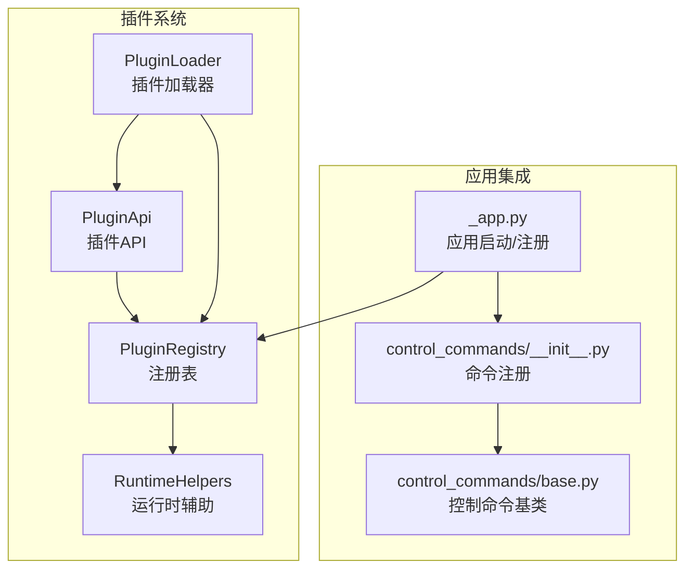
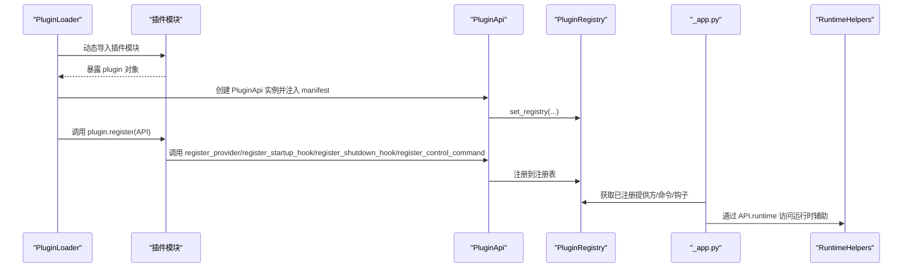
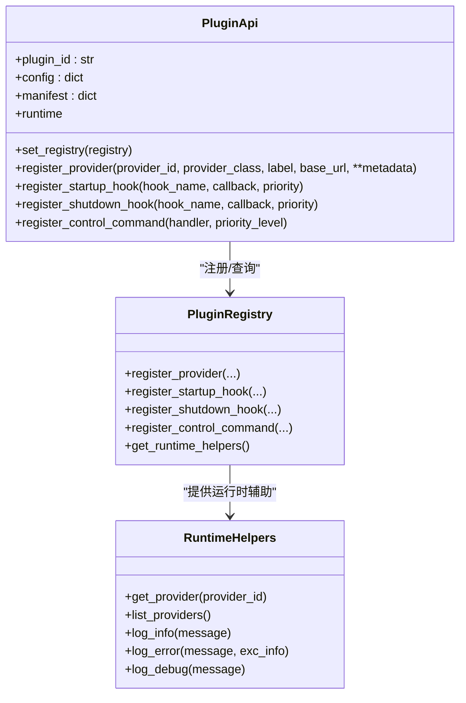
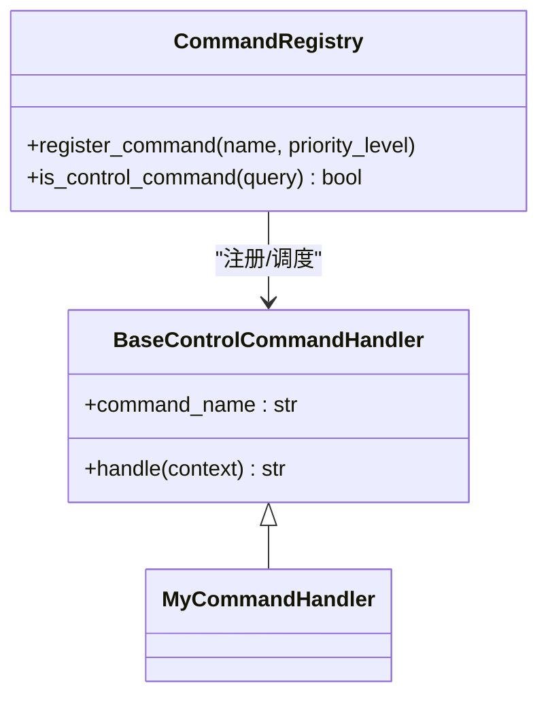
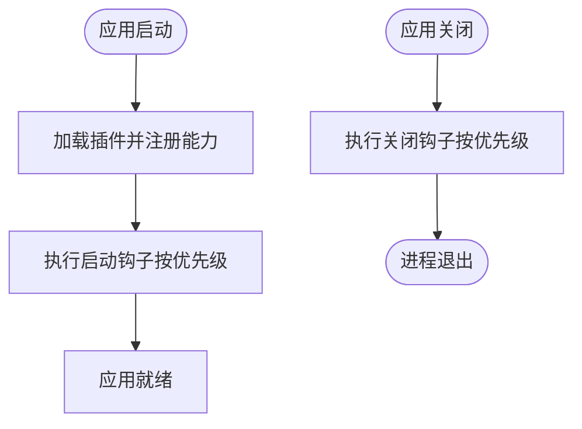
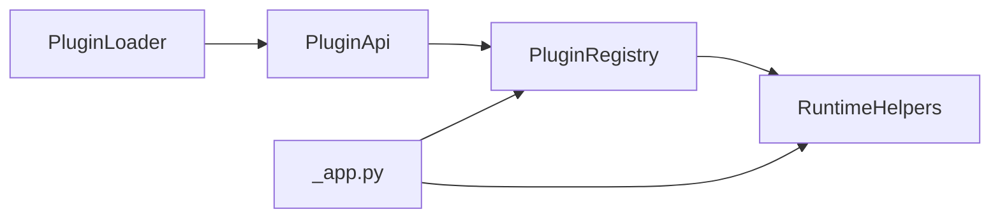

# 插件API规范

<cite>
**本文引用的文件**
- [src/qwenpaw/plugins/api.py](file://src/qwenpaw/plugins/api.py)
- [src/qwenpaw/plugins/registry.py](file://src/qwenpaw/plugins/registry.py)
- [src/qwenpaw/plugins/runtime.py](file://src/qwenpaw/plugins/runtime.py)
- [src/qwenpaw/plugins/loader.py](file://src/qwenpaw/plugins/loader.py)
- [src/qwenpaw/plugins/__init__.py](file://src/qwenpaw/plugins/__init__.py)
- [src/qwenpaw/app/_app.py](file://src/qwenpaw/app/_app.py)
- [src/qwenpaw/app/runner/control_commands/base.py](file://src/qwenpaw/app/runner/control_commands/base.py)
- [src/qwenpaw/app/runner/control_commands/__init__.py](file://src/qwenpaw/app/runner/control_commands/__init__.py)
</cite>

## 目录
1. [简介](#简介)
2. [项目结构](#项目结构)
3. [核心组件](#核心组件)
4. [架构总览](#架构总览)
5. [详细组件分析](#详细组件分析)
6. [依赖关系分析](#依赖关系分析)
7. [性能考量](#性能考量)
8. [故障排查指南](#故障排查指南)
9. [结论](#结论)
10. [附录：API参考手册](#附录api参考手册)

## 简介
本文件面向插件开发者，系统化阐述 QwenPaw 插件体系中的 PluginApi 类及其配套机制，包括：
- PluginApi 的全部公共方法与接口语义
- 注册提供方、启动/关闭钩子、控制命令注册的参数、用法与典型场景
- 插件配置系统、元数据管理与运行时辅助函数的使用方式
- 错误处理、异常情况与最佳实践
- 完整的 API 参考与调用流程图

## 项目结构
围绕插件 API 的核心模块如下：
- 插件 API 与注册表：src/qwenpaw/plugins/api.py、src/qwenpaw/plugins/registry.py
- 运行时辅助：src/qwenpaw/plugins/runtime.py
- 插件加载器：src/qwenpaw/plugins/loader.py
- 导出入口：src/qwenpaw/plugins/__init__.py
- 应用集成点（注册提供方、控制命令、启动钩子）：src/qwenpaw/app/_app.py
- 控制命令基类与注册：src/qwenpaw/app/runner/control_commands/base.py、src/qwenpaw/app/runner/control_commands/__init__.py

图表来源
- [src/qwenpaw/plugins/api.py:10-186](file://src/qwenpaw/plugins/api.py#L10-L186)
- [src/qwenpaw/plugins/registry.py:42-254](file://src/qwenpaw/plugins/registry.py#L42-L254)
- [src/qwenpaw/plugins/runtime.py:10-68](file://src/qwenpaw/plugins/runtime.py#L10-L68)
- [src/qwenpaw/plugins/loader.py:19-272](file://src/qwenpaw/plugins/loader.py#L19-L272)
- [src/qwenpaw/app/_app.py:335-399](file://src/qwenpaw/app/_app.py#L335-L399)
- [src/qwenpaw/app/runner/control_commands/base.py:49-69](file://src/qwenpaw/app/runner/control_commands/base.py#L49-L69)
- [src/qwenpaw/app/runner/control_commands/__init__.py:43-87](file://src/qwenpaw/app/runner/control_commands/__init__.py#L43-L87)

章节来源
- [src/qwenpaw/plugins/__init__.py:1-16](file://src/qwenpaw/plugins/__init__.py#L1-L16)
- [src/qwenpaw/plugins/api.py:10-186](file://src/qwenpaw/plugins/api.py#L10-L186)
- [src/qwenpaw/plugins/registry.py:42-254](file://src/qwenpaw/plugins/registry.py#L42-L254)
- [src/qwenpaw/plugins/runtime.py:10-68](file://src/qwenpaw/plugins/runtime.py#L10-L68)
- [src/qwenpaw/plugins/loader.py:19-272](file://src/qwenpaw/plugins/loader.py#L19-L272)
- [src/qwenpaw/app/_app.py:335-399](file://src/qwenpaw/app/_app.py#L335-L399)
- [src/qwenpaw/app/runner/control_commands/base.py:49-69](file://src/qwenpaw/app/runner/control_commands/base.py#L49-L69)
- [src/qwenpaw/app/runner/control_commands/__init__.py:43-87](file://src/qwenpaw/app/runner/control_commands/__init__.py#L43-L87)

## 核心组件
- PluginApi：插件开发者通过该类提供的 API 完成能力注册（提供方、启动/关闭钩子、控制命令），并访问运行时辅助函数。
- PluginRegistry：单例注册表，集中管理提供方、钩子与控制命令，并维护运行时辅助实例。
- RuntimeHelpers：向插件暴露运行时能力（如获取提供方、列出提供方、日志记录等）。
- PluginLoader：负责发现与加载插件，动态导入插件模块并调用其 register 方法完成注册。

章节来源
- [src/qwenpaw/plugins/api.py:10-186](file://src/qwenpaw/plugins/api.py#L10-L186)
- [src/qwenpaw/plugins/registry.py:42-254](file://src/qwenpaw/plugins/registry.py#L42-L254)
- [src/qwenpaw/plugins/runtime.py:10-68](file://src/qwenpaw/plugins/runtime.py#L10-L68)
- [src/qwenpaw/plugins/loader.py:19-272](file://src/qwenpaw/plugins/loader.py#L19-L272)

## 架构总览
下图展示了从插件加载到应用集成的关键交互路径，包括注册提供方、控制命令与启动钩子的执行时机。

图表来源
- [src/qwenpaw/plugins/loader.py:84-228](file://src/qwenpaw/plugins/loader.py#L84-L228)
- [src/qwenpaw/plugins/api.py:35-186](file://src/qwenpaw/plugins/api.py#L35-L186)
- [src/qwenpaw/plugins/registry.py:42-254](file://src/qwenpaw/plugins/registry.py#L42-L254)
- [src/qwenpaw/app/_app.py:335-399](file://src/qwenpaw/app/_app.py#L335-L399)

## 详细组件分析

### PluginApi 类详解
PluginApi 是插件开发的核心入口，提供以下公共方法与属性：

- 初始化
  - 参数
    - plugin_id: 字符串，插件唯一标识
    - config: 字典，插件配置
    - manifest: 字典，插件清单（来自 plugin.json）
  - 行为：保存传入参数，初始化内部状态；set_registry 用于注入注册表引用

- set_registry(registry)
  - 作用：由加载器在创建 API 后调用，建立 API 与注册表的连接
  - 参数：PluginRegistry 实例

- register_provider(provider_id, provider_class, label="", base_url="", **metadata)
  - 作用：注册自定义大模型提供方
  - 参数
    - provider_id: 唯一提供方标识
    - provider_class: 继承自基础提供方类的类对象
    - label: 显示名称，默认使用 provider_id
    - base_url: API 基础地址
    - **metadata: 元数据键值对（如 chat_model、require_api_key 等）
  - 元数据合并：若插件清单中存在 meta 字段，会与传入 metadata 合并后传递给注册表
  - 返回：无（内部委托注册表完成注册）

- register_startup_hook(hook_name, callback, priority=100)
  - 作用：注册启动阶段钩子
  - 参数
    - hook_name: 钩子唯一标识
    - callback: 同步或异步回调函数
    - priority: 执行优先级（数值越小越早执行，默认 100）
  - 行为：按优先级排序，低优先级先执行

- register_shutdown_hook(hook_name, callback, priority=100)
  - 作用：注册关闭阶段钩子
  - 参数
    - hook_name: 钩子唯一标识
    - callback: 同步或异步回调函数
    - priority: 执行优先级（数值越小越早执行，默认 100）
  - 行为：按优先级排序，低优先级先执行

- register_control_command(handler, priority_level=10)
  - 作用：注册控制命令处理器
  - 参数
    - handler: 继承自控制命令基类的实例
    - priority_level: 命令优先级（默认 10，数值越小优先级越高）
  - 行为：将处理器加入注册表，供应用层统一调度

- runtime 属性
  - 作用：返回运行时辅助对象 RuntimeHelpers
  - 使用：在插件运行期通过该对象访问提供方、日志等能力

图表来源
- [src/qwenpaw/plugins/api.py:10-186](file://src/qwenpaw/plugins/api.py#L10-L186)
- [src/qwenpaw/plugins/registry.py:42-254](file://src/qwenpaw/plugins/registry.py#L42-L254)
- [src/qwenpaw/plugins/runtime.py:10-68](file://src/qwenpaw/plugins/runtime.py#L10-L68)

章节来源
- [src/qwenpaw/plugins/api.py:17-186](file://src/qwenpaw/plugins/api.py#L17-L186)

### 插件配置系统与元数据管理
- 插件清单（plugin.json）会被加载为 Manifest 并转换为字典传入 PluginApi
- register_provider 会将 Manifest 中的 meta 与调用者传入的 metadata 合并后提交给注册表
- 插件配置（config）可通过 PluginApi.config 访问，用于在注册期间或运行期使用

章节来源
- [src/qwenpaw/plugins/loader.py:184-196](file://src/qwenpaw/plugins/loader.py#L184-L196)
- [src/qwenpaw/plugins/api.py:43-88](file://src/qwenpaw/plugins/api.py#L43-L88)

### 运行时辅助函数（RuntimeHelpers）
- get_provider(provider_id): 获取指定提供方实例
- list_providers(): 列出所有可用提供方 ID
- log_info/log_error/log_debug: 日志记录工具

章节来源
- [src/qwenpaw/plugins/runtime.py:21-68](file://src/qwenpaw/plugins/runtime.py#L21-L68)
- [src/qwenpaw/plugins/api.py:176-186](file://src/qwenpaw/plugins/api.py#L176-L186)

### 控制命令处理器（BaseControlCommandHandler）
- 控制命令处理器需继承控制命令基类并实现 handle(context) 异步方法
- 命令名（command_name）不能为空，且应用层会注册到命令注册表
- 插件通过 register_control_command 将处理器注册到全局注册表

图表来源
- [src/qwenpaw/app/runner/control_commands/base.py:49-69](file://src/qwenpaw/app/runner/control_commands/base.py#L49-L69)
- [src/qwenpaw/app/runner/control_commands/__init__.py:43-87](file://src/qwenpaw/app/runner/control_commands/__init__.py#L43-L87)
- [src/qwenpaw/plugins/api.py:153-175](file://src/qwenpaw/plugins/api.py#L153-L175)

章节来源
- [src/qwenpaw/app/runner/control_commands/base.py:49-69](file://src/qwenpaw/app/runner/control_commands/base.py#L49-L69)
- [src/qwenpaw/app/runner/control_commands/__init__.py:43-87](file://src/qwenpaw/app/runner/control_commands/__init__.py#L43-L87)
- [src/qwenpaw/plugins/api.py:153-175](file://src/qwenpaw/plugins/api.py#L153-L175)

### 启动/关闭钩子执行流程
- 应用启动时，按优先级顺序依次执行已注册的启动钩子
- 应用关闭时，按优先级顺序依次执行已注册的关闭钩子
- 支持同步与异步回调

图表来源
- [src/qwenpaw/app/_app.py:384-399](file://src/qwenpaw/app/_app.py#L384-L399)
- [src/qwenpaw/plugins/registry.py:149-221](file://src/qwenpaw/plugins/registry.py#L149-L221)

章节来源
- [src/qwenpaw/app/_app.py:384-399](file://src/qwenpaw/app/_app.py#L384-L399)
- [src/qwenpaw/plugins/registry.py:149-221](file://src/qwenpaw/plugins/registry.py#L149-L221)

## 依赖关系分析
- PluginApi 依赖 PluginRegistry 完成注册与查询
- PluginLoader 在加载插件时创建 PluginApi 并注入注册表
- 应用在启动阶段从注册表获取提供方、控制命令与钩子并执行
- RuntimeHelpers 由注册表持有并在需要时通过 API.runtime 提供给插件

图表来源
- [src/qwenpaw/plugins/loader.py:19-272](file://src/qwenpaw/plugins/loader.py#L19-L272)
- [src/qwenpaw/plugins/api.py:35-186](file://src/qwenpaw/plugins/api.py#L35-L186)
- [src/qwenpaw/plugins/registry.py:42-254](file://src/qwenpaw/plugins/registry.py#L42-L254)
- [src/qwenpaw/app/_app.py:335-399](file://src/qwenpaw/app/_app.py#L335-L399)

章节来源
- [src/qwenpaw/plugins/loader.py:19-272](file://src/qwenpaw/plugins/loader.py#L19-L272)
- [src/qwenpaw/plugins/api.py:35-186](file://src/qwenpaw/plugins/api.py#L35-L186)
- [src/qwenpaw/plugins/registry.py:42-254](file://src/qwenpaw/plugins/registry.py#L42-L254)
- [src/qwenpaw/app/_app.py:335-399](file://src/qwenpaw/app/_app.py#L335-L399)

## 性能考量
- 钩子优先级排序仅在注册时发生，复杂度 O(n log n)，n 为钩子数量
- 提供方注册与查询为哈希表操作，时间复杂度 O(1)
- 控制命令注册为列表追加，查询为线性扫描，建议合理设置优先级以减少冲突
- 异步钩子与命令可提升 I/O 密集型任务吞吐

## 故障排查指南
- 提供方重复注册
  - 现象：抛出值错误，提示提供方 ID 已被占用
  - 处理：确保 provider_id 唯一，避免命名冲突
  - 参考：[src/qwenpaw/plugins/registry.py:95-100](file://src/qwenpaw/plugins/registry.py#L95-L100)

- 插件模块缺失必要导出
  - 现象：加载失败，提示缺少 plugin 对象或 register 方法
  - 处理：确保插件模块导出 plugin 对象并实现 register(api) 方法
  - 参考：[src/qwenpaw/plugins/loader.py:177-208](file://src/qwenpaw/plugins/loader.py#L177-L208)

- 控制命令未注册或命令名为空
  - 现象：命令无法识别或注册失败
  - 处理：确保处理器实现 command_name 且不为空
  - 参考：[src/qwenpaw/app/runner/control_commands/__init__.py:49-52](file://src/qwenpaw/app/runner/control_commands/__init__.py#L49-L52)

- 运行时辅助不可用
  - 现象：API.runtime 返回空
  - 处理：确认注册表已设置运行时辅助，或检查加载流程
  - 参考：[src/qwenpaw/plugins/registry.py:133-147](file://src/qwenpaw/plugins/registry.py#L133-L147)

章节来源
- [src/qwenpaw/plugins/registry.py:95-100](file://src/qwenpaw/plugins/registry.py#L95-L100)
- [src/qwenpaw/plugins/loader.py:177-208](file://src/qwenpaw/plugins/loader.py#L177-L208)
- [src/qwenpaw/app/runner/control_commands/__init__.py:49-52](file://src/qwenpaw/app/runner/control_commands/__init__.py#L49-L52)
- [src/qwenpaw/plugins/registry.py:133-147](file://src/qwenpaw/plugins/registry.py#L133-L147)

## 结论
PluginApi 为插件开发者提供了清晰、一致的能力注册接口，配合 PluginRegistry 与 PluginLoader 形成了完整的插件生命周期管理。通过合理的元数据与配置管理、运行时辅助与控制命令机制，插件可以安全、高效地扩展系统能力。

## 附录：API参考手册

- PluginApi.__init__(plugin_id, config, manifest=None)
  - 用途：初始化插件 API
  - 参数
    - plugin_id: 插件唯一标识
    - config: 插件配置字典
    - manifest: 插件清单字典（来自 plugin.json）
  - 示例路径：[src/qwenpaw/plugins/api.py:17-32](file://src/qwenpaw/plugins/api.py#L17-L32)

- PluginApi.set_registry(registry)
  - 用途：注入注册表引用
  - 参数：PluginRegistry 实例
  - 示例路径：[src/qwenpaw/plugins/api.py:35-41](file://src/qwenpaw/plugins/api.py#L35-L41)

- PluginApi.register_provider(provider_id, provider_class, label="", base_url="", **metadata)
  - 用途：注册自定义提供方
  - 参数
    - provider_id: 唯一提供方标识
    - provider_class: 提供方类（继承自基础提供方）
    - label: 显示名称
    - base_url: API 基础地址
    - **metadata: 元数据键值对
  - 元数据合并：Manifest.meta 与传入 metadata 合并
  - 示例路径：[src/qwenpaw/plugins/api.py:43-88](file://src/qwenpaw/plugins/api.py#L43-L88)

- PluginApi.register_startup_hook(hook_name, callback, priority=100)
  - 用途：注册启动钩子
  - 参数
    - hook_name: 钩子唯一标识
    - callback: 回调函数（支持异步）
    - priority: 执行优先级（越小越早）
  - 示例路径：[src/qwenpaw/plugins/api.py:89-119](file://src/qwenpaw/plugins/api.py#L89-L119)

- PluginApi.register_shutdown_hook(hook_name, callback, priority=100)
  - 用途：注册关闭钩子
  - 参数
    - hook_name: 钩子唯一标识
    - callback: 回调函数（支持异步）
    - priority: 执行优先级（越小越早）
  - 示例路径：[src/qwenpaw/plugins/api.py:121-151](file://src/qwenpaw/plugins/api.py#L121-L151)

- PluginApi.register_control_command(handler, priority_level=10)
  - 用途：注册控制命令处理器
  - 参数
    - handler: 继承自控制命令基类的实例
    - priority_level: 命令优先级（越小越高）
  - 示例路径：[src/qwenpaw/plugins/api.py:153-175](file://src/qwenpaw/plugins/api.py#L153-L175)

- PluginApi.runtime
  - 用途：获取运行时辅助对象
  - 返回：RuntimeHelpers 或 None
  - 示例路径：[src/qwenpaw/plugins/api.py:176-186](file://src/qwenpaw/plugins/api.py#L176-L186)

- RuntimeHelpers.get_provider(provider_id)
  - 用途：获取提供方实例
  - 示例路径：[src/qwenpaw/plugins/runtime.py:21-32](file://src/qwenpaw/plugins/runtime.py#L21-L32)

- RuntimeHelpers.list_providers()
  - 用途：列出所有可用提供方 ID
  - 示例路径：[src/qwenpaw/plugins/runtime.py:34-42](file://src/qwenpaw/plugins/runtime.py#L34-L42)

- RuntimeHelpers.log_info/message/error/debug
  - 用途：日志记录
  - 示例路径：[src/qwenpaw/plugins/runtime.py:44-68](file://src/qwenpaw/plugins/runtime.py#L44-L68)

- 控制命令基类与注册
  - BaseControlCommandHandler.command_name: 命令名
  - BaseControlCommandHandler.handle(context): 异步处理逻辑
  - CommandRegistry.register_command(name, priority_level): 注册命令
  - 示例路径：
    - [src/qwenpaw/app/runner/control_commands/base.py:49-69](file://src/qwenpaw/app/runner/control_commands/base.py#L49-L69)
    - [src/qwenpaw/app/runner/control_commands/__init__.py:43-87](file://src/qwenpaw/app/runner/control_commands/__init__.py#L43-L87)

- 应用集成要点
  - 注册提供方：遍历注册表中的提供方并注册到提供方管理器
  - 注册控制命令：遍历注册表中的命令处理器并注册到命令注册表
  - 执行启动/关闭钩子：按优先级顺序执行
  - 示例路径：
    - [src/qwenpaw/app/_app.py:335-399](file://src/qwenpaw/app/_app.py#L335-L399)