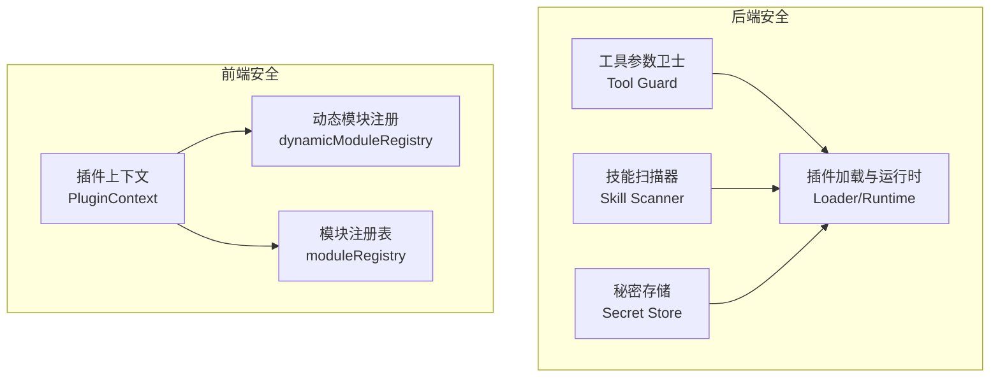
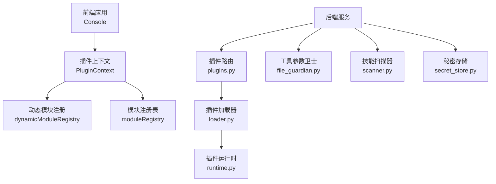
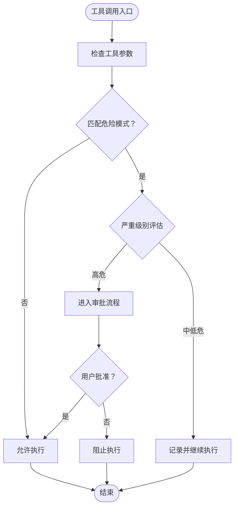
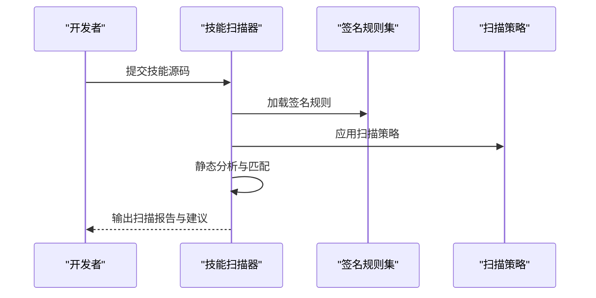
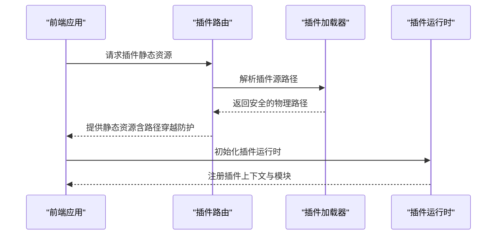
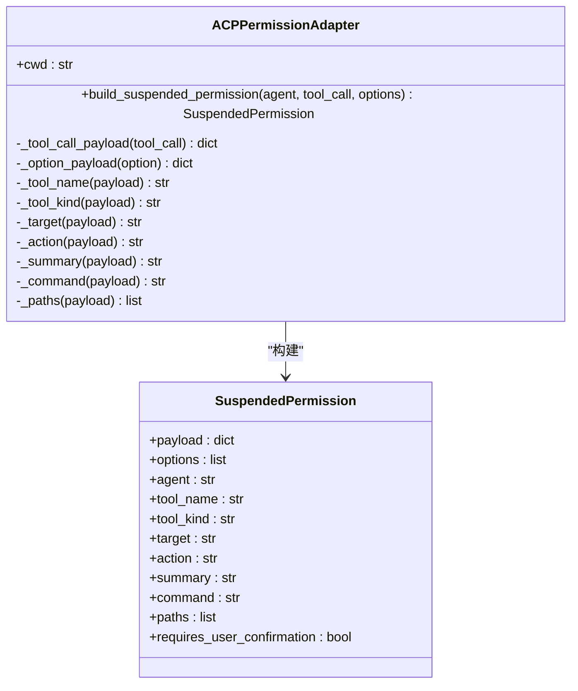
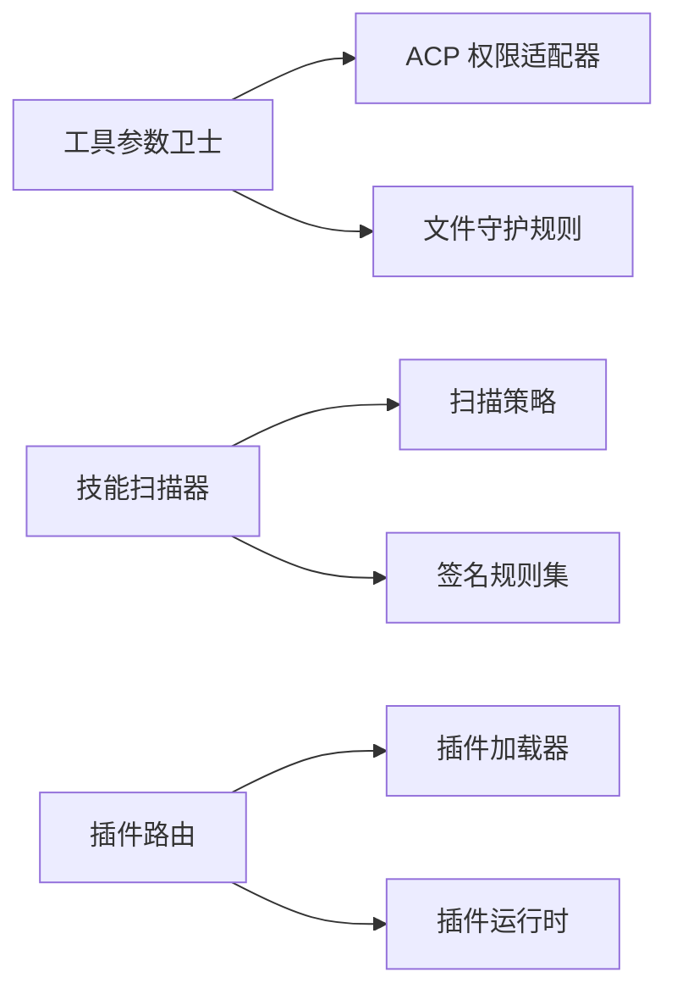

# 插件安全与隔离

<cite>
**本文引用的文件**
- [SECURITY.md](file://SECURITY.md)
- [security.en.md](file://website/public/docs/security.en.md)
- [permissions.py](file://src/qwenpaw/agents/acp/permissions.py)
- [plugins.py](file://src/qwenpaw/app/routers/plugins.py)
- [file_guardian.py](file://src/qwenpaw/security/tool_guard/guardians/file_guardian.py)
- [models.py](file://src/qwenpaw/security/tool_guard/models.py)
- [scanner.py](file://src/qwenpaw/security/skill_scanner/scanner.py)
- [scan_policy.py](file://src/qwenpaw/security/skill_scanner/scan_policy.py)
- [data_exfiltration.yaml](file://src/qwenpaw/security/skill_scanner/rules/signatures/data_exfiltration.yaml)
- [secret_store.py](file://src/qwenpaw/security/secret_store.py)
- [registry.py](file://src/qwenpaw/plugins/registry.py)
- [loader.py](file://src/qwenpaw/plugins/loader.py)
- [runtime.py](file://src/qwenpaw/plugins/runtime.py)
- [architecture.py](file://src/qwenpaw/plugins/architecture.py)
- [PluginContext.tsx](file://console/src/plugins/PluginContext.tsx)
- [dynamicModuleRegistry.ts](file://console/src/plugins/dynamicModuleRegistry.ts)
- [moduleRegistry.ts](file://console/src/plugins/moduleRegistry.ts)
</cite>

## 目录
1. [引言](#引言)
2. [项目结构](#项目结构)
3. [核心组件](#核心组件)
4. [架构总览](#架构总览)
5. [详细组件分析](#详细组件分析)
6. [依赖关系分析](#依赖关系分析)
7. [性能考量](#性能考量)
8. [故障排除指南](#故障排除指南)
9. [结论](#结论)
10. [附录](#附录)

## 引言
本技术文档聚焦于 QwenPaw 的插件安全与隔离机制，系统阐述插件沙箱隔离、权限控制、安全边界设计、运行时限制、资源访问控制与恶意代码防护，并给出插件间隔离、数据保护与通信安全的设计要点。同时提供安全审计、漏洞检测与风险评估方法，以及面向插件开发者与系统管理员的最佳实践与部署指导。

## 项目结构
围绕“安全”主题，QwenPaw 在后端与前端分别提供了多层安全能力：
- 后端安全子系统：工具参数卫士（Tool Guard）、技能扫描器（Skill Scanner）、秘密存储（Secret Store）、插件加载与运行时（Plugins Loader/Runtime）等。
- 前端安全子系统：插件上下文与模块注册（PluginContext、动态模块注册），确保前端侧插件加载与路由的安全性。

**图表来源**
- [file_guardian.py:1-300](file://src/qwenpaw/security/tool_guard/guardians/file_guardian.py#L1-L300)
- [scanner.py:1-200](file://src/qwenpaw/security/skill_scanner/scanner.py#L1-L200)
- [secret_store.py:1-200](file://src/qwenpaw/security/secret_store.py#L1-L200)
- [loader.py:1-200](file://src/qwenpaw/plugins/loader.py#L1-L200)
- [runtime.py:1-200](file://src/qwenpaw/plugins/runtime.py#L1-L200)
- [PluginContext.tsx:1-200](file://console/src/plugins/PluginContext.tsx#L1-L200)
- [dynamicModuleRegistry.ts:1-200](file://console/src/plugins/dynamicModuleRegistry.ts#L1-L200)
- [moduleRegistry.ts:1-200](file://console/src/plugins/moduleRegistry.ts#L1-L200)

**章节来源**
- [SECURITY.md:65-141](file://SECURITY.md#L65-L141)
- [security.en.md:38-68](file://website/public/docs/security.en.md#L38-L68)

## 核心组件
- 工具参数卫士（Tool Guard）
  - 对危险命令模式进行规则匹配与告警，支持交互式审批流程与非交互式日志记录策略。
  - 提供敏感文件访问阻断、路径遍历检测、命令注入与重定向操作识别等能力。
- 技能扫描器（Skill Scanner）
  - 基于签名规则与扫描策略对技能源码进行静态扫描，识别外发网络请求、敏感文件访问等潜在风险。
- 秘密存储（Secret Store）
  - 统一管理与保护敏感凭据，避免硬编码与泄露。
- 插件加载与运行时（Plugins Loader/Runtime）
  - 负责插件清单解析、前端静态资源服务、路径穿越防护与运行时隔离策略。
- 前端插件上下文与模块注册
  - 确保插件在前端侧的上下文安全与模块加载可控。

**章节来源**
- [file_guardian.py:1-300](file://src/qwenpaw/security/tool_guard/guardians/file_guardian.py#L1-L300)
- [models.py:1-120](file://src/qwenpaw/security/tool_guard/models.py#L1-L120)
- [scanner.py:1-200](file://src/qwenpaw/security/skill_scanner/scanner.py#L1-L200)
- [scan_policy.py:1-200](file://src/qwenpaw/security/skill_scanner/scan_policy.py#L1-L200)
- [data_exfiltration.yaml:1-40](file://src/qwenpaw/security/skill_scanner/rules/signatures/data_exfiltration.yaml#L1-L40)
- [secret_store.py:1-200](file://src/qwenpaw/security/secret_store.py#L1-L200)
- [plugins.py:94-132](file://src/qwenpaw/app/routers/plugins.py#L94-L132)
- [loader.py:1-200](file://src/qwenpaw/plugins/loader.py#L1-L200)
- [runtime.py:1-200](file://src/qwenpaw/plugins/runtime.py#L1-L200)
- [PluginContext.tsx:1-200](file://console/src/plugins/PluginContext.tsx#L1-L200)
- [dynamicModuleRegistry.ts:1-200](file://console/src/plugins/dynamicModuleRegistry.ts#L1-L200)
- [moduleRegistry.ts:1-200](file://console/src/plugins/moduleRegistry.ts#L1-L200)

## 架构总览
下图展示了插件从加载到运行期间的关键安全控制点，包括前端静态资源服务、后端工具调用拦截、技能源码扫描与秘密存储保护。

**图表来源**
- [plugins.py:94-132](file://src/qwenpaw/app/routers/plugins.py#L94-L132)
- [loader.py:1-200](file://src/qwenpaw/plugins/loader.py#L1-L200)
- [runtime.py:1-200](file://src/qwenpaw/plugins/runtime.py#L1-L200)
- [file_guardian.py:1-300](file://src/qwenpaw/security/tool_guard/guardians/file_guardian.py#L1-L300)
- [scanner.py:1-200](file://src/qwenpaw/security/skill_scanner/scanner.py#L1-L200)
- [secret_store.py:1-200](file://src/qwenpaw/security/secret_store.py#L1-L200)
- [PluginContext.tsx:1-200](file://console/src/plugins/PluginContext.tsx#L1-L200)
- [dynamicModuleRegistry.ts:1-200](file://console/src/plugins/dynamicModuleRegistry.ts#L1-L200)
- [moduleRegistry.ts:1-200](file://console/src/plugins/moduleRegistry.ts#L1-L200)

## 详细组件分析

### 工具参数卫士（Tool Guard）
- 功能定位
  - 在工具调用前对关键参数进行规则匹配与风险评估，针对高危模式触发交互式审批或记录日志。
- 关键能力
  - 危险命令模式识别（如系统级删除、格式化、特权提升等）。
  - 敏感文件访问阻断与路径规范化处理。
  - Shell 重定向与注入模式检测。
- 风险等级与处置
  - 不同规则具有独立严重级别；对高危发现进入待审批流程，低危仅记录。
- 配置入口
  - 通过配置项启用/禁用、指定受保护工具、拒绝名单与自定义规则。

**图表来源**
- [file_guardian.py:1-300](file://src/qwenpaw/security/tool_guard/guardians/file_guardian.py#L1-L300)
- [models.py:1-120](file://src/qwenpaw/security/tool_guard/models.py#L1-L120)

**章节来源**
- [file_guardian.py:1-300](file://src/qwenpaw/security/tool_guard/guardians/file_guardian.py#L1-L300)
- [models.py:1-120](file://src/qwenpaw/security/tool_guard/models.py#L1-L120)
- [security.en.md:38-68](file://website/public/docs/security.en.md#L38-L68)

### 技能扫描器（Skill Scanner）
- 功能定位
  - 对技能源码进行静态扫描，识别潜在的数据外泄、网络滥用、敏感文件访问等风险。
- 规则体系
  - 基于 YAML 签名规则，覆盖网络请求、文件访问等场景。
- 扫描策略
  - 可配置扫描范围、严重级别阈值与例外规则，支持按文件类型过滤。

**图表来源**
- [scanner.py:1-200](file://src/qwenpaw/security/skill_scanner/scanner.py#L1-L200)
- [scan_policy.py:1-200](file://src/qwenpaw/security/skill_scanner/scan_policy.py#L1-L200)
- [data_exfiltration.yaml:1-40](file://src/qwenpaw/security/skill_scanner/rules/signatures/data_exfiltration.yaml#L1-L40)

**章节来源**
- [scanner.py:1-200](file://src/qwenpaw/security/skill_scanner/scanner.py#L1-L200)
- [scan_policy.py:1-200](file://src/qwenpaw/security/skill_scanner/scan_policy.py#L1-L200)
- [data_exfiltration.yaml:1-40](file://src/qwenpaw/security/skill_scanner/rules/signatures/data_exfiltration.yaml#L1-L40)

### 插件加载与运行时（Plugins Loader/Runtime）
- 功能定位
  - 负责插件清单解析、前端静态资源服务、路径穿越防护与运行时隔离策略。
- 安全要点
  - 前端静态文件服务具备路径穿越防护，确保只允许从插件目录内访问。
  - 插件运行时与宿主进程处于同一信任边界，需严格控制插件来源与权限。
- 前端集成
  - 插件上下文与动态模块注册保障前端侧插件加载可控与可审计。

**图表来源**
- [plugins.py:94-132](file://src/qwenpaw/app/routers/plugins.py#L94-L132)
- [loader.py:1-200](file://src/qwenpaw/plugins/loader.py#L1-L200)
- [runtime.py:1-200](file://src/qwenpaw/plugins/runtime.py#L1-L200)
- [PluginContext.tsx:1-200](file://console/src/plugins/PluginContext.tsx#L1-L200)
- [dynamicModuleRegistry.ts:1-200](file://console/src/plugins/dynamicModuleRegistry.ts#L1-L200)
- [moduleRegistry.ts:1-200](file://console/src/plugins/moduleRegistry.ts#L1-L200)

**章节来源**
- [plugins.py:94-132](file://src/qwenpaw/app/routers/plugins.py#L94-L132)
- [loader.py:1-200](file://src/qwenpaw/plugins/loader.py#L1-L200)
- [runtime.py:1-200](file://src/qwenpaw/plugins/runtime.py#L1-L200)
- [PluginContext.tsx:1-200](file://console/src/plugins/PluginContext.tsx#L1-L200)
- [dynamicModuleRegistry.ts:1-200](file://console/src/plugins/dynamicModuleRegistry.ts#L1-L200)
- [moduleRegistry.ts:1-200](file://console/src/plugins/moduleRegistry.ts#L1-L200)

### 权限控制系统（ACP）
- 功能定位
  - 将工具调用封装为“暂停权限”，提取工具名称、目标、动作、路径等元信息，触发用户确认流程。
- 关键特性
  - 统一封装工具调用元数据，便于后续策略引擎与审批流对接。
  - 内置危险命令模式列表，作为默认阻断策略的一部分。

**图表来源**
- [permissions.py:1-120](file://src/qwenpaw/agents/acp/permissions.py#L1-L120)

**章节来源**
- [permissions.py:1-120](file://src/qwenpaw/agents/acp/permissions.py#L1-L120)

### 秘密存储（Secret Store）
- 功能定位
  - 统一管理敏感凭据，避免硬编码与泄露，支持最小暴露原则与访问控制。
- 使用建议
  - 将第三方密钥、数据库密码等放入 Secret Store，避免写入工作目录或技能可访问路径。

**章节来源**
- [secret_store.py:1-200](file://src/qwenpaw/security/secret_store.py#L1-L200)

## 依赖关系分析
- 组件耦合
  - Tool Guard 与 ACP 权限适配器协同，前者负责参数校验，后者负责权限封装与审批触发。
  - Skill Scanner 与扫描策略解耦，规则集独立维护，便于扩展与更新。
  - 插件路由与加载器强耦合，确保前端静态资源服务的安全边界。
- 外部依赖
  - 插件运行时与宿主进程共享同一信任边界，需通过严格的来源控制与权限收窄降低风险。

**图表来源**
- [file_guardian.py:1-300](file://src/qwenpaw/security/tool_guard/guardians/file_guardian.py#L1-L300)
- [permissions.py:1-120](file://src/qwenpaw/agents/acp/permissions.py#L1-L120)
- [scanner.py:1-200](file://src/qwenpaw/security/skill_scanner/scanner.py#L1-L200)
- [scan_policy.py:1-200](file://src/qwenpaw/security/skill_scanner/scan_policy.py#L1-L200)
- [plugins.py:94-132](file://src/qwenpaw/app/routers/plugins.py#L94-L132)
- [loader.py:1-200](file://src/qwenpaw/plugins/loader.py#L1-L200)
- [runtime.py:1-200](file://src/qwenpaw/plugins/runtime.py#L1-L200)

**章节来源**
- [file_guardian.py:1-300](file://src/qwenpaw/security/tool_guard/guardians/file_guardian.py#L1-L300)
- [permissions.py:1-120](file://src/qwenpaw/agents/acp/permissions.py#L1-L120)
- [scanner.py:1-200](file://src/qwenpaw/security/skill_scanner/scanner.py#L1-L200)
- [scan_policy.py:1-200](file://src/qwenpaw/security/skill_scanner/scan_policy.py#L1-L200)
- [plugins.py:94-132](file://src/qwenpaw/app/routers/plugins.py#L94-L132)
- [loader.py:1-200](file://src/qwenpaw/plugins/loader.py#L1-L200)
- [runtime.py:1-200](file://src/qwenpaw/plugins/runtime.py#L1-L200)

## 性能考量
- 规则匹配与扫描开销
  - Tool Guard 的正则匹配与敏感文件路径解析应尽量减少不必要的 IO 与字符串操作，必要时引入缓存与白名单优化。
- 扫描策略
  - 合理设置扫描阈值与文件类型过滤，避免对大型仓库造成过载。
- 插件资源服务
  - 前端静态资源服务应结合浏览器缓存与 CDN，减少重复请求带来的延迟。

## 故障排除指南
- 工具调用被误判
  - 检查 Tool Guard 的规则配置与自定义规则，必要时调整严重级别或加入白名单。
- 路径穿越防护导致资源无法加载
  - 确认插件静态资源路径是否位于插件源目录内，避免相对路径越界。
- 技能扫描误报
  - 更新签名规则或调整扫描策略，确保规则与实际业务场景匹配。
- 密钥泄露风险
  - 使用 Secret Store 管理凭据，避免直接写入工作目录或技能可访问路径。

**章节来源**
- [file_guardian.py:1-300](file://src/qwenpaw/security/tool_guard/guardians/file_guardian.py#L1-L300)
- [plugins.py:94-132](file://src/qwenpaw/app/routers/plugins.py#L94-L132)
- [scanner.py:1-200](file://src/qwenpaw/security/skill_scanner/scanner.py#L1-L200)
- [secret_store.py:1-200](file://src/qwenpaw/security/secret_store.py#L1-L200)

## 结论
QwenPaw 的插件安全体系以“信任边界”为核心设计思想，强调宿主进程与插件在同一信任域内的协作与管控。通过工具参数卫士、技能扫描器、秘密存储与插件加载运行时的多层防护，结合前端上下文与模块注册的安全控制，形成从源码到运行期的全链路安全闭环。建议在生产环境中严格遵循最小权限原则、最小暴露原则与严格来源控制，并持续完善规则与策略以应对新的威胁形态。

## 附录
- 安全配置最佳实践
  - 启用 Tool Guard 并合理配置受保护工具与拒绝名单；为高危发现开启交互式审批。
  - 使用 Secret Store 管理敏感凭据，避免写入工作目录或技能可访问路径。
  - 对技能源码定期进行静态扫描，结合签名规则与扫描策略持续优化。
  - 严格控制插件来源与权限，避免安装不受信插件。
- 常见安全威胁与防护
  - 命令注入与特权提升：通过 Tool Guard 的危险模式识别与交互式审批阻断。
  - 数据外泄：通过 Skill Scanner 的网络请求与敏感文件访问规则检测。
  - 路径穿越：通过插件路由的路径穿越防护确保静态资源访问安全。
- 风险评估与审计
  - 建立定期扫描与审批流程，对高危发现进行复核与溯源。
  - 对插件与技能进行变更审计，确保权限与配置的合规性。

**章节来源**
- [SECURITY.md:65-141](file://SECURITY.md#L65-L141)
- [security.en.md:38-68](file://website/public/docs/security.en.md#L38-L68)
- [file_guardian.py:1-300](file://src/qwenpaw/security/tool_guard/guardians/file_guardian.py#L1-L300)
- [scanner.py:1-200](file://src/qwenpaw/security/skill_scanner/scanner.py#L1-L200)
- [plugins.py:94-132](file://src/qwenpaw/app/routers/plugins.py#L94-L132)
- [secret_store.py:1-200](file://src/qwenpaw/security/secret_store.py#L1-L200)