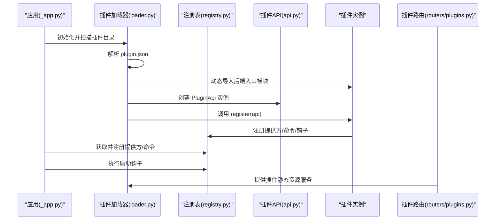
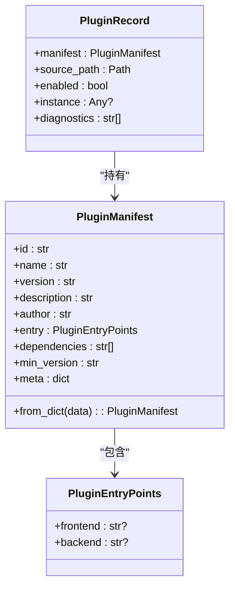
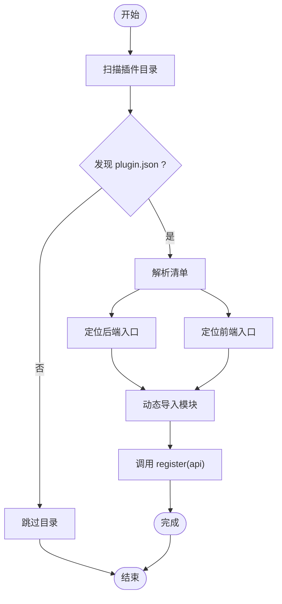
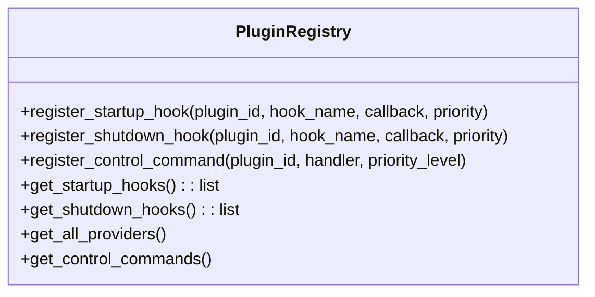
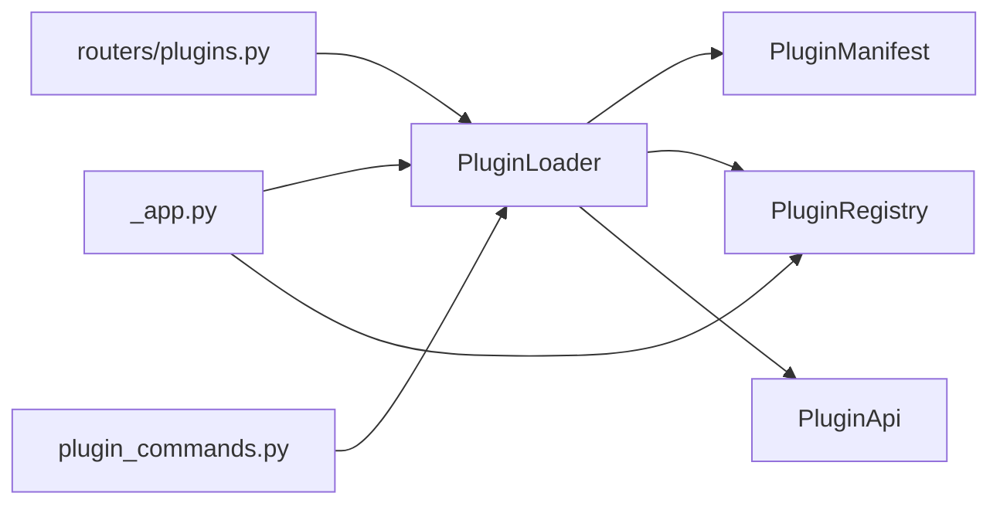

# 插件开发

<cite>
**本文引用的文件**
- [src/qwenpaw/plugins/__init__.py](file://src/qwenpaw/plugins/__init__.py)
- [src/qwenpaw/plugins/architecture.py](file://src/qwenpaw/plugins/architecture.py)
- [src/qwenpaw/plugins/loader.py](file://src/qwenpaw/plugins/loader.py)
- [src/qwenpaw/plugins/registry.py](file://src/qwenpaw/plugins/registry.py)
- [src/qwenpaw/plugins/api.py](file://src/qwenpaw/plugins/api.py)
- [src/qwenpaw/plugins/runtime.py](file://src/qwenpaw/plugins/runtime.py)
- [src/qwenpaw/app/_app.py](file://src/qwenpaw/app/_app.py)
- [src/qwenpaw/app/routers/plugins.py](file://src/qwenpaw/app/routers/plugins.py)
- [src/qwenpaw/cli/plugin_commands.py](file://src/qwenpaw/cli/plugin_commands.py)
- [src/qwenpaw/agents/acp/permissions.py](file://src/qwenpaw/agents/acp/permissions.py)
- [website/public/docs/plugins.en.md](file://website/public/docs/plugins.en.md)
- [website/public/docs/plugins.zh.md](file://website/public/docs/plugins.zh.md)
</cite>

## 目录
1. [简介](#简介)
2. [项目结构](#项目结构)
3. [核心组件](#核心组件)
4. [架构总览](#架构总览)
5. [详细组件分析](#详细组件分析)
6. [依赖关系分析](#依赖关系分析)
7. [性能考量](#性能考量)
8. [故障排查指南](#故障排查指南)
9. [结论](#结论)
10. [附录](#附录)

## 简介
本指南面向希望为 QwenPaw 开发自定义功能扩展的开发者，系统讲解插件系统的 API 接口规范、开发框架与扩展机制，覆盖插件清单（Manifest）结构、插件入口点配置、依赖管理、注册机制、生命周期钩子、事件系统、前后端插件差异、安全与权限控制等主题，并提供从项目初始化到打包发布的完整流程与最佳实践。

## 项目结构
QwenPaw 的插件系统由后端 Python 模块与前端构建体系共同组成：
- 后端插件：通过插件目录下的 plugin.json 清单与后端入口模块加载，使用 PluginLoader 发现并加载，借助 PluginRegistry 注册能力与钩子。
- 前端插件：通过 dist/index.js 或其他打包产物在运行时由后端路由暴露给前端，支持静态资源服务与路径穿越防护。
- CLI 安装命令：提供本地或远程安装、列出、查询插件的能力，保障安装过程的安全性与一致性。

```mermaid
graph TB
subgraph "后端"
Loader["PluginLoader<br/>发现与加载插件"]
Registry["PluginRegistry<br/>注册表"]
API["PluginApi<br/>插件能力API"]
App["_app.py<br/>应用启动集成"]
Router["plugins.py<br/>插件静态资源路由"]
end
subgraph "前端"
FE_Plugin["前端插件打包产物<br/>dist/index.js 等"]
end
subgraph "CLI"
CLI["plugin_commands.py<br/>安装/卸载/查询"]
end
Loader --> Registry
Loader --> API
App --> Loader
Router --> Loader
CLI --> Loader
FE_Plugin --> Router
```

图表来源
- [src/qwenpaw/plugins/loader.py:19-271](file://src/qwenpaw/plugins/loader.py#L19-L271)
- [src/qwenpaw/plugins/registry.py:144-229](file://src/qwenpaw/plugins/registry.py#L144-L229)
- [src/qwenpaw/app/_app.py:335-399](file://src/qwenpaw/app/_app.py#L335-L399)
- [src/qwenpaw/app/routers/plugins.py:94-132](file://src/qwenpaw/app/routers/plugins.py#L94-L132)
- [src/qwenpaw/cli/plugin_commands.py:79-308](file://src/qwenpaw/cli/plugin_commands.py#L79-L308)

章节来源
- [src/qwenpaw/plugins/__init__.py:1-15](file://src/qwenpaw/plugins/__init__.py#L1-L15)
- [src/qwenpaw/plugins/architecture.py:1-69](file://src/qwenpaw/plugins/architecture.py#L1-L69)
- [src/qwenpaw/plugins/loader.py:19-271](file://src/qwenpaw/plugins/loader.py#L19-L271)
- [src/qwenpaw/plugins/registry.py:144-229](file://src/qwenpaw/plugins/registry.py#L144-L229)
- [src/qwenpaw/app/routers/plugins.py:94-132](file://src/qwenpaw/app/routers/plugins.py#L94-L132)
- [src/qwenpaw/cli/plugin_commands.py:79-308](file://src/qwenpaw/cli/plugin_commands.py#L79-L308)

## 核心组件
- 插件清单（Manifest）：描述插件标识、名称、版本、作者、入口点、依赖、最低兼容版本与元数据。
- 插件入口点：后端入口（Python 模块）与前端入口（打包产物），用于导出插件实例并注册能力。
- 插件加载器（PluginLoader）：扫描插件目录、解析清单、动态导入模块、调用 register 并注入 PluginApi。
- 插件注册表（PluginRegistry）：集中管理已注册的提供方、控制命令、启动/关闭钩子等。
- 插件 API（PluginApi）：向插件开放注册能力的统一接口。
- 应用集成（_app.py）：在应用启动阶段注册插件提供的提供方、控制命令与生命周期钩子。
- 前端路由（plugins.py）：提供插件静态资源服务与路径穿越保护。
- CLI 插件命令（plugin_commands.py）：安装、卸载、查询插件。

章节来源
- [src/qwenpaw/plugins/architecture.py:9-69](file://src/qwenpaw/plugins/architecture.py#L9-L69)
- [src/qwenpaw/plugins/loader.py:19-271](file://src/qwenpaw/plugins/loader.py#L19-L271)
- [src/qwenpaw/plugins/registry.py:144-229](file://src/qwenpaw/plugins/registry.py#L144-L229)
- [src/qwenpaw/app/_app.py:335-399](file://src/qwenpaw/app/_app.py#L335-L399)
- [src/qwenpaw/app/routers/plugins.py:94-132](file://src/qwenpaw/app/routers/plugins.py#L94-L132)
- [src/qwenpaw/cli/plugin_commands.py:79-308](file://src/qwenpaw/cli/plugin_commands.py#L79-L308)

## 架构总览
下图展示插件系统在启动与运行期的关键交互：后端加载器发现并加载插件，注册表收集插件能力，应用在启动时执行钩子与注册命令；前端通过路由访问插件静态资源。



图表来源
- [src/qwenpaw/app/_app.py:335-399](file://src/qwenpaw/app/_app.py#L335-L399)
- [src/qwenpaw/plugins/loader.py:84-228](file://src/qwenpaw/plugins/loader.py#L84-L228)
- [src/qwenpaw/plugins/registry.py:144-229](file://src/qwenpaw/plugins/registry.py#L144-L229)
- [src/qwenpaw/app/routers/plugins.py:94-132](file://src/qwenpaw/app/routers/plugins.py#L94-L132)

## 详细组件分析

### 插件清单（Manifest）与入口点
- 清单字段
  - id、name、version：插件唯一标识、显示名与版本
  - description、author：描述与作者
  - entry.frontend/backend：前端与后端入口点相对路径
  - dependencies：依赖列表
  - min_version：最低兼容版本
  - meta：扩展元数据
- 兼容性
  - 支持旧版 entry_point 字段作为后端入口的兼容回退
- 前端插件结构
  - 至少包含 plugin.json 与前端入口打包产物（如 dist/index.js）



图表来源
- [src/qwenpaw/plugins/architecture.py:9-69](file://src/qwenpaw/plugins/architecture.py#L9-L69)

章节来源
- [src/qwenpaw/plugins/architecture.py:9-69](file://src/qwenpaw/plugins/architecture.py#L9-L69)
- [website/public/docs/plugins.en.md:85-164](file://website/public/docs/plugins.en.md#L85-L164)
- [website/public/docs/plugins.zh.md:85-164](file://website/public/docs/plugins.zh.md#L85-L164)

### 插件加载器（PluginLoader）
- 发现策略：遍历插件目录，查找 plugin.json 并解析清单
- 加载流程：定位后端/前端入口，动态导入模块，调用插件的 register(api)，注入 PluginApi 并设置注册表
- 错误处理：对缺失入口点、未实现 register、导入失败等情况进行日志记录与异常抛出
- 并发加载：支持异步加载多个插件



图表来源
- [src/qwenpaw/plugins/loader.py:32-120](file://src/qwenpaw/plugins/loader.py#L32-L120)
- [src/qwenpaw/plugins/loader.py:182-208](file://src/qwenpaw/plugins/loader.py#L182-L208)

章节来源
- [src/qwenpaw/plugins/loader.py:19-271](file://src/qwenpaw/plugins/loader.py#L19-L271)

### 插件注册表（PluginRegistry）
- 能力注册
  - 启动/关闭钩子：按优先级排序执行
  - 控制命令：注册命令处理器与优先级
  - 提供方：注册外部模型提供方
- 查询接口：获取所有提供方、控制命令、启动/关闭钩子



图表来源
- [src/qwenpaw/plugins/registry.py:144-229](file://src/qwenpaw/plugins/registry.py#L144-L229)

章节来源
- [src/qwenpaw/plugins/registry.py:144-229](file://src/qwenpaw/plugins/registry.py#L144-L229)

### 插件 API（PluginApi）
- 作用：为插件提供统一的注册接口，包括注册提供方、注册钩子、注册控制命令等
- 使用方式：在插件入口的 register 方法中接收 PluginApi 实例并调用相应方法

章节来源
- [src/qwenpaw/plugins/api.py](file://src/qwenpaw/plugins/api.py)

### 应用启动集成（_app.py）
- 在应用启动阶段：
  - 将插件注册表中的提供方注册到全局提供方管理器
  - 注册插件提供的控制命令
  - 执行启动钩子（支持同步与异步回调）
- 关闭阶段：执行关闭钩子

章节来源
- [src/qwenpaw/app/_app.py:335-399](file://src/qwenpaw/app/_app.py#L335-L399)

### 前端插件与静态资源路由（routers/plugins.py）
- 列出已加载插件及其前端入口
- 提供静态文件服务：从插件源目录安全地返回前端打包产物
- 路径穿越防护：确保请求路径被限制在插件源目录内

章节来源
- [src/qwenpaw/app/routers/plugins.py:94-132](file://src/qwenpaw/app/routers/plugins.py#L94-L132)

### CLI 插件管理（plugin_commands.py）
- install：支持本地路径、URL 下载 ZIP、校验清单、复制到插件目录、强制重装
- list：列出已安装插件
- info：查看插件详情（基于清单）

章节来源
- [src/qwenpaw/cli/plugin_commands.py:79-308](file://src/qwenpaw/cli/plugin_commands.py#L79-L308)

## 依赖关系分析
- 组件耦合
  - PluginLoader 依赖 PluginManifest、PluginRegistry、PluginApi
  - _app.py 依赖 PluginLoader 与 PluginRegistry
  - routers/plugins.py 依赖 PluginLoader 以提供静态资源
  - CLI 依赖配置工具与文件系统操作
- 外部依赖
  - Python 标准库（importlib、inspect、json、pathlib、logging 等）
  - 前端打包产物（dist/index.js 等）



图表来源
- [src/qwenpaw/plugins/loader.py:19-271](file://src/qwenpaw/plugins/loader.py#L19-L271)
- [src/qwenpaw/app/_app.py:335-399](file://src/qwenpaw/app/_app.py#L335-L399)
- [src/qwenpaw/app/routers/plugins.py:94-132](file://src/qwenpaw/app/routers/plugins.py#L94-L132)
- [src/qwenpaw/cli/plugin_commands.py:79-308](file://src/qwenpaw/cli/plugin_commands.py#L79-L308)

## 性能考量
- 插件发现与加载
  - 批量扫描插件目录，建议将插件目录数量控制在合理范围，避免过多 I/O
  - 异步加载可提升并发效率，但需注意模块导入的线程安全性
- 静态资源服务
  - 前端插件产物应进行缓存与压缩，减少带宽与延迟
- 钩子执行
  - 启动/关闭钩子按优先级排序执行，避免阻塞主流程；长耗时任务建议异步化

## 故障排查指南
- 插件未加载
  - 检查插件目录是否存在 plugin.json，且字段完整
  - 确认后端入口路径正确，模块可被动态导入
  - 查看日志输出，定位缺失入口点或 register 方法未实现等问题
- 前端资源无法访问
  - 确认前端入口路径与打包产物存在
  - 检查静态路由是否正确映射到插件源目录
- 安装失败
  - CLI 报错通常来自清单校验、下载或复制阶段，检查 URL、网络与目标目录权限

章节来源
- [src/qwenpaw/plugins/loader.py:105-126](file://src/qwenpaw/plugins/loader.py#L105-L126)
- [src/qwenpaw/app/routers/plugins.py:116-132](file://src/qwenpaw/app/routers/plugins.py#L116-L132)
- [src/qwenpaw/cli/plugin_commands.py:111-192](file://src/qwenpaw/cli/plugin_commands.py#L111-L192)

## 结论
QwenPaw 的插件系统通过清晰的清单定义、灵活的前后端入口点、完善的注册表与生命周期钩子，为开发者提供了强大的扩展能力。结合 CLI 安装工具与安全的静态资源服务，开发者可以快速完成从开发、测试到发布的全流程。

## 附录

### 插件开发流程（后端插件）
- 初始化
  - 新建插件目录，编写 plugin.json（至少包含 id、name、version、entry.backend）
  - 编写后端入口模块，导出实现 register(api) 的插件实例
- 注册能力
  - 在 register 中通过 PluginApi 注册提供方、控制命令、启动/关闭钩子
- 测试
  - 使用 CLI 安装并验证插件加载与能力可用
- 打包发布
  - 将插件目录发布为 ZIP，保留 plugin.json 与后端入口模块

章节来源
- [website/public/docs/plugins.en.md:85-164](file://website/public/docs/plugins.en.md#L85-L164)
- [src/qwenpaw/plugins/loader.py:182-208](file://src/qwenpaw/plugins/loader.py#L182-L208)
- [src/qwenpaw/cli/plugin_commands.py:104-192](file://src/qwenpaw/cli/plugin_commands.py#L104-L192)

### 插件开发流程（前端插件）
- 初始化
  - 新建插件目录，编写 plugin.json（至少包含 id、name、version、entry.frontend）
  - 编写前端入口（如 src/index.tsx），打包为 dist/index.js
- 集成
  - 后端通过路由暴露静态资源，前端按约定加载
- 发布
  - 将插件目录发布为 ZIP，保留 plugin.json 与前端产物

章节来源
- [website/public/docs/plugins.en.md:138-164](file://website/public/docs/plugins.en.md#L138-L164)
- [src/qwenpaw/app/routers/plugins.py:94-132](file://src/qwenpaw/app/routers/plugins.py#L94-L132)

### 安全机制与权限控制
- 路径穿越防护
  - 静态资源服务对请求路径进行限制，防止越权访问
- 权限适配（ACP）
  - 工具调用前构建 SuspendedPermission，必要时要求用户确认
  - 对高风险命令模式进行拦截

章节来源
- [src/qwenpaw/app/routers/plugins.py:116-132](file://src/qwenpaw/app/routers/plugins.py#L116-L132)
- [src/qwenpaw/agents/acp/permissions.py:20-52](file://src/qwenpaw/agents/acp/permissions.py#L20-L52)