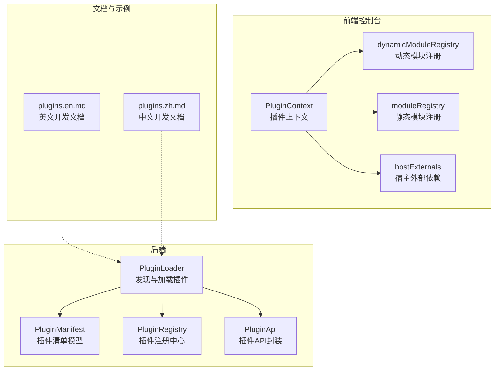
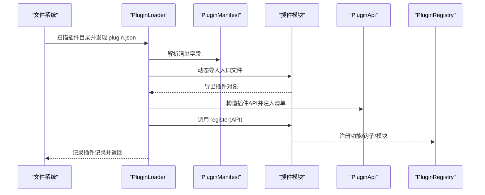
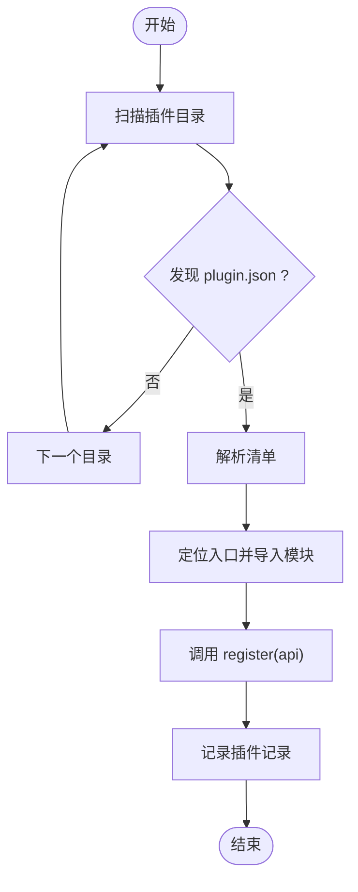
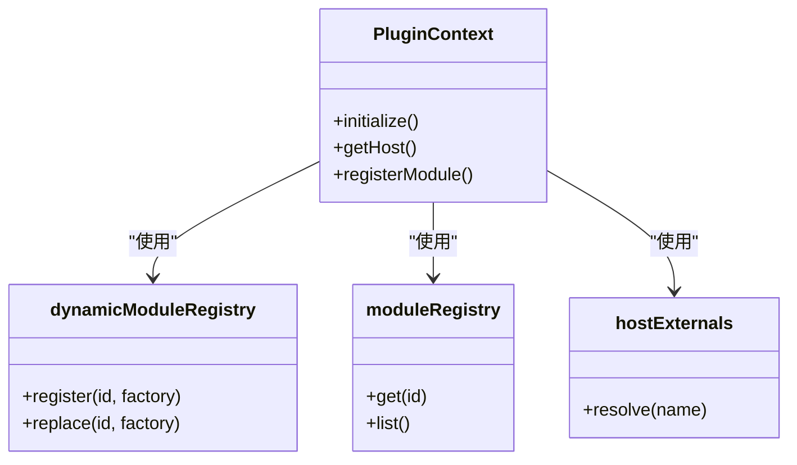
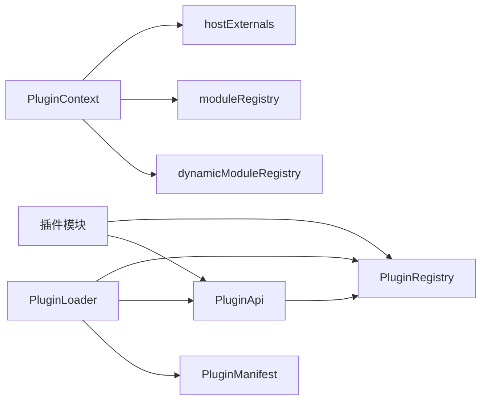

# 插件开发流程

<cite>
**本文引用的文件**
- [loader.py](file://src/qwenpaw/plugins/loader.py)
- [architecture.py](file://src/qwenpaw/plugins/architecture.py)
- [plugin_commands.py](file://src/qwenpaw/cli/plugin_commands.py)
- [plugins.en.md](file://website/public/docs/plugins.en.md)
- [plugins.zh.md](file://website/public/docs/plugins.zh.md)
- [index.tsx](file://console/src/plugins/PluginContext.tsx)
- [dynamicModuleRegistry.ts](file://console/src/plugins/dynamicModuleRegistry.ts)
- [moduleRegistry.ts](file://console/src/plugins/moduleRegistry.ts)
- [hostExternals.ts](file://console/src/plugins/hostExternals.ts)
</cite>

## 目录
1. [简介](#简介)
2. [项目结构](#项目结构)
3. [核心组件](#核心组件)
4. [架构总览](#架构总览)
5. [详细组件分析](#详细组件分析)
6. [依赖分析](#依赖分析)
7. [性能考虑](#性能考虑)
8. [故障排查指南](#故障排查指南)
9. [结论](#结论)
10. [附录](#附录)

## 简介
本指南面向希望在 QwenPaw 平台上开发插件的开发者，覆盖从项目初始化、开发环境搭建、插件清单（Manifest）编写、加载与注册机制、生命周期管理，到最终打包与发布的完整流程。同时提供开发调试技巧、热重载机制与测试策略，并给出可复用的开发模板与脚手架使用方法，帮助开发者从零开始高效构建高质量插件。

## 项目结构
QwenPaw 的插件体系由后端 Python 加载器、前端控制台插件运行时以及官方文档示例三部分组成：
- 后端：负责扫描插件目录、解析 plugin.json、动态导入插件模块并调用其注册接口
- 前端：提供插件上下文、动态模块注册表与宿主外部依赖映射，支持插件在浏览器环境中运行
- 文档：提供插件开发示例、清单字段说明与构建安装步骤

**图表来源**
- [loader.py:19-271](file://src/qwenpaw/plugins/loader.py#L19-L271)
- [architecture.py:9-69](file://src/qwenpaw/plugins/architecture.py#L9-L69)
- [PluginContext.tsx](file://console/src/plugins/PluginContext.tsx)
- [dynamicModuleRegistry.ts](file://console/src/plugins/dynamicModuleRegistry.ts)
- [moduleRegistry.ts](file://console/src/plugins/moduleRegistry.ts)
- [hostExternals.ts](file://console/src/plugins/hostExternals.ts)
- [plugins.en.md:723-917](file://website/public/docs/plugins.en.md#L723-L917)
- [plugins.zh.md:726-901](file://website/public/docs/plugins.zh.md#L726-L901)

**章节来源**
- [loader.py:19-271](file://src/qwenpaw/plugins/loader.py#L19-L271)
- [architecture.py:9-69](file://src/qwenpaw/plugins/architecture.py#L9-L69)
- [plugins.en.md:723-917](file://website/public/docs/plugins.en.md#L723-L917)
- [plugins.zh.md:726-901](file://website/public/docs/plugins.zh.md#L726-L901)

## 核心组件
- 插件清单（Manifest）：定义插件标识、名称、版本、描述、作者、入口点、依赖、最低兼容版本与元数据等字段
- 插件加载器（PluginLoader）：扫描插件目录、解析 plugin.json、动态导入插件模块并调用其 register(api) 方法完成注册
- 插件记录（PluginRecord）：记录已加载插件的清单、源路径、启用状态、实例与诊断信息
- 插件 API（PluginApi）：向插件暴露安全可控的 API 接口，传递插件 ID、配置与清单信息，并设置注册中心
- 前端插件运行时：提供插件上下文、动态模块注册与宿主外部依赖映射，支持插件在浏览器中运行

**章节来源**
- [architecture.py:9-69](file://src/qwenpaw/plugins/architecture.py#L9-L69)
- [loader.py:19-271](file://src/qwenpaw/plugins/loader.py#L19-L271)

## 架构总览
下图展示了插件从发现到注册的端到端流程，包括后端加载器、清单解析、模块导入与注册回调调用。

**图表来源**
- [loader.py:32-228](file://src/qwenpaw/plugins/loader.py#L32-L228)
- [architecture.py:31-69](file://src/qwenpaw/plugins/architecture.py#L31-L69)

**章节来源**
- [loader.py:32-228](file://src/qwenpaw/plugins/loader.py#L32-L228)

## 详细组件分析

### 插件清单（Manifest）结构与字段
- 必需字段
  - id：插件唯一标识符
  - name：插件显示名称
  - version：插件版本号
- 可选字段
  - description：插件描述
  - author：作者信息
  - entry：入口点配置，包含 frontend 与 backend 两个子字段
  - dependencies：依赖声明
  - min_version：最低兼容版本
  - meta：扩展元数据
- 兼容性
  - 支持新的 entry.frontend/entry.backend 结构，也兼容旧版 entry_point（默认指向 plugin.py）

清单字段校验与错误处理由 CLI 命令辅助完成，确保插件安装前的基础完整性。

**章节来源**
- [architecture.py:17-46](file://src/qwenpaw/plugins/architecture.py#L17-L46)
- [plugin_commands.py:398-426](file://src/qwenpaw/cli/plugin_commands.py#L398-L426)

### 插件加载器（PluginLoader）
- 发现阶段：遍历插件目录，定位每个子目录下的 plugin.json 并解析为清单对象
- 加载阶段：根据清单中的入口点定位并动态导入插件模块；若未声明任何入口点则抛出异常
- 注册阶段：构造 PluginApi 实例并传入插件，调用插件对象的 register(api) 方法；支持同步与异步
- 缓存与重复加载：对已加载插件进行去重，避免重复注册
- 错误处理：捕获文件不存在、模块导出缺失、注册失败等异常并记录日志

**图表来源**
- [loader.py:32-228](file://src/qwenpaw/plugins/loader.py#L32-L228)

**章节来源**
- [loader.py:32-228](file://src/qwenpaw/plugins/loader.py#L32-L228)

### 插件 API（PluginApi）
- 提供插件访问平台能力的安全通道，包含插件 ID、配置与清单信息
- 设置注册中心以便插件注册功能或模块
- 作为 register(api) 回调的参数传递给插件

**章节来源**
- [loader.py:184-196](file://src/qwenpaw/plugins/loader.py#L184-L196)

### 前端插件运行时
- 插件上下文（PluginContext）：为插件提供统一的运行环境与共享状态
- 动态模块注册（dynamicModuleRegistry）：允许插件在运行时注册模块或替换现有模块
- 静态模块注册（moduleRegistry）：维护平台内置模块的注册表
- 宿主外部依赖（hostExternals）：映射宿主提供的外部库（如 React、Ant Design），避免打包冲突

**图表来源**
- [PluginContext.tsx](file://console/src/plugins/PluginContext.tsx)
- [dynamicModuleRegistry.ts](file://console/src/plugins/dynamicModuleRegistry.ts)
- [moduleRegistry.ts](file://console/src/plugins/moduleRegistry.ts)
- [hostExternals.ts](file://console/src/plugins/hostExternals.ts)

**章节来源**
- [PluginContext.tsx](file://console/src/plugins/PluginContext.tsx)
- [dynamicModuleRegistry.ts](file://console/src/plugins/dynamicModuleRegistry.ts)
- [moduleRegistry.ts](file://console/src/plugins/moduleRegistry.ts)
- [hostExternals.ts](file://console/src/plugins/hostExternals.ts)

### 开发调试与热重载
- 前端热重载：通过 Vite 的开发服务器实现模块热替换，修改插件源码后可即时生效
- 日志与诊断：后端加载器记录插件发现、导入与注册过程的日志，便于定位问题
- CLI 校验：在安装前验证 plugin.json 的合法性与入口文件存在性，减少运行期错误

**章节来源**
- [loader.py:16-16](file://src/qwenpaw/plugins/loader.py#L16-L16)
- [plugin_commands.py:398-426](file://src/qwenpaw/cli/plugin_commands.py#L398-L426)

### 测试策略
- 单元测试：针对插件注册逻辑、清单解析与模块导入进行断言
- 集成测试：模拟插件加载与注册流程，验证前后端协作
- 端到端测试：在真实应用启动场景下验证插件功能可用性

**章节来源**
- [tests/](file://tests/)

## 依赖分析
- 后端依赖关系
  - PluginLoader 依赖 PluginManifest、PluginApi 与 PluginRegistry
  - 插件模块通过 register(api) 与注册中心交互
- 前端依赖关系
  - 插件运行时依赖宿主外部依赖映射与模块注册表
  - 插件可通过动态模块注册替换或增强平台功能

**图表来源**
- [loader.py:19-271](file://src/qwenpaw/plugins/loader.py#L19-L271)
- [architecture.py:9-69](file://src/qwenpaw/plugins/architecture.py#L9-L69)
- [PluginContext.tsx](file://console/src/plugins/PluginContext.tsx)
- [dynamicModuleRegistry.ts](file://console/src/plugins/dynamicModuleRegistry.ts)
- [moduleRegistry.ts](file://console/src/plugins/moduleRegistry.ts)
- [hostExternals.ts](file://console/src/plugins/hostExternals.ts)

**章节来源**
- [loader.py:19-271](file://src/qwenpaw/plugins/loader.py#L19-L271)
- [architecture.py:9-69](file://src/qwenpaw/plugins/architecture.py#L9-L69)

## 性能考虑
- 插件发现与加载应避免在主线程阻塞，建议在后台线程或异步任务中执行
- 动态导入模块时尽量按需加载，减少初始启动时间
- 前端插件应避免引入过大的第三方依赖，优先使用宿主提供的外部依赖以降低包体积
- 对于频繁更新的插件，合理利用缓存与增量更新策略

## 故障排查指南
- 清单解析失败
  - 症状：plugin.json 无法被解析或缺少必需字段
  - 处理：检查清单字段是否符合要求，参考 CLI 校验输出
- 入口文件缺失
  - 症状：声明了入口但对应文件不存在
  - 处理：确认 entry.frontend 或 entry.backend 指向的文件路径正确
- 注册方法缺失
  - 症状：插件模块未导出 register(api) 方法
  - 处理：确保插件入口导出包含 register(api) 的对象或类
- 重复加载
  - 症状：同一插件多次加载导致冲突
  - 处理：检查插件 ID 是否唯一，避免重复安装

**章节来源**
- [plugin_commands.py:398-426](file://src/qwenpaw/cli/plugin_commands.py#L398-L426)
- [loader.py:100-108](file://src/qwenpaw/plugins/loader.py#L100-L108)

## 结论
通过本文档，开发者可以系统地掌握 QwenPaw 插件的开发与发布流程。从清单字段的规范编写，到后端加载器与前端运行时的协作机制，再到调试与测试策略，均提供了清晰的指导。建议在开发过程中遵循清单字段规范、充分利用 CLI 校验与日志诊断，并结合热重载提升迭代效率。

## 附录

### 插件项目标准目录结构
- 插件根目录
  - plugin.json：插件清单
  - backend 入口（可选）：例如 plugin.py
  - frontend 入口（可选）：例如 dist/index.js
  - requirements.txt（可选）：Python 依赖
- 建议的文件组织
  - 将前端源码置于 src/，构建产物置于 dist/，保持结构清晰
  - 在插件根目录放置最小可运行的示例与文档

**章节来源**
- [plugins.en.md:723-751](file://website/public/docs/plugins.en.md#L723-L751)
- [plugins.zh.md:726-752](file://website/public/docs/plugins.zh.md#L726-L752)

### 开发模板与脚手架使用
- 使用官方文档中的示例作为起点，逐步完善插件功能
- 前端构建采用 Vite，输出 ES 模块格式并与宿主外部依赖保持一致
- 安装与验证：构建完成后复制到用户插件目录并使用 CLI 进行验证

**章节来源**
- [plugins.en.md:723-751](file://website/public/docs/plugins.en.md#L723-L751)
- [plugins.en.md:723-917](file://website/public/docs/plugins.en.md#L723-L917)
- [plugins.zh.md:726-752](file://website/public/docs/plugins.zh.md#L726-L752)
- [plugins.zh.md:726-901](file://website/public/docs/plugins.zh.md#L726-L901)