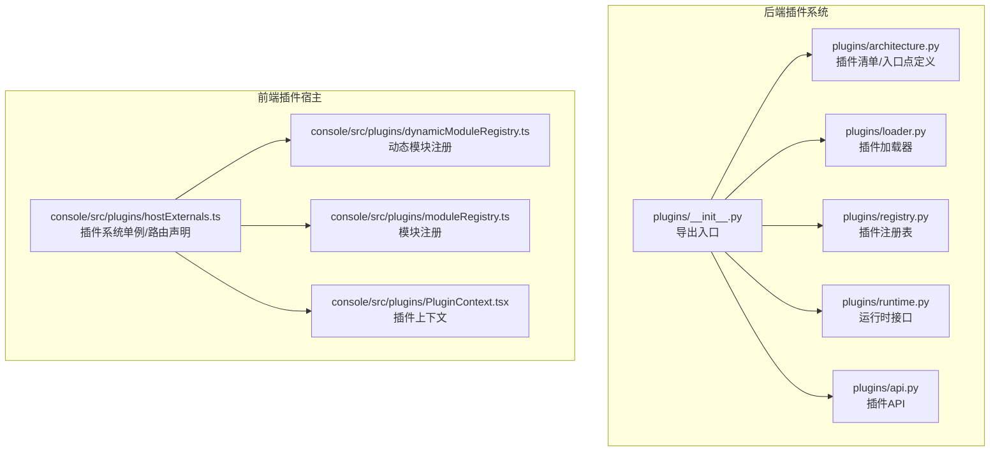
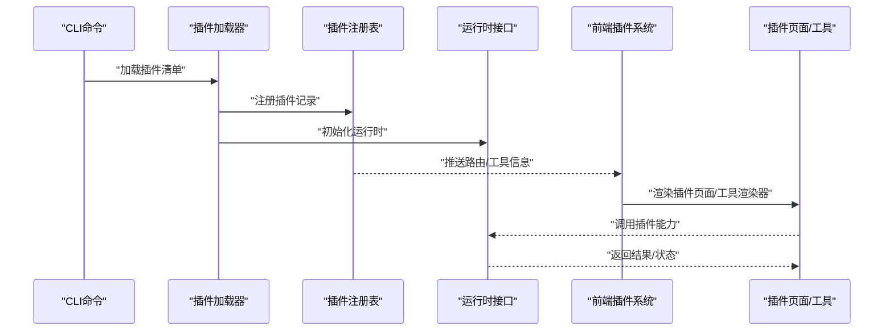
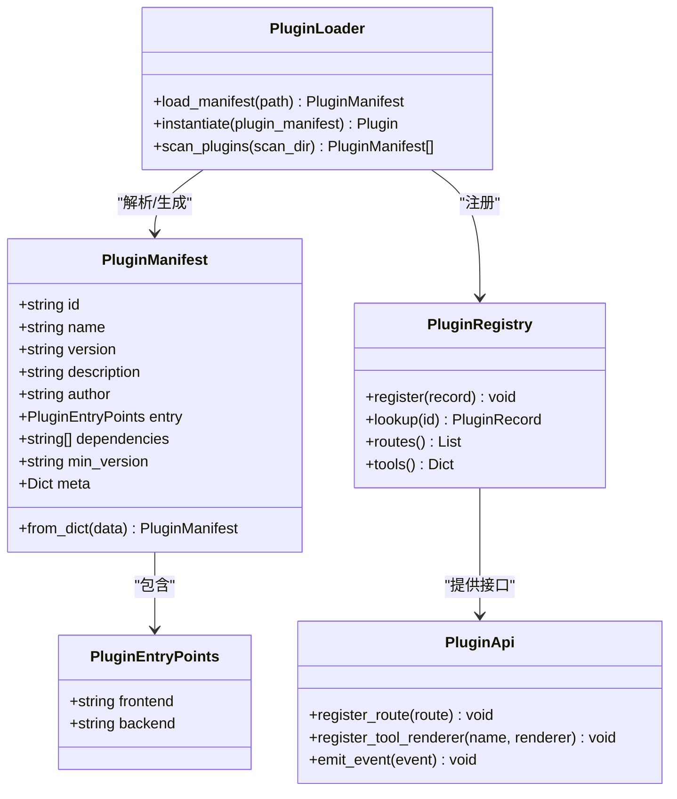
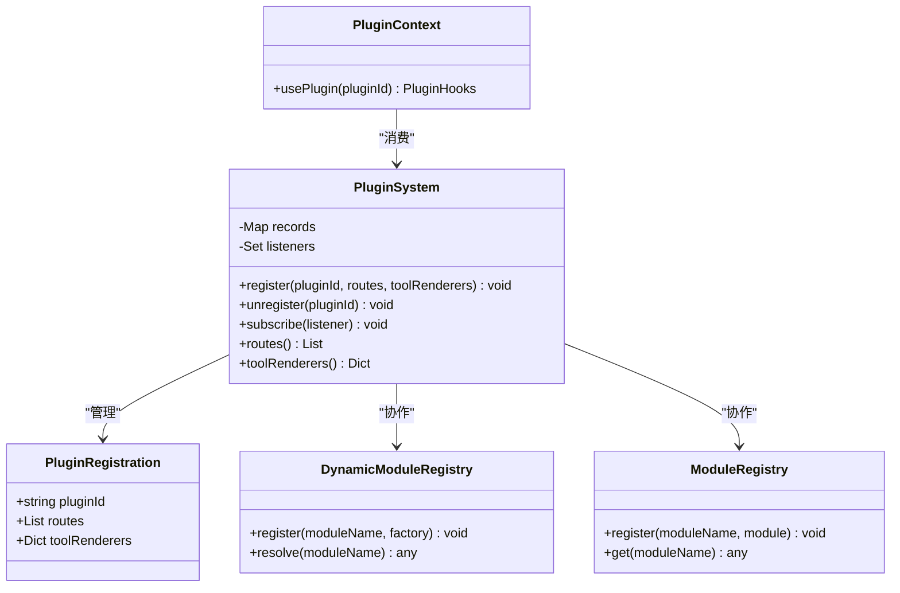
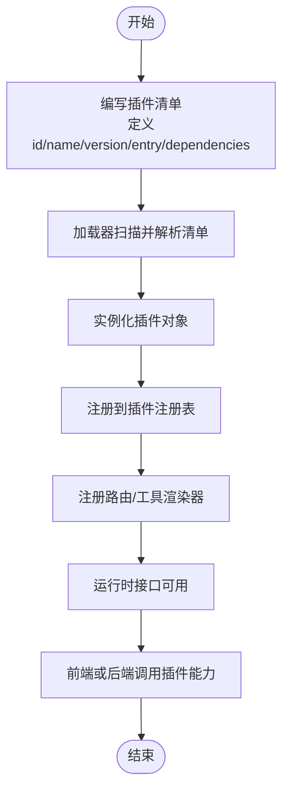
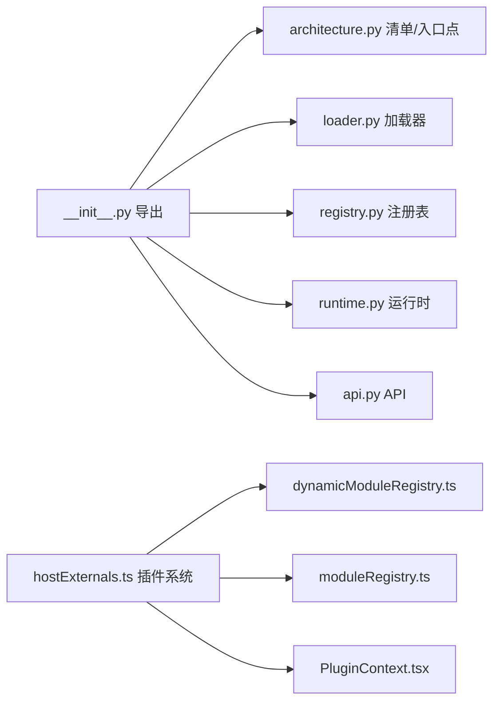

# 插件示例与最佳实践

<cite>
**本文引用的文件**
- [src/qwenpaw/plugins/__init__.py](file://src/qwenpaw/plugins/__init__.py)
- [src/qwenpaw/plugins/architecture.py](file://src/qwenpaw/plugins/architecture.py)
- [src/qwenpaw/plugins/loader.py](file://src/qwenpaw/plugins/loader.py)
- [src/qwenpaw/plugins/registry.py](file://src/qwenpaw/plugins/registry.py)
- [src/qwenpaw/plugins/runtime.py](file://src/qwenpaw/plugins/runtime.py)
- [src/qwenpaw/plugins/api.py](file://src/qwenpaw/plugins/api.py)
- [console/src/plugins/hostExternals.ts](file://console/src/plugins/hostExternals.ts)
- [console/src/plugins/dynamicModuleRegistry.ts](file://console/src/plugins/dynamicModuleRegistry.ts)
- [console/src/plugins/moduleRegistry.ts](file://console/src/plugins/moduleRegistry.ts)
- [console/src/plugins/PluginContext.tsx](file://console/src/plugins/PluginContext.tsx)
- [src/qwenpaw/cli/plugin_commands.py](file://src/qwenpaw/cli/plugin_commands.py)
- [website/public/docs/plugins.zh.md](file://website/public/docs/plugins.zh.md)
- [tests/unit/plugins/test_plugin_api.py](file://tests/unit/plugins/test_plugin_api.py)
- [tests/unit/plugins/test_plugin_loader.py](file://tests/unit/plugins/test_plugin_loader.py)
- [tests/unit/plugins/test_plugin_registry.py](file://tests/unit/plugins/test_plugin_registry.py)
</cite>

## 目录
1. [简介](#简介)
2. [项目结构](#项目结构)
3. [核心组件](#核心组件)
4. [架构总览](#架构总览)
5. [详细组件分析](#详细组件分析)
6. [依赖关系分析](#依赖关系分析)
7. [性能考虑](#性能考虑)
8. [故障排查指南](#故障排查指南)
9. [结论](#结论)
10. [附录](#附录)

## 简介
本指南面向希望在QwenPaw平台上开发插件的开发者，提供从架构设计、代码组织到测试、发布与维护的全流程实践。通过解析后端插件系统与前端插件宿主的实现，结合单元测试与官方文档，帮助你快速构建简单插件、复杂功能插件以及集成第三方服务的插件案例，并掌握性能优化与兼容性保障的最佳实践。

## 项目结构
QwenPaw的插件体系由“后端插件系统”和“前端插件宿主”两部分组成：
- 后端：定义插件清单、加载器、注册表与运行时接口，负责插件生命周期管理与能力暴露。
- 前端：提供插件路由、动态模块注册、上下文与外部化机制，支持插件页面与工具渲染器注入。

**图表来源**
- [src/qwenpaw/plugins/__init__.py:1-15](file://src/qwenpaw/plugins/__init__.py#L1-L15)
- [src/qwenpaw/plugins/architecture.py:1-46](file://src/qwenpaw/plugins/architecture.py#L1-L46)
- [console/src/plugins/hostExternals.ts:34-61](file://console/src/plugins/hostExternals.ts#L34-L61)

**章节来源**
- [src/qwenpaw/plugins/__init__.py:1-15](file://src/qwenpaw/plugins/__init__.py#L1-L15)
- [console/src/plugins/hostExternals.ts:34-61](file://console/src/plugins/hostExternals.ts#L34-L61)

## 核心组件
- 插件清单与入口点：用于描述插件元数据、版本、依赖与前后端入口。
- 插件加载器：负责扫描、解析清单、实例化插件并建立运行时连接。
- 插件注册表：集中管理已加载插件的状态、路由与工具渲染器。
- 运行时接口：提供插件与核心系统的交互契约（如事件、钩子、工具注册）。
- 前端插件系统：提供路由声明、动态模块注册、上下文与外部化机制，支撑插件UI与工具注入。

**章节来源**
- [src/qwenpaw/plugins/architecture.py:9-46](file://src/qwenpaw/plugins/architecture.py#L9-L46)
- [src/qwenpaw/plugins/loader.py](file://src/qwenpaw/plugins/loader.py)
- [src/qwenpaw/plugins/registry.py](file://src/qwenpaw/plugins/registry.py)
- [src/qwenpaw/plugins/runtime.py](file://src/qwenpaw/plugins/runtime.py)
- [console/src/plugins/hostExternals.ts:34-61](file://console/src/plugins/hostExternals.ts#L34-L61)

## 架构总览
下图展示了插件从加载到运行的关键交互路径，涵盖后端插件系统与前端插件宿主的协作。

**图表来源**
- [src/qwenpaw/cli/plugin_commands.py](file://src/qwenpaw/cli/plugin_commands.py)
- [src/qwenpaw/plugins/loader.py](file://src/qwenpaw/plugins/loader.py)
- [src/qwenpaw/plugins/registry.py](file://src/qwenpaw/plugins/registry.py)
- [src/qwenpaw/plugins/runtime.py](file://src/qwenpaw/plugins/runtime.py)
- [console/src/plugins/hostExternals.ts:34-61](file://console/src/plugins/hostExternals.ts#L34-L61)

## 详细组件分析

### 后端插件系统（Python）
后端插件系统围绕清单、加载、注册与运行时展开，提供统一的插件生命周期管理与能力暴露接口。

**图表来源**
- [src/qwenpaw/plugins/architecture.py:9-46](file://src/qwenpaw/plugins/architecture.py#L9-L46)
- [src/qwenpaw/plugins/loader.py](file://src/qwenpaw/plugins/loader.py)
- [src/qwenpaw/plugins/registry.py](file://src/qwenpaw/plugins/registry.py)
- [src/qwenpaw/plugins/api.py](file://src/qwenpaw/plugins/api.py)

**章节来源**
- [src/qwenpaw/plugins/architecture.py:9-46](file://src/qwenpaw/plugins/architecture.py#L9-L46)
- [src/qwenpaw/plugins/loader.py](file://src/qwenpaw/plugins/loader.py)
- [src/qwenpaw/plugins/registry.py](file://src/qwenpaw/plugins/registry.py)
- [src/qwenpaw/plugins/api.py](file://src/qwenpaw/plugins/api.py)

### 前端插件宿主（TypeScript/React）
前端插件宿主通过“插件系统单例”管理插件路由与工具渲染器，并提供动态模块注册与上下文支持。

**图表来源**
- [console/src/plugins/hostExternals.ts:34-61](file://console/src/plugins/hostExternals.ts#L34-L61)
- [console/src/plugins/dynamicModuleRegistry.ts](file://console/src/plugins/dynamicModuleRegistry.ts)
- [console/src/plugins/moduleRegistry.ts](file://console/src/plugins/moduleRegistry.ts)
- [console/src/plugins/PluginContext.tsx](file://console/src/plugins/PluginContext.tsx)

**章节来源**
- [console/src/plugins/hostExternals.ts:34-61](file://console/src/plugins/hostExternals.ts#L34-L61)
- [console/src/plugins/dynamicModuleRegistry.ts](file://console/src/plugins/dynamicModuleRegistry.ts)
- [console/src/plugins/moduleRegistry.ts](file://console/src/plugins/moduleRegistry.ts)
- [console/src/plugins/PluginContext.tsx](file://console/src/plugins/PluginContext.tsx)

### 典型插件开发流程（后端）
以下流程图展示了从清单编写到运行时调用的典型步骤，适用于简单与复杂功能插件。

**图表来源**
- [src/qwenpaw/plugins/architecture.py:9-46](file://src/qwenpaw/plugins/architecture.py#L9-L46)
- [src/qwenpaw/plugins/loader.py](file://src/qwenpaw/plugins/loader.py)
- [src/qwenpaw/plugins/registry.py](file://src/qwenpaw/plugins/registry.py)
- [src/qwenpaw/plugins/api.py](file://src/qwenpaw/plugins/api.py)

## 依赖关系分析
- 后端依赖：插件系统通过统一入口导出核心类，加载器依赖清单解析，注册表依赖运行时接口，API提供路由与工具注册能力。
- 前端依赖：插件系统单例依赖动态模块注册与模块注册，上下文依赖系统提供的hooks以访问插件能力。

**图表来源**
- [src/qwenpaw/plugins/__init__.py:1-15](file://src/qwenpaw/plugins/__init__.py#L1-L15)
- [src/qwenpaw/plugins/architecture.py:9-46](file://src/qwenpaw/plugins/architecture.py#L9-L46)
- [console/src/plugins/hostExternals.ts:34-61](file://console/src/plugins/hostExternals.ts#L34-L61)

**章节来源**
- [src/qwenpaw/plugins/__init__.py:1-15](file://src/qwenpaw/plugins/__init__.py#L1-L15)
- [console/src/plugins/hostExternals.ts:34-61](file://console/src/plugins/hostExternals.ts#L34-L61)

## 性能考虑
- 清单解析与缓存：对插件清单进行本地缓存，避免重复解析；仅在清单变更时重新加载。
- 动态模块注册：按需注册模块工厂，减少初始内存占用；延迟初始化重型资源。
- 路由与工具渲染器：优先使用轻量级渲染器；对高频调用的工具进行结果缓存与去重。
- 并发与异步：插件加载与注册采用异步策略，避免阻塞主线程；对I/O密集型操作使用并发限制。
- 内存管理：插件卸载时清理监听器、定时器与缓存；确保无循环引用导致的泄漏。

## 故障排查指南
- 清单校验失败：检查清单字段完整性与版本兼容性；确认入口点路径正确。
- 加载异常：查看加载器日志，定位具体插件路径与权限问题；验证依赖是否满足。
- 注册冲突：检查插件ID唯一性与路由冲突；核对工具渲染器命名空间。
- 运行时错误：通过运行时接口捕获异常并上报；记录事件与参数以便复现。
- 前端渲染问题：确认路由声明与组件注册；检查动态模块工厂是否可解析。

**章节来源**
- [tests/unit/plugins/test_plugin_api.py](file://tests/unit/plugins/test_plugin_api.py)
- [tests/unit/plugins/test_plugin_loader.py](file://tests/unit/plugins/test_plugin_loader.py)
- [tests/unit/plugins/test_plugin_registry.py](file://tests/unit/plugins/test_plugin_registry.py)

## 结论
QwenPaw的插件体系通过清晰的清单定义、可靠的加载与注册机制、灵活的运行时接口以及前端动态渲染能力，为开发者提供了强大的扩展平台。遵循本文档的架构原则、代码组织模式与最佳实践，可以高效地构建从简单到复杂的各类插件，并确保其在生产环境中的稳定性与可维护性。

## 附录

### 示例与最佳实践清单
- 简单插件：最小化清单字段，仅注册必要路由与工具渲染器；避免重型初始化。
- 复杂功能插件：拆分模块与工厂，使用动态注册；提供配置项与状态管理；实现事件驱动与钩子扩展。
- 集成第三方服务：封装HTTP客户端与认证；实现重试与熔断；记录调用量与错误率。
- 文档与版本：在网站文档中补充插件说明与变更日志；严格遵循语义化版本与兼容性矩阵。
- 发布与分发：通过CLI命令打包与安装；提供自动化测试与质量门禁；持续监控与回滚策略。

**章节来源**
- [website/public/docs/plugins.zh.md](file://website/public/docs/plugins.zh.md)
- [src/qwenpaw/cli/plugin_commands.py](file://src/qwenpaw/cli/plugin_commands.py)