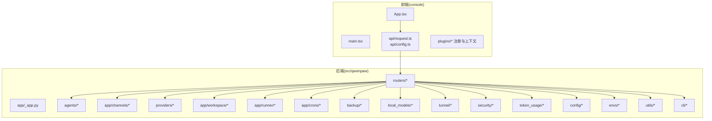
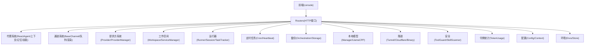
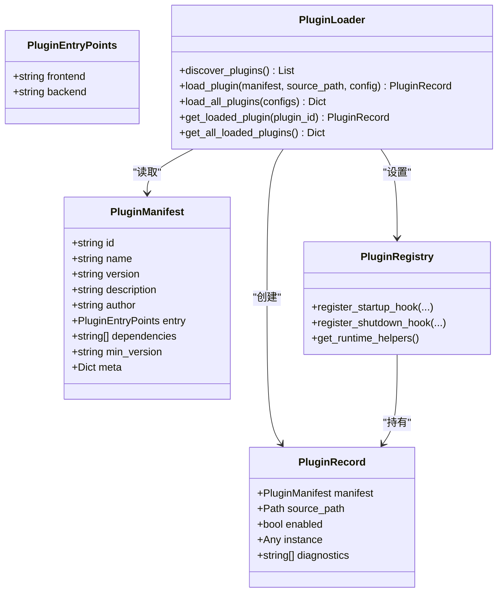
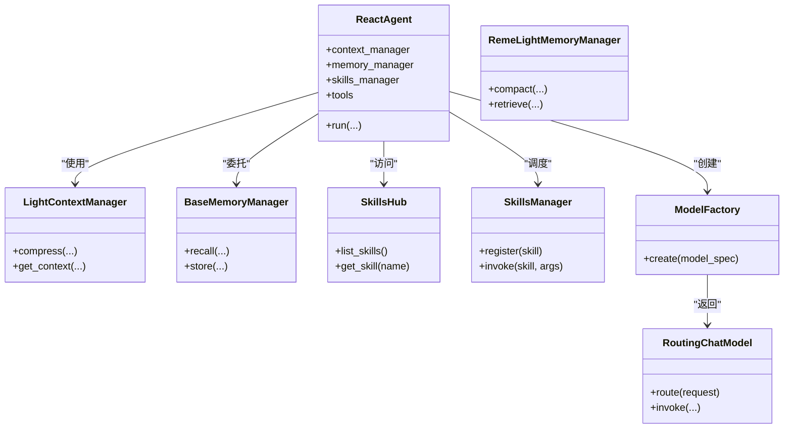
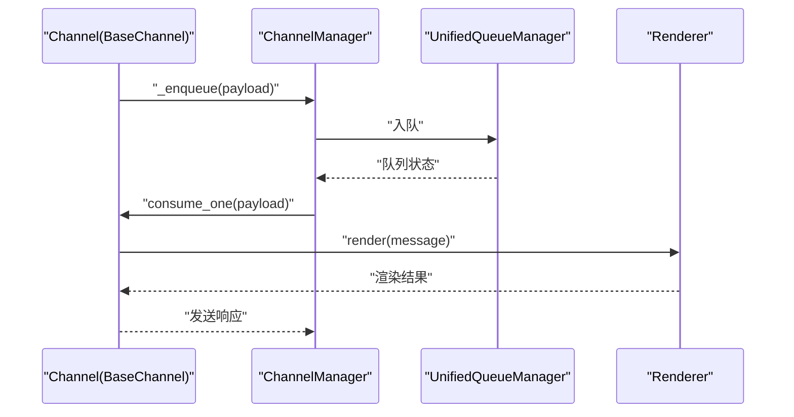
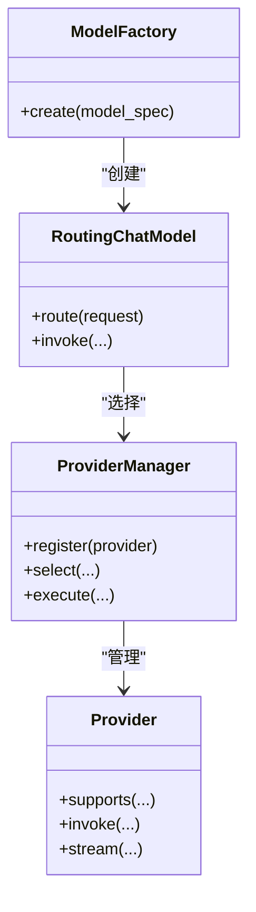
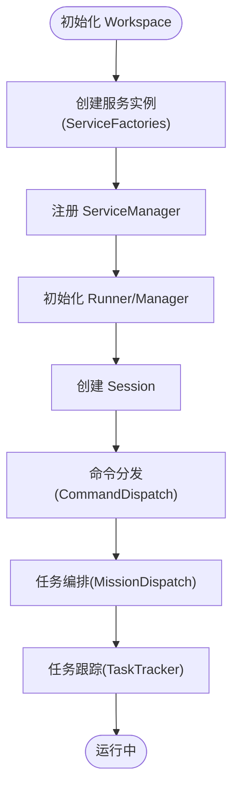
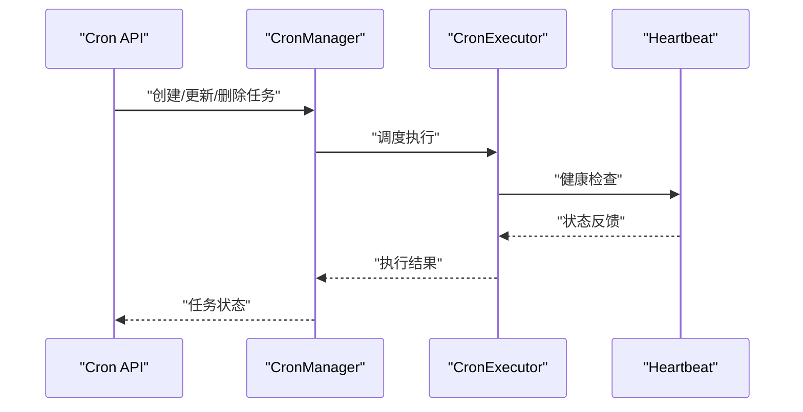
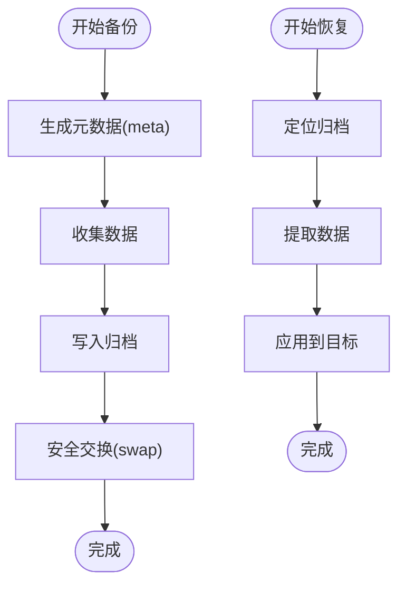
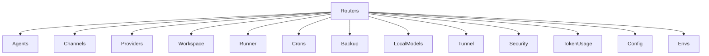

# 架构设计

<cite>
**本文引用的文件**
- [src/qwenpaw/plugins/__init__.py](file://src/qwenpaw/plugins/__init__.py)
- [src/qwenpaw/plugins/architecture.py](file://src/qwenpaw/plugins/architecture.py)
- [src/qwenpaw/plugins/loader.py](file://src/qwenpaw/plugins/loader.py)
- [src/qwenpaw/plugins/registry.py](file://src/qwenpaw/plugins/registry.py)
- [src/qwenpaw/app/channels/base.py](file://src/qwenpaw/app/channels/base.py)
- [src/qwenpaw/app/channels/manager.py](file://src/qwenpaw/app/channels/manager.py)
- [src/qwenpaw/app/channels/unified_queue_manager.py](file://src/qwenpaw/app/channels/unified_queue_manager.py)
- [src/qwenpaw/app/channels/renderer.py](file://src/qwenpaw/app/channels/renderer.py)
- [src/qwenpaw/app/channels/command_registry.py](file://src/qwenpaw/app/channels/command_registry.py)
- [src/qwenpaw/app/channels/utils.py](file://src/qwenpaw/app/channels/utils.py)
- [src/qwenpaw/providers/provider_manager.py](file://src/qwenpaw/providers/provider_manager.py)
- [src/qwenpaw/providers/provider.py](file://src/qwenpaw/providers/provider.py)
- [src/qwenpaw/app/workspace/workspace.py](file://src/qwenpaw/app/workspace/workspace.py)
- [src/qwenpaw/app/workspace/service_manager.py](file://src/qwenpaw/app/workspace/service_manager.py)
- [src/qwenpaw/app/workspace/service_factories.py](file://src/qwenpaw/app/workspace/service_factories.py)
- [src/qwenpaw/agents/react_agent.py](file://src/qwenpaw/agents/react_agent.py)
- [src/qwenpaw/agents/model_factory.py](file://src/qwenpaw/agents/model_factory.py)
- [src/qwenpaw/agents/routing_chat_model.py](file://src/qwenpaw/agents/routing_chat_model.py)
- [src/qwenpaw/agents/context/base_context_manager.py](file://src/qwenpaw/agents/context/base_context_manager.py)
- [src/qwenpaw/agents/context/light_context_manager.py](file://src/qwenpaw/agents/context/light_context_manager.py)
- [src/qwenpaw/agents/memory/base_memory_manager.py](file://src/qwenpaw/agents/memory/base_memory_manager.py)
- [src/qwenpaw/agents/memory/reme_light_memory_manager.py](file://src/qwenpaw/agents/memory/reme_light_memory_manager.py)
- [src/qwenpaw/agents/skills_hub.py](file://src/qwenpaw/agents/skills_hub.py)
- [src/qwenpaw/agents/skills_manager.py](file://src/qwenpaw/agents/skills_manager.py)
- [src/qwenpaw/agents/tools/agent_management.py](file://src/qwenpaw/agents/tools/agent_management.py)
- [src/qwenpaw/agents/tools/browser_control.py](file://src/qwenpaw/agents/tools/browser_control.py)
- [src/qwenpaw/agents/tools/shell.py](file://src/qwenpaw/agents/tools/shell.py)
- [src/qwenpaw/agents/utils/message_processing.py](file://src/qwenpaw/agents/utils/message_processing.py)
- [src/qwenpaw/agents/utils/message_request_normalizer.py](file://src/qwenpaw/agents/utils/message_request_normalizer.py)
- [src/qwenpaw/agents/utils/token_counter.py](file://src/qwenpaw/agents/utils/token_counter.py)
- [src/qwenpaw/agents/utils/setup_utils.py](file://src/qwenpaw/agents/utils/setup_utils.py)
- [src/qwenpaw/agents/utils/registry.py](file://src/qwenpaw/agents/utils/registry.py)
- [src/qwenpaw/app/mcp/manager.py](file://src/qwenpaw/app/mcp/manager.py)
- [src/qwenpaw/app/mcp/stateful_client.py](file://src/qwenpaw/app/mcp/stateful_client.py)
- [src/qwenpaw/app/mcp/watcher.py](file://src/qwenpaw/app/mcp/watcher.py)
- [src/qwenpaw/app/runner/manager.py](file://src/qwenpaw/app/runner/manager.py)
- [src/qwenpaw/app/runner/runner.py](file://src/qwenpaw/app/runner/runner.py)
- [src/qwenpaw/app/runner/session.py](file://src/qwenpaw/app/runner/session.py)
- [src/qwenpaw/app/runner/models.py](file://src/qwenpaw/app/runner/models.py)
- [src/qwenpaw/app/runner/command_dispatch.py](file://src/qwenpaw/app/runner/command_dispatch.py)
- [src/qwenpaw/app/runner/mission_dispatch.py](file://src/qwenpaw/app/runner/mission_dispatch.py)
- [src/qwenpaw/app/runner/task_tracker.py](file://src/qwenpaw/app/runner/task_tracker.py)
- [src/qwenpaw/app/crons/manager.py](file://src/qwenpaw/app/crons/manager.py)
- [src/qwenpaw/app/crons/heartbeat.py](file://src/qwenpaw/app/crons/heartbeat.py)
- [src/qwenpaw/app/crons/models.py](file://src/qwenpaw/app/crons/models.py)
- [src/qwenpaw/app/crons/executor.py](file://src/qwenpaw/app/crons/executor.py)
- [src/qwenpaw/app/crons/api.py](file://src/qwenpaw/app/crons/api.py)
- [src/qwenpaw/app/routers/agent.py](file://src/qwenpaw/app/routers/agent.py)
- [src/qwenpaw/app/routers/messages.py](file://src/qwenpaw/app/routers/messages.py)
- [src/qwenpaw/app/routers/console.py](file://src/qwenpaw/app/routers/console.py)
- [src/qwenpaw/app/routers/config.py](file://src/qwenpaw/app/routers/config.py)
- [src/qwenpaw/app/routers/skills.py](file://src/qwenpaw/app/routers/skills.py)
- [src/qwenpaw/app/routers/skills_stream.py](file://src/qwenpaw/app/routers/skills_stream.py)
- [src/qwenpaw/app/routers/plugins.py](file://src/qwenpaw/app/routers/plugins.py)
- [src/qwenpaw/app/routers/providers.py](file://src/qwenpaw/app/routers/providers.py)
- [src/qwenpaw/app/routers/local_models.py](file://src/qwenpaw/app/routers/local_models.py)
- [src/qwenpaw/app/routers/mcp.py](file://src/qwenpaw/app/routers/mcp.py)
- [src/qwenpaw/app/routers/agents.py](file://src/qwenpaw/app/routers/agents.py)
- [src/qwenpaw/app/routers/backup.py](file://src/qwenpaw/app/routers/backup.py)
- [src/qwenpaw/app/routers/settings.py](file://src/qwenpaw/app/routers/settings.py)
- [src/qwenpaw/app/routers/token_usage.py](file://src/qwenpaw/app/routers/token_usage.py)
- [src/qwenpaw/app/routers/tools.py](file://src/qwenpaw/app/routers/tools.py)
- [src/qwenpaw/app/routers/workspace.py](file://src/qwenpaw/app/routers/workspace.py)
- [src/qwenpaw/app/_app.py](file://src/qwenpaw/app/_app.py)
- [src/qwenpaw/app/agent_context.py](file://src/qwenpaw/app/agent_context.py)
- [src/qwenpaw/app/agent_config_watcher.py](file://src/qwenpaw/app/agent_config_watcher.py)
- [src/qwenpaw/app/migration.py](file://src/qwenpaw/app/migration.py)
- [src/qwenpaw/app/multi_agent_manager.py](file://src/qwenpaw/app/multi_agent_manager.py)
- [src/qwenpaw/app/utils.py](file://src/qwenpaw/app/utils.py)
- [src/qwenpaw/backup/orchestration.py](file://src/qwenpaw/backup/orchestration.py)
- [src/qwenpaw/backup/models.py](file://src/qwenpaw/backup/models.py)
- [src/qwenpaw/backup/_ops/create.py](file://src/qwenpaw/backup/_ops/create.py)
- [src/qwenpaw/backup/_ops/restore.py](file://src/qwenpaw/backup/_ops/restore.py)
- [src/qwenpaw/backup/_utils/meta.py](file://src/qwenpaw/backup/_utils/meta.py)
- [src/qwenpaw/backup/_utils/constants.py](file://src/qwenpaw/backup/_utils/constants.py)
- [src/qwenpaw/backup/_utils/safe_swap.py](file://src/qwenpaw/backup/_utils/safe_swap.py)
- [src/qwenpaw/backup/_utils/storage.py](file://src/qwenpaw/backup/_utils/storage.py)
- [src/qwenpaw/local_models/manager.py](file://src/qwenpaw/local_models/manager.py)
- [src/qwenpaw/local_models/model_manager.py](file://src/qwenpaw/local_models/model_manager.py)
- [src/qwenpaw/local_models/download_manager.py](file://src/qwenpaw/local_models/download_manager.py)
- [src/qwenpaw/local_models/llamacpp.py](file://src/qwenpaw/local_models/llamacpp.py)
- [src/qwenpaw/local_models/tag_parser.py](file://src/qwenpaw/local_models/tag_parser.py)
- [src/qwenpaw/tunnel/cloudflare.py](file://src/qwenpaw/tunnel/cloudflare.py)
- [src/qwenpaw/tunnel/binary_manager.py](file://src/qwenpaw/tunnel/binary_manager.py)
- [src/qwenpaw/security/tool_guard/engine.py](file://src/qwenpaw/security/tool_guard/engine.py)
- [src/qwenpaw/security/tool_guard/guardians/__init__.py](file://src/qwenpaw/security/tool_guard/guardians/__init__.py)
- [src/qwenpaw/security/skill_scanner/scanner.py](file://src/qwenpaw/security/skill_scanner/scanner.py)
- [src/qwenpaw/security/skill_scanner/scan_policy.py](file://src/qwenpaw/security/skill_scanner/scan_policy.py)
- [src/qwenpaw/token_usage/manager.py](file://src/qwenpaw/token_usage/manager.py)
- [src/qwenpaw/token_usage/model_wrapper.py](file://src/qwenpaw/token_usage/model_wrapper.py)
- [src/qwenpaw/config/config.py](file://src/qwenpaw/config/config.py)
- [src/qwenpaw/config/context.py](file://src/qwenpaw/config/context.py)
- [src/qwenpaw/envs/store.py](file://src/qwenpaw/envs/store.py)
- [src/qwenpaw/utils/logging.py](file://src/qwenpaw/utils/logging.py)
- [src/qwenpaw/utils/stdio.py](file://src/qwenpaw/utils/stdio.py)
- [src/qwenpaw/utils/system_info.py](file://src/qwenpaw/utils/system_info.py)
- [src/qwenpaw/utils/telemetry.py](file://src/qwenpaw/utils/telemetry.py)
- [src/qwenpaw/utils/command_runner.py](file://src/qwenpaw/utils/command_runner.py)
- [src/qwenpaw/utils/startup_display.py](file://src/qwenpaw/utils/startup_display.py)
- [src/qwenpaw/utils/console_static.py](file://src/qwenpaw/utils/console_static.py)
- [src/qwenpaw/cli/main.py](file://src/qwenpaw/cli/main.py)
- [src/qwenpaw/cli/utils.py](file://src/qwenpaw/cli/utils.py)
- [src/qwenpaw/cli/http.py](file://src/qwenpaw/cli/http.py)
- [src/qwenpaw/constant.py](file://src/qwenpaw/constant.py)
- [src/qwenpaw/exceptions.py](file://src/qwenpaw/exceptions.py)
- [console/src/App.tsx](file://console/src/App.tsx)
- [console/src/main.tsx](file://console/src/main.tsx)
- [console/src/api/request.ts](file://console/src/api/request.ts)
- [console/src/api/config.ts](file://console/src/api/config.ts)
- [console/src/plugins/dynamicModuleRegistry.ts](file://console/src/plugins/dynamicModuleRegistry.ts)
- [console/src/plugins/moduleRegistry.ts](file://console/src/plugins/moduleRegistry.ts)
- [console/src/plugins/hostExternals.ts](file://console/src/plugins/hostExternals.ts)
- [console/src/plugins/PluginContext.tsx](file://console/src/plugins/PluginContext.tsx)
- [website/public/docs/channels.en.md](file://website/public/docs/channels.en.md)
</cite>

## 目录
1. [引言](#引言)
2. [项目结构](#项目结构)
3. [核心组件](#核心组件)
4. [架构总览](#架构总览)
5. [详细组件分析](#详细组件分析)
6. [依赖分析](#依赖分析)
7. [性能考虑](#性能考虑)
8. [故障排查指南](#故障排查指南)
9. [结论](#结论)
10. [附录](#附录)

## 引言
本架构设计文档面向开发者与架构师，系统性阐述 QwenPaw 的整体架构模式、模块划分原则与组件交互关系。项目采用分层架构（表现层、业务层、数据层）与插件化架构相结合的设计，围绕“代理系统、通道管理、模型系统、工作空间与运行器、定时任务与心跳、备份与迁移、本地模型与隧道、安全与令牌统计、配置与环境”等核心子系统展开。文档同时提供系统边界图、组件关系图与数据流图，并对技术决策进行权衡分析，帮助读者快速理解并高效扩展系统。

## 项目结构
QwenPaw 由 Python 后端与 React 前端构成，后端以 src/qwenpaw 为核心包，包含代理、通道、模型、工作空间、运行器、定时任务、备份、本地模型、隧道、安全、令牌统计、配置与环境等子系统；前端位于 console/，通过动态模块注册与宿主外部依赖机制支持插件化扩展。

图表来源
- [console/src/App.tsx](file://console/src/App.tsx)
- [console/src/main.tsx](file://console/src/main.tsx)
- [console/src/api/request.ts](file://console/src/api/request.ts)
- [console/src/api/config.ts](file://console/src/api/config.ts)
- [console/src/plugins/dynamicModuleRegistry.ts](file://console/src/plugins/dynamicModuleRegistry.ts)
- [console/src/plugins/moduleRegistry.ts](file://console/src/plugins/moduleRegistry.ts)
- [console/src/plugins/hostExternals.ts](file://console/src/plugins/hostExternals.ts)
- [console/src/plugins/PluginContext.tsx](file://console/src/plugins/PluginContext.tsx)
- [src/qwenpaw/app/_app.py](file://src/qwenpaw/app/_app.py)
- [src/qwenpaw/app/routers/agent.py](file://src/qwenpaw/app/routers/agent.py)
- [src/qwenpaw/app/routers/messages.py](file://src/qwenpaw/app/routers/messages.py)
- [src/qwenpaw/app/routers/console.py](file://src/qwenpaw/app/routers/console.py)
- [src/qwenpaw/app/routers/config.py](file://src/qwenpaw/app/routers/config.py)
- [src/qwenpaw/app/routers/skills.py](file://src/qwenpaw/app/routers/skills.py)
- [src/qwenpaw/app/routers/skills_stream.py](file://src/qwenpaw/app/routers/skills_stream.py)
- [src/qwenpaw/app/routers/plugins.py](file://src/qwenpaw/app/routers/plugins.py)
- [src/qwenpaw/app/routers/providers.py](file://src/qwenpaw/app/routers/providers.py)
- [src/qwenpaw/app/routers/local_models.py](file://src/qwenpaw/app/routers/local_models.py)
- [src/qwenpaw/app/routers/mcp.py](file://src/qwenpaw/app/routers/mcp.py)
- [src/qwenpaw/app/routers/agents.py](file://src/qwenpaw/app/routers/agents.py)
- [src/qwenpaw/app/routers/backup.py](file://src/qwenpaw/app/routers/backup.py)
- [src/qwenpaw/app/routers/settings.py](file://src/qwenpaw/app/routers/settings.py)
- [src/qwenpaw/app/routers/token_usage.py](file://src/qwenpaw/app/routers/token_usage.py)
- [src/qwenpaw/app/routers/tools.py](file://src/qwenpaw/app/routers/tools.py)
- [src/qwenpaw/app/routers/workspace.py](file://src/qwenpaw/app/routers/workspace.py)

章节来源
- [console/src/App.tsx](file://console/src/App.tsx)
- [console/src/main.tsx](file://console/src/main.tsx)
- [console/src/api/request.ts](file://console/src/api/request.ts)
- [console/src/api/config.ts](file://console/src/api/config.ts)
- [console/src/plugins/dynamicModuleRegistry.ts](file://console/src/plugins/dynamicModuleRegistry.ts)
- [console/src/plugins/moduleRegistry.ts](file://console/src/plugins/moduleRegistry.ts)
- [console/src/plugins/hostExternals.ts](file://console/src/plugins/hostExternals.ts)
- [console/src/plugins/PluginContext.tsx](file://console/src/plugins/PluginContext.tsx)
- [src/qwenpaw/app/_app.py](file://src/qwenpaw/app/_app.py)

## 核心组件
- 插件系统：定义插件清单、记录与加载器，支持前后端入口点、依赖声明与注册回调，提供启动/关闭钩子与运行时辅助。
- 通道系统：抽象 BaseChannel，统一消息入队、消费与渲染，提供统一队列管理与命令注册。
- 模型与提供方：Provider 抽象与 ProviderManager 管理多提供商能力、限流与重试策略，模型工厂负责路由与实例化。
- 代理与记忆：ReactAgent、上下文管理器、记忆管理器、技能池与工具集，支撑对话与任务执行。
- 工作空间与运行器：Workspace 管理服务工厂与服务实例，Runner 负责会话、任务跟踪与命令分发。
- 定时任务与心跳：Cron 管理器、执行器与心跳监控，提供 HTTP 接口与持久化模型。
- 备份与迁移：备份编排、元数据与存储工具，支持创建与恢复流程。
- 本地模型与隧道：本地模型下载与管理、LlamaCPP 后端、标签解析；Cloudflare 隧道与二进制管理。
- 安全与令牌统计：工具守卫引擎与守护者、技能扫描器与策略；令牌用量管理与模型包装。
- 配置与环境：全局配置、运行时上下文、环境变量存储与系统信息采集。
- CLI 与工具：命令行入口与通用工具函数，支持桌面应用与诊断。

章节来源
- [src/qwenpaw/plugins/architecture.py](file://src/qwenpaw/plugins/architecture.py)
- [src/qwenpaw/plugins/loader.py](file://src/qwenpaw/plugins/loader.py)
- [src/qwenpaw/plugins/registry.py](file://src/qwenpaw/plugins/registry.py)
- [src/qwenpaw/app/channels/base.py](file://src/qwenpaw/app/channels/base.py)
- [src/qwenpaw/app/channels/manager.py](file://src/qwenpaw/app/channels/manager.py)
- [src/qwenpaw/app/channels/unified_queue_manager.py](file://src/qwenpaw/app/channels/unified_queue_manager.py)
- [src/qwenpaw/app/channels/renderer.py](file://src/qwenpaw/app/channels/renderer.py)
- [src/qwenpaw/app/channels/command_registry.py](file://src/qwenpaw/app/channels/command_registry.py)
- [src/qwenpaw/providers/provider_manager.py](file://src/qwenpaw/providers/provider_manager.py)
- [src/qwenpaw/providers/provider.py](file://src/qwenpaw/providers/provider.py)
- [src/qwenpaw/agents/react_agent.py](file://src/qwenpaw/agents/react_agent.py)
- [src/qwenpaw/agents/context/base_context_manager.py](file://src/qwenpaw/agents/context/base_context_manager.py)
- [src/qwenpaw/agents/context/light_context_manager.py](file://src/qwenpaw/agents/context/light_context_manager.py)
- [src/qwenpaw/agents/memory/base_memory_manager.py](file://src/qwenpaw/agents/memory/base_memory_manager.py)
- [src/qwenpaw/agents/memory/reme_light_memory_manager.py](file://src/qwenpaw/agents/memory/reme_light_memory_manager.py)
- [src/qwenpaw/agents/skills_hub.py](file://src/qwenpaw/agents/skills_hub.py)
- [src/qwenpaw/agents/skills_manager.py](file://src/qwenpaw/agents/skills_manager.py)
- [src/qwenpaw/app/workspace/workspace.py](file://src/qwenpaw/app/workspace/workspace.py)
- [src/qwenpaw/app/workspace/service_manager.py](file://src/qwenpaw/app/workspace/service_manager.py)
- [src/qwenpaw/app/workspace/service_factories.py](file://src/qwenpaw/app/workspace/service_factories.py)
- [src/qwenpaw/app/runner/manager.py](file://src/qwenpaw/app/runner/manager.py)
- [src/qwenpaw/app/runner/runner.py](file://src/qwenpaw/app/runner/runner.py)
- [src/qwenpaw/app/runner/session.py](file://src/qwenpaw/app/runner/session.py)
- [src/qwenpaw/app/runner/models.py](file://src/qwenpaw/app/runner/models.py)
- [src/qwenpaw/app/runner/command_dispatch.py](file://src/qwenpaw/app/runner/command_dispatch.py)
- [src/qwenpaw/app/runner/mission_dispatch.py](file://src/qwenpaw/app/runner/mission_dispatch.py)
- [src/qwenpaw/app/runner/task_tracker.py](file://src/qwenpaw/app/runner/task_tracker.py)
- [src/qwenpaw/app/crons/manager.py](file://src/qwenpaw/app/crons/manager.py)
- [src/qwenpaw/app/crons/heartbeat.py](file://src/qwenpaw/app/crons/heartbeat.py)
- [src/qwenpaw/app/crons/models.py](file://src/qwenpaw/app/crons/models.py)
- [src/qwenpaw/app/crons/executor.py](file://src/qwenpaw/app/crons/executor.py)
- [src/qwenpaw/app/crons/api.py](file://src/qwenpaw/app/crons/api.py)
- [src/qwenpaw/backup/orchestration.py](file://src/qwenpaw/backup/orchestration.py)
- [src/qwenpaw/backup/models.py](file://src/qwenpaw/backup/models.py)
- [src/qwenpaw/local_models/manager.py](file://src/qwenpaw/local_models/manager.py)
- [src/qwenpaw/local_models/model_manager.py](file://src/qwenpaw/local_models/model_manager.py)
- [src/qwenpaw/local_models/download_manager.py](file://src/qwenpaw/local_models/download_manager.py)
- [src/qwenpaw/local_models/llamacpp.py](file://src/qwenpaw/local_models/llamacpp.py)
- [src/qwenpaw/local_models/tag_parser.py](file://src/qwenpaw/local_models/tag_parser.py)
- [src/qwenpaw/tunnel/cloudflare.py](file://src/qwenpaw/tunnel/cloudflare.py)
- [src/qwenpaw/tunnel/binary_manager.py](file://src/qwenpaw/tunnel/binary_manager.py)
- [src/qwenpaw/security/tool_guard/engine.py](file://src/qwenpaw/security/tool_guard/engine.py)
- [src/qwenpaw/security/skill_scanner/scanner.py](file://src/qwenpaw/security/skill_scanner/scanner.py)
- [src/qwenpaw/security/skill_scanner/scan_policy.py](file://src/qwenpaw/security/skill_scanner/scan_policy.py)
- [src/qwenpaw/token_usage/manager.py](file://src/qwenpaw/token_usage/manager.py)
- [src/qwenpaw/token_usage/model_wrapper.py](file://src/qwenpaw/token_usage/model_wrapper.py)
- [src/qwenpaw/config/config.py](file://src/qwenpaw/config/config.py)
- [src/qwenpaw/config/context.py](file://src/qwenpaw/config/context.py)
- [src/qwenpaw/envs/store.py](file://src/qwenpaw/envs/store.py)
- [src/qwenpaw/utils/logging.py](file://src/qwenpaw/utils/logging.py)
- [src/qwenpaw/utils/stdio.py](file://src/qwenpaw/utils/stdio.py)
- [src/qwenpaw/utils/system_info.py](file://src/qwenpaw/utils/system_info.py)
- [src/qwenpaw/utils/telemetry.py](file://src/qwenpaw/utils/telemetry.py)
- [src/qwenpaw/utils/command_runner.py](file://src/qwenpaw/utils/command_runner.py)
- [src/qwenpaw/utils/startup_display.py](file://src/qwenpaw/utils/startup_display.py)
- [src/qwenpaw/utils/console_static.py](file://src/qwenpaw/utils/console_static.py)
- [src/qwenpaw/cli/main.py](file://src/qwenpaw/cli/main.py)
- [src/qwenpaw/cli/utils.py](file://src/qwenpaw/cli/utils.py)
- [src/qwenpaw/cli/http.py](file://src/qwenpaw/cli/http.py)

## 架构总览
QwenPaw 采用分层架构与插件化扩展的混合模式：
- 表现层：React 前端通过 API 层与后端交互，支持动态模块注册与宿主外部依赖，便于插件在前端侧扩展。
- 业务层：Routers 聚合各领域服务，如代理、通道、技能、插件、提供方、本地模型、MCP、工作空间等，形成统一的 HTTP 接口。
- 数据层：Provider 抽象与 ProviderManager 统一模型调用；本地模型管理器与 LlamaCPP 后端处理本地推理；备份与迁移保障数据一致性；安全模块提供工具守卫与技能扫描；令牌统计模块封装计费与配额。

图表来源
- [src/qwenpaw/app/routers/agent.py](file://src/qwenpaw/app/routers/agent.py)
- [src/qwenpaw/app/routers/messages.py](file://src/qwenpaw/app/routers/messages.py)
- [src/qwenpaw/app/routers/console.py](file://src/qwenpaw/app/routers/console.py)
- [src/qwenpaw/app/routers/config.py](file://src/qwenpaw/app/routers/config.py)
- [src/qwenpaw/app/routers/skills.py](file://src/qwenpaw/app/routers/skills.py)
- [src/qwenpaw/app/routers/skills_stream.py](file://src/qwenpaw/app/routers/skills_stream.py)
- [src/qwenpaw/app/routers/plugins.py](file://src/qwenpaw/app/routers/plugins.py)
- [src/qwenpaw/app/routers/providers.py](file://src/qwenpaw/app/routers/providers.py)
- [src/qwenpaw/app/routers/local_models.py](file://src/qwenpaw/app/routers/local_models.py)
- [src/qwenpaw/app/routers/mcp.py](file://src/qwenpaw/app/routers/mcp.py)
- [src/qwenpaw/app/routers/agents.py](file://src/qwenpaw/app/routers/agents.py)
- [src/qwenpaw/app/routers/backup.py](file://src/qwenpaw/app/routers/backup.py)
- [src/qwenpaw/app/routers/settings.py](file://src/qwenpaw/app/routers/settings.py)
- [src/qwenpaw/app/routers/token_usage.py](file://src/qwenpaw/app/routers/token_usage.py)
- [src/qwenpaw/app/routers/tools.py](file://src/qwenpaw/app/routers/tools.py)
- [src/qwenpaw/app/routers/workspace.py](file://src/qwenpaw/app/routers/workspace.py)
- [src/qwenpaw/agents/react_agent.py](file://src/qwenpaw/agents/react_agent.py)
- [src/qwenpaw/app/channels/base.py](file://src/qwenpaw/app/channels/base.py)
- [src/qwenpaw/providers/provider_manager.py](file://src/qwenpaw/providers/provider_manager.py)
- [src/qwenpaw/app/workspace/workspace.py](file://src/qwenpaw/app/workspace/workspace.py)
- [src/qwenpaw/app/runner/manager.py](file://src/qwenpaw/app/runner/manager.py)
- [src/qwenpaw/app/crons/manager.py](file://src/qwenpaw/app/crons/manager.py)
- [src/qwenpaw/backup/orchestration.py](file://src/qwenpaw/backup/orchestration.py)
- [src/qwenpaw/local_models/manager.py](file://src/qwenpaw/local_models/manager.py)
- [src/qwenpaw/tunnel/cloudflare.py](file://src/qwenpaw/tunnel/cloudflare.py)
- [src/qwenpaw/security/tool_guard/engine.py](file://src/qwenpaw/security/tool_guard/engine.py)
- [src/qwenpaw/token_usage/manager.py](file://src/qwenpaw/token_usage/manager.py)
- [src/qwenpaw/config/config.py](file://src/qwenpaw/config/config.py)
- [src/qwenpaw/envs/store.py](file://src/qwenpaw/envs/store.py)

## 详细组件分析

### 插件化架构
- 清单与记录：通过 PluginManifest 描述插件元数据、入口点与依赖；PluginRecord 记录已加载插件状态与实例。
- 加载器：PluginLoader 发现插件目录中的 plugin.json，按清单加载后端或前端入口模块，调用插件 register 回调完成注册。
- 注册表：PluginRegistry 提供注册与查询能力，支持启动/关闭钩子与运行时辅助对象。
- 生命周期：插件在启动阶段注册钩子与服务，在关闭阶段执行清理逻辑；前端通过动态模块注册与宿主外部依赖实现插件 UI 扩展。

图表来源
- [src/qwenpaw/plugins/architecture.py](file://src/qwenpaw/plugins/architecture.py)
- [src/qwenpaw/plugins/loader.py](file://src/qwenpaw/plugins/loader.py)
- [src/qwenpaw/plugins/registry.py](file://src/qwenpaw/plugins/registry.py)

章节来源
- [src/qwenpaw/plugins/__init__.py](file://src/qwenpaw/plugins/__init__.py)
- [src/qwenpaw/plugins/architecture.py](file://src/qwenpaw/plugins/architecture.py)
- [src/qwenpaw/plugins/loader.py](file://src/qwenpaw/plugins/loader.py)
- [src/qwenpaw/plugins/registry.py](file://src/qwenpaw/plugins/registry.py)
- [console/src/plugins/dynamicModuleRegistry.ts](file://console/src/plugins/dynamicModuleRegistry.ts)
- [console/src/plugins/moduleRegistry.ts](file://console/src/plugins/moduleRegistry.ts)
- [console/src/plugins/hostExternals.ts](file://console/src/plugins/hostExternals.ts)
- [console/src/plugins/PluginContext.tsx](file://console/src/plugins/PluginContext.tsx)

### 代理系统
- ReactAgent：核心代理类，承载对话与任务执行；结合上下文管理器与记忆管理器实现长短期记忆与提示工程。
- 上下文与记忆：LightContextManager 与 RemeLightMemoryManager 提供轻量级上下文压缩与记忆检索；BaseContextManager 提供抽象基类。
- 技能与工具：SkillsHub/Manager 管理技能集合；Tools 提供浏览器控制、Shell、文件操作等工具；MessageProcessing 与 Normalizer 负责消息规范化与处理。
- 模型工厂与路由：ModelFactory 与 RoutingChatModel 负责模型选择与请求路由，支持跨提供商兼容。

图表来源
- [src/qwenpaw/agents/react_agent.py](file://src/qwenpaw/agents/react_agent.py)
- [src/qwenpaw/agents/context/light_context_manager.py](file://src/qwenpaw/agents/context/light_context_manager.py)
- [src/qwenpaw/agents/context/base_context_manager.py](file://src/qwenpaw/agents/context/base_context_manager.py)
- [src/qwenpaw/agents/memory/base_memory_manager.py](file://src/qwenpaw/agents/memory/base_memory_manager.py)
- [src/qwenpaw/agents/memory/reme_light_memory_manager.py](file://src/qwenpaw/agents/memory/reme_light_memory_manager.py)
- [src/qwenpaw/agents/skills_hub.py](file://src/qwenpaw/agents/skills_hub.py)
- [src/qwenpaw/agents/skills_manager.py](file://src/qwenpaw/agents/skills_manager.py)
- [src/qwenpaw/agents/model_factory.py](file://src/qwenpaw/agents/model_factory.py)
- [src/qwenpaw/agents/routing_chat_model.py](file://src/qwenpaw/agents/routing_chat_model.py)

章节来源
- [src/qwenpaw/agents/react_agent.py](file://src/qwenpaw/agents/react_agent.py)
- [src/qwenpaw/agents/context/base_context_manager.py](file://src/qwenpaw/agents/context/base_context_manager.py)
- [src/qwenpaw/agents/context/light_context_manager.py](file://src/qwenpaw/agents/context/light_context_manager.py)
- [src/qwenpaw/agents/memory/base_memory_manager.py](file://src/qwenpaw/agents/memory/base_memory_manager.py)
- [src/qwenpaw/agents/memory/reme_light_memory_manager.py](file://src/qwenpaw/agents/memory/reme_light_memory_manager.py)
- [src/qwenpaw/agents/skills_hub.py](file://src/qwenpaw/agents/skills_hub.py)
- [src/qwenpaw/agents/skills_manager.py](file://src/qwenpaw/agents/skills_manager.py)
- [src/qwenpaw/agents/model_factory.py](file://src/qwenpaw/agents/model_factory.py)
- [src/qwenpaw/agents/routing_chat_model.py](file://src/qwenpaw/agents/routing_chat_model.py)
- [src/qwenpaw/agents/tools/agent_management.py](file://src/qwenpaw/agents/tools/agent_management.py)
- [src/qwenpaw/agents/tools/browser_control.py](file://src/qwenpaw/agents/tools/browser_control.py)
- [src/qwenpaw/agents/tools/shell.py](file://src/qwenpaw/agents/tools/shell.py)
- [src/qwenpaw/agents/utils/message_processing.py](file://src/qwenpaw/agents/utils/message_processing.py)
- [src/qwenpaw/agents/utils/message_request_normalizer.py](file://src/qwenpaw/agents/utils/message_request_normalizer.py)
- [src/qwenpaw/agents/utils/token_counter.py](file://src/qwenpaw/agents/utils/token_counter.py)
- [src/qwenpaw/agents/utils/setup_utils.py](file://src/qwenpaw/agents/utils/setup_utils.py)
- [src/qwenpaw/agents/utils/registry.py](file://src/qwenpaw/agents/utils/registry.py)

### 通道管理
- 基类与队列：BaseChannel 抽象消息收发；ChannelManager 维护每个通道的队列；UnifiedQueueManager 提供统一队列与消费者循环。
- 渲染与命令：Renderer 将消息渲染为平台特定格式；CommandRegistry 注册平台命令；Utils 提供通用工具函数。
- 文档说明：通道数据流与队列模型清晰描述了从入队到消费的完整链路。

图表来源
- [src/qwenpaw/app/channels/base.py](file://src/qwenpaw/app/channels/base.py)
- [src/qwenpaw/app/channels/manager.py](file://src/qwenpaw/app/channels/manager.py)
- [src/qwenpaw/app/channels/unified_queue_manager.py](file://src/qwenpaw/app/channels/unified_queue_manager.py)
- [src/qwenpaw/app/channels/renderer.py](file://src/qwenpaw/app/channels/renderer.py)
- [website/public/docs/channels.en.md](file://website/public/docs/channels.en.md)

章节来源
- [src/qwenpaw/app/channels/base.py](file://src/qwenpaw/app/channels/base.py)
- [src/qwenpaw/app/channels/manager.py](file://src/qwenpaw/app/channels/manager.py)
- [src/qwenpaw/app/channels/unified_queue_manager.py](file://src/qwenpaw/app/channels/unified_queue_manager.py)
- [src/qwenpaw/app/channels/renderer.py](file://src/qwenpaw/app/channels/renderer.py)
- [src/qwenpaw/app/channels/command_registry.py](file://src/qwenpaw/app/channels/command_registry.py)
- [src/qwenpaw/app/channels/utils.py](file://src/qwenpaw/app/channels/utils.py)
- [website/public/docs/channels.en.md](file://website/public/docs/channels.en.md)

### 模型系统与提供方
- Provider 抽象：定义统一的模型调用接口与能力探测；ProviderManager 管理多个 Provider，支持能力基线、限流与重试。
- 路由与工厂：RoutingChatModel 根据请求特征选择合适 Provider；ModelFactory 负责实例化与参数归一化。
- 兼容性：OpenAI 兼容适配器确保不同提供商的响应格式一致性。

图表来源
- [src/qwenpaw/providers/provider.py](file://src/qwenpaw/providers/provider.py)
- [src/qwenpaw/providers/provider_manager.py](file://src/qwenpaw/providers/provider_manager.py)
- [src/qwenpaw/agents/routing_chat_model.py](file://src/qwenpaw/agents/routing_chat_model.py)
- [src/qwenpaw/agents/model_factory.py](file://src/qwenpaw/agents/model_factory.py)

章节来源
- [src/qwenpaw/providers/provider.py](file://src/qwenpaw/providers/provider.py)
- [src/qwenpaw/providers/provider_manager.py](file://src/qwenpaw/providers/provider_manager.py)
- [src/qwenpaw/agents/routing_chat_model.py](file://src/qwenpaw/agents/routing_chat_model.py)
- [src/qwenpaw/agents/model_factory.py](file://src/qwenpaw/agents/model_factory.py)

### 工作空间与运行器
- Workspace：通过 ServiceFactories 创建服务实例，ServiceManager 管理生命周期与依赖注入。
- Runner：Manager/Runner/Session 协同完成任务调度、会话管理与命令分发；TaskTracker 跟踪执行状态；MissionDispatch 支持多任务编排。

图表来源
- [src/qwenpaw/app/workspace/workspace.py](file://src/qwenpaw/app/workspace/workspace.py)
- [src/qwenpaw/app/workspace/service_manager.py](file://src/qwenpaw/app/workspace/service_manager.py)
- [src/qwenpaw/app/workspace/service_factories.py](file://src/qwenpaw/app/workspace/service_factories.py)
- [src/qwenpaw/app/runner/manager.py](file://src/qwenpaw/app/runner/manager.py)
- [src/qwenpaw/app/runner/runner.py](file://src/qwenpaw/app/runner/runner.py)
- [src/qwenpaw/app/runner/session.py](file://src/qwenpaw/app/runner/session.py)
- [src/qwenpaw/app/runner/command_dispatch.py](file://src/qwenpaw/app/runner/command_dispatch.py)
- [src/qwenpaw/app/runner/mission_dispatch.py](file://src/qwenpaw/app/runner/mission_dispatch.py)
- [src/qwenpaw/app/runner/task_tracker.py](file://src/qwenpaw/app/runner/task_tracker.py)

章节来源
- [src/qwenpaw/app/workspace/workspace.py](file://src/qwenpaw/app/workspace/workspace.py)
- [src/qwenpaw/app/workspace/service_manager.py](file://src/qwenpaw/app/workspace/service_manager.py)
- [src/qwenpaw/app/workspace/service_factories.py](file://src/qwenpaw/app/workspace/service_factories.py)
- [src/qwenpaw/app/runner/manager.py](file://src/qwenpaw/app/runner/manager.py)
- [src/qwenpaw/app/runner/runner.py](file://src/qwenpaw/app/runner/runner.py)
- [src/qwenpaw/app/runner/session.py](file://src/qwenpaw/app/runner/session.py)
- [src/qwenpaw/app/runner/models.py](file://src/qwenpaw/app/runner/models.py)
- [src/qwenpaw/app/runner/command_dispatch.py](file://src/qwenpaw/app/runner/command_dispatch.py)
- [src/qwenpaw/app/runner/mission_dispatch.py](file://src/qwenpaw/app/runner/mission_dispatch.py)
- [src/qwenpaw/app/runner/task_tracker.py](file://src/qwenpaw/app/runner/task_tracker.py)

### 定时任务与心跳
- CronManager：管理定时任务的注册、调度与执行；CronExecutor 执行具体任务；Heartbeat 提供健康检查与重启逻辑。
- API：提供 HTTP 接口用于查询与管理定时任务。

图表来源
- [src/qwenpaw/app/crons/manager.py](file://src/qwenpaw/app/crons/manager.py)
- [src/qwenpaw/app/crons/executor.py](file://src/qwenpaw/app/crons/executor.py)
- [src/qwenpaw/app/crons/heartbeat.py](file://src/qwenpaw/app/crons/heartbeat.py)
- [src/qwenpaw/app/crons/models.py](file://src/qwenpaw/app/crons/models.py)
- [src/qwenpaw/app/crons/api.py](file://src/qwenpaw/app/crons/api.py)

章节来源
- [src/qwenpaw/app/crons/manager.py](file://src/qwenpaw/app/crons/manager.py)
- [src/qwenpaw/app/crons/executor.py](file://src/qwenpaw/app/crons/executor.py)
- [src/qwenpaw/app/crons/heartbeat.py](file://src/qwenpaw/app/crons/heartbeat.py)
- [src/qwenpaw/app/crons/models.py](file://src/qwenpaw/app/crons/models.py)
- [src/qwenpaw/app/crons/api.py](file://src/qwenpaw/app/crons/api.py)

### 备份与迁移
- Orchestration：编排备份与恢复流程；Models 定义备份元数据与实体；Ops 提供创建与恢复操作；Utils 提供常量、安全交换与存储工具。

图表来源
- [src/qwenpaw/backup/orchestration.py](file://src/qwenpaw/backup/orchestration.py)
- [src/qwenpaw/backup/models.py](file://src/qwenpaw/backup/models.py)
- [src/qwenpaw/backup/_ops/create.py](file://src/qwenpaw/backup/_ops/create.py)
- [src/qwenpaw/backup/_ops/restore.py](file://src/qwenpaw/backup/_ops/restore.py)
- [src/qwenpaw/backup/_utils/meta.py](file://src/qwenpaw/backup/_utils/meta.py)
- [src/qwenpaw/backup/_utils/constants.py](file://src/qwenpaw/backup/_utils/constants.py)
- [src/qwenpaw/backup/_utils/safe_swap.py](file://src/qwenpaw/backup/_utils/safe_swap.py)
- [src/qwenpaw/backup/_utils/storage.py](file://src/qwenpaw/backup/_utils/storage.py)

章节来源
- [src/qwenpaw/backup/orchestration.py](file://src/qwenpaw/backup/orchestration.py)
- [src/qwenpaw/backup/models.py](file://src/qwenpaw/backup/models.py)
- [src/qwenpaw/backup/_ops/create.py](file://src/qwenpaw/backup/_ops/create.py)
- [src/qwenpaw/backup/_ops/restore.py](file://src/qwenpaw/backup/_ops/restore.py)
- [src/qwenpaw/backup/_utils/meta.py](file://src/qwenpaw/backup/_utils/meta.py)
- [src/qwenpaw/backup/_utils/constants.py](file://src/qwenpaw/backup/_utils/constants.py)
- [src/qwenpaw/backup/_utils/safe_swap.py](file://src/qwenpaw/backup/_utils/safe_swap.py)
- [src/qwenpaw/backup/_utils/storage.py](file://src/qwenpaw/backup/_utils/storage.py)

### 本地模型与隧道
- LocalModels：Manager/ModelManager/LlamaCPP/DownloadManager/TagParser 负责模型下载、安装与推理；TagParser 解析模型标签。
- Tunnel：Cloudflare 隧道与 BinaryManager 管理二进制组件，支持远程访问与本地服务打通。

章节来源
- [src/qwenpaw/local_models/manager.py](file://src/qwenpaw/local_models/manager.py)
- [src/qwenpaw/local_models/model_manager.py](file://src/qwenpaw/local_models/model_manager.py)
- [src/qwenpaw/local_models/download_manager.py](file://src/qwenpaw/local_models/download_manager.py)
- [src/qwenpaw/local_models/llamacpp.py](file://src/qwenpaw/local_models/llamacpp.py)
- [src/qwenpaw/local_models/tag_parser.py](file://src/qwenpaw/local_models/tag_parser.py)
- [src/qwenpaw/tunnel/cloudflare.py](file://src/qwenpaw/tunnel/cloudflare.py)
- [src/qwenpaw/tunnel/binary_manager.py](file://src/qwenpaw/tunnel/binary_manager.py)

### 安全与令牌统计
- ToolGuard：Engine 与 Guardians 提供工具调用守卫与规则引擎；ScanPolicy 与 Scanner 实现技能扫描策略与扫描器。
- TokenUsage：Manager 与 ModelWrapper 封装令牌统计与模型包装，支持计费与配额控制。

章节来源
- [src/qwenpaw/security/tool_guard/engine.py](file://src/qwenpaw/security/tool_guard/engine.py)
- [src/qwenpaw/security/tool_guard/guardians/__init__.py](file://src/qwenpaw/security/tool_guard/guardians/__init__.py)
- [src/qwenpaw/security/skill_scanner/scanner.py](file://src/qwenpaw/security/skill_scanner/scanner.py)
- [src/qwenpaw/security/skill_scanner/scan_policy.py](file://src/qwenpaw/security/skill_scanner/scan_policy.py)
- [src/qwenpaw/token_usage/manager.py](file://src/qwenpaw/token_usage/manager.py)
- [src/qwenpaw/token_usage/model_wrapper.py](file://src/qwenpaw/token_usage/model_wrapper.py)

### 配置与环境
- Config：全局配置与运行时上下文；Envs/Store 提供环境变量存储与读取。
- Utils：Logging/Stdio/SystemInfo/Telemetry/CommandRunner/StartupDisplay/ConsoleStatic 提供日志、IO、系统信息、遥测与启动显示等基础设施。

章节来源
- [src/qwenpaw/config/config.py](file://src/qwenpaw/config/config.py)
- [src/qwenpaw/config/context.py](file://src/qwenpaw/config/context.py)
- [src/qwenpaw/envs/store.py](file://src/qwenpaw/envs/store.py)
- [src/qwenpaw/utils/logging.py](file://src/qwenpaw/utils/logging.py)
- [src/qwenpaw/utils/stdio.py](file://src/qwenpaw/utils/stdio.py)
- [src/qwenpaw/utils/system_info.py](file://src/qwenpaw/utils/system_info.py)
- [src/qwenpaw/utils/telemetry.py](file://src/qwenpaw/utils/telemetry.py)
- [src/qwenpaw/utils/command_runner.py](file://src/qwenpaw/utils/command_runner.py)
- [src/qwenpaw/utils/startup_display.py](file://src/qwenpaw/utils/startup_display.py)
- [src/qwenpaw/utils/console_static.py](file://src/qwenpaw/utils/console_static.py)

### CLI 与工具
- CLI：Main/Utils/Http 提供命令行入口、通用工具与 HTTP 辅助。
- 常量与异常：Constant/Exceptions 提供系统常量与异常定义。

章节来源
- [src/qwenpaw/cli/main.py](file://src/qwenpaw/cli/main.py)
- [src/qwenpaw/cli/utils.py](file://src/qwenpaw/cli/utils.py)
- [src/qwenpaw/cli/http.py](file://src/qwenpaw/cli/http.py)
- [src/qwenpaw/constant.py](file://src/qwenpaw/constant.py)
- [src/qwenpaw/exceptions.py](file://src/qwenpaw/exceptions.py)

## 依赖分析
- 组件耦合：Routers 作为统一入口聚合各子系统；Channel/Provider/Workspace/Runner/Cron/Backup 等子系统相对独立，通过接口契约解耦。
- 外部依赖：ProviderManager 依赖具体提供商 SDK；LocalModels 依赖 LlamaCPP 运行时；Tunnel 依赖 Cloudflare API；安全模块依赖规则与策略库。
- 循环依赖：未发现直接循环依赖；插件系统通过注册表与加载器避免循环导入。

图表来源
- [src/qwenpaw/app/routers/agent.py](file://src/qwenpaw/app/routers/agent.py)
- [src/qwenpaw/app/routers/messages.py](file://src/qwenpaw/app/routers/messages.py)
- [src/qwenpaw/app/routers/console.py](file://src/qwenpaw/app/routers/console.py)
- [src/qwenpaw/app/routers/config.py](file://src/qwenpaw/app/routers/config.py)
- [src/qwenpaw/app/routers/skills.py](file://src/qwenpaw/app/routers/skills.py)
- [src/qwenpaw/app/routers/skills_stream.py](file://src/qwenpaw/app/routers/skills_stream.py)
- [src/qwenpaw/app/routers/plugins.py](file://src/qwenpaw/app/routers/plugins.py)
- [src/qwenpaw/app/routers/providers.py](file://src/qwenpaw/app/routers/providers.py)
- [src/qwenpaw/app/routers/local_models.py](file://src/qwenpaw/app/routers/local_models.py)
- [src/qwenpaw/app/routers/mcp.py](file://src/qwenpaw/app/routers/mcp.py)
- [src/qwenpaw/app/routers/agents.py](file://src/qwenpaw/app/routers/agents.py)
- [src/qwenpaw/app/routers/backup.py](file://src/qwenpaw/app/routers/backup.py)
- [src/qwenpaw/app/routers/settings.py](file://src/qwenpaw/app/routers/settings.py)
- [src/qwenpaw/app/routers/token_usage.py](file://src/qwenpaw/app/routers/token_usage.py)
- [src/qwenpaw/app/routers/tools.py](file://src/qwenpaw/app/routers/tools.py)
- [src/qwenpaw/app/routers/workspace.py](file://src/qwenpaw/app/routers/workspace.py)

## 性能考虑
- 分层解耦：通过 Routers 与 ProviderManager 降低耦合，提升并发与可扩展性。
- 队列与异步：ChannelManager 与 UnifiedQueueManager 使用队列与消费者循环，避免阻塞；Runner 与 TaskTracker 支持异步任务跟踪。
- 缓存与压缩：上下文与记忆管理器提供压缩与检索优化；模型工厂与路由减少重复初始化开销。
- 本地模型：LlamaCPP 与下载管理器支持本地推理，降低网络延迟与带宽消耗。
- 令牌统计：TokenUsage 封装计费与配额，避免重复计算与资源浪费。

## 故障排查指南
- 插件加载失败：检查 plugin.json 是否存在且字段完整；确认后端/前端入口文件路径正确；查看加载器日志定位异常。
- 通道不可用：确认通道名称在可用列表中；检查 ChannelManager 初始化状态；参考通道文档的数据流与队列说明。
- Provider 调用异常：检查 Provider 能力基线与限流配置；验证请求参数归一化；查看重试策略与错误码映射。
- 备份/恢复问题：核对元数据完整性与归档路径；确认安全交换流程；检查存储后端可用性。
- 本地模型无法推理：检查模型标签解析与下载状态；确认 LlamaCPP 运行时版本；查看下载管理器日志。
- 隧道连接失败：核对 Cloudflare 凭证与二进制权限；检查防火墙与端口；查看二进制管理器状态。
- 安全拦截：查看工具守卫规则与技能扫描策略；核对拦截原因与白名单配置；调整策略或豁免规则。

章节来源
- [src/qwenpaw/plugins/loader.py](file://src/qwenpaw/plugins/loader.py)
- [src/qwenpaw/app/channels/manager.py](file://src/qwenpaw/app/channels/manager.py)
- [src/qwenpaw/providers/provider_manager.py](file://src/qwenpaw/providers/provider_manager.py)
- [src/qwenpaw/backup/_utils/meta.py](file://src/qwenpaw/backup/_utils/meta.py)
- [src/qwenpaw/local_models/download_manager.py](file://src/qwenpaw/local_models/download_manager.py)
- [src/qwenpaw/tunnel/cloudflare.py](file://src/qwenpaw/tunnel/cloudflare.py)
- [src/qwenpaw/security/tool_guard/engine.py](file://src/qwenpaw/security/tool_guard/engine.py)
- [src/qwenpaw/security/skill_scanner/scanner.py](file://src/qwenpaw/security/skill_scanner/scanner.py)

## 结论
QwenPaw 通过分层架构与插件化扩展，实现了高内聚、低耦合的系统设计。代理系统、通道管理、模型系统、工作空间与运行器、定时任务与心跳、备份与迁移、本地模型与隧道、安全与令牌统计、配置与环境等子系统协同工作，既保证了可扩展性与可维护性，又兼顾了性能与可靠性。建议在扩展新功能时遵循现有接口契约与注册机制，确保系统整体稳定性与演进速度。

## 附录
- 前端插件注册与上下文：动态模块注册、宿主外部依赖与插件上下文，支持前端侧插件扩展。
- 后端插件加载：清单解析、模块加载、注册回调与生命周期钩子。
- 通道数据流：入队、消费、渲染与错误处理的完整链路。

章节来源
- [console/src/plugins/dynamicModuleRegistry.ts](file://console/src/plugins/dynamicModuleRegistry.ts)
- [console/src/plugins/moduleRegistry.ts](file://console/src/plugins/moduleRegistry.ts)
- [console/src/plugins/hostExternals.ts](file://console/src/plugins/hostExternals.ts)
- [console/src/plugins/PluginContext.tsx](file://console/src/plugins/PluginContext.tsx)
- [src/qwenpaw/plugins/loader.py](file://src/qwenpaw/plugins/loader.py)
- [website/public/docs/channels.en.md](file://website/public/docs/channels.en.md)