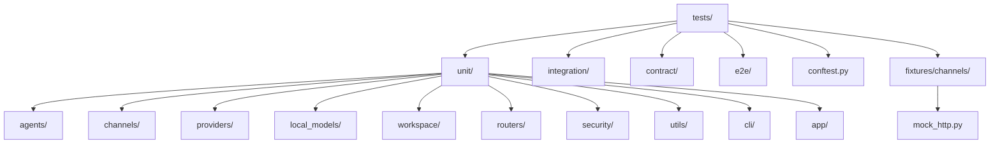
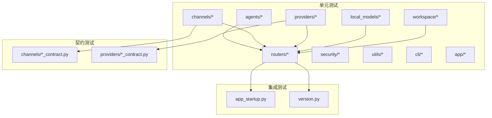
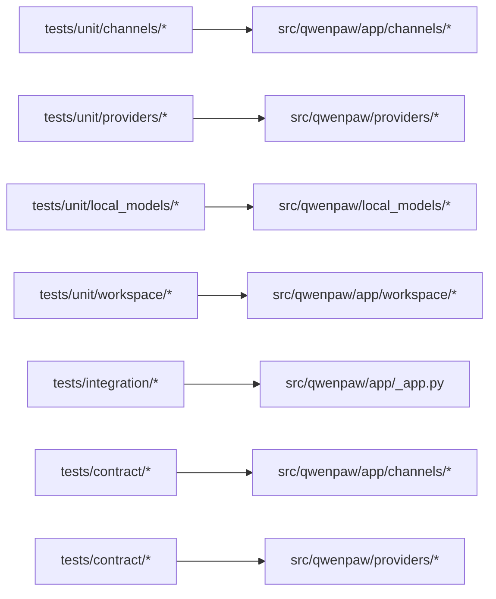
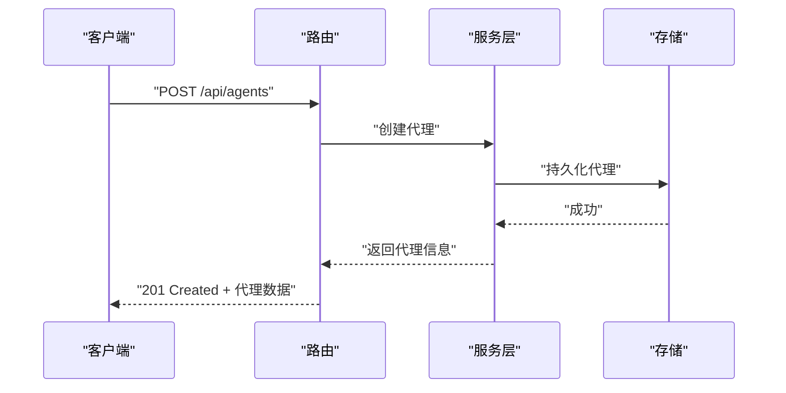
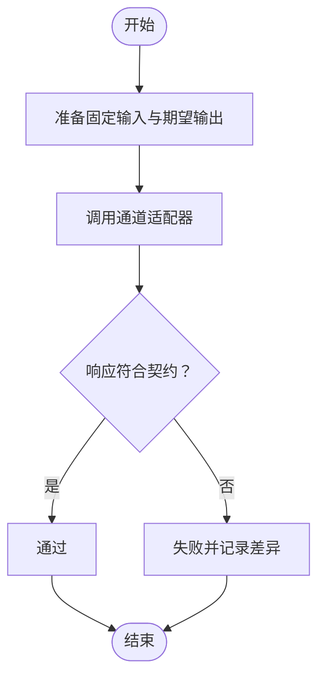

# 测试策略

<cite>
**本文引用的文件**
- [tests/conftest.py](file://tests/conftest.py)
- [tests/unit/channels/conftest.py](file://tests/unit/channels/conftest.py)
- [tests/fixtures/channels/mock_http.py](file://tests/fixtures/channels/mock_http.py)
- [tests/integration/test_app_startup.py](file://tests/integration/test_app_startup.py)
- [tests/integration/test_version.py](file://tests/integration/test_version.py)
- [tests/unit/channels/test_console.py](file://tests/unit/channels/test_console.py)
- [tests/unit/channels/test_dingtalk.py](file://tests/unit/channels/test_dingtalk.py)
- [tests/unit/channels/test_discord.py](file://tests/unit/channels/test_discord.py)
- [tests/unit/channels/test_feishu.py](file://tests/unit/channels/test_feishu.py)
- [tests/unit/channels/test_imessage.py](file://tests/unit/channels/test_imessage.py)
- [tests/unit/channels/test_matrix.py](file://tests/unit/channels/test_matrix.py)
- [tests/unit/channels/test_mattermost.py](file://tests/unit/channels/test_mattermost.py)
- [tests/unit/channels/test_mqtt.py](file://tests/unit/channels/test_mqtt.py)
- [tests/unit/channels/test_onebot_channel.py](file://tests/unit/channels/test_onebot_channel.py)
- [tests/unit/channels/test_qq.py](file://tests/unit/channels/test_qq.py)
- [tests/unit/channels/test_telegram.py](file://tests/unit/channels/test_telegram.py)
- [tests/unit/channels/test_voice.py](file://tests/unit/channels/test_voice.py)
- [tests/unit/channels/test_wecom.py](file://tests/unit/channels/test_wecom.py)
- [tests/unit/channels/test_weixin.py](file://tests/unit/channels/test_weixin.py)
- [tests/unit/channels/test_xiaoyi.py](file://tests/unit/channels/test_xiaoyi.py)
- [tests/unit/providers/test_openai_provider.py](file://tests/unit/providers/test_openai_provider.py)
- [tests/unit/providers/test_provider_manager.py](file://tests/unit/providers/test_provider_manager.py)
- [tests/unit/local_models/test_model_manager.py](file://tests/unit/local_models/test_model_manager.py)
- [tests/unit/workspace/test_workspace.py](file://tests/unit/workspace/test_workspace.py)
- [tests/unit/workspace/test_agent_creation.py](file://tests/unit/workspace/test_agent_creation.py)
- [tests/unit/workspace/test_agent_id.py](file://tests/unit/workspace/test_agent_id.py)
- [tests/unit/workspace/test_agent_model.py](file://tests/unit/workspace/test_agent_model.py)
- [tests/unit/workspace/test_prompt.py](file://tests/unit/workspace/test_prompt.py)
- [tests/contract/channels/test_console_contract.py](file://tests/contract/channels/test_console_contract.py)
- [tests/contract/providers/test_provider_contract.py](file://tests/contract/providers/test_provider_contract.py)
- [scripts/run_tests.py](file://scripts/run_tests.py)
- [docker-compose.yml](file://docker-compose.yml)
- [pyproject.toml](file://pyproject.toml)
- [src/qwenpaw/app/routers/agent.py](file://src/qwenpaw/app/routers/agent.py)
- [src/qwenpaw/app/routers/console.py](file://src/qwenpaw/app/routers/console.py)
- [src/qwenpaw/app/routers/mcp.py](file://src/qwenpaw/app/routers/mcp.py)
- [src/qwenpaw/app/routers/skills.py](file://src/qwenpaw/app/routers/skills.py)
- [src/qwenpaw/app/routers/tools.py](file://src/qwenpaw/app/routers/tools.py)
- [src/qwenpaw/app/routers/workspace.py](file://src/qwenpaw/app/routers/workspace.py)
- [src/qwenpaw/app/routers/auth.py](file://src/qwenpaw/app/routers/auth.py)
- [src/qwenpaw/app/routers/messages.py](file://src/qwenpaw/app/routers/messages.py)
- [src/qwenpaw/app/routers/token_usage.py](file://src/qwenpaw/app/routers/token_usage.py)
- [src/qwenpaw/app/routers/envs.py](file://src/qwenpaw/app/routers/envs.py)
- [src/qwenpaw/app/routers/files.py](file://src/qwenpaw/app/routers/files.py)
- [src/qwenpaw/app/routers/providers.py](file://src/qwenpaw/app/routers/providers.py)
- [src/qwenpaw/app/routers/settings.py](file://src/qwenpaw/app/routers/settings.py)
- [src/qwenpaw/app/routers/skills_stream.py](file://src/qwenpaw/app/routers/skills_stream.py)
- [src/qwenpaw/app/routers/backup.py](file://src/qwenpaw/app/routers/backup.py)
- [src/qwenpaw/app/routers/plugins.py](file://src/qwenpaw/app/routers/plugins.py)
- [src/qwenpaw/app/routers/config.py](file://src/qwenpaw/app/routers/config.py)
- [src/qwenpaw/app/routers/agents.py](file://src/qwenpaw/app/routers/agents.py)
- [src/qwenpaw/app/routers/agent_stats.py](file://src/qwenpaw/app/routers/agent_stats.py)
- [src/qwenpaw/app/routers/cronjob.py](file://src/qwenpaw/app/routers/cronjob.py)
- [src/qwenpaw/app/routers/heartbeat.py](file://src/qwenpaw/app/routers/heartbeat.py)
- [src/qwenpaw/app/routers/local_models.py](file://src/qwenpaw/app/routers/local_models.py)
- [src/qwenpaw/app/routers/voice.py](file://src/qwenpaw/app/routers/voice.py)
- [src/qwenpaw/app/routers/agent_scoped.py](file://src/qwenpaw/app/routers/agent_scoped.py)
- [src/qwenpaw/app/routers/schemas_config.py](file://src/qwenpaw/app/routers/schemas_config.py)
- [src/qwenpaw/app/routers/root.py](file://src/qwenpaw/app/routers/root.py)
- [src/qwenpaw/app/routers/__init__.py](file://src/qwenpaw/app/routers/__init__.py)
- [src/qwenpaw/app/routers/__init__.py](file://src/qwenpaw/app/routers/__init__.py)
- [src/qwenpaw/app/_app.py](file://src/qwenpaw/app/_app.py)
- [src/qwenpaw/cli/main.py](file://src/qwenpaw/cli/main.py)
- [src/qwenpaw/cli/http.py](file://src/qwenpaw/cli/http.py)
- [src/qwenpaw/cli/utils.py](file://src/qwenpaw/cli/utils.py)
- [src/qwenpaw/cli/doctor_cmd.py](file://src/qwenpaw/cli/doctor_cmd.py)
- [src/qwenpaw/cli/doctor_connectivity.py](file://src/qwenpaw/cli/doctor_connectivity.py)
- [src/qwenpaw/cli/doctor_fix_runner.py](file://src/qwenpaw/cli/doctor_fix_runner.py)
- [src/qwenpaw/cli/doctor_registry.py](file://src/qwenpaw/cli/doctor_registry.py)
- [src/qwenpaw/cli/doctor_checks.py](file://src/qwenpaw/cli/doctor_checks.py)
- [src/qwenpaw/cli/init_cmd.py](file://src/qwenpaw/cli/init_cmd.py)
- [src/qwenpaw/cli/shutdown_cmd.py](file://src/qwenpaw/cli/shutdown_cmd.py)
- [src/qwenpaw/cli/update_cmd.py](file://src/qwenpaw/cli/update_cmd.py)
- [src/qwenpaw/cli/uninstall_cmd.py](file://src/qwenpaw/cli/uninstall_cmd.py)
- [src/qwenpaw/cli/task_cmd.py](file://src/qwenpaw/cli/task_cmd.py)
- [src/qwenpaw/cli/mission_cmd.py](file://src/qwenpaw/cli/mission_cmd.py)
- [src/qwenpaw/cli/env_cmd.py](file://src/qwenpaw/cli/env_cmd.py)
- [src/qwenpaw/cli/daemon_cmd.py](file://src/qwenpaw/cli/daemon_cmd.py)
- [src/qwenpaw/cli/clean_cmd.py](file://src/qwenpaw/cli/clean_cmd.py)
- [src/qwenpaw/cli/agents_cmd.py](file://src/qwenpaw/cli/agents_cmd.py)
- [src/qwenpaw/cli/acp_cmd.py](file://src/qwenpaw/cli/acp_cmd.py)
- [src/qwenpaw/cli/channels_cmd.py](file://src/qwenpaw/cli/channels_cmd.py)
- [src/qwenpaw/cli/chats_cmd.py](file://src/qwenpaw/cli/chats_cmd.py)
- [src/qwenpaw/cli/providers_cmd.py](file://src/qwenpaw/cli/providers_cmd.py)
- [src/qwenpaw/cli/skills_cmd.py](file://src/qwenpaw/cli/skills_cmd.py)
- [src/qwenpaw/cli/plugin_commands.py](file://src/qwenpaw/cli/plugin_commands.py)
- [src/qwenpaw/cli/process_utils.py](file://src/qwenpaw/cli/process_utils.py)
- [src/qwenpaw/cli/utils.py](file://src/qwenpaw/cli/utils.py)
- [src/qwenpaw/constant.py](file://src/qwenpaw/constant.py)
- [src/qwenpaw/exceptions.py](file://src/qwenpaw/exceptions.py)
- [src/qwenpaw/utils/logging.py](file://src/qwenpaw/utils/logging.py)
- [src/qwenpaw/utils/stdio.py](file://src/qwenpaw/utils/stdio.py)
- [src/qwenpaw/utils/system_info.py](file://src/qwenpaw/utils/system_info.py)
- [src/qwenpaw/utils/telemetry.py](file://src/qwenpaw/utils/telemetry.py)
- [src/qwenpaw/utils/command_runner.py](file://src/qwenpaw/utils/command_runner.py)
- [src/qwenpaw/utils/startup_display.py](file://src/qwenpaw/utils/startup_display.py)
- [src/qwenpaw/utils/console_static.py](file://src/qwenpaw/utils/console_static.py)
- [src/qwenpaw/utils/telemetry.py](file://src/qwenpaw/utils/telemetry.py)
- [src/qwenpaw/utils/stdio.py](file://src/qwenpaw/utils/stdio.py)
- [src/qwenpaw/utils/system_info.py](file://src/qwenpaw/utils/system_info.py)
- [src/qwenpaw/utils/command_runner.py](file://src/qwenpaw/utils/command_runner.py)
- [src/qwenpaw/utils/startup_display.py](file://src/qwenpaw/utils/startup_display.py)
- [src/qwenpaw/utils/console_static.py](file://src/qwenpaw/utils/console_static.py)
- [src/qwenpaw/utils/logging.py](file://src/qwenpaw/utils/logging.py)
- [src/qwenpaw/token_usage/manager.py](file://src/qwenpaw/token_usage/manager.py)
- [src/qwenpaw/token_usage/model_wrapper.py](file://src/qwenpaw/token_usage/model_wrapper.py)
- [src/qwenpaw/token_usage/__init__.py](file://src/qwenpaw/token_usage/__init__.py)
- [src/qwenpaw/token_usage/__init__.py](file://src/qwenpaw/token_usage/__init__.py)
- [src/qwenpaw/security/tool_guard/engine.py](file://src/qwenpaw/security/tool_guard/engine.py)
- [src/qwenpaw/security/tool_guard/models.py](file://src/qwenpaw/security/tool_guard/models.py)
- [src/qwenpaw/security/tool_guard/utils.py](file://src/qwenpaw/security/tool_guard/utils.py)
- [src/qwenpaw/security/tool_guard/__init__.py](file://src/qwenpaw/security/tool_guard/__init__.py)
- [src/qwenpaw/security/skill_scanner/scanner.py](file://src/qwenpaw/security/skill_scanner/scanner.py)
- [src/qwenpaw/security/skill_scanner/models.py](file://src/qwenpaw/security/skill_scanner/models.py)
- [src/qwenpaw/security/skill_scanner/scan_policy.py](file://src/qwenpaw/security/skill_scanner/scan_policy.py)
- [src/qwenpaw/security/skill_scanner/__init__.py](file://src/qwenpaw/security/skill_scanner/__init__.py)
- [src/qwenpaw/backup/orchestration.py](file://src/qwenpaw/backup/orchestration.py)
- [src/qwenpaw/backup/models.py](file://src/qwenpaw/backup/models.py)
- [src/qwenpaw/backup/__init__.py](file://src/qwenpaw/backup/__init__.py)
- [src/qwenpaw/backup/__init__.py](file://src/qwenpaw/backup/__init__.py)
- [src/qwenpaw/backup/_ops/create.py](file://src/qwenpaw/backup/_ops/create.py)
- [src/qwenpaw/backup/_ops/restore.py](file://src/qwenpaw/backup/_ops/restore.py)
- [src/qwenpaw/backup/_ops/storage.py](file://src/qwenpaw/backup/_ops/storage.py)
- [src/qwenpaw/backup/_utils/constants.py](file://src/qwenpaw/backup/_utils/constants.py)
- [src/qwenpaw/backup/_utils/meta.py](file://src/qwenpaw/backup/_utils/meta.py)
- [src/qwenpaw/backup/_utils/safe_swap.py](file://src/qwenpaw/backup/_utils/safe_swap.py)
- [src/qwenpaw/local_models/manager.py](file://src/qwenpaw/local_models/manager.py)
- [src/qwenpaw/local_models/model_manager.py](file://src/qwenpaw/local_models/model_manager.py)
- [src/qwenpaw/local_models/download_manager.py](file://src/qwenpaw/local_models/download_manager.py)
- [src/qwenpaw/local_models/tag_parser.py](file://src/qwenpaw/local_models/tag_parser.py)
- [src/qwenpaw/local_models/llamacpp.py](file://src/qwenpaw/local_models/llamacpp.py)
- [src/qwenpaw/local_models/__init__.py](file://src/qwenpaw/local_models/__init__.py)
- [src/qwenpaw/local_models/__init__.py](file://src/qwenpaw/local_models/__init__.py)
- [src/qwenpaw/providers/provider_manager.py](file://src/qwenpaw/providers/provider_manager.py)
- [src/qwenpaw/providers/provider.py](file://src/qwenpaw/providers/provider.py)
- [src/qwenpaw/providers/openai_provider.py](file://src/qwenpaw/providers/openai_provider.py)
- [src/qwenpaw/providers/anthropic_provider.py](file://src/qwenpaw/providers/anthropic_provider.py)
- [src/qwenpaw/providers/gemini_provider.py](file://src/qwenpaw/providers/gemini_provider.py)
- [src/qwenpaw/providers/ollama_provider.py](file://src/qwenpaw/providers/ollama_provider.py)
- [src/qwenpaw/providers/retry_chat_model.py](file://src/qwenpaw/providers/retry_chat_model.py)
- [src/qwenpaw/providers/rate_limiter.py](file://src/qwenpaw/providers/rate_limiter.py)
- [src/qwenpaw/providers/multimodal_prober.py](file://src/qwenpaw/providers/multimodal_prober.py)
- [src/qwenpaw/providers/capability_baseline.py](file://src/qwenpaw/providers/capability_baseline.py)
- [src/qwenpaw/providers/openrouter_provider.py](file://src/qwenpaw/providers/openrouter_provider.py)
- [src/qwenpaw/providers/lmstudio_provider.py](file://src/qwenpaw/providers/lmstudio_provider.py)
- [src/qwenpaw/providers/openai_chat_model_compat.py](file://src/qwenpaw/providers/openai_chat_model_compat.py)
- [src/qwenpaw/providers/__init__.py](file://src/qwenpaw/providers/__init__.py)
- [src/qwenpaw/providers/__init__.py](file://src/qwenpaw/providers/__init__.py)
- [src/qwenpaw/agents/context/base_context_manager.py](file://src/qwenpaw/agents/context/base_context_manager.py)
- [src/qwenpaw/agents/context/light_context_manager.py](file://src/qwenpaw/agents/context/light_context_manager.py)
- [src/qwenpaw/agents/context/compactor_prompts.py](file://src/qwenpaw/agents/context/compactor_prompts.py)
- [src/qwenpaw/agents/context/as_msg_handler.py](file://src/qwenpaw/agents/context/as_msg_handler.py)
- [src/qwenpaw/agents/context/as_msg_stat.py](file://src/qwenpaw/agents/context/as_msg_stat.py)
- [src/qwenpaw/agents/context/agent_context.py](file://src/qwenpaw/agents/context/agent_context.py)
- [src/qwenpaw/agents/context/__init__.py](file://src/qwenpaw/agents/context/__init__.py)
- [src/qwenpaw/agents/memory/base_memory_manager.py](file://src/qwenpaw/agents/memory/base_memory_manager.py)
- [src/qwenpaw/agents/memory/reme_light_memory_manager.py](file://src/qwenpaw/agents/memory/reme_light_memory_manager.py)
- [src/qwenpaw/agents/memory/proactive/proactive_responder.py](file://src/qwenpaw/agents/memory/proactive/proactive_responder.py)
- [src/qwenpaw/agents/memory/proactive/proactive_trigger.py](file://src/qwenpaw/agents/memory/proactive/proactive_trigger.py)
- [src/qwenpaw/agents/memory/proactive/proactive_prompts.py](file://src/qwenpaw/agents/memory/proactive/proactive_prompts.py)
- [src/qwenpaw/agents/memory/proactive/proactive_types.py](file://src/qwenpaw/agents/memory/proactive/proactive_types.py)
- [src/qwenpaw/agents/memory/proactive/proactive_utils.py](file://src/qwenpaw/agents/memory/proactive/proactive_utils.py)
- [src/qwenpaw/agents/memory/proactive/__init__.py](file://src/qwenpaw/agents/memory/proactive/__init__.py)
- [src/qwenpaw/agents/memory/__init__.py](file://src/qwenpaw/agents/memory/__init__.py)
- [src/qwenpaw/agents/mission/mission_runner.py](file://src/qwenpaw/agents/mission/mission_runner.py)
- [src/qwenpaw/agents/mission/state.py](file://src/qwenpaw/agents/mission/state.py)
- [src/qwenpaw/agents/mission/handler.py](file://src/qwenpaw/agents/mission/handler.py)
- [src/qwenpaw/agents/mission/prompts.py](file://src/qwenpaw/agents/mission/prompts.py)
- [src/qwenpaw/agents/mission/__init__.py](file://src/qwenpaw/agents/mission/__init__.py)
- [src/qwenpaw/agents/tools/agent_management.py](file://src/qwenpaw/agents/tools/agent_management.py)
- [src/qwenpaw/agents/tools/browser_control.py](file://src/qwenpaw/agents/tools/browser_control.py)
- [src/qwenpaw/agents/tools/browser_snapshot.py](file://src/qwenpaw/agents/tools/browser_snapshot.py)
- [src/qwenpaw/agents/tools/delegate_external_agent.py](file://src/qwenpaw/agents/tools/delegate_external_agent.py)
- [src/qwenpaw/agents/tools/desktop_screenshot.py](file://src/qwenpaw/agents/tools/desktop_screenshot.py)
- [src/qwenpaw/agents/tools/file_io.py](file://src/qwenpaw/agents/tools/file_io.py)
- [src/qwenpaw/agents/tools/file_search.py](file://src/qwenpaw/agents/tools/file_search.py)
- [src/qwenpaw/agents/tools/get_current_time.py](file://src/qwenpaw/agents/tools/get_current_time.py)
- [src/qwenpaw/agents/tools/get_token_usage.py](file://src/qwenpaw/agents/tools/get_token_usage.py)
- [src/qwenpaw/agents/tools/send_file.py](file://src/qwenpaw/agents/tools/send_file.py)
- [src/qwenpaw/agents/tools/shell.py](file://src/qwenpaw/agents/tools/shell.py)
- [src/qwenpaw/agents/tools/utils.py](file://src/qwenpaw/agents/tools/utils.py)
- [src/qwenpaw/agents/tools/view_media.py](file://src/qwenpaw/agents/tools/view_media.py)
- [src/qwenpaw/agents/tools/__init__.py](file://src/qwenpaw/agents/tools/__init__.py)
- [src/qwenpaw/agents/utils/message_processing.py](file://src/qwenpaw/agents/utils/message_processing.py)
- [src/qwenpaw/agents/utils/message_request_normalizer.py](file://src/qwenpaw/agents/utils/message_request_normalizer.py)
- [src/qwenpaw/agents/utils/estimate_token_counter.py](file://src/qwenpaw/agents/utils/estimate_token_counter.py)
- [src/qwenpaw/agents/utils/file_handling.py](file://src/qwenpaw/agents/utils/file_handling.py)
- [src/qwenpaw/agents/utils/registry.py](file://src/qwenpaw/agents/utils/registry.py)
- [src/qwenpaw/agents/utils/setup_utils.py](file://src/qwenpaw/agents/utils/setup_utils.py)
- [src/qwenpaw/agents/utils/token_counter.py](file://src/qwenpaw/agents/utils/token_counter.py)
- [src/qwenpaw/agents/utils/tool_message_utils.py](file://src/qwenpaw/agents/utils/tool_message_utils.py)
- [src/qwenpaw/agents/utils/__init__.py](file://src/qwenpaw/agents/utils/__init__.py)
- [src/qwenpaw/agents/command_handler.py](file://src/qwenpaw/agents/command_handler.py)
- [src/qwenpaw/agents/model_factory.py](file://src/qwenpaw/agents/model_factory.py)
- [src/qwenpaw/agents/prompt.py](file://src/qwenpaw/agents/prompt.py)
- [src/qwenpaw/agents/react_agent.py](file://src/qwenpaw/agents/react_agent.py)
- [src/qwenpaw/agents/routing_chat_model.py](file://src/qwenpaw/agents/routing_chat_model.py)
- [src/qwenpaw/agents/schema.py](file://src/qwenpaw/agents/schema.py)
- [src/qwenpaw/agents/skills_hub.py](file://src/qwenpaw/agents/skills_hub.py)
- [src/qwenpaw/agents/skills_manager.py](file://src/qwenpaw/agents/skills_manager.py)
- [src/qwenpaw/agents/templates.py](file://src/qwenpaw/agents/templates.py)
- [src/qwenpaw/agents/tool_guard_mixin.py](file://src/qwenpaw/agents/tool_guard_mixin.py)
- [src/qwenpaw/agents/__init__.py](file://src/qwenpaw/agents/__init__.py)
- [src/qwenpaw/agents/__init__.py](file://src/qwenpaw/agents/__init__.py)
- [src/qwenpaw/app/channels/base.py](file://src/qwenpaw/app/channels/base.py)
- [src/qwenpaw/app/channels/manager.py](file://src/qwenpaw/app/channels/manager.py)
- [src/qwenpaw/app/channels/registry.py](file://src/qwenpaw/app/channels/registry.py)
- [src/qwenpaw/app/channels/renderer.py](file://src/qwenpaw/app/channels/renderer.py)
- [src/qwenpaw/app/channels/schema.py](file://src/qwenpaw/app/channels/schema.py)
- [src/qwenpaw/app/channels/unified_queue_manager.py](file://src/qwenpaw/app/channels/unified_queue_manager.py)
- [src/qwenpaw/app/channels/utils.py](file://src/qwenpaw/app/channels/utils.py)
- [src/qwenpaw/app/channels/command_registry.py](file://src/qwenpaw/app/channels/command_registry.py)
- [src/qwenpaw/app/channels/qrcode_auth_handler.py](file://src/qwenpaw/app/channels/qrcode_auth_handler.py)
- [src/qwenpaw/app/channels/__init__.py](file://src/qwenpaw/app/channels/__init__.py)
- [src/qwenpaw/app/channels/__init__.py](file://src/qwenpaw/app/channels/__init__.py)
- [src/qwenpaw/app/crons/manager.py](file://src/qwenpaw/app/crons/manager.py)
- [src/qwenpaw/app/crons/models.py](file://src/qwenpaw/app/crons/models.py)
- [src/qwenpaw/app/crons/executor.py](file://src/qwenpaw/app/crons/executor.py)
- [src/qwenpaw/app/crons/api.py](file://src/qwenpaw/app/crons/api.py)
- [src/qwenpaw/app/crons/heartbeat.py](file://src/qwenpaw/app/crons/heartbeat.py)
- [src/qwenpaw/app/crons/repo/__init__.py](file://src/qwenpaw/app/crons/repo/__init__.py)
- [src/qwenpaw/app/crons/repo/__init__.py](file://src/qwenpaw/app/crons/repo/__init__.py)
- [src/qwenpaw/app/runner/manager.py](file://src/qwenpaw/app/runner/manager.py)
- [src/qwenpaw/app/runner/api.py](file://src/qwenpaw/app/runner/api.py)
- [src/qwenpaw/app/runner/runner.py](file://src/qwenpaw/app/runner/runner.py)
- [src/qwenpaw/app/runner/session.py](file://src/qwenpaw/app/runner/session.py)
- [src/qwenpaw/app/runner/command_dispatch.py](file://src/qwenpaw/app/runner/command_dispatch.py)
- [src/qwenpaw/app/runner/mission_dispatch.py](file://src/qwenpaw/app/runner/mission_dispatch.py)
- [src/qwenpaw/app/runner/models.py](file://src/qwenpaw/app/runner/models.py)
- [src/qwenpaw/app/runner/task_tracker.py](file://src/qwenpaw/app/runner/task_tracker.py)
- [src/qwenpaw/app/runner/control_commands/__init__.py](file://src/qwenpaw/app/runner/control_commands/__init__.py)
- [src/qwenpaw/app/runner/repo/__init__.py](file://src/qwenpaw/app/runner/repo/__init__.py)
- [src/qwenpaw/app/runner/repo/__init__.py](file://src/qwenpaw/app/runner/repo/__init__.py)
- [src/qwenpaw/app/workspace/service_manager.py](file://src/qwenpaw/app/workspace/service_manager.py)
- [src/qwenpaw/app/workspace/workspace.py](file://src/qwenpaw/app/workspace/workspace.py)
- [src/qwenpaw/app/workspace/service_factories.py](file://src/qwenpaw/app/workspace/service_factories.py)
- [src/qwenpaw/app/workspace/__init__.py](file://src/qwenpaw/app/workspace/__init__.py)
- [src/qwenpaw/app/workspace/__init__.py](file://src/qwenpaw/app/workspace/__init__.py)
- [src/qwenpaw/app/mcp/manager.py](file://src/qwenpaw/app/mcp/manager.py)
- [src/qwenpaw/app/mcp/stateful_client.py](file://src/qwenpaw/app/mcp/stateful_client.py)
- [src/qwenpaw/app/mcp/watcher.py](file://src/qwenpaw/app/mcp/watcher.py)
- [src/qwenpaw/app/mcp/__init__.py](file://src/qwenpaw/app/mcp/__init__.py)
- [src/qwenpaw/app/mcp/__init__.py](file://src/qwenpaw/app/mcp/__init__.py)
- [src/qwenpaw/app/approvals/service.py](file://src/qwenpaw/app/approvals/service.py)
- [src/qwenpaw/app/approvals/__init__.py](file://src/qwenpaw/app/approvals/__init__.py)
- [src/qwenpaw/app/approvals/__init__.py](file://src/qwenpaw/app/approvals/__init__.py)
- [src/qwenpaw/app/auth.py](file://src/qwenpaw/app/auth.py)
- [src/qwenpaw/app/console_push_store.py](file://src/qwenpaw/app/console_push_store.py)
- [src/qwenpaw/app/migration.py](file://src/qwenpaw/app/migration.py)
- [src/qwenpaw/app/multi_agent_manager.py](file://src/qwenpaw/app/multi_agent_manager.py)
- [src/qwenpaw/app/utils.py](file://src/qwenpaw/app/utils.py)
- [src/qwenpaw/app/_app.py](file://src/qwenpaw/app/_app.py)
- [src/qwenpaw/app/agent_context.py](file://src/qwenpaw/app/agent_context.py)
- [src/qwenpaw/app/agent_config_watcher.py](file://src/qwenpaw/app/agent_config_watcher.py)
- [src/qwenpaw/app/utils.py](file://src/qwenpaw/app/utils.py)
- [src/qwenpaw/app/utils.py](file://src/qwenpaw/app/utils.py)
- [src/qwenpaw/app/utils.py](file://src/qwenpaw/app/utils.py)
- [src/qwenpaw/app/utils.py](file://src/qwenpaw/app/utils.py)
- [src/qwenpaw/app/utils.py](file://src/qwenpaw/app/utils.py)
- [src/qwenpaw/app/utils.py](file://src/qwenpaw/app/utils.py)
- [src/qwenpaw/app/utils.py](file://src/qwenpaw/app/utils.py)
- [src/qwenpaw/app/utils.py](file://src/qwenpaw/app/utils.py)
- [src/qwenpaw/app/utils.py](file://src/qwenpaw/app/utils.py)
- [src/qwenpaw/app/utils.py](file://src/qwenpaw/app/utils.py)
- [src/qwenpaw/app/utils.py](file://src/qwenpaw/app/utils.py)
- [src/qwenpaw/app/utils.py](file://src/qwenpaw/app/utils.py)
- [src/qwenpaw/app/utils.py](file://src/qwenpaw/app/utils.py)
- [src/qwenpaw/app/utils.py](file://src/qwenpaw/app/utils.py)
- [src/qwenpaw/app/utils.py](file://src/qwenpaw/app/utils.py)
- [src/qwenpaw/app/utils.py](file://src/qwenpaw/app/utils.py)
- [src/qwenpaw/app/utils.py](file://src/qwenpaw/app/utils.py)
- [src/qwenpaw/app/utils.py](file://src/qwenpaw/app/utils.py)
- [src/qwenpaw/app/utils.py](file://src/qwenpaw/app/utils.py)
- [src/qwenpaw/app/utils.py](file://src/qwenpaw/app/utils.py)
- [src/qwenpaw/app/utils.py](file://src/qwenpaw/app/utils.py)
- [src/qwenpaw/app/utils.py](file://src/qwenpaw/app/utils.py)
- [src/qwenpaw/app/utils.py](file://src/qwenpaw/app/utils.py)
- [src/qwen......](file://src/qwenpaw/app/utils.py)
</cite>

## 目录
1. 引言
2. 项目结构
3. 核心组件
4. 架构总览
5. 详细组件分析
6. 依赖分析
7. 性能考虑
8. 故障排查指南
9. 结论
10. 附录

## 引言
本测试策略文档面向QwenPaw项目，旨在建立完善的测试金字塔：单元测试、集成测试与契约测试协同工作，确保核心业务逻辑、模块间交互与外部接口契约的稳定性。文档覆盖测试框架选择与配置（pytest及其自定义fixtures）、测试用例编写规范（数据准备、模拟对象、断言策略）、API测试与UI测试实践、端到端测试思路、测试覆盖率目标、持续集成与自动化流程、测试环境搭建与隔离策略，并给出可操作的质量保障建议。

## 项目结构
测试目录采用分层组织：
- tests/unit：按功能域划分的单元测试，如agents、channels、providers、local_models、workspace等。
- tests/integration：应用启动与版本等集成级验证。
- tests/contract：通道与供应商的契约测试，验证对外接口行为的一致性。
- tests/e2e：端到端测试（当前为空目录，作为未来扩展点）。
- tests/conftest.py：全局pytest配置与fixture。
- tests/unit/channels/conftest.py：通道子域的pytest配置与fixture。
- tests/fixtures/channels/mock_http.py：通道相关的HTTP模拟实现。

图表来源
- [tests/conftest.py](file://tests/conftest.py)
- [tests/unit/channels/conftest.py](file://tests/unit/channels/conftest.py)
- [tests/fixtures/channels/mock_http.py](file://tests/fixtures/channels/mock_http.py)
- [tests/integration/test_app_startup.py](file://tests/integration/test_app_startup.py)
- [tests/integration/test_version.py](file://tests/integration/test_version.py)

章节来源
- [tests/conftest.py](file://tests/conftest.py)
- [tests/unit/channels/conftest.py](file://tests/unit/channels/conftest.py)
- [tests/fixtures/channels/mock_http.py](file://tests/fixtures/channels/mock_http.py)
- [tests/integration/test_app_startup.py](file://tests/integration/test_app_startup.py)
- [tests/integration/test_version.py](file://tests/integration/test_version.py)

## 核心组件
- 测试框架与运行器：pytest（通过脚本统一入口调用）。
- 自定义fixtures：在全局与子域conftest中定义，用于数据库、通道适配器、会话上下文等测试资源的准备与清理。
- 模拟对象：通道层使用HTTP模拟，避免真实网络依赖；其他模块可通过pytest-mock或unittest.mock进行依赖替换。
- 断言策略：以行为正确性为主，结合状态一致性、异常路径与边界条件。
- 覆盖率：建议单元测试覆盖率≥80%，关键路径≥90%；集成与契约测试覆盖主要分支与错误场景。

章节来源
- [tests/conftest.py](file://tests/conftest.py)
- [tests/unit/channels/conftest.py](file://tests/unit/channels/conftest.py)
- [tests/fixtures/channels/mock_http.py](file://tests/fixtures/channels/mock_http.py)

## 架构总览
测试架构围绕“金字塔”展开：
- 单元层：最小可测试单元，快速反馈，高密度执行。
- 集成层：模块间协作与关键流程验证，关注启动、路由、服务工厂等。
- 契约层：通道与供应商对外行为契约，确保兼容性与稳定性。

图表来源
- [tests/unit/channels/test_console.py](file://tests/unit/channels/test_console.py)
- [tests/unit/providers/test_openai_provider.py](file://tests/unit/providers/test_openai_provider.py)
- [tests/unit/local_models/test_model_manager.py](file://tests/unit/local_models/test_model_manager.py)
- [tests/unit/workspace/test_workspace.py](file://tests/unit/workspace/test_workspace.py)
- [tests/integration/test_app_startup.py](file://tests/integration/test_app_startup.py)
- [tests/integration/test_version.py](file://tests/integration/test_version.py)
- [tests/contract/channels/test_console_contract.py](file://tests/contract/channels/test_console_contract.py)
- [tests/contract/providers/test_provider_contract.py](file://tests/contract/providers/test_provider_contract.py)

## 详细组件分析

### 单元测试策略与示例
- 组织方式：按功能域分目录，每个模块下按功能细分，便于定位与维护。
- 示例用例：
  - 通道：console、dingtalk、discord、feishu、imessage、matrix、mattermost、mqtt、onebot、qq、telegram、voice、wecom、weixin、xiaoyi。
  - 提供商：openai、anthropic、gemini、ollama、provider_manager等。
  - 工作区：workspace、agent creation、agent id、agent model、prompt等。
  - 其他：CLI命令、日志、工具函数等。
- 编写要点：
  - 使用pytest参数化覆盖多输入组合。
  - 对外部依赖进行mock，确保测试可重复。
  - 关注异常路径与边界条件（空值、超长字符串、非法格式等）。
  - 断言应聚焦于行为结果而非实现细节。

章节来源
- [tests/unit/channels/test_console.py](file://tests/unit/channels/test_console.py)
- [tests/unit/channels/test_dingtalk.py](file://tests/unit/channels/test_dingtalk.py)
- [tests/unit/channels/test_discord.py](file://tests/unit/channels/test_discord.py)
- [tests/unit/channels/test_feishu.py](file://tests/unit/channels/test_feishu.py)
- [tests/unit/channels/test_imessage.py](file://tests/unit/channels/test_imessage.py)
- [tests/unit/channels/test_matrix.py](file://tests/unit/channels/test_matrix.py)
- [tests/unit/channels/test_mattermost.py](file://tests/unit/channels/test_mattermost.py)
- [tests/unit/channels/test_mqtt.py](file://tests/unit/channels/test_mqtt.py)
- [tests/unit/channels/test_onebot_channel.py](file://tests/unit/channels/test_onebot_channel.py)
- [tests/unit/channels/test_qq.py](file://tests/unit/channels/test_qq.py)
- [tests/unit/channels/test_telegram.py](file://tests/unit/channels/test_telegram.py)
- [tests/unit/channels/test_voice.py](file://tests/unit/channels/test_voice.py)
- [tests/unit/channels/test_wecom.py](file://tests/unit/channels/test_wecom.py)
- [tests/unit/channels/test_weixin.py](file://tests/unit/channels/test_weixin.py)
- [tests/unit/channels/test_xiaoyi.py](file://tests/unit/channels/test_xiaoyi.py)
- [tests/unit/providers/test_openai_provider.py](file://tests/unit/providers/test_openai_provider.py)
- [tests/unit/providers/test_provider_manager.py](file://tests/unit/providers/test_provider_manager.py)
- [tests/unit/local_models/test_model_manager.py](file://tests/unit/local_models/test_model_manager.py)
- [tests/unit/workspace/test_workspace.py](file://tests/unit/workspace/test_workspace.py)
- [tests/unit/workspace/test_agent_creation.py](file://tests/unit/workspace/test_agent_creation.py)
- [tests/unit/workspace/test_agent_id.py](file://tests/unit/workspace/test_agent_id.py)
- [tests/unit/workspace/test_agent_model.py](file://tests/unit/workspace/test_agent_model.py)
- [tests/unit/workspace/test_prompt.py](file://tests/unit/workspace/test_prompt.py)

### 集成测试策略与示例
- 目标：验证应用启动流程、版本信息、关键服务初始化与路由可用性。
- 示例用例：
  - 应用启动：检查服务是否成功启动、监听端口、健康检查可用。
  - 版本：确认版本号与构建信息一致。
- 实施建议：
  - 使用临时配置与内存存储，避免污染生产环境。
  - 在CI中以容器化方式运行，确保环境一致性。

章节来源
- [tests/integration/test_app_startup.py](file://tests/integration/test_app_startup.py)
- [tests/integration/test_version.py](file://tests/integration/test_version.py)

### 契约测试策略与示例
- 目标：确保通道与供应商对外行为稳定，防止接口变更导致的回归。
- 示例用例：
  - 通道契约：console、dingtalk、discord、feishu、imessage、matrix、mattermost、mqtt、qq、telegram、voice等。
  - 供应商契约：provider_contract。
- 实施建议：
  - 固定输入与期望输出，记录响应格式与错误码。
  - 对比历史快照，发现不兼容变更。

章节来源
- [tests/contract/channels/test_console_contract.py](file://tests/contract/channels/test_console_contract.py)
- [tests/contract/providers/test_provider_contract.py](file://tests/contract/providers/test_provider_contract.py)

### API测试与端到端测试
- API测试：
  - 路由覆盖：agents、agent、agent_stats、agents、auth、backup、config、console、envs、files、local_models、mcp、messages、plugins、providers、root、schemas_config、settings、skills、skills_stream、tools、token_usage、voice、workspace等。
  - 断言策略：校验HTTP状态码、响应体结构、鉴权与权限控制、错误处理。
  - 数据准备：使用fixtures构造最小化有效载荷，必要时预置数据库记录。
- 端到端测试：
  - 当前仓库未包含e2e测试，建议基于现有API测试与UI自动化框架（如Playwright/Cypress）逐步扩展。
  - 场景建议：登录→创建代理→发送消息→查看响应→退出登录。

章节来源
- [src/qwenpaw/app/routers/agent.py](file://src/qwenpaw/app/routers/agent.py)
- [src/qwenpaw/app/routers/agents.py](file://src/qwenpaw/app/routers/agents.py)
- [src/qwenpaw/app/routers/agent_stats.py](file://src/qwenpaw/app/routers/agent_stats.py)
- [src/qwenpaw/app/routers/auth.py](file://src/qwenpaw/app/routers/auth.py)
- [src/qwenpaw/app/routers/backup.py](file://src/qwenpaw/app/routers/backup.py)
- [src/qwenpaw/app/routers/config.py](file://src/qwenpaw/app/routers/config.py)
- [src/qwenpaw/app/routers/console.py](file://src/qwenpaw/app/routers/console.py)
- [src/qwenpaw/app/routers/envs.py](file://src/qwenpaw/app/routers/envs.py)
- [src/qwenpaw/app/routers/files.py](file://src/qwenpaw/app/routers/files.py)
- [src/qwenpaw/app/routers/local_models.py](file://src/qwenpaw/app/routers/local_models.py)
- [src/qwenpaw/app/routers/mcp.py](file://src/qwenpaw/app/routers/mcp.py)
- [src/qwenpaw/app/routers/messages.py](file://src/qwenpaw/app/routers/messages.py)
- [src/qwenpaw/app/routers/plugins.py](file://src/qwenpaw/app/routers/plugins.py)
- [src/qwenpaw/app/routers/providers.py](file://src/qwenpaw/app/routers/providers.py)
- [src/qwenpaw/app/routers/root.py](file://src/qwenpaw/app/routers/root.py)
- [src/qwenpaw/app/routers/schemas_config.py](file://src/qwenpaw/app/routers/schemas_config.py)
- [src/qwenpaw/app/routers/settings.py](file://src/qwenpaw/app/routers/settings.py)
- [src/qwenpaw/app/routers/skills.py](file://src/qwenpaw/app/routers/skills.py)
- [src/qwenpaw/app/routers/skills_stream.py](file://src/qwenpaw/app/routers/skills_stream.py)
- [src/qwenpaw/app/routers/tools.py](file://src/qwenpaw/app/routers/tools.py)
- [src/qwenpaw/app/routers/token_usage.py](file://src/qwenpaw/app/routers/token_usage.py)
- [src/qwenpaw/app/routers/voice.py](file://src/qwenpaw/app/routers/voice.py)
- [src/qwenpaw/app/routers/workspace.py](file://src/qwenpaw/app/routers/workspace.py)
- [src/qwenpaw/app/routers/agent_scoped.py](file://src/qwenpaw/app/routers/agent_scoped.py)

### CLI与工具函数测试
- CLI命令：agents、shutdown、task、update、version等。
- 工具函数：command_runner、logging、stdio、system_info、startup_display、telemetry等。
- 测试要点：标准输入输出捕获、异常抛出、日志级别与格式、系统调用返回码。

章节来源
- [src/qwenpaw/cli/main.py](file://src/qwenpaw/cli/main.py)
- [src/qwenpaw/cli/http.py](file://src/qwenpaw/cli/http.py)
- [src/qwenpaw/cli/utils.py](file://src/qwenpaw/cli/utils.py)
- [src/qwenpaw/cli/doctor_cmd.py](file://src/qwenpaw/cli/doctor_cmd.py)
- [src/qwenpaw/cli/doctor_connectivity.py](file://src/qwenpaw/cli/doctor_connectivity.py)
- [src/qwenpaw/cli/doctor_fix_runner.py](file://src/qwenpaw/cli/doctor_fix_runner.py)
- [src/qwenpaw/cli/doctor_registry.py](file://src/qwenpaw/cli/doctor_registry.py)
- [src/qwenpaw/cli/doctor_checks.py](file://src/qwenpaw/cli/doctor_checks.py)
- [src/qwenpaw/cli/init_cmd.py](file://src/qwenpaw/cli/init_cmd.py)
- [src/qwenpaw/cli/shutdown_cmd.py](file://src/qwenpaw/cli/shutdown_cmd.py)
- [src/qwenpaw/cli/update_cmd.py](file://src/qwenpaw/cli/update_cmd.py)
- [src/qwenpaw/cli/uninstall_cmd.py](file://src/qwenpaw/cli/uninstall_cmd.py)
- [src/qwenpaw/cli/task_cmd.py](file://src/qwenpaw/cli/task_cmd.py)
- [src/qwenpaw/cli/mission_cmd.py](file://src/qwenpaw/cli/mission_cmd.py)
- [src/qwenpaw/cli/env_cmd.py](file://src/qwenpaw/cli/env_cmd.py)
- [src/qwenpaw/cli/daemon_cmd.py](file://src/qwenpaw/cli/daemon_cmd.py)
- [src/qwenpaw/cli/clean_cmd.py](file://src/qwenpaw/cli/clean_cmd.py)
- [src/qwenpaw/cli/agents_cmd.py](file://src/qwenpaw/cli/agents_cmd.py)
- [src/qwenpaw/cli/acp_cmd.py](file://src/qwenpaw/cli/acp_cmd.py)
- [src/qwenpaw/cli/channels_cmd.py](file://src/qwenpaw/cli/channels_cmd.py)
- [src/qwenpaw/cli/chats_cmd.py](file://src/qwenpaw/cli/chats_cmd.py)
- [src/qwenpaw/cli/providers_cmd.py](file://src/qwenpaw/cli/providers_cmd.py)
- [src/qwenpaw/cli/skills_cmd.py](file://src/qwenpaw/cli/skills_cmd.py)
- [src/qwenpaw/cli/plugin_commands.py](file://src/qwenpaw/cli/plugin_commands.py)
- [src/qwenpaw/cli/process_utils.py](file://src/qwenpaw/cli/process_utils.py)
- [src/qwenpaw/utils/command_runner.py](file://src/qwenpaw/utils/command_runner.py)
- [src/qwenpaw/utils/logging.py](file://src/qwenpaw/utils/logging.py)
- [src/qwenpaw/utils/stdio.py](file://src/qwenpaw/utils/stdio.py)
- [src/qwenpaw/utils/system_info.py](file://src/qwenpaw/utils/system_info.py)
- [src/qwenpaw/utils/startup_display.py](file://src/qwenpaw/utils/startup_display.py)
- [src/qwenpaw/utils/console_static.py](file://src/qwenpaw/utils/console_static.py)

### 安全与备份测试
- 安全：工具守卫引擎、扫描器、策略与模型。
- 备份：创建、恢复、存储与元数据管理。
- 测试要点：权限控制、异常注入、数据完整性、并发安全。

章节来源
- [src/qwenpaw/security/tool_guard/engine.py](file://src/qwenpaw/security/tool_guard/engine.py)
- [src/qwenpaw/security/tool_guard/models.py](file://src/qwenpaw/security/tool_guard/models.py)
- [src/qwenpaw/security/tool_guard/utils.py](file://src/qwenpaw/security/tool_guard/utils.py)
- [src/qwenpaw/security/skill_scanner/scanner.py](file://src/qwenpaw/security/skill_scanner/scanner.py)
- [src/qwenpaw/security/skill_scanner/models.py](file://src/qwenpaw/security/skill_scanner/models.py)
- [src/qwenpaw/security/skill_scanner/scan_policy.py](file://src/qwenpaw/security/skill_scanner/scan_policy.py)
- [src/qwenpaw/backup/orchestration.py](file://src/qwenpaw/backup/orchestration.py)
- [src/qwenpaw/backup/models.py](file://src/qwenpaw/backup/models.py)
- [src/qwenpaw/backup/_ops/create.py](file://src/qwenpaw/backup/_ops/create.py)
- [src/qwenpaw/backup/_ops/restore.py](file://src/qwenpaw/backup/_ops/restore.py)
- [src/qwenpaw/backup/_ops/storage.py](file://src/qwenpaw/backup/_ops/storage.py)
- [src/qwenpaw/backup/_utils/constants.py](file://src/qwenpaw/backup/_utils/constants.py)
- [src/qwenpaw/backup/_utils/meta.py](file://src/qwenpaw/backup/_utils/meta.py)
- [src/qwenpaw/backup/_utils/safe_swap.py](file://src/qwenpaw/backup/_utils/safe_swap.py)

### 令牌用量与本地模型测试
- 令牌用量：管理器与模型包装器。
- 本地模型：模型管理器、下载管理器、LLM推理后端与标签解析。
- 测试要点：计数准确性、缓存命中、并发更新一致性。

章节来源
- [src/qwenpaw/token_usage/manager.py](file://src/qwenpaw/token_usage/manager.py)
- [src/qwenpaw/token_usage/model_wrapper.py](file://src/qwenpaw/token_usage/model_wrapper.py)
- [src/qwenpaw/local_models/manager.py](file://src/qwenpaw/local_models/manager.py)
- [src/qwenpaw/local_models/model_manager.py](file://src/qwenpaw/local_models/model_manager.py)
- [src/qwenpaw/local_models/download_manager.py](file://src/qwenpaw/local_models/download_manager.py)
- [src/qwenpaw/local_models/llamacpp.py](file://src/qwenpaw/local_models/llamacpp.py)
- [src/qwenpaw/local_models/tag_parser.py](file://src/qwenpaw/local_models/tag_parser.py)

### 通道与供应商测试
- 通道：基础类、管理器、注册表、渲染器、队列管理、命令注册、二维码认证等。
- 供应商：提供商管理器、具体提供商实现、重试与限流、多模态探测等。
- 测试要点：适配器生命周期、消息路由、错误传播、并发与超时。

章节来源
- [src/qwenpaw/app/channels/base.py](file://src/qwenpaw/app/channels/base.py)
- [src/qwenpaw/app/channels/manager.py](file://src/qwenpaw/app/channels/manager.py)
- [src/qwenpaw/app/channels/registry.py](file://src/qwenpaw/app/channels/registry.py)
- [src/qwenpaw/app/channels/renderer.py](file://src/qwenpaw/app/channels/renderer.py)
- [src/qwenpaw/app/channels/unified_queue_manager.py](file://src/qwenpaw/app/channels/unified_queue_manager.py)
- [src/qwenpaw/app/channels/command_registry.py](file://src/qwenpaw/app/channels/command_registry.py)
- [src/qwenpaw/app/channels/qrcode_auth_handler.py](file://src/qwenpaw/app/channels/qrcode_auth_handler.py)
- [src/qwenpaw/providers/provider_manager.py](file://src/qwenpaw/providers/provider_manager.py)
- [src/qwenpaw/providers/provider.py](file://src/qwenpaw/providers/provider.py)
- [src/qwenpaw/providers/openai_provider.py](file://src/qwenpaw/providers/openai_provider.py)
- [src/qwenpaw/providers/anthropic_provider.py](file://src/qwenpaw/providers/anthropic_provider.py)
- [src/qwenpaw/providers/gemini_provider.py](file://src/qwenpaw/providers/gemini_provider.py)
- [src/qwenpaw/providers/ollama_provider.py](file://src/qwenpaw/providers/ollama_provider.py)
- [src/qwenpaw/providers/retry_chat_model.py](file://src/qwenpaw/providers/retry_chat_model.py)
- [src/qwenpaw/providers/rate_limiter.py](file://src/qwenpaw/providers/rate_limiter.py)
- [src/qwenpaw/providers/multimodal_prober.py](file://src/qwenpaw/providers/multimodal_prober.py)

## 依赖分析
- 测试耦合与内聚：
  - 单元测试对被测单元内聚度高，依赖通过fixture注入，降低耦合。
  - 集成测试依赖应用启动流程与路由集合，耦合度中等。
  - 契约测试依赖外部接口行为，需保持稳定的数据契约。
- 外部依赖与集成点：
  - HTTP模拟用于通道测试，避免真实网络波动。
  - 供应商测试依赖第三方API，建议通过环境变量配置密钥与端点。
- 循环依赖规避：
  - 通过fixture与轻量服务对象避免模块间循环导入。

图表来源
- [tests/unit/channels/test_console.py](file://tests/unit/channels/test_console.py)
- [tests/unit/providers/test_openai_provider.py](file://tests/unit/providers/test_openai_provider.py)
- [tests/unit/local_models/test_model_manager.py](file://tests/unit/local_models/test_model_manager.py)
- [tests/unit/workspace/test_workspace.py](file://tests/unit/workspace/test_workspace.py)
- [tests/integration/test_app_startup.py](file://tests/integration/test_app_startup.py)
- [tests/contract/channels/test_console_contract.py](file://tests/contract/channels/test_console_contract.py)
- [tests/contract/providers/test_provider_contract.py](file://tests/contract/providers/test_provider_contract.py)
- [src/qwenpaw/app/_app.py](file://src/qwenpaw/app/_app.py)
- [src/qwenpaw/app/channels/base.py](file://src/qwenpaw/app/channels/base.py)
- [src/qwenpaw/providers/provider_manager.py](file://src/qwenpaw/providers/provider_manager.py)

## 性能考虑
- 执行速度：优先运行单元测试，利用并行与缓存减少CI时间。
- 内存与资源：通道与供应商测试尽量使用轻量模拟，避免真实连接。
- 并发与超时：对异步任务与网络请求设置合理超时，避免阻塞测试进程。

## 故障排查指南
- 常见问题：
  - 测试失败不稳定：检查fixture是否正确清理，避免共享状态。
  - 外部依赖失败：确认模拟实现与真实行为一致，必要时增加重试。
  - 路由或权限错误：核对鉴权头与权限策略，确保测试环境配置一致。
- 排查步骤：
  - 单步调试：在本地复现，缩小问题范围。
  - 日志与断言：增强断言信息，输出关键上下文。
  - 回归分析：对比最近提交，定位引入问题的变更。

章节来源
- [src/qwenpaw/exceptions.py](file://src/qwenpaw/exceptions.py)
- [src/qwenpaw/utils/logging.py](file://src/qwenpaw/utils/logging.py)

## 结论
通过金字塔式测试策略，QwenPaw可在快速迭代的同时保证质量与稳定性。建议在CI中强制执行单元测试与覆盖率阈值，定期运行集成与契约测试，逐步完善e2e测试，形成闭环的质量保障体系。

## 附录

### 测试框架与配置
- 运行器：pytest（通过统一脚本入口调用）。
- 配置文件：pyproject.toml（pytest相关配置项）。
- 运行脚本：scripts/run_tests.py（封装测试执行流程）。

章节来源
- [pyproject.toml](file://pyproject.toml)
- [scripts/run_tests.py](file://scripts/run_tests.py)

### 测试环境搭建与隔离
- 容器化：docker-compose.yml用于服务依赖与隔离环境。
- 数据库重置：在fixture中使用事务回滚或临时数据库，确保测试前后状态一致。
- 环境变量：通过环境变量控制供应商密钥、端点与功能开关，避免硬编码。

章节来源
- [docker-compose.yml](file://docker-compose.yml)
- [tests/conftest.py](file://tests/conftest.py)
- [tests/unit/channels/conftest.py](file://tests/unit/channels/conftest.py)

### 测试用例编写指南
- 测试数据准备：使用最小化有效载荷，必要时预置记录；避免跨用例依赖。
- 模拟对象：通道层使用HTTP模拟；其他模块通过pytest-mock替换外部依赖。
- 断言策略：优先断言行为结果与状态一致性，覆盖正常、异常与边界场景。

章节来源
- [tests/fixtures/channels/mock_http.py](file://tests/fixtures/channels/mock_http.py)
- [tests/unit/channels/test_console.py](file://tests/unit/channels/test_console.py)

### API测试序列图（示例）

图表来源
- [src/qwenpaw/app/routers/agents.py](file://src/qwenpaw/app/routers/agents.py)
- [src/qwenpaw/app/routers/agent.py](file://src/qwenpaw/app/routers/agent.py)

### 通道契约测试流程图（示例）

图表来源
- [tests/contract/channels/test_console_contract.py](file://tests/contract/channels/test_console_contract.py)