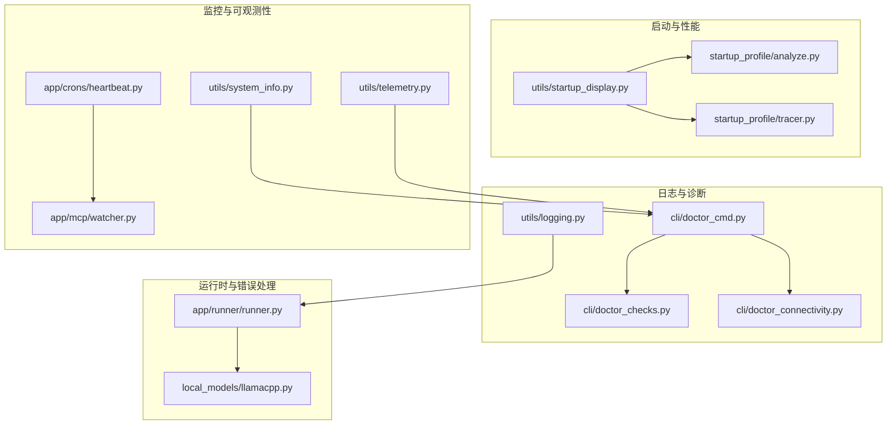
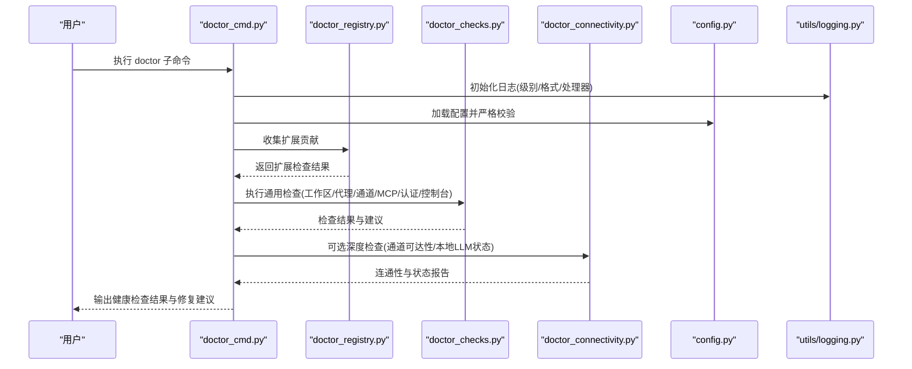
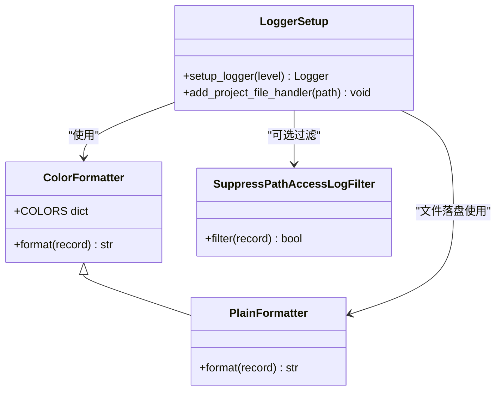
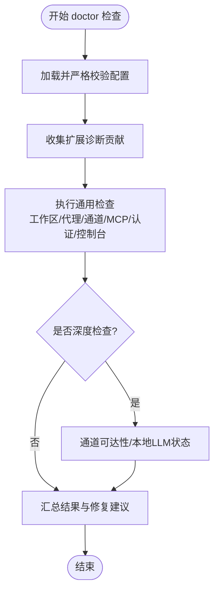
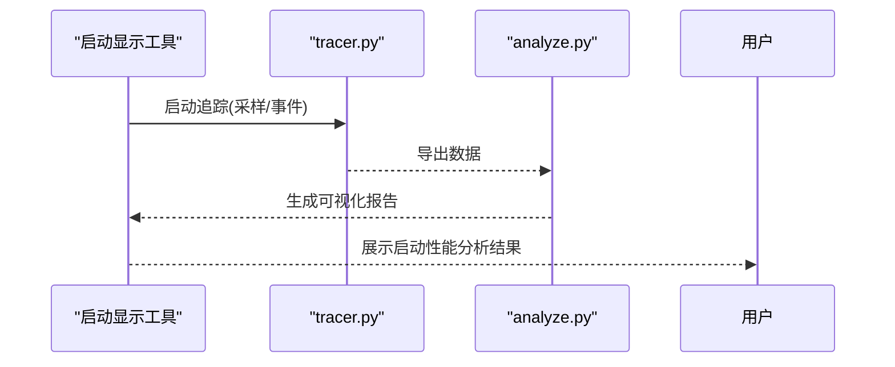
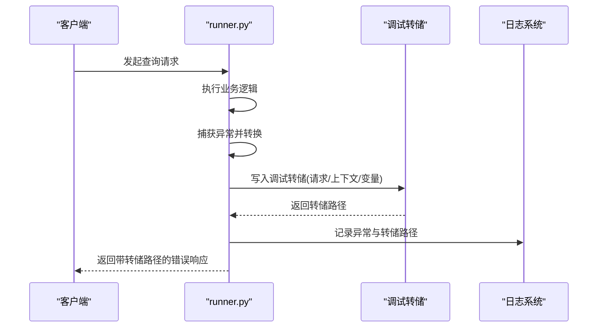
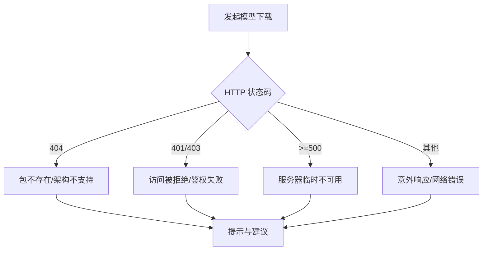
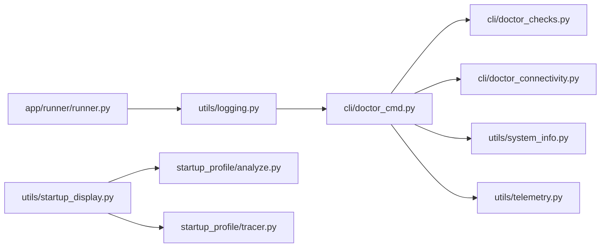

# 调试与性能分析

<cite>
**本文引用的文件**
- [src/qwenpaw/utils/logging.py](file://src/qwenpaw/utils/logging.py)
- [tests/unit/utils/test_logging.py](file://tests/unit/utils/test_logging.py)
- [src/qwenpaw/cli/doctor_cmd.py](file://src/qwenpaw/cli/doctor_cmd.py)
- [src/qwenpaw/cli/doctor_checks.py](file://src/qwenpaw/cli/doctor_checks.py)
- [src/qwenpaw/cli/doctor_connectivity.py](file://src/qwenpaw/cli/doctor_connectivity.py)
- [src/qwenpaw/app/runner/runner.py](file://src/qwenpaw/app/runner/runner.py)
- [src/qwenpaw/local_models/llamacpp.py](file://src/qwenpaw/local_models/llamacpp.py)
- [scripts/startup_profile/analyze.py](file://scripts/startup_profile/analyze.py)
- [scripts/startup_profile/tracer.py](file://scripts/startup_profile/tracer.py)
- [src/qwenpaw/utils/startup_display.py](file://src/qwenpaw/utils/startup_display.py)
- [src/qwenpaw/token_usage/manager.py](file://src/qwenpaw/token_usage/manager.py)
- [src/qwenpaw/token_usage/model_wrapper.py](file://src/qwenpaw/token_usage/model_wrapper.py)
- [src/qwenpaw/providers/provider_manager.py](file://src/qwenpaw/providers/provider_manager.py)
- [src/qwenpaw/providers/provider.py](file://src/qwenpaw/providers/provider.py)
- [src/qwenpaw/app/crons/heartbeat.py](file://src/qwenpaw/app/crons/heartbeat.py)
- [src/qwenpaw/app/mcp/watcher.py](file://src/qwenpaw/app/mcp/watcher.py)
- [src/qwenpaw/tunnel/cloudflare.py](file://src/qwenpaw/tunnel/cloudflare.py)
- [src/qwenpaw/app/channels/base.py](file://src/qwenpaw/app/channels/base.py)
- [src/qwenpaw/app/channels/manager.py](file://src/qwenpaw/app/channels/manager.py)
- [src/qwenpaw/utils/system_info.py](file://src/qwenpaw/utils/system_info.py)
- [src/qwenpaw/utils/telemetry.py](file://src/qwenpaw/utils/telemetry.py)
</cite>

## 目录
1. 引言
2. 项目结构
3. 核心组件
4. 架构总览
5. 详细组件分析
6. 依赖关系分析
7. 性能考量
8. 故障排查指南
9. 结论
10. 附录

## 引言
本指南面向开发者与运维人员，围绕 QwenPaw 的调试与性能分析提供系统化方法。内容涵盖日志系统配置与使用、doctor 命令的健康检查与修复建议、启动时间分析、内存与 CPU 监控、常见问题排查（网络、模型加载、通道连接）、生产环境监控与告警建议，以及性能优化最佳实践与代码级技巧。

## 项目结构
- 日志系统：位于 utils/logging.py，提供彩色终端输出、可选文件落盘、访问日志过滤等能力，并在单元测试中覆盖关键行为。
- 调试与诊断：CLI doctor 子命令及其扩展检查器，覆盖配置、工作区、代理配置、通道连通性、认证、控制台静态资源、MCP 等。
- 启动性能：startup_profile 脚本与启动显示工具，支持启动阶段性能分析与可视化。
- 运行时错误与调试：查询处理器捕获异常并生成调试转储文件，便于定位问题。
- 模型与通道：本地模型下载错误提示、通道基类与管理器、心跳与 MCP 观察者等。
- 监控与遥测：心跳、MCP 观察者、隧道、系统信息汇总、遥测开关等。

图表来源
- [src/qwenpaw/utils/logging.py:1-202](file://src/qwenpaw/utils/logging.py#L1-L202)
- [src/qwenpaw/cli/doctor_cmd.py:15-983](file://src/qwenpaw/cli/doctor_cmd.py#L15-L983)
- [src/qwenpaw/cli/doctor_checks.py](file://src/qwenpaw/cli/doctor_checks.py)
- [src/qwenpaw/cli/doctor_connectivity.py](file://src/qwenpaw/cli/doctor_connectivity.py)
- [src/qwenpaw/app/runner/runner.py:728-763](file://src/qwenpaw/app/runner/runner.py#L728-L763)
- [src/qwenpaw/local_models/llamacpp.py:625-657](file://src/qwenpaw/local_models/llamacpp.py#L625-L657)
- [scripts/startup_profile/analyze.py](file://scripts/startup_profile/analyze.py)
- [scripts/startup_profile/tracer.py](file://scripts/startup_profile/tracer.py)
- [src/qwenpaw/utils/startup_display.py](file://src/qwenpaw/utils/startup_display.py)
- [src/qwenpaw/app/crons/heartbeat.py](file://src/qwenpaw/app/crons/heartbeat.py)
- [src/qwenpaw/app/mcp/watcher.py](file://src/qwenpaw/app/mcp/watcher.py)
- [src/qwenpaw/utils/system_info.py](file://src/qwenpaw/utils/system_info.py)
- [src/qwenpaw/utils/telemetry.py](file://src/qwenpaw/utils/telemetry.py)

章节来源
- [src/qwenpaw/utils/logging.py:1-202](file://src/qwenpaw/utils/logging.py#L1-L202)
- [src/qwenpaw/cli/doctor_cmd.py:15-983](file://src/qwenpaw/cli/doctor_cmd.py#L15-L983)

## 核心组件
- 日志系统：支持按级别输出、终端 ANSI 彩色、相对路径格式化、访问日志过滤、跨平台文件句柄策略、可叠加文件落盘。
- Doctor 健康检查：集中式 CLI 子命令，覆盖配置校验、工作区权限、代理配置、通道连通性、认证、控制台静态资源、MCP、心跳等。
- 启动性能分析：启动追踪与分析脚本，结合启动显示工具，辅助定位启动瓶颈。
- 错误与调试：统一异常捕获与调试转储生成，保留上下文并输出到可发现位置。
- 模型与通道：本地模型下载错误分类提示；通道基类与管理器负责消息路由与状态维护。
- 监控与遥测：心跳任务、MCP 观察者、系统信息汇总、遥测开关，支撑生产可观测性。

章节来源
- [src/qwenpaw/utils/logging.py:124-202](file://src/qwenpaw/utils/logging.py#L124-L202)
- [src/qwenpaw/cli/doctor_cmd.py:941-983](file://src/qwenpaw/cli/doctor_cmd.py#L941-L983)
- [scripts/startup_profile/analyze.py](file://scripts/startup_profile/analyze.py)
- [scripts/startup_profile/tracer.py](file://scripts/startup_profile/tracer.py)
- [src/qwenpaw/app/runner/runner.py:728-763](file://src/qwenpaw/app/runner/runner.py#L728-L763)
- [src/qwenpaw/local_models/llamacpp.py:625-657](file://src/qwenpaw/local_models/llamacpp.py#L625-L657)

## 架构总览
下图展示从 CLI doctor 到各子系统检查器、再到具体实现的调用链路，以及日志系统在整个流程中的作用。

图表来源
- [src/qwenpaw/cli/doctor_cmd.py:941-983](file://src/qwenpaw/cli/doctor_cmd.py#L941-L983)
- [src/qwenpaw/cli/doctor_checks.py](file://src/qwenpaw/cli/doctor_checks.py)
- [src/qwenpaw/cli/doctor_connectivity.py](file://src/qwenpaw/cli/doctor_connectivity.py)
- [src/qwenpaw/utils/logging.py:124-202](file://src/qwenpaw/utils/logging.py#L124-L202)

## 详细组件分析

### 日志系统
- 功能要点
  - 级别映射：支持字符串级别到数值级别的转换，默认 INFO。
  - 终端输出：彩色格式化器，非 TTY 环境自动降级。
  - 访问日志过滤：可按路径片段抑制特定访问日志，避免噪声。
  - 文件落盘：跨平台策略（Windows/Linux 使用普通文件句柄，macOS 使用轮转文件句柄），幂等添加，避免重复句柄与句柄泄漏。
  - 命名空间隔离：仅输出项目命名空间下的日志，减少第三方库干扰。
- 使用建议
  - 开发调试：设置为较低级别（如 DEBUG）以获取更细粒度信息。
  - 生产环境：默认 INFO 或 WARNING，必要时通过文件落盘补充持久化日志。
  - 配合 doctor：doctor 在执行过程中会初始化日志，确保输出一致且可追溯。

图表来源
- [src/qwenpaw/utils/logging.py:87-202](file://src/qwenpaw/utils/logging.py#L87-L202)

章节来源
- [src/qwenpaw/utils/logging.py:17-202](file://src/qwenpaw/utils/logging.py#L17-L202)
- [tests/unit/utils/test_logging.py:1-194](file://tests/unit/utils/test_logging.py#L1-L194)

### Doctor 健康检查与修复
- 能力范围
  - 配置与工作区：检查配置文件、工作目录与工作区目录可写性、代理 JSON 配置与工作区布局。
  - 代理与模型：启用代理的可加载性与模型连接性检查。
  - 通道与连通性：通道可达性（可选深度检查），本地 llama.cpp 安装/服务状态提示。
  - 认证与控制台：Web 认证可用性、根路径响应健康度、控制台静态资源完整性与构建状态。
  - MCP 与安全基线：MCP 客户端状态、技能布局、安全基线提示。
  - 扩展贡献：支持外部扩展注册的诊断项。
- 修复建议
  - 提供“预览计划（dry-run）”与“应用计划”的分步修复流程，降低误操作风险。
  - 对于控制台静态资源缺失或版本不一致给出明确修复步骤与命令。

图表来源
- [src/qwenpaw/cli/doctor_cmd.py:941-983](file://src/qwenpaw/cli/doctor_cmd.py#L941-L983)
- [src/qwenpaw/cli/doctor_checks.py](file://src/qwenpaw/cli/doctor_checks.py)
- [src/qwenpaw/cli/doctor_connectivity.py](file://src/qwenpaw/cli/doctor_connectivity.py)

章节来源
- [src/qwenpaw/cli/doctor_cmd.py:15-983](file://src/qwenpaw/cli/doctor_cmd.py#L15-L983)

### 启动时间分析与启动显示
- 启动追踪与分析
  - 使用启动追踪脚本对启动过程进行采样与统计，配合分析脚本生成可视化报告，识别耗时热点。
- 启动显示
  - 启动显示工具用于在启动阶段输出进度与关键信息，便于人工观察与定位卡点。

图表来源
- [scripts/startup_profile/tracer.py](file://scripts/startup_profile/tracer.py)
- [scripts/startup_profile/analyze.py](file://scripts/startup_profile/analyze.py)
- [src/qwenpaw/utils/startup_display.py](file://src/qwenpaw/utils/startup_display.py)

章节来源
- [scripts/startup_profile/tracer.py](file://scripts/startup_profile/tracer.py)
- [scripts/startup_profile/analyze.py](file://scripts/startup_profile/analyze.py)
- [src/qwenpaw/utils/startup_display.py](file://src/qwenpaw/utils/startup_display.py)

### 运行时错误与调试转储
- 统一异常捕获
  - 查询处理器在发生异常时进行转换与记录，并生成调试转储文件，包含请求上下文与局部变量快照。
- 调试转储路径
  - 将转储路径附加到异常对象与消息中，便于快速定位与复现。

图表来源
- [src/qwenpaw/app/runner/runner.py:728-763](file://src/qwenpaw/app/runner/runner.py#L728-L763)
- [src/qwenpaw/utils/logging.py:124-202](file://src/qwenpaw/utils/logging.py#L124-L202)

章节来源
- [src/qwenpaw/app/runner/runner.py:728-763](file://src/qwenpaw/app/runner/runner.py#L728-L763)

### 模型加载与通道连接
- 本地模型下载错误分类
  - 针对 HTTP 状态码（404/401/403/5xx）与网络请求错误提供明确提示，帮助快速判断失败原因。
- 通道连接与状态
  - 通道基类与管理器负责消息路由、队列与状态管理；心跳与 MCP 观察者保障长连接稳定与可观测性。

图表来源
- [src/qwenpaw/local_models/llamacpp.py:625-657](file://src/qwenpaw/local_models/llamacpp.py#L625-L657)

章节来源
- [src/qwenpaw/local_models/llamacpp.py:625-657](file://src/qwenpaw/local_models/llamacpp.py#L625-L657)
- [src/qwenpaw/app/channels/base.py](file://src/qwenpaw/app/channels/base.py)
- [src/qwenpaw/app/channels/manager.py](file://src/qwenpaw/app/channels/manager.py)
- [src/qwenpaw/app/crons/heartbeat.py](file://src/qwenpaw/app/crons/heartbeat.py)
- [src/qwenpaw/app/mcp/watcher.py](file://src/qwenpaw/app/mcp/watcher.py)

## 依赖关系分析
- 日志系统被广泛使用于各模块，作为统一输出入口，保证一致性与可追溯性。
- doctor 命令依赖配置加载、系统信息汇总、网络连通性检查、MCP 与通道状态等子系统。
- 运行时错误处理依赖日志系统与调试转储工具，形成闭环的排障流程。
- 启动性能分析与启动显示工具相互配合，贯穿启动生命周期。

图表来源
- [src/qwenpaw/utils/logging.py:124-202](file://src/qwenpaw/utils/logging.py#L124-L202)
- [src/qwenpaw/cli/doctor_cmd.py:15-983](file://src/qwenpaw/cli/doctor_cmd.py#L15-L983)
- [src/qwenpaw/cli/doctor_checks.py](file://src/qwenpaw/cli/doctor_checks.py)
- [src/qwenpaw/cli/doctor_connectivity.py](file://src/qwenpaw/cli/doctor_connectivity.py)
- [src/qwenpaw/app/runner/runner.py:728-763](file://src/qwenpaw/app/runner/runner.py#L728-L763)
- [src/qwenpaw/utils/startup_display.py](file://src/qwenpaw/utils/startup_display.py)
- [scripts/startup_profile/analyze.py](file://scripts/startup_profile/analyze.py)
- [scripts/startup_profile/tracer.py](file://scripts/startup_profile/tracer.py)
- [src/qwenpaw/utils/system_info.py](file://src/qwenpaw/utils/system_info.py)
- [src/qwenpaw/utils/telemetry.py](file://src/qwenpaw/utils/telemetry.py)

章节来源
- [src/qwenpaw/utils/logging.py:124-202](file://src/qwenpaw/utils/logging.py#L124-L202)
- [src/qwenpaw/cli/doctor_cmd.py:15-983](file://src/qwenpaw/cli/doctor_cmd.py#L15-L983)

## 性能考量
- 启动性能
  - 使用启动追踪与分析脚本识别瓶颈；结合启动显示工具观察关键阶段耗时。
  - 优化建议：减少启动阶段 IO、延迟初始化非关键组件、合并异步初始化。
- 内存使用
  - 关注大对象生命周期与缓存策略；定期清理临时数据与未使用的句柄。
  - 对于本地模型加载，合理设置下载与缓存策略，避免重复下载与占用过多磁盘。
- CPU 性能
  - 限制并发与批处理大小，避免阻塞主线程；对 I/O 密集场景采用异步与队列。
  - 对热点函数进行采样分析，定位热点循环与频繁分配点。
- 日志开销
  - 在生产环境降低日志级别，避免高频 DEBUG/INFO 写盘；必要时使用文件落盘并启用轮转。

## 故障排查指南
- 网络连接问题
  - 使用 doctor 的深度检查项验证通道可达性与服务器响应；核对超时参数与代理设置。
  - 若为本地模型下载失败，依据错误分类提示（404/401/403/5xx/网络错误）逐项排查。
- 模型加载失败
  - 检查模型仓库地址、鉴权与网络连通性；确认硬件/系统版本兼容性。
  - 查看调试转储与日志，定位具体失败阶段与参数。
- 通道连接异常
  - 核对通道配置与凭证；检查心跳与观察者状态；关注队列积压与重试策略。
- 认证与控制台
  - 确认 Web 认证开关与用户注册状态；检查根路径响应与控制台静态资源构建状态。
- 通用步骤
  - 提升日志级别以获取更多信息；使用 doctor 的 dry-run 预览修复计划；必要时启用遥测收集更多上下文。

章节来源
- [src/qwenpaw/cli/doctor_cmd.py:941-983](file://src/qwenpaw/cli/doctor_cmd.py#L941-L983)
- [src/qwenpaw/local_models/llamacpp.py:625-657](file://src/qwenpaw/local_models/llamacpp.py#L625-L657)
- [src/qwenpaw/app/runner/runner.py:728-763](file://src/qwenpaw/app/runner/runner.py#L728-L763)
- [src/qwenpaw/app/crons/heartbeat.py](file://src/qwenpaw/app/crons/heartbeat.py)
- [src/qwenpaw/app/mcp/watcher.py](file://src/qwenpaw/app/mcp/watcher.py)

## 结论
通过统一的日志体系、完善的 doctor 健康检查、启动性能分析工具、运行时错误转储与可观测性组件，QwenPaw 提供了从开发到生产的全链路调试与性能分析能力。建议在开发阶段高频使用 doctor 与调试转储，在生产阶段结合日志级别、文件落盘与心跳/MCP 观察者，建立稳定的监控与告警机制。

## 附录
- 快速定位清单
  - 提升日志级别并复现问题，查看 doctor 报告与修复建议。
  - 生成调试转储并附带路径信息，优先排查最近一次请求。
  - 使用启动分析脚本定位启动瓶颈，优化关键路径。
  - 对网络/模型/通道问题，依据错误分类提示逐项验证。
- 生产监控与告警建议
  - 心跳与 MCP 观察者：设置阈值告警（连接断开、延迟升高、错误率上升）。
  - 日志：分级落盘、轮转与集中采集；对 ERROR/CRITICAL 设置即时告警。
  - 遥测：开启关键指标（启动耗时、请求延迟、错误率、内存/CPU 使用）。
  - 建议：将 doctor 作为部署后例行巡检命令纳入运维流程。