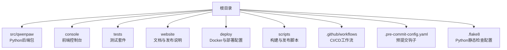
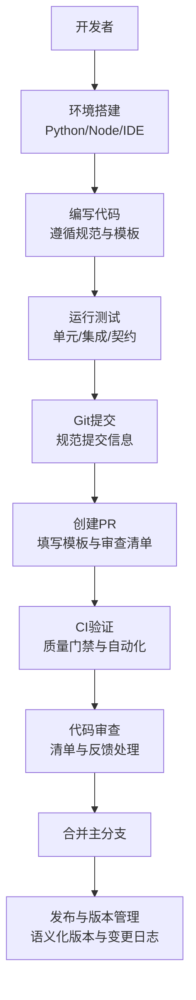
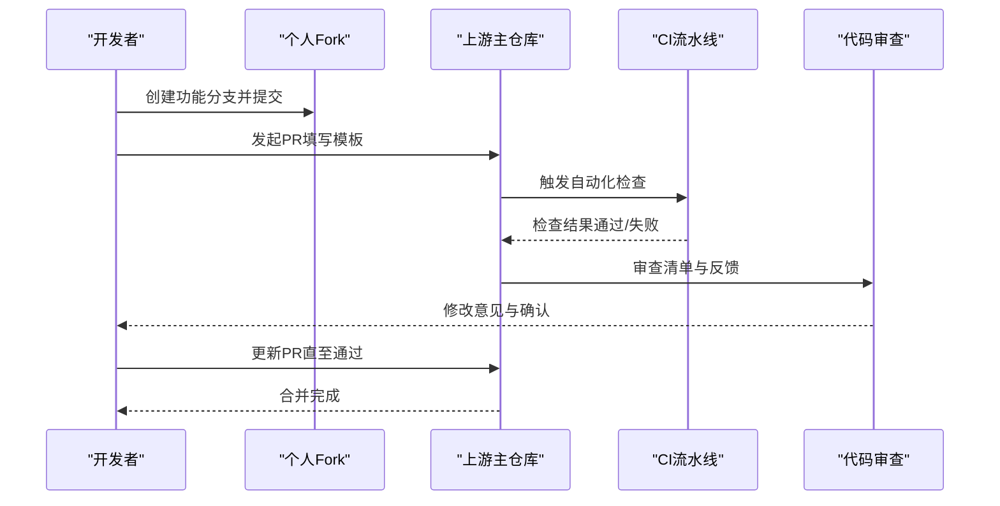
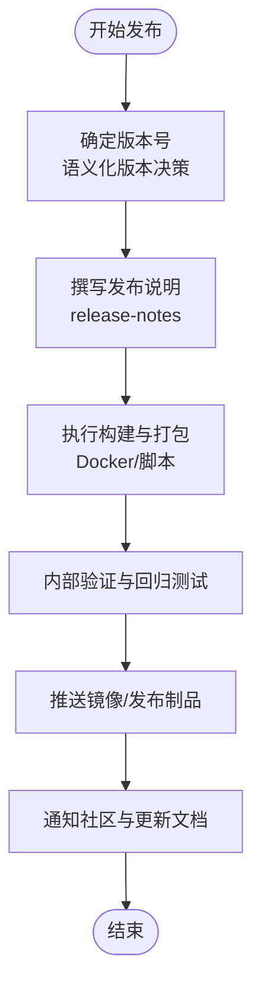
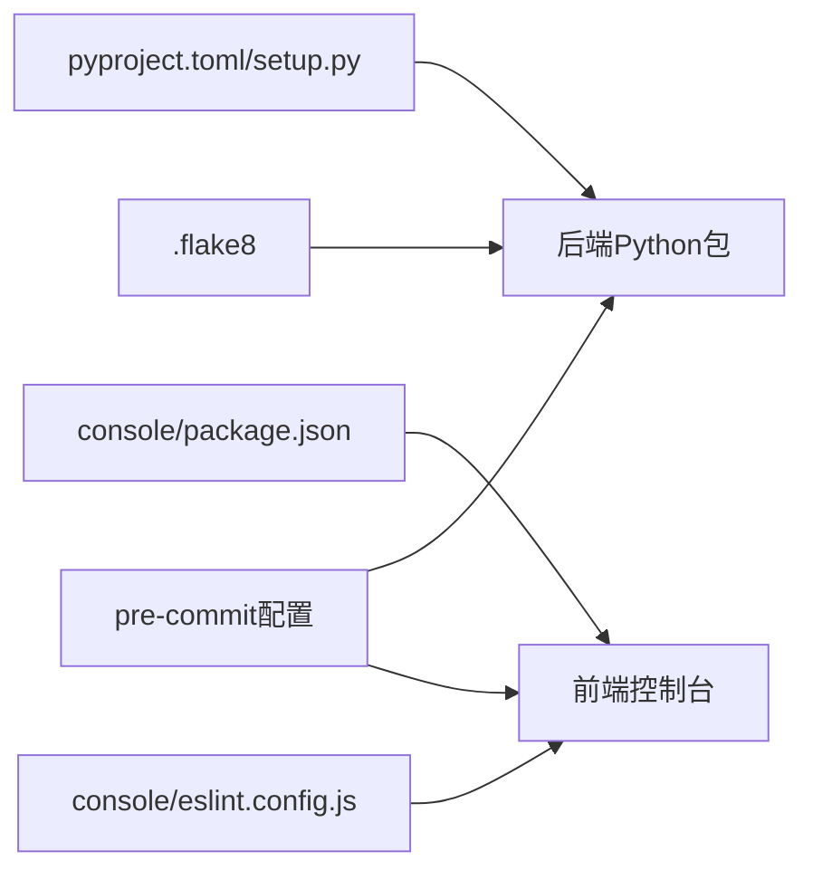

# 贡献流程

<cite>
**本文引用的文件**
- [CONTRIBUTING.md](file://CONTRIBUTING.md)
- [README.md](file://README.md)
- [README_zh.md](file://README_zh.md)
- [SECURITY.md](file://SECURITY.md)
- [.github/PULL_REQUEST_TEMPLATE.md](file://.github/PULL_REQUEST_TEMPLATE.md)
- [.github/workflows/](file://.github/workflows/)
- [.flake8](file://.flake8)
- [.pre-commit-config.yaml](file://.pre-commit-config.yaml)
- [pyproject.toml](file://pyproject.toml)
- [setup.py](file://setup.py)
- [Makefile](file://Makefile)
- [scripts/README.md](file://scripts/README.md)
- [scripts/run_tests.py](file://scripts/run_tests.py)
- [scripts/docker_build.sh](file://scripts/docker_build.sh)
- [scripts/docker_sync_latest.sh](file://scripts/docker_sync_latest.sh)
- [scripts/install.sh](file://scripts/install.sh)
- [scripts/install.bat](file://scripts/install.bat)
- [scripts/install.ps1](file://scripts/install.ps1)
- [src/qwenpaw/__version__.py](file://src/qwenpaw/__version__.py)
- [website/public/release-notes/](file://website/public/release-notes/)
- [console/eslint.config.js](file://console/eslint.config.js)
- [console/package.json](file://console/package.json)
- [console/tsconfig.app.json](file://console/tsconfig.app.json)
- [console/vite.config.ts](file://console/vite.config.ts)
- [deploy/Dockerfile](file://deploy/Dockerfile)
- [deploy/config/supervisord.conf.template](file://deploy/config/supervisord.conf.template)
- [deploy/entrypoint.sh](file://deploy/entrypoint.sh)
- [tests/contract/README.md](file://tests/contract/README.md)
- [tests/integration/test_app_startup.py](file://tests/integration/test_app_startup.py)
- [tests/unit/channels/README.md](file://tests/unit/channels/README.md)
- [website/public/docs/contributing.en.md](file://website/public/docs/contributing.en.md)
- [website/public/docs/contributing.zh.md](file://website/public/docs/contributing.zh.md)
</cite>

## 目录
1. [简介](#简介)
2. [项目结构](#项目结构)
3. [核心组件](#核心组件)
4. [架构总览](#架构总览)
5. [详细组件分析](#详细组件分析)
6. [依赖分析](#依赖分析)
7. [性能考虑](#性能考虑)
8. [故障排查指南](#故障排查指南)
9. [结论](#结论)
10. [附录](#附录)

## 简介
本指南面向新老贡献者，系统阐述QwenPaw项目的开发环境搭建、代码规范与风格、Git工作流、代码审查流程、发布与版本管理策略，以及常见问题与行为准则。文档内容基于仓库内现有贡献与发布相关文件整理而成，确保可操作性与一致性。

## 项目结构
QwenPaw采用多模块并行的工程组织方式：后端Python包位于src/qwenpaw，前端控制台位于console，测试体系覆盖单元、集成与契约测试，网站文档与发布说明位于website，部署与打包脚本位于deploy与scripts目录。CI/CD通过GitHub Actions工作流驱动，质量保障由Flake8、ESLint与预提交钩子共同保障。

**章节来源**
- [README.md](file://README.md)
- [README_zh.md](file://README_zh.md)
- [scripts/README.md](file://scripts/README.md)

## 核心组件
- 后端Python包：提供代理、渠道、任务调度、本地模型、安全扫描等核心能力，入口与版本信息见相应模块。
- 前端控制台：基于Vite+TypeScript构建，提供多语言界面与主题切换、页面布局与组件库。
- 测试体系：单元测试、集成测试与契约测试，覆盖渠道、提供商、本地模型与应用启动等关键路径。
- 文档与发布：网站docs与release-notes维护贡献指南与版本记录；发布脚本与Dockerfile支撑打包与容器化部署。
- CI/CD与质量门禁：GitHub Actions工作流、Flake8与ESLint、预提交钩子保障代码质量与一致性。

**章节来源**
- [src/qwenpaw/__version__.py](file://src/qwenpaw/__version__.py)
- [console/package.json](file://console/package.json)
- [tests/contract/README.md](file://tests/contract/README.md)
- [tests/integration/test_app_startup.py](file://tests/integration/test_app_startup.py)
- [website/public/docs/contributing.en.md](file://website/public/docs/contributing.en.md)
- [website/public/docs/contributing.zh.md](file://website/public/docs/contributing.zh.md)

## 架构总览
下图展示贡献流程的关键环节：从开发环境准备、代码编写与测试，到提交与PR审查，再到CI验证与发布。

## 详细组件分析

### 开发环境搭建
- Python与虚拟环境
  - 使用Python 3.10+，建议通过venv或conda创建隔离环境。
  - 安装后端依赖：参考项目根目录的依赖声明与安装脚本。
- Node.js与前端
  - 前端控制台使用Vite+TypeScript，依赖管理与构建配置在console目录中。
  - IDE建议启用ESLint与TypeScript检查，确保前端代码风格一致。
- IDE设置
  - Python：启用flake8检查与自动格式化（如Black/Isort）。
  - TypeScript：启用ESLint与Prettier，保持与eslint.config.js一致的规则。
  - Git：启用预提交钩子，避免不合规代码进入仓库。

**章节来源**
- [pyproject.toml](file://pyproject.toml)
- [setup.py](file://setup.py)
- [console/package.json](file://console/package.json)
- [console/tsconfig.app.json](file://console/tsconfig.app.json)
- [console/eslint.config.js](file://console/eslint.config.js)
- [scripts/install.sh](file://scripts/install.sh)
- [scripts/install.bat](file://scripts/install.bat)
- [scripts/install.ps1](file://scripts/install.ps1)

### 代码规范与风格指南
- Python
  - 遵循PEP8，使用Flake8作为静态检查工具，规则集中于根目录配置文件。
  - 导入顺序与格式化建议使用自动工具（如isort/black），减少人工分歧。
- TypeScript/JavaScript
  - 遵循ESLint规则，规则定义在console目录的配置文件中。
  - 统一使用TypeScript类型约束，保持接口与实现的一致性。
- 提交信息
  - 使用清晰、简洁的描述，说明变更动机与影响范围。
  - 参考现有提交历史，保持风格一致。

**章节来源**
- [.flake8](file://.flake8)
- [console/eslint.config.js](file://console/eslint.config.js)

### Git工作流程
- 分支策略
  - 主分支：稳定发布线，仅接受经审查的合并请求。
  - 功能分支：按功能或修复创建短期分支，完成后合并回主分支。
  - 发布分支：在版本发布前创建，用于紧急修复与最终校验。
- 提交信息格式
  - 类型：feat/fix/docs/style/refactor/test/build/ci等。
  - 范围：模块或子系统名称（如agents/channels/local_models）。
  - 描述：简明扼要说明变更内容，必要时补充背景与影响。
- Pull Request流程
  - 使用统一的PR模板，填写变更说明、测试方法与风险评估。
  - 关联Issue或需求，确保可追溯性。
  - 在CI通过与审查通过后方可合并。

**章节来源**
- [.github/PULL_REQUEST_TEMPLATE.md](file://.github/PULL_REQUEST_TEMPLATE.md)
- [.github/workflows/](file://.github/workflows/)

### 代码审查标准与流程
- 审查清单
  - 功能正确性：是否满足需求，边界条件与异常处理是否完备。
  - 代码质量：是否符合PEP8/TS规则，是否存在重复逻辑或坏味道。
  - 性能与安全性：是否存在潜在性能瓶颈或安全风险。
  - 测试覆盖：是否新增或更新了相关测试，测试是否可运行且有效。
  - 文档与注释：变更是否同步更新了文档与注释。
- 反馈处理
  - 对审查意见逐条响应，修改后重新触发CI与审查。
  - 保持沟通礼貌与高效，避免反复无意义的修改。

**章节来源**
- [CONTRIBUTING.md](file://CONTRIBUTING.md)
- [.github/PULL_REQUEST_TEMPLATE.md](file://.github/PULL_REQUEST_TEMPLATE.md)

### 发布流程与版本管理
- 版本策略
  - 采用语义化版本（SemVer），依据变更类型决定主/次/补丁版本号。
  - 重大破坏性变更应提升主版本号，并在发布说明中明确迁移指引。
- 变更日志
  - 在website/public/release-notes目录维护各版本的发布说明，包含新增、修复、改进与已知问题。
  - 变更日志应面向用户与贡献者，语言清晰、重点突出。
- 自动化发布
  - 使用CI工作流与发布脚本（如Docker构建与同步latest标签）实现一键打包与分发。
  - Docker镜像与入口脚本位于deploy目录，便于本地与生产部署。

**章节来源**
- [src/qwenpaw/__version__.py](file://src/qwenpaw/__version__.py)
- [website/public/release-notes/](file://website/public/release-notes/)
- [scripts/docker_build.sh](file://scripts/docker_build.sh)
- [scripts/docker_sync_latest.sh](file://scripts/docker_sync_latest.sh)
- [deploy/Dockerfile](file://deploy/Dockerfile)
- [deploy/entrypoint.sh](file://deploy/entrypoint.sh)

### 新贡献者入门指导
- 快速开始
  - 阅读项目README与贡献指南，了解整体目标与贡献方式。
  - 搭建开发环境，运行安装脚本与基础测试，确保本地可复现。
- 选择合适的任务
  - 从good first issue或help wanted标签的任务入手，逐步熟悉代码。
  - 优先关注测试覆盖率不足或文档缺失的模块。
- 提交与沟通
  - 提交前先在本地充分测试，遵循提交信息与PR模板要求。
  - 积极参与讨论，尊重审查意见，保持开放心态。

**章节来源**
- [README.md](file://README.md)
- [README_zh.md](file://README_zh.md)
- [CONTRIBUTING.md](file://CONTRIBUTING.md)
- [website/public/docs/contributing.en.md](file://website/public/docs/contributing.en.md)
- [website/public/docs/contributing.zh.md](file://website/public/docs/contributing.zh.md)

### 常见问题解答
- 如何运行测试？
  - 使用提供的测试脚本与Makefile目标，确保Python与Node环境均可用。
- 如何构建与打包？
  - 使用Dockerfile与打包脚本，或参考CI工作流中的构建步骤。
- 如何本地部署？
  - 参考部署脚本与supervisord模板，结合实际环境调整配置。
- 安全问题如何报告？
  - 请遵循安全政策，通过私有渠道提交，避免公开披露。

**章节来源**
- [scripts/run_tests.py](file://scripts/run_tests.py)
- [Makefile](file://Makefile)
- [SECURITY.md](file://SECURITY.md)
- [deploy/config/supervisord.conf.template](file://deploy/config/supervisord.conf.template)

## 依赖分析
- 后端依赖
  - 通过pyproject.toml与setup.py声明，建议使用虚拟环境隔离并锁定版本。
- 前端依赖
  - 通过package.json管理，使用Vite进行构建与开发服务器。
- 质量工具
  - Flake8用于Python静态检查，ESLint用于TypeScript/JS检查，预提交钩子在本地强制执行规则。

**章节来源**
- [pyproject.toml](file://pyproject.toml)
- [setup.py](file://setup.py)
- [console/package.json](file://console/package.json)
- [.flake8](file://.flake8)
- [console/eslint.config.js](file://console/eslint.config.js)
- [.pre-commit-config.yaml](file://.pre-commit-config.yaml)

## 性能考虑
- 代码层面
  - 避免不必要的全局状态与阻塞I/O，合理拆分函数职责，减少复杂度。
- 测试层面
  - 单元测试优先，集成测试聚焦关键路径，契约测试保证外部接口稳定性。
- 构建与部署
  - 使用缓存与增量构建，Docker层优化与镜像瘦身，缩短CI时间与部署体积。

## 故障排查指南
- 本地测试失败
  - 检查Python与Node依赖是否完整，运行测试脚本定位失败用例。
- CI失败
  - 查看工作流日志，重点关注静态检查与测试阶段的错误输出。
- 构建问题
  - 确认Dockerfile与构建脚本的环境变量与路径，必要时清理缓存重试。
- 安全与合规
  - 若发现安全漏洞，请遵循安全政策私下上报，避免在公共渠道披露。

**章节来源**
- [scripts/run_tests.py](file://scripts/run_tests.py)
- [tests/integration/test_app_startup.py](file://tests/integration/test_app_startup.py)
- [SECURITY.md](file://SECURITY.md)

## 结论
本指南提供了QwenPaw项目的完整贡献流程，涵盖环境搭建、规范与风格、Git工作流、审查流程、发布与版本管理以及常见问题。建议所有贡献者在提交任何变更前通读本指南，并严格遵循其中的流程与规范，以确保项目的高质量与可持续发展。

## 附录
- 行为准则
  - 尊重与包容：营造开放、友好的社区氛围。
  - 建设性反馈：以事实为基础提出改进建议。
  - 共同维护：积极协助他人，推动项目健康发展。
- 联系方式
  - 通过Issue或PR模板与维护者沟通，遵守安全披露政策。