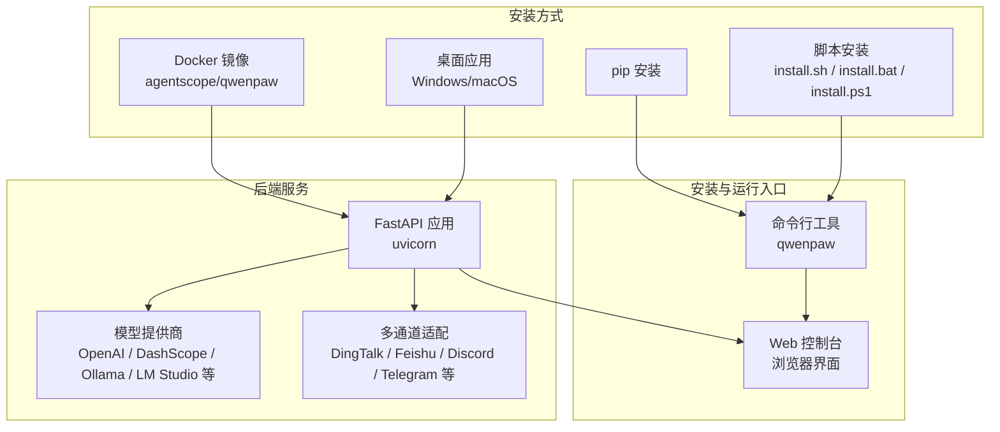
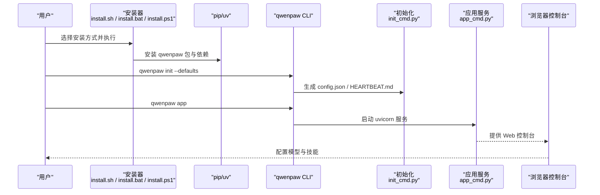

# 快速开始

<cite>
**本文引用的文件**
- [README.md](file://README.md)
- [install.sh](file://scripts/install.sh)
- [install.bat](file://scripts/install.bat)
- [install.ps1](file://scripts/install.ps1)
- [Dockerfile](file://deploy/Dockerfile)
- [docker-compose.yml](file://docker-compose.yml)
- [pyproject.toml](file://pyproject.toml)
- [init_cmd.py](file://src/qwenpaw/cli/init_cmd.py)
- [app_cmd.py](file://src/qwenpaw/cli/app_cmd.py)
- [doctor_cmd.py](file://src/qwenpaw/cli/doctor_cmd.py)
- [doctor_checks.py](file://src/qwenpaw/cli/doctor_checks.py)
- [__version__.py](file://src/qwenpaw/__version__.py)
- [README.md](file://scripts/pack/README.md)
</cite>

## 目录
1. [简介](#简介)
2. [项目结构](#项目结构)
3. [核心组件](#核心组件)
4. [架构总览](#架构总览)
5. [详细组件分析](#详细组件分析)
6. [依赖分析](#依赖分析)
7. [性能考虑](#性能考虑)
8. [故障排除指南](#故障排除指南)
9. [结论](#结论)
10. [附录](#附录)

## 简介
本指南面向首次接触 QwenPaw 的用户，帮助你在最短时间内完成安装与初始配置，并成功运行 Web 控制台进行聊天与多通道连接。文档覆盖以下安装方式与场景：
- pip 安装（适合已有 Python 环境的用户）
- 脚本安装（自动处理 uv、虚拟环境与前端构建）
- Docker 部署（容器化一键运行）
- 桌面应用安装（无需命令行，开箱即用）
- 本地模型设置（无需 API Key，离线运行）
- API 密钥配置与 Docker 网络配置
- 常见问题与故障排除

## 项目结构
QwenPaw 提供了多条安装路径与运行方式，核心入口为命令行工具 qwenpaw，配合内置 Web 控制台与多通道适配层。

图示来源
- [README.md:114-128](file://README.md#L114-L128)
- [Dockerfile:101-103](file://deploy/Dockerfile#L101-L103)
- [app_cmd.py:104-111](file://src/qwenpaw/cli/app_cmd.py#L104-L111)

章节来源
- [README.md:114-128](file://README.md#L114-L128)
- [Dockerfile:101-103](file://deploy/Dockerfile#L101-L103)
- [app_cmd.py:104-111](file://src/qwenpaw/cli/app_cmd.py#L104-L111)

## 核心组件
- 命令行工具 qwenpaw：提供 init、app、doctor 等子命令，用于初始化配置、启动服务与诊断。
- Web 控制台：通过浏览器访问 http://127.0.0.1:8088，完成模型与技能配置。
- 模型提供商管理：支持云端与本地模型（如 Ollama、LM Studio、llama.cpp）。
- 多通道适配：支持 DingTalk、Feishu、QQ、Discord、Telegram 等即时通讯平台。
- Docker 镜像：内置前端构建产物与运行时依赖，一键暴露 8088 端口。

章节来源
- [init_cmd.py:138-523](file://src/qwenpaw/cli/init_cmd.py#L138-L523)
- [app_cmd.py:15-112](file://src/qwenpaw/cli/app_cmd.py#L15-L112)
- [Dockerfile:1-104](file://deploy/Dockerfile#L1-L104)

## 架构总览
下图展示从安装到运行的关键流程与组件交互：

图示来源
- [install.sh:259-277](file://scripts/install.sh#L259-L277)
- [install.bat:472-502](file://scripts/install.bat#L472-L502)
- [install.ps1:336-373](file://scripts/install.ps1#L336-L373)
- [init_cmd.py:138-523](file://src/qwenpaw/cli/init_cmd.py#L138-L523)
- [app_cmd.py:104-111](file://src/qwenpaw/cli/app_cmd.py#L104-L111)

章节来源
- [install.sh:259-277](file://scripts/install.sh#L259-L277)
- [install.bat:472-502](file://scripts/install.bat#L472-L502)
- [install.ps1:336-373](file://scripts/install.ps1#L336-L373)
- [init_cmd.py:138-523](file://src/qwenpaw/cli/init_cmd.py#L138-L523)
- [app_cmd.py:104-111](file://src/qwenpaw/cli/app_cmd.py#L104-L111)

## 详细组件分析

### 方式一：pip 安装（推荐给已有 Python 环境的用户）
- 适用场景
  - 已安装 Python 3.10–3.13，且可使用 pip/uv 管理包。
  - 希望直接在系统环境中安装与升级。
- 前置条件
  - Python 版本满足要求；网络可访问 PyPI。
- 步骤
  1) 安装包：pip install qwenpaw
  2) 初始化：qwenpaw init --defaults
  3) 启动：qwenpaw app
  4) 在浏览器打开 http://127.0.0.1:8088 配置模型与技能。
- 初始配置要点
  - API Key：在控制台 Settings → Models 中配置所需提供商的密钥。
  - 环境变量：也可通过环境变量传入（如 DASHSCOPE_API_KEY）。
  - 本地模型：如需离线运行，可在 Console → Settings → Models 中选择本地模型后下载并使用。

章节来源
- [README.md:116-128](file://README.md#L116-L128)
- [init_cmd.py:335-360](file://src/qwenpaw/cli/init_cmd.py#L335-L360)
- [app_cmd.py:15-112](file://src/qwenpaw/cli/app_cmd.py#L15-L112)

### 方式二：脚本安装（无需手动配置 Python 环境）
- 适用场景
  - 不想安装 Python 或 uv，希望自动化处理虚拟环境与前端构建。
  - macOS/Linux：curl -fsSL https://qwenpaw.agentscope.io/install.sh | bash
  - Windows（CMD）：curl -fsSL https://qwenpaw.agentscope.io/install.bat -o install.bat && install.bat
  - Windows（PowerShell）：irm https://qwenpaw.agentscope.io/install.ps1 | iex
- 前置条件
  - 网络可访问安装源；Windows 可能受限于企业防火墙或 Constrained Language Mode。
- 步骤
  1) 执行安装脚本（自动检测 uv 并创建虚拟环境）
  2) 新终端中运行 qwenpaw init --defaults
  3) 运行 qwenpaw app
- 特殊提示（Windows 企业版）
  - Constrained Language Mode 可能导致脚本无法自动更新 PATH 或下载 uv，需按提示手动添加路径或重新执行安装脚本。

章节来源
- [README.md:132-184](file://README.md#L132-L184)
- [install.sh:104-134](file://scripts/install.sh#L104-L134)
- [install.bat:163-225](file://scripts/install.bat#L163-L225)
- [install.ps1:121-191](file://scripts/install.ps1#L121-L191)

### 方式三：Docker 部署（容器化一键运行）
- 适用场景
  - 希望以容器方式快速部署，持久化配置与数据，便于迁移与备份。
- 前置条件
  - 已安装 Docker；如需访问宿主机上的本地模型服务（Ollama/LM Studio），需正确配置网络。
- 步骤
  1) 拉取镜像：docker pull agentscope/qwenpaw:latest
  2) 运行容器：映射端口与卷（工作目录、密钥目录、备份目录）
  3) 访问 http://127.0.0.1:8088
- Docker 网络配置
  - 容器内 localhost 指向容器自身，如需访问宿主机服务（如 Ollama/LM Studio），可使用：
    - 显式主机绑定：--add-host=host.docker.internal:host-gateway
    - 主机网络模式：--network=host（仅 Linux）
- 环境变量注入
  - 可通过 -e VAR=value 或 --env-file .env 将 API Key 等注入容器。

章节来源
- [README.md:228-272](file://README.md#L228-L272)
- [Dockerfile:1-104](file://deploy/Dockerfile#L1-L104)
- [docker-compose.yml:1-26](file://docker-compose.yml#L1-L26)

### 方式四：桌面应用安装（Beta，无需命令行）
- 适用场景
  - 不熟悉命令行，希望双击即可运行；支持 Windows 10+ 与 macOS 14+。
- 前置条件
  - 从 GitHub Releases 下载对应版本；macOS 可能出现 Gatekeeper 提示，按提示允许或右键打开。
- 步骤
  1) 下载并解压（macOS）或安装（Windows）
  2) 双击应用，等待初始化与浏览器打开
  3) 首次启动可能耗时较长，属正常现象
- 故障排查
  - macOS “无法验证”提示：右键打开或在系统设置中允许
  - 启动崩溃：查看 ~/.qwenpaw/desktop.log 获取错误信息

章节来源
- [README.md:288-330](file://README.md#L288-L330)
- [README.md:45-73](file://scripts/pack/README.md#L45-L73)

### API 密钥配置
- 控制台配置（推荐）
  - 启动 qwenpaw app 后，打开 http://127.0.0.1:8088 → Settings → Models，选择提供商并填写 API Key。
- 初始化时配置
  - qwenpaw init 会引导你选择提供商并输入密钥。
- 环境变量
  - 对 DashScope 可设置 DASHSCOPE_API_KEY；其他工具类密钥可在 Settings → Environment variables 中配置。

章节来源
- [README.md:333-346](file://README.md#L333-L346)
- [init_cmd.py:335-360](file://src/qwenpaw/cli/init_cmd.py#L335-L360)

### 本地模型设置
- 支持后端
  - llama.cpp：无需额外安装，Web UI 中可一键下载
  - Ollama：需先安装并启动 Ollama 服务
  - LM Studio：需先安装并启动 LM Studio 服务
- 使用建议
  - 本地模型无需 API Key，适合隐私敏感场景；如需远程模型，按上述方式配置 API Key。

章节来源
- [README.md:347-356](file://README.md#L347-L356)

## 依赖分析
- Python 版本与依赖
  - Python 版本范围：>=3.10,<3.14
  - 关键依赖：agentscope、uvicorn、playwright、discord-py、dingtalk-stream、matrix-nio、transformers、onnxruntime、pyyaml、cryptography 等
- 可选依赖
  - dev：pytest、pre-commit 等
  - local：huggingface_hub
  - whisper：openai-whisper
  - full：同时启用 local 与 whisper
- 安装入口
  - pip 安装：pip install qwenpaw
  - 开发安装：pip install -e .
  - Docker：镜像内置前端构建与运行时依赖

章节来源
- [pyproject.toml:1-147](file://pyproject.toml#L1-L147)
- [Dockerfile:83-90](file://deploy/Dockerfile#L83-L90)

## 性能考虑
- 日志与磁盘空间
  - 启动时会检查日志文件可写与工作目录磁盘剩余空间，低空间可能导致写入失败或状态损坏。
- 浏览器自动化
  - Playwright 需要 Chromium/Chrome；容器环境建议安装 Chromium 或使用默认无头模式。
- 多工作空间与大提示文件
  - 大型提示文件与大量对话/工具结果会占用上下文与存储，建议定期清理或归档。

章节来源
- [doctor_checks.py:88-121](file://src/qwenpaw/cli/doctor_checks.py#L88-L121)
- [doctor_checks.py:436-527](file://src/qwenpaw/cli/doctor_checks.py#L436-L527)
- [doctor_checks.py:585-656](file://src/qwenpaw/cli/doctor_checks.py#L585-L656)

## 故障排除指南
- 常见问题定位
  - 使用 qwenpaw doctor 进行只读诊断，检查配置、工作目录、日志可写性、浏览器自动化准备、安全基线、内存嵌入等。
  - 使用 qwenpaw doctor fix 可对部分问题进行保守修复（需备份与确认）。
- 具体场景
  - 控制台不可用：检查 console 前端静态资源是否存在，或设置 CONSOLE_STATIC_ENV 指向包含 index.html 的目录。
  - Web 登录认证：若开启 Web 认证，需先注册账户或通过环境变量预设凭据。
  - 本地模型连接失败：根据 active LLM 检查提示调整 Base URL 或服务状态。
- Windows 企业版特殊提示
  - Constrained Language Mode 可能导致脚本无法自动更新 PATH 或下载 uv，需手动添加路径或重新执行安装脚本。

章节来源
- [doctor_cmd.py:370-800](file://src/qwenpaw/cli/doctor_cmd.py#L370-L800)
- [doctor_checks.py:184-243](file://src/qwenpaw/cli/doctor_checks.py#L184-L243)
- [doctor_checks.py:728-747](file://src/qwenpaw/cli/doctor_checks.py#L728-L747)
- [README.md:156-178](file://README.md#L156-L178)

## 结论
通过以上多种安装方式与初始配置指引，你可以快速在本地或容器环境中启动 QwenPaw，并在 Web 控制台中完成模型与技能的配置。遇到问题时，借助 doctor 命令与常见问题排查清单，可高效定位并解决问题。随着使用深入，可逐步扩展多通道、多代理协作与自定义技能，构建贴身的个人智能助理。

## 附录

### 快速命令参考
- pip 安装与运行
  - pip install qwenpaw
  - qwenpaw init --defaults
  - qwenpaw app
- 脚本安装（Windows/PowerShell）
  - irm https://qwenpaw.agentscope.io/install.ps1 | iex
  - qwenpaw init --defaults
  - qwenpaw app
- Docker 运行
  - docker run -p 127.0.0.1:8088:8088 -v qwenpaw-data:/app/working -v qwenpaw-secrets:/app/working.secret -v qwenpaw-backups:/app/working.backups agentscope/qwenpaw:latest
- 桌面应用
  - 下载 Releases 对应版本，双击运行，首次启动稍作等待

章节来源
- [README.md:116-128](file://README.md#L116-L128)
- [README.md:132-184](file://README.md#L132-L184)
- [README.md:228-272](file://README.md#L228-L272)
- [README.md:288-330](file://README.md#L288-L330)