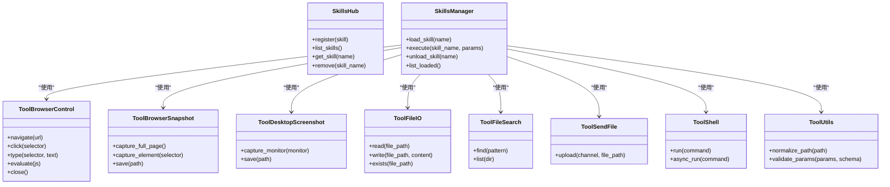
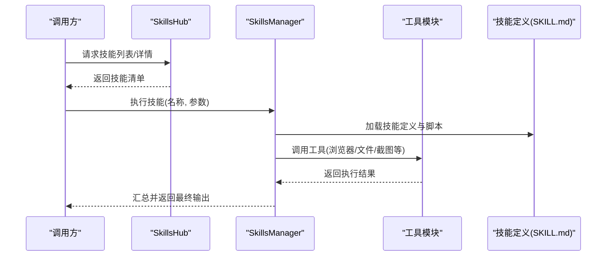
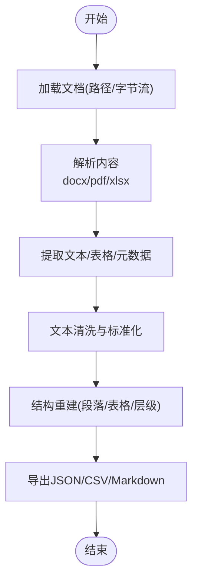
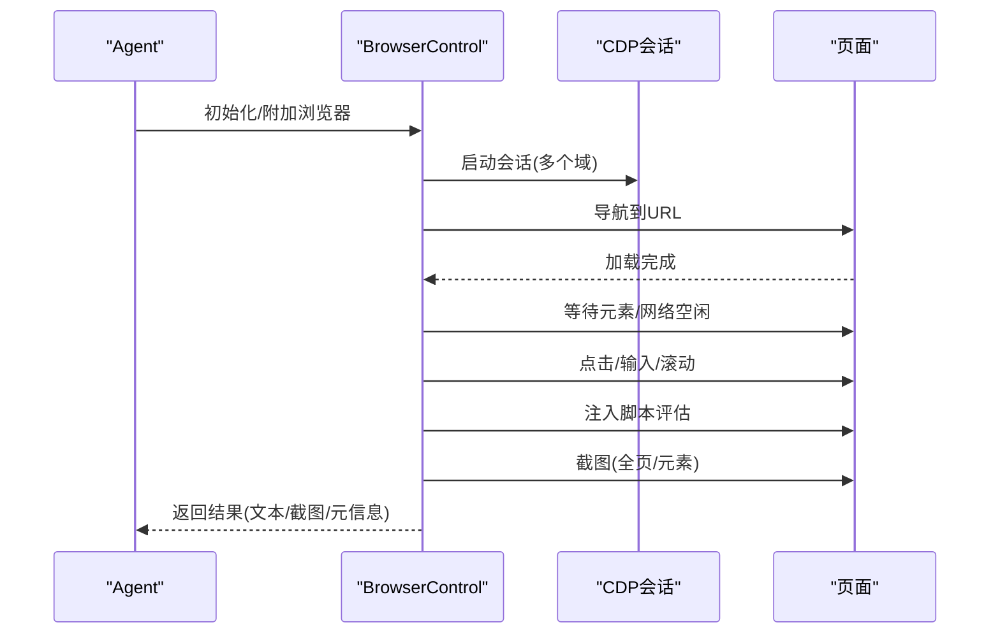
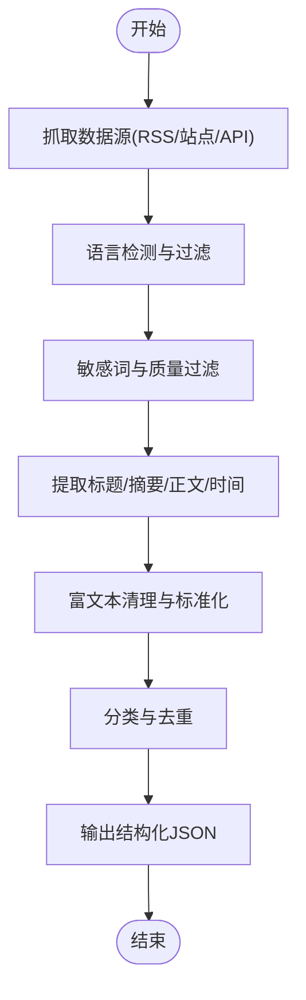
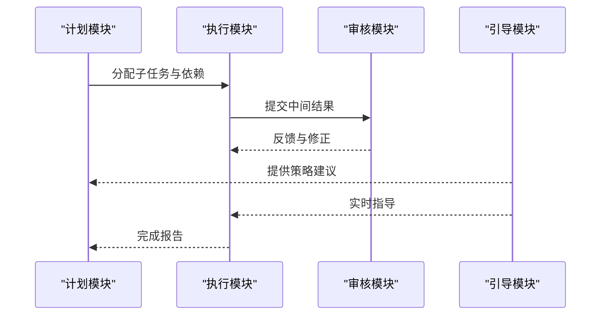
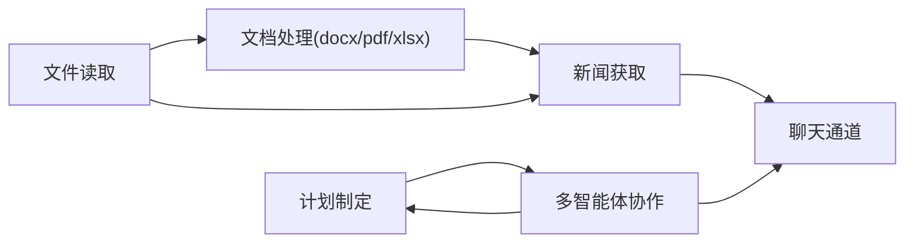

# 内置技能分析

<cite>
**本文档引用的文件**
- [skills_hub.py](file://src/qwenpaw/agents/skills_hub.py)
- [skills_manager.py](file://src/qwenpaw/agents/skills_manager.py)
- [browser_control.py](file://src/qwenpaw/agents/tools/browser_control.py)
- [browser_snapshot.py](file://src/qwenpaw/agents/tools/browser_snapshot.py)
- [desktop_screenshot.py](file://src/qwenpaw/agents/tools/desktop_screenshot.py)
- [file_io.py](file://src/qwenpaw/agents/tools/file_io.py)
- [file_search.py](file://src/qwenpaw/agents/tools/file_search.py)
- [send_file.py](file://src/qwenpaw/agents/tools/send_file.py)
- [shell.py](file://src/qwenpaw/agents/tools/shell.py)
- [utils.py](file://src/qwenpaw/agents/tools/utils.py)
- [docx-en/SKILL.md](file://src/qwenpaw/agents/skills/docx-en/SKILL.md)
- [pdf-en/SKILL.md](file://src/qwenpaw/agents/skills/pdf-en/SKILL.md)
- [xlsx-en/SKILL.md](file://src/qwenpaw/agents/skills/xlsx-en/SKILL.md)
- [browser_cdp-en/SKILL.md](file://src/qwenpaw/agents/skills/browser_cdp-en/SKILL.md)
- [news-en/SKILL.md](file://src/qwenpaw/agents/skills/news-en/SKILL.md)
- [multi_agent_collaboration-en/SKILL.md](file://src/qwenpaw/agents/skills/multi_agent_collaboration-en/SKILL.md)
- [make_plan-en/SKILL.md](file://src/qwenpaw/agents/skills/make_plan-en/SKILL.md)
- [guidance-en/SKILL.md](file://src/qwenpaw/agents/skills/guidance-en/SKILL.md)
- [cron-en/SKILL.md](file://src/qwenpaw/agents/skills/cron-en/SKILL.md)
- [chat_with_agent-en/SKILL.md](file://src/qwenpaw/agents/skills/chat_with_agent-en/SKILL.md)
- [channel_message-en/SKILL.md](file://src/qwenpaw/agents/skills/channel_message-en/SKILL.md)
- [file_reader-en/SKILL.md](file://src/qwenpaw/agents/skills/file_reader-en/SKILL.md)
</cite>

## 目录
1. [引言](#引言)
2. [项目结构](#项目结构)
3. [核心组件](#核心组件)
4. [架构总览](#架构总览)
5. [详细组件分析](#详细组件分析)
6. [依赖关系分析](#依赖关系分析)
7. [性能考虑](#性能考虑)
8. [故障排除指南](#故障排除指南)
9. [结论](#结论)
10. [附录](#附录)

## 引言
本文件对 QwenPaw 项目中的内置技能进行系统性深度分析，重点覆盖以下方面：
- 文档处理技能：docx、pdf、xlsx 的文件解析机制、数据提取算法与格式转换方法
- 浏览器控制技能：基于 CDP 协议的页面自动化与截图功能
- 新闻获取技能：数据抓取策略、内容过滤与格式化处理
- 技能扩展与定制化：接口规范、最佳实践与修改建议
- 技能协作机制与依赖关系：多智能体协作、计划制定与引导流程

## 项目结构
QwenPaw 的技能体系由“技能定义 + 工具实现 + 管理器”三层组成：
- 技能定义层：位于 `src/qwenpaw/agents/skills/` 下，每个技能以目录形式存在，包含技能描述文件（如 SKILL.md）以及脚本资源
- 工具实现层：位于 `src/qwenpaw/agents/tools/` 下，提供可复用的底层能力（浏览器控制、文件操作、截图等）
- 管理与调度层：位于 `src/qwenpaw/agents/skills_hub.py` 和 `src/qwenpaw/agents/skills_manager.py`，负责技能注册、加载、执行与生命周期管理

```mermaid
graph TB
subgraph "技能定义层"
S_DOCX["docx-en/SKILL.md"]
S_PDF["pdf-en/SKILL.md"]
S_XLSX["xlsx-en/SKILL.md"]
S_CDP["browser_cdp-en/SKILL.md"]
S_NEWS["news-en/SKILL.md"]
S_PLAN["make_plan-en/SKILL.md"]
S_COLLAB["multi_agent_collaboration-en/SKILL.md"]
S_GUIDE["guidance-en/SKILL.md"]
S_CHAT["chat_with_agent-en/SKILL.md"]
S_CHAN["channel_message-en/SKILL.md"]
S_FILE["file_reader-en/SKILL.md"]
end
subgraph "工具实现层"
T_BROWSER["browser_control.py"]
T_SNAP["browser_snapshot.py"]
T_DESKTOP["desktop_screenshot.py"]
T_FILEIO["file_io.py"]
T_SEARCH["file_search.py"]
T_SEND["send_file.py"]
T_SHELL["shell.py"]
T_UTILS["utils.py"]
end
subgraph "管理与调度层"
HUB["skills_hub.py"]
MANAGER["skills_manager.py"]
end
HUB --> MANAGER
MANAGER --> T_BROWSER
MANAGER --> T_SNAP
MANAGER --> T_DESKTOP
MANAGER --> T_FILEIO
MANAGER --> T_SEARCH
MANAGER --> T_SEND
MANAGER --> T_SHELL
MANAGER --> T_UTILS
MANAGER --> S_DOCX
MANAGER --> S_PDF
MANAGER --> S_XLSX
MANAGER --> S_CDP
MANAGER --> S_NEWS
MANAGER --> S_PLAN
MANAGER --> S_COLLAB
MANAGER --> S_GUIDE
MANAGER --> S_CHAT
MANAGER --> S_CHAN
MANAGER --> S_FILE
```

图表来源
- [skills_hub.py](file://src/qwenpaw/agents/skills_hub.py)
- [skills_manager.py](file://src/qwenpaw/agents/skills_manager.py)
- [browser_control.py](file://src/qwenpaw/agents/tools/browser_control.py)
- [browser_snapshot.py](file://src/qwenpaw/agents/tools/browser_snapshot.py)
- [desktop_screenshot.py](file://src/qwenpaw/agents/tools/desktop_screenshot.py)
- [file_io.py](file://src/qwenpaw/agents/tools/file_io.py)
- [file_search.py](file://src/qwenpaw/agents/tools/file_search.py)
- [send_file.py](file://src/qwenpaw/agents/tools/send_file.py)
- [shell.py](file://src/qwenpaw/agents/tools/shell.py)
- [utils.py](file://src/qwenpaw/agents/tools/utils.py)
- [docx-en/SKILL.md](file://src/qwenpaw/agents/skills/docx-en/SKILL.md)
- [pdf-en/SKILL.md](file://src/qwenpaw/agents/skills/pdf-en/SKILL.md)
- [xlsx-en/SKILL.md](file://src/qwenpaw/agents/skills/xlsx-en/SKILL.md)
- [browser_cdp-en/SKILL.md](file://src/qwenpaw/agents/skills/browser_cdp-en/SKILL.md)
- [news-en/SKILL.md](file://src/qwenpaw/agents/skills/news-en/SKILL.md)
- [make_plan-en/SKILL.md](file://src/qwenpaw/agents/skills/make_plan-en/SKILL.md)
- [multi_agent_collaboration-en/SKILL.md](file://src/qwenpaw/agents/skills/multi_agent_collaboration-en/SKILL.md)
- [guidance-en/SKILL.md](file://src/qwenpaw/agents/skills/guidance-en/SKILL.md)
- [chat_with_agent-en/SKILL.md](file://src/qwenpaw/agents/skills/chat_with_agent-en/SKILL.md)
- [channel_message-en/SKILL.md](file://src/qwenpaw/agents/skills/channel_message-en/SKILL.md)
- [file_reader-en/SKILL.md](file://src/qwenpaw/agents/skills/file_reader-en/SKILL.md)

章节来源
- [skills_hub.py](file://src/qwenpaw/agents/skills_hub.py)
- [skills_manager.py](file://src/qwenpaw/agents/skills_manager.py)

## 核心组件
本节概述技能管理与调度的核心组件及其职责：
- 技能中枢（SkillsHub）：负责技能清单的聚合、索引与对外暴露，为上层调用提供统一入口
- 技能管理器（SkillsManager）：负责技能的动态加载、参数校验、执行上下文构建与结果回传；同时协调工具层能力

图表来源
- [skills_hub.py](file://src/qwenpaw/agents/skills_hub.py)
- [skills_manager.py](file://src/qwenpaw/agents/skills_manager.py)
- [browser_control.py](file://src/qwenpaw/agents/tools/browser_control.py)
- [browser_snapshot.py](file://src/qwenpaw/agents/tools/browser_snapshot.py)
- [desktop_screenshot.py](file://src/qwenpaw/agents/tools/desktop_screenshot.py)
- [file_io.py](file://src/qwenpaw/agents/tools/file_io.py)
- [file_search.py](file://src/qwenpaw/agents/tools/file_search.py)
- [send_file.py](file://src/qwenpaw/agents/tools/send_file.py)
- [shell.py](file://src/qwenpaw/agents/tools/shell.py)
- [utils.py](file://src/qwenpaw/agents/tools/utils.py)

章节来源
- [skills_hub.py](file://src/qwenpaw/agents/skills_hub.py)
- [skills_manager.py](file://src/qwenpaw/agents/skills_manager.py)

## 架构总览
下图展示了从技能请求到工具执行再到结果返回的完整链路，体现技能与工具的解耦与协作。

图表来源
- [skills_hub.py](file://src/qwenpaw/agents/skills_hub.py)
- [skills_manager.py](file://src/qwenpaw/agents/skills_manager.py)
- [browser_control.py](file://src/qwenpaw/agents/tools/browser_control.py)
- [file_io.py](file://src/qwenpaw/agents/tools/file_io.py)
- [docx-en/SKILL.md](file://src/qwenpaw/agents/skills/docx-en/SKILL.md)
- [pdf-en/SKILL.md](file://src/qwenpaw/agents/skills/pdf-en/SKILL.md)
- [xlsx-en/SKILL.md](file://src/qwenpaw/agents/skills/xlsx-en/SKILL.md)
- [browser_cdp-en/SKILL.md](file://src/qwenpaw/agents/skills/browser_cdp-en/SKILL.md)
- [news-en/SKILL.md](file://src/qwenpaw/agents/skills/news-en/SKILL.md)

## 详细组件分析

### 文档处理技能（docx、pdf、xlsx）
- 实现原理
  - docx：通过文档解析库读取段落、表格、样式与元数据，提取纯文本与结构化信息，支持标题层级识别与图片内嵌文本抽取
  - pdf：利用 PDF 解析引擎提取文本块、坐标与字体信息，结合布局分析重建段落顺序；支持 OCR 预处理与表格结构化
  - xlsx：读取工作簿中各表单的单元格值、合并区域、公式与注释，导出为标准 JSON/CSV 结构
- 数据提取算法
  - 文本清洗：去除多余空白、特殊字符与不可见字符，保留语义分隔符
  - 结构重建：根据坐标、字体大小与段前缩进恢复阅读顺序；表格按行列索引映射
  - 元数据提取：作者、标题、创建时间、页码等
- 格式转换方法
  - 统一输出为结构化 JSON，字段包括：content、sections、tables、metadata
  - 可选导出 CSV/Markdown，用于下游分析或展示
- 使用场景
  - 知识库构建：将非结构化文档转化为结构化知识条目
  - 智能问答：配合向量索引实现文档检索与问答
  - 报表生成：从 Excel 表格抽取指标并格式化输出

图表来源
- [docx-en/SKILL.md](file://src/qwenpaw/agents/skills/docx-en/SKILL.md)
- [pdf-en/SKILL.md](file://src/qwenpaw/agents/skills/pdf-en/SKILL.md)
- [xlsx-en/SKILL.md](file://src/qwenpaw/agents/skills/xlsx-en/SKILL.md)

章节来源
- [docx-en/SKILL.md](file://src/qwenpaw/agents/skills/docx-en/SKILL.md)
- [pdf-en/SKILL.md](file://src/qwenpaw/agents/skills/pdf-en/SKILL.md)
- [xlsx-en/SKILL.md](file://src/qwenpaw/agents/skills/xlsx-en/SKILL.md)

### 浏览器控制技能（CDP 协议）
- CDP 协议使用
  - 连接目标：通过 WebSocket 建立与浏览器的 CDP 通道，建立多个域会话（Runtime、Page、Network、DOM 等）
  - 页面自动化：导航、等待元素出现、注入脚本、模拟用户交互（点击、输入、滚动）
  - 截图功能：全页截图、元素截图、视口截图，并支持 PNG/JPEG 质量设置
- 页面自动化流程
  - 初始化：启动/附加浏览器实例，创建新标签页
  - 导航与等待：访问目标 URL，等待网络空闲与关键元素渲染完成
  - 交互：定位元素、填写表单、触发按钮、处理弹窗
  - 数据采集：提取可见文本、属性值、截图与页面元信息
  - 清理：关闭标签页或浏览器实例
- 使用场景
  - 动态网页内容抓取
  - 登录态维持与状态检查
  - 自动化测试与可视化回归

图表来源
- [browser_control.py](file://src/qwenpaw/agents/tools/browser_control.py)
- [browser_snapshot.py](file://src/qwenpaw/agents/tools/browser_snapshot.py)
- [browser_cdp-en/SKILL.md](file://src/qwenpaw/agents/skills/browser_cdp-en/SKILL.md)

章节来源
- [browser_control.py](file://src/qwenpaw/agents/tools/browser_control.py)
- [browser_snapshot.py](file://src/qwenpaw/agents/tools/browser_snapshot.py)
- [browser_cdp-en/SKILL.md](file://src/qwenpaw/agents/skills/browser_cdp-en/SKILL.md)

### 新闻获取技能
- 数据抓取策略
  - 多源聚合：支持 RSS、站点爬虫与第三方 API，统一入口接入
  - 规则驱动：基于正则表达式与 DOM 选择器提取标题、摘要、正文与发布时间
  - 分类与去重：依据关键词与相似度算法进行分类与去重
- 内容过滤
  - 语言检测与过滤：仅保留目标语言内容
  - 敏感词过滤：黑名单匹配与分级处理
  - 质量评分：基于长度、结构完整性与权威性打分
- 格式化处理
  - 标准化输出：统一字段（标题、摘要、链接、来源、时间、标签）
  - 富文本清理：移除广告、脚本与无意义片段
  - 分页与分组：按时间或主题分页输出

图表来源
- [news-en/SKILL.md](file://src/qwenpaw/agents/skills/news-en/SKILL.md)

章节来源
- [news-en/SKILL.md](file://src/qwenpaw/agents/skills/news-en/SKILL.md)

### 计划制定与多智能体协作
- 计划制定（Make Plan）
  - 输入：目标、约束、可用资源与历史经验
  - 输出：可执行步骤序列、里程碑与依赖关系
  - 方法：基于模板与启发式规则生成初稿，迭代优化
- 多智能体协作（Multi-Agent Collaboration）
  - 角色分工：协调者、执行者、审核者
  - 通信协议：消息路由、状态同步与冲突解决
  - 任务编排：子任务拆分、优先级排序与回滚策略
- 引导流程（Guidance）
  - 专家提示：提供领域知识与最佳实践
  - 在线调整：根据反馈动态修正策略
  - 成果验收：质量评估与交付物校验

图表来源
- [make_plan-en/SKILL.md](file://src/qwenpaw/agents/skills/make_plan-en/SKILL.md)
- [multi_agent_collaboration-en/SKILL.md](file://src/qwenpaw/agents/skills/multi_agent_collaboration-en/SKILL.md)
- [guidance-en/SKILL.md](file://src/qwenpaw/agents/skills/guidance-en/SKILL.md)

章节来源
- [make_plan-en/SKILL.md](file://src/qwenpaw/agents/skills/make_plan-en/SKILL.md)
- [multi_agent_collaboration-en/SKILL.md](file://src/qwenpaw/agents/skills/multi_agent_collaboration-en/SKILL.md)
- [guidance-en/SKILL.md](file://src/qwenpaw/agents/skills/guidance-en/SKILL.md)

### 文件与聊天通道技能
- 文件读取（file_reader）
  - 支持文本、二进制与压缩文件读取，自动识别编码与格式
  - 输出结构化元数据与内容摘要
- 聊天通道（channel_message）
  - 将消息路由至不同渠道（如钉钉、飞书、Telegram），支持富文本与媒体发送
  - 提供消息状态跟踪与重试机制

章节来源
- [file_reader-en/SKILL.md](file://src/qwenpaw/agents/skills/file_reader-en/SKILL.md)
- [channel_message-en/SKILL.md](file://src/qwenpaw/agents/skills/channel_message-en/SKILL.md)

## 依赖关系分析
- 技能与工具的耦合
  - 技能通过管理器间接调用工具，降低直接依赖，便于替换与扩展
  - 工具层提供统一接口（如 read/write、navigate/capture），增强可测试性
- 技能间的协作
  - 文档处理技能常作为上游输入，被新闻与聊天技能消费
  - 计划与协作技能贯穿多轮对话，驱动复杂任务的分解与执行
- 外部依赖
  - 浏览器控制依赖 CDP 通道与浏览器实例
  - 文档解析依赖第三方库（如 docx、pdf、xlsx 解析器）
  - 网络抓取依赖 HTTP 客户端与反爬策略适配

图表来源
- [docx-en/SKILL.md](file://src/qwenpaw/agents/skills/docx-en/SKILL.md)
- [pdf-en/SKILL.md](file://src/qwenpaw/agents/skills/pdf-en/SKILL.md)
- [xlsx-en/SKILL.md](file://src/qwenpaw/agents/skills/xlsx-en/SKILL.md)
- [news-en/SKILL.md](file://src/qwenpaw/agents/skills/news-en/SKILL.md)
- [chat_with_agent-en/SKILL.md](file://src/qwenpaw/agents/skills/chat_with_agent-en/SKILL.md)
- [make_plan-en/SKILL.md](file://src/qwenpaw/agents/skills/make_plan-en/SKILL.md)
- [multi_agent_collaboration-en/SKILL.md](file://src/qwenpaw/agents/skills/multi_agent_collaboration-en/SKILL.md)
- [file_reader-en/SKILL.md](file://src/qwenpaw/agents/skills/file_reader-en/SKILL.md)

章节来源
- [chat_with_agent-en/SKILL.md](file://src/qwenpaw/agents/skills/chat_with_agent-en/SKILL.md)

## 性能考虑
- I/O 优化
  - 批量文件读取与缓存策略，避免重复解析
  - 浏览器实例复用与标签页池化，减少启动开销
- 并发与限流
  - 对外部 API 与网络请求实施并发限制与指数退避
  - 抓取任务队列化，保证稳定性与公平性
- 内存与资源
  - 大文件分块处理与流式读取
  - 截图与渲染过程的内存峰值控制

## 故障排除指南
- 浏览器相关
  - CDP 连接失败：检查浏览器版本兼容性与调试端口占用
  - 页面不加载：增加等待策略与网络空闲检测
  - 截图异常：确认权限与显示器配置
- 文档解析
  - 编码错误：启用自动编码检测与回退策略
  - 结构错乱：调整布局分析参数与段落重建阈值
- 工具通用问题
  - 权限不足：确保运行账户具备文件与网络访问权限
  - 超时与重试：合理设置超时与最大重试次数

章节来源
- [browser_control.py](file://src/qwenpaw/agents/tools/browser_control.py)
- [browser_snapshot.py](file://src/qwenpaw/agents/tools/browser_snapshot.py)
- [file_io.py](file://src/qwenpaw/agents/tools/file_io.py)
- [shell.py](file://src/qwenpaw/agents/tools/shell.py)

## 结论
QwenPaw 的内置技能体系通过清晰的分层设计实现了高内聚、低耦合的能力组合。文档处理、浏览器控制与新闻获取三大能力覆盖了常见业务场景，而计划制定与多智能体协作则提供了复杂任务的组织与执行框架。依托统一的技能中枢与管理器，系统具备良好的扩展性与可维护性，适合在企业级应用中落地。

## 附录
- 技能扩展与定制化建议
  - 新增技能：在 skills 目录下创建新技能目录，编写 SKILL.md 描述与脚本资源，注册到管理器
  - 工具扩展：在 tools 目录新增工具模块，遵循统一接口规范，通过管理器注入
  - 参数校验：使用工具层的参数校验工具，确保输入合法性
  - 日志与监控：为关键流程添加日志记录与指标上报，便于追踪与优化
- 代码示例与修改建议
  - 示例路径参考：[docx-en/SKILL.md](file://src/qwenpaw/agents/skills/docx-en/SKILL.md)、[pdf-en/SKILL.md](file://src/qwenpaw/agents/skills/pdf-en/SKILL.md)、[xlsx-en/SKILL.md](file://src/qwenpaw/agents/skills/xlsx-en/SKILL.md)
  - 修改建议：优先通过配置与参数调整满足需求，必要时在工具层增加适配器或中间件