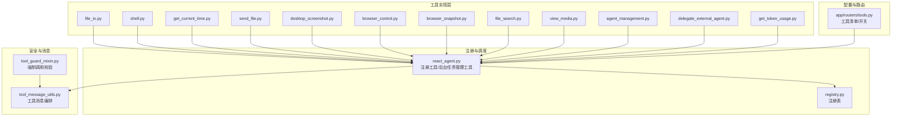
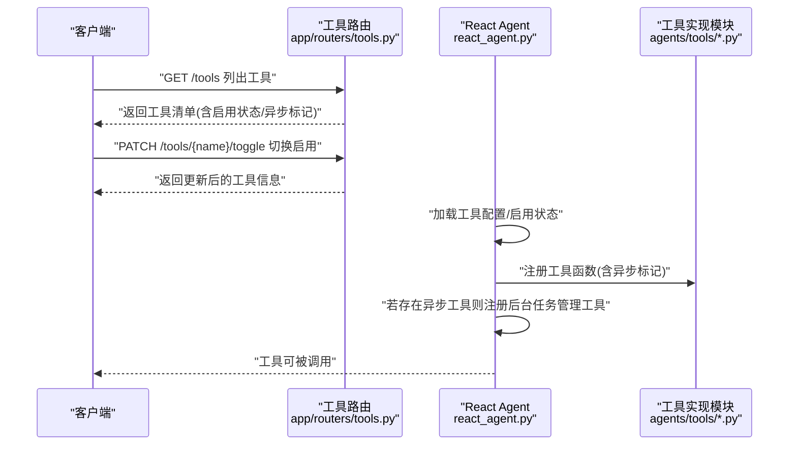
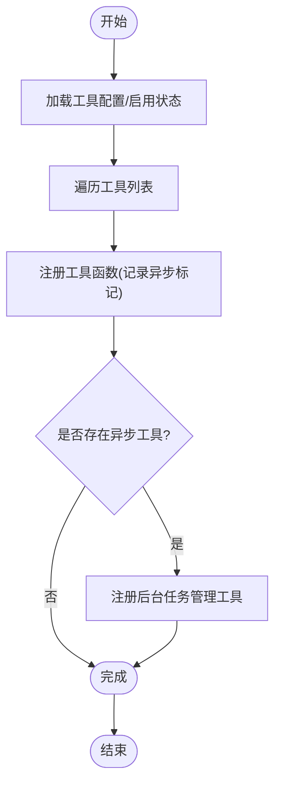
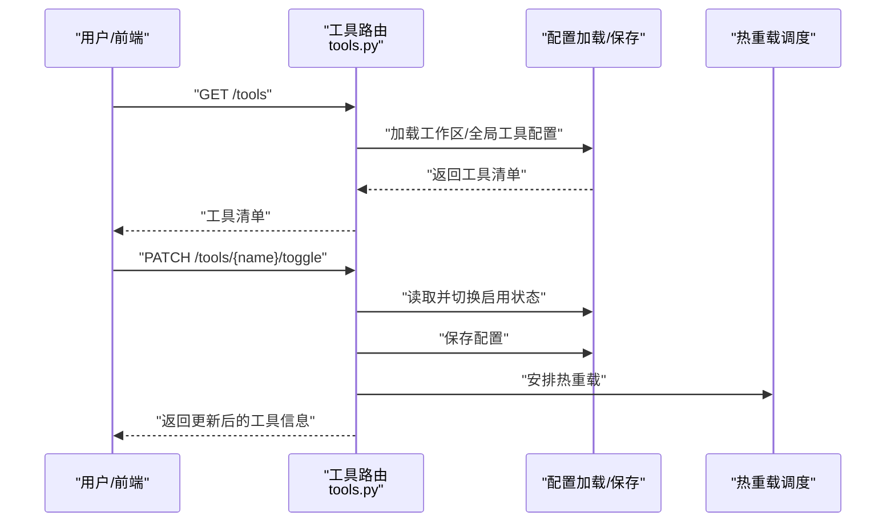
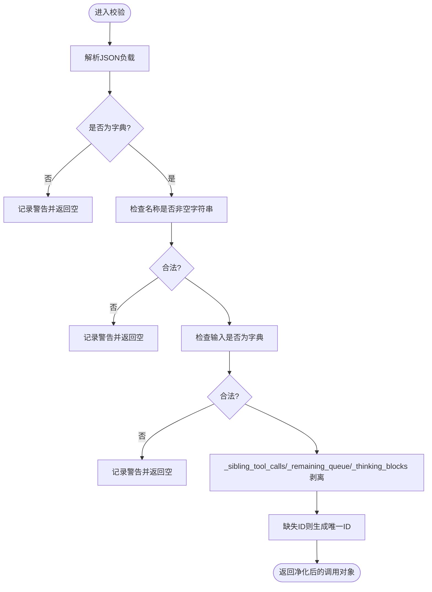
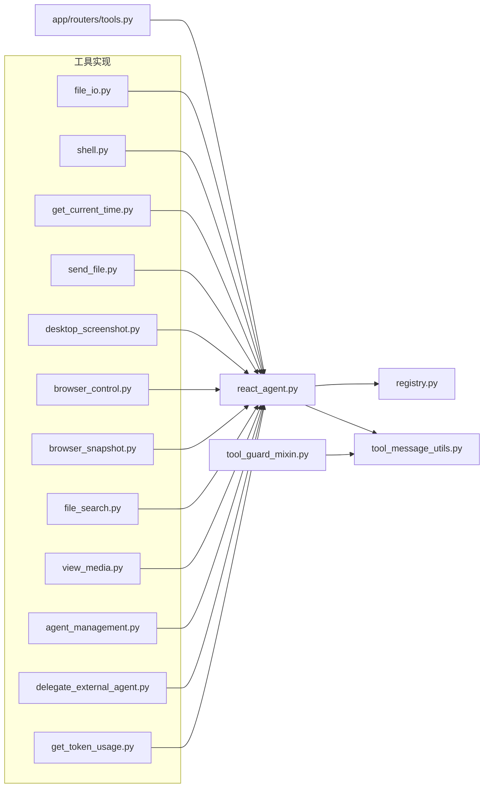

# 工具开发指南

<cite>
**本文引用的文件**
- [react_agent.py](file://src/qwenpaw/agents/react_agent.py)
- [tools.py](file://src/qwenpaw/app/routers/tools.py)
- [tool_guard_mixin.py](file://src/qwenpaw/agents/tool_guard_mixin.py)
- [__init__.py](file://src/qwenpaw/agents/tools/__init__.py)
- [file_io.py](file://src/qwenpaw/agents/tools/file_io.py)
- [shell.py](file://src/qwenpaw/agents/tools/shell.py)
- [get_current_time.py](file://src/qwenpaw/agents/tools/get_current_time.py)
- [send_file.py](file://src/qwenpaw/agents/tools/send_file.py)
- [desktop_screenshot.py](file://src/qwenpaw/agents/tools/desktop_screenshot.py)
- [browser_control.py](file://src/qwenpaw/agents/tools/browser_control.py)
- [browser_snapshot.py](file://src/qwenpaw/agents/tools/browser_snapshot.py)
- [file_search.py](file://src/qwenpaw/agents/tools/file_search.py)
- [view_media.py](file://src/qwenpaw/agents/tools/view_media.py)
- [agent_management.py](file://src/qwenpaw/agents/tools/agent_management.py)
- [delegate_external_agent.py](file://src/qwenpaw/agents/tools/delegate_external_agent.py)
- [get_token_usage.py](file://src/qwenpaw/agents/tools/get_token_usage.py)
- [utils.py](file://src/qwenpaw/agents/tools/utils.py)
- [tool_message_utils.py](file://src/qwenpaw/agents/utils/tool_message_utils.py)
- [registry.py](file://src/qwenpaw/agents/utils/registry.py)
- [Makefile](file://Makefile)
- [test_openai_stream_toolcall_compat.py](file://tests/unit/providers/test_openai_stream_toolcall_compat.py)
</cite>

## 目录
1. [简介](#简介)
2. [项目结构](#项目结构)
3. [核心组件](#核心组件)
4. [架构总览](#架构总览)
5. [详细组件分析](#详细组件分析)
6. [依赖关系分析](#依赖关系分析)
7. [性能考量](#性能考量)
8. [故障排查指南](#故障排查指南)
9. [结论](#结论)
10. [附录](#附录)

## 简介
本指南面向希望在本项目中开发与集成“工具”的工程师，系统阐述工具的定义规范、实现模式、最佳实践与安全策略。内容覆盖工具类设计原则、参数与返回值规范、错误处理与异常管理、注册流程、元数据配置与依赖声明，并通过多种典型场景（文件操作、网络请求、系统调用、浏览器控制、截图、媒体查看、代理委派等）给出实现参考路径与测试方法。

## 项目结构
工具体系围绕“工具实现 + 注册与调度 + 安全与消息编排 + 配置与路由”四个维度组织：
- 工具实现：位于 agents/tools 下，每个工具为独立模块，遵循统一的输入输出与异常约定。
- 注册与调度：由 React Agent 在运行时将工具函数注册到工具箱，并根据异步执行标记自动挂载后台任务管理工具。
- 安全与消息编排：工具守卫对强制调用进行校验与净化；工具消息工具负责构造与解析工具调用消息。
- 配置与路由：后端提供工具清单查询与开关切换接口，支持热更新。

图表来源
- [react_agent.py:286-325](file://src/qwenpaw/agents/react_agent.py#L286-L325)
- [tools.py:48-126](file://src/qwenpaw/app/routers/tools.py#L48-L126)
- [tool_guard_mixin.py:148-183](file://src/qwenpaw/agents/tool_guard_mixin.py#L148-L183)
- [tool_message_utils.py](file://src/qwenpaw/agents/utils/tool_message_utils.py)
- [registry.py](file://src/qwenpaw/agents/utils/registry.py)

章节来源
- [react_agent.py:286-325](file://src/qwenpaw/agents/react_agent.py#L286-L325)
- [tools.py:48-126](file://src/qwenpaw/app/routers/tools.py#L48-L126)

## 核心组件
- 工具注册与调度
  - 运行时将工具函数注册到工具箱，支持命名冲突策略与异步执行标记。
  - 若存在异步工具，自动注册后台任务管理工具（查看、等待、取消）。
- 工具清单与开关
  - 提供工具清单查询接口，支持按工具名开关启用状态，热更新生效。
- 工具守卫
  - 对强制调用负载进行合法性校验，确保名称、输入类型与必要字段有效。
- 工具消息编排
  - 负责构造与解析工具调用消息，保证与模型输出格式一致。
- 工具实现
  - 每个工具模块遵循统一的输入/输出与异常约定，便于测试与复用。

章节来源
- [react_agent.py:286-325](file://src/qwenpaw/agents/react_agent.py#L286-L325)
- [tools.py:48-126](file://src/qwenpaw/app/routers/tools.py#L48-L126)
- [tool_guard_mixin.py:148-183](file://src/qwenpaw/agents/tool_guard_mixin.py#L148-L183)
- [tool_message_utils.py](file://src/qwenpaw/agents/utils/tool_message_utils.py)

## 架构总览
下图展示了从“工具清单查询/开关”到“工具注册/调度/后台任务管理”的整体流程。

图表来源
- [tools.py:48-126](file://src/qwenpaw/app/routers/tools.py#L48-L126)
- [react_agent.py:286-325](file://src/qwenpaw/agents/react_agent.py#L286-L325)

## 详细组件分析

### 工具注册与后台任务管理
- 注册流程
  - 从配置加载工具列表，逐项注册到工具箱，记录异步执行标记。
  - 自动检测是否存在异步工具，如存在则注册后台任务管理工具（查看、等待、取消）。
- 异常处理
  - 后台任务管理工具注册失败时记录警告日志，不影响其他工具注册。
- 命名策略
  - 支持命名冲突策略，避免同名工具覆盖。

图表来源
- [react_agent.py:286-325](file://src/qwenpaw/agents/react_agent.py#L286-L325)

章节来源
- [react_agent.py:286-325](file://src/qwenpaw/agents/react_agent.py#L286-L325)

### 工具清单与开关接口
- 清单查询
  - 优先使用当前工作区的工具配置；若不存在，则回退到全局配置。
  - 返回工具名称、启用状态、描述、异步执行标记与图标等元数据。
- 开关切换
  - 校验工具存在性，切换启用状态并保存配置。
  - 触发异步热重载，立即返回乐观更新结果。

图表来源
- [tools.py:48-126](file://src/qwenpaw/app/routers/tools.py#L48-L126)

章节来源
- [tools.py:48-126](file://src/qwenpaw/app/routers/tools.py#L48-L126)

### 工具守卫与强制调用校验
- 输入校验
  - 校验强制调用负载是否为字典、名称是否非空字符串、输入是否为字典。
- 安全增强
  - 从负载中剥离内部字段（如兄弟工具调用、剩余队列、思考片段），生成唯一 ID（若缺失）。
- 日志与容错
  - 对非法负载记录警告并返回空，避免影响后续流程。

图表来源
- [tool_guard_mixin.py:148-183](file://src/qwenpaw/agents/tool_guard_mixin.py#L148-L183)

章节来源
- [tool_guard_mixin.py:148-183](file://src/qwenpaw/agents/tool_guard_mixin.py#L148-L183)

### 工具消息编排
- 职责
  - 统一构造工具调用消息与解析工具返回消息，保证与模型输出格式一致。
- 价值
  - 降低工具与模型交互的耦合度，提升可维护性与可测试性。

章节来源
- [tool_message_utils.py](file://src/qwenpaw/agents/utils/tool_message_utils.py)

### 工具实现范式与最佳实践
- 设计原则
  - 单一职责：每个工具聚焦一类能力（如文件读写、系统命令、时间获取、媒体查看等）。
  - 明确输入/输出：参数与返回值应有清晰的契约，便于测试与文档化。
  - 错误处理：捕获并转换为统一异常类型，保留上下文信息，避免泄露敏感细节。
  - 可观测性：记录关键事件与耗时，便于定位问题。
- 参数与返回值规范
  - 输入参数：以字典形式传入，键名语义明确；对必填参数进行显式校验。
  - 返回值：统一为结构化数据（字典或列表），包含成功标志与可选的错误信息。
- 异常管理策略
  - 将底层异常包装为领域异常，携带原始错误码与提示信息。
  - 对可恢复错误采用重试策略，不可恢复错误快速失败并记录。
- 注册与依赖声明
  - 工具在运行时注册到工具箱，无需硬编码导入；可通过配置控制启用状态。
  - 工具之间尽量无直接依赖，必要时通过消息传递或共享服务解耦。

章节来源
- [utils.py](file://src/qwenpaw/agents/tools/utils.py)

### 典型工具实现参考路径
- 文件操作
  - 读写文件：参考 [file_io.py](file://src/qwenpaw/agents/tools/file_io.py)
  - 文件搜索：参考 [file_search.py](file://src/qwenpaw/agents/tools/file_search.py)
- 系统调用
  - 执行命令：参考 [shell.py](file://src/qwenpaw/agents/tools/shell.py)
- 时间与时区
  - 获取当前时间：参考 [get_current_time.py](file://src/qwenpaw/agents/tools/get_current_time.py)
- 网络与传输
  - 发送文件：参考 [send_file.py](file://src/qwenpaw/agents/tools/send_file.py)
- 系统与桌面
  - 截图：参考 [desktop_screenshot.py](file://src/qwenpaw/agents/tools/desktop_screenshot.py)
- 浏览器控制
  - 控制与快照：参考 [browser_control.py](file://src/qwenpaw/agents/tools/browser_control.py)、[browser_snapshot.py](file://src/qwenpaw/agents/tools/browser_snapshot.py)
- 媒体查看
  - 查看媒体：参考 [view_media.py](file://src/qwenpaw/agents/tools/view_media.py)
- 代理与协作
  - 代理委派：参考 [delegate_external_agent.py](file://src/qwenpaw/agents/tools/delegate_external_agent.py)
  - 代理管理：参考 [agent_management.py](file://src/qwenpaw/agents/tools/agent_management.py)
- 使用统计
  - 获取令牌用量：参考 [get_token_usage.py](file://src/qwenpaw/agents/tools/get_token_usage.py)

章节来源
- [file_io.py](file://src/qwenpaw/agents/tools/file_io.py)
- [file_search.py](file://src/qwenpaw/agents/tools/file_search.py)
- [shell.py](file://src/qwenpaw/agents/tools/shell.py)
- [get_current_time.py](file://src/qwenpaw/agents/tools/get_current_time.py)
- [send_file.py](file://src/qwenpaw/agents/tools/send_file.py)
- [desktop_screenshot.py](file://src/qwenpaw/agents/tools/desktop_screenshot.py)
- [browser_control.py](file://src/qwenpaw/agents/tools/browser_control.py)
- [browser_snapshot.py](file://src/qwenpaw/agents/tools/browser_snapshot.py)
- [view_media.py](file://src/qwenpaw/agents/tools/view_media.py)
- [delegate_external_agent.py](file://src/qwenpaw/agents/tools/delegate_external_agent.py)
- [agent_management.py](file://src/qwenpaw/agents/tools/agent_management.py)
- [get_token_usage.py](file://src/qwenpaw/agents/tools/get_token_usage.py)

## 依赖关系分析
- 工具实现模块彼此独立，通过工具箱与消息编排层解耦。
- 注册与调度依赖配置加载与注册表；后台任务管理工具仅在存在异步工具时注册。
- 工具守卫与消息编排共同保障工具调用的安全性与一致性。

图表来源
- [react_agent.py:286-325](file://src/qwenpaw/agents/react_agent.py#L286-L325)
- [tools.py:48-126](file://src/qwenpaw/app/routers/tools.py#L48-L126)
- [tool_guard_mixin.py:148-183](file://src/qwenpaw/agents/tool_guard_mixin.py#L148-L183)
- [tool_message_utils.py](file://src/qwenpaw/agents/utils/tool_message_utils.py)
- [registry.py](file://src/qwenpaw/agents/utils/registry.py)

章节来源
- [react_agent.py:286-325](file://src/qwenpaw/agents/react_agent.py#L286-L325)
- [tools.py:48-126](file://src/qwenpaw/app/routers/tools.py#L48-L126)
- [tool_guard_mixin.py:148-183](file://src/qwenpaw/agents/tool_guard_mixin.py#L148-L183)
- [tool_message_utils.py](file://src/qwenpaw/agents/utils/tool_message_utils.py)
- [registry.py](file://src/qwenpaw/agents/utils/registry.py)

## 性能考量
- 异步工具与后台任务
  - 对于可能长时间阻塞的操作（如网络请求、大文件处理、外部进程），优先实现为异步工具，并提供后台任务管理工具以避免阻塞主线程。
- 资源限制与超时
  - 为系统调用与网络请求设置合理超时与重试策略，防止资源泄漏。
- 缓存与去重
  - 对频繁访问的静态资源或重复计算结果进行缓存，减少重复开销。
- 并发与限流
  - 对外部服务调用实施并发限制与速率控制，避免触发限流或过载。
- 监控与可观测性
  - 记录关键指标（耗时、错误率、队列长度），结合日志与指标系统进行性能分析。

## 故障排查指南
- 工具未注册或不可用
  - 检查工具是否在配置中启用；确认注册流程未抛出异常；查看后台任务管理工具是否正确注册。
- 工具开关无效
  - 确认热重载已触发；检查配置保存是否成功；核对工具名大小写与拼写。
- 强制调用失败
  - 校验负载格式是否为字典、名称是否非空、输入是否为字典；查看日志中的警告信息。
- 测试与回归
  - 使用单元测试与集成测试验证工具行为；关注流式工具调用兼容性测试用例。

章节来源
- [react_agent.py:286-325](file://src/qwenpaw/agents/react_agent.py#L286-L325)
- [tools.py:77-126](file://src/qwenpaw/app/routers/tools.py#L77-L126)
- [tool_guard_mixin.py:148-183](file://src/qwenpaw/agents/tool_guard_mixin.py#L148-L183)
- [test_openai_stream_toolcall_compat.py](file://tests/unit/providers/test_openai_stream_toolcall_compat.py)

## 结论
通过统一的工具注册与调度机制、完善的工具清单与开关接口、严格的工具守卫与消息编排，以及清晰的实现范式与测试方法，本项目为工具开发提供了高内聚、低耦合、可扩展且安全的基础设施。遵循本文档的设计原则与最佳实践，可高效构建稳定可靠的工具集。

## 附录
- 测试与覆盖率
  - 使用 Makefile 中的测试目标进行快速验证与覆盖率生成。
- 工具目录入口
  - 工具模块统一导出入口参考 [__init__.py](file://src/qwenpaw/agents/tools/__init__.py)

章节来源
- [Makefile](file://Makefile)
- [__init__.py](file://src/qwenpaw/agents/tools/__init__.py)