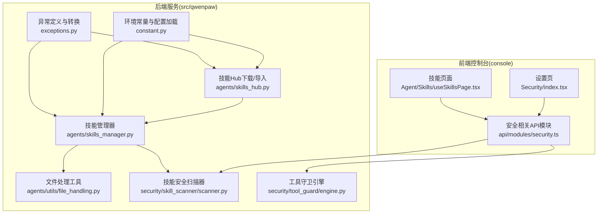
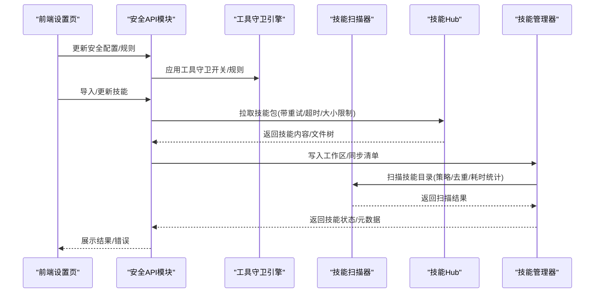
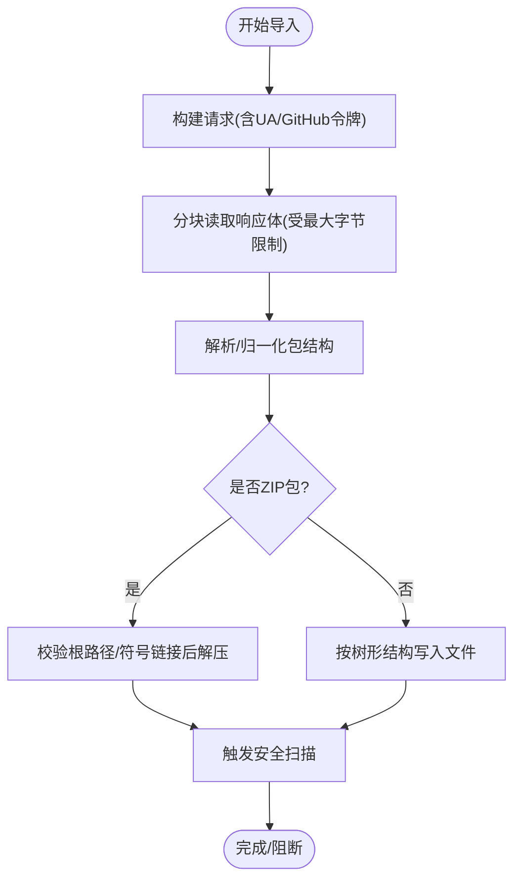
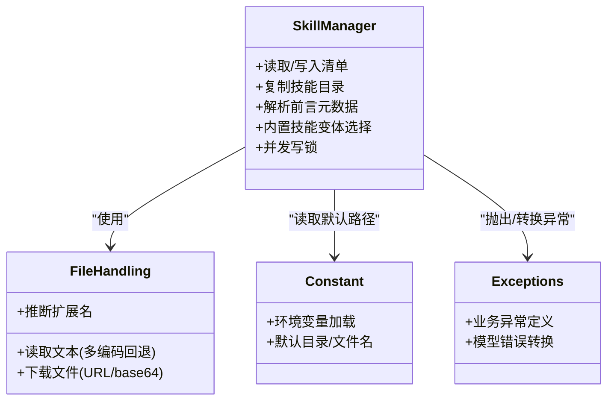
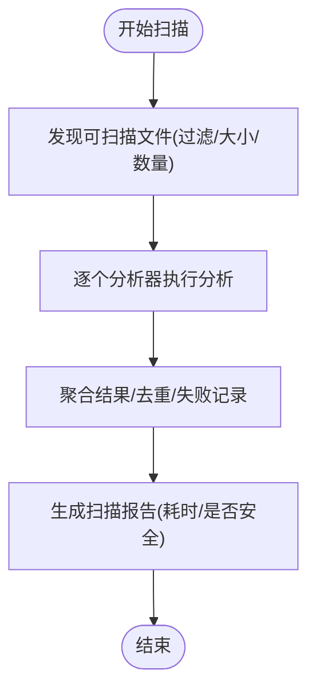
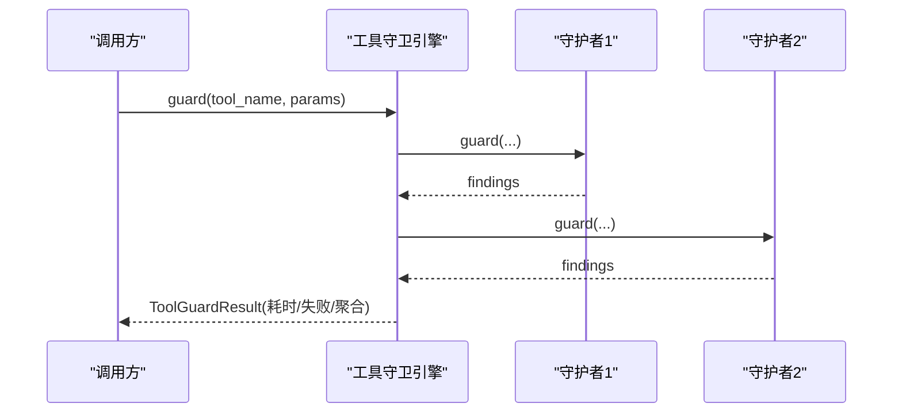
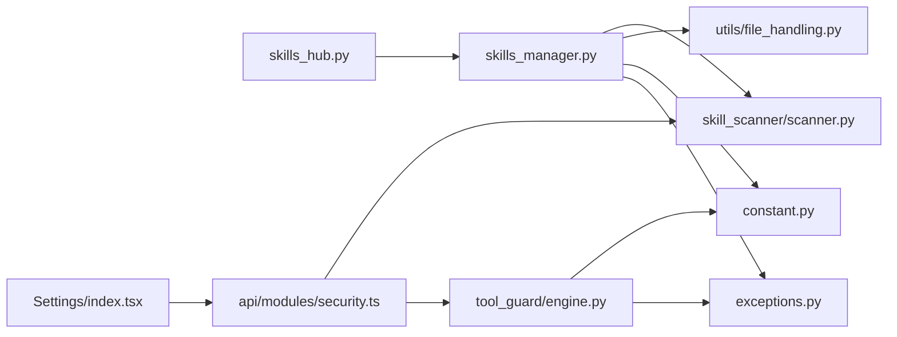

# 开发最佳实践

<cite>
**本文引用的文件**
- [src/qwenpaw/agents/skills_hub.py](file://src/qwenpaw/agents/skills_hub.py)
- [src/qwenpaw/agents/skills_manager.py](file://src/qwenpaw/agents/skills_manager.py)
- [src/qwenpaw/security/skill_scanner/scanner.py](file://src/qwenpaw/security/skill_scanner/scanner.py)
- [src/qwenpaw/security/tool_guard/engine.py](file://src/qwenpaw/security/tool_guard/engine.py)
- [src/qwenpaw/agents/utils/file_handling.py](file://src/qwenpaw/agents/utils/file_handling.py)
- [src/qwenpaw/constant.py](file://src/qwenpaw/constant.py)
- [src/qwenpaw/exceptions.py](file://src/qwenpaw/exceptions.py)
- [console/src/pages/Settings/Security/index.tsx](file://console/src/pages/Settings/Security/index.tsx)
- [console/src/api/modules/security.ts](file://console/src/api/modules/security.ts)
- [console/src/pages/Agent/Skills/useSkillsPage.tsx](file://console/src/pages/Agent/Skills/useSkillsPage.tsx)
</cite>

## 目录
1. [引言](#引言)
2. [项目结构](#项目结构)
3. [核心组件](#核心组件)
4. [架构总览](#架构总览)
5. [详细组件分析](#详细组件分析)
6. [依赖分析](#依赖分析)
7. [性能考量](#性能考量)
8. [故障排查指南](#故障排查指南)
9. [结论](#结论)
10. [附录](#附录)

## 引言
本指南面向技能开发与管理的最佳实践，围绕以下目标展开：经验法则、设计原则与编码规范；技能架构设计（模块化、可维护性）；安全设计（输入校验、权限控制）；性能优化（资源与内存）；质量保障（代码评审、CI/CD、持续改进）；团队协作（版本控制、文档）；常见陷阱与重构技巧。内容基于仓库中技能分发、安装、安全扫描与工具守卫等关键实现进行提炼。

## 项目结构
该项目采用前后端分离与多语言混合架构：
- 后端（Python）：技能管理、安全扫描、工具守卫、环境常量与异常体系
- 前端（React/Vite）：设置页（含安全规则配置）、技能池与技能卡片、工具守卫开关
- 脚本与部署：构建、打包、容器化与启动脚本

图示来源
- [src/qwenpaw/agents/skills_hub.py:1-200](file://src/qwenpaw/agents/skills_hub.py#L1-L200)
- [src/qwenpaw/agents/skills_manager.py:1-200](file://src/qwenpaw/agents/skills_manager.py#L1-L200)
- [src/qwenpaw/security/skill_scanner/scanner.py:1-120](file://src/qwenpaw/security/skill_scanner/scanner.py#L1-L120)
- [src/qwenpaw/security/tool_guard/engine.py:1-120](file://src/qwenpaw/security/tool_guard/engine.py#L1-L120)
- [src/qwenpaw/agents/utils/file_handling.py:1-120](file://src/qwenpaw/agents/utils/file_handling.py#L1-L120)
- [src/qwenpaw/constant.py:1-120](file://src/qwenpaw/constant.py#L1-L120)
- [src/qwenpaw/exceptions.py:1-120](file://src/qwenpaw/exceptions.py#L1-L120)
- [console/src/pages/Settings/Security/index.tsx:174-330](file://console/src/pages/Settings/Security/index.tsx#L174-L330)
- [console/src/api/modules/security.ts:101-148](file://console/src/api/modules/security.ts#L101-L148)
- [console/src/pages/Agent/Skills/useSkillsPage.tsx:247-263](file://console/src/pages/Agent/Skills/useSkillsPage.tsx#L247-L263)

章节来源
- [src/qwenpaw/agents/skills_hub.py:1-200](file://src/qwenpaw/agents/skills_hub.py#L1-L200)
- [src/qwenpaw/agents/skills_manager.py:1-200](file://src/qwenpaw/agents/skills_manager.py#L1-L200)
- [src/qwenpaw/security/skill_scanner/scanner.py:1-120](file://src/qwenpaw/security/skill_scanner/scanner.py#L1-L120)
- [src/qwenpaw/security/tool_guard/engine.py:1-120](file://src/qwenpaw/security/tool_guard/engine.py#L1-L120)
- [src/qwenpaw/agents/utils/file_handling.py:1-120](file://src/qwenpaw/agents/utils/file_handling.py#L1-L120)
- [src/qwenpaw/constant.py:1-120](file://src/qwenpaw/constant.py#L1-L120)
- [src/qwenpaw/exceptions.py:1-120](file://src/qwenpaw/exceptions.py#L1-L120)
- [console/src/pages/Settings/Security/index.tsx:174-330](file://console/src/pages/Settings/Security/index.tsx#L174-L330)
- [console/src/api/modules/security.ts:101-148](file://console/src/api/modules/security.ts#L101-L148)
- [console/src/pages/Agent/Skills/useSkillsPage.tsx:247-263](file://console/src/pages/Agent/Skills/useSkillsPage.tsx#L247-L263)

## 核心组件
- 技能管理器：负责技能清单、目录同步、导入导出、并发写锁、版本与元数据解析、内置技能变体选择、安全扫描集成
- 技能Hub：从远端Hub拉取技能包，支持重试退避、超时、大小限制、路径安全检查、ZIP解压安全校验
- 安全扫描器：遍历技能目录，按策略执行分析器，去重聚合结果，记录耗时与失败项
- 工具守卫引擎：在工具调用前进行多守护者检查（路径、规则、逃逸检测），支持动态启用/禁用与规则热加载
- 文件处理工具：跨平台编码回退读取、URL/本地路径解析、下载器链路（wget/curl/urllib）、扩展名推断
- 环境常量与异常：统一环境变量加载、类型安全解析、默认值与边界约束；异常分类与模型错误转换

章节来源
- [src/qwenpaw/agents/skills_manager.py:1-200](file://src/qwenpaw/agents/skills_manager.py#L1-L200)
- [src/qwenpaw/agents/skills_hub.py:1-200](file://src/qwenpaw/agents/skills_hub.py#L1-L200)
- [src/qwenpaw/security/skill_scanner/scanner.py:76-242](file://src/qwenpaw/security/skill_scanner/scanner.py#L76-L242)
- [src/qwenpaw/security/tool_guard/engine.py:54-234](file://src/qwenpaw/security/tool_guard/engine.py#L54-L234)
- [src/qwenpaw/agents/utils/file_handling.py:31-120](file://src/qwenpaw/agents/utils/file_handling.py#L31-L120)
- [src/qwenpaw/constant.py:28-120](file://src/qwenpaw/constant.py#L28-L120)
- [src/qwenpaw/exceptions.py:21-120](file://src/qwenpaw/exceptions.py#L21-L120)

## 架构总览
技能开发与运行的关键流程包括：技能导入（Hub或本地）、清单与目录同步、安全扫描、工具调用前守卫、运行期异常转换与日志记录。

图示来源
- [console/src/pages/Settings/Security/index.tsx:174-330](file://console/src/pages/Settings/Security/index.tsx#L174-L330)
- [console/src/api/modules/security.ts:101-148](file://console/src/api/modules/security.ts#L101-L148)
- [src/qwenpaw/security/tool_guard/engine.py:54-234](file://src/qwenpaw/security/tool_guard/engine.py#L54-L234)
- [src/qwenpaw/security/skill_scanner/scanner.py:148-242](file://src/qwenpaw/security/skill_scanner/scanner.py#L148-L242)
- [src/qwenpaw/agents/skills_hub.py:291-404](file://src/qwenpaw/agents/skills_hub.py#L291-L404)
- [src/qwenpaw/agents/skills_manager.py:615-636](file://src/qwenpaw/agents/skills_manager.py#L615-L636)

## 详细组件分析

### 组件A：技能Hub与导入流程
- 设计要点
  - 可配置的HTTP参数（超时、重试次数、退避底数/上限）
  - GitHub令牌注入与速率限制处理
  - 分块读取响应体，限制最大字节数
  - 路径安全校验（禁止符号链接、越界路径、ZIP内软链）
  - ZIP解压安全：校验根路径相对性、禁止外部属性为符号链接
  - 缓存与取消检查机制，支持用户中断
- 最佳实践
  - 使用环境变量隔离Hub地址与路径模板
  - 对外请求统一走带超时/重试/退避的封装函数
  - 对大文件与ZIP包设置明确上限，防止资源耗尽
  - 在导入前进行安全扫描，阻断高风险技能

图示来源
- [src/qwenpaw/agents/skills_hub.py:291-404](file://src/qwenpaw/agents/skills_hub.py#L291-L404)
- [src/qwenpaw/agents/skills_hub.py:615-636](file://src/qwenpaw/agents/skills_hub.py#L615-L636)
- [src/qwenpaw/agents/skills_manager.py:615-636](file://src/qwenpaw/agents/skills_manager.py#L615-L636)

章节来源
- [src/qwenpaw/agents/skills_hub.py:1-200](file://src/qwenpaw/agents/skills_hub.py#L1-L200)
- [src/qwenpaw/agents/skills_manager.py:615-636](file://src/qwenpaw/agents/skills_manager.py#L615-L636)

### 组件B：技能管理器与清单同步
- 设计要点
  - 并发写锁：使用文件锁序列化manifest变更，避免竞态
  - 清单版本号自增策略，确保原子写入
  - 内置技能变体选择与语言偏好缓存
  - 前言元数据解析与容错回退
  - 目录树描述用于UI展示
- 最佳实践
  - 清单变更必须通过互斥锁保护
  - 前言解析失败时提供最小可用回退，避免中断
  - 内置技能与自定义技能的意图保留（避免误覆盖）

图示来源
- [src/qwenpaw/agents/skills_manager.py:512-553](file://src/qwenpaw/agents/skills_manager.py#L512-L553)
- [src/qwenpaw/agents/utils/file_handling.py:31-120](file://src/qwenpaw/agents/utils/file_handling.py#L31-L120)
- [src/qwenpaw/constant.py:89-120](file://src/qwenpaw/constant.py#L89-L120)
- [src/qwenpaw/exceptions.py:21-120](file://src/qwenpaw/exceptions.py#L21-L120)

章节来源
- [src/qwenpaw/agents/skills_manager.py:1-200](file://src/qwenpaw/agents/skills_manager.py#L1-L200)
- [src/qwenpaw/agents/utils/file_handling.py:1-120](file://src/qwenpaw/agents/utils/file_handling.py#L1-L120)
- [src/qwenpaw/constant.py:1-120](file://src/qwenpaw/constant.py#L1-L120)
- [src/qwenpaw/exceptions.py:1-120](file://src/qwenpaw/exceptions.py#L1-L120)

### 组件C：技能安全扫描器
- 设计要点
  - 发现文件：递归遍历，跳过符号链接与越界路径，按策略跳过扩展名与大小限制
  - 分析器集合：默认模式匹配分析器，支持注册新分析器
  - 结果聚合：按策略去重、记录耗时、失败分析器
- 最佳实践
  - 为组织定制扫描策略（文件上限、大小上限、跳过扩展）
  - 将扫描结果作为导入阻断依据

图示来源
- [src/qwenpaw/security/skill_scanner/scanner.py:148-242](file://src/qwenpaw/security/skill_scanner/scanner.py#L148-L242)
- [src/qwenpaw/security/skill_scanner/scanner.py:248-299](file://src/qwenpaw/security/skill_scanner/scanner.py#L248-L299)

章节来源
- [src/qwenpaw/security/skill_scanner/scanner.py:1-200](file://src/qwenpaw/security/skill_scanner/scanner.py#L1-L200)

### 组件D：工具守卫引擎
- 设计要点
  - 默认守护者集合：路径、规则、Shell逃逸检测
  - 动态启用/禁用与规则热加载
  - 仅在受保护范围内的工具执行全部守护者，其他工具可选择性执行
- 最佳实践
  - 将高危工具（如文件系统/命令执行）纳入守卫范围
  - 通过配置开关与规则集实现灵活管控

图示来源
- [src/qwenpaw/security/tool_guard/engine.py:177-234](file://src/qwenpaw/security/tool_guard/engine.py#L177-L234)

章节来源
- [src/qwenpaw/security/tool_guard/engine.py:1-200](file://src/qwenpaw/security/tool_guard/engine.py#L1-L200)

### 组件E：前端安全配置与技能管理交互
- 设计要点
  - 设置页提供工具守卫开关、拒绝工具列表、规则增删改查
  - 安全API模块对接后端配置与扫描白名单/历史
  - 技能页面支持启用/删除技能、刷新状态
- 最佳实践
  - 配置变更需经后端生效，前端仅做展示与提交
  - 错误与加载状态需友好提示与重试

章节来源
- [console/src/pages/Settings/Security/index.tsx:174-330](file://console/src/pages/Settings/Security/index.tsx#L174-L330)
- [console/src/api/modules/security.ts:101-148](file://console/src/api/modules/security.ts#L101-L148)
- [console/src/pages/Agent/Skills/useSkillsPage.tsx:247-263](file://console/src/pages/Agent/Skills/useSkillsPage.tsx#L247-L263)

## 依赖分析
- 组件耦合
  - 技能Hub依赖环境常量与异常；与技能管理器协作完成导入与写盘
  - 技能管理器依赖文件处理工具、常量与异常；与安全扫描器集成
  - 工具守卫引擎依赖配置加载与规则解析；与前端设置页联动
- 外部依赖
  - HTTP客户端（urllib/requests）、子进程（wget/curl）、文件系统（zip/路径解析）
- 潜在循环
  - 当前模块间以“工具/常量/异常”为共享层，未见直接循环依赖

图示来源
- [src/qwenpaw/agents/skills_hub.py:1-120](file://src/qwenpaw/agents/skills_hub.py#L1-L120)
- [src/qwenpaw/agents/skills_manager.py:1-120](file://src/qwenpaw/agents/skills_manager.py#L1-L120)
- [src/qwenpaw/security/skill_scanner/scanner.py:1-120](file://src/qwenpaw/security/skill_scanner/scanner.py#L1-L120)
- [src/qwenpaw/security/tool_guard/engine.py:1-120](file://src/qwenpaw/security/tool_guard/engine.py#L1-L120)
- [src/qwenpaw/agents/utils/file_handling.py:1-120](file://src/qwenpaw/agents/utils/file_handling.py#L1-L120)
- [src/qwenpaw/constant.py:1-120](file://src/qwenpaw/constant.py#L1-L120)
- [src/qwenpaw/exceptions.py:1-120](file://src/qwenpaw/exceptions.py#L1-L120)
- [console/src/pages/Settings/Security/index.tsx:174-330](file://console/src/pages/Settings/Security/index.tsx#L174-L330)
- [console/src/api/modules/security.ts:101-148](file://console/src/api/modules/security.ts#L101-L148)

章节来源
- [src/qwenpaw/agents/skills_hub.py:1-120](file://src/qwenpaw/agents/skills_hub.py#L1-L120)
- [src/qwenpaw/agents/skills_manager.py:1-120](file://src/qwenpaw/agents/skills_manager.py#L1-L120)
- [src/qwenpaw/security/skill_scanner/scanner.py:1-120](file://src/qwenpaw/security/skill_scanner/scanner.py#L1-L120)
- [src/qwenpaw/security/tool_guard/engine.py:1-120](file://src/qwenpaw/security/tool_guard/engine.py#L1-L120)
- [src/qwenpaw/agents/utils/file_handling.py:1-120](file://src/qwenpaw/agents/utils/file_handling.py#L1-L120)
- [src/qwenpaw/constant.py:1-120](file://src/qwenpaw/constant.py#L1-L120)
- [src/qwenpaw/exceptions.py:1-120](file://src/qwenpaw/exceptions.py#L1-L120)
- [console/src/pages/Settings/Security/index.tsx:174-330](file://console/src/pages/Settings/Security/index.tsx#L174-L330)
- [console/src/api/modules/security.ts:101-148](file://console/src/api/modules/security.ts#L101-L148)

## 性能考量
- I/O与网络
  - 分块读取响应体，限制最大字节数，避免内存峰值
  - ZIP解压前先校验路径与符号链接，减少无效解压开销
- 并发与锁
  - 清单写入使用文件锁，避免竞态与崩溃
- 计算与扫描
  - 扫描器按策略限制文件数量与大小，避免长时间阻塞
  - 分析器失败不影响整体流程，记录失败项便于追踪
- 前端交互
  - 设置页与技能页应提供加载态与错误态，提升用户体验

[本节为通用性能建议，不直接分析具体文件]

## 故障排查指南
- 技能导入失败
  - 检查Hub可达性、超时与重试配置；确认GitHub令牌与速率限制
  - 查看响应体大小限制与分块读取日志
- ZIP解压报错
  - 根路径越界或包含符号链接会被拒绝；检查压缩包结构
- 清单写入冲突
  - 并发写入可能被锁阻塞；确认锁文件存在与权限
- 工具调用被阻断
  - 检查工具守卫开关、拒绝工具列表与规则集；必要时临时关闭仅做定位
- 模型错误
  - 使用异常转换逻辑定位401/429/超时/上下文长度等问题

章节来源
- [src/qwenpaw/agents/skills_hub.py:291-404](file://src/qwenpaw/agents/skills_hub.py#L291-L404)
- [src/qwenpaw/agents/skills_manager.py:512-553](file://src/qwenpaw/agents/skills_manager.py#L512-L553)
- [src/qwenpaw/security/tool_guard/engine.py:54-120](file://src/qwenpaw/security/tool_guard/engine.py#L54-L120)
- [src/qwenpaw/exceptions.py:165-254](file://src/qwenpaw/exceptions.py#L165-L254)

## 结论
本指南从架构、组件、安全、性能与协作五个维度总结了技能开发的最佳实践。建议在实际工程中：
- 将Hub导入、清单同步、安全扫描与工具守卫形成闭环
- 以环境变量与策略驱动配置，确保可移植与可审计
- 通过严格的输入校验、路径安全与资源限制保障系统稳定
- 建立完善的代码评审与测试流程，持续改进

[本节为总结性内容，不直接分析具体文件]

## 附录

### A. 安全设计与权限控制清单
- 输入验证
  - 技能名称与路径：禁止NUL、路径分隔符、空字符串
  - ZIP包：禁止越界路径与符号链接
- 权限控制
  - 工具守卫：对高危工具强制守卫，拒绝工具列表白名单
  - 环境变量：统一通过EnvVarLoader加载，提供默认与边界
- 审计与阻断
  - 安全扫描结果作为导入阻断依据
  - 前端设置页支持白名单与阻断历史管理

章节来源
- [src/qwenpaw/agents/skills_manager.py:638-673](file://src/qwenpaw/agents/skills_manager.py#L638-L673)
- [src/qwenpaw/agents/skills_manager.py:615-636](file://src/qwenpaw/agents/skills_manager.py#L615-L636)
- [src/qwenpaw/security/tool_guard/engine.py:54-120](file://src/qwenpaw/security/tool_guard/engine.py#L54-L120)
- [src/qwenpaw/constant.py:28-87](file://src/qwenpaw/constant.py#L28-L87)
- [console/src/pages/Settings/Security/index.tsx:174-330](file://console/src/pages/Settings/Security/index.tsx#L174-L330)
- [console/src/api/modules/security.ts:101-148](file://console/src/api/modules/security.ts#L101-L148)

### B. 性能优化与资源管理
- I/O与网络
  - 分块读取、最大字节限制、超时与重试退避
- 存储与并发
  - 清单写入原子化与文件锁
- 扫描与守卫
  - 策略级文件数量/大小限制，失败项记录

章节来源
- [src/qwenpaw/agents/skills_hub.py:291-404](file://src/qwenpaw/agents/skills_hub.py#L291-L404)
- [src/qwenpaw/agents/skills_manager.py:512-553](file://src/qwenpaw/agents/skills_manager.py#L512-L553)
- [src/qwenpaw/security/skill_scanner/scanner.py:116-134](file://src/qwenpaw/security/skill_scanner/scanner.py#L116-L134)

### C. 团队协作与版本控制
- 版本控制
  - 使用环境变量与策略文件驱动配置，避免硬编码
- 文档
  - 前端设置页提供规则增删改查与重试入口
- 评审
  - 关注Hub导入安全、ZIP解压安全、清单写入一致性与异常转换

章节来源
- [src/qwenpaw/constant.py:1-120](file://src/qwenpaw/constant.py#L1-L120)
- [console/src/pages/Settings/Security/index.tsx:174-330](file://console/src/pages/Settings/Security/index.tsx#L174-L330)
- [console/src/api/modules/security.ts:101-148](file://console/src/api/modules/security.ts#L101-L148)

### D. 常见陷阱与重构技巧
- 陷阱
  - 忽视路径安全导致越界与符号链接
  - 清单写入未加锁引发竞态
  - ZIP解压前未校验根路径与外部属性
- 重构技巧
  - 将HTTP请求封装为统一工具函数，集中处理超时/重试/退避
  - 将环境变量访问抽象为EnvVarLoader，统一类型与默认值
  - 将扫描与守卫结果结构化，便于前端展示与审计

章节来源
- [src/qwenpaw/agents/skills_hub.py:291-404](file://src/qwenpaw/agents/skills_hub.py#L291-L404)
- [src/qwenpaw/agents/skills_manager.py:512-553](file://src/qwenpaw/agents/skills_manager.py#L512-L553)
- [src/qwenpaw/constant.py:28-87](file://src/qwenpaw/constant.py#L28-L87)