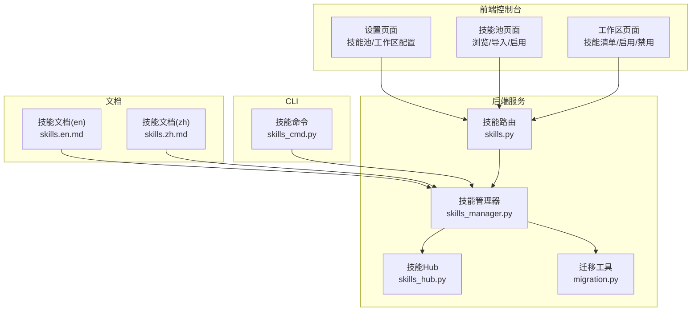
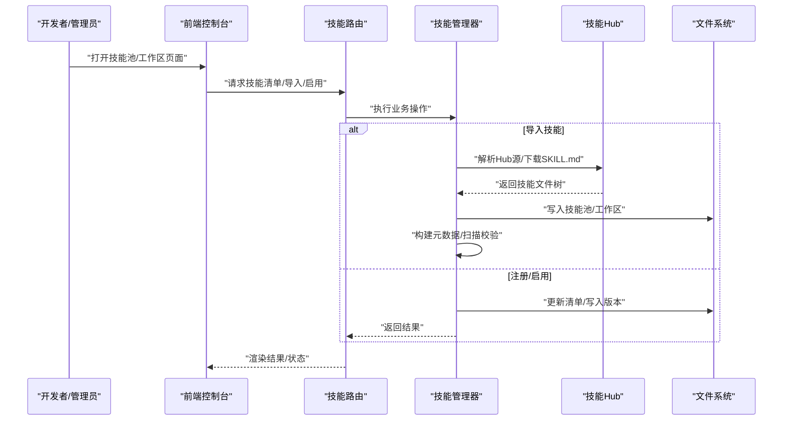
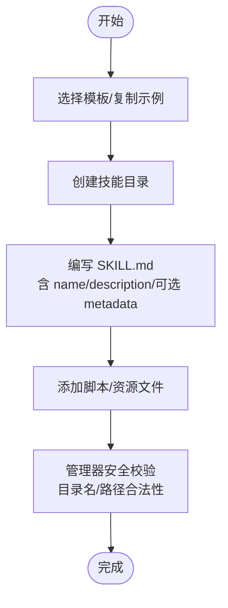
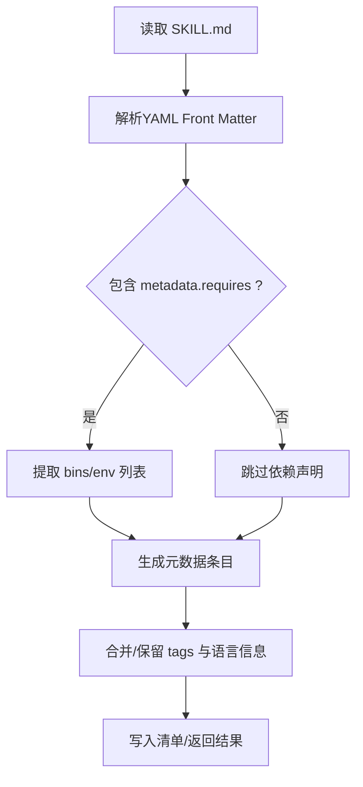
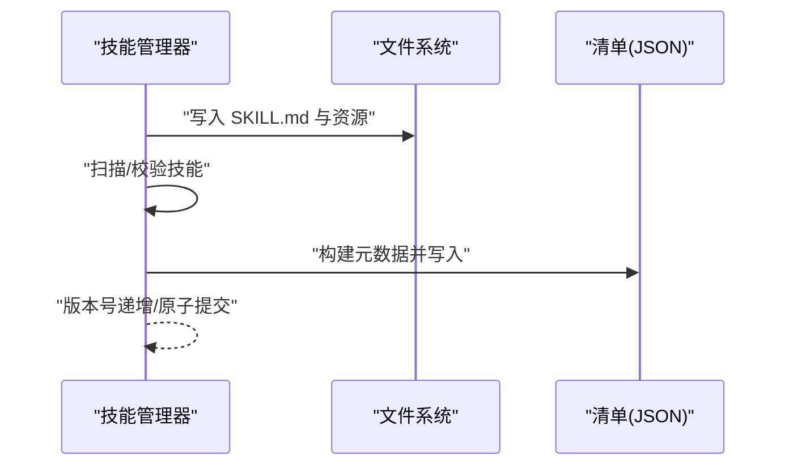
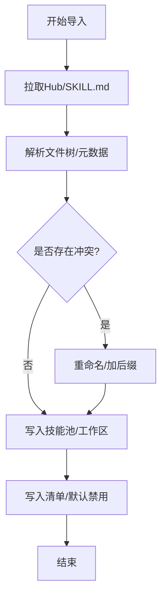
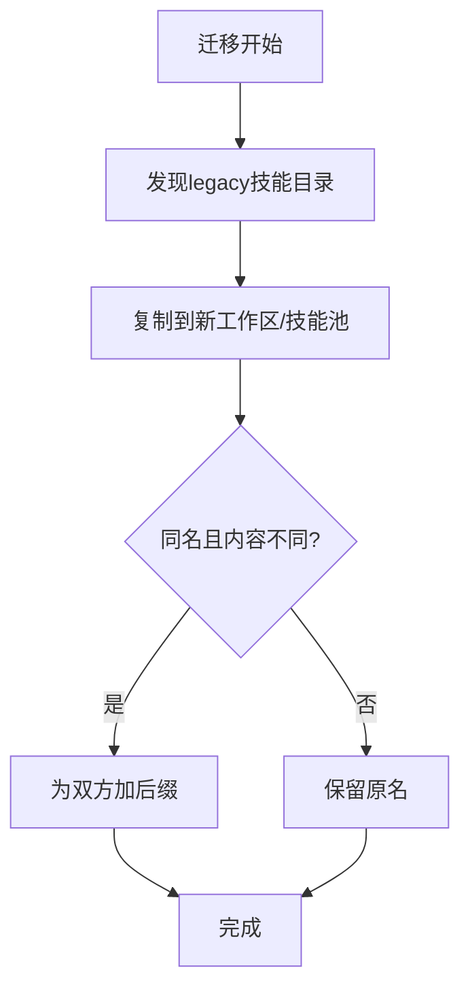
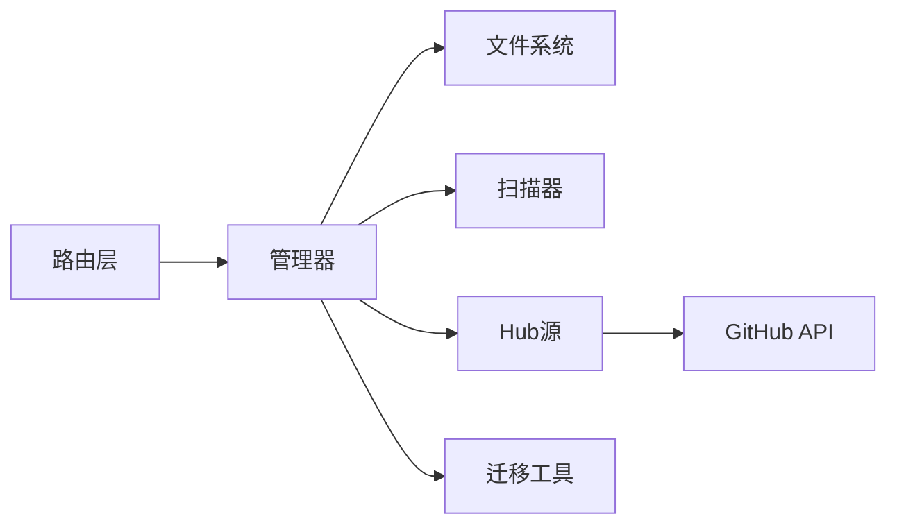

# 技能创建流程

<cite>
**本文引用的文件**
- [skills_manager.py](file://src/qwenpaw/agents/skills_manager.py)
- [skills_hub.py](file://src/qwenpaw/agents/skills_hub.py)
- [skills_cmd.py](file://src/qwenpaw/cli/skills_cmd.py)
- [skills.py](file://src/qwenpaw/app/routers/skills.py)
- [migration.py](file://src/qwenpaw/app/migration.py)
- [skills.en.md](file://website/public/docs/skills.en.md)
- [skills.zh.md](file://website/public/docs/skills.zh.md)
- [templates.py](file://src/qwenpaw/agents/templates.py)
</cite>

## 目录
1. [引言](#引言)
2. [项目结构](#项目结构)
3. [核心组件](#核心组件)
4. [架构总览](#架构总览)
5. [详细组件分析](#详细组件分析)
6. [依赖关系分析](#依赖关系分析)
7. [性能考量](#性能考量)
8. [故障排查指南](#故障排查指南)
9. [结论](#结论)
10. [附录](#附录)

## 引言
本文件面向技能开发者与平台管理员，系统化梳理从“技能构思”到“正式上线”的完整生命周期，涵盖技能模板选择与使用、文件结构与命名规范、元数据配置与标签体系、注册与权限配置、版本管理策略、导入导出与批量管理、迁移方法，以及测试验证、质量检查与发布前准备等关键环节。文档基于仓库中的实际实现与官方文档进行归纳总结，帮助读者快速建立标准化的技能开发与运维流程。

## 项目结构
技能系统围绕“技能池（Skill Pool）+ 工作区（Workspace）”双层结构组织，通过 CLI、Web 控制台与后端路由协同完成技能的创建、导入、注册、启用、版本管理与迁移。核心文件分布如下：
- 后端核心：技能管理器、技能池与工作区清单、技能 Hub 源、迁移逻辑
- 前端控制台：技能页面、技能池页面、设置页面
- 文档：技能使用与配置说明
- CLI：技能命令入口

图表来源
- [skills.py](file://src/qwenpaw/app/routers/skills.py)
- [skills_manager.py](file://src/qwenpaw/agents/skills_manager.py)
- [skills_hub.py](file://src/qwenpaw/agents/skills_hub.py)
- [migration.py](file://src/qwenpaw/app/migration.py)
- [skills_cmd.py](file://src/qwenpaw/cli/skills_cmd.py)
- [skills.en.md](file://website/public/docs/skills.en.md)
- [skills.zh.md](file://website/public/docs/skills.zh.md)

章节来源
- [skills.py](file://src/qwenpaw/app/routers/skills.py)
- [skills_manager.py](file://src/qwenpaw/agents/skills_manager.py)
- [skills_hub.py](file://src/qwenpaw/agents/skills_hub.py)
- [migration.py](file://src/qwenpaw/app/migration.py)
- [skills_cmd.py](file://src/qwenpaw/cli/skills_cmd.py)
- [skills.en.md](file://website/public/docs/skills.en.md)
- [skills.zh.md](file://website/public/docs/skills.zh.md)

## 核心组件
- 技能管理器（SkillsManager）
  - 负责技能清单的读写、原子更新、版本号递增、安全路径校验、文件树创建、扫描与校验、导入/删除等操作
  - 提供工作区与技能池的统一管理接口
- 技能 Hub（SkillsHub）
  - 支持从 GitHub/LobeHub 等源拉取 SKILL.md 及资源，解析技能包，生成技能条目
- 迁移工具（Migration）
  - 将历史遗留的技能目录迁移到新的工作区/技能池结构，处理冲突与签名一致性
- CLI 技能命令（skills_cmd.py）
  - 提供导入、删除、同步、查看等命令行操作
- 文档与模板（skills.zh.md / skills.en.md / templates.py）
  - 提供 SKILL.md 元数据规范、示例与模板指引

章节来源
- [skills_manager.py](file://src/qwenpaw/agents/skills_manager.py)
- [skills_hub.py](file://src/qwenpaw/agents/skills_hub.py)
- [migration.py](file://src/qwenpaw/app/migration.py)
- [skills_cmd.py](file://src/qwenpaw/cli/skills_cmd.py)
- [skills.zh.md](file://website/public/docs/skills.zh.md)
- [skills.en.md](file://website/public/docs/skills.en.md)
- [templates.py](file://src/qwenpaw/agents/templates.py)

## 架构总览
技能生命周期由“创建/导入 → 注册 → 启用/禁用 → 版本管理 → 迁移/备份 → 发布”构成。下图展示从控制台/CLI 到后端管理器的关键交互：

图表来源
- [skills.py](file://src/qwenpaw/app/routers/skills.py)
- [skills_manager.py](file://src/qwenpaw/agents/skills_manager.py)
- [skills_hub.py](file://src/qwenpaw/agents/skills_hub.py)

## 详细组件分析

### 组件一：技能模板与文件结构
- 模板与示例
  - 官方文档提供了 SKILL.md 的示例与元数据字段说明，强调 name/description 必填、metadata.requires 可选
  - 模板与构建产物类型定义位于模板模块，便于生成标准化技能骨架
- 文件结构与命名规范
  - 技能根目录必须包含 SKILL.md；其他脚本/资源按需组织
  - 管理器对目录名进行规范化与安全校验，禁止空名、NUL 字节、路径分隔符等非法字符
  - 支持从“文件树”批量创建文件，确保层级与内容一致

图表来源
- [skills.zh.md](file://website/public/docs/skills.zh.md)
- [templates.py](file://src/qwenpaw/agents/templates.py)
- [skills_manager.py](file://src/qwenpaw/agents/skills_manager.py)

章节来源
- [skills.zh.md](file://website/public/docs/skills.zh.md)
- [skills.en.md](file://website/public/docs/skills.en.md)
- [templates.py](file://src/qwenpaw/agents/templates.py)
- [skills_manager.py](file://src/qwenpaw/agents/skills_manager.py)

### 组件二：元数据配置与标签系统
- 元数据字段
  - 必填：name、description
  - 可选：metadata.requires（bin/env 声明）、tags、语言/来源标记等
  - 配置注入：仅匹配 requires.env 的键会被注入为环境变量；完整配置始终可通过 QWENPAW_SKILL_CONFIG_<NAME> 访问
- 标签与语言
  - 管理器在构建元数据时保留已有标签，支持内置语言/来源名称的回填
- 权限与保护
  - 管理器区分 source（builtin/customized），并支持受保护条目的处理

图表来源
- [skills_manager.py](file://src/qwenpaw/agents/skills_manager.py)
- [skills.en.md](file://website/public/docs/skills.en.md)

章节来源
- [skills_manager.py](file://src/qwenpaw/agents/skills_manager.py)
- [skills.en.md](file://website/public/docs/skills.en.md)

### 组件三：技能注册与清单管理
- 清单结构
  - 工作区/技能池均维护一个 JSON 清单，记录每个技能的元数据、版本、来源与配置
  - 版本号采用原子递增策略，避免并发写入冲突
- 注册流程
  - 导入成功后，技能以禁用状态写入清单；启用后方可使用
  - 更新技能时，若内容变更则重新扫描并写回 SKILL.md，同时更新元数据

图表来源
- [skills_manager.py](file://src/qwenpaw/agents/skills_manager.py)

章节来源
- [skills_manager.py](file://src/qwenpaw/agents/skills_manager.py)

### 组件四：技能导入与批量管理
- 导入来源
  - 支持从 GitHub/LobeHub 等 Hub 源导入，自动解析 SKILL.md 与资源树
  - 支持直接在工作区目录下放置 SKILL.md，由管理器检测并以禁用状态写入清单
- 批量导入与冲突处理
  - 导入时识别重复名称与内容差异，必要时为冲突项加后缀以避免覆盖
- 删除与清理
  - 删除技能会移除文件并从清单中移除对应条目

图表来源
- [skills_hub.py](file://src/qwenpaw/agents/skills_hub.py)
- [skills_manager.py](file://src/qwenpaw/agents/skills_manager.py)

章节来源
- [skills_hub.py](file://src/qwenpaw/agents/skills_hub.py)
- [skills_manager.py](file://src/qwenpaw/agents/skills_manager.py)

### 组件五：版本管理与迁移
- 版本策略
  - 清单版本号在每次变更时递增；同时兼容时间戳作为版本依据，保证唯一性
- 迁移流程
  - 将历史 legacy 目录（如 customized_skills/active_skills）扫描并复制到新结构
  - 对同名但内容不同的技能进行冲突处理（加后缀），并保留活动技能集合
  - 迁移前后保持签名一致性，避免重复复制

图表来源
- [migration.py](file://src/qwenpaw/app/migration.py)

章节来源
- [migration.py](file://src/qwenpaw/app/migration.py)

### 组件六：测试验证与质量检查
- 扫描与校验
  - 导入/更新技能时会触发扫描，确保 SKILL.md 结构与依赖声明有效
- 配置注入与可用性
  - 仅在 requires.env 中声明的键会被注入为环境变量；未声明的键仅可通过完整 JSON 访问
- 发布前准备
  - 在控制台或 CLI 中启用技能；确认依赖（bin/env）满足；检查日志与错误提示
  - 如遇 GitHub 限流，可在设置页配置 GITHUB_TOKEN

章节来源
- [skills_manager.py](file://src/qwenpaw/agents/skills_manager.py)
- [skills.en.md](file://website/public/docs/skills.en.md)
- [skills.zh.md](file://website/public/docs/skills.zh.md)

## 依赖关系分析
- 组件耦合
  - 路由层依赖管理器；管理器依赖文件系统与扫描器；Hub 依赖网络与缓存；迁移工具依赖签名与目录遍历
- 外部依赖
  - GitHub API（Hub 源）、环境变量注入（requires.env）、文件系统原子写入
- 潜在环路
  - 无直接循环依赖；各模块职责清晰，通过接口解耦

图表来源
- [skills.py](file://src/qwenpaw/app/routers/skills.py)
- [skills_manager.py](file://src/qwenpaw/agents/skills_manager.py)
- [skills_hub.py](file://src/qwenpaw/agents/skills_hub.py)
- [migration.py](file://src/qwenpaw/app/migration.py)

章节来源
- [skills.py](file://src/qwenpaw/app/routers/skills.py)
- [skills_manager.py](file://src/qwenpaw/agents/skills_manager.py)
- [skills_hub.py](file://src/qwenpaw/agents/skills_hub.py)
- [migration.py](file://src/qwenpaw/app/migration.py)

## 性能考量
- 原子写入与版本号递增
  - 使用临时文件与替换策略减少竞态；版本号递增避免重复写入
- 缓存与去重
  - Hub 源对树结构与根路径进行缓存，避免重复拉取
- 批量操作
  - 导入/删除采用批量处理，冲突检测与重命名在内存中完成，降低 IO 开销

章节来源
- [skills_manager.py](file://src/qwenpaw/agents/skills_manager.py)
- [skills_hub.py](file://src/qwenpaw/agents/skills_hub.py)

## 故障排查指南
- 导入失败
  - 检查 URL 完整性、域名白名单与网络连通性；如为 GitHub 限流，配置 GITHUB_TOKEN
- 目录安全
  - 管理器会对路径进行安全校验，非法字符或越界路径会抛出异常
- 配置缺失
  - 未在 requires.env 中声明的键不会注入环境变量，需通过完整 JSON 读取
- 冲突与覆盖
  - 同名冲突会加后缀避免覆盖；请在控制台确认最终启用项

章节来源
- [skills.zh.md](file://website/public/docs/skills.zh.md)
- [skills_manager.py](file://src/qwenpaw/agents/skills_manager.py)
- [skills.en.md](file://website/public/docs/skills.en.md)

## 结论
通过“模板驱动 + 规范化元数据 + 原子清单 + Hub 源 + 迁移工具”的组合，QwenPaw 提供了从构思到上线的闭环技能开发体验。遵循本文档的文件结构、元数据与标签规范，配合 CLI 与控制台操作，可高效完成技能的创建、注册、启用、版本管理与迁移，确保质量与可维护性。

## 附录
- 常用操作路径
  - 技能池：$QWENPAW_WORKING_DIR/skill_pool/
  - 工作区：$QWENPAW_WORKING_DIR/workspaces/{agent_id}/skills/
- 关键命令
  - 导入/删除/同步/查看：参见 CLI 技能命令入口

章节来源
- [skills_cmd.py](file://src/qwenpaw/cli/skills_cmd.py)
- [skills_manager.py](file://src/qwenpaw/agents/skills_manager.py)