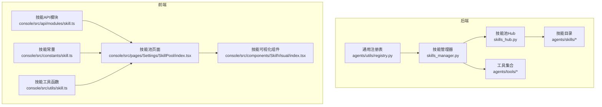
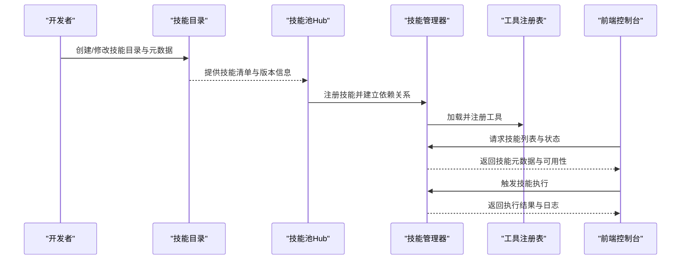
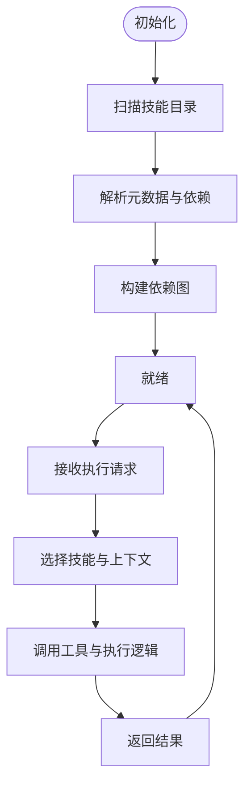
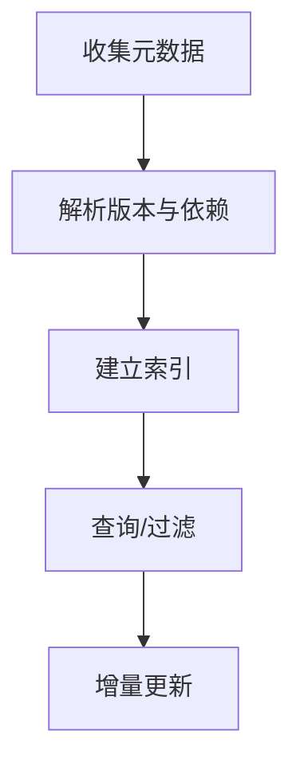
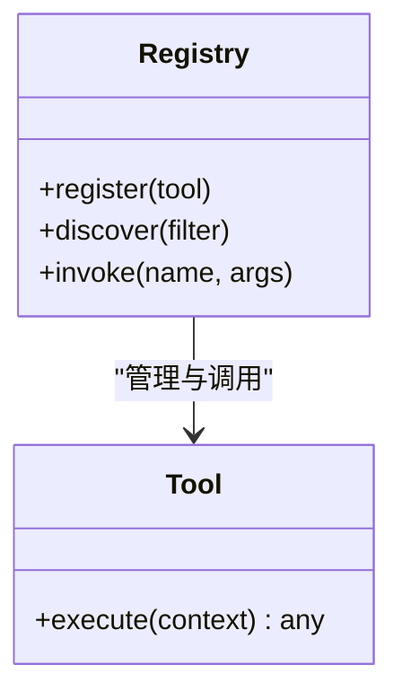
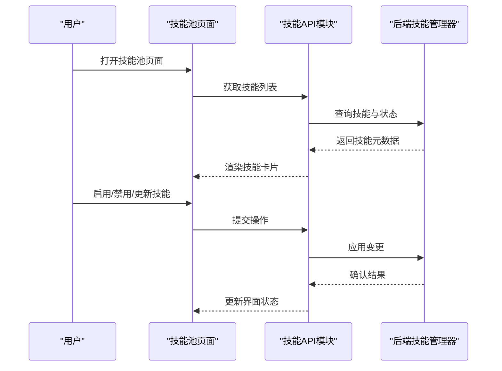
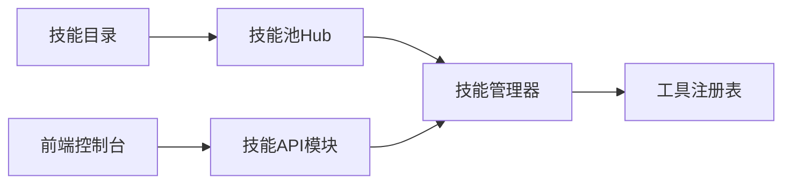

# 技能开发

<cite>
**本文引用的文件**
- [skills_manager.py](file://src/qwenpaw/agents/skills_manager.py)
- [skills_hub.py](file://src/qwenpaw/agents/skills_hub.py)
- [registry.py](file://src/qwenpaw/agents/utils/registry.py)
- [__init__.py](file://src/qwenpaw/agents/skills/__init__.py)
- [SKILL.md](file://src/qwenpaw/agents/skills/QA_source_index-en/SKILL.md)
- [SKILL.md](file://src/qwenpaw/agents/skills/browser_cdp-en/SKILL.md)
- [SKILL.md](file://src/qwenpaw/agents/skills/multi_agent_collaboration-en/SKILL.md)
- [SKILL.md](file://src/qwenpaw/agents/skills/pdf-en/SKILL.md)
- [SKILL.md](file://src/qwenpaw/agents/skills/xlsx-en/SKILL.md)
- [SKILL.md](file://src/qwenpaw/agents/skills/guidance-en/SKILL.md)
- [SKILL.md](file://src/qwenpaw/agents/skills/cron-en/SKILL.md)
- [SKILL.md](file://src/qwenpaw/agents/skills/dingtalk_channel-en/SKILL.md)
- [SKILL.md](file://src/qwenpaw/agents/skills/docx-en/SKILL.md)
- [SKILL.md](file://src/qwenpaw/agents/skills/pptx-en/SKILL.md)
- [SKILL.md](file://src/qwenpaw/agents/skills/make_plan-en/SKILL.md)
- [SKILL.md](file://src/qwenpaw/agents/skills/news-en/SKILL.md)
- [SKILL.md](file://src/qwenpaw/agents/skills/file_reader-en/SKILL.md)
- [SKILL.md](file://src/qwenpaw/agents/skills/chat_with_agent-en/SKILL.md)
- [SKILL.md](file://src/qwenpaw/agents/skills/channel_message-en/SKILL.md)
- [SKILL.md](file://src/qwenpaw/agents/skills/bot_en.py](file://src/qwenpaw/agents/tools/bot_en.py)
- [bot_zh.py](file://src/qwenpaw/agents/tools/bot_zh.py)
- [tools目录结构](file://src/qwenpaw/agents/tools/)
- [skill.ts](file://console/src/api/modules/skill.ts)
- [skill.tsx](file://console/src/pages/Settings/SkillPool/index.tsx)
- [index.tsx](file://console/src/components/SkillVisual/index.tsx)
- [utils.ts](file://console/src/pages/Chat/utils.ts)
- [skill.ts](file://console/src/constants/skill.ts)
- [utils.ts](file://console/src/utils/skill.ts)
- [README.md](file://README.md)
- [README_zh.md](file://README_zh.md)
- [website/docs/skills.zh.md](file://website/docs/skills.zh.md)
- [website/docs/skills.en.md](file://website/docs/skills.en.md)
</cite>

## 目录
1. [简介](#简介)
2. [项目结构](#项目结构)
3. [核心组件](#核心组件)
4. [架构总览](#架构总览)
5. [详细组件分析](#详细组件分析)
6. [依赖关系分析](#依赖关系分析)
7. [性能考虑](#性能考虑)
8. [故障排查指南](#故障排查指南)
9. [结论](#结论)
10. [附录](#附录)

## 简介
本指南面向希望在QwenPaw平台上开发与扩展“技能”的开发者，系统讲解技能开发框架、工具编写规范、技能注册流程、生命周期管理、版本控制与依赖处理、测试与调试方法、性能优化策略，以及内置技能的实现原理与扩展方式。文档提供从简单工具到复杂技能的渐进式开发路径，帮助快速上手。

## 项目结构
QwenPaw的技能体系由后端Python服务与前端控制台两部分组成：
- 后端：技能管理器、技能池、工具注册与执行、安全扫描与守卫等
- 前端：技能列表、可视化展示、技能配置与操作入口

**图表来源**
- [skills_manager.py](file://src/qwenpaw/agents/skills_manager.py)
- [skills_hub.py](file://src/qwenpaw/agents/skills_hub.py)
- [registry.py](file://src/qwenpaw/agents/utils/registry.py)
- [__init__.py](file://src/qwenpaw/agents/skills/__init__.py)
- [skill.ts](file://console/src/api/modules/skill.ts)
- [skill.tsx](file://console/src/pages/Settings/SkillPool/index.tsx)
- [index.tsx](file://console/src/components/SkillVisual/index.tsx)
- [skill.ts](file://console/src/constants/skill.ts)
- [utils.ts](file://console/src/utils/skill.ts)

**章节来源**
- [README.md](file://README.md)
- [README_zh.md](file://README_zh.md)
- [website/docs/skills.zh.md](file://website/docs/skills.zh.md)
- [website/docs/skills.en.md](file://website/docs/skills.en.md)

## 核心组件
- 技能管理器（skills_manager.py）：负责技能的加载、调度、执行与生命周期管理
- 技能池Hub（skills_hub.py）：维护技能索引、版本与依赖信息，提供查询与更新能力
- 工具注册表（agents/utils/registry.py）：统一注册与发现工具，支持动态加载
- 技能目录（agents/skills/*）：内置技能以独立目录形式组织，每个技能包含描述与元数据文件
- 工具集合（agents/tools/*）：可被技能复用的基础工具
- 前端技能API与界面（console/src/api/modules/skill.ts 等）：提供技能列表、可视化与配置交互

**章节来源**
- [skills_manager.py](file://src/qwenpaw/agents/skills_manager.py)
- [skills_hub.py](file://src/qwenpaw/agents/skills_hub.py)
- [registry.py](file://src/qwenpaw/agents/utils/registry.py)
- [__init__.py](file://src/qwenpaw/agents/skills/__init__.py)

## 架构总览
技能从“定义—注册—加载—执行—可视化”的全链路架构如下：

**图表来源**
- [skills_hub.py](file://src/qwenpaw/agents/skills_hub.py)
- [skills_manager.py](file://src/qwenpaw/agents/skills_manager.py)
- [registry.py](file://src/qwenpaw/agents/utils/registry.py)
- [skill.ts](file://console/src/api/modules/skill.ts)

## 详细组件分析

### 技能管理器（skills_manager.py）
职责与特性
- 负责技能的动态加载、实例化与执行
- 维护技能上下文与会话状态
- 协调工具注册表，确保工具可用性
- 处理技能生命周期事件（启动、停止、重载）

关键流程
- 初始化阶段：扫描技能目录，解析元数据，建立依赖图
- 运行阶段：根据请求选择技能，注入上下文，调用工具，返回结果
- 清理阶段：释放资源，关闭连接，持久化状态

**图表来源**
- [skills_manager.py](file://src/qwenpaw/agents/skills_manager.py)

**章节来源**
- [skills_manager.py](file://src/qwenpaw/agents/skills_manager.py)

### 技能池Hub（skills_hub.py）
职责与特性
- 维护技能索引与版本信息
- 提供技能查询、排序、过滤与增量更新
- 管理技能间的依赖关系与冲突检测
- 支持多语言与本地化元数据

关键流程
- 元数据收集：遍历技能目录，读取SKILL.md等元数据文件
- 版本与依赖解析：提取版本号、依赖项、权限声明
- 查询接口：按名称、标签、语言筛选技能

**图表来源**
- [skills_hub.py](file://src/qwenpaw/agents/skills_hub.py)

**章节来源**
- [skills_hub.py](file://src/qwenpaw/agents/skills_hub.py)

### 工具注册表（agents/utils/registry.py）
职责与特性
- 统一注册工具，支持按类型、命名空间与优先级管理
- 提供工具发现与调用接口
- 与技能管理器协作，确保工具可用性与一致性

关键流程
- 注册：工具类或函数注册到注册表
- 发现：根据类型与条件检索工具
- 调用：封装调用参数与返回值

**图表来源**
- [registry.py](file://src/qwenpaw/agents/utils/registry.py)

**章节来源**
- [registry.py](file://src/qwenpaw/agents/utils/registry.py)

### 技能目录与内置技能（agents/skills/*）
- 每个技能以独立目录存在，包含描述与元数据文件（如SKILL.md）
- 内置技能覆盖浏览器控制、计划制定、多智能体协作、文档处理、消息通道等多个领域
- 目录结构便于版本控制与本地化维护

常用内置技能参考
- 浏览器控制（browser_cdp、browser_visible）
- 计划制定（make_plan）
- 多智能体协作（multi_agent_collaboration）
- 文档处理（docx、pdf、pptx、xlsx）
- 消息通道（dingtalk_channel、channel_message）
- 常见问答（QA_source_index）
- 引导与提示（guidance）
- 定时任务（cron）
- 文件读取（file_reader）
- 代理对话（chat_with_agent）

**章节来源**
- [__init__.py](file://src/qwenpaw/agents/skills/__init__.py)
- [SKILL.md](file://src/qwenpaw/agents/skills/QA_source_index-en/SKILL.md)
- [SKILL.md](file://src/qwenpaw/agents/skills/browser_cdp-en/SKILL.md)
- [SKILL.md](file://src/qwenpaw/agents/skills/multi_agent_collaboration-en/SKILL.md)
- [SKILL.md](file://src/qwenpaw/agents/skills/pdf-en/SKILL.md)
- [SKILL.md](file://src/qwenpaw/agents/skills/xlsx-en/SKILL.md)
- [SKILL.md](file://src/qwenpaw/agents/skills/guidance-en/SKILL.md)
- [SKILL.md](file://src/qwenpaw/agents/skills/cron-en/SKILL.md)
- [SKILL.md](file://src/qwenpaw/agents/skills/dingtalk_channel-en/SKILL.md)
- [SKILL.md](file://src/qwenpaw/agents/skills/docx-en/SKILL.md)
- [SKILL.md](file://src/qwenpaw/agents/skills/pptx-en/SKILL.md)
- [SKILL.md](file://src/qwenpaw/agents/skills/make_plan-en/SKILL.md)
- [SKILL.md](file://src/qwenpaw/agents/skills/news-en/SKILL.md)
- [SKILL.md](file://src/qwenpaw/agents/skills/file_reader-en/SKILL.md)
- [SKILL.md](file://src/qwenpaw/agents/skills/chat_with_agent-en/SKILL.md)
- [SKILL.md](file://src/qwenpaw/agents/skills/channel_message-en/SKILL.md)

### 工具集合（agents/tools/*）
- 包含浏览器控制、截图、文件IO、时间获取、媒体查看、外部代理委托等基础能力
- 可被技能复用，降低重复开发成本
- 通过注册表统一管理，便于权限与安全控制

**章节来源**
- [tools目录结构](file://src/qwenpaw/agents/tools/)

### 前端技能生态（console/src/api/modules/skill.ts 等）
- 技能API模块：提供技能列表、详情、启用/禁用、版本切换等接口
- 技能池页面：展示技能卡片、状态与操作按钮
- 技能可视化组件：渲染技能元数据与依赖关系
- 技能常量与工具函数：统一字段与格式化逻辑

**图表来源**
- [skill.ts](file://console/src/api/modules/skill.ts)
- [skill.tsx](file://console/src/pages/Settings/SkillPool/index.tsx)
- [index.tsx](file://console/src/components/SkillVisual/index.tsx)
- [skill.ts](file://console/src/constants/skill.ts)
- [utils.ts](file://console/src/utils/skill.ts)

**章节来源**
- [skill.ts](file://console/src/api/modules/skill.ts)
- [skill.tsx](file://console/src/pages/Settings/SkillPool/index.tsx)
- [index.tsx](file://console/src/components/SkillVisual/index.tsx)
- [skill.ts](file://console/src/constants/skill.ts)
- [utils.ts](file://console/src/utils/skill.ts)

## 依赖关系分析
- 技能管理器依赖技能池Hub与工具注册表，形成“索引—注册—执行”的闭环
- 技能池Hub依赖技能目录中的元数据文件（SKILL.md），用于版本与依赖解析
- 前端控制台通过API模块与后端交互，驱动技能的可视化与操作

**图表来源**
- [skills_hub.py](file://src/qwenpaw/agents/skills_hub.py)
- [skills_manager.py](file://src/qwenpaw/agents/skills_manager.py)
- [registry.py](file://src/qwenpaw/agents/utils/registry.py)
- [skill.ts](file://console/src/api/modules/skill.ts)

**章节来源**
- [skills_hub.py](file://src/qwenpaw/agents/skills_hub.py)
- [skills_manager.py](file://src/qwenpaw/agents/skills_manager.py)
- [registry.py](file://src/qwenpaw/agents/utils/registry.py)
- [skill.ts](file://console/src/api/modules/skill.ts)

## 性能考虑
- 依赖解析与缓存：在Hub中缓存技能元数据与依赖图，减少重复解析开销
- 工具复用：通过注册表集中管理工具，避免重复初始化
- 并发执行：为长耗时技能提供异步执行与进度反馈
- 资源回收：在技能生命周期结束时及时释放资源，防止内存泄漏
- 前端懒加载：控制台对技能卡片与可视化组件采用懒加载，提升首屏性能

[本节为通用建议，无需特定文件引用]

## 故障排查指南
常见问题与定位思路
- 技能未显示：检查SKILL.md是否存在且格式正确；确认Hub已收录该技能
- 工具不可用：检查工具是否在注册表中注册；核对工具依赖与权限
- 执行失败：查看后端日志与错误码；确认输入参数与上下文完整性
- 前端无响应：检查API接口连通性与返回格式；确认前端状态更新逻辑

调试技巧
- 使用后端调试接口与日志级别调整
- 在前端控制台使用“技能可视化”组件查看依赖关系
- 对长耗时技能增加进度上报与超时保护

**章节来源**
- [skills_hub.py](file://src/qwenpaw/agents/skills_hub.py)
- [skills_manager.py](file://src/qwenpaw/agents/skills_manager.py)
- [registry.py](file://src/qwenpaw/agents/utils/registry.py)
- [index.tsx](file://console/src/components/SkillVisual/index.tsx)

## 结论
QwenPaw的技能体系以“目录化技能+Hub索引+管理器调度+注册表工具”的架构为核心，结合前端控制台实现从开发、注册、执行到可视化的完整闭环。遵循本文的开发规范与最佳实践，开发者可以高效地从简单工具演进到复杂技能，并保证系统的稳定性与可维护性。

[本节为总结，无需特定文件引用]

## 附录

### 技能开发步骤（从零到一）
- 准备工作：确定技能目标、拆分工具、设计输入输出
- 创建目录：在agents/skills下新建技能目录，编写SKILL.md
- 编写工具：在agents/tools中实现或复用工具，注册到注册表
- 实现技能：在技能目录内实现执行逻辑，引用工具
- 注册与测试：重启后端使Hub收录新技能；在前端控制台启用并测试
- 文档与发布：完善SKILL.md与本地化内容；提交版本控制

**章节来源**
- [__init__.py](file://src/qwenpaw/agents/skills/__init__.py)
- [registry.py](file://src/qwenpaw/agents/utils/registry.py)
- [skills_manager.py](file://src/qwenpaw/agents/skills_manager.py)
- [skills_hub.py](file://src/qwenpaw/agents/skills_hub.py)

### 技能模板与示例
- 参考现有内置技能目录（如browser_cdp、make_plan、multi_agent_collaboration等）作为模板
- SKILL.md中包含技能描述、版本、依赖、权限与使用示例
- 工具示例可参考agents/tools下的具体实现

**章节来源**
- [SKILL.md](file://src/qwenpaw/agents/skills/browser_cdp-en/SKILL.md)
- [SKILL.md](file://src/qwenpaw/agents/skills/make_plan-en/SKILL.md)
- [SKILL.md](file://src/qwenpaw/agents/skills/multi_agent_collaboration-en/SKILL.md)
- [tools目录结构](file://src/qwenpaw/agents/tools/)

### 版本控制与依赖处理
- 使用目录名与SKILL.md中的版本字段进行版本管理
- 依赖通过Hub解析并在执行前校验
- 建议采用语义化版本与变更日志，配合Git标签发布

**章节来源**
- [skills_hub.py](file://src/qwenpaw/agents/skills_hub.py)
- [SKILL.md](file://src/qwenpaw/agents/skills/QA_source_index-en/SKILL.md)

### 测试方法与调试
- 单元测试：针对工具与技能逻辑编写测试用例
- 集成测试：验证技能与工具的组合执行
- 端到端测试：从前端控制台触发技能，观察结果与日志
- 调试：结合后端日志与前端可视化组件定位问题

**章节来源**
- [README.md](file://README.md)
- [README_zh.md](file://README_zh.md)

### 内置技能实现原理与扩展
- 实现原理：以目录为单位封装功能，通过SKILL.md声明元数据，由Hub与管理器统一编排
- 扩展方法：新增目录与元数据，复用工具注册表，保持一致的输入输出与错误处理

**章节来源**
- [__init__.py](file://src/qwenpaw/agents/skills/__init__.py)
- [skills_hub.py](file://src/qwenpaw/agents/skills_hub.py)
- [skills_manager.py](file://src/qwenpaw/agents/skills_manager.py)