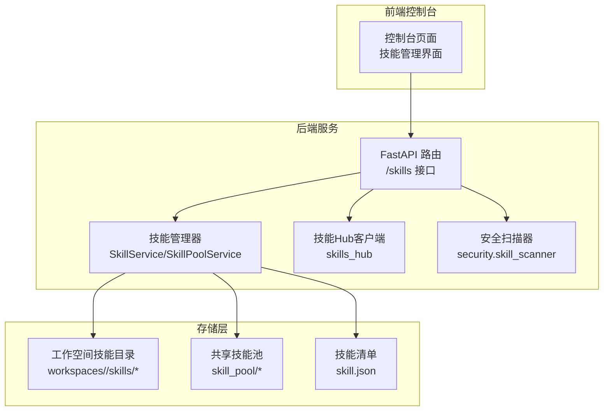
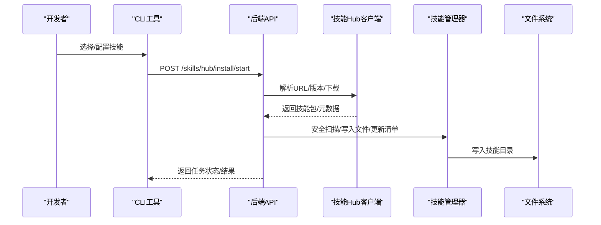
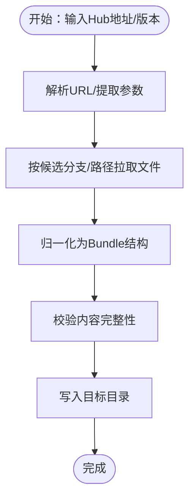
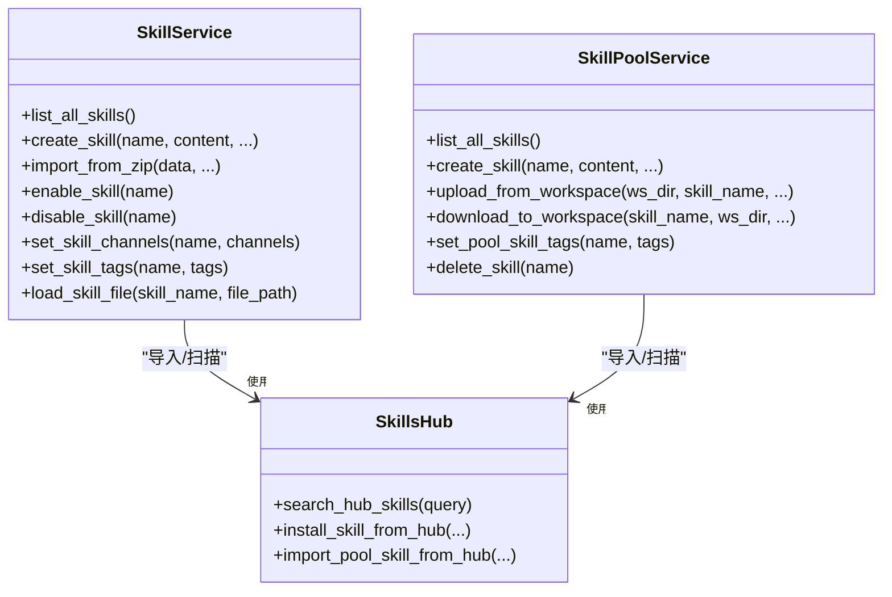
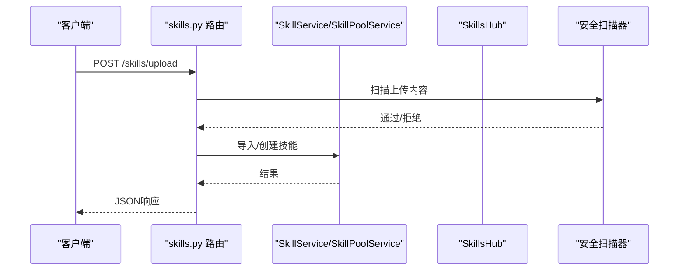
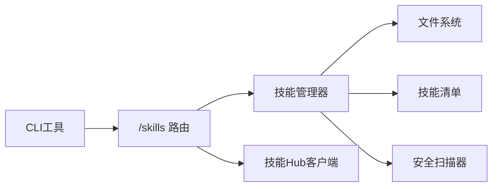

# 技能开发框架概述

<cite>
**本文档引用的文件**
- [skills_hub.py](file://src/qwenpaw/agents/skills_hub.py)
- [skills_manager.py](file://src/qwenpaw/agents/skills_manager.py)
- [skills.py](file://src/qwenpaw/app/routers/skills.py)
- [skills_cmd.py](file://src/qwenpaw/cli/skills_cmd.py)
- [__init__.py](file://src/qwenpaw/agents/skills/__init__.py)
</cite>

## 目录
1. [引言](#引言)
2. [项目结构](#项目结构)
3. [核心组件](#核心组件)
4. [架构总览](#架构总览)
5. [详细组件分析](#详细组件分析)
6. [依赖关系分析](#依赖关系分析)
7. [性能考虑](#性能考虑)
8. [故障排除指南](#故障排除指南)
9. [结论](#结论)
10. [附录](#附录)

## 引言
本文件面向希望在QwenPaw平台上进行技能开发与集成的工程师与产品人员，系统性阐述技能开发框架的整体架构、核心组件与设计理念。重点覆盖以下主题：
- 技能Hub的作用机制与外部生态接入方式
- 技能管理器（SkillService/SkillPoolService）的工作原理与职责边界
- 技能注册与发现流程、生命周期管理与版本控制策略
- 依赖处理与安全扫描机制
- 基本开发概念、术语定义与开发流程指导

通过本概述，读者可以快速理解技能系统的运行机制、掌握开发规范，并据此高效构建可复用、可维护的技能模块。

## 项目结构
技能系统围绕“工作空间（Workspace）—技能池（Skill Pool）—技能Hub”的三层结构组织，配合后端API路由与CLI工具形成完整的开发与运维闭环。

图表来源
- [skills.py:1-120](file://src/qwenpaw/app/routers/skills.py#L1-L120)
- [skills_manager.py:1-120](file://src/qwenpaw/agents/skills_manager.py#L1-L120)
- [skills_hub.py:1-120](file://src/qwenpaw/agents/skills_hub.py#L1-L120)

章节来源
- [skills.py:1-120](file://src/qwenpaw/app/routers/skills.py#L1-L120)
- [skills_manager.py:1-120](file://src/qwenpaw/agents/skills_manager.py#L1-L120)
- [skills_hub.py:1-120](file://src/qwenpaw/agents/skills_hub.py#L1-L120)

## 核心组件
- 技能Hub客户端：负责从外部Hub源解析、下载、校验并导入技能包，支持多平台URL解析与缓存优化。
- 技能管理器：提供工作空间级与共享池级的技能全生命周期管理，包括创建、导入、启用/禁用、通道路由、配置持久化、版本同步与冲突检测。
- 后端API路由：暴露REST接口，统一处理技能查询、上传、安装、批量删除等操作，并集成安全扫描与错误标准化。
- CLI工具：提供命令行交互式配置工作空间技能集合，支持预览变更、安装、启用/禁用等操作。

章节来源
- [skills_hub.py:1-120](file://src/qwenpaw/agents/skills_hub.py#L1-L120)
- [skills_manager.py:2137-2729](file://src/qwenpaw/agents/skills_manager.py#L2137-L2729)
- [skills.py:577-808](file://src/qwenpaw/app/routers/skills.py#L577-L808)
- [skills_cmd.py:121-212](file://src/qwenpaw/cli/skills_cmd.py#L121-L212)

## 架构总览
技能系统采用“声明式清单 + 文件系统内容”的设计：技能内容以目录形式存放于工作空间或技能池中，技能清单（skill.json）作为运行时状态的权威来源，记录启用状态、通道范围、配置、标签与元数据等信息。技能Hub负责从外部生态拉取技能包，经安全扫描与规范化后写入目标位置。

图表来源
- [skills_cmd.py:121-212](file://src/qwenpaw/cli/skills_cmd.py#L121-L212)
- [skills.py:626-683](file://src/qwenpaw/app/routers/skills.py#L626-L683)
- [skills_hub.py:556-702](file://src/qwenpaw/agents/skills_hub.py#L556-L702)
- [skills_manager.py:2137-2729](file://src/qwenpaw/agents/skills_manager.py#L2137-L2729)

## 详细组件分析

### 技能Hub客户端（skills_hub）
- 多源URL解析：支持ClawHub、skills.sh、LobeHub、ModelScope、GitHub等多种入口，自动提取仓库、分支、路径与版本信息。
- 智能缓存与重试：针对GitHub API设置TTL缓存、指数退避重试与速率限制处理，提升稳定性与性能。
- 包装与归一化：将不同来源的技能包统一为内部Bundle格式，提取SKILL.md内容、references/scripts树形结构与额外文件，确保后续导入一致性。
- 取消与超时：通过上下文变量传递取消检查器，支持用户中断长耗时下载任务。

图表来源
- [skills_hub.py:920-1260](file://src/qwenpaw/agents/skills_hub.py#L920-L1260)
- [skills_hub.py:556-702](file://src/qwenpaw/agents/skills_hub.py#L556-L702)

章节来源
- [skills_hub.py:1-120](file://src/qwenpaw/agents/skills_hub.py#L1-L120)
- [skills_hub.py:920-1260](file://src/qwenpaw/agents/skills_hub.py#L920-L1260)

### 技能管理器（SkillService / SkillPoolService）
- 工作空间技能（SkillService）
  - 列表与可用技能查询：基于清单与文件系统扫描，返回当前工作空间内已启用且匹配通道的技能列表。
  - 创建/编辑/导入：支持从文本、Zip包导入技能；导入前执行安全扫描；支持重命名与冲突建议。
  - 启用/禁用/通道设置/标签管理：通过原子更新清单实现状态变更，保证并发安全。
  - 文件读取：提供受控的references/scripts子树文件读取能力，防止路径穿越。
- 技能池（SkillPoolService）
  - 共享池管理：提供池内技能的创建、编辑、删除与批量操作；支持从工作空间上传到池，或从池下载到多个工作空间。
  - 版本与语言同步：对比内置技能版本与语言变体，生成“已同步/过期/缺失”等状态，支持批量导入内置技能。
  - 下载冲突检测：针对内置技能的语言切换、版本升级与同名冲突提供明确提示与回滚保护。

图表来源
- [skills_manager.py:2137-2729](file://src/qwenpaw/agents/skills_manager.py#L2137-L2729)
- [skills_manager.py:2732-3480](file://src/qwenpaw/agents/skills_manager.py#L2732-L3480)
- [skills_hub.py:1-120](file://src/qwenpaw/agents/skills_hub.py#L1-L120)

章节来源
- [skills_manager.py:2137-2729](file://src/qwenpaw/agents/skills_manager.py#L2137-L2729)
- [skills_manager.py:2732-3480](file://src/qwenpaw/agents/skills_manager.py#L2732-L3480)

### 后端API路由（/skills）
- 技能查询与刷新：列出工作空间/技能池中的技能，支持强制重新协调（reconcile）以同步文件系统变化。
- Hub交互：提供搜索、启动安装任务、查询任务状态与取消安装的能力；安装过程异步执行并支持取消。
- 上传与创建：支持ZIP上传与直接创建技能，均集成安全扫描；失败时返回结构化错误。
- 批量操作：支持工作空间与技能池的批量删除，逐项返回结果。

图表来源
- [skills.py:765-808](file://src/qwenpaw/app/routers/skills.py#L765-L808)
- [skills.py:730-762](file://src/qwenpaw/app/routers/skills.py#L730-L762)

章节来源
- [skills.py:577-808](file://src/qwenpaw/app/routers/skills.py#L577-L808)

### CLI工具（skills_cmd）
- 交互式配置：根据工作空间清单与技能池候选，提供多选界面，预览安装/启用/禁用变更，确认后批量应用。
- 预检与回滚：在安装前进行冲突检测与版本比较，失败时提供建议名称；支持取消后清理临时状态。
- 便捷命令：提供list/info等子命令，便于快速查看与诊断。

章节来源
- [skills_cmd.py:121-212](file://src/qwenpaw/cli/skills_cmd.py#L121-L212)
- [skills_cmd.py:214-317](file://src/qwenpaw/cli/skills_cmd.py#L214-L317)

## 依赖关系分析
- 组件耦合
  - API路由依赖技能管理器与技能Hub，用于执行业务逻辑与外部生态交互。
  - 技能管理器依赖文件系统与清单，确保状态与内容一致。
  - 安全扫描器作为横切关注点，在创建/导入/安装等关键路径前置执行。
- 外部依赖
  - GitHub API：用于解析仓库、分支、文件树与内容读取，具备缓存与重试策略。
  - 技能Hub生态：支持ClawHub、skills.sh、LobeHub、ModelScope等多源，统一归一化处理。
- 循环依赖
  - 未见循环依赖迹象；各模块职责清晰，通过函数与类边界隔离。

图表来源
- [skills.py:1-120](file://src/qwenpaw/app/routers/skills.py#L1-L120)
- [skills_manager.py:1-120](file://src/qwenpaw/agents/skills_manager.py#L1-L120)
- [skills_hub.py:1-120](file://src/qwenpaw/agents/skills_hub.py#L1-L120)
- [skills_cmd.py:1-40](file://src/qwenpaw/cli/skills_cmd.py#L1-L40)

章节来源
- [skills.py:1-120](file://src/qwenpaw/app/routers/skills.py#L1-L120)
- [skills_manager.py:1-120](file://src/qwenpaw/agents/skills_manager.py#L1-L120)
- [skills_hub.py:1-120](file://src/qwenpaw/agents/skills_hub.py#L1-L120)
- [skills_cmd.py:1-40](file://src/qwenpaw/cli/skills_cmd.py#L1-L40)

## 性能考虑
- 缓存策略：针对GitHub API请求设置TTL缓存，减少重复请求与限流影响。
- 并发与锁：清单更新采用原子写入与互斥锁，避免竞态条件与部分写入。
- I/O优化：Zip解压与文件复制在临时目录进行，完成后一次性提交，降低磁盘碎片与失败风险。
- 网络健壮性：安装任务支持取消与清理，避免长时间占用资源；对大文件传输设置上限与分块读取。

## 故障排除指南
- 安装被拒（422）
  - 当安全扫描器检测到高危规则或违规内容时，API会返回结构化错误payload，包含严重级别与具体发现项，便于定位问题。
- 冲突与重名
  - 当目标名称已存在或与内置技能冲突时，系统返回建议名称或冲突详情，需根据提示调整目标名称或启用覆盖模式。
- 任务取消
  - 用户可在安装过程中取消，系统将清理临时状态并返回取消结果；若取消发生在扫描阶段，也会进行清理。
- 渠道与权限
  - 若技能未启用或不匹配当前渠道，将不会出现在可用技能列表中；可通过通道设置或启用操作修复。

章节来源
- [skills.py:70-120](file://src/qwenpaw/app/routers/skills.py#L70-L120)
- [skills_manager.py:2548-2632](file://src/qwenpaw/agents/skills_manager.py#L2548-L2632)
- [skills_hub.py:407-420](file://src/qwenpaw/agents/skills_hub.py#L407-L420)

## 结论
QwenPaw技能开发框架以“清单驱动 + 文件系统内容 + 多源Hub生态”为核心，通过SkillService与SkillPoolService实现工作空间与共享池的精细化管理，结合API路由与CLI工具形成完善的开发与运维闭环。其设计强调安全性（前置扫描）、可观测性（结构化错误）、可扩展性（多源Hub）与可维护性（原子更新、冲突检测），能够支撑从个人工作空间到企业级共享池的多样化场景。

## 附录

### 基本概念与术语
- 技能（Skill）：由SKILL.md与相关文件组成的可执行单元，包含名称、描述、版本、引用与脚本等信息。
- 工作空间（Workspace）：每个Agent拥有的独立技能目录与技能清单，用于保存自定义或从池下载的技能。
- 技能池（Skill Pool）：全局共享的技能集合，用于集中管理与跨工作空间复用。
- 清单（skill.json）：技能的运行时状态与元数据的权威来源，记录启用状态、通道、配置、标签与版本等。
- Hub（技能Hub）：外部生态入口，提供技能包的搜索、版本与文件下载能力。
- 安全扫描（Security Scan）：在创建/导入/安装等关键路径前置执行的静态扫描，拦截潜在风险。

### 开发流程指导
- 设计阶段
  - 明确技能职责与对外接口，编写规范化的SKILL.md与必要引用/脚本文件。
  - 在本地工作空间进行功能验证与安全扫描测试。
- 开发阶段
  - 使用CLI或API创建/导入技能，设置通道与标签，启用后观察运行效果。
  - 如需复用，将技能上传至技能池，供其他工作空间下载使用。
- 发布与演进
  - 对外发布时，优先使用技能池中的内置变体，确保语言与版本一致性。
  - 升级时遵循版本控制策略，注意语言切换与冲突提示，必要时进行回滚。