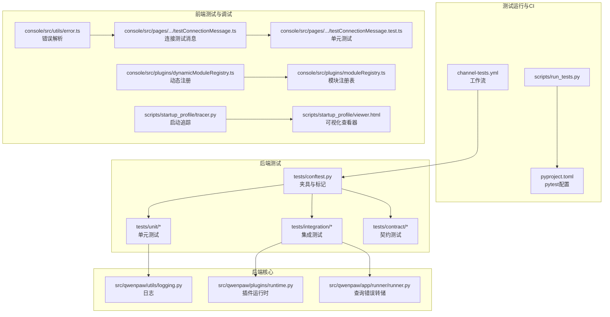
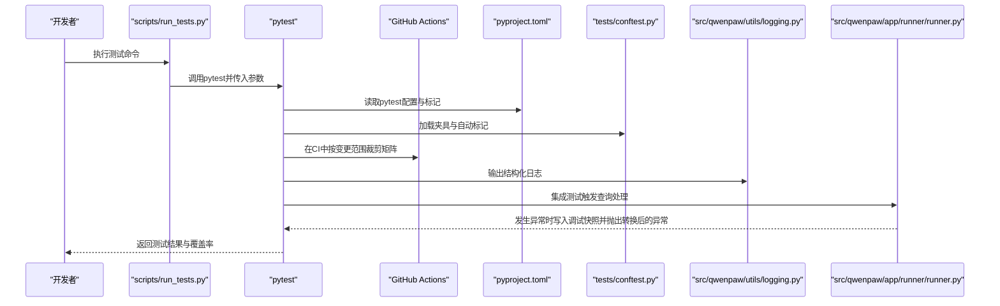
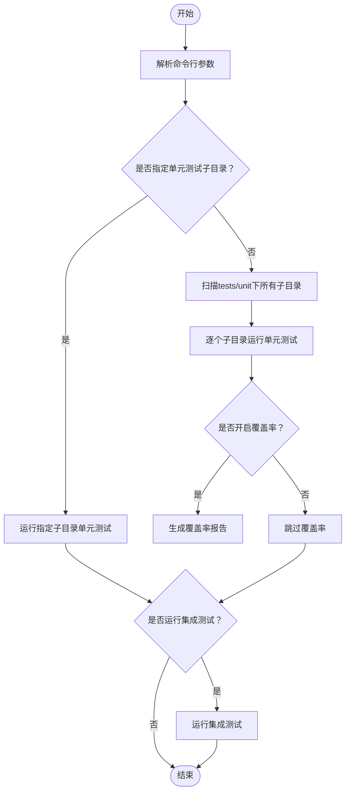
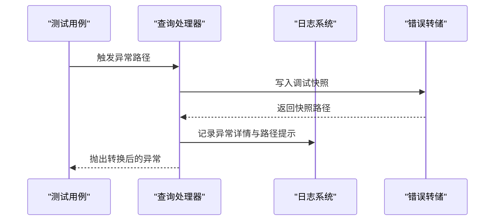
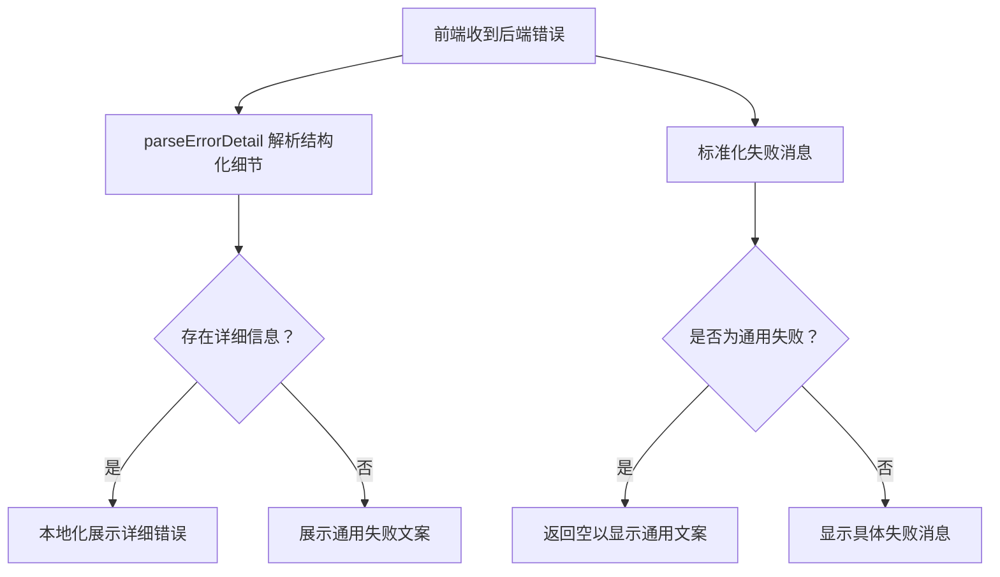
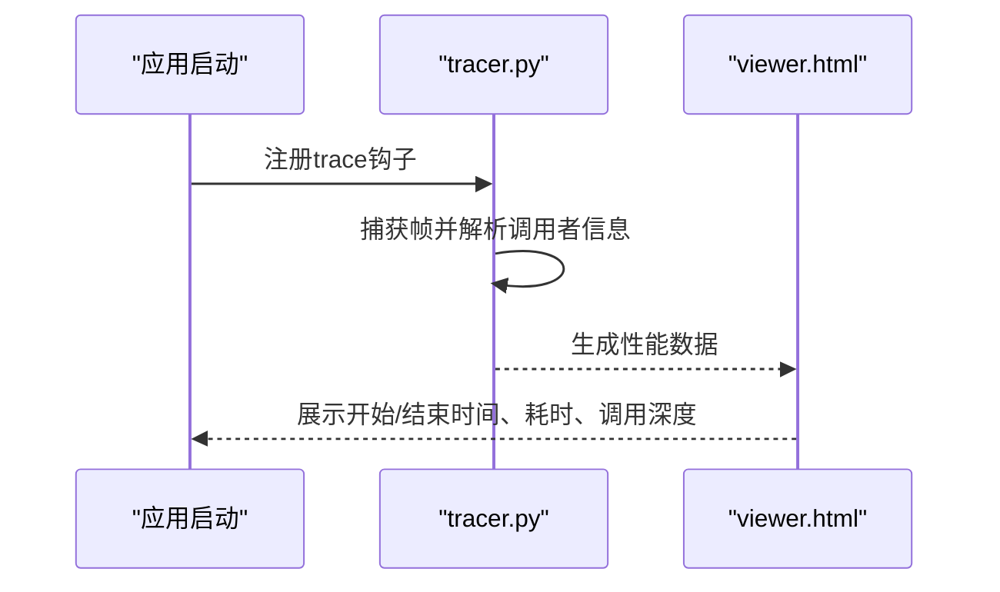
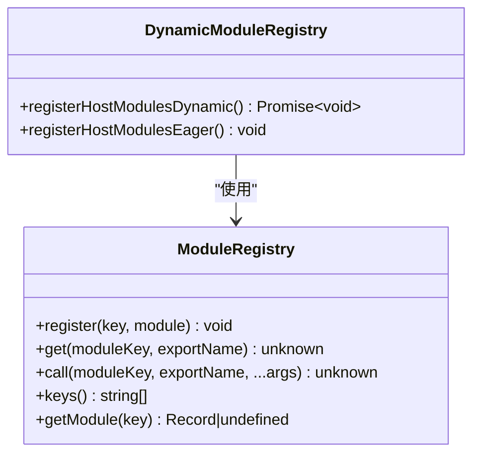
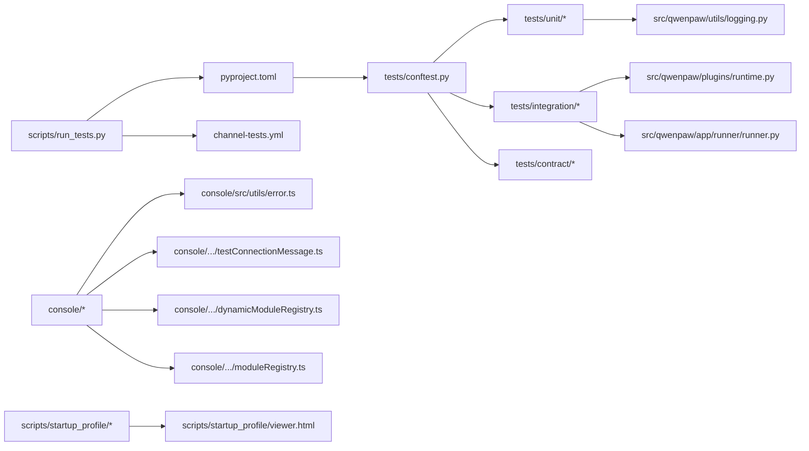

# 测试与调试

<cite>
**本文引用的文件**
- [run_tests.py](file://scripts/run_tests.py)
- [conftest.py](file://tests/conftest.py)
- [pyproject.toml](file://pyproject.toml)
- [channel-tests.yml](file://.github/workflows/channel-tests.yml)
- [logging.py](file://src/qwenpaw/utils/logging.py)
- [runtime.py](file://src/qwenpaw/plugins/runtime.py)
- [runner.py](file://src/qwenpaw/app/runner/runner.py)
- [error.ts](file://console/src/utils/error.ts)
- [testConnectionMessage.ts](file://console/src/pages/Settings/Models/components/modals/testConnectionMessage.ts)
- [testConnectionMessage.test.ts](file://console/src/pages/Settings/Models/components/modals/testConnectionMessage.test.ts)
- [tracer.py](file://scripts/startup_profile/tracer.py)
- [viewer.html](file://scripts/startup_profile/viewer.html)
- [moduleRegistry.ts](file://console/src/plugins/moduleRegistry.ts)
- [dynamicModuleRegistry.ts](file://console/src/plugins/dynamicModuleRegistry.ts)
</cite>

## 目录
1. [引言](#引言)
2. [项目结构](#项目结构)
3. [核心组件](#核心组件)
4. [架构总览](#架构总览)
5. [详细组件分析](#详细组件分析)
6. [依赖分析](#依赖分析)
7. [性能考虑](#性能考虑)
8. [故障排查指南](#故障排查指南)
9. [结论](#结论)
10. [附录](#附录)

## 引言
本指南面向技能开发的测试与调试工作，系统阐述测试策略、用例设计、自动化测试流程与调试技巧。内容覆盖单元测试、集成测试与端到端测试的实施要点，结合项目中的日志体系、错误处理与可视化分析工具，给出性能测试、压力测试与边界条件测试的最佳实践，并提供常见问题排查与错误信息解读。

## 项目结构
本项目采用“后端Python + 前端TypeScript/Vite”的双栈架构，测试体系由Python侧pytest驱动，前端使用Node:test进行组件级验证；CI通过GitHub Actions按变更范围自动裁剪测试矩阵，确保高效与稳定。

图表来源
- [run_tests.py:76-130](file://scripts/run_tests.py#L76-L130)
- [conftest.py:410-430](file://tests/conftest.py#L410-L430)
- [pyproject.toml:111-146](file://pyproject.toml#L111-L146)
- [channel-tests.yml:1-429](file://.github/workflows/channel-tests.yml#L1-L429)
- [logging.py:124-158](file://src/qwenpaw/utils/logging.py#L124-L158)
- [runtime.py:10-67](file://src/qwenpaw/plugins/runtime.py#L10-L67)
- [runner.py:728-763](file://src/qwenpaw/app/runner/runner.py#L728-L763)
- [error.ts:1-11](file://console/src/utils/error.ts#L1-L11)
- [testConnectionMessage.ts:1-52](file://console/src/pages/Settings/Models/components/modals/testConnectionMessage.ts#L1-L52)
- [testConnectionMessage.test.ts:1-20](file://console/src/pages/Settings/Models/components/modals/testConnectionMessage.test.ts#L1-L20)
- [moduleRegistry.ts:1-44](file://console/src/plugins/moduleRegistry.ts#L1-L44)
- [dynamicModuleRegistry.ts:1-116](file://console/src/plugins/dynamicModuleRegistry.ts#L1-L116)
- [tracer.py:82-108](file://scripts/startup_profile/tracer.py#L82-L108)
- [viewer.html:1028-1047](file://scripts/startup_profile/viewer.html#L1028-L1047)

章节来源
- [run_tests.py:76-130](file://scripts/run_tests.py#L76-L130)
- [conftest.py:410-430](file://tests/conftest.py#L410-L430)
- [pyproject.toml:111-146](file://pyproject.toml#L111-L146)
- [channel-tests.yml:1-429](file://.github/workflows/channel-tests.yml#L1-L429)

## 核心组件
- 测试运行器与命令行入口：统一调度单元/集成/全量测试，支持覆盖率与并行执行。
- pytest夹具与标记：自动为不同目录下的测试打上unit/integration/e2e标记，便于选择性执行与CI裁剪。
- 日志与错误转储：后端统一日志输出与文件落盘，查询异常时生成调试快照路径，辅助快速定位。
- 前端错误解析与连接测试消息：对后端返回的错误消息进行解析与本地化展示，提升可诊断性。
- 启动性能追踪与可视化：记录启动阶段关键调用栈与耗时，生成可视化报告辅助性能优化。

章节来源
- [run_tests.py:76-130](file://scripts/run_tests.py#L76-L130)
- [conftest.py:410-430](file://tests/conftest.py#L410-L430)
- [logging.py:124-158](file://src/qwenpaw/utils/logging.py#L124-L158)
- [runner.py:728-763](file://src/qwenpaw/app/runner/runner.py#L728-L763)
- [error.ts:1-11](file://console/src/utils/error.ts#L1-L11)
- [testConnectionMessage.ts:1-52](file://console/src/pages/Settings/Models/components/modals/testConnectionMessage.ts#L1-L52)
- [tracer.py:82-108](file://scripts/startup_profile/tracer.py#L82-L108)
- [viewer.html:1028-1047](file://scripts/startup_profile/viewer.html#L1028-L1047)

## 架构总览
下图展示了从命令行到CI再到测试执行与日志/错误处理的整体流程。

图表来源
- [run_tests.py:175-230](file://scripts/run_tests.py#L175-L230)
- [pyproject.toml:111-146](file://pyproject.toml#L111-L146)
- [conftest.py:410-430](file://tests/conftest.py#L410-L430)
- [channel-tests.yml:1-429](file://.github/workflows/channel-tests.yml#L1-L429)
- [logging.py:124-158](file://src/qwenpaw/utils/logging.py#L124-L158)
- [runner.py:728-763](file://src/qwenpaw/app/runner/runner.py#L728-L763)

## 详细组件分析

### 组件A：测试运行与自动化
- 单元测试：支持按子目录运行或全量扫描，支持覆盖率与并行执行。
- 集成测试：集中于应用启动、版本检测等跨模块场景。
- CI工作流：基于变更文件自动识别受影响通道，构建最小测试矩阵，契约测试失败阻断PR，其他测试失败仅告警。

图表来源
- [run_tests.py:76-130](file://scripts/run_tests.py#L76-L130)
- [run_tests.py:175-230](file://scripts/run_tests.py#L175-L230)

章节来源
- [run_tests.py:76-130](file://scripts/run_tests.py#L76-L130)
- [run_tests.py:175-230](file://scripts/run_tests.py#L175-L230)
- [channel-tests.yml:1-429](file://.github/workflows/channel-tests.yml#L1-L429)

### 组件B：日志与错误转储
- 日志：统一命名空间、颜色控制、文件轮转，避免第三方噪声污染。
- 错误转储：在查询处理异常时生成调试快照文件，附加到异常对象，便于回溯。

图表来源
- [logging.py:124-158](file://src/qwenpaw/utils/logging.py#L124-L158)
- [runner.py:728-763](file://src/qwenpaw/app/runner/runner.py#L728-L763)

章节来源
- [logging.py:124-158](file://src/qwenpaw/utils/logging.py#L124-L158)
- [runner.py:728-763](file://src/qwenpaw/app/runner/runner.py#L728-L763)

### 组件C：前端错误解析与连接测试消息
- 错误解析：从错误消息中提取结构化细节，支持国际化展示。
- 连接测试消息：对通用失败模式进行归一化处理，保留有意义的错误细节。

图表来源
- [error.ts:1-11](file://console/src/utils/error.ts#L1-L11)
- [testConnectionMessage.ts:1-52](file://console/src/pages/Settings/Models/components/modals/testConnectionMessage.ts#L1-L52)
- [testConnectionMessage.test.ts:1-20](file://console/src/pages/Settings/Models/components/modals/testConnectionMessage.test.ts#L1-L20)

章节来源
- [error.ts:1-11](file://console/src/utils/error.ts#L1-L11)
- [testConnectionMessage.ts:1-52](file://console/src/pages/Settings/Models/components/modals/testConnectionMessage.ts#L1-L52)
- [testConnectionMessage.test.ts:1-20](file://console/src/pages/Settings/Models/components/modals/testConnectionMessage.test.ts#L1-L20)

### 组件D：启动性能追踪与可视化
- 追踪：记录调用栈、模块、类与函数信息，统计深度与耗时。
- 可视化：提供HTML页面展示启动阶段的执行信息与性能指标。

图表来源
- [tracer.py:82-108](file://scripts/startup_profile/tracer.py#L82-L108)
- [viewer.html:1028-1047](file://scripts/startup_profile/viewer.html#L1028-L1047)

章节来源
- [tracer.py:82-108](file://scripts/startup_profile/tracer.py#L82-L108)
- [viewer.html:1028-1047](file://scripts/startup_profile/viewer.html#L1028-L1047)

### 组件E：前端模块注册与动态发现
- 模块注册表：提供统一的模块注册、获取与调用接口，支持插件修改导出。
- 动态注册：利用Vite的glob能力在构建期排除测试文件，实现懒加载与自动发现。

图表来源
- [moduleRegistry.ts:1-44](file://console/src/plugins/moduleRegistry.ts#L1-L44)
- [dynamicModuleRegistry.ts:1-116](file://console/src/plugins/dynamicModuleRegistry.ts#L1-L116)

章节来源
- [moduleRegistry.ts:1-44](file://console/src/plugins/moduleRegistry.ts#L1-L44)
- [dynamicModuleRegistry.ts:1-116](file://console/src/plugins/dynamicModuleRegistry.ts#L1-L116)

## 依赖分析
- 测试运行器依赖pytest配置与标记，CI根据变更文件动态裁剪测试矩阵，降低无效执行。
- 日志与错误转储贯穿后端核心流程，保证异常可诊断。
- 前端错误解析与连接测试消息提升用户体验与可维护性。
- 启动性能追踪与可视化为性能优化提供数据支撑。

图表来源
- [run_tests.py:76-130](file://scripts/run_tests.py#L76-L130)
- [pyproject.toml:111-146](file://pyproject.toml#L111-L146)
- [channel-tests.yml:1-429](file://.github/workflows/channel-tests.yml#L1-L429)
- [conftest.py:410-430](file://tests/conftest.py#L410-L430)
- [logging.py:124-158](file://src/qwenpaw/utils/logging.py#L124-L158)
- [runtime.py:10-67](file://src/qwenpaw/plugins/runtime.py#L10-L67)
- [runner.py:728-763](file://src/qwenpaw/app/runner/runner.py#L728-L763)
- [error.ts:1-11](file://console/src/utils/error.ts#L1-L11)
- [testConnectionMessage.ts:1-52](file://console/src/pages/Settings/Models/components/modals/testConnectionMessage.ts#L1-L52)
- [dynamicModuleRegistry.ts:1-116](file://console/src/plugins/dynamicModuleRegistry.ts#L1-L116)
- [moduleRegistry.ts:1-44](file://console/src/plugins/moduleRegistry.ts#L1-L44)
- [viewer.html:1028-1047](file://scripts/startup_profile/viewer.html#L1028-L1047)

章节来源
- [run_tests.py:76-130](file://scripts/run_tests.py#L76-L130)
- [pyproject.toml:111-146](file://pyproject.toml#L111-L146)
- [channel-tests.yml:1-429](file://.github/workflows/channel-tests.yml#L1-L429)
- [conftest.py:410-430](file://tests/conftest.py#L410-L430)

## 性能考虑
- 启动性能：使用启动追踪工具记录关键调用与耗时，结合可视化报告定位瓶颈。
- 并行执行：命令行支持pytest-xdist并行执行，缩短整体测试时间。
- 覆盖率：启用覆盖率报告，关注未覆盖路径，指导针对性用例补充。
- CI裁剪：基于变更文件自动选择受影响模块，减少不必要的测试执行。

章节来源
- [tracer.py:82-108](file://scripts/startup_profile/tracer.py#L82-L108)
- [viewer.html:1028-1047](file://scripts/startup_profile/viewer.html#L1028-L1047)
- [run_tests.py:208-213](file://scripts/run_tests.py#L208-L213)
- [pyproject.toml:124-146](file://pyproject.toml#L124-L146)
- [channel-tests.yml:1-429](file://.github/workflows/channel-tests.yml#L1-L429)

## 故障排查指南
- 日志定位：检查统一命名空间的日志输出，确认级别与格式；在Windows环境下启用ANSI支持以便彩色输出。
- 错误转储：当查询处理出现异常时，查看调试快照路径，结合异常对象的附加信息进行回溯。
- 前端错误：使用错误解析工具提取结构化细节，结合连接测试消息的本地化逻辑判断是否为通用失败。
- CI状态：关注契约测试失败会阻断PR，其他测试失败仅作为告警；优先解决契约不兼容问题。

章节来源
- [logging.py:124-158](file://src/qwenpaw/utils/logging.py#L124-L158)
- [runner.py:728-763](file://src/qwenpaw/app/runner/runner.py#L728-L763)
- [error.ts:1-11](file://console/src/utils/error.ts#L1-L11)
- [testConnectionMessage.ts:1-52](file://console/src/pages/Settings/Models/components/modals/testConnectionMessage.ts#L1-L52)
- [channel-tests.yml:409-429](file://.github/workflows/channel-tests.yml#L409-L429)

## 结论
本指南提供了从策略到实操的技能开发测试与调试方案：以pytest为核心，结合CI裁剪、日志与错误转储、前端错误解析与可视化性能分析，形成完整的质量闭环。建议在日常开发中遵循“先单元后集成再端到端”的分层策略，持续完善用例覆盖与性能基线，确保系统稳定性与可维护性。

## 附录
- 测试环境搭建：安装开发依赖后，使用测试运行器命令执行；在CI中可通过工作流自动裁剪测试矩阵。
- 测试数据准备：利用夹具与标记管理环境变量与模拟对象，确保测试隔离与可重复性。
- 评估标准：覆盖率阈值、契约测试通过率、异常转储完整性、前端错误可诊断性与启动性能指标。

章节来源
- [run_tests.py:221-228](file://scripts/run_tests.py#L221-L228)
- [pyproject.toml:111-146](file://pyproject.toml#L111-L146)
- [conftest.py:292-333](file://tests/conftest.py#L292-L333)
- [channel-tests.yml:1-429](file://.github/workflows/channel-tests.yml#L1-L429)