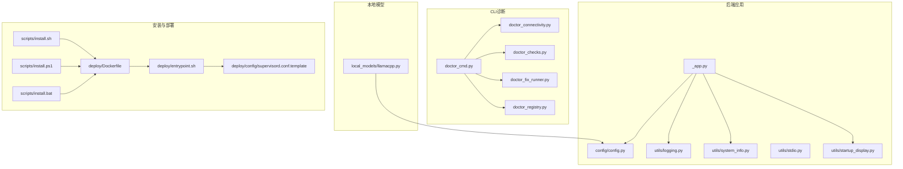
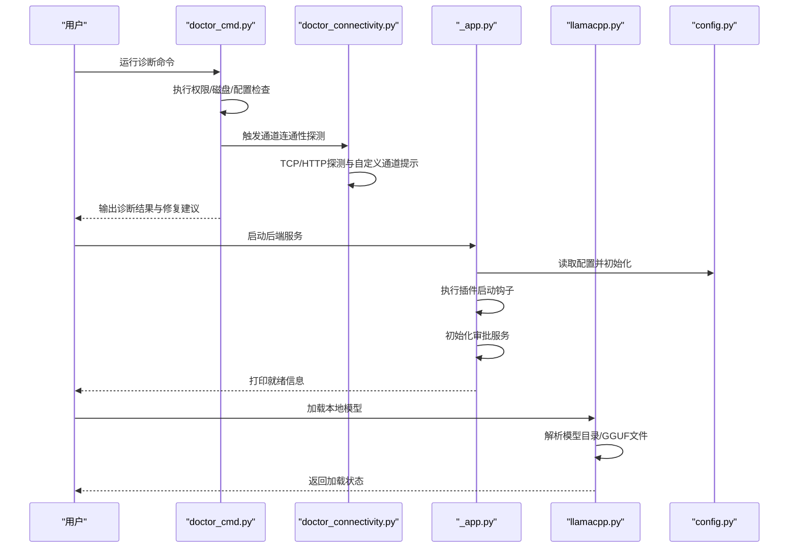
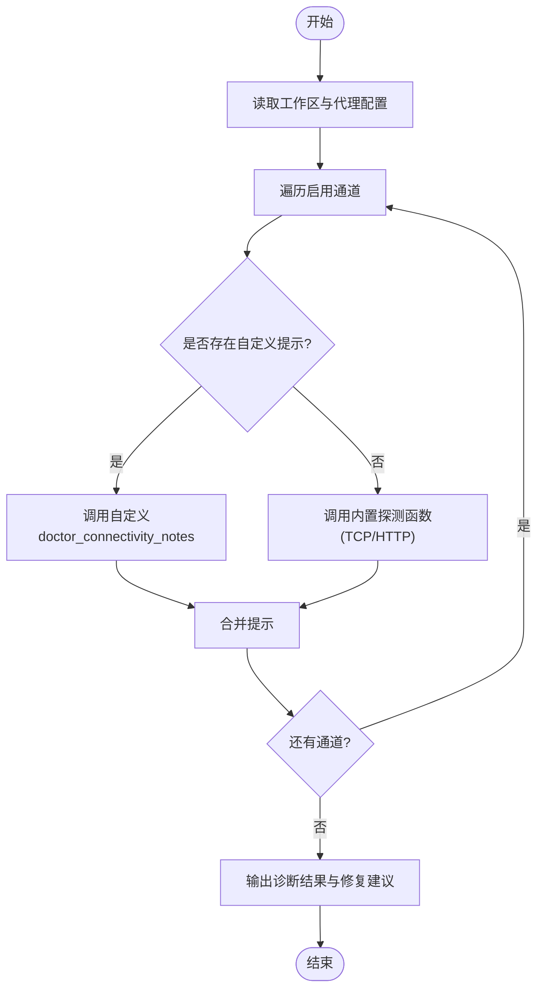
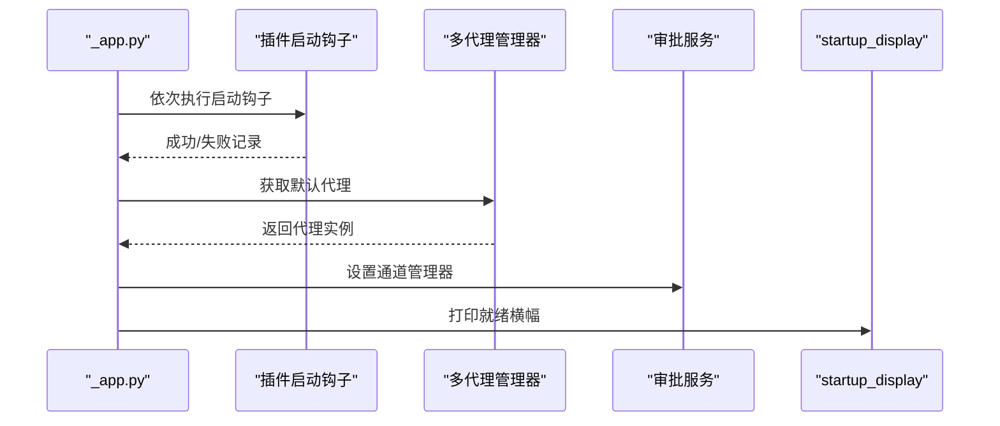
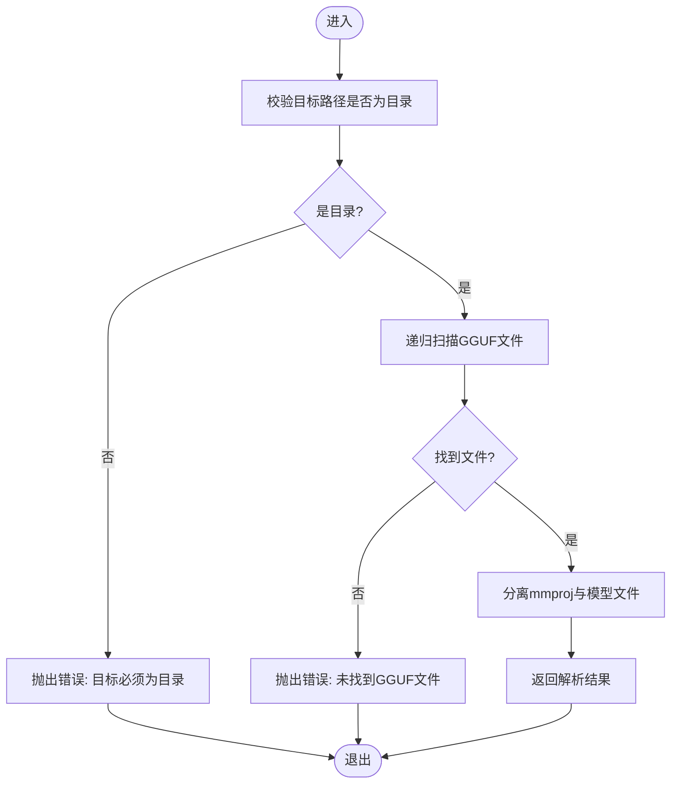
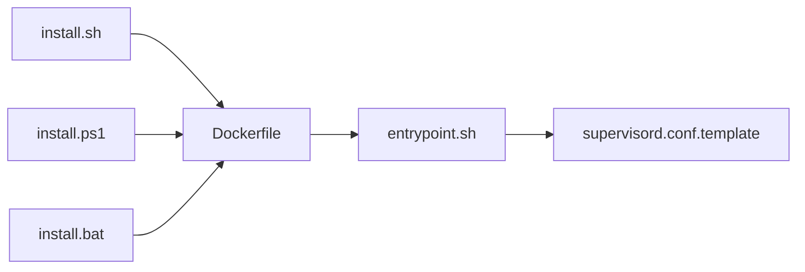
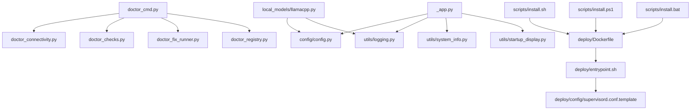

# 常见问题解决

<cite>
**本文引用的文件**
- [src/qwenpaw/cli/doctor_cmd.py](file://src/qwenpaw/cli/doctor_cmd.py)
- [src/qwenpaw/cli/doctor_connectivity.py](file://src/qwenpaw/cli/doctor_connectivity.py)
- [src/qwenpaw/cli/doctor_checks.py](file://src/qwenpaw/cli/doctor_checks.py)
- [src/qwenpaw/cli/doctor_fix_runner.py](file://src/qwenpaw/cli/doctor_fix_runner.py)
- [src/qwenpaw/cli/doctor_registry.py](file://src/qwenpaw/cli/doctor_registry.py)
- [src/qwenpaw/local_models/llamacpp.py](file://src/qwenpaw/local_models/llamacpp.py)
- [src/qwenpaw/app/_app.py](file://src/qwenpaw/app/_app.py)
- [src/qwenpaw/exceptions.py](file://src/qwenpaw/exceptions.py)
- [src/qwenpaw/config/config.py](file://src/qwenpaw/config/config.py)
- [src/qwenpaw/utils/logging.py](file://src/qwenpaw/utils/logging.py)
- [src/qwenpaw/utils/system_info.py](file://src/qwenpaw/utils/system_info.py)
- [src/qwenpaw/utils/stdio.py](file://src/qwenpaw/utils/stdio.py)
- [src/qwenpaw/utils/telemetry.py](file://src/qwenpaw/utils/telemetry.py)
- [src/qwenpaw/utils/command_runner.py](file://src/qwenpaw/utils/command_runner.py)
- [src/qwenpaw/utils/startup_display.py](file://src/qwenpaw/utils/startup_display.py)
- [src/qwenpaw/agents/prompt.py](file://src/qwenpaw/agents/prompt.py)
- [src/qwenpaw/agents/skills/guidance-en/SKILL.md](file://src/qwenpaw/agents/skills/guidance-en/SKILL.md)
- [scripts/install.sh](file://scripts/install.sh)
- [scripts/install.ps1](file://scripts/install.ps1)
- [scripts/install.bat](file://scripts/install.bat)
- [deploy/Dockerfile](file://deploy/Dockerfile)
- [deploy/config/supervisord.conf.template](file://deploy/config/supervisord.conf.template)
- [deploy/entrypoint.sh](file://deploy/entrypoint.sh)
- [website/src/pages/Home/components/FAQ.tsx](file://website/src/pages/Home/components/FAQ.tsx)
</cite>

## 目录
1. [简介](#简介)
2. [项目结构](#项目结构)
3. [核心组件](#核心组件)
4. [架构总览](#架构总览)
5. [详细组件分析](#详细组件分析)
6. [依赖关系分析](#依赖关系分析)
7. [性能与稳定性考量](#性能与稳定性考量)
8. [故障排查指南](#故障排查指南)
9. [结论](#结论)
10. [附录](#附录)

## 简介
本指南面向不同技术背景的用户，系统性梳理QwenPaw在安装、配置与运行过程中常见的问题与解决方案，覆盖配置文件错误、权限问题、网络连接失败、本地模型加载异常、启动与后台任务异常等场景。文档提供症状描述、可能原因、分步解决步骤、预防措施与最佳实践，并给出错误代码对照与快速诊断流程，帮助用户从简单重启到复杂系统修复逐步定位并解决问题。

## 项目结构
QwenPaw由Python后端服务、前端控制台、CLI诊断工具、本地模型管理器、通道适配器、备份与迁移模块等组成。关键子系统包括：
- CLI诊断与修复：doctor系列命令用于检查配置、权限、网络连通性与磁盘空间等
- 后端应用：启动、插件钩子、后台任务与审批服务初始化
- 本地模型：Llama.cpp后端模型解析与加载
- 配置与日志：全局配置、时区、日志与系统信息采集
- 安装与部署：Shell脚本与Dockerfile、Supervisord模板

**图表来源**
- [src/qwenpaw/cli/doctor_cmd.py:1-200](file://src/qwenpaw/cli/doctor_cmd.py#L1-L200)
- [src/qwenpaw/cli/doctor_connectivity.py:1-120](file://src/qwenpaw/cli/doctor_connectivity.py#L1-L120)
- [src/qwenpaw/app/_app.py:401-435](file://src/qwenpaw/app/_app.py#L401-L435)
- [src/qwenpaw/local_models/llamacpp.py:434-480](file://src/qwenpaw/local_models/llamacpp.py#L434-L480)
- [scripts/install.sh:1-120](file://scripts/install.sh#L1-L120)
- [deploy/Dockerfile:1-120](file://deploy/Dockerfile#L1-L120)
- [deploy/config/supervisord.conf.template:1-120](file://deploy/config/supervisord.conf.template#L1-L120)

**章节来源**
- [src/qwenpaw/cli/doctor_cmd.py:1-200](file://src/qwenpaw/cli/doctor_cmd.py#L1-L200)
- [src/qwenpaw/app/_app.py:401-435](file://src/qwenpaw/app/_app.py#L401-L435)
- [src/qwenpaw/local_models/llamacpp.py:434-480](file://src/qwenpaw/local_models/llamacpp.py#L434-L480)
- [scripts/install.sh:1-120](file://scripts/install.sh#L1-L120)
- [deploy/Dockerfile:1-120](file://deploy/Dockerfile#L1-L120)

## 核心组件
- CLI诊断与修复：提供“健康检查”“连通性探测”“权限与磁盘检查”“修复建议”等能力，支持自定义通道的连通性提示
- 后端应用启动：执行插件启动钩子、初始化审批服务、打印就绪信息
- 本地模型管理：解析模型仓库中的GGUF文件，校验模型类型与多模态投影文件
- 配置与日志：集中式配置读取、时区处理、日志记录与系统信息采集
- 安装与部署：跨平台安装脚本与容器化部署模板

**章节来源**
- [src/qwenpaw/cli/doctor_cmd.py:707-726](file://src/qwenpaw/cli/doctor_cmd.py#L707-L726)
- [src/qwenpaw/app/_app.py:401-435](file://src/qwenpaw/app/_app.py#L401-L435)
- [src/qwenpaw/local_models/llamacpp.py:434-480](file://src/qwenpaw/local_models/llamacpp.py#L434-L480)
- [src/qwenpaw/config/config.py:1-120](file://src/qwenpaw/config/config.py#L1-L120)
- [src/qwenpaw/utils/logging.py:1-120](file://src/qwenpaw/utils/logging.py#L1-L120)

## 架构总览
下图展示从用户触发到系统响应的关键路径，包括CLI诊断、后端启动、本地模型加载与网络连通性检查：

**图表来源**
- [src/qwenpaw/cli/doctor_cmd.py:1-200](file://src/qwenpaw/cli/doctor_cmd.py#L1-L200)
- [src/qwenpaw/cli/doctor_connectivity.py:1-120](file://src/qwenpaw/cli/doctor_connectivity.py#L1-L120)
- [src/qwenpaw/app/_app.py:401-435](file://src/qwenpaw/app/_app.py#L401-L435)
- [src/qwenpaw/local_models/llamacpp.py:434-480](file://src/qwenpaw/local_models/llamacpp.py#L434-L480)
- [src/qwenpaw/config/config.py:1-120](file://src/qwenpaw/config/config.py#L1-L120)

## 详细组件分析

### 组件A：CLI诊断与修复（doctor）
- 功能要点
  - 权限与磁盘检查：检测工作区可写性与所有权，输出修复提示
  - 连通性探测：对已启用通道进行TCP/HTTP探测，支持自定义通道提示
  - 注册与执行：通过注册表组织检查项，统一输出格式
- 关键流程
  - 读取工作区与代理配置
  - 遍历启用通道，调用内置或自定义探测函数
  - 聚合结果并输出“通过/失败/跳过”及修复建议

**图表来源**
- [src/qwenpaw/cli/doctor_cmd.py:707-726](file://src/qwenpaw/cli/doctor_cmd.py#L707-L726)
- [src/qwenpaw/cli/doctor_connectivity.py:256-297](file://src/qwenpaw/cli/doctor_connectivity.py#L256-L297)

**章节来源**
- [src/qwenpaw/cli/doctor_cmd.py:707-726](file://src/qwenpaw/cli/doctor_cmd.py#L707-L726)
- [src/qwenpaw/cli/doctor_connectivity.py:1-120](file://src/qwenpaw/cli/doctor_connectivity.py#L1-L120)
- [src/qwenpaw/cli/doctor_registry.py:1-120](file://src/qwenpaw/cli/doctor_registry.py#L1-L120)

### 组件B：后端应用启动与后台任务
- 功能要点
  - 插件启动钩子：按序执行插件初始化逻辑，异常会被记录但不影响整体启动
  - 审批服务初始化：在默认代理可用时设置通道管理器
  - 就绪提示：在后台日志之后再次打印服务地址，便于用户确认
- 关键流程
  - 启动计时与日志
  - 获取默认代理与通道管理器
  - 设置审批服务并打印就绪横幅

**图表来源**
- [src/qwenpaw/app/_app.py:401-435](file://src/qwenpaw/app/_app.py#L401-L435)

**章节来源**
- [src/qwenpaw/app/_app.py:401-435](file://src/qwenpaw/app/_app.py#L401-L435)

### 组件C：本地模型加载（Llama.cpp）
- 功能要点
  - 目录解析：确保目标路径为目录；若为文件则要求扩展名为GGUF
  - 文件筛选：递归查找非隐藏目录下的GGUF文件，区分多模态投影与模型文件
- 关键流程
  - 输入校验与路径解析
  - GGUF文件扫描与过滤
  - 抛出明确错误以指导用户修正

**图表来源**
- [src/qwenpaw/local_models/llamacpp.py:434-480](file://src/qwenpaw/local_models/llamacpp.py#L434-L480)

**章节来源**
- [src/qwenpaw/local_models/llamacpp.py:434-480](file://src/qwenpaw/local_models/llamacpp.py#L434-L480)

### 组件D：安装与部署
- 安装脚本：提供Linux/macOS/Windows三套安装脚本，负责环境准备与依赖安装
- 容器化部署：Dockerfile与Supervisord模板定义镜像构建与进程管理
- 入口脚本：容器入口脚本负责初始化与守护进程启动

**图表来源**
- [scripts/install.sh:1-120](file://scripts/install.sh#L1-L120)
- [scripts/install.ps1:1-120](file://scripts/install.ps1#L1-L120)
- [scripts/install.bat:1-120](file://scripts/install.bat#L1-L120)
- [deploy/Dockerfile:1-120](file://deploy/Dockerfile#L1-L120)
- [deploy/config/supervisord.conf.template:1-120](file://deploy/config/supervisord.conf.template#L1-L120)
- [deploy/entrypoint.sh:1-120](file://deploy/entrypoint.sh#L1-L120)

**章节来源**
- [scripts/install.sh:1-120](file://scripts/install.sh#L1-L120)
- [scripts/install.ps1:1-120](file://scripts/install.ps1#L1-L120)
- [scripts/install.bat:1-120](file://scripts/install.bat#L1-L120)
- [deploy/Dockerfile:1-120](file://deploy/Dockerfile#L1-L120)
- [deploy/config/supervisord.conf.template:1-120](file://deploy/config/supervisord.conf.template#L1-L120)
- [deploy/entrypoint.sh:1-120](file://deploy/entrypoint.sh#L1-L120)

## 依赖关系分析
- CLI诊断依赖通道注册表与配置读取，探测结果影响修复建议
- 后端应用依赖配置模块与日志模块，启动阶段输出系统信息
- 本地模型依赖配置与文件系统，错误信息需明确指引
- 安装与部署脚本与容器模板共同决定运行环境与进程生命周期

**图表来源**
- [src/qwenpaw/cli/doctor_cmd.py:1-200](file://src/qwenpaw/cli/doctor_cmd.py#L1-L200)
- [src/qwenpaw/app/_app.py:401-435](file://src/qwenpaw/app/_app.py#L401-L435)
- [src/qwenpaw/local_models/llamacpp.py:434-480](file://src/qwenpaw/local_models/llamacpp.py#L434-L480)
- [scripts/install.sh:1-120](file://scripts/install.sh#L1-L120)
- [deploy/Dockerfile:1-120](file://deploy/Dockerfile#L1-L120)

**章节来源**
- [src/qwenpaw/cli/doctor_cmd.py:1-200](file://src/qwenpaw/cli/doctor_cmd.py#L1-L200)
- [src/qwenpaw/app/_app.py:401-435](file://src/qwenpaw/app/_app.py#L401-L435)
- [src/qwenpaw/local_models/llamacpp.py:434-480](file://src/qwenpaw/local_models/llamacpp.py#L434-L480)
- [scripts/install.sh:1-120](file://scripts/install.sh#L1-L120)
- [deploy/Dockerfile:1-120](file://deploy/Dockerfile#L1-L120)

## 性能与稳定性考量
- 启动时间：后台启动完成后会再次打印服务地址，便于用户确认就绪状态
- 日志级别：默认记录调试与错误信息，便于定位问题
- 磁盘与权限：定期检查工作区可写性，避免因权限不足导致数据丢失或功能受限
- 连通性：对启用通道进行TCP/HTTP探测，减少无效配置带来的等待与失败

[本节为通用建议，无需特定文件引用]

## 故障排查指南

### 一、安装与环境问题
- 症状
  - 安装脚本执行失败或依赖缺失
  - 容器启动后无服务地址输出
- 可能原因
  - 权限不足或缺少必要系统包
  - 容器内进程未正确初始化
- 解决步骤
  - 使用对应平台安装脚本，确保以具备sudo权限的用户运行
  - 检查Dockerfile与entrypoint脚本，确认初始化顺序与Supervisord配置
  - 查看容器日志，确认服务地址打印位置
- 预防措施
  - 在受控环境中先验证安装脚本
  - 使用官方镜像并遵循部署模板

**章节来源**
- [scripts/install.sh:1-120](file://scripts/install.sh#L1-L120)
- [scripts/install.ps1:1-120](file://scripts/install.ps1#L1-L120)
- [scripts/install.bat:1-120](file://scripts/install.bat#L1-L120)
- [deploy/Dockerfile:1-120](file://deploy/Dockerfile#L1-L120)
- [deploy/entrypoint.sh:1-120](file://deploy/entrypoint.sh#L1-L120)
- [src/qwenpaw/utils/startup_display.py:1-120](file://src/qwenpaw/utils/startup_display.py#L1-L120)

### 二、配置文件错误
- 症状
  - 启动时报错或功能不可用
  - 通道配置不生效
- 可能原因
  - 配置字段缺失或拼写错误
  - 工作区路径不存在或权限不足
- 解决步骤
  - 使用doctor命令检查配置有效性
  - 确认工作区目录存在且当前用户拥有写权限
  - 重新生成或修正配置文件
- 预防措施
  - 在修改配置后运行doctor进行验证
  - 使用默认配置作为基线，逐步增量调整

**章节来源**
- [src/qwenpaw/cli/doctor_cmd.py:707-726](file://src/qwenpaw/cli/doctor_cmd.py#L707-L726)
- [src/qwenpaw/config/config.py:1-120](file://src/qwenpaw/config/config.py#L1-L120)

### 三、权限问题
- 症状
  - 写入失败、文件创建异常
  - doctor提示需要修复文件系统权限
- 可能原因
  - 工作区目录归属或权限不正确
- 解决步骤
  - 依据doctor输出，手动修正目录属主与权限
  - 确保运行用户对工作区有读写权限
- 预防措施
  - 部署时即设定正确的用户与目录权限
  - 定期巡检工作区可写性

**章节来源**
- [src/qwenpaw/cli/doctor_cmd.py:707-726](file://src/qwenpaw/cli/doctor_cmd.py#L707-L726)

### 四、网络连接失败
- 症状
  - 通道消息发送失败或超时
  - doctor输出连通性告警
- 可能原因
  - 外网不可达、防火墙拦截、代理配置错误
- 解决步骤
  - 使用doctor的连通性探测功能定位失败通道
  - 检查网络策略、DNS与代理设置
  - 对自定义通道实现doctor_connectivity_notes补充提示
- 预防措施
  - 在生产环境提前打通网络策略
  - 为常用通道提供默认连通性探测规则

**章节来源**
- [src/qwenpaw/cli/doctor_connectivity.py:1-120](file://src/qwenpaw/cli/doctor_connectivity.py#L1-L120)
- [src/qwenpaw/cli/doctor_cmd.py:1-200](file://src/qwenpaw/cli/doctor_cmd.py#L1-L200)

### 五、本地模型无法加载
- 症状
  - 模型文件未被识别或报错
  - GGUF文件缺失或多模态投影文件命名不符合预期
- 可能原因
  - 目标路径不是目录或文件不是GGUF
  - 模型仓库中未发现任何GGUF文件
- 解决步骤
  - 确认模型目录存在且包含至少一个GGUF文件
  - 若为单文件请传入目录路径
  - 检查多模态投影文件命名是否以mmproj开头
- 预防措施
  - 使用标准模型仓库结构
  - 在部署前验证模型文件完整性

**章节来源**
- [src/qwenpaw/local_models/llamacpp.py:434-480](file://src/qwenpaw/local_models/llamacpp.py#L434-L480)

### 六、启动与后台任务异常
- 症状
  - 后台任务未启动或中途退出
  - 启动后未显示服务地址
- 可能原因
  - 插件启动钩子异常
  - 审批服务初始化失败
- 解决步骤
  - 查看后端日志，定位插件钩子异常
  - 确认默认代理与通道管理器可用
  - 重新启动服务并观察就绪横幅输出
- 预防措施
  - 在开发插件时做好异常捕获与日志记录
  - 启动前运行doctor进行健康检查

**章节来源**
- [src/qwenpaw/app/_app.py:401-435](file://src/qwenpaw/app/_app.py#L401-L435)
- [src/qwenpaw/utils/logging.py:1-120](file://src/qwenpaw/utils/logging.py#L1-L120)

### 七、引导与首次设置
- 症状
  - 首次运行出现引导提示
- 可能原因
  - 缺少引导文件或未按指引完成设置
- 解决步骤
  - 阅读引导文件内容，按步骤完成身份与偏好定义
  - 创建/更新必要文件后删除引导文件
- 预防措施
  - 首次部署时预留引导流程时间

**章节来源**
- [src/qwenpaw/agents/prompt.py:328-372](file://src/qwenpaw/agents/prompt.py#L328-L372)

### 八、错误代码对照与快速诊断
- 错误代码对照（示例）
  - 401：认证失败或令牌无效
  - 40404：工具未找到（本地工具或技能缺失）
- 快速诊断方法
  - 使用doctor命令进行全量检查
  - 查看后端日志定位具体异常
  - 针对网络问题使用连通性探测
  - 针对模型问题检查GGUF文件与目录结构

**章节来源**
- [website/src/pages/Home/components/FAQ.tsx:247-284](file://website/src/pages/Home/components/FAQ.tsx#L247-L284)
- [src/qwenpaw/cli/doctor_cmd.py:1-200](file://src/qwenpaw/cli/doctor_cmd.py#L1-L200)
- [src/qwenpaw/utils/logging.py:1-120](file://src/qwenpaw/utils/logging.py#L1-L120)

## 结论
通过CLI诊断工具、后端启动流程、本地模型加载与网络连通性检查的协同，QwenPaw提供了从安装到运行的全链路问题定位能力。建议用户在部署与日常运维中坚持“先检查、再修复、后验证”的流程，结合本文提供的步骤与最佳实践，快速定位并解决常见问题。

[本节为总结，无需特定文件引用]

## 附录

### A. 最佳实践清单
- 安装阶段
  - 使用官方安装脚本并以具备sudo权限的用户运行
  - 验证Docker镜像与Supervisord配置
- 配置阶段
  - 使用doctor命令验证配置有效性
  - 保持工作区目录权限正确
- 运行阶段
  - 定期运行doctor进行健康检查
  - 记录并分析日志，关注插件钩子与审批服务初始化
  - 对网络通道进行周期性连通性测试
  - 本地模型部署前验证GGUF文件与目录结构

**章节来源**
- [src/qwenpaw/cli/doctor_cmd.py:1-200](file://src/qwenpaw/cli/doctor_cmd.py#L1-L200)
- [src/qwenpaw/app/_app.py:401-435](file://src/qwenpaw/app/_app.py#L401-L435)
- [src/qwenpaw/local_models/llamacpp.py:434-480](file://src/qwenpaw/local_models/llamacpp.py#L434-L480)
- [src/qwenpaw/utils/logging.py:1-120](file://src/qwenpaw/utils/logging.py#L1-L120)

### B. 渐进式解决方案路径
- 第一步：重启服务与重试
- 第二步：运行doctor命令获取诊断报告
- 第三步：检查权限与网络连通性
- 第四步：核对配置文件与模型仓库结构
- 第五步：查看日志并定位异常插件或通道
- 第六步：回滚变更或恢复备份

**章节来源**
- [src/qwenpaw/cli/doctor_cmd.py:1-200](file://src/qwenpaw/cli/doctor_cmd.py#L1-L200)
- [src/qwenpaw/utils/logging.py:1-120](file://src/qwenpaw/utils/logging.py#L1-L120)