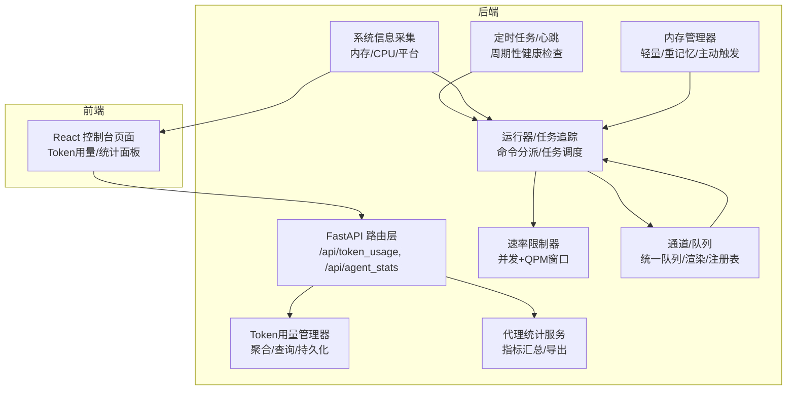
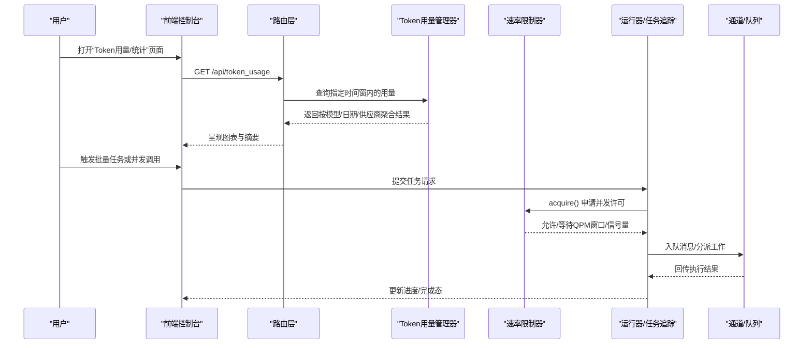
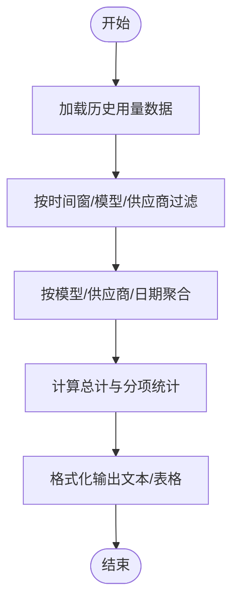
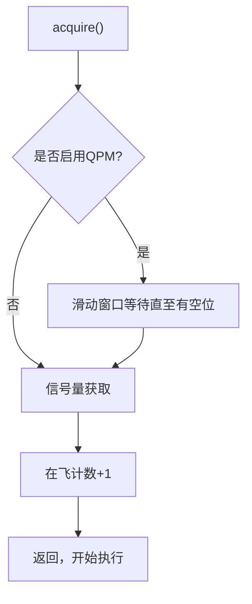
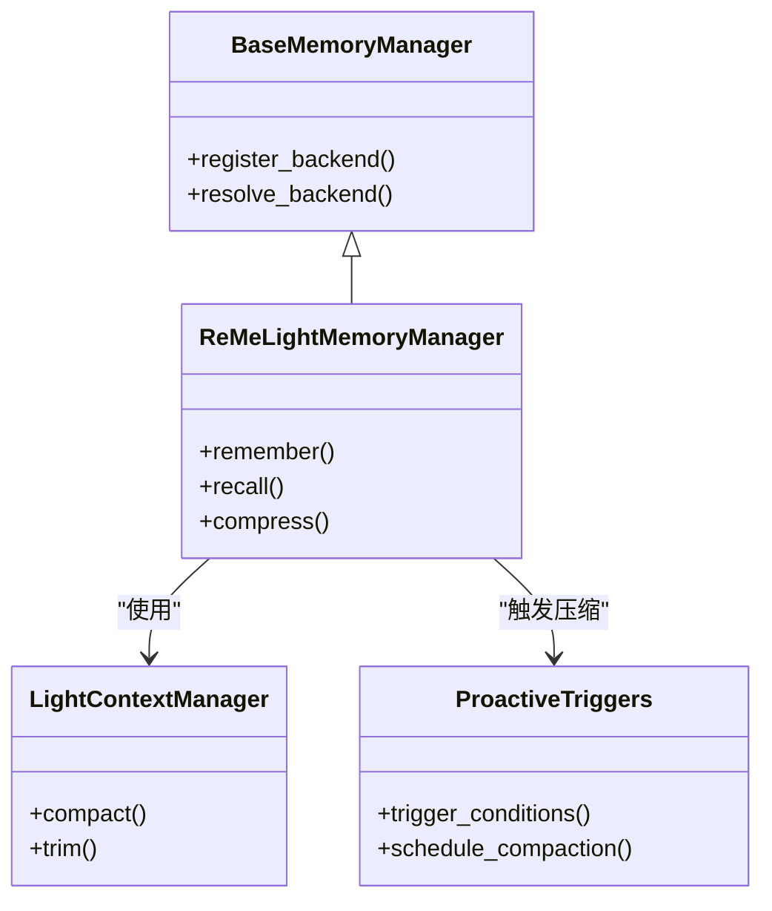
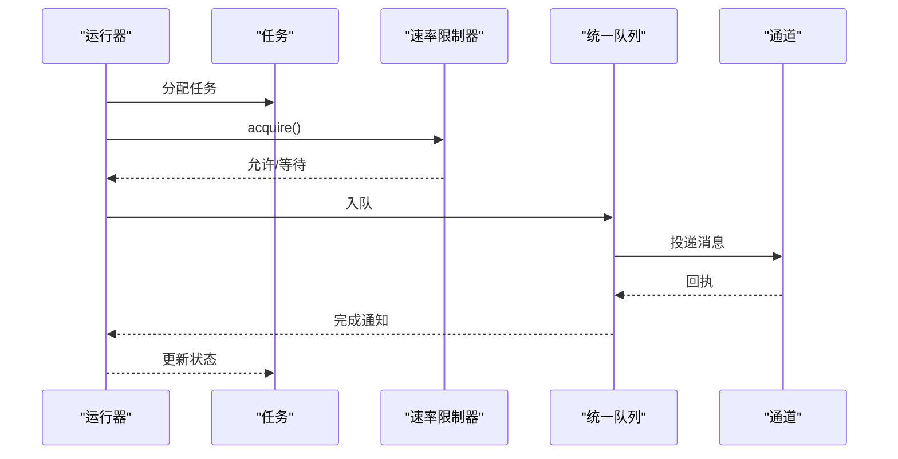
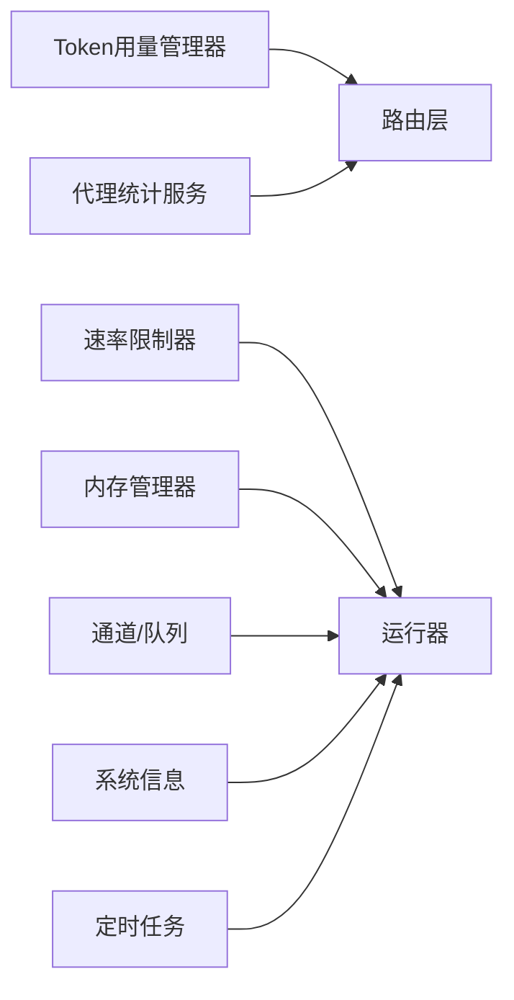

# 性能诊断工具

<cite>
**本文引用的文件**
- [src/qwenpaw/token_usage/manager.py](file://src/qwenpaw/token_usage/manager.py)
- [src/qwenpaw/agents/tools/get_token_usage.py](file://src/qwenpaw/agents/tools/get_token_usage.py)
- [src/qwenpaw/providers/rate_limiter.py](file://src/qwenpaw/providers/rate_limiter.py)
- [src/qwenpaw/utils/system_info.py](file://src/qwenpaw/utils/system_info.py)
- [src/qwenpaw/agents/memory/base_memory_manager.py](file://src/qwenpaw/agents/memory/base_memory_manager.py)
- [src/qwenpaw/agents/memory/reme_light_memory_manager.py](file://src/qwenpaw/agents/memory/reme_light_memory_manager.py)
- [src/qwenpaw/agents/memory/proactive/proactive_prompts.py](file://src/qwenpaw/agents/memory/proactive/proactive_prompts.py)
- [src/qwenpaw/agents/context/light_context_manager.py](file://src/qwenpaw/agents/context/light_context_manager.py)
- [src/qwenpaw/agents/context/compactor_prompts.py](file://src/qwenpaw/agents/context/compactor_prompts.py)
- [src/qwenpaw/app/routers/token_usage.py](file://src/qwenpaw/app/routers/token_usage.py)
- [src/qwenpaw/app/routers/agent_stats.py](file://src/qwenpaw/app/routers/agent_stats.py)
- [src/qwenpaw/agent_stats/service.py](file://src/qwenpaw/agent_stats/service.py)
- [src/qwenpaw/agent_stats/models.py](file://src/qwenpaw/agent_stats/models.py)
- [src/qwenpaw/app/runner/runner.py](file://src/qwenpaw/app/runner/runner.py)
- [src/qwenpaw/app/runner/task_tracker.py](file://src/qwenpaw/app/runner/task_tracker.py)
- [src/qwenpaw/app/runner/command_dispatch.py](file://src/qwenpaw/app/runner/command_dispatch.py)
- [src/qwenpaw/app/runner/mission_dispatch.py](file://src/qwenpaw/app/runner/mission_dispatch.py)
- [src/qwenpaw/agents/mission/prompts.py](file://src/qwenpaw/agents/mission/prompts.py)
- [src/qwenpaw/app/crons/executor.py](file://src/qwenpaw/app/crons/executor.py)
- [src/qwenpaw/app/crons/heartbeat.py](file://src/qwenpaw/app/crons/heartbeat.py)
- [src/qwenpaw/app/crons/manager.py](file://src/qwenpaw/app/crons/manager.py)
- [src/qwenpaw/app/channels/unified_queue_manager.py](file://src/qwenpaw/app/channels/unified_queue_manager.py)
- [src/qwenpaw/app/channels/manager.py](file://src/qwenpaw/app/channels/manager.py)
- [src/qwenpaw/app/channels/base.py](file://src/qwenpaw/app/channels/base.py)
- [src/qwenpaw/app/channels/renderer.py](file://src/qwenpaw/app/channels/renderer.py)
- [src/qwenpaw/app/channels/schema.py](file://src/qwenpaw/app/channels/schema.py)
- [src/qwenpaw/app/channels/utils.py](file://src/qwenpaw/app/channels/utils.py)
- [src/qwenpaw/app/channels/command_registry.py](file://src/qwenpaw/app/channels/command_registry.py)
- [src/qwenpaw/app/channels/qrcode_auth_handler.py](file://src/qwenpaw/app/channels/qrcode_auth_handler.py)
- [src/qwenpaw/app/channels/registry.py](file://src/qwenpaw/app/channels/registry.py)
- [src/qwenpaw/app/channels/schema.py](file://src/qwenpaw/app/channels/schema.py)
- [src/qwenpaw/app/channels/utils.py](file://src/qwenpaw/app/channels/utils.py)
- [src/qwenpaw/app/channels/command_registry.py](file://src/qwenpaw/app/channels/command_registry.py)
- [src/qwenpaw/app/channels/qrcode_auth_handler.py](file://src/qwenpaw/app/channels/qrcode_auth_handler.py)
- [src/qwenpaw/app/channels/registry.py](file://src/qwenpaw/app/channels/registry.py)
- [src/qwenpaw/app/channels/schema.py](file://src/qwenpaw/app/channels/schema.py)
- [src/qwenpaw/app/channels/utils.py](file://src/qwenpaw/app/channels/utils.py)
- [src/qwenpaw/app/channels/command_registry.py](file://src/qwenpaw/app/channels/command_registry.py)
- [src/qwenpaw/app/channels/qrcode_auth_handler.py](file://src/qwenpaw/app/channels/qrcode_auth_handler.py)
- [src/qwenpaw/app/channels/registry.py](file://src/qwenpaw/app/channels/registry.py)
- [src/qwenpaw/app/channels/schema.py](file://src/qwenpaw/app/channels/schema.py)
- [src/qwenpaw/app/channels/utils.py](file://src/qwenpaw/app/channels/utils.py)
- [src/qwenpaw/app/channels/command_registry.py](file://src/qwenpaw/app/channels/command_registry.py)
- [src/qwenpaw/app/channels/qrcode_auth_handler.py](file://src/qwenpaw/app/channels/qrcode_auth_handler.py)
- [src/qwenpaw/app/channels/registry.py](file://src/qwenpaw/app/channels/registry.py)
- [src/qwenpaw/app/channels/schema.py](file://src/qwenpaw/app/channels/schema.py)
- [src/qwenpaw/app/channels/utils.py](file://src/qwenpaw/app/channels/utils.py)
- [src/qwenpaw/app/channels/command_registry.py](file://src/qwenpaw/app/channels/command_registry.py)
- [src/qwenpaw/app/channels/qrcode_auth_handler.py](file://src/qwenpaw/app/channels/qrcode_auth_handler.py)
- [src/qwenpaw/app/channels/registry.py](file://src/qwenpaw/app/channels/registry.py)
- [src/qwenpaw/app/channels/schema.py](file://src/qwenpaw/app/channels/schema.py)
- [src/qwenpaw/app/channels/utils.py](file://src/qwenpaw/app/channels/utils.py)
- [src/qwenpaw/app/channels/command_registry.py](file://src/qwenpaw/app/channels/command_registry.py)
- [src/qwenpaw/app/channels/qrcode_auth_handler.py](file://src/qwenpaw/app/channels/qrcode_auth_handler.py)
- [src/qwenpaw/app/channels/registry.py](file://src/qwenpaw/app/channels/registry.py)
- [src/qwenpaw/app/channels/schema.py](file://src/qwenpaw/app/channels/schema.py)
- [src/qwenpaw/app/channels/utils.py](file://src/qwenpaw/app/channels/utils.py)
- [src/qwenpaw/app/channels/command_registry.py](file://src/qwenpaw/app/channels/command_registry.py)
- [src/qwenpaw/app/channels/qrcode_auth_handler.py](file://src/qwenpaw/app/channels/qrcode_auth_handler.py)
- [src/qwenpaw......](file://src/qwenpaw/app/channels/registry.py)
</cite>

## 目录
1. [简介](#简介)
2. [项目结构](#项目结构)
3. [核心组件](#核心组件)
4. [架构总览](#架构总览)
5. [详细组件分析](#详细组件分析)
6. [依赖关系分析](#依赖关系分析)
7. [性能考量](#性能考量)
8. [故障排查指南](#故障排查指南)
9. [结论](#结论)
10. [附录](#附录)

## 简介
本指南面向QwenPaw系统的运维与开发者，聚焦于性能诊断与优化方法。内容涵盖：
- 系统资源监控：CPU、内存、磁盘、网络的观测与定位
- 性能指标含义与正常范围：帮助识别瓶颈
- 内存使用分析：代理内存管理与缓存策略优化
- Token使用统计与分析：提升模型调用效率
- 并发与负载均衡：并发控制、限流与任务调度
- 具体调优步骤与参数建议：可操作的实践清单

## 项目结构
QwenPaw后端以Python实现，前端为React应用，核心性能相关能力分布在以下模块：
- Token用量统计与查询：token_usage子系统
- 并发与限流：providers中的速率限制器
- 资源信息采集：utils/system_info
- 代理内存管理：agents/memory
- 运行时任务与调度：app/runner
- 通道与队列：app/channels
- 定时任务与心跳：app/crons
- 统计与仪表盘：agent_stats

图示来源
- [src/qwenpaw/app/routers/token_usage.py](file://src/qwenpaw/app/routers/token_usage.py)
- [src/qwenpaw/token_usage/manager.py](file://src/qwenpaw/token_usage/manager.py)
- [src/qwenpaw/providers/rate_limiter.py](file://src/qwenpaw/providers/rate_limiter.py)
- [src/qwenpaw/utils/system_info.py](file://src/qwenpaw/utils/system_info.py)
- [src/qwenpaw/agents/memory/base_memory_manager.py](file://src/qwenpaw/agents/memory/base_memory_manager.py)
- [src/qwenpaw/app/runner/runner.py](file://src/qwenpaw/app/runner/runner.py)
- [src/qwenpaw/app/channels/unified_queue_manager.py](file://src/qwenpaw/app/channels/unified_queue_manager.py)
- [src/qwenpaw/app/crons/executor.py](file://src/qwenpaw/app/crons/executor.py)
- [src/qwenpaw/agent_stats/service.py](file://src/qwenpaw/agent_stats/service.py)

章节来源
- [src/qwenpaw/app/routers/token_usage.py](file://src/qwenpaw/app/routers/token_usage.py)
- [src/qwenpaw/token_usage/manager.py](file://src/qwenpaw/token_usage/manager.py)
- [src/qwenpaw/providers/rate_limiter.py](file://src/qwenpaw/providers/rate_limiter.py)
- [src/qwenpaw/utils/system_info.py](file://src/qwenpaw/utils/system_info.py)
- [src/qwenpaw/agents/memory/base_memory_manager.py](file://src/qwenpaw/agents/memory/base_memory_manager.py)
- [src/qwenpaw/app/runner/runner.py](file://src/qwenpaw/app/runner/runner.py)
- [src/qwenpaw/app/channels/unified_queue_manager.py](file://src/qwenpaw/app/channels/unified_queue_manager.py)
- [src/qwenpaw/app/crons/executor.py](file://src/qwenpaw/app/crons/executor.py)
- [src/qwenpaw/agent_stats/service.py](file://src/qwenpaw/agent_stats/service.py)

## 核心组件
- Token用量统计与查询：提供按日期、模型、供应商维度的聚合统计，并支持按时间窗口查询与导出摘要。
- 速率限制器：基于信号量与滑动窗口QPM控制，保障并发与速率上限，避免下游过载。
- 系统信息采集：跨平台获取内存总量等系统信息，辅助容量规划与阈值设定。
- 代理内存管理：包含轻量记忆、重记忆与主动触发机制，支撑上下文压缩与长期记忆。
- 运行器与任务追踪：负责命令分派、任务调度、会话生命周期管理。
- 通道与队列：统一消息队列、渲染与注册表，支撑多通道并发与可靠性投递。
- 定时任务与心跳：周期性健康检查、清理与状态上报。
- 代理统计服务：汇总代理运行指标，供控制台展示。

章节来源
- [src/qwenpaw/token_usage/manager.py](file://src/qwenpaw/token_usage/manager.py)
- [src/qwenpaw/agents/tools/get_token_usage.py](file://src/qwenpaw/agents/tools/get_token_usage.py)
- [src/qwenpaw/providers/rate_limiter.py](file://src/qwenpaw/providers/rate_limiter.py)
- [src/qwenpaw/utils/system_info.py](file://src/qwenpaw/utils/system_info.py)
- [src/qwenpaw/agents/memory/base_memory_manager.py](file://src/qwenpaw/agents/memory/base_memory_manager.py)
- [src/qwenpaw/app/runner/runner.py](file://src/qwenpaw/app/runner/runner.py)
- [src/qwenpaw/app/channels/unified_queue_manager.py](file://src/qwenpaw/app/channels/unified_queue_manager.py)
- [src/qwenpaw/app/crons/executor.py](file://src/qwenpaw/app/crons/executor.py)
- [src/qwenpaw/agent_stats/service.py](file://src/qwenpaw/agent_stats/service.py)

## 架构总览
下图展示性能相关关键路径：前端通过路由访问Token用量与统计接口；后端聚合数据并返回；运行器与通道在后台执行任务，受速率限制与系统资源约束。

图示来源
- [src/qwenpaw/app/routers/token_usage.py](file://src/qwenpaw/app/routers/token_usage.py)
- [src/qwenpaw/token_usage/manager.py](file://src/qwenpaw/token_usage/manager.py)
- [src/qwenpaw/providers/rate_limiter.py](file://src/qwenpaw/providers/rate_limiter.py)
- [src/qwenpaw/app/runner/runner.py](file://src/qwenpaw/app/runner/runner.py)
- [src/qwenpaw/app/channels/unified_queue_manager.py](file://src/qwenpaw/app/channels/unified_queue_manager.py)

## 详细组件分析

### Token用量统计与分析
- 数据模型与聚合
  - 按日、模型、供应商聚合prompt与completion token数，以及调用次数。
  - 支持时间窗口过滤与多维汇总，便于定位热点模型与异常峰值。
- 工具函数
  - 将聚合结果格式化为可读文本，包含总计、按模型、按日期等维度。
- 路由与服务
  - 路由提供REST接口，服务层封装查询与汇总逻辑，便于前端展示。

图示来源
- [src/qwenpaw/token_usage/manager.py](file://src/qwenpaw/token_usage/manager.py)
- [src/qwenpaw/agents/tools/get_token_usage.py](file://src/qwenpaw/agents/tools/get_token_usage.py)
- [src/qwenpaw/app/routers/token_usage.py](file://src/qwenpaw/app/routers/token_usage.py)

章节来源
- [src/qwenpaw/token_usage/manager.py](file://src/qwenpaw/token_usage/manager.py)
- [src/qwenpaw/agents/tools/get_token_usage.py](file://src/qwenpaw/agents/tools/get_token_usage.py)
- [src/qwenpaw/app/routers/token_usage.py](file://src/qwenpaw/app/routers/token_usage.py)

### 并发与限流（速率限制器）
- 设计要点
  - 并发信号量：限制同时进行的任务数量，避免资源争抢。
  - QPM滑动窗口：每分钟请求数上限，自动清理过期记录并计算等待时间。
  - 统计指标：累计获取次数、暂停次数、QPM等待次数、限流次数。
- 使用场景
  - 大规模模型调用、批量任务分发、外部通道并发接入。

图示来源
- [src/qwenpaw/providers/rate_limiter.py](file://src/qwenpaw/providers/rate_limiter.py)

章节来源
- [src/qwenpaw/providers/rate_limiter.py](file://src/qwenpaw/providers/rate_limiter.py)

### 系统资源监控（内存/CPU/平台）
- 内存总量采集
  - 跨平台实现：Windows API、sysctl、sysconf、/proc/meminfo。
  - 返回字节数，用于容量规划与阈值告警。
- CPU/磁盘/网络
  - 可结合系统级监控工具（如top、iostat、iftop）与容器监控（Prometheus/Grafana）进行综合观测。
- 建议
  - 设置内存使用阈值告警（例如超过总内存80%），并结合上下文压缩策略降低峰值占用。

章节来源
- [src/qwenpaw/utils/system_info.py](file://src/qwenpaw/utils/system_info.py)

### 代理内存管理与缓存策略
- 轻量记忆（Light Memory Manager）
  - 面向短期对话与低开销场景，适合高频交互但不需要长期记忆的代理。
- 重记忆（ReMe）与主动触发
  - ReMeLightMemoryManager：支持更复杂的记忆与检索策略。
  - 主动触发提示词：在特定条件下触发记忆整理与压缩，减少上下文膨胀。
- 上下文压缩
  - compactor_prompts：提供压缩策略提示词，降低token消耗与延迟。
- 建议
  - 对长对话场景优先采用重记忆+压缩策略；对短交互场景采用轻量记忆以降低开销。
  - 结合系统内存阈值动态调整上下文长度与压缩比例。

图示来源
- [src/qwenpaw/agents/memory/base_memory_manager.py](file://src/qwenpaw/agents/memory/base_memory_manager.py)
- [src/qwenpaw/agents/memory/reme_light_memory_manager.py](file://src/qwenpaw/agents/memory/reme_light_memory_manager.py)
- [src/qwenpaw/agents/context/light_context_manager.py](file://src/qwenpaw/agents/context/light_context_manager.py)
- [src/qwenpaw/agents/context/compactor_prompts.py](file://src/qwenpaw/agents/context/compactor_prompts.py)
- [src/qwenpaw/agents/memory/proactive/proactive_prompts.py](file://src/qwenpaw/agents/memory/proactive/proactive_prompts.py)

章节来源
- [src/qwenpaw/agents/memory/base_memory_manager.py](file://src/qwenpaw/agents/memory/base_memory_manager.py)
- [src/qwenpaw/agents/memory/reme_light_memory_manager.py](file://src/qwenpaw/agents/memory/reme_light_memory_manager.py)
- [src/qwenpaw/agents/context/light_context_manager.py](file://src/qwenpaw/agents/context/light_context_manager.py)
- [src/qwenpaw/agents/context/compactor_prompts.py](file://src/qwenpaw/agents/context/compactor_prompts.py)
- [src/qwenpaw/agents/memory/proactive/proactive_prompts.py](file://src/qwenpaw/agents/memory/proactive/proactive_prompts.py)

### 并发处理与任务调度
- 运行器与任务追踪
  - 负责命令分派、任务生命周期管理、错误恢复与进度追踪。
- 任务调度策略
  - 任务批处理与优先级：相同优先级任务并行，不同优先级串行。
  - 与速率限制器协同，避免瞬时高峰导致资源耗尽。
- 通道与队列
  - 统一队列管理、渲染与注册表，确保消息可靠投递与并发安全。

图示来源
- [src/qwenpaw/app/runner/runner.py](file://src/qwenpaw/app/runner/runner.py)
- [src/qwenpaw/app/runner/task_tracker.py](file://src/qwenpaw/app/runner/task_tracker.py)
- [src/qwenpaw/app/runner/command_dispatch.py](file://src/qwenpaw/app/runner/command_dispatch.py)
- [src/qwenpaw/app/runner/mission_dispatch.py](file://src/qwenpaw/app/runner/mission_dispatch.py)
- [src/qwenpaw/agents/mission/prompts.py](file://src/qwenpaw/agents/mission/prompts.py)
- [src/qwenpaw/app/channels/unified_queue_manager.py](file://src/qwenpaw/app/channels/unified_queue_manager.py)

章节来源
- [src/qwenpaw/app/runner/runner.py](file://src/qwenpaw/app/runner/runner.py)
- [src/qwenpaw/app/runner/task_tracker.py](file://src/qwenpaw/app/runner/task_tracker.py)
- [src/qwenpaw/app/runner/command_dispatch.py](file://src/qwenpaw/app/runner/command_dispatch.py)
- [src/qwenpaw/app/runner/mission_dispatch.py](file://src/qwenpaw/app/runner/mission_dispatch.py)
- [src/qwenpaw/agents/mission/prompts.py](file://src/qwenpaw/agents/mission/prompts.py)
- [src/qwenpaw/app/channels/unified_queue_manager.py](file://src/qwenpaw/app/channels/unified_queue_manager.py)

### 定时任务与心跳
- 定时任务执行器
  - 周期性执行健康检查、清理任务与状态上报。
- 心跳机制
  - 用于检测服务存活与通道连通性，异常时触发告警与自愈流程。
- 建议
  - 合理设置间隔，避免频繁扫描造成额外负载；结合速率限制器控制任务并发度。

章节来源
- [src/qwenpaw/app/crons/executor.py](file://src/qwenpaw/app/crons/executor.py)
- [src/qwenpaw/app/crons/heartbeat.py](file://src/qwenpaw/app/crons/heartbeat.py)
- [src/qwenpaw/app/crons/manager.py](file://src/qwenpaw/app/crons/manager.py)

### 代理统计服务
- 汇总指标
  - 包括调用次数、Token用量、响应时间、错误率等，支持按时间窗与维度聚合。
- 导出与可视化
  - 为控制台提供数据源，便于生成趋势图与告警规则。

章节来源
- [src/qwenpaw/agent_stats/service.py](file://src/qwenpaw/agent_stats/service.py)
- [src/qwenpaw/agent_stats/models.py](file://src/qwenpaw/agent_stats/models.py)
- [src/qwenpaw/app/routers/agent_stats.py](file://src/qwenpaw/app/routers/agent_stats.py)

## 依赖关系分析
- 组件耦合
  - Token用量管理器与路由层松耦合，便于扩展新的统计维度。
  - 速率限制器独立于业务逻辑，通过acquire()接口被各执行路径调用。
  - 内存管理器与上下文压缩策略解耦，便于替换实现。
- 外部依赖
  - 系统信息采集依赖平台API与文件系统；通道模块依赖第三方SDK或协议栈。
- 循环依赖
  - 当前设计未见明显循环导入；若新增模块需保持单向依赖。

图示来源
- [src/qwenpaw/token_usage/manager.py](file://src/qwenpaw/token_usage/manager.py)
- [src/qwenpaw/app/routers/token_usage.py](file://src/qwenpaw/app/routers/token_usage.py)
- [src/qwenpaw/providers/rate_limiter.py](file://src/qwenpaw/providers/rate_limiter.py)
- [src/qwenpaw/app/runner/runner.py](file://src/qwenpaw/app/runner/runner.py)
- [src/qwenpaw/agents/memory/base_memory_manager.py](file://src/qwenpaw/agents/memory/base_memory_manager.py)
- [src/qwenpaw/app/channels/unified_queue_manager.py](file://src/qwenpaw/app/channels/unified_queue_manager.py)
- [src/qwenpaw/utils/system_info.py](file://src/qwenpaw/utils/system_info.py)
- [src/qwenpaw/app/crons/executor.py](file://src/qwenpaw/app/crons/executor.py)
- [src/qwenpaw/agent_stats/service.py](file://src/qwenpaw/agent_stats/service.py)

章节来源
- [src/qwenpaw/token_usage/manager.py](file://src/qwenpaw/token_usage/manager.py)
- [src/qwenpaw/app/routers/token_usage.py](file://src/qwenpaw/app/routers/token_usage.py)
- [src/qwenpaw/providers/rate_limiter.py](file://src/qwenpaw/providers/rate_limiter.py)
- [src/qwenpaw/app/runner/runner.py](file://src/qwenpaw/app/runner/runner.py)
- [src/qwenpaw/agents/memory/base_memory_manager.py](file://src/qwenpaw/agents/memory/base_memory_manager.py)
- [src/qwenpaw/app/channels/unified_queue_manager.py](file://src/qwenpaw/app/channels/unified_queue_manager.py)
- [src/qwenpaw/utils/system_info.py](file://src/qwenpaw/utils/system_info.py)
- [src/qwenpaw/app/crons/executor.py](file://src/qwenpaw/app/crons/executor.py)
- [src/qwenpaw/agent_stats/service.py](file://src/qwenpaw/agent_stats/service.py)

## 性能考量
- Token使用优化
  - 通过聚合统计识别高消耗模型与异常峰值，调整提示词长度与上下文截断策略。
  - 利用上下文压缩与记忆整理降低平均token数。
- 并发与限流
  - 合理设置最大并发与QPM上限，避免下游过载与超时。
  - 对外部通道接入使用独立限流器，防止单点成为瓶颈。
- 内存与CPU
  - 结合系统内存总量阈值，动态调整上下文长度与批处理大小。
  - 对CPU密集型任务（如压缩、解析）分配专用线程池或异步队列。
- 磁盘与网络
  - 监控磁盘I/O与网络带宽，避免大文件传输与频繁写入成为瓶颈。
  - 对下载/上传任务使用分块与断点续传策略。

## 故障排查指南
- Token用量异常
  - 现象：某模型token用量突然激增。
  - 排查：检查该模型的调用频率、提示词长度变化、是否存在重复调用。
  - 处置：缩短上下文、启用压缩、增加限流。
- 并发阻塞
  - 现象：任务长时间排队，响应延迟上升。
  - 排查：查看速率限制器统计（累计获取/暂停/QPM等待/限流）。
  - 处置：提高并发上限或QPM上限，优化下游服务能力。
- 内存飙升
  - 现象：代理进程内存持续增长。
  - 排查：确认是否启用重记忆且未触发压缩；检查上下文长度是否过大。
  - 处置：开启主动触发压缩、缩短上下文、定期重启。
- 通道连通性问题
  - 现象：消息积压或投递失败。
  - 排查：检查通道注册表、队列状态与渲染器日志。
  - 处置：重建连接、限速重试、降级到本地队列。

章节来源
- [src/qwenpaw/token_usage/manager.py](file://src/qwenpaw/token_usage/manager.py)
- [src/qwenpaw/providers/rate_limiter.py](file://src/qwenpaw/providers/rate_limiter.py)
- [src/qwenpaw/agents/memory/base_memory_manager.py](file://src/qwenpaw/agents/memory/base_memory_manager.py)
- [src/qwenpaw/app/channels/unified_queue_manager.py](file://src/qwenpaw/app/channels/unified_queue_manager.py)

## 结论
通过将Token用量统计、速率限制、内存管理与任务调度有机结合，QwenPaw可在复杂场景中实现稳定高效的性能表现。建议以“可观测—限流—优化—监控”的闭环持续迭代，逐步提升系统吞吐与稳定性。

## 附录
- 常用参数建议
  - 并发上限：根据CPU核数与下游能力设置，建议不超过CPU核心数的2倍。
  - QPM上限：按下游SLA与峰值流量估算，预留20%缓冲。
  - 上下文长度：结合模型上下文窗口与压缩策略，动态调整。
  - 内存阈值：当内存使用超过总内存80%时触发压缩与清理。
- 监控指标清单
  - Token用量（总/模型/日期）、调用次数、错误率、并发在飞、QPM窗口占用率、内存使用、CPU使用率、磁盘I/O、网络带宽。