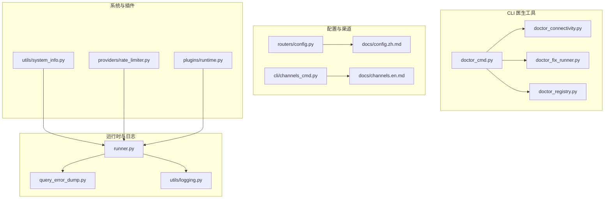
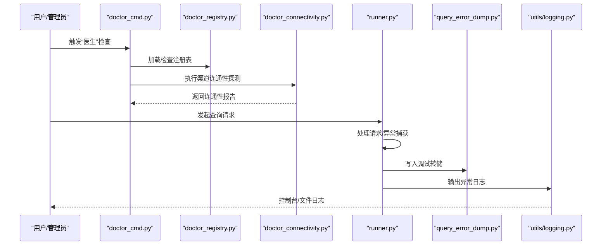
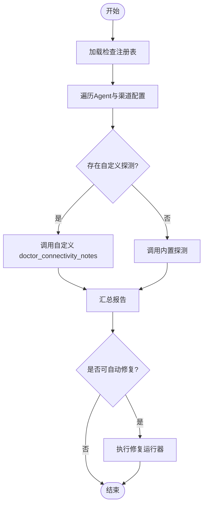
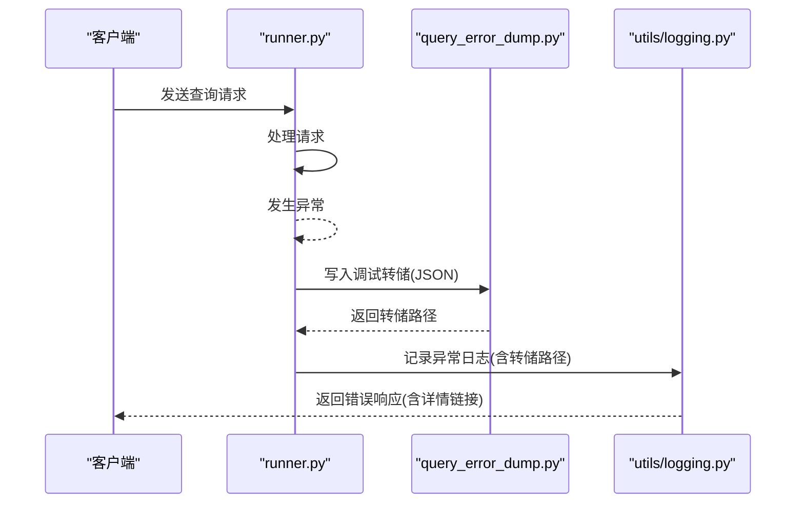
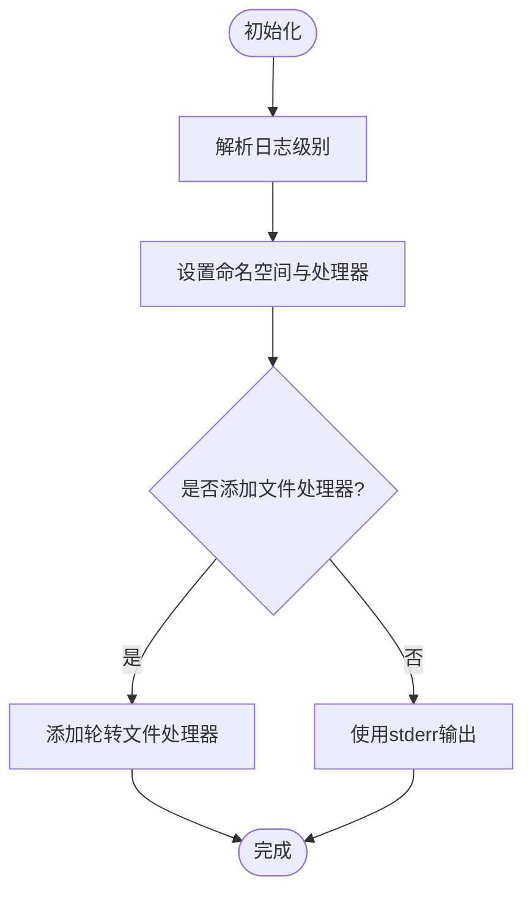
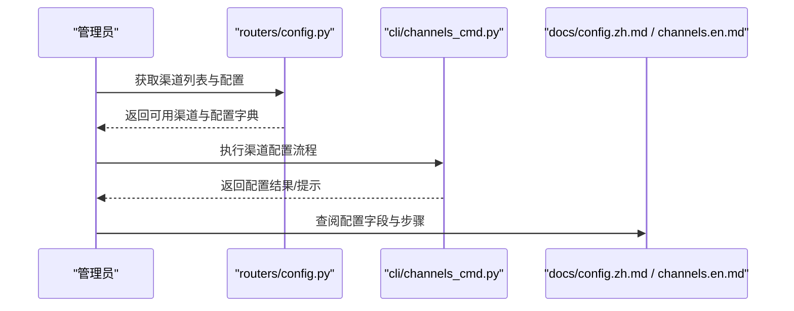
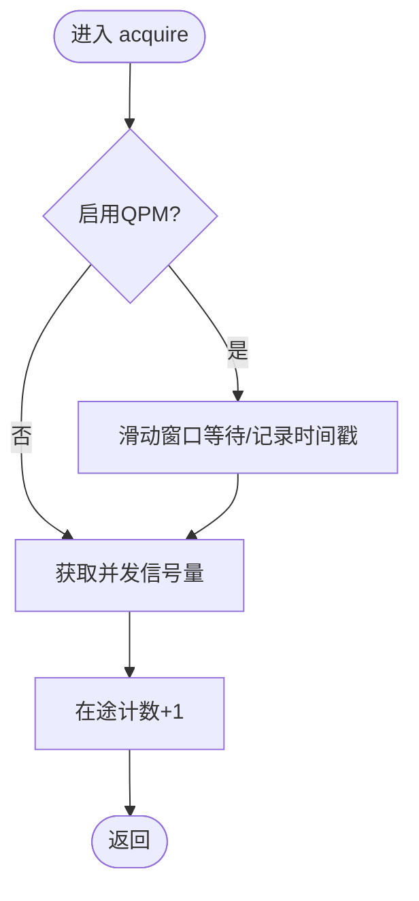
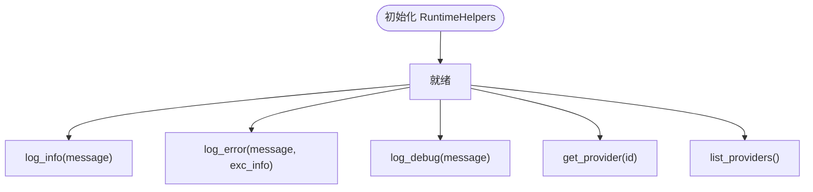
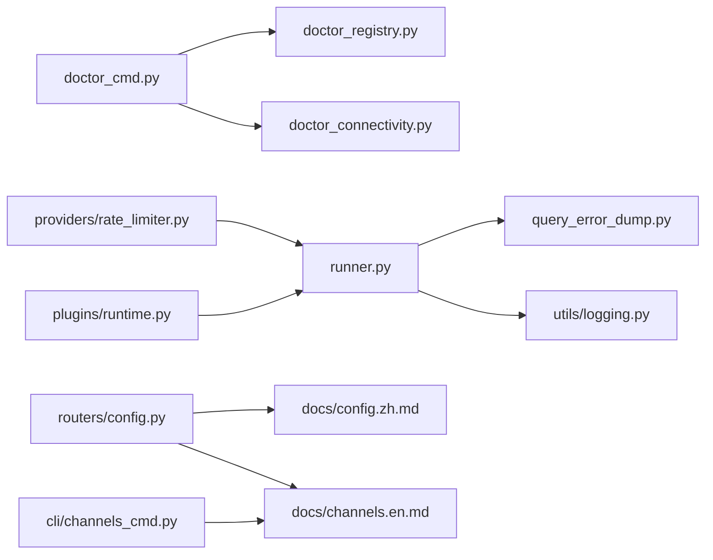

# 故障排除

<cite>
**本文引用的文件**
- [src/qwenpaw/cli/doctor_cmd.py](file://src/qwenpaw/cli/doctor_cmd.py)
- [src/qwenpaw/cli/doctor_connectivity.py](file://src/qwenpaw/cli/doctor_connectivity.py)
- [src/qwenpaw/cli/doctor_fix_runner.py](file://src/qwenpaw/cli/doctor_fix_runner.py)
- [src/qwenpaw/cli/doctor_registry.py](file://src/qwenpaw/cli/doctor_registry.py)
- [src/qwenpaw/utils/logging.py](file://src/qwenpaw/utils/logging.py)
- [src/qwenpaw/app/runner/query_error_dump.py](file://src/qwenpaw/app/runner/query_error_dump.py)
- [src/qwenpaw/app/runner/runner.py](file://src/qwenpaw/app/runner/runner.py)
- [src/qwenpaw/app/routers/config.py](file://src/qwenpaw/app/routers/config.py)
- [src/qwenpaw/cli/channels_cmd.py](file://src/qwenpaw/cli/channels_cmd.py)
- [website/public/docs/config.zh.md](file://website/public/docs/config.zh.md)
- [website/public/docs/channels.en.md](file://website/public/docs/channels.en.md)
- [src/qwenpaw/providers/rate_limiter.py](file://src/qwenpaw/providers/rate_limiter.py)
- [src/qwenpaw/plugins/runtime.py](file://src/qwenpaw/plugins/runtime.py)
- [src/qwenpaw/utils/system_info.py](file://src/qwenpaw/utils/system_info.py)
- [tests/unit/utils/test_logging.py](file://tests/unit/utils/test_logging.py)
</cite>

## 目录
1. [简介](#简介)
2. [项目结构](#项目结构)
3. [核心组件](#核心组件)
4. [架构总览](#架构总览)
5. [详细组件分析](#详细组件分析)
6. [依赖关系分析](#依赖关系分析)
7. [性能考虑](#性能考虑)
8. [故障排除指南](#故障排除指南)
9. [结论](#结论)
10. [附录](#附录)

## 简介
本指南面向用户与管理员，提供QwenPaw在安装、配置、连接与性能方面的系统化故障排除方法。内容涵盖：
- 常见问题与解决方案（安装、配置、连接失败、性能问题）
- 日志分析方法（日志级别、关键信息识别、定位策略）
- 性能诊断工具与方法（系统监控、资源使用、瓶颈识别）
- 网络连接、模型访问与渠道集成的排查步骤
- 社区支持、问题报告流程与紧急处理方案

## 项目结构
QwenPaw由Python后端与前端控制台组成，CLI提供“医生”检查工具用于自动化诊断；运行器负责查询处理并生成调试转储；日志模块统一输出到控制台与文件；渠道配置通过路由与CLI进行管理。

图表来源
- [src/qwenpaw/cli/doctor_cmd.py](file://src/qwenpaw/cli/doctor_cmd.py)
- [src/qwenpaw/cli/doctor_connectivity.py](file://src/qwenpaw/cli/doctor_connectivity.py)
- [src/qwenpaw/cli/doctor_fix_runner.py](file://src/qwenpaw/cli/doctor_fix_runner.py)
- [src/qwenpaw/cli/doctor_registry.py](file://src/qwenpaw/cli/doctor_registry.py)
- [src/qwenpaw/app/runner/runner.py](file://src/qwenpaw/app/runner/runner.py)
- [src/qwenpaw/app/runner/query_error_dump.py](file://src/qwenpaw/app/runner/query_error_dump.py)
- [src/qwenpaw/utils/logging.py](file://src/qwenpaw/utils/logging.py)
- [src/qwenpaw/app/routers/config.py](file://src/qwenpaw/app/routers/config.py)
- [src/qwenpaw/cli/channels_cmd.py](file://src/qwenpaw/cli/channels_cmd.py)
- [website/public/docs/config.zh.md](file://website/public/docs/config.zh.md)
- [website/public/docs/channels.en.md](file://website/public/docs/channels.en.md)
- [src/qwenpaw/utils/system_info.py](file://src/qwenpaw/utils/system_info.py)
- [src/qwenpaw/providers/rate_limiter.py](file://src/qwenpaw/providers/rate_limiter.py)
- [src/qwenpaw/plugins/runtime.py](file://src/qwenpaw/plugins/runtime.py)

章节来源
- [src/qwenpaw/cli/doctor_cmd.py](file://src/qwenpaw/cli/doctor_cmd.py)
- [src/qwenpaw/app/routers/config.py](file://src/qwenpaw/app/routers/config.py)
- [src/qwenpaw/cli/channels_cmd.py](file://src/qwenpaw/cli/channels_cmd.py)

## 核心组件
- CLI“医生”工具：提供安装/连接/修复检查与自动修复能力，覆盖渠道连通性、配置有效性与常见问题建议。
- 运行器与错误转储：捕获查询处理异常，生成调试JSON文件，便于定位上下文与内存状态。
- 日志系统：统一输出到stderr与轮转文件，支持级别映射与ANSI颜色输出。
- 渠道配置：通过路由与CLI提供渠道列表、可用性与配置项管理。
- 性能与限流：提供并发与QPM滑动窗口限流，辅助识别过载与排队瓶颈。
- 插件运行时：提供插件侧日志与Provider访问能力，便于扩展场景下的排障。

章节来源
- [src/qwenpaw/cli/doctor_cmd.py](file://src/qwenpaw/cli/doctor_cmd.py)
- [src/qwenpaw/app/runner/runner.py](file://src/qwenpaw/app/runner/runner.py)
- [src/qwenpaw/app/runner/query_error_dump.py](file://src/qwenpaw/app/runner/query_error_dump.py)
- [src/qwenpaw/utils/logging.py](file://src/qwenpaw/utils/logging.py)
- [src/qwenpaw/app/routers/config.py](file://src/qwenpaw/app/routers/config.py)
- [src/qwenpaw/providers/rate_limiter.py](file://src/qwenpaw/providers/rate_limiter.py)
- [src/qwenpaw/plugins/runtime.py](file://src/qwenpaw/plugins/runtime.py)

## 架构总览
下图展示“医生”工具、运行器与日志系统的交互关系，以及渠道配置的入口。

图表来源
- [src/qwenpaw/cli/doctor_cmd.py](file://src/qwenpaw/cli/doctor_cmd.py)
- [src/qwenpaw/cli/doctor_registry.py](file://src/qwenpaw/cli/doctor_registry.py)
- [src/qwenpaw/cli/doctor_connectivity.py](file://src/qwenpaw/cli/doctor_connectivity.py)
- [src/qwenpaw/app/runner/runner.py](file://src/qwenpaw/app/runner/runner.py)
- [src/qwenpaw/app/runner/query_error_dump.py](file://src/qwenpaw/app/runner/query_error_dump.py)
- [src/qwenpaw/utils/logging.py](file://src/qwenpaw/utils/logging.py)

## 详细组件分析

### 组件A：CLI“医生”工具
- 功能要点
  - 注册与执行：从注册表加载检查项，按需执行网络连通性、配置有效性与修复建议。
  - 渠道探测：对已启用渠道执行内置或自定义连通性检查，汇总为非致命提示。
  - 自动修复：提供修复运行器，按检查结果尝试自动修复。
- 关键流程
  - 初始化与注册加载
  - 遍历agent与渠道配置，调用内置/自定义探测函数
  - 聚合报告并输出

图表来源
- [src/qwenpaw/cli/doctor_cmd.py](file://src/qwenpaw/cli/doctor_cmd.py)
- [src/qwenpaw/cli/doctor_connectivity.py](file://src/qwenpaw/cli/doctor_connectivity.py)
- [src/qwenpaw/cli/doctor_fix_runner.py](file://src/qwenpaw/cli/doctor_fix_runner.py)
- [src/qwenpaw/cli/doctor_registry.py](file://src/qwenpaw/cli/doctor_registry.py)

章节来源
- [src/qwenpaw/cli/doctor_cmd.py](file://src/qwenpaw/cli/doctor_cmd.py)
- [src/qwenpaw/cli/doctor_connectivity.py](file://src/qwenpaw/cli/doctor_connectivity.py)
- [src/qwenpaw/cli/doctor_fix_runner.py](file://src/qwenpaw/cli/doctor_fix_runner.py)
- [src/qwenpaw/cli/doctor_registry.py](file://src/qwenpaw/cli/doctor_registry.py)

### 组件B：运行器与错误转储
- 功能要点
  - 异常转换与记录：将底层异常转换为统一格式，并写入调试转储文件。
  - 调试转储：序列化请求、异常与局部状态，保存为临时JSON文件，便于离线分析。
  - 日志增强：在异常消息中附加转储路径，便于快速定位。
- 关键流程

图表来源
- [src/qwenpaw/app/runner/runner.py](file://src/qwenpaw/app/runner/runner.py)
- [src/qwenpaw/app/runner/query_error_dump.py](file://src/qwenpaw/app/runner/query_error_dump.py)
- [src/qwenpaw/utils/logging.py](file://src/qwenpaw/utils/logging.py)

章节来源
- [src/qwenpaw/app/runner/runner.py](file://src/qwenpaw/app/runner/runner.py)
- [src/qwenpaw/app/runner/query_error_dump.py](file://src/qwenpaw/app/runner/query_error_dump.py)
- [src/qwenpaw/utils/logging.py](file://src/qwenpaw/utils/logging.py)

### 组件C：日志系统
- 功能要点
  - 级别映射：支持字符串到数值级别的映射，便于命令行与配置灵活设置。
  - 文件轮转：在工作目录生成日志文件，限制大小并保留多份备份。
  - ANSI颜色：在Windows 10+启用虚拟终端处理，保证彩色输出一致性。
  - 过滤与命名空间：仅输出项目命名空间的日志，避免第三方库噪声。
- 关键流程

图表来源
- [src/qwenpaw/utils/logging.py](file://src/qwenpaw/utils/logging.py)
- [tests/unit/utils/test_logging.py](file://tests/unit/utils/test_logging.py)

章节来源
- [src/qwenpaw/utils/logging.py](file://src/qwenpaw/utils/logging.py)
- [tests/unit/utils/test_logging.py](file://tests/unit/utils/test_logging.py)

### 组件D：渠道配置与管理
- 功能要点
  - 渠道列表：通过路由返回当前可用渠道及配置。
  - CLI配置器：提供内置渠道配置器集合，结合插件扩展。
  - 文档参考：中文配置文档与英文渠道概览，覆盖字段与步骤。
- 关键流程

图表来源
- [src/qwenpaw/app/routers/config.py](file://src/qwenpaw/app/routers/config.py)
- [src/qwenpaw/cli/channels_cmd.py](file://src/qwenpaw/cli/channels_cmd.py)
- [website/public/docs/config.zh.md](file://website/public/docs/config.zh.md)
- [website/public/docs/channels.en.md](file://website/public/docs/channels.en.md)

章节来源
- [src/qwenpaw/app/routers/config.py](file://src/qwenpaw/app/routers/config.py)
- [src/qwenpaw/cli/channels_cmd.py](file://src/qwenpaw/cli/channels_cmd.py)
- [website/public/docs/config.zh.md](file://website/public/docs/config.zh.md)
- [website/public/docs/channels.en.md](file://website/public/docs/channels.en.md)

### 组件E：性能与限流
- 功能要点
  - 并发信号量：限制同时并发数，避免过载。
  - QPM滑动窗口：基于60秒窗口统计请求次数，超限则等待。
  - 统计指标：跟踪获取许可、暂停、等待与限流次数，便于分析瓶颈。
- 关键流程

图表来源
- [src/qwenpaw/providers/rate_limiter.py](file://src/qwenpaw/providers/rate_limiter.py)

章节来源
- [src/qwenpaw/providers/rate_limiter.py](file://src/qwenpaw/providers/rate_limiter.py)

### 组件F：插件运行时与日志
- 功能要点
  - 提供插件侧日志接口（info/error/debug），统一接入应用日志系统。
  - 提供Provider访问能力，便于插件在运行时获取Provider实例或列表。
- 关键流程

图表来源
- [src/qwenpaw/plugins/runtime.py](file://src/qwenpaw/plugins/runtime.py)

章节来源
- [src/qwenpaw/plugins/runtime.py](file://src/qwenpaw/plugins/runtime.py)

## 依赖关系分析
- “医生”工具依赖渠道注册表与配置，执行连通性探测；探测结果影响修复流程。
- 运行器依赖日志系统输出异常，并在异常时生成调试转储；调试转储依赖请求对象与局部状态序列化。
- 渠道配置通过路由与CLI共同维护，文档提供字段与步骤参考。
- 限流器作为Provider层组件被运行器间接使用，影响请求吞吐与延迟。
- 插件运行时为扩展场景提供日志与Provider访问，降低排障复杂度。

图表来源
- [src/qwenpaw/cli/doctor_cmd.py](file://src/qwenpaw/cli/doctor_cmd.py)
- [src/qwenpaw/cli/doctor_registry.py](file://src/qwenpaw/cli/doctor_registry.py)
- [src/qwenpaw/cli/doctor_connectivity.py](file://src/qwenpaw/cli/doctor_connectivity.py)
- [src/qwenpaw/app/runner/runner.py](file://src/qwenpaw/app/runner/runner.py)
- [src/qwenpaw/app/runner/query_error_dump.py](file://src/qwenpaw/app/runner/query_error_dump.py)
- [src/qwenpaw/utils/logging.py](file://src/qwenpaw/utils/logging.py)
- [src/qwenpaw/app/routers/config.py](file://src/qwenpaw/app/routers/config.py)
- [src/qwenpaw/cli/channels_cmd.py](file://src/qwenpaw/cli/channels_cmd.py)
- [website/public/docs/config.zh.md](file://website/public/docs/config.zh.md)
- [website/public/docs/channels.en.md](file://website/public/docs/channels.en.md)
- [src/qwenpaw/providers/rate_limiter.py](file://src/qwenpaw/providers/rate_limiter.py)
- [src/qwenpaw/plugins/runtime.py](file://src/qwenpaw/plugins/runtime.py)

章节来源
- [src/qwenpaw/cli/doctor_cmd.py](file://src/qwenpaw/cli/doctor_cmd.py)
- [src/qwenpaw/app/runner/runner.py](file://src/qwenpaw/app/runner/runner.py)
- [src/qwenpaw/app/routers/config.py](file://src/qwenpaw/app/routers/config.py)
- [src/qwenpaw/providers/rate_limiter.py](file://src/qwenpaw/providers/rate_limiter.py)
- [src/qwenpaw/plugins/runtime.py](file://src/qwenpaw/plugins/runtime.py)

## 性能考虑
- 并发与QPM限流
  - 使用信号量限制同时并发，避免资源争用导致的抖动。
  - 使用滑动窗口统计QPM，超限时等待，防止上游限流触发级联失败。
- 日志开销
  - 控制台输出与文件轮转均受级别过滤影响，建议在高负载时提升级别以减少IO。
- 资源使用
  - 结合系统信息采集与运行器日志，观察CPU、内存与磁盘IO峰值时段，定位热点。
- 瓶颈识别
  - 通过限流统计与日志时间戳对比，判断是上游限流还是本地处理瓶颈。
  - 对渠道消息队列与Provider调用链进行分段观测，缩小范围。

章节来源
- [src/qwenpaw/providers/rate_limiter.py](file://src/qwenpaw/providers/rate_limiter.py)
- [src/qwenpaw/utils/system_info.py](file://src/qwenpaw/utils/system_info.py)
- [src/qwenpaw/utils/logging.py](file://src/qwenpaw/utils/logging.py)

## 故障排除指南

### 一、安装与环境问题
- 症状
  - 启动失败、依赖缺失、权限不足。
- 排查步骤
  - 使用“医生”工具执行安装与环境检查，查看非致命提示与修复建议。
  - 检查日志文件与控制台输出，确认错误堆栈与依赖版本。
  - 参考文档中的安装与环境准备步骤，确保系统满足要求。
- 建议
  - 在Windows 10+启用ANSI支持，确保彩色日志正常显示。
  - 如出现权限问题，检查工作目录与日志文件写入权限。

章节来源
- [src/qwenpaw/cli/doctor_cmd.py](file://src/qwenpaw/cli/doctor_cmd.py)
- [src/qwenpaw/utils/logging.py](file://src/qwenpaw/utils/logging.py)

### 二、配置错误
- 症状
  - 渠道无法启用、字段缺失或类型不匹配、热加载未生效。
- 排查步骤
  - 通过路由列出可用渠道与当前配置，核对字段是否存在且类型正确。
  - 使用CLI配置器重新配置目标渠道，确保必填字段齐全。
  - 查阅中文配置文档，确认字段含义与填写规范。
- 建议
  - 修改agent.json后系统会自动热加载，无需重启。
  - 若仍无效，检查日志中关于配置解析的警告或错误。

章节来源
- [src/qwenpaw/app/routers/config.py](file://src/qwenpaw/app/routers/config.py)
- [src/qwenpaw/cli/channels_cmd.py](file://src/qwenpaw/cli/channels_cmd.py)
- [website/public/docs/config.zh.md](file://website/public/docs/config.zh.md)

### 三、连接失败
- 症状
  - 渠道无法连通、超时、认证失败。
- 排查步骤
  - 使用“医生”工具执行深度连通性检查，查看针对各渠道的探测结果。
  - 对于自定义渠道，检查其doctor_connectivity_notes实现是否抛出异常。
  - 根据报告中的提示调整代理、证书或凭据。
- 建议
  - 对于HTTP类渠道，优先检查URL可达性与状态码。
  - 对于TCP类渠道，检查主机与端口连通性。

章节来源
- [src/qwenpaw/cli/doctor_connectivity.py](file://src/qwenpaw/cli/doctor_connectivity.py)
- [src/qwenpaw/cli/doctor_cmd.py](file://src/qwenpaw/cli/doctor_cmd.py)

### 四、性能问题
- 症状
  - 响应缓慢、频繁超时、CPU/内存占用高。
- 排查步骤
  - 启用更高日志级别，观察请求处理耗时与异常分布。
  - 使用限流器统计指标，判断是否达到并发或QPM上限。
  - 采集系统信息，对比高峰期与低谷期资源使用曲线。
- 建议
  - 调整并发与QPM参数，缓解上游限流压力。
  - 对热点渠道或Provider进行隔离与扩容。

章节来源
- [src/qwenpaw/providers/rate_limiter.py](file://src/qwenpaw/providers/rate_limiter.py)
- [src/qwenpaw/utils/system_info.py](file://src/qwenpaw/utils/system_info.py)
- [src/qwenpaw/utils/logging.py](file://src/qwenpaw/utils/logging.py)

### 五、模型访问与渠道集成问题
- 症状
  - 模型调用失败、渠道消息发送失败、回调异常。
- 排查步骤
  - 通过运行器异常转储定位请求上下文与内存状态。
  - 检查Provider配置与凭据，确认限流与配额状态。
  - 核对渠道集成配置，确保机器人令牌、群组ID等有效。
- 建议
  - 在调试转储中查找最近一次请求的序列化数据，复现问题场景。
  - 对渠道与Provider分别进行独立测试，缩小问题范围。

章节来源
- [src/qwenpaw/app/runner/runner.py](file://src/qwenpaw/app/runner/runner.py)
- [src/qwenpaw/app/runner/query_error_dump.py](file://src/qwenpaw/app/runner/query_error_dump.py)
- [website/public/docs/channels.en.md](file://website/public/docs/channels.en.md)

### 六、日志分析方法与技巧
- 日志级别设置
  - 支持字符串到数值映射，便于灵活设置。
  - 控制台与文件处理器分别设置不同级别，避免噪声。
- 关键信息识别
  - 关注异常堆栈、转储路径、限流统计与系统信息。
  - 使用过滤器屏蔽无关访问日志，聚焦关键路径。
- 问题定位策略
  - 以时间轴对齐日志与系统事件，定位异常发生点。
  - 将调试转储与日志关联，还原请求上下文。

章节来源
- [src/qwenpaw/utils/logging.py](file://src/qwenpaw/utils/logging.py)
- [tests/unit/utils/test_logging.py](file://tests/unit/utils/test_logging.py)

### 七、社区支持与问题报告
- 社区渠道
  - 参考文档中的社区入口与贡献指南，获取帮助与反馈。
- 问题报告
  - 附带日志文件、调试转储路径、系统信息与最小复现步骤。
- 紧急处理
  - 降级日志级别、关闭高开销功能、隔离问题渠道或Provider。

章节来源
- [website/public/docs/config.zh.md](file://website/public/docs/config.zh.md)

## 结论
通过“医生”工具、运行器转储、统一日志与渠道配置管理，QwenPaw提供了从安装到运行全生命周期的自助排障能力。建议在日常运维中定期使用“医生”检查、关注日志与系统指标，并结合调试转储快速定位问题根因。

## 附录
- 快速检查清单
  - 使用“医生”工具执行安装与连通性检查
  - 查看日志文件与控制台输出
  - 核对agent.json中的渠道与Provider配置
  - 采集系统信息并观察高峰期资源使用
  - 生成并保存调试转储以便后续分析