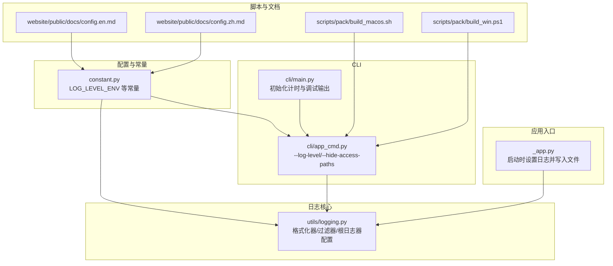
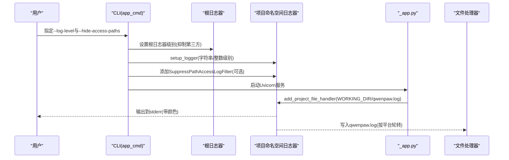
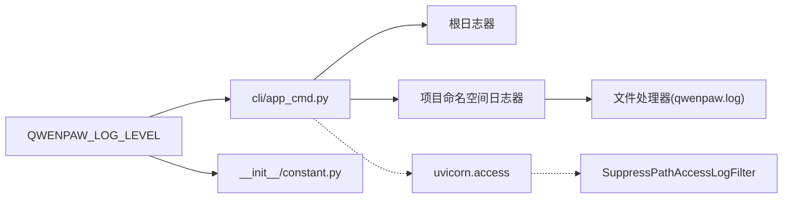

# 日志分析方法

<cite>
**本文引用的文件**
- [src/qwenpaw/utils/logging.py](file://src/qwenpaw/utils/logging.py)
- [src/qwenpaw/constant.py](file://src/qwenpaw/constant.py)
- [src/qwenpaw/cli/app_cmd.py](file://src/qwenpaw/cli/app_cmd.py)
- [src/qwenpaw/cli/main.py](file://src/qwenpaw/cli/main.py)
- [src/qwenpaw/app/_app.py](file://src/qwenpaw/app/_app.py)
- [tests/unit/utils/test_logging.py](file://tests/unit/utils/test_logging.py)
- [scripts/pack/build_macos.sh](file://scripts/pack/build_macos.sh)
- [scripts/pack/build_win.ps1](file://scripts/pack/build_win.ps1)
- [website/public/docs/config.en.md](file://website/public/docs/config.en.md)
- [website/public/docs/config.zh.md](file://website/public/docs/config.zh.md)
</cite>

## 目录
1. [简介](#简介)
2. [项目结构](#项目结构)
3. [核心组件](#核心组件)
4. [架构总览](#架构总览)
5. [详细组件分析](#详细组件分析)
6. [依赖关系分析](#依赖关系分析)
7. [性能考量](#性能考量)
8. [故障排查指南](#故障排查指南)
9. [结论](#结论)
10. [附录](#附录)

## 简介
本指南面向QwenPaw用户与运维人员，系统讲解如何启用与配置日志，覆盖DEBUG、INFO、WARNING、ERROR、CRITICAL五个标准级别；明确应用日志、访问日志与错误日志的来源与位置；提供日志解读技巧以识别错误模式与性能瓶颈；给出常见错误信息的含义与对应解决方法；并说明如何通过时间线与关联性分析定位问题，最后总结日志轮转与清理的最佳实践。

## 项目结构
QwenPaw的日志体系由以下部分组成：
- 日志核心：统一的格式化器、过滤器与根日志器配置
- 环境变量：通过环境变量控制日志级别
- CLI入口：提供--log-level参数与访问日志过滤
- 应用入口：在启动时设置日志级别，并可附加文件处理器
- 测试与文档：验证日志行为与提供配置参考

图表来源
- [src/qwenpaw/utils/logging.py:124-202](file://src/qwenpaw/utils/logging.py#L124-L202)
- [src/qwenpaw/constant.py:159-160](file://src/qwenpaw/constant.py#L159-L160)
- [src/qwenpaw/cli/app_cmd.py:55-111](file://src/qwenpaw/cli/app_cmd.py#L55-L111)
- [src/qwenpaw/cli/main.py:31-56](file://src/qwenpaw/cli/main.py#L31-L56)
- [src/qwenpaw/app/_app.py:223-223](file://src/qwenpaw/app/_app.py#L223-L223)
- [scripts/pack/build_macos.sh:86-87](file://scripts/pack/build_macos.sh#L86-L87)
- [scripts/pack/build_win.ps1:167-168](file://scripts/pack/build_win.ps1#L167-L168)
- [website/public/docs/config.en.md:103-103](file://website/public/docs/config.en.md#L103-L103)
- [website/public/docs/config.zh.md:72-72](file://website/public/docs/config.zh.md#L72-L72)

章节来源
- [src/qwenpaw/utils/logging.py:124-202](file://src/qwenpaw/utils/logging.py#L124-L202)
- [src/qwenpaw/constant.py:159-160](file://src/qwenpaw/constant.py#L159-L160)
- [src/qwenpaw/cli/app_cmd.py:55-111](file://src/qwenpaw/cli/app_cmd.py#L55-L111)
- [src/qwenpaw/cli/main.py:31-56](file://src/qwenpaw/cli/main.py#L31-L56)
- [src/qwenpaw/app/_app.py:223-223](file://src/qwenpaw/app/_app.py#L223-L223)
- [scripts/pack/build_macos.sh:86-87](file://scripts/pack/build_macos.sh#L86-L87)
- [scripts/pack/build_win.ps1:167-168](file://scripts/pack/build_win.ps1#L167-L168)
- [website/public/docs/config.en.md:103-103](file://website/public/docs/config.en.md#L103-L103)
- [website/public/docs/config.zh.md:72-72](file://website/public/docs/config.zh.md#L72-L72)

## 核心组件
- 日志级别映射与命名支持：支持字符串形式的“debug”、“info”、“warning”、“error”、“critical”，并提供默认级别
- 控制台彩色输出：根据终端能力自动启用ANSI颜色，便于快速识别级别
- 访问日志过滤：可按路径子串屏蔽uvicorn访问日志中的噪声条目
- 文件输出：按平台差异选择FileHandler或RotatingFileHandler，避免锁冲突并实现轮转
- 根日志器抑制第三方噪音：降低依赖库对控制台输出的干扰

章节来源
- [src/qwenpaw/utils/logging.py:17-23](file://src/qwenpaw/utils/logging.py#L17-L23)
- [src/qwenpaw/utils/logging.py:54-84](file://src/qwenpaw/utils/logging.py#L54-L84)
- [src/qwenpaw/utils/logging.py:102-122](file://src/qwenpaw/utils/logging.py#L102-L122)
- [src/qwenpaw/utils/logging.py:161-202](file://src/qwenpaw/utils/logging.py#L161-L202)

## 架构总览
下图展示从CLI到应用入口再到日志系统的调用链路，以及访问日志过滤与文件落盘的关键节点。

图表来源
- [src/qwenpaw/cli/app_cmd.py:83-102](file://src/qwenpaw/cli/app_cmd.py#L83-L102)
- [src/qwenpaw/utils/logging.py:124-158](file://src/qwenpaw/utils/logging.py#L124-L158)
- [src/qwenpaw/utils/logging.py:161-202](file://src/qwenpaw/utils/logging.py#L161-L202)
- [src/qwenpaw/app/_app.py:223-223](file://src/qwenpaw/app/_app.py#L223-L223)

章节来源
- [src/qwenpaw/cli/app_cmd.py:55-111](file://src/qwenpaw/cli/app_cmd.py#L55-L111)
- [src/qwenpaw/utils/logging.py:124-202](file://src/qwenpaw/utils/logging.py#L124-L202)
- [src/qwenpaw/app/_app.py:223-223](file://src/qwenpaw/app/_app.py#L223-L223)

## 详细组件分析

### 日志级别与配置
- 支持的级别名称：critical、error、warning、info、debug
- 默认级别：未指定时为info
- 字符串级别会被映射为标准logging级别；非法字符串回退为info
- 根日志器策略：对文件处理器提升到INFO，其他处理器提升到WARNING，减少第三方噪音

章节来源
- [src/qwenpaw/utils/logging.py:17-23](file://src/qwenpaw/utils/logging.py#L17-L23)
- [src/qwenpaw/utils/logging.py:129-131](file://src/qwenpaw/utils/logging.py#L129-L131)
- [src/qwenpaw/utils/logging.py:134-143](file://src/qwenpaw/utils/logging.py#L134-L143)

### 控制台输出与颜色
- 彩色输出：根据stderr是否为TTY自动启用ANSI颜色，便于区分级别
- 路径显示：优先相对当前工作目录的路径，提升可读性
- 时间戳与消息：统一格式，便于排序与检索

章节来源
- [src/qwenpaw/utils/logging.py:54-84](file://src/qwenpaw/utils/logging.py#L54-L84)
- [src/qwenpaw/utils/logging.py:87-99](file://src/qwenpaw/utils/logging.py#L87-L99)

### 访问日志过滤
- 功能：按路径子串屏蔽uvicorn access日志，减少噪声
- 使用：CLI提供--hide-access-paths参数，传入后动态添加过滤器
- 行为：空列表允许全部；匹配任一子串即屏蔽该条记录

章节来源
- [src/qwenpaw/utils/logging.py:102-122](file://src/qwenpaw/utils/logging.py#L102-L122)
- [src/qwenpaw/cli/app_cmd.py:98-102](file://src/qwenpaw/cli/app_cmd.py#L98-L102)

### 文件输出与轮转
- 平台差异：
  - Windows/Linux：使用FileHandler，避免文件锁问题
  - macOS：使用RotatingFileHandler，限制单文件大小并保留备份数量
- 轮转参数：单文件最大约5MiB，保留3个备份
- 平台检测：基于platform.system判断
- 去重策略：同路径重复添加时忽略，避免重复行与句柄泄漏

章节来源
- [src/qwenpaw/utils/logging.py:13-14](file://src/qwenpaw/utils/logging.py#L13-L14)
- [src/qwenpaw/utils/logging.py:182-195](file://src/qwenpaw/utils/logging.py#L182-L195)
- [src/qwenpaw/utils/logging.py:174-180](file://src/qwenpaw/utils/logging.py#L174-L180)

### 启动流程与日志落盘
- CLI层：
  - 解析--log-level并写入环境变量QWENPAW_LOG_LEVEL
  - 可选添加访问日志过滤器
  - 启动Uvicorn服务
- 应用层：
  - 在启动阶段调用add_project_file_handler，将日志写入WORKING_DIR/qwenpaw.log
- 初始化计时：
  - 当log-level为debug或trace时，CLI会输出初始化耗时统计，便于性能分析

章节来源
- [src/qwenpaw/cli/app_cmd.py:83-111](file://src/qwenpaw/cli/app_cmd.py#L83-L111)
- [src/qwenpaw/app/_app.py:223-223](file://src/qwenpaw/app/_app.py#L223-L223)
- [src/qwenpaw/cli/main.py:52-56](file://src/qwenpaw/cli/main.py#L52-L56)

### 关键日志文件位置与格式
- 应用日志文件
  - 名称：qwenpaw.log
  - 路径：WORKING_DIR/qwenpaw.log
  - 写入时机：应用启动时附加文件处理器
  - 格式：包含时间戳、级别、源文件与行号、消息
- 访问日志
  - 来源：uvicorn access日志
  - 过滤：可通过--hide-access-paths屏蔽特定路径
  - 颜色：仅控制台输出，不写入文件
- 错误日志
  - 来源：应用日志与访问日志中的ERROR及以上级别
  - 建议：结合应用日志与访问日志定位错误上下文

章节来源
- [src/qwenpaw/utils/logging.py:28-30](file://src/qwenpaw/utils/logging.py#L28-L30)
- [src/qwenpaw/utils/logging.py:161-202](file://src/qwenpaw/utils/logging.py#L161-L202)
- [src/qwenpaw/cli/app_cmd.py:98-102](file://src/qwenpaw/cli/app_cmd.py#L98-L102)

### 日志解读技巧
- 快速定位：利用彩色级别与相对路径快速识别模块与文件
- 时间线分析：结合初始化计时与业务操作日志，梳理执行顺序与时延
- 关联性检查：将ERROR/CRITICAL与最近的INFO/DEBUG串联，还原上下文
- 性能瓶颈：关注长时间运行的任务与频繁重试，配合访问日志中的慢请求路径

章节来源
- [src/qwenpaw/utils/logging.py:54-84](file://src/qwenpaw/utils/logging.py#L54-L84)
- [src/qwenpaw/cli/main.py:52-56](file://src/qwenpaw/cli/main.py#L52-L56)

### 常见错误与解决思路
- 级别无效
  - 现象：字符串级别被忽略，回落为info
  - 处理：使用受支持的级别名称之一
- 访问日志噪声过多
  - 现象：健康检查或推送接口导致日志刷屏
  - 处理：使用--hide-access-paths屏蔽相关路径
- 文件写入失败（macOS）
  - 现象：日志无法写入或轮转异常
  - 处理：确认目标目录权限与磁盘空间；必要时切换到Windows/Linux路径逻辑
- 性能抖动
  - 现象：响应时间波动大
  - 处理：结合应用日志中的任务耗时与访问日志中的慢请求路径，定位热点

章节来源
- [src/qwenpaw/utils/logging.py:129-131](file://src/qwenpaw/utils/logging.py#L129-L131)
- [src/qwenpaw/cli/app_cmd.py:98-102](file://src/qwenpaw/cli/app_cmd.py#L98-L102)
- [src/qwenpaw/utils/logging.py:182-195](file://src/qwenpaw/utils/logging.py#L182-L195)

## 依赖关系分析
- 环境变量驱动：QWENPAW_LOG_LEVEL决定日志级别
- CLI与应用入口协同：CLI负责解析参数与设置根日志器，应用入口负责落盘
- 过滤器注入：CLI在uvicorn.access命名空间注入过滤器
- 测试与文档：单元测试验证日志行为；文档提供配置参考

图表来源
- [src/qwenpaw/constant.py:159-160](file://src/qwenpaw/constant.py#L159-L160)
- [src/qwenpaw/cli/app_cmd.py:83-102](file://src/qwenpaw/cli/app_cmd.py#L83-L102)
- [src/qwenpaw/utils/logging.py:124-158](file://src/qwenpaw/utils/logging.py#L124-L158)
- [src/qwenpaw/utils/logging.py:161-202](file://src/qwenpaw/utils/logging.py#L161-L202)

章节来源
- [src/qwenpaw/constant.py:159-160](file://src/qwenpaw/constant.py#L159-L160)
- [src/qwenpaw/cli/app_cmd.py:83-102](file://src/qwenpaw/cli/app_cmd.py#L83-L102)
- [src/qwenpaw/utils/logging.py:124-202](file://src/qwenpaw/utils/logging.py#L124-L202)

## 性能考量
- 减少噪声：通过--hide-access-paths降低高频访问日志对性能的影响
- 控制台输出：彩色与路径解析带来轻微开销，建议在生产关闭颜色或重定向输出
- 文件写入：Windows/Linux使用FileHandler避免锁争用；macOS使用RotatingFileHandler平衡体积与可读性
- 初始化计时：debug/trace级别下输出初始化耗时，有助于发现启动阶段的性能瓶颈

章节来源
- [src/qwenpaw/cli/app_cmd.py:98-102](file://src/qwenpaw/cli/app_cmd.py#L98-L102)
- [src/qwenpaw/utils/logging.py:182-195](file://src/qwenpaw/utils/logging.py#L182-L195)
- [src/qwenpaw/cli/main.py:52-56](file://src/qwenpaw/cli/main.py#L52-L56)

## 故障排查指南
- 如何启用更高日志级别
  - CLI：使用--log-level设置为debug或trace
  - 环境变量：设置QWENPAW_LOG_LEVEL为受支持的级别名称
- 如何屏蔽访问日志噪声
  - 使用--hide-access-paths传入路径子串，可多次指定
- 如何确认日志文件位置
  - 查看WORKING_DIR/qwenpaw.log；应用启动时会自动创建目录并写入
- 如何进行时间线分析
  - 在debug/trace级别下，CLI会在设置日志级别后输出初始化耗时，结合业务日志串联事件
- 如何进行关联性检查
  - 将ERROR/CRITICAL与最近的INFO/DEBUG串联，核对同一模块的上下文
- 常见问题
  - 级别无效：确保使用受支持的级别名称
  - 文件写入失败：检查目录权限与磁盘空间
  - 访问日志过多：使用--hide-access-paths屏蔽无关路径

章节来源
- [src/qwenpaw/cli/app_cmd.py:30-46](file://src/qwenpaw/cli/app_cmd.py#L30-L46)
- [src/qwenpaw/constant.py:159-160](file://src/qwenpaw/constant.py#L159-L160)
- [src/qwenpaw/utils/logging.py:28-30](file://src/qwenpaw/utils/logging.py#L28-L30)
- [src/qwenpaw/cli/main.py:52-56](file://src/qwenpaw/cli/main.py#L52-L56)

## 结论
QwenPaw的日志体系通过统一的格式化、可控的级别与平台适配的文件落盘，提供了清晰、可读且可维护的日志输出。结合访问日志过滤与初始化计时，用户可以高效地进行问题定位与性能优化。遵循本文的配置与分析方法，可在开发与生产环境中稳定地获取高质量日志。

## 附录

### 日志级别与环境变量对照
- 支持的级别名称：critical、error、warning、info、debug
- 默认级别：info
- 环境变量：QWENPAW_LOG_LEVEL

章节来源
- [src/qwenpaw/utils/logging.py:17-23](file://src/qwenpaw/utils/logging.py#L17-L23)
- [src/qwenpaw/constant.py:159-160](file://src/qwenpaw/constant.py#L159-L160)
- [website/public/docs/config.en.md:103-103](file://website/public/docs/config.en.md#L103-L103)
- [website/public/docs/config.zh.md:72-72](file://website/public/docs/config.zh.md#L72-L72)

### 日志轮转与清理最佳实践
- 轮转策略：macOS使用RotatingFileHandler，单文件约5MiB，保留3个备份
- 清理建议：定期归档旧日志；在容器或受限环境中控制总量，避免磁盘占满
- 平台差异：Windows/Linux使用FileHandler，避免锁冲突；macOS使用RotatingFileHandler

章节来源
- [src/qwenpaw/utils/logging.py:13-14](file://src/qwenpaw/utils/logging.py#L13-L14)
- [src/qwenpaw/utils/logging.py:182-195](file://src/qwenpaw/utils/logging.py#L182-L195)