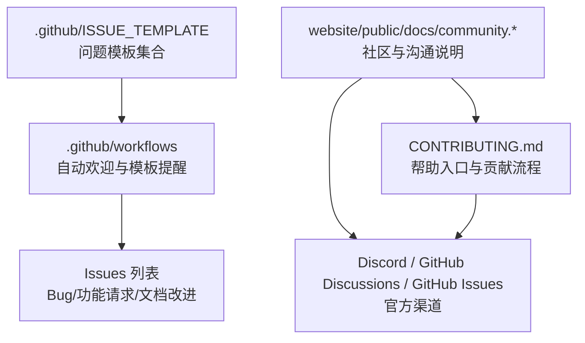
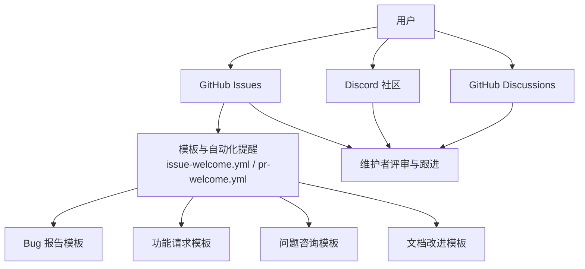
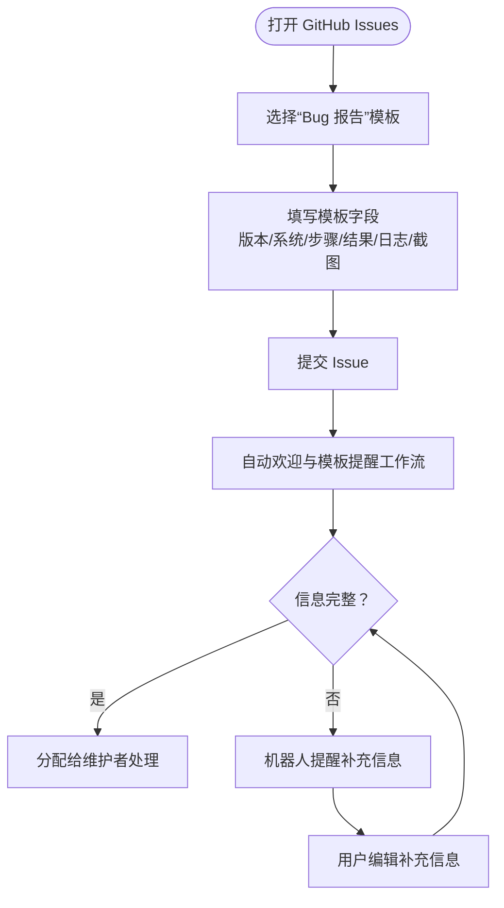
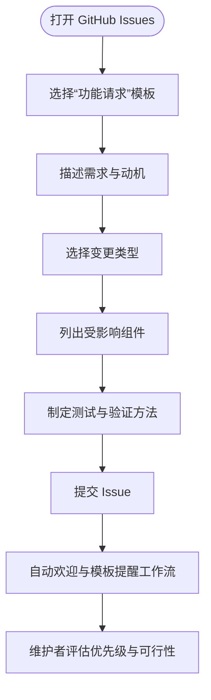
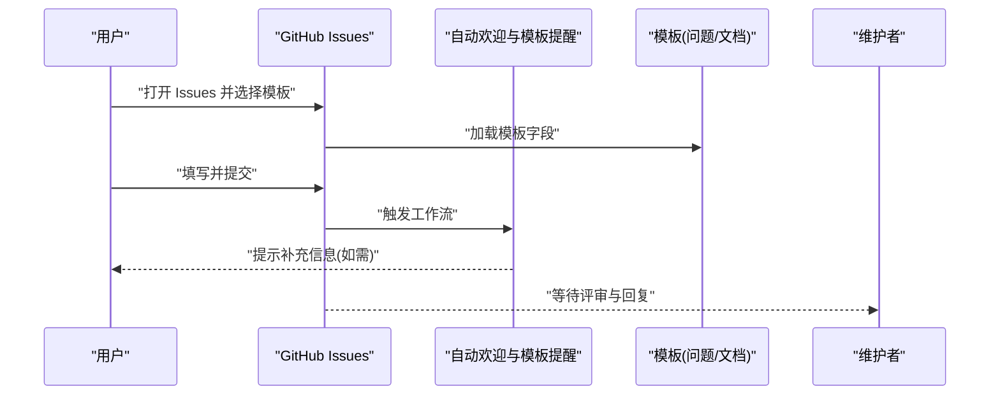
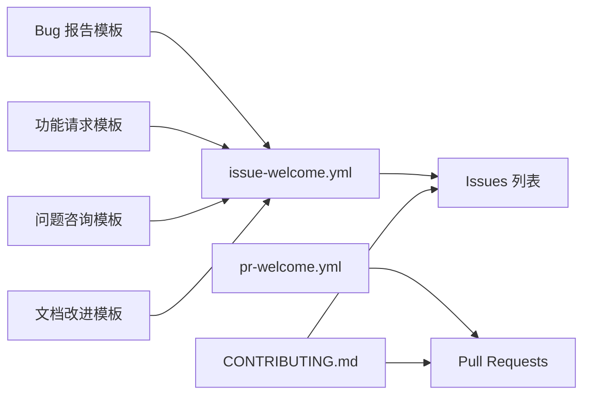

# 社区支持与问题报告

<cite>
**本文引用的文件**
- [.github/ISSUE_TEMPLATE/4-bug_report.md](file://.github/ISSUE_TEMPLATE/4-bug_report.md)
- [.github/ISSUE_TEMPLATE/2-feature_request.md](file://.github/ISSUE_TEMPLATE/2-feature_request.md)
- [.github/ISSUE_TEMPLATE/1-question.md](file://.github/ISSUE_TEMPLATE/1-question.md)
- [.github/ISSUE_TEMPLATE/3-documentation.md](file://.github/ISSUE_TEMPLATE/3-documentation.md)
- [.github/workflows/issue-welcome.yml](file://.github/workflows/issue-welcome.yml)
- [.github/workflows/pr-welcome.yml](file://.github/workflows/pr-welcome.yml)
- [CONTRIBUTING.md](file://CONTRIBUTING.md)
- [website/public/docs/community.en.md](file://website/public/docs/community.en.md)
- [website/public/docs/community.zh.md](file://website/public/docs/community.zh.md)
</cite>

## 目录
1. [简介](#简介)
2. [项目结构](#项目结构)
3. [核心组件](#核心组件)
4. [架构总览](#架构总览)
5. [详细组件分析](#详细组件分析)
6. [依赖分析](#依赖分析)
7. [性能考虑](#性能考虑)
8. [故障排查指南](#故障排查指南)
9. [结论](#结论)
10. [附录](#附录)

## 简介
本指南面向所有用户与贡献者，系统介绍 QwenPaw 的官方社区支持渠道、问题报告与功能请求流程、参与讨论与技术交流的方法、紧急问题的联系方式与响应预期，以及贡献代码与文档的指导原则与行为准则。目标是帮助您以最高效的方式获得支持、反馈与协作机会。

## 项目结构
围绕社区支持与问题处理，仓库中与之直接相关的结构包括：
- GitHub Issues 模板目录：提供标准化的 Bug 报告、功能请求、问题咨询与文档改进模板
- GitHub Actions 工作流：自动欢迎评论与模板提醒，辅助维护者快速识别与引导
- 官方网站文档：社区与沟通渠道说明，覆盖用户社区、GitHub Discussions 与 Issues 的用途与边界
- 贡献指南：帮助入口与总体贡献流程指引

**图表来源**
- [.github/ISSUE_TEMPLATE/4-bug_report.md](file://.github/ISSUE_TEMPLATE/4-bug_report.md)
- [.github/ISSUE_TEMPLATE/2-feature_request.md](file://.github/ISSUE_TEMPLATE/2-feature_request.md)
- [.github/ISSUE_TEMPLATE/1-question.md](file://.github/ISSUE_TEMPLATE/1-question.md)
- [.github/ISSUE_TEMPLATE/3-documentation.md](file://.github/ISSUE_TEMPLATE/3-documentation.md)
- [.github/workflows/issue-welcome.yml](file://.github/workflows/issue-welcome.yml)
- [.github/workflows/pr-welcome.yml](file://.github/workflows/pr-welcome.yml)
- [CONTRIBUTING.md](file://CONTRIBUTING.md)
- [website/public/docs/community.en.md](file://website/public/docs/community.en.md)
- [website/public/docs/community.zh.md](file://website/public/docs/community.zh.md)

**章节来源**
- [CONTRIBUTING.md:229-236](file://CONTRIBUTING.md#L229-L236)
- [website/public/docs/community.en.md:1-80](file://website/public/docs/community.en.md#L1-L80)
- [website/public/docs/community.zh.md:48-80](file://website/public/docs/community.zh.md#L48-L80)

## 核心组件
- 官方社区渠道
  - Discord 社区：用于日常交流、经验分享、求助与公告
  - GitHub Discussions：用于深入技术讨论、功能提案与教程分享
  - GitHub Issues：用于 Bug 报告、功能请求与文档改进建议
- 问题模板与自动化提醒
  - Bug 报告模板：强制要求版本、系统、复现步骤、实际/期望结果、日志/截图等关键信息
  - 功能请求模板：明确变更类型、影响范围、测试与验证方法
  - 自动欢迎与模板提醒工作流：新 Issue 打开时自动提示使用模板与补充信息
- 贡献与帮助入口
  - 贡献指南提供帮助入口与总体贡献流程指引，便于新贡献者快速上手

**章节来源**
- [website/public/docs/community.en.md:1-80](file://website/public/docs/community.en.md#L1-L80)
- [website/public/docs/community.zh.md:48-80](file://website/public/docs/community.zh.md#L48-L80)
- [.github/workflows/issue-welcome.yml:128-204](file://.github/workflows/issue-welcome.yml#L128-L204)
- [.github/workflows/pr-welcome.yml:173-187](file://.github/workflows/pr-welcome.yml#L173-L187)
- [CONTRIBUTING.md:229-236](file://CONTRIBUTING.md#L229-L236)

## 架构总览
下图展示了用户在不同场景下的问题上报与流转路径，以及模板与自动化工具如何提升效率：

**图表来源**
- [.github/workflows/issue-welcome.yml](file://.github/workflows/issue-welcome.yml)
- [.github/workflows/pr-welcome.yml](file://.github/workflows/pr-welcome.yml)
- [.github/ISSUE_TEMPLATE/4-bug_report.md](file://.github/ISSUE_TEMPLATE/4-bug_report.md)
- [.github/ISSUE_TEMPLATE/2-feature_request.md](file://.github/ISSUE_TEMPLATE/2-feature_request.md)
- [.github/ISSUE_TEMPLATE/1-question.md](file://.github/ISSUE_TEMPLATE/1-question.md)
- [.github/ISSUE_TEMPLATE/3-documentation.md](file://.github/ISSUE_TEMPLATE/3-documentation.md)
- [website/public/docs/community.en.md](file://website/public/docs/community.en.md)
- [website/public/docs/community.zh.md](file://website/public/docs/community.zh.md)

## 详细组件分析

### 组件一：Bug 报告模板与提交流程
- 模板用途
  - 强制收集关键信息，减少来回确认成本，加速定位与修复
- 必备字段（示例性说明）
  - 版本信息：QwenPaw 版本、操作系统与版本
  - 复现步骤：清晰、可重复的操作序列
  - 实际结果 vs 期望结果：明确差异
  - 日志与截图：便于复现与取证
- 提交后自动化提醒
  - 若未使用模板或缺少关键信息，机器人会自动评论提醒补充

**图表来源**
- [.github/ISSUE_TEMPLATE/4-bug_report.md](file://.github/ISSUE_TEMPLATE/4-bug_report.md)
- [.github/workflows/issue-welcome.yml:128-204](file://.github/workflows/issue-welcome.yml#L128-L204)

**章节来源**
- [.github/ISSUE_TEMPLATE/4-bug_report.md](file://.github/ISSUE_TEMPLATE/4-bug_report.md)
- [.github/workflows/issue-welcome.yml:128-204](file://.github/workflows/issue-welcome.yml#L128-L204)

### 组件二：功能请求模板与评估标准
- 模板用途
  - 规范化描述变更动机、范围与验证方法，便于评估优先级与实现方案
- 建议字段（示例性说明）
  - 描述与动机：解决的问题、收益与背景
  - 变更类型：修复 / 新特性 / 兼容性破坏 / 文档 / 重构
  - 影响组件：Core / Console / Channels / Skills / CLI / Docs / Tests / CI/CD
  - 测试与验证：如何测试、本地验证证据
- 提交后自动化提醒
  - 若未使用模板或缺失要点，机器人会提示补充

**图表来源**
- [.github/ISSUE_TEMPLATE/2-feature_request.md](file://.github/ISSUE_TEMPLATE/2-feature_request.md)
- [.github/workflows/pr-welcome.yml:173-187](file://.github/workflows/pr-welcome.yml#L173-L187)

**章节来源**
- [.github/ISSUE_TEMPLATE/2-feature_request.md](file://.github/ISSUE_TEMPLATE/2-feature_request.md)
- [.github/workflows/pr-welcome.yml:173-187](file://.github/workflows/pr-welcome.yml#L173-L187)

### 组件三：问题咨询与文档改进模板
- 问题咨询模板
  - 适用于安装、配置、使用问题等常见疑问
  - 建议在提交前先查阅文档与常见问题
- 文档改进模板
  - 适用于文档错漏、不清晰或缺失的部分
  - 建议提供具体页面链接与修改建议

**图表来源**
- [.github/ISSUE_TEMPLATE/1-question.md](file://.github/ISSUE_TEMPLATE/1-question.md)
- [.github/ISSUE_TEMPLATE/3-documentation.md](file://.github/ISSUE_TEMPLATE/3-documentation.md)
- [.github/workflows/issue-welcome.yml:128-204](file://.github/workflows/issue-welcome.yml#L128-L204)

**章节来源**
- [.github/ISSUE_TEMPLATE/1-question.md](file://.github/ISSUE_TEMPLATE/1-question.md)
- [.github/ISSUE_TEMPLATE/3-documentation.md](file://.github/ISSUE_TEMPLATE/3-documentation.md)
- [.github/workflows/issue-welcome.yml:128-204](file://.github/workflows/issue-welcome.yml#L128-L204)

### 组件四：社区讨论与技术交流
- Discord 社区
  - 适合日常交流、经验分享、求助与公告
- GitHub Discussions
  - 适合深入技术讨论、功能提案、教程与最佳实践分享
- 讨论要点
  - 提问前先检索历史记录，避免重复
  - 回答时保持友善与专业，提供可操作建议
  - 分享经验时尽量给出可复现的上下文与环境信息

**章节来源**
- [website/public/docs/community.en.md:1-80](file://website/public/docs/community.en.md#L1-L80)
- [website/public/docs/community.zh.md:48-80](file://website/public/docs/community.zh.md#L48-L80)

### 组件五：紧急问题与响应预期
- 紧急问题渠道
  - Discord 社区：最快捷的实时沟通
  - GitHub Discussions：公开透明的技术讨论
  - GitHub Issues：正式记录与跟踪，适合需要工单化的紧急缺陷
- 响应预期
  - 社区渠道通常响应较快，但不承诺 SLA
  - Issues 会在工作日内进行初步分类与分配
  - 复杂问题可能需要多轮确认与验证，建议耐心配合

**章节来源**
- [website/public/docs/community.en.md:1-80](file://website/public/docs/community.en.md#L1-L80)
- [website/public/docs/community.zh.md:48-80](file://website/public/docs/community.zh.md#L48-L80)

### 组件六：贡献代码与文档的指导原则
- 贡献入口
  - 贡献指南提供帮助入口与总体流程指引
- 提交 PR 的要点
  - 使用 PR 模板，明确变更描述、类型、影响组件与测试方法
  - 在本地运行预提交检查与相关测试
  - 更新文档（如有需要），并提供本地验证证据
- 行为准则与社区文化
  - 尊重与包容：欢迎不同背景的贡献者
  - 开放与透明：所有讨论与决策尽可能公开
  - 协作与互助：积极帮助他人，分享知识与经验

**章节来源**
- [CONTRIBUTING.md:229-236](file://CONTRIBUTING.md#L229-L236)
- [.github/workflows/pr-welcome.yml:173-187](file://.github/workflows/pr-welcome.yml#L173-L187)

## 依赖分析
- 模板与工作流的耦合关系
  - Issues 模板与自动欢迎/提醒工作流紧密耦合，确保信息完整性
- 渠道与模板的职责边界
  - Discord 与 Discussions 侧重交流与设计，Issues 侧重记录与跟踪
- 贡献指南与模板的协同
  - 贡献指南提供帮助入口，模板规范提交内容，工作流保障执行

**图表来源**
- [.github/ISSUE_TEMPLATE/4-bug_report.md](file://.github/ISSUE_TEMPLATE/4-bug_report.md)
- [.github/ISSUE_TEMPLATE/2-feature_request.md](file://.github/ISSUE_TEMPLATE/2-feature_request.md)
- [.github/ISSUE_TEMPLATE/1-question.md](file://.github/ISSUE_TEMPLATE/1-question.md)
- [.github/ISSUE_TEMPLATE/3-documentation.md](file://.github/ISSUE_TEMPLATE/3-documentation.md)
- [.github/workflows/issue-welcome.yml](file://.github/workflows/issue-welcome.yml)
- [.github/workflows/pr-welcome.yml](file://.github/workflows/pr-welcome.yml)
- [CONTRIBUTING.md](file://CONTRIBUTING.md)

**章节来源**
- [.github/workflows/issue-welcome.yml](file://.github/workflows/issue-welcome.yml)
- [.github/workflows/pr-welcome.yml](file://.github/workflows/pr-welcome.yml)
- [CONTRIBUTING.md](file://CONTRIBUTING.md)

## 性能考虑
- 信息完整性优先：在提交前尽可能补齐模板所需字段，减少来回沟通
- 选择合适渠道：紧急问题优先使用 Discord，需要工单化与长期跟踪使用 Issues
- 结构化描述：使用清晰的标题与分段，便于维护者快速理解与定位

## 故障排查指南
- 未使用模板或信息不全
  - 现象：机器人自动评论提醒补充信息
  - 处理：根据评论提示编辑 Issue，补齐版本、系统、步骤、日志/截图等
- PR 审查延迟
  - 现象：PR 未被及时评审
  - 处理：确认是否使用了 PR 模板、是否满足预提交与测试要求、是否提供了充分的测试与验证证据
- 问题未获响应
  - 现象：长时间无回复
  - 处理：在 Discord 或 Discussions 中进一步澄清，或检查是否遗漏了关键信息

**章节来源**
- [.github/workflows/issue-welcome.yml:128-204](file://.github/workflows/issue-welcome.yml#L128-L204)
- [.github/workflows/pr-welcome.yml:173-187](file://.github/workflows/pr-welcome.yml#L173-L187)

## 结论
通过规范化的模板与自动化工具，QwenPaw 的社区支持体系实现了“信息完整、流程清晰、响应高效”。建议用户在提交问题或功能请求时严格遵循模板要求，并选择合适的官方渠道；贡献者则按贡献指南与 PR 模板完成高质量的变更。在紧急情况下，优先使用 Discord 获取即时帮助，同时将问题同步到 Issues 以便长期跟踪。

## 附录
- 官方社区与沟通渠道
  - Discord 社区
  - GitHub Discussions
  - GitHub Issues
- 帮助入口
  - 贡献指南中的帮助入口与总体流程指引

**章节来源**
- [CONTRIBUTING.md:229-236](file://CONTRIBUTING.md#L229-L236)
- [website/public/docs/community.en.md:1-80](file://website/public/docs/community.en.md#L1-L80)
- [website/public/docs/community.zh.md:48-80](file://website/public/docs/community.zh.md#L48-L80)