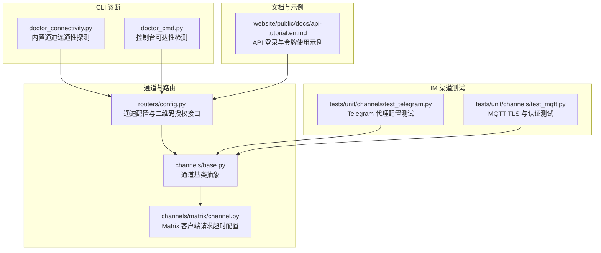
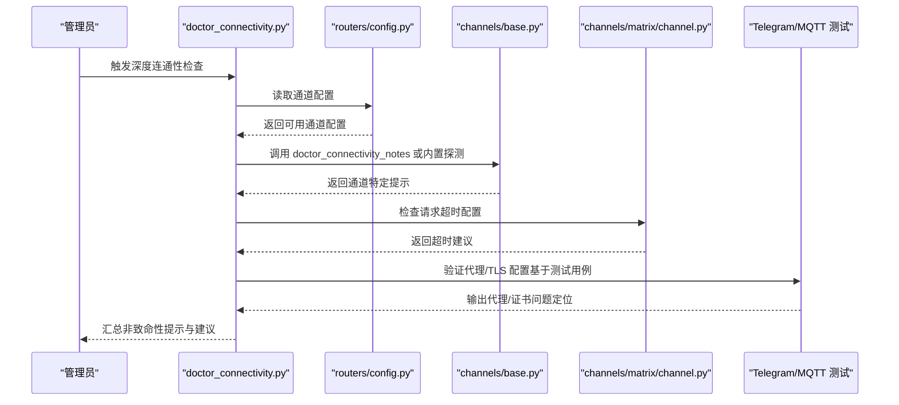
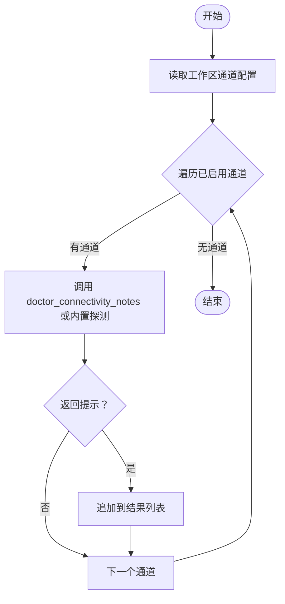
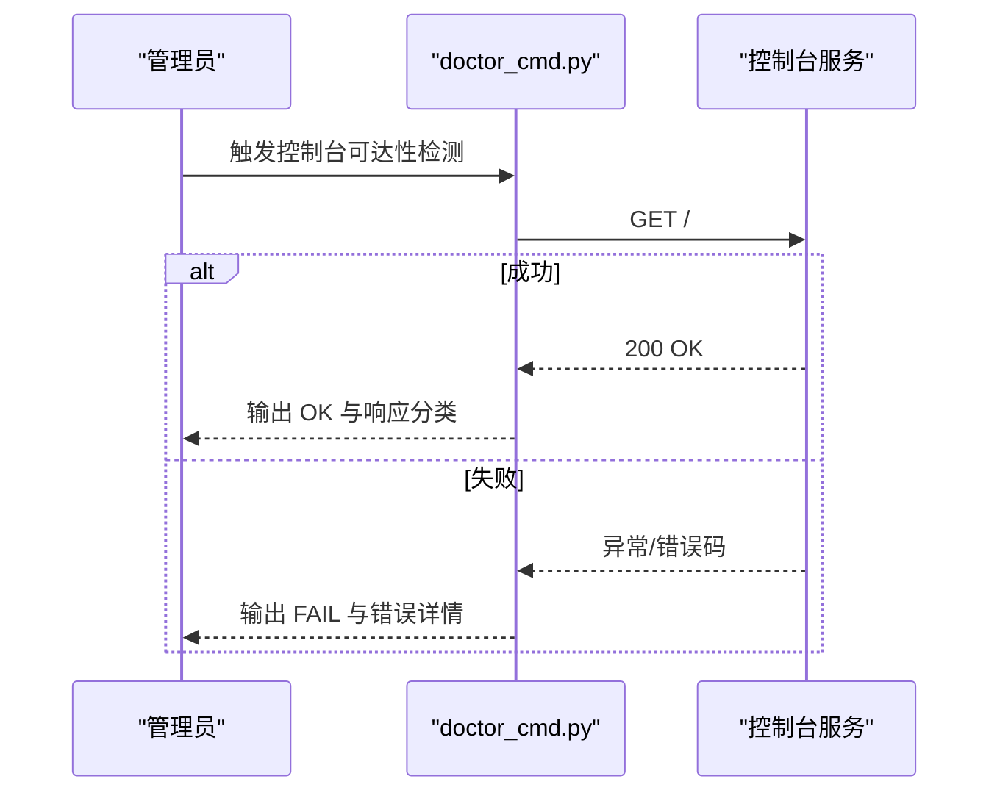
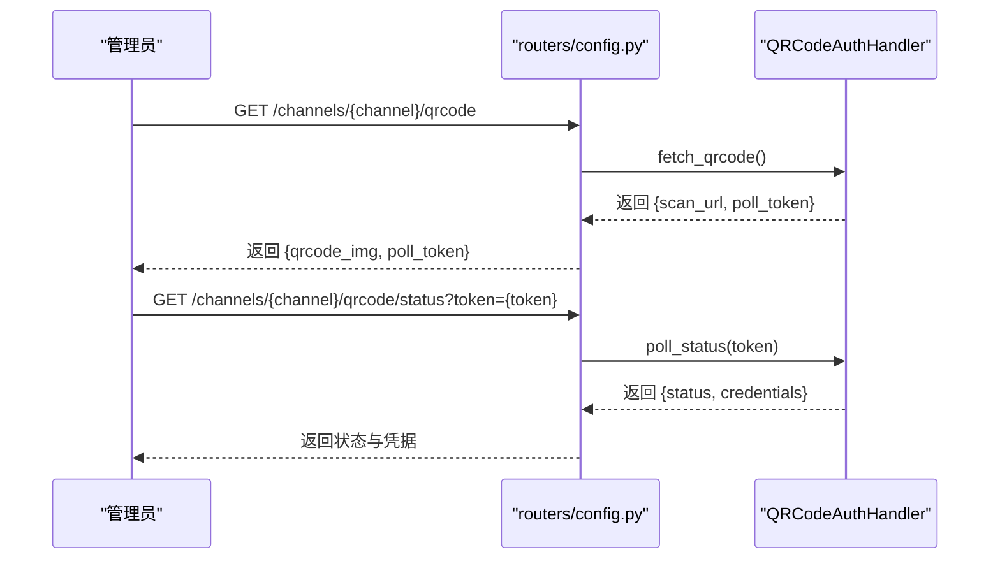
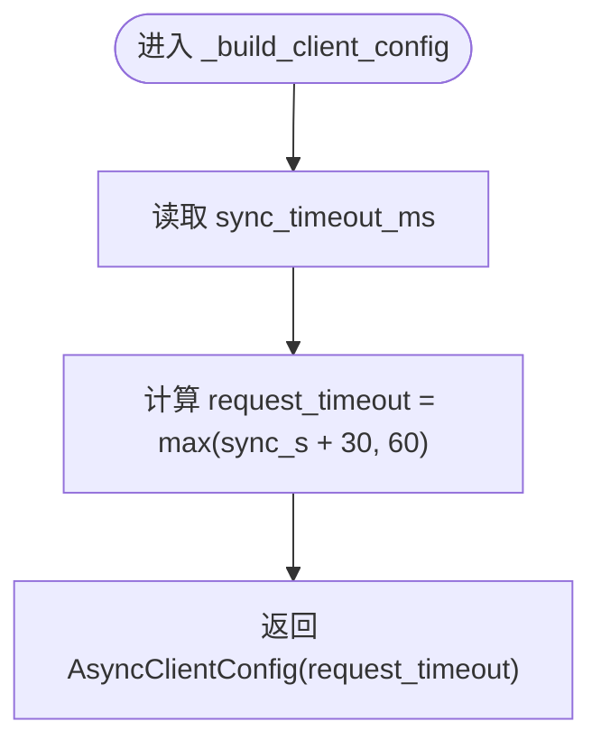
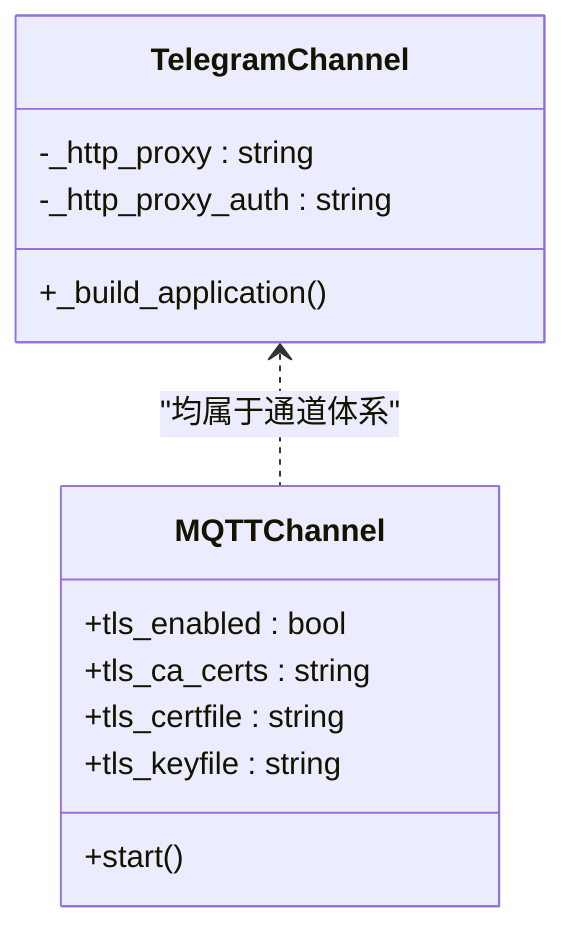
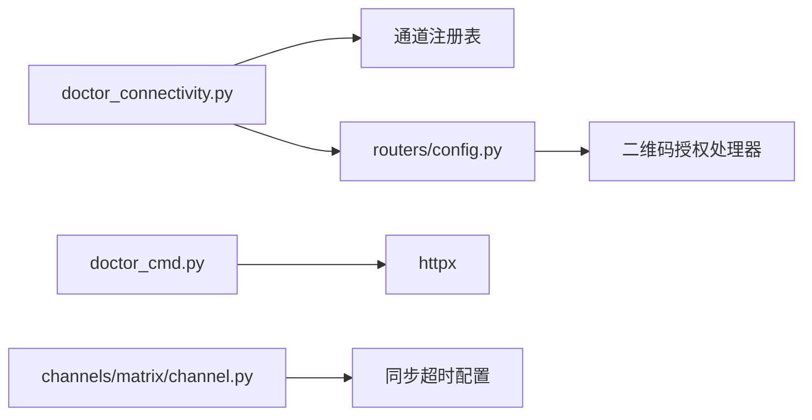
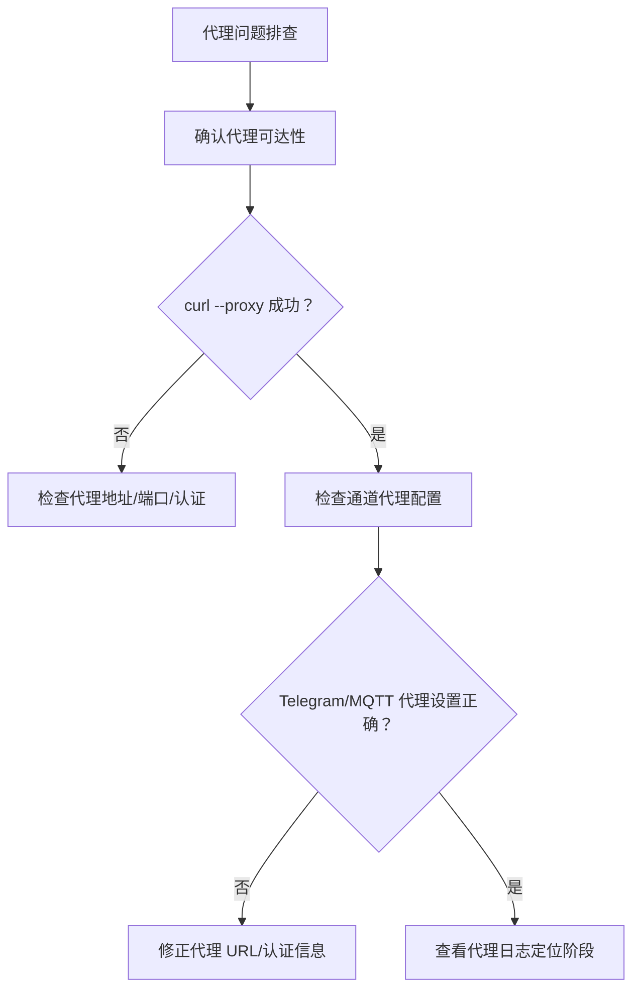
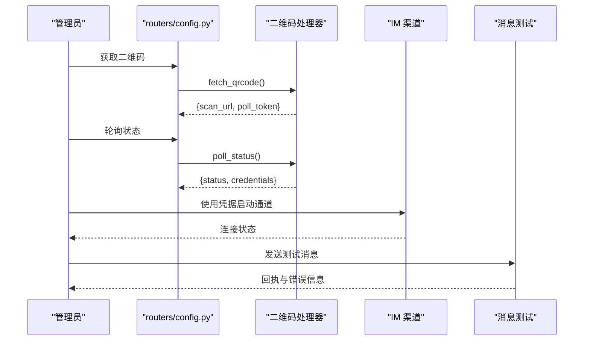

# 网络连接问题排查

<cite>
**本文引用的文件**
- [doctor_connectivity.py](file://src/qwenpaw/cli/doctor_connectivity.py)
- [doctor_cmd.py](file://src/qwenpaw/cli/doctor_cmd.py)
- [matrix/channel.py](file://src/qwenpaw/app/channels/matrix/channel.py)
- [config.py（路由）](file://src/qwenpaw/app/routers/config.py)
- [test_telegram.py](file://tests/unit/channels/test_telegram.py)
- [test_mqtt.py](file://tests/unit/channels/test_mqtt.py)
- [api-tutorial.en.md](file://website/public/docs/api-tutorial.en.md)
</cite>

## 目录
1. [简介](#简介)
2. [项目结构](#项目结构)
3. [核心组件](#核心组件)
4. [架构总览](#架构总览)
5. [详细组件分析](#详细组件分析)
6. [依赖分析](#依赖分析)
7. [性能考虑](#性能考虑)
8. [故障排查指南](#故障排查指南)
9. [结论](#结论)
10. [附录](#附录)

## 简介
本指南面向运维与开发人员，聚焦于 QwenPaw 在实际部署中可能遇到的网络连接问题，覆盖以下方面：
- 防火墙阻断、DNS 解析失败、代理服务器问题的系统化诊断流程
- 不同模型提供商的网络配置检查要点（API 密钥验证、连接超时）
- 渠道连接问题排查（以 IM 平台为例，含认证与消息传递测试）
- 常用网络连通性测试工具与命令（ping、traceroute、curl 等）
- 代理配置、SSL/TLS 证书验证与网络策略相关的故障排除方案

## 项目结构
围绕网络连接排查，本仓库中与“网络连通性探测”“通道配置与认证”“IM 渠道代理与 TLS”“API 访问示例”等主题直接相关的模块如下：

**图表来源**
- [doctor_connectivity.py](file://src/qwenpaw/cli/doctor_connectivity.py)
- [doctor_cmd.py](file://src/qwenpaw/cli/doctor_cmd.py)
- [config.py（路由）](file://src/qwenpaw/app/routers/config.py)
- [matrix/channel.py](file://src/qwenpaw/app/channels/matrix/channel.py)
- [test_telegram.py](file://tests/unit/channels/test_telegram.py)
- [test_mqtt.py](file://tests/unit/channels/test_mqtt.py)
- [api-tutorial.en.md](file://website/public/docs/api-tutorial.en.md)

**章节来源**
- [doctor_connectivity.py:1-297](file://src/qwenpaw/cli/doctor_connectivity.py#L1-L297)
- [doctor_cmd.py:895-938](file://src/qwenpaw/cli/doctor_cmd.py#L895-L938)
- [config.py（路由）:251-327](file://src/qwenpaw/app/routers/config.py#L251-L327)
- [matrix/channel.py:316-339](file://src/qwenpaw/app/channels/matrix/channel.py#L316-L339)
- [test_telegram.py:1734-1789](file://tests/unit/channels/test_telegram.py#L1734-L1789)
- [test_mqtt.py:439-477](file://tests/unit/channels/test_mqtt.py#L439-L477)
- [api-tutorial.en.md:696-769](file://website/public/docs/api-tutorial.en.md#L696-L769)

## 核心组件
- 内置通道连通性探测器：对已启用的通道执行 TCP/HTTP 探测，输出非致命性提示，便于识别防火墙或离线场景。
- 控制台可达性检测：通过 HTTP 请求根路径判断控制台服务是否可访问，并给出响应分类。
- 通道配置与二维码授权：统一的通道配置查询与二维码授权接口，支持扫码登录与轮询状态。
- Matrix 客户端请求超时：根据同步超时动态设置请求超时，避免在长轮询期间被 HTTP 层提前中断。
- IM 渠道代理与 TLS：Telegram 代理配置（无/带认证），MQTT TLS 证书链与认证参数。

**章节来源**
- [doctor_connectivity.py:38-54](file://src/qwenpaw/cli/doctor_connectivity.py#L38-L54)
- [doctor_cmd.py:905-934](file://src/qwenpaw/cli/doctor_cmd.py#L905-L934)
- [config.py（路由）:254-327](file://src/qwenpaw/app/routers/config.py#L254-L327)
- [matrix/channel.py:323-339](file://src/qwenpaw/app/channels/matrix/channel.py#L323-L339)
- [test_telegram.py:1737-1789](file://tests/unit/channels/test_telegram.py#L1737-L1789)
- [test_mqtt.py:455-472](file://tests/unit/channels/test_mqtt.py#L455-L472)

## 架构总览
下图展示“网络连通性探测—通道配置—IM 渠道接入”的整体关系与数据流。

**图表来源**
- [doctor_connectivity.py:256-297](file://src/qwenpaw/cli/doctor_connectivity.py#L256-L297)
- [config.py（路由）:254-327](file://src/qwenpaw/app/routers/config.py#L254-L327)
- [matrix/channel.py:323-339](file://src/qwenpaw/app/channels/matrix/channel.py#L323-L339)
- [test_telegram.py:1737-1789](file://tests/unit/channels/test_telegram.py#L1737-L1789)
- [test_mqtt.py:455-472](file://tests/unit/channels/test_mqtt.py#L455-L472)

## 详细组件分析

### 组件一：内置通道连通性探测器
- 功能概述
  - 对已启用的通道执行 TCP/HTTP 探测，输出非致命性提示，便于识别防火墙或离线场景。
  - 支持通道自定义提示（若通道实现 doctor_connectivity_notes，则优先调用）。
- 关键逻辑
  - TCP 探测：使用 socket 连接目标主机与端口，超时时间内成功建立连接则视为可达。
  - HTTP 探测：使用 httpx 发起 GET 请求，关注状态码与异常类型。
  - 通道遍历：从工作区配置中读取有效通道，跳过禁用项与不支持的通道类型。
  - 错误处理：捕获通道自定义探测异常与内置探测异常，记录错误信息但不中断整体流程。

**图表来源**
- [doctor_connectivity.py:256-297](file://src/qwenpaw/cli/doctor_connectivity.py#L256-L297)

**章节来源**
- [doctor_connectivity.py:38-54](file://src/qwenpaw/cli/doctor_connectivity.py#L38-L54)
- [doctor_connectivity.py:256-297](file://src/qwenpaw/cli/doctor_connectivity.py#L256-L297)

### 组件二：控制台可达性检测
- 功能概述
  - 通过 HTTP 请求根路径判断控制台服务是否可访问，并对响应进行分类。
- 关键逻辑
  - 发起根路径 GET 请求，处理请求异常与状态码。
  - 将结果以“OK/FAIL”形式输出，并在失败时给出具体原因。

**图表来源**
- [doctor_cmd.py:905-934](file://src/qwenpaw/cli/doctor_cmd.py#L905-L934)

**章节来源**
- [doctor_cmd.py:905-934](file://src/qwenpaw/cli/doctor_cmd.py#L905-L934)

### 组件三：通道配置与二维码授权接口
- 功能概述
  - 提供统一的通道配置查询与二维码授权接口，支持扫码登录与轮询状态。
- 关键逻辑
  - 获取指定通道配置：校验通道名称与可用性，返回对应配置对象。
  - 获取二维码：生成扫描链接与轮询令牌，返回 base64 PNG。
  - 轮询状态：根据令牌查询授权状态与凭据。

**图表来源**
- [config.py（路由）:254-327](file://src/qwenpaw/app/routers/config.py#L254-L327)

**章节来源**
- [config.py（路由）:254-327](file://src/qwenpaw/app/routers/config.py#L254-L327)

### 组件四：Matrix 客户端请求超时配置
- 功能概述
  - 根据同步超时动态计算请求超时，确保长轮询不会被 HTTP 层提前中断。
- 关键逻辑
  - 计算公式：请求超时 = max(同步超时 + 固定余量, 最小阈值)。
  - 传入 AsyncClientConfig，影响后续事件同步与消息收发。

**图表来源**
- [matrix/channel.py:323-339](file://src/qwenpaw/app/channels/matrix/channel.py#L323-L339)

**章节来源**
- [matrix/channel.py:323-339](file://src/qwenpaw/app/channels/matrix/channel.py#L323-L339)

### 组件五：IM 渠道代理与 TLS 配置
- Telegram 代理
  - 无代理：不调用代理配置。
  - 无认证代理：仅设置代理地址。
  - 带认证代理：将认证信息嵌入代理 URL。
- MQTT TLS
  - 启用 TLS 时，设置 CA 证书、客户端证书与私钥文件路径。
  - 支持用户名/密码认证与重连延迟配置。

**图表来源**
- [test_telegram.py:1737-1789](file://tests/unit/channels/test_telegram.py#L1737-L1789)
- [test_mqtt.py:455-472](file://tests/unit/channels/test_mqtt.py#L455-L472)

**章节来源**
- [test_telegram.py:1737-1789](file://tests/unit/channels/test_telegram.py#L1737-L1789)
- [test_mqtt.py:455-472](file://tests/unit/channels/test_mqtt.py#L455-L472)

## 依赖分析
- 组件耦合
  - doctor_connectivity.py 依赖通道注册表与通道配置模型，用于遍历与探测。
  - doctor_cmd.py 依赖 HTTP 客户端与版本信息，用于控制台可达性检测。
  - routers/config.py 依赖通道处理器映射，用于二维码授权与配置查询。
  - matrix/channel.py 依赖通道配置中的同步超时参数，用于请求超时计算。
- 外部依赖
  - httpx：发起 HTTP 请求与探测。
  - socket：TCP 连接探测。
  - 测试用例：验证代理与 TLS 的行为边界。

**图表来源**
- [doctor_connectivity.py:16-33](file://src/qwenpaw/cli/doctor_connectivity.py#L16-L33)
- [doctor_cmd.py:907-911](file://src/qwenpaw/cli/doctor_cmd.py#L907-L911)
- [config.py（路由）:264-294](file://src/qwenpaw/app/routers/config.py#L264-L294)
- [matrix/channel.py:333-339](file://src/qwenpaw/app/channels/matrix/channel.py#L333-L339)

**章节来源**
- [doctor_connectivity.py:16-33](file://src/qwenpaw/cli/doctor_connectivity.py#L16-L33)
- [doctor_cmd.py:907-911](file://src/qwenpaw/cli/doctor_cmd.py#L907-L911)
- [config.py（路由）:264-294](file://src/qwenpaw/app/routers/config.py#L264-L294)
- [matrix/channel.py:333-339](file://src/qwenpaw/app/channels/matrix/channel.py#L333-L339)

## 性能考虑
- 请求超时与长轮询
  - Matrix 客户端将请求超时设置为“同步超时 + 余量”与“最小阈值”的较大者，避免在服务端等待新事件时被提前中断。
- 探测超时
  - TCP/HTTP 探测采用固定超时参数，建议结合网络环境调整，避免误报或漏报。
- 代理与 TLS
  - 代理配置不当会增加握手与转发开销；TLS 证书链不完整会导致握手失败与重试。

**章节来源**
- [matrix/channel.py:323-339](file://src/qwenpaw/app/channels/matrix/channel.py#L323-L339)
- [doctor_connectivity.py:38-54](file://src/qwenpaw/cli/doctor_connectivity.py#L38-L54)

## 故障排查指南

### 通用网络连通性测试
- 基础连通性
  - 使用 ping 检查主机可达性。
  - 使用 traceroute/tracert 追踪路由路径，定位丢包点。
- HTTP 可达性
  - 使用 curl 或 httpx 发起 GET 请求，观察状态码与响应时间。
  - 若存在重定向，确认 follow_redirects 行为符合预期。
- DNS 解析
  - 使用 nslookup/dig 查询域名解析结果，确认解析到正确 IP。
  - 如遇解析失败，检查本地 DNS 与上游 DNS 设置。

### 防火墙与端口阻断
- TCP 探测
  - 使用 telnet 或 nc 测试目标端口连通性。
  - 若探测失败，检查本地/远程防火墙策略与安全组规则。
- 代理绕行
  - 临时关闭代理或切换直连，验证是否为代理导致的阻断。

### DNS 解析失败
- 本地缓存清理
  - 清理系统 DNS 缓存，重新解析。
- 替换 DNS 服务器
  - 切换至公共 DNS（如 8.8.8.8、114.114.114.114），排除本地 DNS 异常。
- 主机名映射
  - 在 hosts 文件中添加静态映射，快速验证域名解析。

### 代理服务器问题
- 代理连通性
  - 使用 curl --proxy 指定代理进行连通性测试。
  - 验证代理认证方式（无认证、基础认证、NTLM 等）。
- 通道代理配置
  - Telegram：确认代理 URL 与认证信息格式正确。
  - MQTT：确认代理端口与协议（HTTP/SOCKS）匹配。
- 代理日志
  - 开启代理访问日志，定位失败阶段（连接、认证、转发）。

**图表来源**
- [test_telegram.py:1737-1789](file://tests/unit/channels/test_telegram.py#L1737-L1789)
- [test_mqtt.py:455-472](file://tests/unit/channels/test_mqtt.py#L455-L472)

**章节来源**
- [test_telegram.py:1737-1789](file://tests/unit/channels/test_telegram.py#L1737-L1789)
- [test_mqtt.py:455-472](file://tests/unit/channels/test_mqtt.py#L455-L472)

### SSL/TLS 证书验证
- 常见问题
  - 证书链不完整、过期、域名不匹配。
- 排查步骤
  - 使用 openssl s_client 验证证书链与过期时间。
  - 在 httpx 中禁用严格校验仅用于诊断（生产环境不建议）。
  - 更新系统 CA 证书库或导入自签证书。
- 通道 TLS
  - MQTT：确认 CA、客户端证书与私钥路径正确，权限与格式无误。

**章节来源**
- [test_mqtt.py:455-472](file://tests/unit/channels/test_mqtt.py#L455-L472)

### 模型提供商网络配置检查清单
- API 密钥验证
  - 确认密钥未过期且具有相应权限。
  - 使用 curl 直接调用提供商 API，验证鉴权头与响应码。
- 连接超时
  - 根据网络质量适当增大连接与读取超时。
  - 对长耗时请求（如多模态推理）预留足够缓冲。
- 代理与网络策略
  - 若需通过代理访问，确保代理支持 HTTPS 与认证。
  - 检查企业网络策略是否限制出站端口与域名。

**章节来源**
- [api-tutorial.en.md:696-769](file://website/public/docs/api-tutorial.en.md#L696-L769)

### 渠道连接问题排查（以 IM 平台为例）
- 认证与授权
  - 使用二维码授权接口获取扫描链接与轮询令牌。
  - 轮询状态接口返回授权状态与凭据，核对凭据完整性。
- 消息传递测试
  - 通过通道发送测试消息，观察回调与回执。
  - 若失败，检查应用 ID、密钥、回调地址与签名算法。
- 代理与 TLS
  - Telegram：确认代理 URL 与认证信息；必要时禁用代理进行对比测试。
  - MQTT：确认 TLS 参数与证书链；检查用户名/密码与重连策略。

**图表来源**
- [config.py（路由）:254-327](file://src/qwenpaw/app/routers/config.py#L254-L327)
- [test_telegram.py:1737-1789](file://tests/unit/channels/test_telegram.py#L1737-L1789)
- [test_mqtt.py:455-472](file://tests/unit/channels/test_mqtt.py#L455-L472)

**章节来源**
- [config.py（路由）:254-327](file://src/qwenpaw/app/routers/config.py#L254-L327)
- [test_telegram.py:1737-1789](file://tests/unit/channels/test_telegram.py#L1737-L1789)
- [test_mqtt.py:455-472](file://tests/unit/channels/test_mqtt.py#L455-L472)

## 结论
- 本指南提供了从“连通性探测—通道配置—IM 渠道接入—代理与 TLS—模型提供商配置”的全链路排查思路。
- 建议在生产环境中优先使用内置探测器与二维码授权接口，配合日志与监控定位问题。
- 对于代理与 TLS，务必确保配置正确与证书链完整，避免因中间环节导致的隐性失败。

## 附录
- 常用命令参考
  - ping：检查主机可达性
  - traceroute/tracert：追踪路由路径
  - curl：发起 HTTP 请求，验证状态码与响应
  - nslookup/dig：查询 DNS 解析
  - openssl s_client：验证 TLS 证书链
- API 示例参考
  - 登录获取令牌与后续请求携带 Authorization 头的示例可参考网站文档。

**章节来源**
- [api-tutorial.en.md:696-769](file://website/public/docs/api-tutorial.en.md#L696-L769)