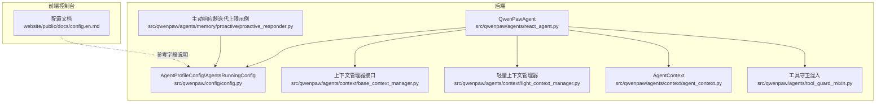
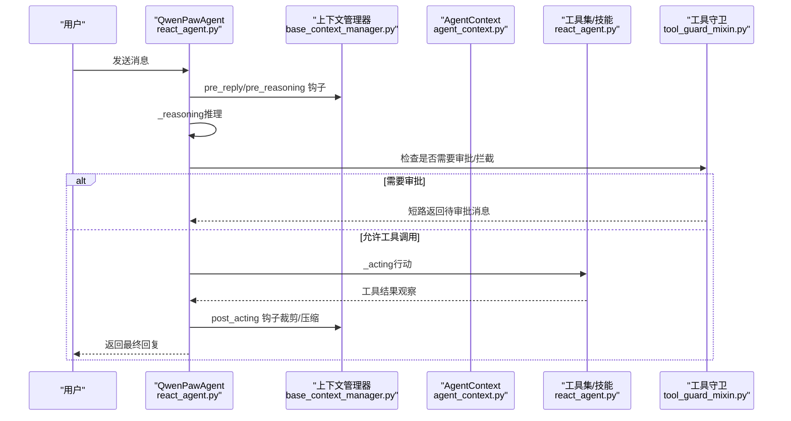
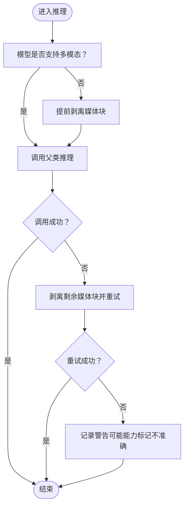
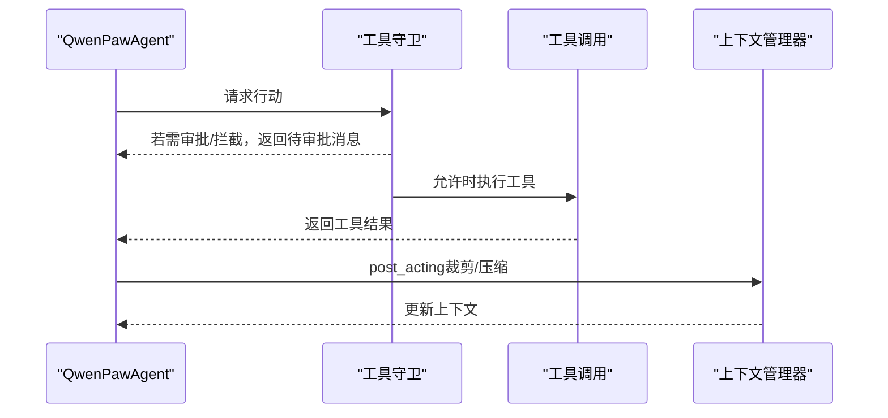
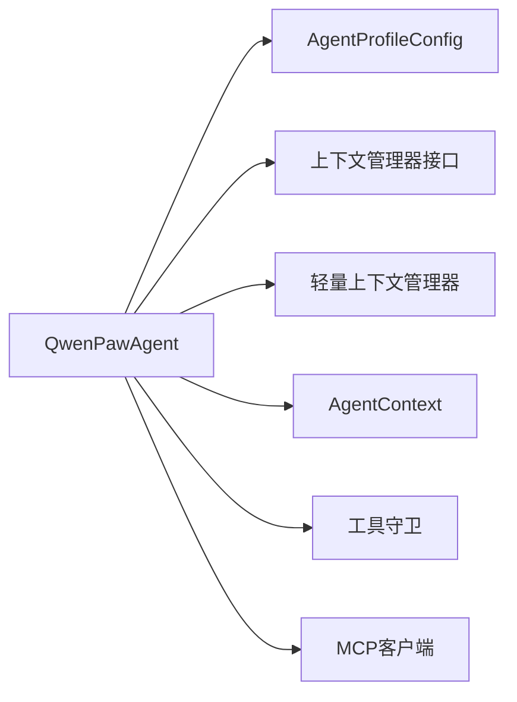

# ReAct代理原理

<cite>
**本文引用的文件**
- [react_agent.py](file://src/qwenpaw/agents/react_agent.py)
- [config.py](file://src/qwenpaw/config/config.py)
- [base_context_manager.py](file://src/qwenpaw/agents/context/base_context_manager.py)
- [light_context_manager.py](file://src/qwenpaw/agents/context/light_context_manager.py)
- [agent_context.py](file://src/qwenpaw/agents/context/agent_context.py)
- [tool_guard_mixin.py](file://src/qwenpaw/agents/tool_guard_mixin.py)
- [proactive_responder.py](file://src/qwenpaw/agents/memory/proactive/proactive_responder.py)
- [config.en.md](file://website/public/docs/config.en.md)
</cite>

## 目录
1. [引言](#引言)
2. [项目结构](#项目结构)
3. [核心组件](#核心组件)
4. [架构总览](#架构总览)
5. [详细组件分析](#详细组件分析)
6. [依赖关系分析](#依赖关系分析)
7. [性能考量](#性能考量)
8. [故障排查指南](#故障排查指南)
9. [结论](#结论)
10. [附录](#附录)

## 引言
本文件系统性阐述ReAct（推理-行动-观察）代理在该代码库中的实现与使用方式，重点覆盖以下方面：
- 思考-行动-观察循环的实现与控制流
- 决策过程、工具调用机制、状态管理与错误处理策略
- 代理配置参数（如最大迭代次数、输入长度限制等）的作用与来源
- 代理生命周期管理、内存管理与会话状态维护的技术细节
- 结合实际源码路径给出可定位到具体实现的参考位置，便于进一步阅读与扩展

## 项目结构
ReAct代理的核心实现位于Python后端模块中，前端控制台通过API与后端交互。与ReAct代理直接相关的关键目录与文件如下：
- 后端核心代理实现：src/qwenpaw/agents/react_agent.py
- 配置模型与运行参数：src/qwenpaw/config/config.py
- 上下文与内存管理钩子：src/qwenpaw/agents/context/*
- 工具守卫与拦截：src/qwenpaw/agents/tool_guard_mixin.py
- 主动响应与迭代上限示例：src/qwenpaw/agents/memory/proactive/proactive_responder.py
- 文档化配置字段说明：website/public/docs/config.en.md

**图表来源**
- [react_agent.py:77-210](file://src/qwenpaw/agents/react_agent.py#L77-L210)
- [config.py:899-966](file://src/qwenpaw/config/config.py#L899-L966)
- [base_context_manager.py:114-153](file://src/qwenpaw/agents/context/base_context_manager.py#L114-L153)
- [light_context_manager.py:395-444](file://src/qwenpaw/agents/context/light_context_manager.py#L395-L444)
- [agent_context.py:269-349](file://src/qwenpaw/agents/context/agent_context.py#L269-L349)
- [tool_guard_mixin.py:636-676](file://src/qwenpaw/agents/tool_guard_mixin.py#L636-L676)
- [proactive_responder.py:100-105](file://src/qwenpaw/agents/memory/proactive/proactive_responder.py#L100-L105)
- [config.en.md:346-354](file://website/public/docs/config.en.md#L346-L354)

**章节来源**
- [react_agent.py:77-210](file://src/qwenpaw/agents/react_agent.py#L77-L210)
- [config.py:899-966](file://src/qwenpaw/config/config.py#L899-L966)
- [config.en.md:346-354](file://website/public/docs/config.en.md#L346-L354)

## 核心组件
- QwenPawAgent：基于ReActAgent的增强实现，集成工具集、技能加载、内存与上下文管理、命令处理、MCP客户端注册与恢复、媒体块处理与自动续推等能力。
- 配置模型：AgentProfileConfig与AgentsRunningConfig定义了运行期参数（如max_iters、max_input_length），这些参数直接影响ReAct循环的行为边界。
- 上下文管理器：提供预推理、推理后、行动前、行动后等钩子，用于上下文压缩、工具结果裁剪与内存健康检查。
- 工具守卫：在推理与行动阶段进行拦截与审批，保障工具调用安全。
- 主动响应器：演示如何在特定场景下调低max_iters以限制迭代次数。

**章节来源**
- [react_agent.py:77-210](file://src/qwenpaw/agents/react_agent.py#L77-L210)
- [config.py:899-966](file://src/qwenpaw/config/config.py#L899-L966)
- [base_context_manager.py:114-153](file://src/qwenpaw/agents/context/base_context_manager.py#L114-L153)
- [tool_guard_mixin.py:636-676](file://src/qwenpaw/agents/tool_guard_mixin.py#L636-L676)
- [proactive_responder.py:100-105](file://src/qwenpaw/agents/memory/proactive/proactive_responder.py#L100-L105)

## 架构总览
ReAct代理的总体流程围绕“思考-行动-观察”循环展开，QwenPawAgent在父类ReActAgent基础上叠加了工具注册、系统提示构建、上下文钩子、媒体块处理、MCP客户端恢复与工具守卫拦截等能力。

**图表来源**
- [react_agent.py:786-800](file://src/qwenpaw/agents/react_agent.py#L786-L800)
- [base_context_manager.py:130-153](file://src/qwenpaw/agents/context/base_context_manager.py#L130-L153)
- [tool_guard_mixin.py:662-676](file://src/qwenpaw/agents/tool_guard_mixin.py#L662-L676)

## 详细组件分析

### QwenPawAgent：初始化与配置注入
- 初始化要点
  - 从AgentProfileConfig提取running配置（如max_iters、max_input_length等），并将这些参数传递给父类ReActAgent。
  - 构建系统提示（系统提示文件、心跳开关、语言、多模态提示、环境上下文）。
  - 注册内置工具与动态技能，支持异步任务管理工具的自动注册。
  - 绑定上下文管理器钩子（pre_reply、pre_reasoning、post_acting、post_reply）。
  - 注册命令处理器与引导钩子。
  - 支持MCP客户端注册与断线恢复。

- 关键实现位置
  - 初始化与参数注入：[react_agent.py:97-177](file://src/qwenpaw/agents/react_agent.py#L97-L177)
  - 工具集创建与异步任务管理工具注册：[react_agent.py:210-327](file://src/qwenpaw/agents/react_agent.py#L210-L327)
  - 技能注册：[react_agent.py:329-363](file://src/qwenpaw/agents/react_agent.py#L329-L363)
  - 系统提示构建：[react_agent.py:365-403](file://src/qwenpaw/agents/react_agent.py#L365-L403)
  - 上下文钩子注册：[react_agent.py:405-446](file://src/qwenpaw/agents/react_agent.py#L405-L446)
  - MCP客户端注册与恢复：[react_agent.py:471-651](file://src/qwenpaw/agents/react_agent.py#L471-L651)

- 配置参数作用
  - max_iters：限制ReAct循环的最大迭代次数，避免无限/过长循环。
  - max_input_length：限制模型上下文窗口输入长度，影响上下文压缩阈值与历史截断策略。
  - auto_continue_on_text_only：当模型仅返回文本而未调用工具时，自动注入提示并额外推理以触发工具调用。

**章节来源**
- [react_agent.py:97-177](file://src/qwenpaw/agents/react_agent.py#L97-L177)
- [react_agent.py:210-327](file://src/qwenpaw/agents/react_agent.py#L210-L327)
- [react_agent.py:329-363](file://src/qwenpaw/agents/react_agent.py#L329-L363)
- [react_agent.py:365-403](file://src/qwenpaw/agents/react_agent.py#L365-L403)
- [react_agent.py:405-446](file://src/qwenpaw/agents/react_agent.py#L405-L446)
- [react_agent.py:471-651](file://src/qwenpaw/agents/react_agent.py#L471-L651)
- [config.py:822-828](file://src/qwenpaw/config/config.py#L822-L828)
- [config.en.md:346-354](file://website/public/docs/config.en.md#L346-L354)

### 推理阶段：_reasoning与自动续推
- 核心逻辑
  - 在调用父类推理前，若模型不支持多模态，则提前剥离媒体块；若调用失败则再次剥离并重试。
  - 当启用auto_continue_on_text_only且当前回复不含工具调用时，注入语言匹配的提示与尾部上下文，最多额外推理有限次，直到出现工具调用或达到上限。

- 关键实现位置
  - 多模态媒体块处理与重试：[react_agent.py:786-800](file://src/qwenpaw/agents/react_agent.py#L786-L800)
  - 自动续推逻辑：[react_agent.py:701-765](file://src/qwenpaw/agents/react_agent.py#L701-L765)

**图表来源**
- [react_agent.py:786-800](file://src/qwenpaw/agents/react_agent.py#L786-L800)

**章节来源**
- [react_agent.py:786-800](file://src/qwenpaw/agents/react_agent.py#L786-L800)
- [react_agent.py:701-765](file://src/qwenpaw/agents/react_agent.py#L701-L765)

### 行动阶段：_acting与工具守卫
- 核心逻辑
  - 行动阶段由工具守卫拦截，若存在待复盘/审批，将短路返回，等待审批完成后再继续后续流程。
  - 行动后由上下文管理器post_acting钩子进行裁剪与压缩，确保上下文不超阈值。

- 关键实现位置
  - 工具守卫短路推理：[tool_guard_mixin.py:662-676](file://src/qwenpaw/agents/tool_guard_mixin.py#L662-L676)
  - 行动后钩子（裁剪/压缩）：[base_context_manager.py:130-153](file://src/qwenpaw/agents/context/base_context_manager.py#L130-L153)

**图表来源**
- [tool_guard_mixin.py:662-676](file://src/qwenpaw/agents/tool_guard_mixin.py#L662-L676)
- [base_context_manager.py:130-153](file://src/qwenpaw/agents/context/base_context_manager.py#L130-L153)

**章节来源**
- [tool_guard_mixin.py:636-676](file://src/qwenpaw/agents/tool_guard_mixin.py#L636-L676)
- [base_context_manager.py:130-153](file://src/qwenpaw/agents/context/base_context_manager.py#L130-L153)

### 上下文与内存管理：钩子与压缩
- 钩子职责
  - pre_reply/pre_reasoning：上下文健康检查与压缩准备。
  - post_acting：对工具结果进行裁剪，避免占用过多上下文。
  - post_reply：会话后处理。

- 压缩与阈值
  - 轻量上下文管理器根据max_input_length与配置比例计算压缩阈值与保留阈值，超过阈值时进行压缩与清理。

- 关键实现位置
  - 钩子接口定义：[base_context_manager.py:114-153](file://src/qwenpaw/agents/context/base_context_manager.py#L114-L153)
  - 轻量上下文阈值计算与压缩：[light_context_manager.py:395-444](file://src/qwenpaw/agents/context/light_context_manager.py#L395-L444)
  - 上下文统计与历史字符串生成（含max_input_length使用）：[agent_context.py:269-349](file://src/qwenpaw/agents/context/agent_context.py#L269-L349)

**章节来源**
- [base_context_manager.py:114-153](file://src/qwenpaw/agents/context/base_context_manager.py#L114-L153)
- [light_context_manager.py:395-444](file://src/qwenpaw/agents/context/light_context_manager.py#L395-L444)
- [agent_context.py:269-349](file://src/qwenpaw/agents/context/agent_context.py#L269-L349)

### 迭代上限与会话状态：主动响应示例
- 示例场景
  - 在某些主动响应场景中，将agent_config.running.max_iters降低以限制循环次数，防止过度探索。
  - 通过load_agent_config与传参max_iters实现运行时调整。

- 关键实现位置
  - 设置max_iters示例：[proactive_responder.py:100-105](file://src/qwenpaw/agents/memory/proactive/proactive_responder.py#L100-L105)
  - 传参使用：[proactive_responder.py](file://src/qwenpaw/agents/memory/proactive/proactive_responder.py#L130)

**章节来源**
- [proactive_responder.py:100-105](file://src/qwenpaw/agents/memory/proactive/proactive_responder.py#L100-L105)
- [proactive_responder.py](file://src/qwenpaw/agents/memory/proactive/proactive_responder.py#L130)

### 配置参数详解与来源
- 关键运行参数
  - max_iters：ReAct循环最大迭代次数，默认值来源于文档说明。
  - max_input_length：模型上下文窗口输入长度上限，用于上下文压缩与历史截断。
  - auto_continue_on_text_only：当模型仅返回文本时，自动注入提示并额外推理以触发工具调用。

- 参数来源与验证
  - AgentProfileConfig包含running字段，其中包含上述运行参数。
  - 配置模型对部分参数进行校验（例如回退基线与上限的关系）。

- 关键实现位置
  - 参数默认值与描述：[config.py:822-828](file://src/qwenpaw/config/config.py#L822-L828)
  - 参数在初始化中的使用：[react_agent.py:175-177](file://src/qwenpaw/agents/react_agent.py#L175-L177)
  - 文档化字段说明：[config.en.md:346-354](file://website/public/docs/config.en.md#L346-L354)

**章节来源**
- [config.py:822-828](file://src/qwenpaw/config/config.py#L822-L828)
- [react_agent.py:175-177](file://src/qwenpaw/agents/react_agent.py#L175-L177)
- [config.en.md:346-354](file://website/public/docs/config.en.md#L346-L354)

## 依赖关系分析
- 组件耦合
  - QwenPawAgent依赖AgentProfileConfig提供的运行参数，依赖上下文管理器接口以实现钩子扩展，依赖工具守卫以保证安全。
  - 轻量上下文管理器与AgentContext共同负责上下文压缩与统计，受max_input_length影响。

- 外部依赖
  - MCP客户端注册与恢复，支持HTTP与STDIO两种传输方式，具备断线重连与重建能力。

**图表来源**
- [react_agent.py:97-177](file://src/qwenpaw/agents/react_agent.py#L97-L177)
- [config.py:899-966](file://src/qwenpaw/config/config.py#L899-L966)
- [light_context_manager.py:395-444](file://src/qwenpaw/agents/context/light_context_manager.py#L395-L444)
- [agent_context.py:269-349](file://src/qwenpaw/agents/context/agent_context.py#L269-L349)
- [tool_guard_mixin.py:636-676](file://src/qwenpaw/agents/tool_guard_mixin.py#L636-L676)

**章节来源**
- [react_agent.py:97-177](file://src/qwenpaw/agents/react_agent.py#L97-L177)
- [config.py:899-966](file://src/qwenpaw/config/config.py#L899-L966)
- [light_context_manager.py:395-444](file://src/qwenpaw/agents/context/light_context_manager.py#L395-L444)
- [agent_context.py:269-349](file://src/qwenpaw/agents/context/agent_context.py#L269-L349)
- [tool_guard_mixin.py:636-676](file://src/qwenpaw/agents/tool_guard_mixin.py#L636-L676)

## 性能考量
- 上下文压缩与阈值
  - 通过light_context_manager根据max_input_length与配置比例计算压缩阈值，减少历史消息长度，提升推理效率。
- 媒体块剥离
  - 对不支持多模态的模型，在推理前与失败重试时剥离媒体块，减少token消耗与调用失败概率。
- 自动续推
  - 在文本-only场景下，通过注入提示与有限次额外推理，减少无效等待与重复输出。

**章节来源**
- [light_context_manager.py:395-444](file://src/qwenpaw/agents/context/light_context_manager.py#L395-L444)
- [react_agent.py:786-800](file://src/qwenpaw/agents/react_agent.py#L786-L800)
- [react_agent.py:701-765](file://src/qwenpaw/agents/react_agent.py#L701-L765)

## 故障排查指南
- MCP客户端断线与恢复
  - 当MCP客户端会话中断时，尝试关闭旧连接、重连或重建客户端实例，并在失败时记录告警与跳过注册。
- 工具守卫拦截
  - 当工具调用被拦截时，会返回带拒绝信息的消息并写入记忆，随后等待审批完成后继续流程。
- 日志与告警
  - 关键路径均包含日志记录，便于定位问题（如媒体块剥离、自动续推、上下文阈值不足等）。

**章节来源**
- [react_agent.py:471-651](file://src/qwenpaw/agents/react_agent.py#L471-L651)
- [tool_guard_mixin.py:636-676](file://src/qwenpaw/agents/tool_guard_mixin.py#L636-L676)

## 结论
该实现将ReAct代理的“思考-行动-观察”循环与工程化能力（工具集、上下文管理、安全守卫、MCP集成、媒体处理、自动续推）有机结合，通过配置参数（如max_iters、max_input_length）精确控制代理行为边界，并以钩子与上下文压缩保障长期运行的稳定性与性能。对于需要定制化扩展的场景，建议优先从上下文钩子、工具守卫与配置参数入手，确保在功能与安全之间取得平衡。

## 附录
- 配置字段参考
  - max_iters：ReAct循环最大迭代次数
  - max_input_length：模型上下文窗口输入长度上限
  - auto_continue_on_text_only：文本-only时的自动续推策略

**章节来源**
- [config.en.md:346-354](file://website/public/docs/config.en.md#L346-L354)
- [config.py:822-828](file://src/qwenpaw/config/config.py#L822-L828)
- [react_agent.py:175-177](file://src/qwenpaw/agents/react_agent.py#L175-L177)