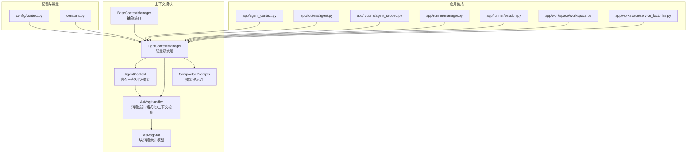
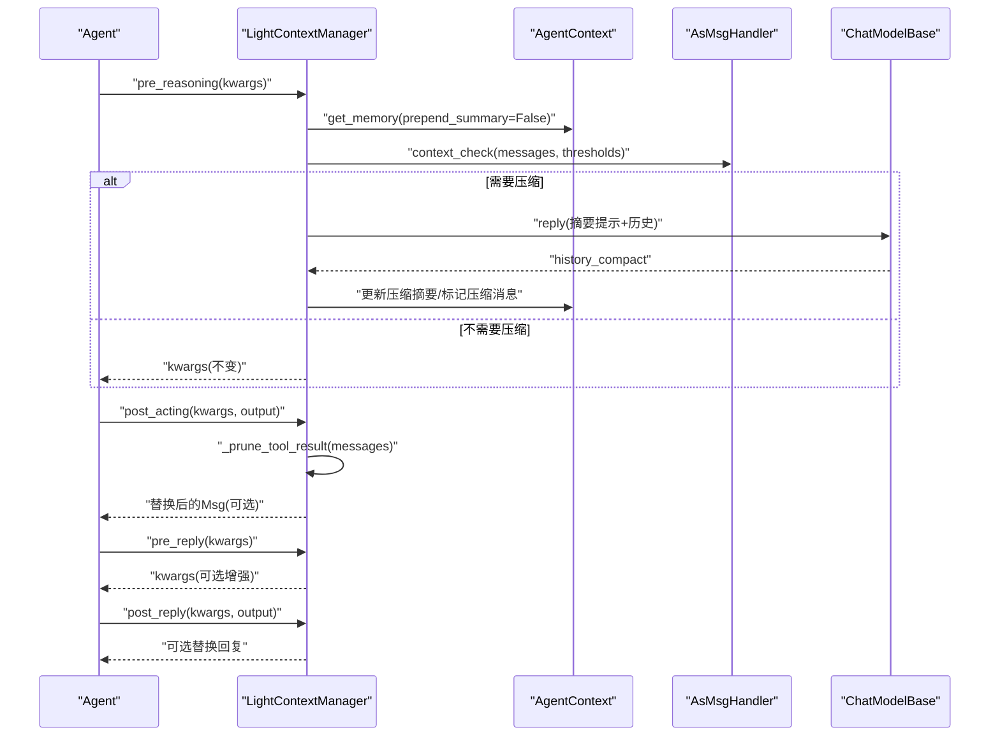
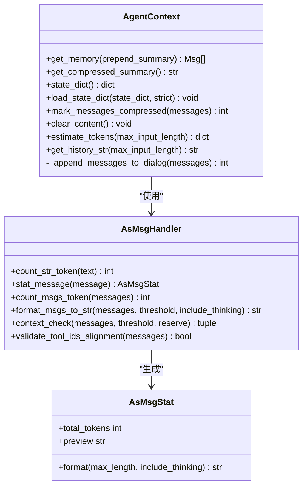
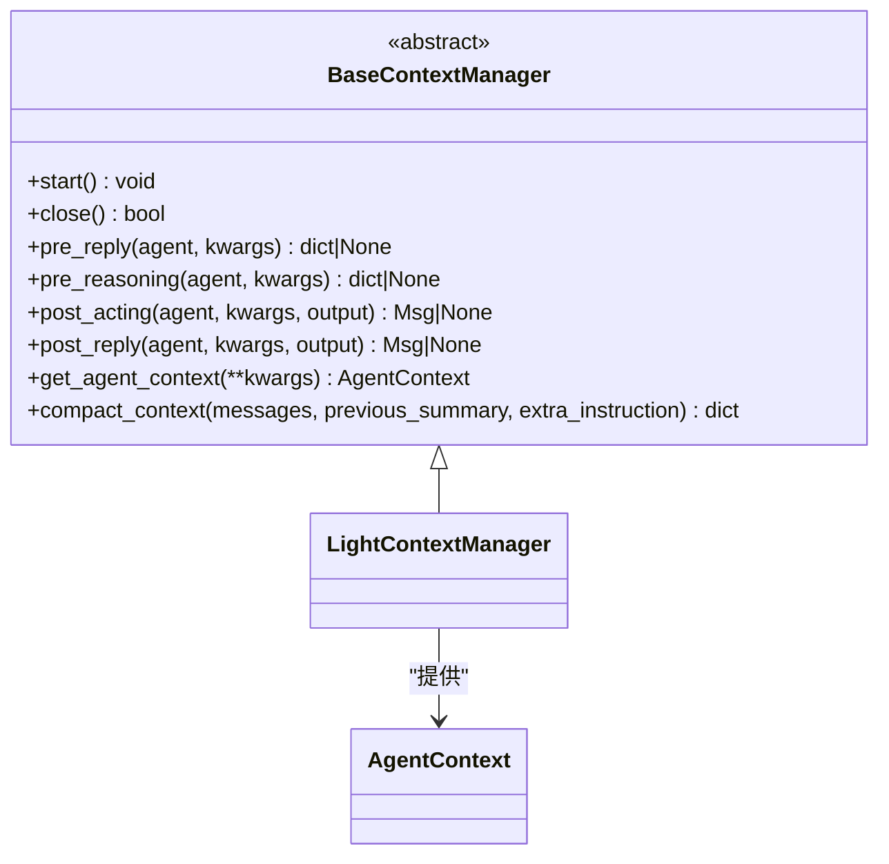
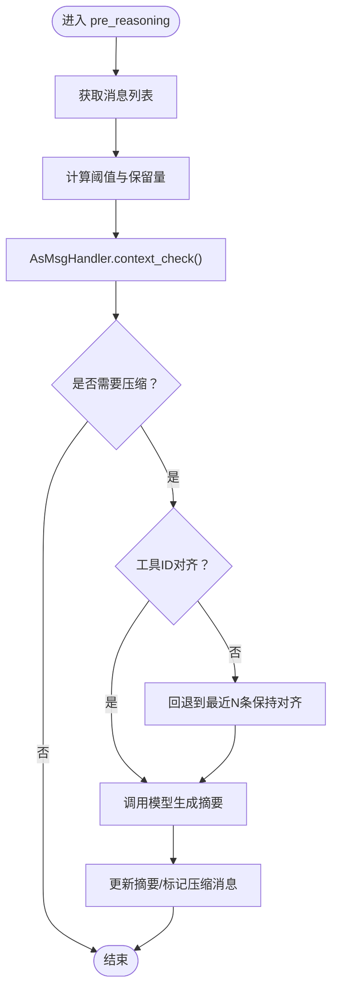
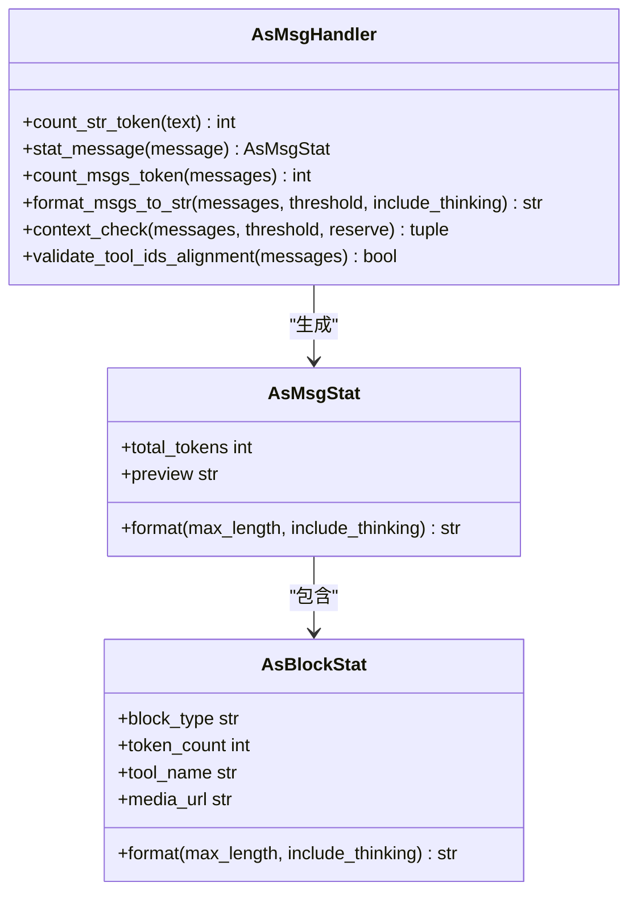
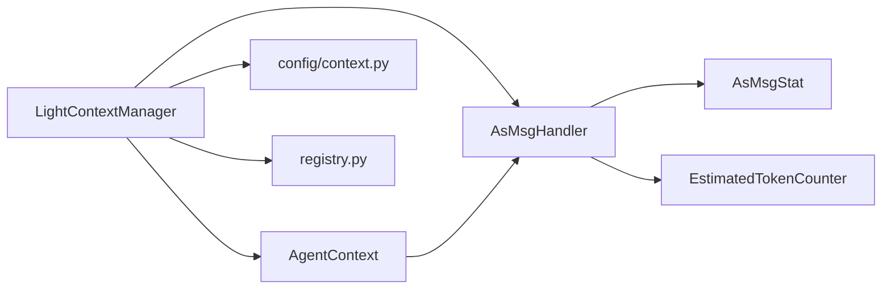

# 上下文管理

<cite>
**本文引用的文件**
- [agent_context.py](file://src/qwenpaw/agents/context/agent_context.py)
- [base_context_manager.py](file://src/qwenpaw/agents/context/base_context_manager.py)
- [light_context_manager.py](file://src/qwenpaw/agents/context/light_context_manager.py)
- [as_msg_handler.py](file://src/qwenpaw/agents/context/as_msg_handler.py)
- [as_msg_stat.py](file://src/qwenpaw/agents/context/as_msg_stat.py)
- [compactor_prompts.py](file://src/qwenpaw/agents/context/compactor_prompts.py)
- [__init__.py](file://src/qwenpaw/agents/context/__init__.py)
- [context.py](file://src/qwenpaw/config/context.py)
- [constant.py](file://src/qwenpaw/constant.py)
- [agent_context.py](file://src/qwenpaw/app/agent_context.py)
- [agent.py](file://src/qwenpaw/app/routers/agent.py)
- [agent_scoped.py](file://src/qwenpaw/app/routers/agent_scoped.py)
- [manager.py](file://src/qwenpaw/app/runner/manager.py)
- [session.py](file://src/qwenpaw/app/runner/session.py)
- [workspace.py](file://src/qwenpaw/app/workspace/workspace.py)
- [service_factories.py](file://src/qwenpaw/app/workspace/service_factories.py)
- [registry.py](file://src/qwenpaw/agents/utils/registry.py)
</cite>

## 目录
1. [引言](#引言)
2. [项目结构](#项目结构)
3. [核心组件](#核心组件)
4. [架构总览](#架构总览)
5. [详细组件分析](#详细组件分析)
6. [依赖关系分析](#依赖关系分析)
7. [性能考量](#性能考量)
8. [故障排查指南](#故障排查指南)
9. [结论](#结论)
10. [附录](#附录)

## 引言
本文件系统性阐述上下文管理系统的概念与实现，覆盖上下文的定义、作用域与生命周期；对比不同上下文管理器（AgentContext、BaseContextManager、LightContextManager）的设计差异与适用场景；解释上下文在消息传递、状态保持与会话管理中的关键作用；并给出配置最佳实践（内存优化、性能与安全策略），以及扩展与自定义开发的指导原则。

## 项目结构
上下文管理相关代码主要位于 agents/context 目录，围绕“消息统计与计数”“上下文切片与压缩”“轻量级上下文管理器”三大模块协作，支撑 Agent 的推理与行动阶段。

图表来源
- [agent_context.py:23-356](file://src/qwenpaw/agents/context/agent_context.py#L23-L356)
- [base_context_manager.py:15-267](file://src/qwenpaw/agents/context/base_context_manager.py#L15-L267)
- [light_context_manager.py:47-990](file://src/qwenpaw/agents/context/light_context_manager.py#L47-L990)
- [as_msg_handler.py:16-380](file://src/qwenpaw/agents/context/as_msg_handler.py#L16-L380)
- [as_msg_stat.py:12-133](file://src/qwenpaw/agents/context/as_msg_stat.py#L12-L133)
- [context.py](file://src/qwenpaw/config/context.py)
- [constant.py](file://src/qwenpaw/constant.py)
- [agent_context.py](file://src/qwenpaw/app/agent_context.py)
- [agent.py](file://src/qwenpaw/app/routers/agent.py)
- [agent_scoped.py](file://src/qwenpaw/app/routers/agent_scoped.py)
- [manager.py](file://src/qwenpaw/app/runner/manager.py)
- [session.py](file://src/qwenpaw/app/runner/session.py)
- [workspace.py](file://src/qwenpaw/app/workspace/workspace.py)
- [service_factories.py](file://src/qwenpaw/app/workspace/service_factories.py)

章节来源
- [agent_context.py:1-356](file://src/qwenpaw/agents/context/agent_context.py#L1-L356)
- [base_context_manager.py:1-267](file://src/qwenpaw/agents/context/base_context_manager.py#L1-L267)
- [light_context_manager.py:1-990](file://src/qwenpaw/agents/context/light_context_manager.py#L1-L990)
- [as_msg_handler.py:1-380](file://src/qwenpaw/agents/context/as_msg_handler.py#L1-L380)
- [as_msg_stat.py:1-133](file://src/qwenpaw/agents/context/as_msg_stat.py#L1-L133)
- [context.py](file://src/qwenpaw/config/context.py)
- [constant.py](file://src/qwenpaw/constant.py)
- [agent_context.py](file://src/qwenpaw/app/agent_context.py)
- [agent.py](file://src/qwenpaw/app/routers/agent.py)
- [agent_scoped.py](file://src/qwenpaw/app/routers/agent_scoped.py)
- [manager.py](file://src/qwenpaw/app/runner/manager.py)
- [session.py](file://src/qwenpaw/app/runner/session.py)
- [workspace.py](file://src/qwenpaw/app/workspace/workspace.py)
- [service_factories.py](file://src/qwenpaw/app/workspace/service_factories.py)

## 核心组件
- AgentContext：基于内存的消息存储，支持摘要压缩、对话持久化（按日期分片写入 JSONL）、令牌估算与历史字符串输出。负责消息过滤、摘要前置、序列化/反序列化等。
- BaseContextManager：上下文管理器抽象接口，定义生命周期钩子（pre_reply、pre_reasoning、post_acting、post_reply）、获取 AgentContext、公共压缩接口等。
- LightContextManager：具体实现，负责工具结果裁剪、上下文大小检查、消息压缩、清理过期工具结果缓存、与模型/格式化器交互生成摘要。
- AsMsgHandler：消息统计与格式化工具，支持按块类型统计令牌、格式化消息为字符串、上下文切片检查、工具调用对齐校验。
- AsMsgStat：消息与块的统计模型，用于生成预览、格式化输出与令牌汇总。
- Compactor Prompts：摘要生成所需的系统提示与用户提示模板（中英文）。

章节来源
- [agent_context.py:23-356](file://src/qwenpaw/agents/context/agent_context.py#L23-L356)
- [base_context_manager.py:15-267](file://src/qwenpaw/agents/context/base_context_manager.py#L15-L267)
- [light_context_manager.py:47-990](file://src/qwenpaw/agents/context/light_context_manager.py#L47-L990)
- [as_msg_handler.py:16-380](file://src/qwenpaw/agents/context/as_msg_handler.py#L16-L380)
- [as_msg_stat.py:12-133](file://src/qwenpaw/agents/context/as_msg_stat.py#L12-L133)
- [compactor_prompts.py](file://src/qwenpaw/agents/context/compactor_prompts.py)

## 架构总览
上下文管理贯穿 Agent 的推理与行动流程：在推理前进行上下文健康检查与必要压缩，在行动后对工具结果进行裁剪或落盘，最终在回复前后注入/记录上下文状态。

图表来源
- [light_context_manager.py:674-800](file://src/qwenpaw/agents/context/light_context_manager.py#L674-L800)
- [agent_context.py:138-168](file://src/qwenpaw/agents/context/agent_context.py#L138-L168)
- [as_msg_handler.py:286-379](file://src/qwenpaw/agents/context/as_msg_handler.py#L286-L379)

## 详细组件分析

### AgentContext 分析
- 职责
  - 继承内存型记忆体，扩展摘要支持与对话持久化。
  - 提供消息获取（可选前置摘要）、令牌估算、历史字符串输出。
  - 支持将消息标记为压缩并落盘，清空内存内容，序列化/反序列化。
- 关键点
  - 对话持久化：按消息时间日期分片写入 JSONL 文件，保证顺序与可追溯。
  - 摘要前置：当存在压缩摘要时，自动在返回消息列表前插入一条摘要提示消息。
  - 令牌估算：通过 AsMsgHandler 逐块统计，汇总得到上下文使用率。
- 复杂度
  - 令牌估算与历史格式化为 O(n)（n 为消息数），排序与持久化受 I/O 影响。

图表来源
- [agent_context.py:23-356](file://src/qwenpaw/agents/context/agent_context.py#L23-L356)
- [as_msg_handler.py:16-380](file://src/qwenpaw/agents/context/as_msg_handler.py#L16-L380)
- [as_msg_stat.py:12-133](file://src/qwenpaw/agents/context/as_msg_stat.py#L12-L133)

章节来源
- [agent_context.py:23-356](file://src/qwenpaw/agents/context/agent_context.py#L23-L356)
- [as_msg_handler.py:16-380](file://src/qwenpaw/agents/context/as_msg_handler.py#L16-L380)
- [as_msg_stat.py:12-133](file://src/qwenpaw/agents/context/as_msg_stat.py#L12-L133)

### BaseContextManager 抽象接口分析
- 角色：定义统一的上下文管理器接口，确保不同实现可插拔替换。
- 生命周期钩子
  - pre_reply/post_reply：在最终回复前后注入/记录上下文状态。
  - pre_reasoning：推理前进行上下文健康检查与压缩。
  - post_acting：行动后裁剪工具结果，避免占用上下文预算。
- 工厂与注册
  - 通过注册表按名称解析具体实现，支持回退到首个已注册实现。

图表来源
- [base_context_manager.py:15-267](file://src/qwenpaw/agents/context/base_context_manager.py#L15-L267)
- [light_context_manager.py:47-990](file://src/qwenpaw/agents/context/light_context_manager.py#L47-L990)
- [agent_context.py:23-356](file://src/qwenpaw/agents/context/agent_context.py#L23-L356)

章节来源
- [base_context_manager.py:15-267](file://src/qwenpaw/agents/context/base_context_manager.py#L15-L267)
- [light_context_manager.py:47-990](file://src/qwenpaw/agents/context/light_context_manager.py#L47-L990)

### LightContextManager 实现细节
- 工具结果裁剪
  - 区分近期与旧消息，采用不同字节上限；对特定工具/文件扩展名可豁免裁剪。
  - 超限内容落盘并以标记提示替代，避免上下文溢出。
- 上下文检查与压缩
  - 基于阈值与保留比例，从尾部向前切片，确保工具调用对齐。
  - 使用 ReActAgent 执行摘要生成，验证摘要格式有效性。
- 生命周期与清理
  - 启动/关闭时连接后端、释放资源；关闭时清理过期工具结果文件。
- 集成点
  - 通过配置加载器读取运行时参数，结合模型工厂创建 LLM 与格式化器。

图表来源
- [light_context_manager.py:674-800](file://src/qwenpaw/agents/context/light_context_manager.py#L674-L800)
- [as_msg_handler.py:286-379](file://src/qwenpaw/agents/context/as_msg_handler.py#L286-L379)

章节来源
- [light_context_manager.py:133-335](file://src/qwenpaw/agents/context/light_context_manager.py#L133-L335)
- [light_context_manager.py:337-554](file://src/qwenpaw/agents/context/light_context_manager.py#L337-L554)
- [light_context_manager.py:674-800](file://src/qwenpaw/agents/context/light_context_manager.py#L674-L800)

### AsMsgHandler 与 AsMsgStat 数据模型
- AsMsgHandler
  - 将多类型内容块（文本、思考、媒体、工具调用/结果）转换为统一统计模型，支持格式化为字符串、上下文切片与工具对齐校验。
- AsMsgStat
  - 提供块与消息的格式化输出、令牌总数与预览能力，便于日志与调试。

图表来源
- [as_msg_handler.py:16-380](file://src/qwenpaw/agents/context/as_msg_handler.py#L16-L380)
- [as_msg_stat.py:12-133](file://src/qwenpaw/agents/context/as_msg_stat.py#L12-L133)

章节来源
- [as_msg_handler.py:16-380](file://src/qwenpaw/agents/context/as_msg_handler.py#L16-L380)
- [as_msg_stat.py:12-133](file://src/qwenpaw/agents/context/as_msg_stat.py#L12-L133)

### 摘要提示词与压缩流程
- 提示词来源：根据语言选择中英文系统提示与用户提示，驱动 ReActAgent 生成结构化摘要。
- 压缩流程：格式化历史、统计令牌、调用模型、校验格式、更新上下文。

章节来源
- [compactor_prompts.py](file://src/qwenpaw/agents/context/compactor_prompts.py)
- [light_context_manager.py:482-554](file://src/qwenpaw/agents/context/light_context_manager.py#L482-L554)

## 依赖关系分析
- 组件耦合
  - LightContextManager 依赖 AgentContext、AsMsgHandler、模型工厂与配置加载器。
  - AgentContext 依赖 AsMsgHandler 与估计式令牌计数器。
  - AsMsgHandler 依赖 AsMsgStat 与估计式令牌计数器。
- 外部依赖
  - AgentScope 的消息模型与格式化器。
  - 运行时配置（上下文压缩阈值、保留比例、工具结果裁剪规则等）。
- 注册与解析
  - 通过注册表按名称解析上下文管理器实现，支持回退策略。

图表来源
- [light_context_manager.py:47-990](file://src/qwenpaw/agents/context/light_context_manager.py#L47-L990)
- [agent_context.py:23-356](file://src/qwenpaw/agents/context/agent_context.py#L23-L356)
- [as_msg_handler.py:16-380](file://src/qwenpaw/agents/context/as_msg_handler.py#L16-L380)
- [as_msg_stat.py:12-133](file://src/qwenpaw/agents/context/as_msg_stat.py#L12-L133)
- [context.py](file://src/qwenpaw/config/context.py)
- [registry.py](file://src/qwenpaw/agents/utils/registry.py)

章节来源
- [light_context_manager.py:47-990](file://src/qwenpaw/agents/context/light_context_manager.py#L47-L990)
- [agent_context.py:23-356](file://src/qwenpaw/agents/context/agent_context.py#L23-L356)
- [as_msg_handler.py:16-380](file://src/qwenpaw/agents/context/as_msg_handler.py#L16-L380)
- [as_msg_stat.py:12-133](file://src/qwenpaw/agents/context/as_msg_stat.py#L12-L133)
- [context.py](file://src/qwenpaw/config/context.py)
- [registry.py](file://src/qwenpaw/agents/utils/registry.py)

## 性能考量
- 令牌估算与格式化
  - 使用估计式令牌计数器减少真实模型调用开销；AsMsgHandler 在格式化时按阈值截断旧消息，避免一次性统计全量消息。
- 工具结果裁剪
  - 对超限内容落盘并以标记提示替代，降低上下文占用；区分近期与旧消息采用不同上限，兼顾可观测性与成本。
- 压缩触发策略
  - 基于阈值与保留比例的切片策略，优先保持工具调用对齐，避免无效压缩。
- I/O 与持久化
  - 对话按日期分片写入 JSONL，便于检索与归档；批量写入减少磁盘压力。
- 内存与会话
  - 压缩后消息移出内存，仅保留摘要与近期消息；定期清理过期工具结果文件，控制磁盘占用。

[本节为通用性能建议，不直接分析具体文件]

## 故障排查指南
- 上下文压缩失败
  - 现象：摘要为空或格式无效。
  - 排查：确认提示词模板可用、模型可用、输入历史非空；检查摘要格式校验逻辑。
- 工具结果过大导致上下文不足
  - 现象：行动后上下文紧张。
  - 排查：调整工具结果裁剪上限与豁免规则；确认近期/旧消息上限设置合理。
- 工具调用对齐异常
  - 现象：压缩前工具 use/result ID 不匹配。
  - 排查：启用回退策略，保留最近 N 条消息以满足对齐；检查工具调用链完整性。
- 持久化失败
  - 现象：对话文件未生成或写入异常。
  - 排查：确认工作目录权限、磁盘空间；检查时间戳格式与排序逻辑。
- 关闭清理异常
  - 现象：过期文件未清理。
  - 排查：确认配置项与时间阈值；检查平台时间字段兼容性。

章节来源
- [light_context_manager.py:87-131](file://src/qwenpaw/agents/context/light_context_manager.py#L87-L131)
- [light_context_manager.py:337-386](file://src/qwenpaw/agents/context/light_context_manager.py#L337-L386)
- [light_context_manager.py:482-554](file://src/qwenpaw/agents/context/light_context_manager.py#L482-L554)
- [agent_context.py:46-136](file://src/qwenpaw/agents/context/agent_context.py#L46-L136)

## 结论
上下文管理系统通过“消息统计与格式化—上下文切片—摘要压缩—工具结果裁剪”的闭环，有效控制上下文预算、提升长对话稳定性与可观测性。LightContextManager 作为默认实现，提供了可配置的阈值策略与健壮的错误处理；AgentContext 则在内存与持久化之间取得平衡。通过合理的配置与扩展机制，可在不同场景下实现性能、成本与安全性的最优权衡。

[本节为总结性内容，不直接分析具体文件]

## 附录

### 上下文管理器类型与适用场景
- AgentContext
  - 场景：需要内存级上下文、快速访问与摘要支持；适合短对话与调试。
  - 特点：支持持久化、摘要前置、令牌估算、序列化。
- BaseContextManager
  - 场景：作为抽象层，统一不同实现的生命周期与接口。
  - 特点：定义钩子与公共压缩接口，便于替换与扩展。
- LightContextManager
  - 场景：长对话、工具密集型任务；需要自动裁剪与压缩。
  - 特点：工具结果落盘、上下文切片、摘要生成、清理过期文件。

章节来源
- [agent_context.py:23-356](file://src/qwenpaw/agents/context/agent_context.py#L23-L356)
- [base_context_manager.py:15-267](file://src/qwenpaw/agents/context/base_context_manager.py#L15-L267)
- [light_context_manager.py:47-990](file://src/qwenpaw/agents/context/light_context_manager.py#L47-L990)

### 上下文在消息传递、状态保持与会话管理中的作用
- 消息传递
  - 在 pre_reasoning 中进行上下文检查与压缩，确保输入长度合规；在 post_acting 中裁剪工具结果，避免后续步骤被挤占。
- 状态保持
  - 通过压缩摘要与标记压缩消息，维持长期信息的低开销表达；通过持久化保留历史轨迹。
- 会话管理
  - 生命周期钩子贯穿推理与行动，配合清理策略与配置加载，实现稳定的会话状态管理。

章节来源
- [light_context_manager.py:674-800](file://src/qwenpaw/agents/context/light_context_manager.py#L674-L800)
- [agent_context.py:138-168](file://src/qwenpaw/agents/context/agent_context.py#L138-L168)

### 上下文配置最佳实践
- 内存优化
  - 设置合理的压缩阈值与保留比例，优先保留工具调用对齐的近期消息。
  - 启用工具结果裁剪与落盘，控制内存峰值。
- 性能考虑
  - 使用估计式令牌计数器进行预估；批量写入对话文件；避免在高频路径中重复统计。
- 安全策略
  - 对工具结果进行必要的脱敏与截断；限制落盘文件的保留天数与访问范围。
- 可观测性
  - 输出历史统计与上下文使用率；在压缩失败时记录详细原因与输入样本。

章节来源
- [light_context_manager.py:133-227](file://src/qwenpaw/agents/context/light_context_manager.py#L133-L227)
- [light_context_manager.py:337-554](file://src/qwenpaw/agents/context/light_context_manager.py#L337-L554)
- [agent_context.py:270-356](file://src/qwenpaw/agents/context/agent_context.py#L270-L356)

### 扩展与自定义开发指导
- 自定义上下文管理器
  - 继承 BaseContextManager，实现生命周期钩子与压缩接口；通过注册表注册名称，实现无缝替换。
- 自定义消息处理器
  - 扩展 AsMsgHandler 的统计与格式化逻辑，适配新的内容块类型或计数策略。
- 配置扩展
  - 在运行时配置中新增上下文压缩与裁剪参数，结合常量与配置加载器生效。

章节来源
- [base_context_manager.py:228-267](file://src/qwenpaw/agents/context/base_context_manager.py#L228-L267)
- [light_context_manager.py:47-990](file://src/qwenpaw/agents/context/light_context_manager.py#L47-L990)
- [as_msg_handler.py:16-380](file://src/qwenpaw/agents/context/as_msg_handler.py#L16-L380)
- [constant.py](file://src/qwenpaw/constant.py)
- [context.py](file://src/qwenpaw/config/context.py)