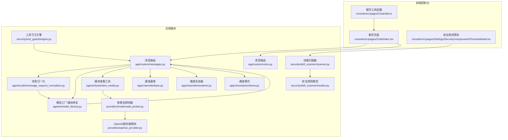
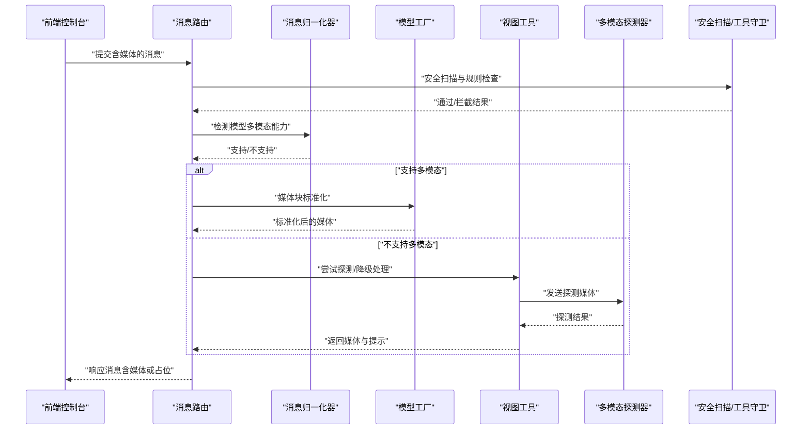
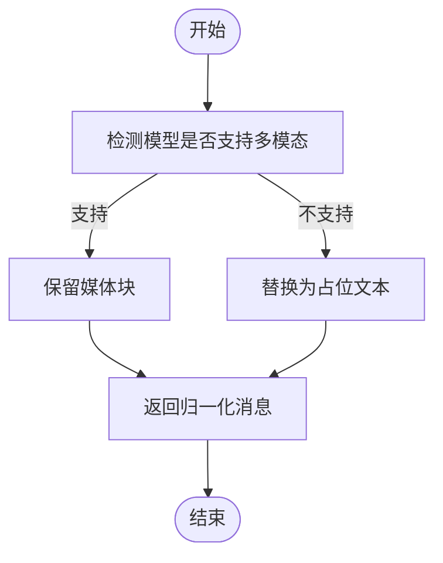
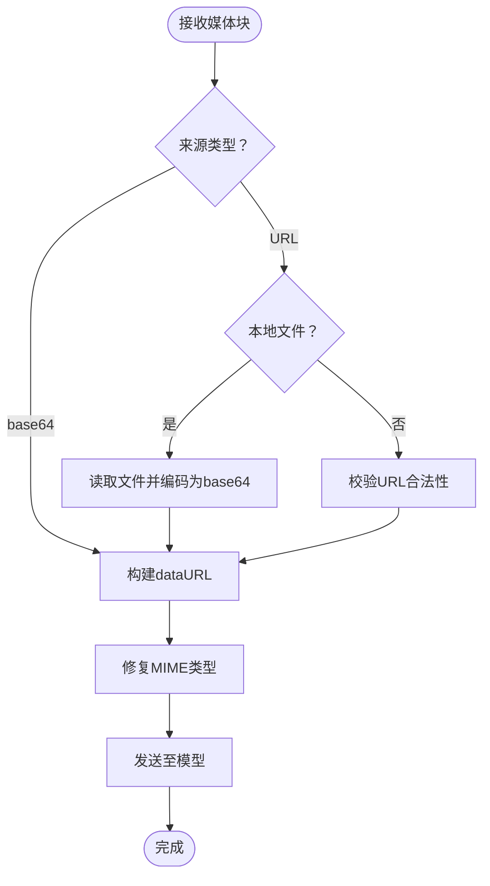
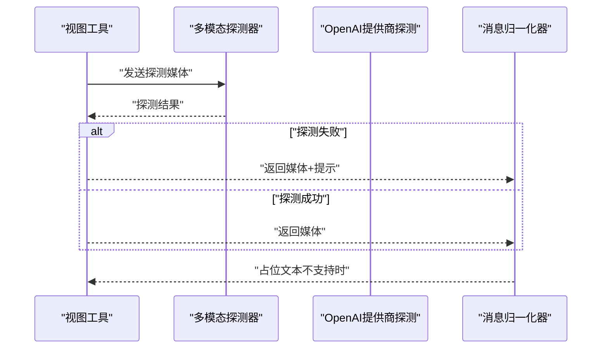
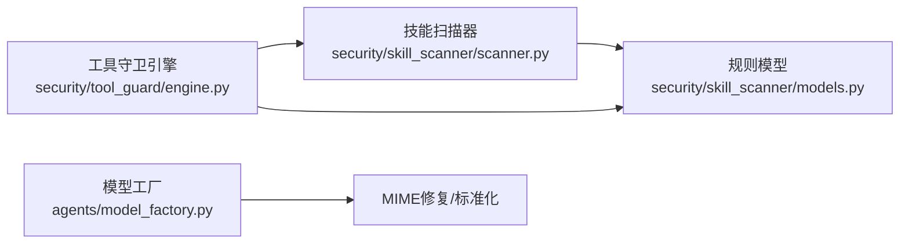
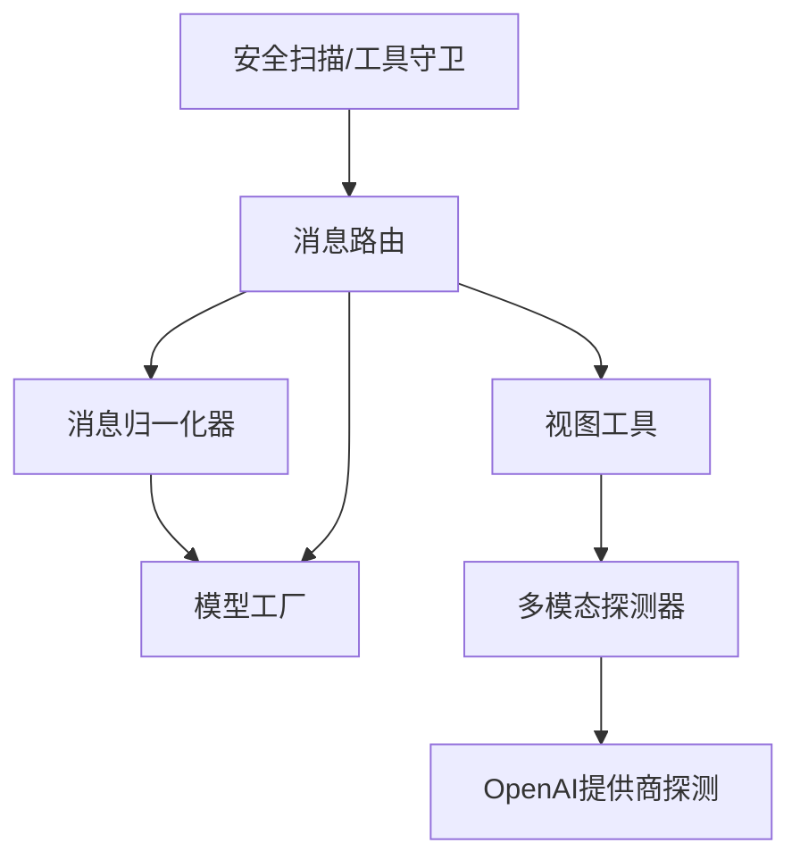

# 多模态交互

<cite>
**本文引用的文件**
- [src/qwenpaw/agents/utils/message_request_normalizer.py](file://src/qwenpaw/agents/utils/message_request_normalizer.py)
- [src/qwenpaw/agents/tools/view_media.py](file://src/qwenpaw/agents/tools/view_media.py)
- [src/qwenpaw/providers/multimodal_prober.py](file://src/qwenpaw/providers/multimodal_prober.py)
- [src/qwenpaw/providers/openai_provider.py](file://src/qwenpaw/providers/openai_provider.py)
- [src/qwenpaw/agents/model_factory.py](file://src/qwenpaw/agents/model_factory.py)
- [tests/unit/agents/test_message_request_normalizer.py](file://tests/unit/agents/test_message_request_normalizer.py)
- [src/qwenpaw/security/skill_scanner/models.py](file://src/qwenpaw/security/skill_scanner/models.py)
- [src/qwenpaw/security/skill_scanner/scanner.py](file://src/qwenpaw/security/skill_scanner/scanner.py)
- [src/qwenpaw/security/tool_guard/engine.py](file://src/qwenpaw/security/tool_guard/engine.py)
- [src/qwenpaw/security/tool_guard/guardians/__init__.py](file://src/qwenpaw/security/tool_guard/guardians/__init__.py)
- [src/qwenpaw/security/tool_guard/rules/__init__.py](file://src/qwenpaw/security/tool_guard/rules/__init__.py)
- [src/qwenpaw/app/routers/messages.py](file://src/qwenpaw/app/routers/messages.py)
- [src/qwenpaw/app/routers/voice.py](file://src/qwenpaw/app/routers/voice.py)
- [src/qwenpaw/app/channels/base.py](file://src/qwenpaw/app/channels/base.py)
- [src/qwenpaw/app/channels/renderer.py](file://src/qwenpaw/app/channels/renderer.py)
- [src/qwenpaw/app/channels/schema.py](file://src/qwenpaw/app/channels/schema.py)
- [console/src/pages/Chat/index.tsx](file://console/src/pages/Chat/index.tsx)
- [console/src/pages/Chat/utils.ts](file://console/src/pages/Chat/utils.ts)
- [console/src/pages/Settings/Security/components/PreviewModal.tsx](file://console/src/pages/Settings/Security/components/PreviewModal.tsx)
</cite>

## 目录
1. [简介](#简介)
2. [项目结构](#项目结构)
3. [核心组件](#核心组件)
4. [架构总览](#架构总览)
5. [详细组件分析](#详细组件分析)
6. [依赖关系分析](#依赖关系分析)
7. [性能考量](#性能考量)
8. [故障排查指南](#故障排查指南)
9. [结论](#结论)
10. [附录](#附录)

## 简介
本技术文档围绕多模态交互系统展开，重点阐述文本、图像、音频、视频等多媒体内容在系统中的识别、转换与传输机制；说明媒体块（Media Block）的标准化流程与不支持多模态模型的降级策略；介绍安全过滤与格式标准化过程；并提供开发指南、配置选项与最佳实践建议。文档以仓库中实际实现为依据，结合前端控制台与后端服务的协同工作方式，帮助开发者快速理解并扩展多模态能力。

## 项目结构
多模态相关能力分布在后端 Python 包与前端控制台两部分：
- 后端核心模块
  - 消息归一化与媒体块处理：agents/utils/message_request_normalizer.py、agents/model_factory.py
  - 媒体工具与视图：agents/tools/view_media.py
  - 多模态探测器：providers/multimodal_prober.py
  - 提供商适配与探测：providers/openai_provider.py
  - 安全扫描与工具守卫：security/skill_scanner/*、security/tool_guard/*
  - 路由与通道渲染：app/routers/messages.py、app/routers/voice.py、app/channels/*
- 前端控制台
  - 聊天界面与工具调用：console/src/pages/Chat/index.tsx、console/src/pages/Chat/utils.ts
  - 安全规则预览：console/src/pages/Settings/Security/components/PreviewModal.tsx

图表来源
- [src/qwenpaw/app/routers/messages.py](file://src/qwenpaw/app/routers/messages.py)
- [src/qwenpaw/app/routers/voice.py](file://src/qwenpaw/app/routers/voice.py)
- [src/qwenpaw/app/channels/base.py](file://src/qwenpaw/app/channels/base.py)
- [src/qwenpaw/app/channels/renderer.py](file://src/qwenpaw/app/channels/renderer.py)
- [src/qwenpaw/app/channels/schema.py](file://src/qwenpaw/app/channels/schema.py)
- [src/qwenpaw/agents/utils/message_request_normalizer.py](file://src/qwenpaw/agents/utils/message_request_normalizer.py)
- [src/qwenpaw/agents/model_factory.py](file://src/qwenpaw/agents/model_factory.py)
- [src/qwenpaw/agents/tools/view_media.py](file://src/qwenpaw/agents/tools/view_media.py)
- [src/qwenpaw/providers/multimodal_prober.py](file://src/qwenpaw/providers/multimodal_prober.py)
- [src/qwenpaw/providers/openai_provider.py](file://src/qwenpaw/providers/openai_provider.py)
- [src/qwenpaw/security/skill_scanner/scanner.py](file://src/qwenpaw/security/skill_scanner/scanner.py)
- [src/qwenpaw/security/skill_scanner/models.py](file://src/qwenpaw/security/skill_scanner/models.py)
- [src/qwenpaw/security/tool_guard/engine.py](file://src/qwenpaw/security/tool_guard/engine.py)
- [console/src/pages/Chat/index.tsx](file://console/src/pages/Chat/index.tsx)
- [console/src/pages/Chat/utils.ts](file://console/src/pages/Chat/utils.ts)
- [console/src/pages/Settings/Security/components/PreviewModal.tsx](file://console/src/pages/Settings/Security/components/PreviewModal.tsx)

章节来源
- [src/qwenpaw/app/routers/messages.py](file://src/qwenpaw/app/routers/messages.py)
- [src/qwenpaw/agents/utils/message_request_normalizer.py](file://src/qwenpaw/agents/utils/message_request_normalizer.py)
- [src/qwenpaw/agents/model_factory.py](file://src/qwenpaw/agents/model_factory.py)
- [src/qwenpaw/agents/tools/view_media.py](file://src/qwenpaw/agents/tools/view_media.py)
- [src/qwenpaw/providers/multimodal_prober.py](file://src/qwenpaw/providers/multimodal_prober.py)
- [src/qwenpaw/providers/openai_provider.py](file://src/qwenpaw/providers/openai_provider.py)
- [src/qwenpaw/security/skill_scanner/scanner.py](file://src/qwenpaw/security/skill_scanner/scanner.py)
- [src/qwenpaw/security/skill_scanner/models.py](file://src/qwenpaw/security/skill_scanner/models.py)
- [src/qwenpaw/security/tool_guard/engine.py](file://src/qwenpaw/security/tool_guard/engine.py)
- [console/src/pages/Chat/index.tsx](file://console/src/pages/Chat/index.tsx)
- [console/src/pages/Chat/utils.ts](file://console/src/pages/Chat/utils.ts)
- [console/src/pages/Settings/Security/components/PreviewModal.tsx](file://console/src/pages/Settings/Security/components/PreviewModal.tsx)

## 核心组件
- 消息归一化与媒体块处理
  - 归一化器负责在不同模型能力下保持消息一致性，当模型不支持多模态时，将媒体块替换为占位文本或保留原始消息不变。
  - 模型工厂负责媒体块的格式修复与标准化，如修正非标准 MIME 类型、生成 dataURL、校验视频扩展名与来源类型。
- 媒体工具与视图
  - 视图工具支持加载图片与视频到对话上下文，若模型不支持多模态，仍返回可展示的媒体块并附加提示信息。
- 多模态探测器
  - 探测器通过发送特定测试媒体（如小体积视频）并解析模型回答，判断是否具备多模态能力。
- 安全与合规
  - 技能扫描器与工具守卫对技能与工具调用进行规则匹配与拦截，保障多模态输入输出的安全性。

章节来源
- [src/qwenpaw/agents/utils/message_request_normalizer.py](file://src/qwenpaw/agents/utils/message_request_normalizer.py)
- [src/qwenpaw/agents/model_factory.py](file://src/qwenpaw/agents/model_factory.py)
- [src/qwenpaw/agents/tools/view_media.py](file://src/qwenpaw/agents/tools/view_media.py)
- [src/qwenpaw/providers/multimodal_prober.py](file://src/qwenpaw/providers/multimodal_prober.py)
- [src/qwenpaw/security/skill_scanner/scanner.py](file://src/qwenpaw/security/skill_scanner/scanner.py)
- [src/qwenpaw/security/tool_guard/engine.py](file://src/qwenpaw/security/tool_guard/engine.py)

## 架构总览
多模态交互的关键流程如下：
- 前端将包含媒体的消息提交至后端路由
- 后端通过消息归一化器判断模型是否支持多模态
- 若支持，媒体块原样传递；若不支持，媒体块被替换为占位文本
- 视图工具根据需要探测模型能力，并在不支持时返回可展示的媒体与提示
- 模型工厂对媒体块进行格式修复与标准化，确保外部接口兼容
- 安全扫描器与工具守卫在请求进入模型前进行规则检查与拦截

图表来源
- [src/qwenpaw/app/routers/messages.py](file://src/qwenpaw/app/routers/messages.py)
- [src/qwenpaw/agents/utils/message_request_normalizer.py](file://src/qwenpaw/agents/utils/message_request_normalizer.py)
- [src/qwenpaw/agents/model_factory.py](file://src/qwenpaw/agents/model_factory.py)
- [src/qwenpaw/agents/tools/view_media.py](file://src/qwenpaw/agents/tools/view_media.py)
- [src/qwenpaw/providers/multimodal_prober.py](file://src/qwenpaw/providers/multimodal_prober.py)
- [src/qwenpaw/security/skill_scanner/scanner.py](file://src/qwenpaw/security/skill_scanner/scanner.py)
- [src/qwenpaw/security/tool_guard/engine.py](file://src/qwenpaw/security/tool_guard/engine.py)

## 详细组件分析

### 消息归一化与媒体块处理
- 功能要点
  - 在模型支持多模态时保留媒体块；在不支持时将媒体块替换为占位文本，同时保证原始消息不变。
  - 支持多条消息的批量归一化，逐条处理媒体块。
- 关键行为
  - 单条消息测试：支持多模态时媒体块保留；不支持时替换为占位文本。
  - 多消息测试：第一条消息中的图片被移除，第二条消息保持不变，第三条视频被替换为占位文本。
- 实现参考
  - 测试覆盖了支持与不支持两种场景，验证原始消息未被修改，且输出符合预期。

图表来源
- [tests/unit/agents/test_message_request_normalizer.py](file://tests/unit/agents/test_message_request_normalizer.py)
- [src/qwenpaw/agents/utils/message_request_normalizer.py](file://src/qwenpaw/agents/utils/message_request_normalizer.py)

章节来源
- [tests/unit/agents/test_message_request_normalizer.py](file://tests/unit/agents/test_message_request_normalizer.py)
- [src/qwenpaw/agents/utils/message_request_normalizer.py](file://src/qwenpaw/agents/utils/message_request_normalizer.py)

### 媒体块识别、转换与传输
- 图像与视频块
  - 支持 base64 与 URL 两种来源；本地文件会读取并编码为 dataURL；URL 需为合法的网络地址或本地文件路径。
  - 对非标准 MIME 类型进行修复，确保外部接口兼容。
- 音频块
  - 通过统一的媒体列表规范化流程进行处理，确保音频块在消息中正确呈现。
- 传输流程
  - 前端将媒体消息提交至后端路由，后端经归一化与模型工厂处理后返回给前端渲染。

图表来源
- [src/qwenpaw/agents/model_factory.py](file://src/qwenpaw/agents/model_factory.py)

章节来源
- [src/qwenpaw/agents/model_factory.py](file://src/qwenpaw/agents/model_factory.py)

### 不支持多模态的降级处理策略
- 视图工具降级
  - 当模型不支持多模态时，视图工具仍返回可展示的媒体块，并附加提示信息，使用户与前端仍能看到媒体。
- 探测与提示
  - 多模态探测器通过发送测试视频并解析回答，判断模型能力；OpenAI 提供商探测基于“单一主导色”关键词判定。
- 归一化降级
  - 归一化器在不支持多模态时，将媒体块替换为占位文本，避免因媒体导致的错误或截断。

图表来源
- [src/qwenpaw/agents/tools/view_media.py](file://src/qwenpaw/agents/tools/view_media.py)
- [src/qwenpaw/providers/multimodal_prober.py](file://src/qwenpaw/providers/multimodal_prober.py)
- [src/qwenpaw/providers/openai_provider.py](file://src/qwenpaw/providers/openai_provider.py)
- [src/qwenpaw/agents/utils/message_request_normalizer.py](file://src/qwenpaw/agents/utils/message_request_normalizer.py)

章节来源
- [src/qwenpaw/agents/tools/view_media.py](file://src/qwenpaw/agents/tools/view_media.py)
- [src/qwenpaw/providers/multimodal_prober.py](file://src/qwenpaw/providers/multimodal_prober.py)
- [src/qwenpaw/providers/openai_provider.py](file://src/qwenpaw/providers/openai_provider.py)
- [src/qwenpaw/agents/utils/message_request_normalizer.py](file://src/qwenpaw/agents/utils/message_request_normalizer.py)

### 媒体内容的安全过滤与格式标准化
- 安全扫描
  - 技能扫描器按文件类型与威胁类别加载规则，对技能文件进行正则匹配与排除模式处理，确保多模态输入不会触发安全风险。
- 工具守卫
  - 工具守卫引擎在工具调用前执行规则评估，必要时拦截或要求审批，保障系统安全。
- 格式标准化
  - 模型工厂修复非标准 MIME 类型，统一媒体块的 dataURL 格式，提升外部接口兼容性。

图表来源
- [src/qwenpaw/security/skill_scanner/scanner.py](file://src/qwenpaw/security/skill_scanner/scanner.py)
- [src/qwenpaw/security/skill_scanner/models.py](file://src/qwenpaw/security/skill_scanner/models.py)
- [src/qwenpaw/security/tool_guard/engine.py](file://src/qwenpaw/security/tool_guard/engine.py)
- [src/qwenpaw/agents/model_factory.py](file://src/qwenpaw/agents/model_factory.py)

章节来源
- [src/qwenpaw/security/skill_scanner/scanner.py](file://src/qwenpaw/security/skill_scanner/scanner.py)
- [src/qwenpaw/security/skill_scanner/models.py](file://src/qwenpaw/security/skill_scanner/models.py)
- [src/qwenpaw/security/tool_guard/engine.py](file://src/qwenpaw/security/tool_guard/engine.py)
- [src/qwenpaw/agents/model_factory.py](file://src/qwenpaw/agents/model_factory.py)

### 开发指南：内容类型定义、格式转换与性能优化
- 内容类型定义
  - 图像：支持 base64 与 URL 来源；本地文件需为受支持的视频扩展名。
  - 视频：支持 base64 与 URL 来源；本地文件需为受支持的视频扩展名；URL 必须为合法网络地址或本地文件路径。
  - 音频：通过统一媒体列表规范化流程处理。
- 格式转换
  - 将本地文件读取并编码为 dataURL；修复非标准 MIME 类型；校验来源类型与扩展名。
- 性能优化
  - 使用探测器在首次请求时判断模型能力，减少不必要的媒体传输与解析。
  - 对大文件采用流式处理或分块传输，避免阻塞主线程。
  - 缓存探测结果与常见媒体块，降低重复计算成本。

章节来源
- [src/qwenpaw/agents/model_factory.py](file://src/qwenpaw/agents/model_factory.py)
- [src/qwenpaw/providers/multimodal_prober.py](file://src/qwenpaw/providers/multimodal_prober.py)

### 配置选项与最佳实践
- 配置项
  - 多模态探测开关与缓存策略
  - 媒体块来源类型与扩展名白名单
  - MIME 类型修复映射表
  - 安全规则类别与文件类型映射
- 最佳实践
  - 在消息进入模型前统一进行归一化与安全扫描
  - 对不支持多模态的模型，优先返回可展示媒体与提示信息
  - 对高频使用的媒体块进行缓存与复用
  - 严格限制媒体大小与来源，防止滥用与资源耗尽

章节来源
- [src/qwenpaw/agents/utils/message_request_normalizer.py](file://src/qwenpaw/agents/utils/message_request_normalizer.py)
- [src/qwenpaw/agents/model_factory.py](file://src/qwenpaw/agents/model_factory.py)
- [src/qwenpaw/security/skill_scanner/models.py](file://src/qwenpaw/security/skill_scanner/models.py)
- [src/qwenpaw/security/tool_guard/engine.py](file://src/qwenpaw/security/tool_guard/engine.py)

## 依赖关系分析
- 组件耦合
  - 消息归一化器与模型工厂紧密协作，前者决定是否保留媒体，后者负责格式修复。
  - 视图工具依赖探测器与归一化器，形成“探测—降级—传输”的闭环。
  - 安全扫描与工具守卫贯穿请求生命周期，前置拦截潜在风险。
- 外部依赖
  - 提供商探测依赖于外部模型的响应语义（如颜色关键词），需谨慎设计探测样本与判定逻辑。
- 循环依赖
  - 当前模块间无明显循环依赖，职责清晰、边界明确。

图表来源
- [src/qwenpaw/agents/utils/message_request_normalizer.py](file://src/qwenpaw/agents/utils/message_request_normalizer.py)
- [src/qwenpaw/agents/model_factory.py](file://src/qwenpaw/agents/model_factory.py)
- [src/qwenpaw/agents/tools/view_media.py](file://src/qwenpaw/agents/tools/view_media.py)
- [src/qwenpaw/providers/multimodal_prober.py](file://src/qwenpaw/providers/multimodal_prober.py)
- [src/qwenpaw/providers/openai_provider.py](file://src/qwenpaw/providers/openai_provider.py)
- [src/qwenpaw/app/routers/messages.py](file://src/qwenpaw/app/routers/messages.py)
- [src/qwenpaw/security/skill_scanner/scanner.py](file://src/qwenpaw/security/skill_scanner/scanner.py)
- [src/qwenpaw/security/tool_guard/engine.py](file://src/qwenpaw/security/tool_guard/engine.py)

章节来源
- [src/qwenpaw/agents/utils/message_request_normalizer.py](file://src/qwenpaw/agents/utils/message_request_normalizer.py)
- [src/qwenpaw/agents/model_factory.py](file://src/qwenpaw/agents/model_factory.py)
- [src/qwenpaw/agents/tools/view_media.py](file://src/qwenpaw/agents/tools/view_media.py)
- [src/qwenpaw/providers/multimodal_prober.py](file://src/qwenpaw/providers/multimodal_prober.py)
- [src/qwenpaw/providers/openai_provider.py](file://src/qwenpaw/providers/openai_provider.py)
- [src/qwenpaw/app/routers/messages.py](file://src/qwenpaw/app/routers/messages.py)
- [src/qwenpaw/security/skill_scanner/scanner.py](file://src/qwenpaw/security/skill_scanner/scanner.py)
- [src/qwenpaw/security/tool_guard/engine.py](file://src/qwenpaw/security/tool_guard/engine.py)

## 性能考量
- 探测成本控制
  - 仅在首次或缓存失效时进行多模态探测，避免每次请求都发送探测媒体。
- 媒体大小与带宽
  - 对大尺寸媒体进行压缩或裁剪，减少传输时间与内存占用。
- 并发与队列
  - 使用统一队列管理媒体任务，避免并发冲突与资源争用。
- 缓存策略
  - 对探测结果、常见媒体块与修复后的 MIME 进行缓存，显著降低重复处理开销。

## 故障排查指南
- 常见问题
  - 媒体无法显示：检查来源类型与扩展名是否受支持，确认 MIME 是否已被修复。
  - 多模态能力误判：核查探测样本与判定逻辑，确保探测视频与关键词设置合理。
  - 安全拦截频繁：调整安全规则类别与文件类型映射，减少误报。
- 定位方法
  - 查看消息归一化日志，确认媒体是否被替换为占位文本。
  - 检查探测器返回值与提供商探测判定结果。
  - 审核安全扫描与工具守卫的拦截记录与规则匹配情况。

章节来源
- [src/qwenpaw/agents/utils/message_request_normalizer.py](file://src/qwenpaw/agents/utils/message_request_normalizer.py)
- [src/qwenpaw/providers/multimodal_prober.py](file://src/qwenpaw/providers/multimodal_prober.py)
- [src/qwenpaw/providers/openai_provider.py](file://src/qwenpaw/providers/openai_provider.py)
- [src/qwenpaw/security/skill_scanner/scanner.py](file://src/qwenpaw/security/skill_scanner/scanner.py)
- [src/qwenpaw/security/tool_guard/engine.py](file://src/qwenpaw/security/tool_guard/engine.py)

## 结论
本系统通过消息归一化、媒体块标准化、多模态探测与安全过滤等机制，实现了对文本、图像、音频、视频等多媒体内容的稳健支持。在不支持多模态的模型上，系统采用降级策略确保用户体验与安全性。建议在生产环境中启用探测缓存、严格控制媒体来源与大小，并完善安全规则与工具守卫策略，以获得更稳定与高性能的多模态交互体验。

## 附录
- 前端集成要点
  - 控制台聊天页面负责组装含媒体的消息并通过路由提交至后端；工具函数提供媒体上传与预览能力；安全规则预览用于调试与审核。
- 后端路由与通道
  - 消息路由与语音路由分别处理文本与音视频输入；通道基类与渲染器负责消息的跨渠道展示与交互。

章节来源
- [console/src/pages/Chat/index.tsx](file://console/src/pages/Chat/index.tsx)
- [console/src/pages/Chat/utils.ts](file://console/src/pages/Chat/utils.ts)
- [console/src/pages/Settings/Security/components/PreviewModal.tsx](file://console/src/pages/Settings/Security/components/PreviewModal.tsx)
- [src/qwenpaw/app/routers/messages.py](file://src/qwenpaw/app/routers/messages.py)
- [src/qwenpaw/app/routers/voice.py](file://src/qwenpaw/app/routers/voice.py)
- [src/qwenpaw/app/channels/base.py](file://src/qwenpaw/app/channels/base.py)
- [src/qwenpaw/app/channels/renderer.py](file://src/qwenpaw/app/channels/renderer.py)
- [src/qwenpaw/app/channels/schema.py](file://src/qwenpaw/app/channels/schema.py)