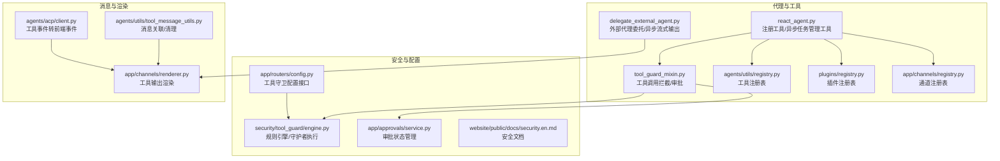
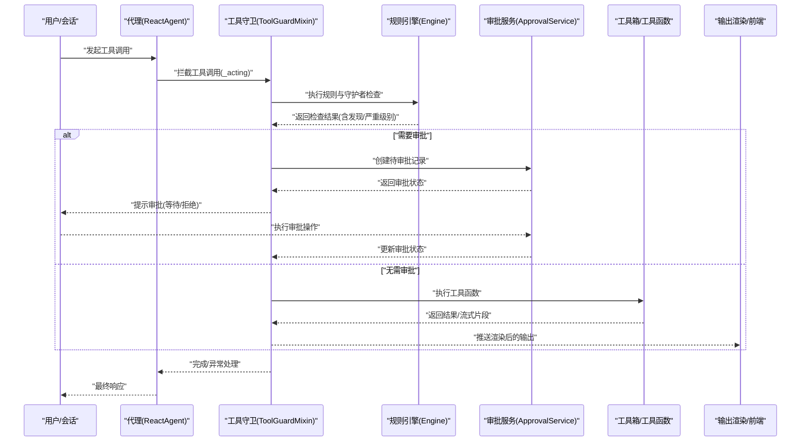
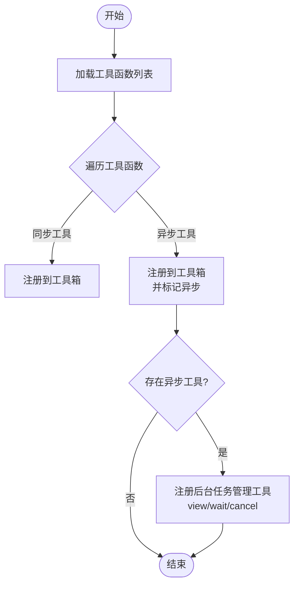
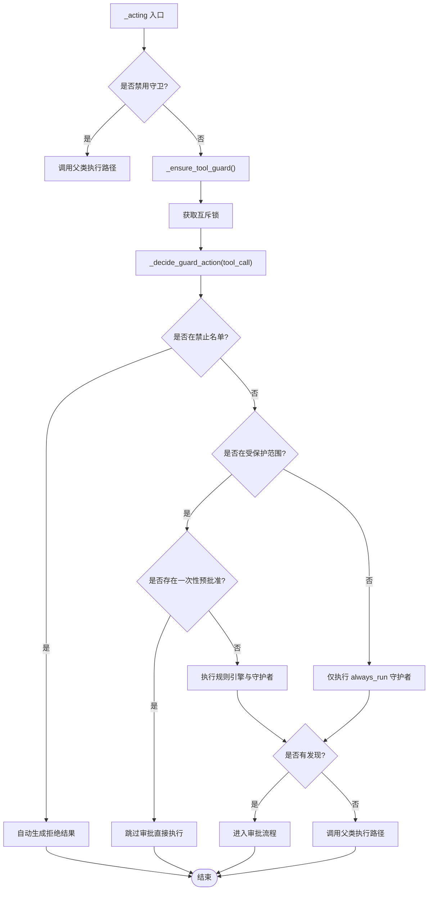
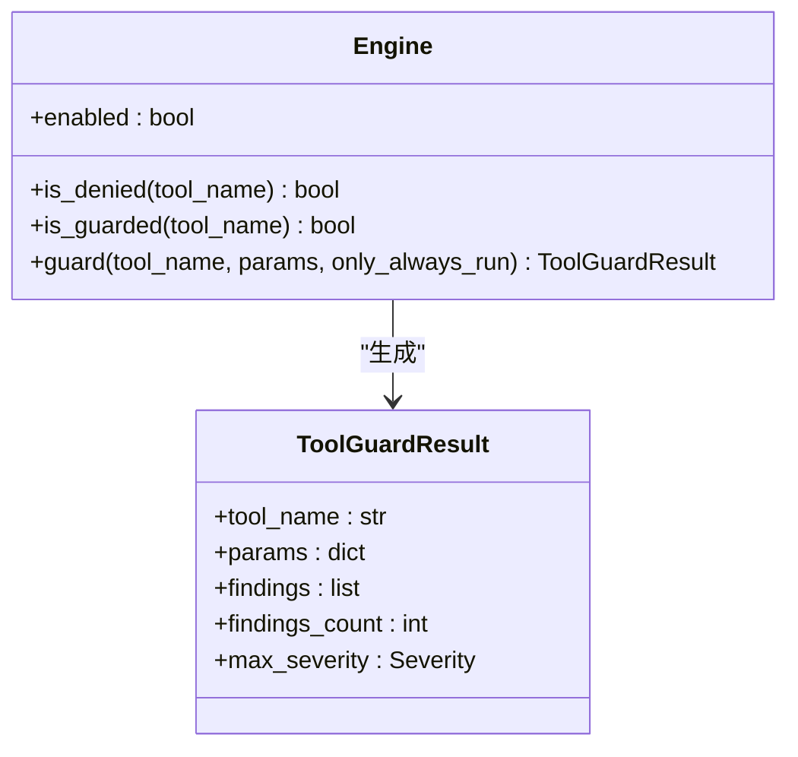
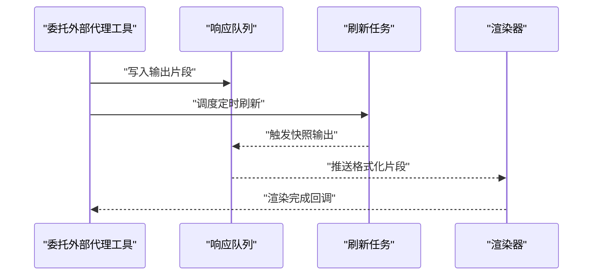
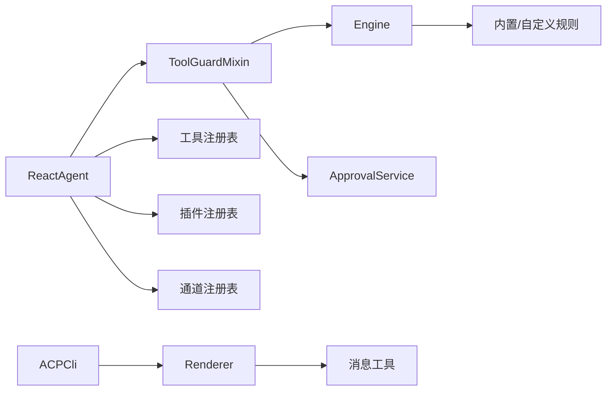

# 工具调用机制

<cite>
**本文引用的文件**
- [src/qwenpaw/agents/tool_guard_mixin.py](file://src/qwenpaw/agents/tool_guard_mixin.py)
- [src/qwenpaw/security/tool_guard/engine.py](file://src/qwenpaw/security/tool_guard/engine.py)
- [src/qwenpaw/app/routers/config.py](file://src/qwenpaw/app/routers/config.py)
- [src/qwenpaw/app/approvals/service.py](file://src/qwenpaw/app/approvals/service.py)
- [src/qwenpaw/agents/react_agent.py](file://src/qwenpaw/agents/react_agent.py)
- [src/qwenpaw/agents/tools/delegate_external_agent.py](file://src/qwenpaw/agents/tools/delegate_external_agent.py)
- [src/qwenpaw/agents/utils/tool_message_utils.py](file://src/qwenpaw/agents/utils/tool_message_utils.py)
- [src/qwenpaw/agents/acp/client.py](file://src/qwenpaw/agents/acp/client.py)
- [src/qwenpaw/app/channels/renderer.py](file://src/qwenpaw/app/channels/renderer.py)
- [src/qwenpaw/agents/utils/registry.py](file://src/qwenpaw/agents/utils/registry.py)
- [src/qwenpaw/plugins/registry.py](file://src/qwenpaw/plugins/registry.py)
- [src/qwenpaw/app/channels/registry.py](file://src/qwenpaw/app/channels/registry.py)
- [website/public/docs/security.en.md](file://website/public/docs/security.en.md)
</cite>

## 目录
1. [引言](#引言)
2. [项目结构](#项目结构)
3. [核心组件](#核心组件)
4. [架构总览](#架构总览)
5. [详细组件分析](#详细组件分析)
6. [依赖关系分析](#依赖关系分析)
7. [性能考虑](#性能考虑)
8. [故障排查指南](#故障排查指南)
9. [结论](#结论)
10. [附录](#附录)

## 引言
本文件系统性阐述该代码库中的“工具调用机制”，覆盖从工具注册、参数验证、执行调度到结果处理的完整流程；详解工具守卫（Tool Guard）的安全策略与审批流程；解释异步工具执行与并发控制；并提供工具开发指南、错误处理与日志记录建议，以及性能优化、资源管理与故障恢复的技术要点。目标是帮助开发者在理解现有实现的基础上，高效扩展与维护工具链。

## 项目结构
围绕工具调用机制的关键目录与文件如下：
- 代理层与工具注册：react_agent.py 负责将工具函数注册到工具箱，并根据工具是否支持异步执行自动注册后台任务管理工具。
- 安全与守卫：tool_guard_mixin.py 提供工具调用前拦截与决策；engine.py 实现规则引擎与守护者执行；config.py 提供运行时配置接口；approvals/service.py 管理审批状态与去重。
- 工具实现示例：delegate_external_agent.py 展示了异步流式输出与任务调度模式。
- 消息与渲染：tool_message_utils.py 处理工具消息关联与清理；renderer.py 将工具输出渲染为用户可读内容；ACPCli 客户端将工具事件转换为前端事件。
- 注册中心：agents/utils/registry.py、plugins/registry.py、app/channels/registry.py 统一管理各类注册表。

**图表来源**
- [src/qwenpaw/agents/react_agent.py](file://src/qwenpaw/agents/react_agent.py)
- [src/qwenpaw/agents/tool_guard_mixin.py](file://src/qwenpaw/agents/tool_guard_mixin.py)
- [src/qwenpaw/security/tool_guard/engine.py](file://src/qwenpaw/security/tool_guard/engine.py)
- [src/qwenpaw/app/routers/config.py](file://src/qwenpaw/app/routers/config.py)
- [src/qwenpaw/app/approvals/service.py](file://src/qwenpaw/app/approvals/service.py)
- [src/qwenpaw/agents/tools/delegate_external_agent.py](file://src/qwenpaw/agents/tools/delegate_external_agent.py)
- [src/qwenpaw/agents/utils/tool_message_utils.py](file://src/qwenpaw/agents/utils/tool_message_utils.py)
- [src/qwenpaw/app/channels/renderer.py](file://src/qwenpaw/app/channels/renderer.py)
- [src/qwenpaw/agents/acp/client.py](file://src/qwenpaw/agents/acp/client.py)
- [src/qwenpaw/agents/utils/registry.py](file://src/qwenpaw/agents/utils/registry.py)
- [src/qwenpaw/plugins/registry.py](file://src/qwenpaw/plugins/registry.py)
- [src/qwenpaw/app/channels/registry.py](file://src/qwenpaw/app/channels/registry.py)
- [website/public/docs/security.en.md](file://website/public/docs/security.en.md)

**章节来源**
- [src/qwenpaw/agents/react_agent.py](file://src/qwenpaw/agents/react_agent.py)
- [src/qwenpaw/agents/tool_guard_mixin.py](file://src/qwenpaw/agents/tool_guard_mixin.py)
- [src/qwenpaw/security/tool_guard/engine.py](file://src/qwenpaw/security/tool_guard/engine.py)
- [src/qwenpaw/app/routers/config.py](file://src/qwenpaw/app/routers/config.py)
- [src/qwenpaw/app/approvals/service.py](file://src/qwenpaw/app/approvals/service.py)
- [src/qwenpaw/agents/tools/delegate_external_agent.py](file://src/qwenpaw/agents/tools/delegate_external_agent.py)
- [src/qwenpaw/agents/utils/tool_message_utils.py](file://src/qwenpaw/agents/utils/tool_message_utils.py)
- [src/qwenpaw/app/channels/renderer.py](file://src/qwenpaw/app/channels/renderer.py)
- [src/qwenpaw/agents/acp/client.py](file://src/qwenpaw/agents/acp/client.py)
- [src/qwenpaw/agents/utils/registry.py](file://src/qwenpaw/agents/utils/registry.py)
- [src/qwenpaw/plugins/registry.py](file://src/qwenpaw/plugins/registry.py)
- [src/qwenpaw/app/channels/registry.py](file://src/qwenpaw/app/channels/registry.py)
- [website/public/docs/security.en.md](file://website/public/docs/security.en.md)

## 核心组件
- 工具注册与异步管理：代理在启动或加载时将工具函数注册到工具箱，并根据是否存在异步工具自动注册后台任务管理工具（查看、等待、取消），以支持异步执行与并发控制。
- 工具守卫拦截：在实际执行前对工具调用进行拦截，依据规则引擎与守护者集合进行参数校验与风险评估，必要时进入审批流程。
- 规则引擎与守护者：规则引擎负责判定工具是否受保护、是否被禁止、是否需要审批；守护者按严重级别与规则匹配执行，汇总发现并决定后续动作。
- 审批服务：维护会话级审批状态，避免重复审批与参数漂移，确保高危工具在获得明确授权后才执行。
- 异步执行与流式输出：通过队列与定时刷新机制，将长时间运行的工具输出分片推送，提升交互体验。
- 消息与渲染：对工具消息进行关联与清理，将工具输出格式化为用户可读内容，并通过 ACP 客户端映射为前端事件。

**章节来源**
- [src/qwenpaw/agents/react_agent.py](file://src/qwenpaw/agents/react_agent.py)
- [src/qwenpaw/agents/tool_guard_mixin.py](file://src/qwenpaw/agents/tool_guard_mixin.py)
- [src/qwenpaw/security/tool_guard/engine.py](file://src/qwenpaw/security/tool_guard/engine.py)
- [src/qwenpaw/app/approvals/service.py](file://src/qwenpaw/app/approvals/service.py)
- [src/qwenpaw/agents/tools/delegate_external_agent.py](file://src/qwenpaw/agents/tools/delegate_external_agent.py)
- [src/qwenpaw/agents/utils/tool_message_utils.py](file://src/qwenpaw/agents/utils/tool_message_utils.py)
- [src/qwenpaw/app/channels/renderer.py](file://src/qwenpaw/app/channels/renderer.py)
- [src/qwenpaw/agents/acp/client.py](file://src/qwenpaw/agents/acp/client.py)

## 架构总览
下图展示了工具调用从“请求到达”到“结果返回”的端到端流程，包括安全拦截、审批与异步执行等关键节点。

**图表来源**
- [src/qwenpaw/agents/react_agent.py](file://src/qwenpaw/agents/react_agent.py)
- [src/qwenpaw/agents/tool_guard_mixin.py](file://src/qwenpaw/agents/tool_guard_mixin.py)
- [src/qwenpaw/security/tool_guard/engine.py](file://src/qwenpaw/security/tool_guard/engine.py)
- [src/qwenpaw/app/approvals/service.py](file://src/qwenpaw/app/approvals/service.py)
- [src/qwenpaw/app/channels/renderer.py](file://src/qwenpaw/app/channels/renderer.py)

## 详细组件分析

### 工具注册与异步任务管理
- 注册流程：代理在初始化时遍历工具函数字典，逐个注册到工具箱；同时检测是否存在启用且标记为异步的工具，若存在则自动注册后台任务管理工具（查看、等待、取消），以便在异步场景中进行并发控制与生命周期管理。
- 并发控制：通过“后台任务管理工具”的存在，系统可以对异步工具进行统一调度与并发限制，避免资源争用与过载。

**图表来源**
- [src/qwenpaw/agents/react_agent.py](file://src/qwenpaw/agents/react_agent.py)

**章节来源**
- [src/qwenpaw/agents/react_agent.py](file://src/qwenpaw/agents/react_agent.py)

### 工具守卫拦截与审批流程
- 拦截入口：代理在执行工具调用前，先经过工具守卫的拦截逻辑。若上下文禁用守卫，则直接放行；否则进入决策阶段。
- 决策阶段：在互斥锁保护下，判断工具是否被禁止、是否在受保护范围、是否存在一次性预批准；随后执行规则引擎检查，汇总守护者发现并决定是否需要审批。
- 审批服务：当需要审批时，创建待审批记录并记录涉及的守护者；审批完成后，根据状态决定继续执行或终止。
- 执行阶段：若无需审批或已获批准，则调用父类执行路径；若处于强制重放模式，记录重放信息以便后续审计。

**图表来源**
- [src/qwenpaw/agents/tool_guard_mixin.py](file://src/qwenpaw/agents/tool_guard_mixin.py)
- [src/qwenpaw/security/tool_guard/engine.py](file://src/qwenpaw/security/tool_guard/engine.py)
- [src/qwenpaw/app/approvals/service.py](file://src/qwenpaw/app/approvals/service.py)

**章节来源**
- [src/qwenpaw/agents/tool_guard_mixin.py](file://src/qwenpaw/agents/tool_guard_mixin.py)
- [src/qwenpaw/security/tool_guard/engine.py](file://src/qwenpaw/security/tool_guard/engine.py)
- [src/qwenpaw/app/approvals/service.py](file://src/qwenpaw/app/approvals/service.py)

### 规则引擎与守护者
- 规则引擎核心职责：
  - 判定工具是否被禁止、是否在受保护范围；
  - 在给定工具名与参数的情况下，执行所有适用的守护者，生成检查结果；
  - 记录耗时并返回包含发现、严重级别与守护者集合的结果对象。
- 守护者执行策略：
  - 对于受保护工具，执行全部守护者；
  - 对于非受保护工具，仅执行标记为 always_run 的守护者（如敏感路径检查）；
  - 结果汇总后交由工具守卫决策是否需要审批。

**图表来源**
- [src/qwenpaw/security/tool_guard/engine.py](file://src/qwenpaw/security/tool_guard/engine.py)

**章节来源**
- [src/qwenpaw/security/tool_guard/engine.py](file://src/qwenpaw/security/tool_guard/engine.py)

### 异步工具执行与流式输出
- 流式输出机制：通过队列与定时刷新，将工具产生的片段分批推送，避免一次性输出导致的延迟与内存压力。
- 任务管理：结合后台任务管理工具，支持查看、等待与取消异步任务，便于并发控制与资源回收。
- 输出渲染：将工具输出格式化为用户可读文本块，必要时附带头部与摘要信息，提升可读性与可观测性。

**图表来源**
- [src/qwenpaw/agents/tools/delegate_external_agent.py](file://src/qwenpaw/agents/tools/delegate_external_agent.py)
- [src/qwenpaw/app/channels/renderer.py](file://src/qwenpaw/app/channels/renderer.py)

**章节来源**
- [src/qwenpaw/agents/tools/delegate_external_agent.py](file://src/qwenpaw/agents/tools/delegate_external_agent.py)
- [src/qwenpaw/app/channels/renderer.py](file://src/qwenpaw/app/channels/renderer.py)

### 工具开发指南
- 接口规范：
  - 工具函数需符合统一签名约定，参数为键值对形式，返回值可为同步结果或异步流式输出。
  - 若工具为长耗时或可能阻塞，应声明为异步执行，以便系统为其注册后台任务管理工具。
- 参数验证：
  - 在工具内部进行输入合法性与边界检查；对于高危工具（如系统命令、文件操作），建议配合工具守卫规则进行二次校验。
- 错误处理：
  - 工具应捕获并记录异常，返回结构化的错误信息；对于可恢复错误，提供重试策略或降级方案。
- 日志记录：
  - 使用统一的日志模块记录关键事件与异常；确保日志包含工具名、参数摘要、执行时间与结果摘要。
- 并发与资源：
  - 避免共享可变状态；如需共享，使用互斥锁或队列；合理设置超时与最大并发数。
- 可观测性：
  - 提供进度事件与摘要输出，便于渲染器展示；必要时暴露状态查询接口供任务管理工具使用。

**章节来源**
- [src/qwenpaw/agents/react_agent.py](file://src/qwenpaw/agents/react_agent.py)
- [src/qwenpaw/agents/tools/delegate_external_agent.py](file://src/qwenpaw/agents/tools/delegate_external_agent.py)
- [src/qwenpaw/app/channels/renderer.py](file://src/qwenpaw/app/channels/renderer.py)

## 依赖关系分析
- 组件耦合：
  - 代理与工具守卫之间通过拦截与决策接口耦合，守卫依赖规则引擎与审批服务，形成清晰的职责边界。
  - 工具与工具箱之间通过注册表解耦，支持动态加载与热替换。
- 外部依赖：
  - 渲染器依赖通道与消息工具，将工具输出转化为用户界面内容。
  - ACP 客户端将工具事件映射为前端事件，增强交互体验。
- 配置与规则：
  - 运行时可通过配置接口调整工具守卫开关、受保护工具集与禁止工具集；规则来源于内置 YAML 与自定义规则目录。

**图表来源**
- [src/qwenpaw/agents/react_agent.py](file://src/qwenpaw/agents/react_agent.py)
- [src/qwenpaw/agents/tool_guard_mixin.py](file://src/qwenpaw/agents/tool_guard_mixin.py)
- [src/qwenpaw/security/tool_guard/engine.py](file://src/qwenpaw/security/tool_guard/engine.py)
- [src/qwenpaw/app/approvals/service.py](file://src/qwenpaw/app/approvals/service.py)
- [src/qwenpaw/agents/utils/registry.py](file://src/qwenpaw/agents/utils/registry.py)
- [src/qwenpaw/plugins/registry.py](file://src/qwenpaw/plugins/registry.py)
- [src/qwenpaw/app/channels/registry.py](file://src/qwenpaw/app/channels/registry.py)
- [src/qwenpaw/agents/utils/tool_message_utils.py](file://src/qwenpaw/agents/utils/tool_message_utils.py)
- [src/qwenpaw/app/channels/renderer.py](file://src/qwenpaw/app/channels/renderer.py)
- [src/qwenpaw/agents/acp/client.py](file://src/qwenpaw/agents/acp/client.py)

**章节来源**
- [src/qwenpaw/agents/react_agent.py](file://src/qwenpaw/agents/react_agent.py)
- [src/qwenpaw/agents/tool_guard_mixin.py](file://src/qwenpaw/agents/tool_guard_mixin.py)
- [src/qwenpaw/security/tool_guard/engine.py](file://src/qwenpaw/security/tool_guard/engine.py)
- [src/qwenpaw/app/approvals/service.py](file://src/qwenpaw/app/approvals/service.py)
- [src/qwenpaw/agents/utils/registry.py](file://src/qwenpaw/agents/utils/registry.py)
- [src/qwenpaw/plugins/registry.py](file://src/qwenpaw/plugins/registry.py)
- [src/qwenpaw/app/channels/registry.py](file://src/qwenpaw/app/channels/registry.py)
- [src/qwenpaw/agents/utils/tool_message_utils.py](file://src/qwenpaw/agents/utils/tool_message_utils.py)
- [src/qwenpaw/app/channels/renderer.py](file://src/qwenpaw/app/channels/renderer.py)
- [src/qwenpaw/agents/acp/client.py](file://src/qwenpaw/agents/acp/client.py)

## 性能考虑
- 并发与锁粒度：
  - 守卫决策在互斥锁内执行，确保状态一致性；但实际工具执行在锁外进行，以实现真正的并行执行，降低串行瓶颈。
- 异步与流式：
  - 采用队列与定时刷新机制推送输出，减少一次性大块输出带来的延迟与内存峰值。
- 资源管理：
  - 后台任务管理工具提供查看、等待与取消能力，便于在高负载时进行限流与回收。
- 规则与守护者：
  - 优先使用 always_run 守护者快速过滤明显高危场景；对受保护工具执行全面检查，平衡安全性与性能。

[本节为通用指导，不直接分析具体文件]

## 故障排查指南
- 守卫拦截异常：
  - 若工具守卫在检查过程中抛出异常，系统会记录警告并继续执行，避免影响主流程；建议检查规则配置与守护者实现。
- 审批参数不匹配：
  - 审批服务会对参数进行严格比对，若不一致将拒绝旧审批并记录警告；请确认工具调用参数与审批时一致。
- 异步输出丢失：
  - 若出现输出片段缺失，检查刷新间隔与队列容量；确保在工具结束时触发最终快照输出。
- 渲染异常：
  - 若工具输出未正确渲染，检查消息工具对工具消息的提取与清理逻辑，以及渲染器的格式化策略。

**章节来源**
- [src/qwenpaw/agents/tool_guard_mixin.py](file://src/qwenpaw/agents/tool_guard_mixin.py)
- [src/qwenpaw/app/approvals/service.py](file://src/qwenpaw/app/approvals/service.py)
- [src/qwenpaw/agents/utils/tool_message_utils.py](file://src/qwenpaw/agents/utils/tool_message_utils.py)
- [src/qwenpaw/app/channels/renderer.py](file://src/qwenpaw/app/channels/renderer.py)

## 结论
该工具调用机制通过“注册—拦截—审批—执行—渲染”的闭环设计，实现了高安全性与高可用性的工具链。工具守卫以规则引擎与守护者为核心，结合审批服务与异步执行能力，既保障了安全边界，又兼顾了性能与用户体验。开发者可据此扩展新工具、完善规则与优化并发策略，持续提升系统的稳定性与可维护性。

[本节为总结性内容，不直接分析具体文件]

## 附录
- 工具守卫配置参考：可通过配置接口动态启用/禁用守卫、设置受保护工具集与禁止工具集，并重新加载规则。
- 安全文档参考：内置规则覆盖多种高危模式，建议结合业务场景定制规则与严重级别。

**章节来源**
- [src/qwenpaw/app/routers/config.py](file://src/qwenpaw/app/routers/config.py)
- [website/public/docs/security.en.md](file://website/public/docs/security.en.md)