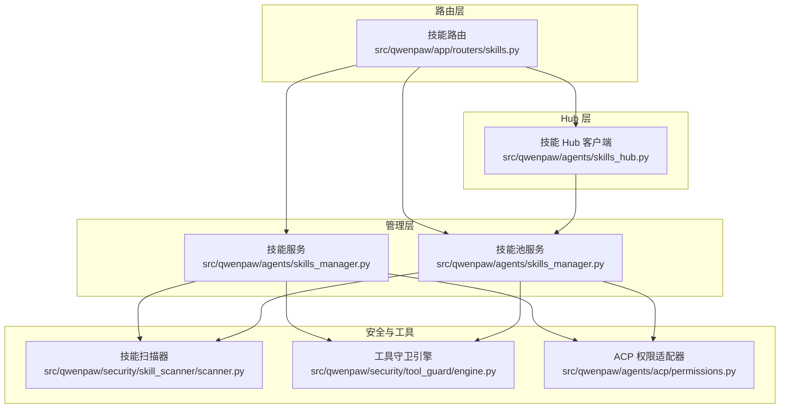
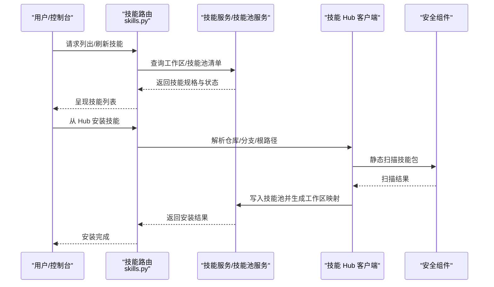
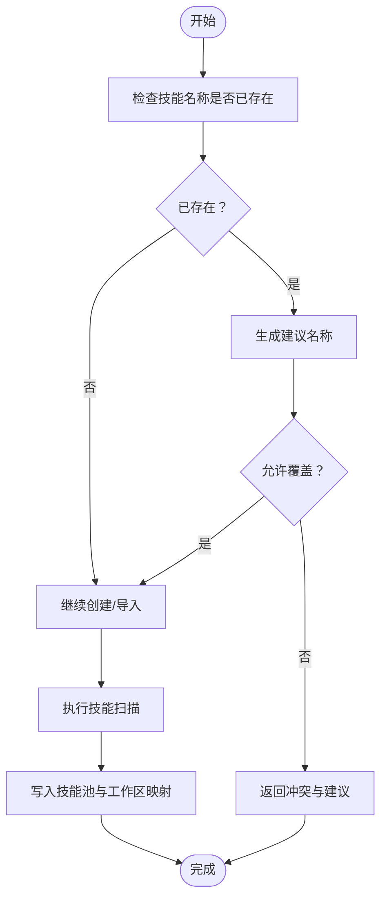
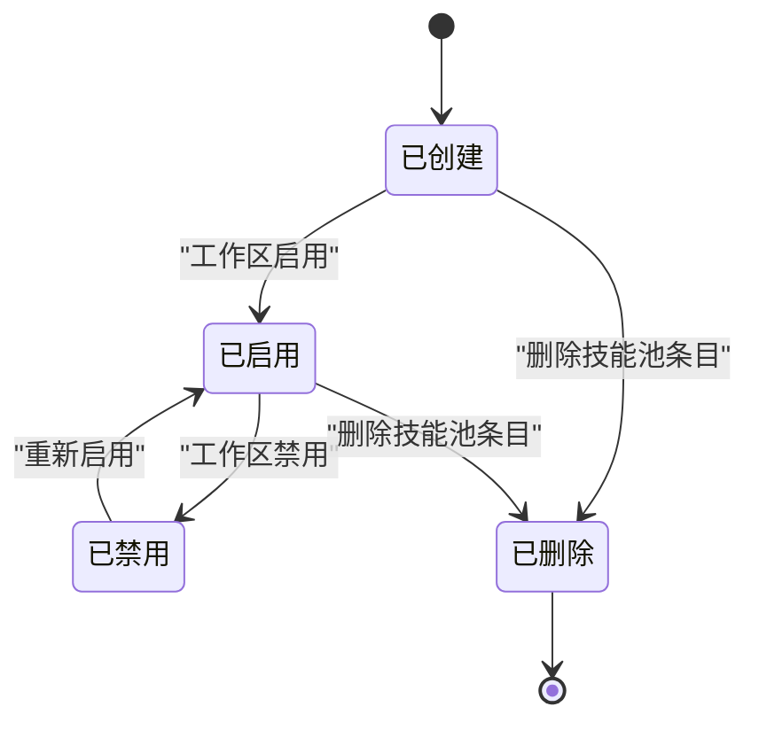
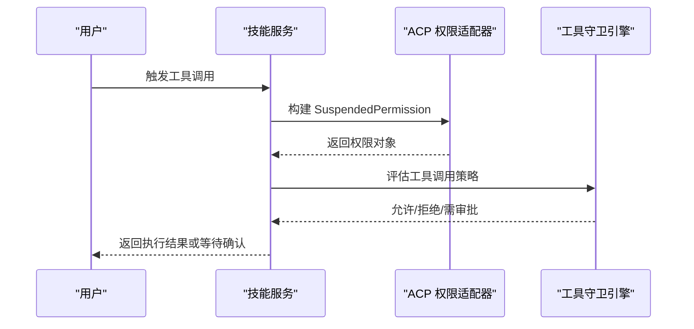
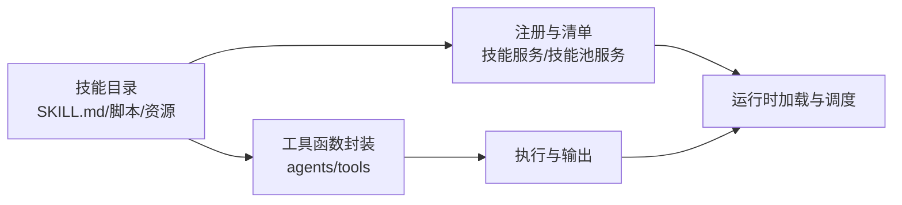
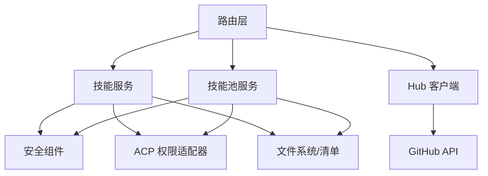

# 技能系统架构

<cite>
**本文引用的文件**
- [src/qwenpaw/app/routers/skills.py](file://src/qwenpaw/app/routers/skills.py)
- [src/qwenpaw/agents/skills_manager.py](file://src/qwenpaw/agents/skills_manager.py)
- [src/qwenpaw/agents/skills_hub.py](file://src/qwenpaw/agents/skills_hub.py)
- [src/qwenpaw/agents/tools/__init__.py](file://src/qwenpaw/agents/tools/__init__.py)
- [src/qwenpaw/agents/utils/registry.py](file://src/qwenpaw/agents/utils/registry.py)
- [src/qwenpaw/agents/acp/permissions.py](file://src/qwenpaw/agents/acp/permissions.py)
- [src/qwenpaw/security/tool_guard/engine.py](file://src/qwenpaw/security/tool_guard/engine.py)
- [src/qwenpaw/security/skill_scanner/scanner.py](file://src/qwenpaw/security/skill_scanner/scanner.py)
- [src/qwenpaw/agents/skills/browser_cdp-en/SKILL.md](file://src/qwenpaw/agents/skills/browser_cdp-en/SKILL.md)
- [src/qwenpaw/agents/skills/file_reader-en/SKILL.md](file://src/qwenpaw/agents/skills/file_reader-en/SKILL.md)
- [src/qwenpaw/agents/skills/cron-en/SKILL.md](file://src/qwenpaw/agents/skills/cron-en/SKILL.md)
- [src/qwenpaw/agents/skills/docx-en/SKILL.md](file://src/qwenpaw/agents/skills/docx-en/SKILL.md)
- [src/qwenpaw/agents/skills/pdf-en/SKILL.md](file://src/qwenpaw/agents/skills/pdf-en/SKILL.md)
- [src/qwenpaw/agents/skills/pptx-en/SKILL.md](file://src/qwenpaw/agents/skills/pptx-en/SKILL.md)
- [src/qwenpaw/agents/skills/xlsx-en/SKILL.md](file://src/qwenpaw/agents/skills/xlsx-en/SKILL.md)
- [src/qwenpaw/agents/skills/multi_agent_collaboration-en/SKILL.md](file://src/qwenpaw/agents/skills/multi_agent_collaboration-en/SKILL.md)
- [src/qwenpaw/agents/skills/channel_message-en/SKILL.md](file://src/qwenpaw/agents/skills/channel_message-en/SKILL.md)
- [src/qwenpaw/agents/skills/chat_with_agent-en/SKILL.md](file://src/qwenpaw/agents/skills/chat_with_agent-en/SKILL.md)
- [src/qwenpaw/agents/skills/guidance-en/SKILL.md](file://src/qwenpaw/agents/skills/guidance-en/SKILL.md)
- [src/qwenpaw/agents/skills/QA_source_index-en/SKILL.md](file://src/qwenpaw/agents/skills/QA_source_index-en/SKILL.md)
- [src/qwenpaw/agents/skills/himalaya-en/SKILL.md](file://src/qwenpaw/agents/skills/himalaya-en/SKILL.md)
- [src/qwenpaw/agents/skills/dingtalk_channel-en/SKILL.md](file://src/qwenpaw/agents/skills/dingtalk_channel-en/SKILL.md)
- [website/public/docs/skills.en.md](file://website/public/docs/skills.en.md)
- [website/public/docs/console.en.md](file://website/public/docs/console.en.md)
</cite>

## 目录
1. [引言](#引言)
2. [项目结构](#项目结构)
3. [核心组件](#核心组件)
4. [架构总览](#架构总览)
5. [详细组件分析](#详细组件分析)
6. [依赖关系分析](#依赖关系分析)
7. [性能考量](#性能考量)
8. [故障排查指南](#故障排查指南)
9. [结论](#结论)
10. [附录](#附录)

## 引言
本架构文档围绕“技能系统”展开，目标是帮助开发者与运维人员全面理解技能的注册机制、工具函数封装、配置管理、生命周期与动态加载、权限控制与冲突解决策略，以及技能如何扩展代理能力。文档同时提供最佳实践、扩展点与自定义开发指南，确保读者能够安全、高效地构建与维护技能生态。

## 项目结构
技能系统由三层协同构成：
- 路由层：提供技能查询、安装、导入、配置与标签管理等接口。
- 管理层：负责技能清单、工作区与技能池的协调、冲突检测与重命名建议。
- Hub 层：提供从 Hub/仓库导入技能的能力，支持并发安装任务与取消。

**图表来源**
- [src/qwenpaw/app/routers/skills.py:577-702](file://src/qwenpaw/app/routers/skills.py#L577-L702)
- [src/qwenpaw/agents/skills_manager.py:2136-2180](file://src/qwenpaw/agents/skills_manager.py#L2136-L2180)
- [src/qwenpaw/agents/skills_manager.py:2731-2780](file://src/qwenpaw/agents/skills_manager.py#L2731-L2780)
- [src/qwenpaw/agents/skills_hub.py:1596-1658](file://src/qwenpaw/agents/skills_hub.py#L1596-L1658)
- [src/qwenpaw/security/skill_scanner/scanner.py](file://src/qwenpaw/security/skill_scanner/scanner.py)
- [src/qwenpaw/security/tool_guard/engine.py](file://src/qwenpaw/security/tool_guard/engine.py)
- [src/qwenpaw/agents/acp/permissions.py:20-52](file://src/qwenpaw/agents/acp/permissions.py#L20-L52)

**章节来源**
- [src/qwenpaw/app/routers/skills.py:577-702](file://src/qwenpaw/app/routers/skills.py#L577-L702)
- [src/qwenpaw/agents/skills_manager.py:2136-2180](file://src/qwenpaw/agents/skills_manager.py#L2136-L2180)
- [src/qwenpaw/agents/skills_manager.py:2731-2780](file://src/qwenpaw/agents/skills_manager.py#L2731-L2780)
- [src/qwenpaw/agents/skills_hub.py:1596-1658](file://src/qwenpaw/agents/skills_hub.py#L1596-L1658)

## 核心组件
- 技能路由与 API
  - 提供技能列表、刷新、Hub 搜索与安装、技能池列举与刷新、内置源与变更通知、技能池配置与标签管理等接口。
  - 关键路径参考：[技能路由:577-702](file://src/qwenpaw/app/routers/skills.py#L577-L702)、[技能池路由:686-702](file://src/qwenpaw/app/routers/skills.py#L686-L702)、[Hub 安装路由:900-923](file://src/qwenpaw/app/routers/skills.py#L900-L923)、[技能池配置路由:1136-1180](file://src/qwenpaw/app/routers/skills.py#L1136-L1180)、[技能池标签路由:1196-1208](file://src/qwenpaw/app/routers/skills.py#L1196-L1208)。

- 技能服务与技能池服务
  - 技能服务：负责工作区技能清单的构建、启用/禁用、渠道绑定、元数据与需求同步、配置与标签继承等。
  - 技能池服务：负责技能池的导入、删除、重命名、冲突检测与建议、内置源更新、版本与语言选择等。
  - 关键类与职责参考：[技能服务类:2136-2180](file://src/qwenpaw/agents/skills_manager.py#L2136-L2180)、[技能池服务类:2731-2780](file://src/qwenpaw/agents/skills_manager.py#L2731-L2780)。

- 技能 Hub 客户端
  - 支持从 Hub/仓库搜索、安装、取消安装；处理分支与根路径解析；并发安装任务与取消事件；冲突提示与建议重命名。
  - 关键实现参考：[Hub 安装流程:1596-1658](file://src/qwenpaw/agents/skills_hub.py#L1596-L1658)、[Hub 搜索:1543-1566](file://src/qwenpaw/agents/skills_hub.py#L1543-L1566)、[冲突提示:38-51](file://src/qwenpaw/agents/skills_hub.py#L38-L51)。

- 安全与权限
  - 技能扫描：对导入/创建的技能进行静态扫描，识别潜在风险。
  - 工具守卫：对工具调用进行规则化拦截与审批。
  - ACP 权限：将工具调用转换为 SuspendedPermission，用于用户确认或策略判定。
  - 参考：[技能扫描器](file://src/qwenpaw/security/skill_scanner/scanner.py)、[工具守卫引擎](file://src/qwenpaw/security/tool_guard/engine.py)、[ACP 权限适配器:20-52](file://src/qwenpaw/agents/acp/permissions.py#L20-L52)。

**章节来源**
- [src/qwenpaw/app/routers/skills.py:577-702](file://src/qwenpaw/app/routers/skills.py#L577-L702)
- [src/qwenpaw/agents/skills_manager.py:2136-2180](file://src/qwenpaw/agents/skills_manager.py#L2136-L2180)
- [src/qwenpaw/agents/skills_manager.py:2731-2780](file://src/qwenpaw/agents/skills_manager.py#L2731-L2780)
- [src/qwenpaw/agents/skills_hub.py:1543-1566](file://src/qwenpaw/agents/skills_hub.py#L1543-L1566)
- [src/qwenpaw/agents/skills_hub.py:1596-1658](file://src/qwenpaw/agents/skills_hub.py#L1596-L1658)
- [src/qwenpaw/agents/skills_hub.py:38-51](file://src/qwenpaw/agents/skills_hub.py#L38-L51)
- [src/qwenpaw/security/skill_scanner/scanner.py](file://src/qwenpaw/security/skill_scanner/scanner.py)
- [src/qwenpaw/security/tool_guard/engine.py](file://src/qwenpaw/security/tool_guard/engine.py)
- [src/qwenpaw/agents/acp/permissions.py:20-52](file://src/qwenpaw/agents/acp/permissions.py#L20-L52)

## 架构总览
技能系统采用“路由-服务-Hub-安全”的分层架构，结合工作区与技能池双清单模型，实现技能的动态加载、统一配置与权限治理。

**图表来源**
- [src/qwenpaw/app/routers/skills.py:577-702](file://src/qwenpaw/app/routers/skills.py#L577-L702)
- [src/qwenpaw/agents/skills_manager.py:2136-2180](file://src/qwenpaw/agents/skills_manager.py#L2136-L2180)
- [src/qwenpaw/agents/skills_manager.py:2731-2780](file://src/qwenpaw/agents/skills_manager.py#L2731-L2780)
- [src/qwenpaw/agents/skills_hub.py:1596-1658](file://src/qwenpaw/agents/skills_hub.py#L1596-L1658)
- [src/qwenpaw/security/skill_scanner/scanner.py](file://src/qwenpaw/security/skill_scanner/scanner.py)

## 详细组件分析

### 组件一：技能注册与清单管理
- 工作区技能清单
  - 通过路由层的“刷新”接口触发清单一致性校验与重建，确保工作区技能与技能池一致。
  - 清单包含启用状态、渠道、来源、配置、元数据与需求等字段。
  - 参考：[刷新接口:583-589](file://src/qwenpaw/app/routers/skills.py#L583-L589)、[构建工作区技能规格:577-581](file://src/qwenpaw/app/routers/skills.py#L577-L581)。

- 技能池清单
  - 技能池作为共享资源库，支持内置与自定义来源，记录版本、语言、可用语言集、标签与配置。
  - 参考：[技能池规格:121-131](file://src/qwenpaw/app/routers/skills.py#L121-L131)、[列举技能池:686-689](file://src/qwenpaw/app/routers/skills.py#L686-L689)。

- 冲突检测与重命名建议
  - 在创建/导入时检测名称冲突，返回建议的新名称，避免覆盖已有条目。
  - 参考：[冲突建议:38-51](file://src/qwenpaw/agents/skills_hub.py#L38-L51)、[重命名逻辑:2980-3006](file://src/qwenpaw/agents/skills_manager.py#L2980-L3006)。

**图表来源**
- [src/qwenpaw/agents/skills_hub.py:38-51](file://src/qwenpaw/agents/skills_hub.py#L38-L51)
- [src/qwenpaw/agents/skills_manager.py:2980-3006](file://src/qwenpaw/agents/skills_manager.py#L2980-L3006)
- [src/qwenpaw/security/skill_scanner/scanner.py](file://src/qwenpaw/security/skill_scanner/scanner.py)

**章节来源**
- [src/qwenpaw/app/routers/skills.py:577-589](file://src/qwenpaw/app/routers/skills.py#L577-L589)
- [src/qwenpaw/app/routers/skills.py:121-131](file://src/qwenpaw/app/routers/skills.py#L121-L131)
- [src/qwenpaw/app/routers/skills.py:686-689](file://src/qwenpaw/app/routers/skills.py#L686-L689)
- [src/qwenpaw/agents/skills_hub.py:38-51](file://src/qwenpaw/agents/skills_hub.py#L38-L51)
- [src/qwenpaw/agents/skills_manager.py:2980-3006](file://src/qwenpaw/agents/skills_manager.py#L2980-L3006)

### 组件二：动态加载与生命周期
- 动态加载
  - 技能以目录形式存在于技能池中，工作区通过清单引用启用；运行时按需加载脚本与资源。
  - 参考：[技能池目录与清单:2731-2780](file://src/qwenpaw/agents/skills_manager.py#L2731-L2780)。

- 生命周期
  - 创建：校验内容、扫描、复制到技能池、更新清单。
  - 启用/禁用：通过工作区清单切换。
  - 更新：内置源变更通知、增量更新、版本对比。
  - 删除：受保护条目不可删除，否则返回冲突错误。
  - 参考：[创建技能:2770-2815](file://src/qwenpaw/agents/skills_manager.py#L2770-L2815)、[删除技能池条目:1125-1133](file://src/qwenpaw/app/routers/skills.py#L1125-L1133)、[内置源变更通知:705-727](file://src/qwenpaw/app/routers/skills.py#L705-L727)。

**图表来源**
- [src/qwenpaw/agents/skills_manager.py:2770-2815](file://src/qwenpaw/agents/skills_manager.py#L2770-L2815)
- [src/qwenpaw/app/routers/skills.py:1125-1133](file://src/qwenpaw/app/routers/skills.py#L1125-L1133)
- [src/qwenpaw/app/routers/skills.py:705-727](file://src/qwenpaw/app/routers/skills.py#L705-L727)

**章节来源**
- [src/qwenpaw/agents/skills_manager.py:2770-2815](file://src/qwenpaw/agents/skills_manager.py#L2770-L2815)
- [src/qwenpaw/app/routers/skills.py:1125-1133](file://src/qwenpaw/app/routers/skills.py#L1125-L1133)
- [src/qwenpaw/app/routers/skills.py:705-727](file://src/qwenpaw/app/routers/skills.py#L705-L727)

### 组件三：权限控制与冲突解决
- 权限控制
  - 将工具调用抽象为 SuspendedPermission，结合 ACP 与工具守卫引擎进行策略判定与用户确认。
  - 参考：[ACP 权限适配器:20-52](file://src/qwenpaw/agents/acp/permissions.py#L20-L52)、[工具守卫引擎](file://src/qwenpaw/security/tool_guard/engine.py)。

- 冲突解决
  - Hub 安装与本地创建均会检测名称冲突，返回建议名称；工作区重命名时同样进行冲突检测与建议。
  - 参考：[Hub 冲突提示:38-51](file://src/qwenpaw/agents/skills_hub.py#L38-L51)、[工作区重命名冲突:2980-3006](file://src/qwenpaw/agents/skills_manager.py#L2980-L3006)。

**图表来源**
- [src/qwenpaw/agents/acp/permissions.py:20-52](file://src/qwenpaw/agents/acp/permissions.py#L20-L52)
- [src/qwenpaw/security/tool_guard/engine.py](file://src/qwenpaw/security/tool_guard/engine.py)
- [src/qwenpaw/agents/skills_manager.py:2136-2180](file://src/qwenpaw/agents/skills_manager.py#L2136-L2180)

**章节来源**
- [src/qwenpaw/agents/acp/permissions.py:20-52](file://src/qwenpaw/agents/acp/permissions.py#L20-L52)
- [src/qwenpaw/security/tool_guard/engine.py](file://src/qwenpaw/security/tool_guard/engine.py)
- [src/qwenpaw/agents/skills_hub.py:38-51](file://src/qwenpaw/agents/skills_hub.py#L38-L51)
- [src/qwenpaw/agents/skills_manager.py:2980-3006](file://src/qwenpaw/agents/skills_manager.py#L2980-L3006)

### 组件四：技能与工具的关系
- 工具函数封装
  - 工具模块集中于 agents/tools，提供文件 IO、浏览器控制、桌面截图、媒体查看、外部代理委托等能力。
  - 参考：[工具入口](file://src/qwenpaw/agents/tools/__init__.py)。

- 技能扩展代理能力
  - 技能通过脚本与工具协作，实现复杂场景自动化；例如 PDF 表单填写、Excel 数据处理、PPTX 编辑、多智能体协作等。
  - 参考：[PDF 技能说明:1-8](file://src/qwenpaw/agents/skills/pdf-en/SKILL.md#L1-L8)、[XLSX 技能说明](file://src/qwenpaw/agents/skills/xlsx-en/SKILL.md)、[PPTX 技能说明](file://src/qwenpaw/agents/skills/pptx-en/SKILL.md)、[Docx 技能说明](file://src/qwenpaw/agents/skills/docx-en/SKILL.md)、[多智能体协作](file://src/qwenpaw/agents/skills/multi_agent_collaboration-en/SKILL.md)。

**图表来源**
- [src/qwenpaw/agents/skills/pdf-en/SKILL.md:1-8](file://src/qwenpaw/agents/skills/pdf-en/SKILL.md#L1-L8)
- [src/qwenpaw/agents/skills/xlsx-en/SKILL.md](file://src/qwenpaw/agents/skills/xlsx-en/SKILL.md)
- [src/qwenpaw/agents/skills/pptx-en/SKILL.md](file://src/qwenpaw/agents/skills/pptx-en/SKILL.md)
- [src/qwenpaw/agents/skills/docx-en/SKILL.md](file://src/qwenpaw/agents/skills/docx-en/SKILL.md)
- [src/qwenpaw/agents/skills/multi_agent_collaboration-en/SKILL.md](file://src/qwenpaw/agents/skills/multi_agent_collaboration-en/SKILL.md)
- [src/qwenpaw/agents/tools/__init__.py](file://src/qwenpaw/agents/tools/__init__.py)

**章节来源**
- [src/qwenpaw/agents/tools/__init__.py](file://src/qwenpaw/agents/tools/__init__.py)
- [src/qwenpaw/agents/skills/pdf-en/SKILL.md:1-8](file://src/qwenpaw/agents/skills/pdf-en/SKILL.md#L1-L8)
- [src/qwenpaw/agents/skills/xlsx-en/SKILL.md](file://src/qwenpaw/agents/skills/xlsx-en/SKILL.md)
- [src/qwenpaw/agents/skills/pptx-en/SKILL.md](file://src/qwenpaw/agents/skills/pptx-en/SKILL.md)
- [src/qwenpaw/agents/skills/docx-en/SKILL.md](file://src/qwenpaw/agents/skills/docx-en/SKILL.md)
- [src/qwenpaw/agents/skills/multi_agent_collaboration-en/SKILL.md](file://src/qwenpaw/agents/skills/multi_agent_collaboration-en/SKILL.md)

### 组件五：技能配置管理
- 配置来源与优先级
  - 技能池配置：全局共享配置，适用于所有工作区实例。
  - 工作区配置：覆盖技能池配置，按代理维度生效。
  - 参考：[技能池配置路由:1136-1162](file://src/qwenpaw/app/routers/skills.py#L1136-L1162)、[工作区映射携带配置:3405-3434](file://src/qwenpaw/agents/skills_manager.py#L3405-L3434)。

- 标签与变更通知
  - 支持为技能池条目设置标签，便于检索与筛选；内置源变更时提供指纹与动作集合。
  - 参考：[标签路由:1196-1208](file://src/qwenpaw/app/routers/skills.py#L1196-L1208)、[内置源变更通知:705-727](file://src/qwenpaw/app/routers/skills.py#L705-L727)。

**章节来源**
- [src/qwenpaw/app/routers/skills.py:1136-1162](file://src/qwenpaw/app/routers/skills.py#L1136-L1162)
- [src/qwenpaw/app/routers/skills.py:1196-1208](file://src/qwenpaw/app/routers/skills.py#L1196-L1208)
- [src/qwenpaw/app/routers/skills.py:705-727](file://src/qwenpaw/app/routers/skills.py#L705-L727)
- [src/qwenpaw/agents/skills_manager.py:3405-3434](file://src/qwenpaw/agents/skills_manager.py#L3405-L3434)

### 组件六：技能开发最佳实践
- 技能模板与规范
  - 使用 SKILL.md 描述技能用途、输入输出、前置条件与脚本路径；脚本相对路径以技能目录为根。
  - 参考：[PDF 技能说明:1-8](file://src/qwenpaw/agents/skills/pdf-en/SKILL.md#L1-L8)、[XLSX 技能说明](file://src/qwenpaw/agents/skills/xlsx-en/SKILL.md)、[PPTX 技能说明](file://src/qwenpaw/agents/skills/pptx-en/SKILL.md)、[Docx 技能说明](file://src/qwenpaw/agents/skills/docx-en/SKILL.md)。

- 测试方法
  - 通过工作区启用技能后，在控制台或聊天界面验证功能；结合 Hub 搜索与安装进行集成测试。
  - 参考：[控制台快速参考:471-491](file://website/public/docs/console.en.md#L471-L491)、[技能导入与安装:73-124](file://website/public/docs/skills.en.md#L73-L124)。

- 扩展点与自定义开发
  - 自定义技能目录放置于技能池；通过“上传/导入/从 Hub 安装”三种方式进入技能池；再在工作区启用。
  - 参考：[技能导入与安装:73-124](file://website/public/docs/skills.en.md#L73-L124)、[Hub 安装路由:900-923](file://src/qwenpaw/app/routers/skills.py#L900-L923)。

**章节来源**
- [src/qwenpaw/agents/skills/pdf-en/SKILL.md:1-8](file://src/qwenpaw/agents/skills/pdf-en/SKILL.md#L1-L8)
- [src/qwenpaw/agents/skills/xlsx-en/SKILL.md](file://src/qwenpaw/agents/skills/xlsx-en/SKILL.md)
- [src/qwenpaw/agents/skills/pptx-en/SKILL.md](file://src/qwenpaw/agents/skills/pptx-en/SKILL.md)
- [src/qwenpaw/agents/skills/docx-en/SKILL.md](file://src/qwenpaw/agents/skills/docx-en/SKILL.md)
- [website/public/docs/console.en.md:471-491](file://website/public/docs/console.en.md#L471-L491)
- [website/public/docs/skills.en.md:73-124](file://website/public/docs/skills.en.md#L73-L124)
- [src/qwenpaw/app/routers/skills.py:900-923](file://src/qwenpaw/app/routers/skills.py#L900-L923)

## 依赖关系分析
- 组件耦合
  - 路由层依赖技能服务与技能池服务；技能服务依赖安全组件（扫描与工具守卫）与 ACP 权限适配器。
  - Hub 层独立于路由层，但通过技能池服务写入清单，最终影响工作区视图。

- 外部依赖
  - GitHub API 用于 Hub 搜索与内容获取；文件系统用于技能目录与清单持久化；JSON 原子写入保证并发安全。

**图表来源**
- [src/qwenpaw/app/routers/skills.py:577-702](file://src/qwenpaw/app/routers/skills.py#L577-L702)
- [src/qwenpaw/agents/skills_manager.py:2136-2180](file://src/qwenpaw/agents/skills_manager.py#L2136-L2180)
- [src/qwenpaw/agents/skills_manager.py:2731-2780](file://src/qwenpaw/agents/skills_manager.py#L2731-L2780)
- [src/qwenpaw/agents/skills_hub.py:1596-1658](file://src/qwenpaw/agents/skills_hub.py#L1596-L1658)
- [src/qwenpaw/agents/acp/permissions.py:20-52](file://src/qwenpaw/agents/acp/permissions.py#L20-L52)
- [src/qwenpaw/security/skill_scanner/scanner.py](file://src/qwenpaw/security/skill_scanner/scanner.py)
- [src/qwenpaw/security/tool_guard/engine.py](file://src/qwenpaw/security/tool_guard/engine.py)

**章节来源**
- [src/qwenpaw/app/routers/skills.py:577-702](file://src/qwenpaw/app/routers/skills.py#L577-L702)
- [src/qwenpaw/agents/skills_manager.py:2136-2180](file://src/qwenpaw/agents/skills_manager.py#L2136-L2180)
- [src/qwenpaw/agents/skills_manager.py:2731-2780](file://src/qwenpaw/agents/skills_manager.py#L2731-L2780)
- [src/qwenpaw/agents/skills_hub.py:1596-1658](file://src/qwenpaw/agents/skills_hub.py#L1596-L1658)
- [src/qwenpaw/agents/acp/permissions.py:20-52](file://src/qwenpaw/agents/acp/permissions.py#L20-L52)
- [src/qwenpaw/security/skill_scanner/scanner.py](file://src/qwenpaw/security/skill_scanner/scanner.py)
- [src/qwenpaw/security/tool_guard/engine.py](file://src/qwenpaw/security/tool_guard/engine.py)

## 性能考量
- 并发与锁
  - JSON 清单写入采用原子替换与文件级互斥锁，避免并发写入导致的数据损坏。
  - 参考：[原子写入与互斥锁:517-552](file://src/qwenpaw/agents/skills_manager.py#L517-L552)。

- Hub 安装并发
  - 安装任务使用上下文锁与取消事件，避免重复安装与资源竞争。
  - 参考：[安装任务与取消:663-683](file://src/qwenpaw/app/routers/skills.py#L663-L683)、[Hub 安装流程:1596-1658](file://src/qwenpaw/agents/skills_hub.py#L1596-L1658)。

- 扫描与缓存
  - 技能扫描结果可用于后续快速判断，减少重复扫描成本；建议在 CI 中预扫描以降低运行时开销。
  - 参考：[技能扫描器](file://src/qwenpaw/security/skill_scanner/scanner.py)。

**章节来源**
- [src/qwenpaw/agents/skills_manager.py:517-552](file://src/qwenpaw/agents/skills_manager.py#L517-L552)
- [src/qwenpaw/app/routers/skills.py:663-683](file://src/qwenpaw/app/routers/skills.py#L663-L683)
- [src/qwenpaw/agents/skills_hub.py:1596-1658](file://src/qwenpaw/agents/skills_hub.py#L1596-L1658)
- [src/qwenpaw/security/skill_scanner/scanner.py](file://src/qwenpaw/security/skill_scanner/scanner.py)

## 故障排查指南
- 冲突与重命名
  - 症状：创建/导入失败，提示名称冲突。
  - 处理：使用建议名称重试，或开启覆盖模式（谨慎）。
  - 参考：[冲突提示:38-51](file://src/qwenpaw/agents/skills_hub.py#L38-L51)、[重命名冲突:2980-3006](file://src/qwenpaw/agents/skills_manager.py#L2980-L3006)。

- 删除失败
  - 症状：删除技能池条目返回 409。
  - 处理：确认条目是否受保护或不存在。
  - 参考：[删除技能池条目:1125-1133](file://src/qwenpaw/app/routers/skills.py#L1125-L1133)。

- Hub 安装异常
  - 症状：安装失败或超时。
  - 处理：检查网络与仓库访问权限，取消任务后重试。
  - 参考：[安装取消:663-683](file://src/qwenpaw/app/routers/skills.py#L663-L683)、[Hub 安装:1596-1658](file://src/qwenpaw/agents/skills_hub.py#L1596-L1658)。

- 权限被阻断
  - 症状：工具调用被拒绝或需要用户确认。
  - 处理：检查 ACP 策略与工具守卫规则，必要时调整策略或提升权限。
  - 参考：[ACP 权限适配器:20-52](file://src/qwenpaw/agents/acp/permissions.py#L20-L52)、[工具守卫引擎](file://src/qwenpaw/security/tool_guard/engine.py)。

**章节来源**
- [src/qwenpaw/agents/skills_hub.py:38-51](file://src/qwenpaw/agents/skills_hub.py#L38-L51)
- [src/qwenpaw/agents/skills_manager.py:2980-3006](file://src/qwenpaw/agents/skills_manager.py#L2980-L3006)
- [src/qwenpaw/app/routers/skills.py:1125-1133](file://src/qwenpaw/app/routers/skills.py#L1125-L1133)
- [src/qwenpaw/app/routers/skills.py:663-683](file://src/qwenpaw/app/routers/skills.py#L663-L683)
- [src/qwenpaw/agents/skills_hub.py:1596-1658](file://src/qwenpaw/agents/skills_hub.py#L1596-L1658)
- [src/qwenpaw/agents/acp/permissions.py:20-52](file://src/qwenpaw/agents/acp/permissions.py#L20-L52)
- [src/qwenpaw/security/tool_guard/engine.py](file://src/qwenpaw/security/tool_guard/engine.py)

## 结论
技能系统通过清晰的分层设计与严格的生命周期管理，实现了技能的动态加载、统一配置与安全治理。配合 Hub 生态与内置技能池，开发者可以快速扩展代理能力；通过权限与工具守卫机制，确保技能执行的安全可控。建议在生产环境中结合扫描与缓存策略，优化安装与运行性能，并建立完善的冲突与权限治理流程。

## 附录
- 相关文档与页面
  - 控制台快速参考：[console.en.md:471-491](file://website/public/docs/console.en.md#L471-L491)
  - 技能导入与安装指南：[skills.en.md:73-124](file://website/public/docs/skills.en.md#L73-L124)

**章节来源**
- [website/public/docs/console.en.md:471-491](file://website/public/docs/console.en.md#L471-L491)
- [website/public/docs/skills.en.md:73-124](file://website/public/docs/skills.en.md#L73-L124)