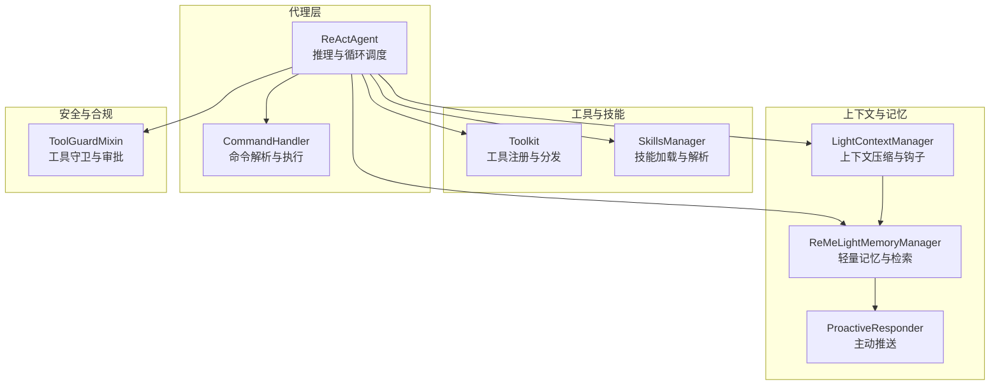
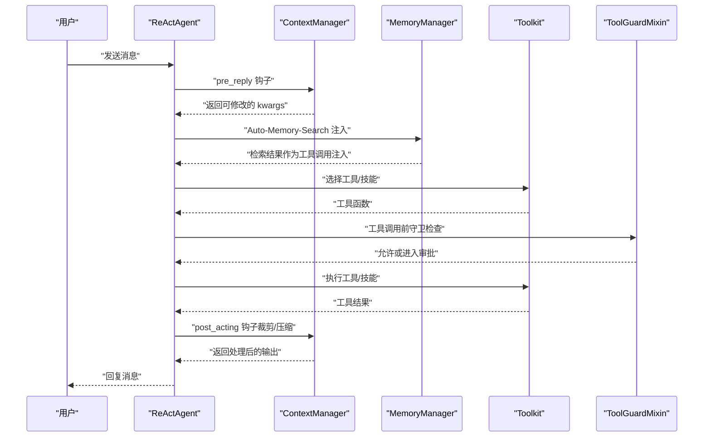
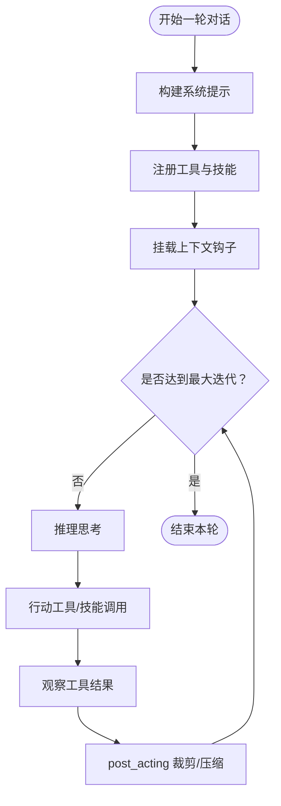
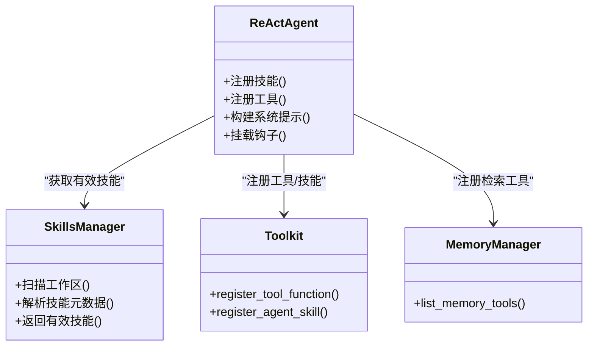
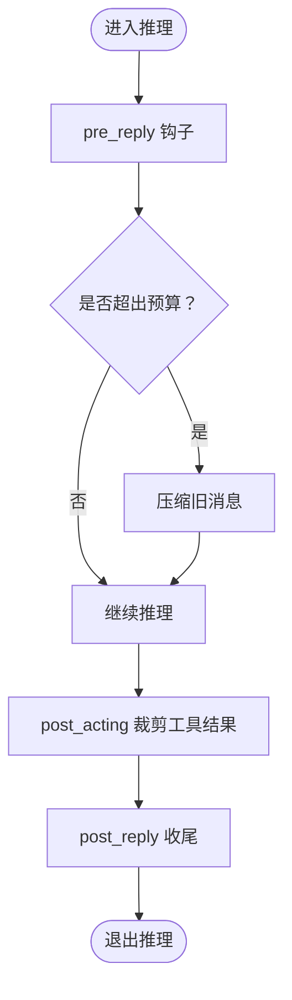
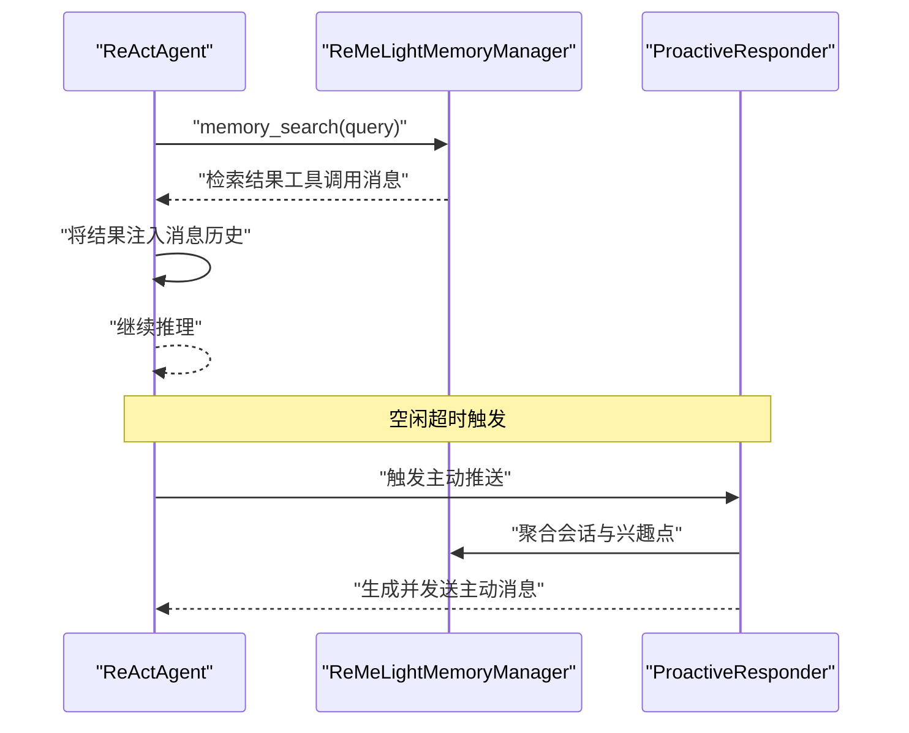
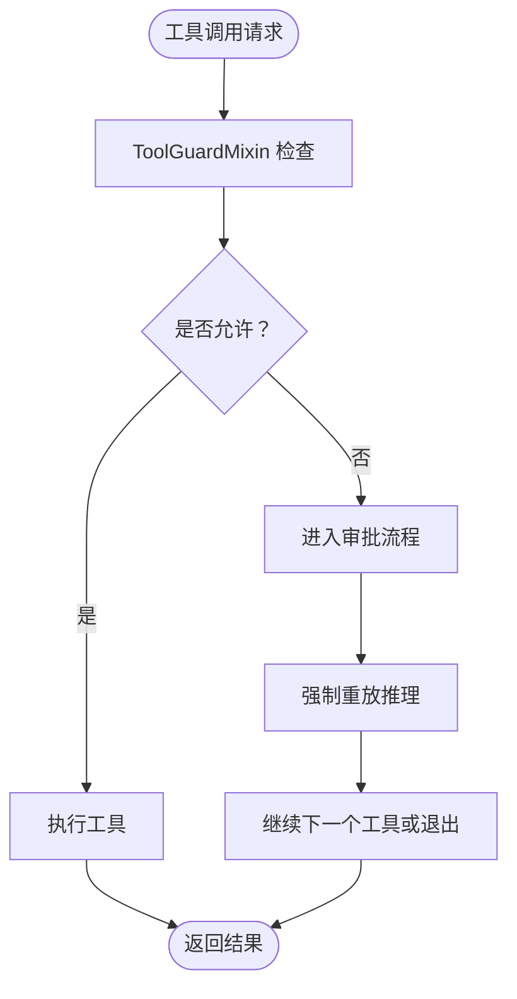
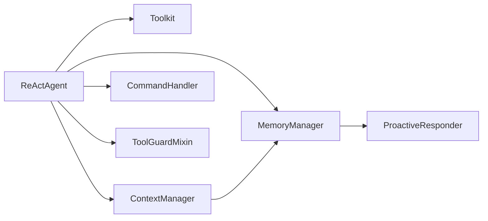

# 核心概念

<cite>
**本文引用的文件**
- [react_agent.py](file://src/qwenpaw/agents/react_agent.py)
- [light_context_manager.py](file://src/qwenpaw/agents/context/light_context_manager.py)
- [base_context_manager.py](file://src/qwenpaw/agents/context/base_context_manager.py)
- [reme_light_memory_manager.py](file://src/qwenpaw/agents/memory/reme_light_memory_manager.py)
- [proactive_responder.py](file://src/qwenpaw/agents/memory/proactive/proactive_responder.py)
- [tool_guard_mixin.py](file://src/qwenpaw/agents/tool_guard_mixin.py)
- [command_handler.py](file://src/qwenpaw/agents/command_handler.py)
- [skills_manager.py](file://src/qwenpaw/agents/skills_manager.py)
- [context.en.md](file://website/public/docs/context.en.md)
- [memory.en.md](file://website/public/docs/memory.en.md)
- [config.en.md](file://website/public/docs/config.en.md)
</cite>

## 目录
1. [引言](#引言)
2. [项目结构](#项目结构)
3. [核心组件](#核心组件)
4. [架构总览](#架构总览)
5. [详细组件分析](#详细组件分析)
6. [依赖关系分析](#依赖关系分析)
7. [性能考量](#性能考量)
8. [故障排查指南](#故障排查指南)
9. [结论](#结论)
10. [附录](#附录)

## 引言
本文件面向开发者与技术读者，系统化阐释 QwenPaw 的核心概念与实现原理，重点覆盖以下主题：
- ReAct 代理的工作原理与“思考-行动-观察”循环机制
- 技能系统（Skills）的架构设计、工具调用机制与上下文管理
- 代理配置、记忆管理（含自动检索与主动推送）、多模态交互的实现要点
- 安全与合规：工具守卫与审批流程
- 架构图表与概念模型，帮助快速建立对系统内部工作机制的理解

## 项目结构
QwenPaw 的核心逻辑集中在 Python 包 src/qwenpaw 下，前端控制台位于 console/src。后端以“代理（Agent）+ 工具（Tool）+ 记忆（Memory）+ 上下文（Context）+ 技能（Skill）”为核心模块，围绕 ReAct 推理循环组织。

图示来源
- [react_agent.py:179-219](file://src/qwenpaw/agents/react_agent.py#L179-L219)
- [light_context_manager.py](file://src/qwenpaw/agents/context/light_context_manager.py)
- [reme_light_memory_manager.py:431-464](file://src/qwenpaw/agents/memory/reme_light_memory_manager.py#L431-L464)
- [proactive_responder.py:53-105](file://src/qwenpaw/agents/memory/proactive/proactive_responder.py#L53-L105)
- [tool_guard_mixin.py:636-676](file://src/qwenpaw/agents/tool_guard_mixin.py#L636-L676)
- [command_handler.py](file://src/qwenpaw/agents/command_handler.py)
- [skills_manager.py](file://src/qwenpaw/agents/skills_manager.py)

章节来源
- [react_agent.py:179-219](file://src/qwenpaw/agents/react_agent.py#L179-L219)
- [context.en.md:80-103](file://website/public/docs/context.en.md#L80-L103)
- [memory.en.md:135-309](file://website/public/docs/memory.en.md#L135-L309)

## 核心组件
- ReAct 代理：负责构建系统提示、注册工具与技能、挂载上下文钩子、驱动“思考-行动-观察”循环，并在每轮结束后进行上下文压缩与记忆注入。
- 工具与技能：通过 Toolkit 统一注册与分发；技能由工作区目录扫描与解析，按通道生效。
- 上下文管理：LightContextManager 提供预/后置钩子，实现消息压缩、工具结果裁剪与预算控制。
- 记忆管理：ReMeLightMemoryManager 支持自动检索注入与轻量优化；ProactiveResponder 实现空闲时的主动信息推送。
- 安全与合规：ToolGuardMixin 在工具调用前进行策略检查，必要时进入审批流程。
- 命令处理：CommandHandler 解析会话内命令（如 /proactive），并与上下文/记忆协同。

章节来源
- [react_agent.py:327-457](file://src/qwenpaw/agents/react_agent.py#L327-L457)
- [light_context_manager.py](file://src/qwenpaw/agents/context/light_context_manager.py)
- [reme_light_memory_manager.py:431-464](file://src/qwenpaw/agents/memory/reme_light_memory_manager.py#L431-L464)
- [proactive_responder.py:53-105](file://src/qwenpaw/agents/memory/proactive/proactive_responder.py#L53-L105)
- [tool_guard_mixin.py:636-676](file://src/qwenpaw/agents/tool_guard_mixin.py#L636-L676)
- [command_handler.py](file://src/qwenpaw/agents/command_handler.py)
- [skills_manager.py](file://src/qwenpaw/agents/skills_manager.py)

## 架构总览
下图展示 ReAct 代理在一次对话回合中的关键交互路径：从系统提示构建、工具与技能注册，到上下文钩子介入、工具调用与记忆检索注入，再到主动推送与安全守卫。

图示来源
- [react_agent.py:423-446](file://src/qwenpaw/agents/react_agent.py#L423-L446)
- [reme_light_memory_manager.py:431-464](file://src/qwenpaw/agents/memory/reme_light_memory_manager.py#L431-L464)
- [tool_guard_mixin.py:636-676](file://src/qwenpaw/agents/tool_guard_mixin.py#L636-L676)
- [base_context_manager.py:114-153](file://src/qwenpaw/agents/context/base_context_manager.py#L114-L153)

## 详细组件分析

### ReAct 代理与“思考-行动-观察”循环
- 系统提示构建：根据工作区文件与环境上下文生成固定系统提示，贯穿会话始终。
- 工具与技能注册：扫描工作区有效技能，按通道筛选并注册到 Toolkit；同时注册内存相关的工具函数。
- 钩子挂载：在推理前、推理后、行动后、回复后四个阶段挂载上下文钩子，用于压缩与裁剪。
- 循环控制：受运行配置限制最大迭代次数，确保不会无限循环。

图示来源
- [react_agent.py:365-457](file://src/qwenpaw/agents/react_agent.py#L365-L457)
- [config.en.md:346-354](file://website/public/docs/config.en.md#L346-L354)

章节来源
- [react_agent.py:327-457](file://src/qwenpaw/agents/react_agent.py#L327-L457)
- [config.en.md:346-354](file://website/public/docs/config.en.md#L346-L354)

### 技能系统与工具调用机制
- 技能加载：基于工作区目录扫描，结合当前通道确定有效技能集合，逐个注册到 Toolkit。
- 工具函数：内存管理器提供检索类工具，统一注册到代理的工具箱中，便于在推理阶段被选择与调用。
- 名称冲突策略：支持重名处理策略（覆盖/跳过/报错/重命名），保证注册稳定性。

图示来源
- [react_agent.py:327-364](file://src/qwenpaw/agents/react_agent.py#L327-L364)
- [react_agent.py:179-190](file://src/qwenpaw/agents/react_agent.py#L179-L190)
- [skills_manager.py](file://src/qwenpaw/agents/skills_manager.py)

章节来源
- [react_agent.py:327-364](file://src/qwenpaw/agents/react_agent.py#L327-L364)
- [react_agent.py:179-190](file://src/qwenpaw/agents/react_agent.py#L179-L190)

### 上下文管理与消息压缩
- 钩子职责：
  - pre_reply/pre_reasoning：在推理前进行上下文健康检查与压缩。
  - post_acting：对工具结果进行裁剪，避免占用过多上下文。
  - post_reply：在回复后进行收尾处理。
- 结构示意：系统提示固定保留；可压缩区域在阈值触发时进行压缩；最近消息保留以维持最新上下文。

图示来源
- [base_context_manager.py:114-153](file://src/qwenpaw/agents/context/base_context_manager.py#L114-L153)
- [context.en.md:80-103](file://website/public/docs/context.en.md#L80-L103)

章节来源
- [base_context_manager.py:114-153](file://src/qwenpaw/agents/context/base_context_manager.py#L114-L153)
- [context.en.md:80-103](file://website/public/docs/context.en.md#L80-L103)

### 记忆管理与自动检索注入
- 自动检索注入：在每次推理前，提取最新用户消息作为查询，调用记忆检索工具，将结果以“已完成的工具调用”形式注入历史，提升知识复用效率。
- 轻量优化：定期执行“梦境式”优化，基于语言与时序特征裁剪近期消息，保持 KV 缓存效率。
- 主动推送：在空闲超时后，基于会话聚合与需求预测生成主动消息，避免打扰并减少重复推送。

图示来源
- [reme_light_memory_manager.py:431-464](file://src/qwenpaw/agents/memory/reme_light_memory_manager.py#L431-L464)
- [proactive_responder.py:53-105](file://src/qwenpaw/agents/memory/proactive/proactive_responder.py#L53-L105)
- [memory.en.md:135-309](file://website/public/docs/memory.en.md#L135-L309)

章节来源
- [reme_light_memory_manager.py:431-464](file://src/qwenpaw/agents/memory/reme_light_memory_manager.py#L431-L464)
- [proactive_responder.py:53-105](file://src/qwenpaw/agents/memory/proactive/proactive_responder.py#L53-L105)
- [memory.en.md:135-309](file://website/public/docs/memory.en.md#L135-L309)

### 安全与合规：工具守卫与审批
- 审批短路：当工具调用需要审批时，推理阶段短路至等待审批完成，完成后继续后续工具链或自然退出。
- 拒绝记录：若工具被拒绝，生成系统消息并写入记忆标记，便于审计与回溯。

图示来源
- [tool_guard_mixin.py:636-676](file://src/qwenpaw/agents/tool_guard_mixin.py#L636-L676)

章节来源
- [tool_guard_mixin.py:636-676](file://src/qwenpaw/agents/tool_guard_mixin.py#L636-L676)

### 代理配置与命令处理
- 运行配置：包含最大迭代次数等关键参数，控制 ReAct 循环的上限。
- 命令处理：解析会话内命令（如 /proactive），并与上下文/记忆协同，实现功能开关与行为调整。

章节来源
- [config.en.md:346-354](file://website/public/docs/config.en.md#L346-L354)
- [command_handler.py](file://src/qwenpaw/agents/command_handler.py)

## 依赖关系分析
- ReActAgent 依赖 Toolkit（工具/技能）、上下文管理器（钩子）、记忆管理器（检索/优化）、命令处理器（会话命令）与工具守卫（安全）。
- 上下文管理器与记忆管理器存在协作关系：前者负责压缩与裁剪，后者负责检索与优化。
- 技能系统与工具箱解耦：技能解析与注册独立于工具箱，通过统一接口接入。

图示来源
- [react_agent.py:423-446](file://src/qwenpaw/agents/react_agent.py#L423-L446)
- [light_context_manager.py](file://src/qwenpaw/agents/context/light_context_manager.py)
- [reme_light_memory_manager.py:431-464](file://src/qwenpaw/agents/memory/reme_light_memory_manager.py#L431-L464)
- [proactive_responder.py:53-105](file://src/qwenpaw/agents/memory/proactive/proactive_responder.py#L53-L105)
- [tool_guard_mixin.py:636-676](file://src/qwenpaw/agents/tool_guard_mixin.py#L636-L676)
- [command_handler.py](file://src/qwenpaw/agents/command_handler.py)

## 性能考量
- 上下文压缩与工具结果裁剪：通过 post_acting 钩子在行动后裁剪大输出，降低后续推理成本。
- 自动检索注入：以“已完成工具调用”的形式注入，避免重复计算与 KV 失真。
- 轻量记忆优化：定期执行“梦境式”优化，动态调整近期消息大小，平衡记忆容量与效率。
- 最大迭代限制：防止长对话导致资源耗尽，建议根据任务复杂度合理设置。

## 故障排查指南
- 工具注册失败：检查技能目录是否存在、名称冲突策略是否正确配置。
- 记忆检索无结果：确认 MEMORY.md 与 memory/*.md 是否存在且内容可被索引；检查检索参数与阈值。
- 上下文溢出：启用压缩策略，调整近期消息最大字节限制；检查 post_acting 是否生效。
- 审批阻塞：确认审批流程是否完成；查看被拒绝的工具调用记录与标记。

章节来源
- [react_agent.py:355-363](file://src/qwenpaw/agents/react_agent.py#L355-L363)
- [reme_light_memory_manager.py:446-448](file://src/qwenpaw/agents/memory/reme_light_memory_manager.py#L446-L448)
- [base_context_manager.py:130-153](file://src/qwenpaw/agents/context/base_context_manager.py#L130-L153)
- [tool_guard_mixin.py:636-656](file://src/qwenpaw/agents/tool_guard_mixin.py#L636-L656)

## 结论
QwenPaw 将 ReAct 推理、技能与工具体系、上下文压缩、记忆检索与主动推送、安全守卫以及命令处理有机整合，形成一套可扩展、可配置、可治理的智能体框架。通过钩子与工具箱的解耦设计，开发者可以灵活地插入新的能力与策略，同时借助记忆与上下文管理保障长期对话的质量与效率。

## 附录
- 使用场景建议
  - 复杂任务分解：利用技能与工具链组合，配合记忆检索与上下文压缩，实现稳健的多步推理。
  - 主动服务：开启主动推送，基于用户兴趣与上下文预测，提供及时的信息补充。
  - 合规运营：启用工具守卫与审批流程，确保工具调用符合组织策略。