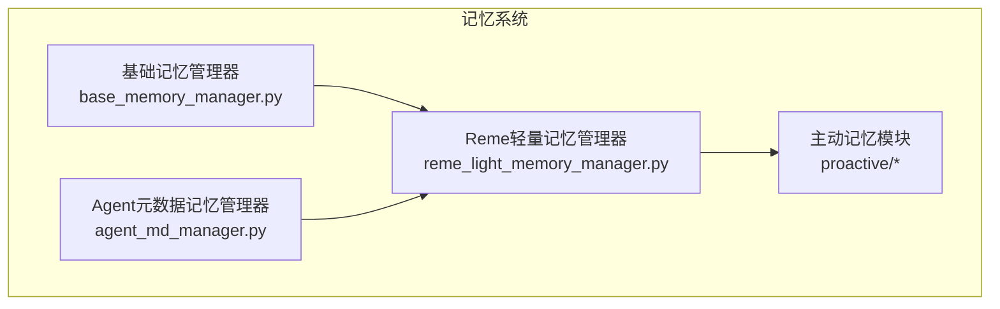
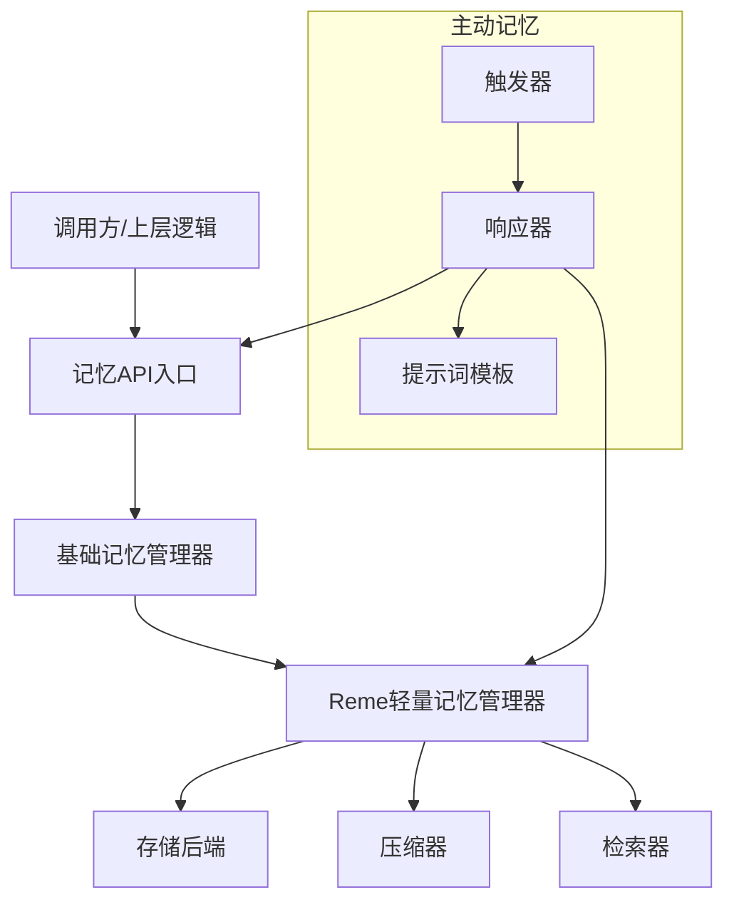
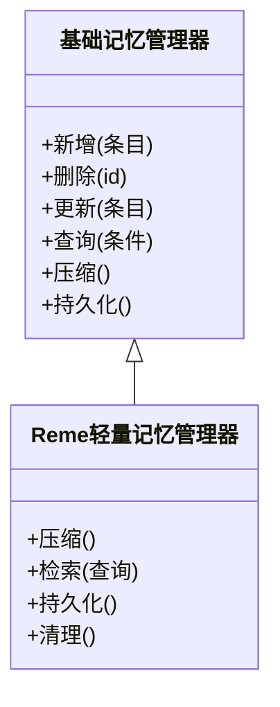
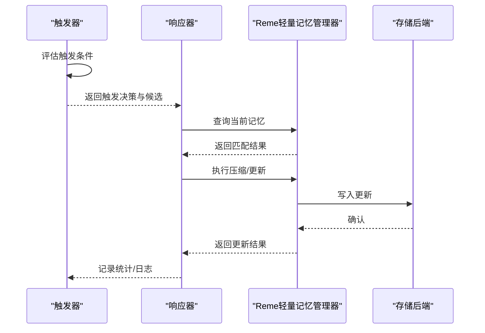
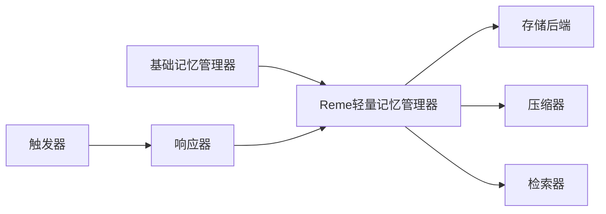

# 记忆管理系统

<cite>
**本文引用的文件**
- [base_memory_manager.py](file://src/qwenpaw/agents/memory/base_memory_manager.py)
- [reme_light_memory_manager.py](file://src/qwenpaw/agents/memory/reme_light_memory_manager.py)
- [proactive_trigger.py](file://src/qwenpaw/agents/memory/proactive/proactive_trigger.py)
- [proactive_responder.py](file://src/qwenpaw/agents/memory/proactive/proactive_responder.py)
- [proactive_prompts.py](file://src/qwenpaw/agents/memory/proactive/proactive_prompts.py)
- [proactive_types.py](file://src/qwenpaw/agents/memory/proactive/proactive_types.py)
- [proactive_utils.py](file://src/qwenpaw/agents/memory/proactive/proactive_utils.py)
- [agent_md_manager.py](file://src/qwenpaw/agents/memory/agent_md_manager.py)
</cite>

## 目录
1. [引言](#引言)
2. [项目结构](#项目结构)
3. [核心组件](#核心组件)
4. [架构总览](#架构总览)
5. [详细组件分析](#详细组件分析)
6. [依赖关系分析](#依赖关系分析)
7. [性能考量](#性能考量)
8. [故障排查指南](#故障排查指南)
9. [结论](#结论)
10. [附录](#附录)

## 引言
本文件系统性阐述QwenPaw中的记忆管理系统，重点覆盖以下方面：
- 记忆分类与管理策略：短期记忆、长期记忆与主动记忆的职责边界与协作方式
- Reme轻量级记忆管理器的实现原理：记忆压缩、检索优化与存储策略
- 主动记忆触发机制与记忆更新策略
- 记忆配置最佳实践：容量管理、清理策略与性能优化
- 扩展与自定义：如何基于现有接口扩展或替换存储后端

## 项目结构
记忆系统位于agents子模块下，采用“基础抽象 + 轻量实现 + 主动记忆增强”的分层设计：
- 基础抽象层：定义统一的记忆管理接口与行为规范
- 轻量实现层：提供开箱即用的记忆压缩、检索与持久化能力
- 主动记忆层：通过触发器、响应器与提示词模板驱动记忆的主动更新与检索
- 辅助管理：针对Agent元数据的记忆管理器

图表来源
- [base_memory_manager.py](file://src/qwenpaw/agents/memory/base_memory_manager.py)
- [reme_light_memory_manager.py](file://src/qwenpaw/agents/memory/reme_light_memory_manager.py)
- [proactive_trigger.py](file://src/qwenpaw/agents/memory/proactive/proactive_trigger.py)
- [proactive_responder.py](file://src/qwenpaw/agents/memory/proactive/proactive_responder.py)
- [agent_md_manager.py](file://src/qwenpaw/agents/memory/agent_md_manager.py)

章节来源
- [base_memory_manager.py](file://src/qwenpaw/agents/memory/base_memory_manager.py)
- [reme_light_memory_manager.py](file://src/qwenpaw/agents/memory/reme_light_memory_manager.py)
- [proactive_trigger.py](file://src/qwenpaw/agents/memory/proactive/proactive_trigger.py)
- [proactive_responder.py](file://src/qwenpaw/agents/memory/proactive/proactive_responder.py)
- [agent_md_manager.py](file://src/qwenpaw/agents/memory/agent_md_manager.py)

## 核心组件
- 基础记忆管理器（抽象层）
  - 定义记忆的增删改查、压缩、检索与持久化等通用接口
  - 规范记忆条目的结构与生命周期管理
- Reme轻量记忆管理器（实现层）
  - 提供面向对话上下文的压缩与检索能力
  - 支持按主题/会话维度组织记忆，兼顾吞吐与延迟
- 主动记忆模块（增强层）
  - 触发器：周期性或事件驱动地评估是否需要主动更新记忆
  - 响应器：根据触发结果生成更新请求并执行
  - 提示词与工具：封装主动更新所需的提示工程与工具调用
- Agent元数据记忆管理器
  - 管理与Agent相关的元信息与状态，作为长期记忆的一部分

章节来源
- [base_memory_manager.py](file://src/qwenpaw/agents/memory/base_memory_manager.py)
- [reme_light_memory_manager.py](file://src/qwenpaw/agents/memory/reme_light_memory_manager.py)
- [proactive_trigger.py](file://src/qwenpaw/agents/memory/proactive/proactive_trigger.py)
- [proactive_responder.py](file://src/qwenpaw/agents/memory/proactive/proactive_responder.py)
- [agent_md_manager.py](file://src/qwenpaw/agents/memory/agent_md_manager.py)

## 架构总览
整体架构以“抽象接口 + 轻量实现 + 主动增强”为主线，强调可插拔与可扩展性。

图表来源
- [base_memory_manager.py](file://src/qwenpaw/agents/memory/base_memory_manager.py)
- [reme_light_memory_manager.py](file://src/qwenpaw/agents/memory/reme_light_memory_manager.py)
- [proactive_trigger.py](file://src/qwenpaw/agents/memory/proactive/proactive_trigger.py)
- [proactive_responder.py](file://src/qwenpaw/agents/memory/proactive/proactive_responder.py)
- [proactive_prompts.py](file://src/qwenpaw/agents/memory/proactive/proactive_prompts.py)

## 详细组件分析

### 基础记忆管理器（抽象层）
- 职责
  - 统一定义记忆条目结构、生命周期与操作契约
  - 抽象压缩、检索与持久化策略，便于替换实现
- 关键点
  - 条目标识、时间戳、权重、主题标签等字段约定
  - 增删改查接口与批量操作支持
  - 与上层调用解耦，便于接入不同存储后端

章节来源
- [base_memory_manager.py](file://src/qwenpaw/agents/memory/base_memory_manager.py)

### Reme轻量记忆管理器（实现层）
- 设计理念
  - 面向对话上下文的轻量压缩与检索，降低大模型输入负担
  - 通过主题/会话维度组织记忆，提升相关性与召回效率
- 实现要点
  - 压缩策略：合并相似条目、裁剪冗余信息、保留关键语义
  - 检索策略：基于主题标签与关键词的向量化/关键词混合检索
  - 存储策略：内存优先，必要时落盘；支持增量写入与事务式更新
- 性能特征
  - 写入：O(1) 或 O(log N) 的插入与更新
  - 检索：基于索引的快速匹配，支持近似最近邻检索
  - 清理：基于容量阈值与时间衰减的淘汰策略

图表来源
- [base_memory_manager.py](file://src/qwenpaw/agents/memory/base_memory_manager.py)
- [reme_light_memory_manager.py](file://src/qwenpaw/agents/memory/reme_light_memory_manager.py)

章节来源
- [reme_light_memory_manager.py](file://src/qwenpaw/agents/memory/reme_light_memory_manager.py)

### 主动记忆模块
- 触发机制
  - 周期性触发：定时任务评估是否需要更新记忆
  - 事件触发：消息流、技能调用、外部信号等事件驱动
  - 动态阈值：基于上下文复杂度与历史交互频率调整触发频率
- 更新流程
  - 触发器输出触发决策与候选条目
  - 响应器根据决策生成更新请求，调用检索与压缩
  - 将更新后的记忆写回存储，保持一致性

图表来源
- [proactive_trigger.py](file://src/qwenpaw/agents/memory/proactive/proactive_trigger.py)
- [proactive_responder.py](file://src/qwenpaw/agents/memory/proactive/proactive_responder.py)
- [reme_light_memory_manager.py](file://src/qwenpaw/agents/memory/reme_light_memory_manager.py)

章节来源
- [proactive_trigger.py](file://src/qwenpaw/agents/memory/proactive/proactive_trigger.py)
- [proactive_responder.py](file://src/qwenpaw/agents/memory/proactive/proactive_responder.py)
- [proactive_prompts.py](file://src/qwenpaw/agents/memory/proactive/proactive_prompts.py)
- [proactive_types.py](file://src/qwenpaw/agents/memory/proactive/proactive_types.py)
- [proactive_utils.py](file://src/qwenpaw/agents/memory/proactive/proactive_utils.py)

### Agent元数据记忆管理器
- 职责
  - 管理Agent的元信息（如角色设定、技能列表、工作区配置等）
  - 作为长期记忆的一部分，参与上下文构建与个性化
- 特性
  - 结构化存储与版本控制
  - 与Reme记忆管理器协同，确保元信息与对话记忆的一致性

章节来源
- [agent_md_manager.py](file://src/qwenpaw/agents/memory/agent_md_manager.py)

## 依赖关系分析
- 组件内聚与耦合
  - 基础抽象层提供稳定接口，实现层与主动层均依赖该接口
  - 主动层通过触发器与响应器与实现层解耦，便于独立演进
- 外部依赖
  - 存储后端：可替换为内存、文件或数据库实现
  - 检索引擎：可替换为关键词检索或向量检索
- 循环依赖
  - 当前结构无循环依赖，接口清晰

图表来源
- [base_memory_manager.py](file://src/qwenpaw/agents/memory/base_memory_manager.py)
- [reme_light_memory_manager.py](file://src/qwenpaw/agents/memory/reme_light_memory_manager.py)
- [proactive_trigger.py](file://src/qwenpaw/agents/memory/proactive/proactive_trigger.py)
- [proactive_responder.py](file://src/qwenpaw/agents/memory/proactive/proactive_responder.py)

章节来源
- [base_memory_manager.py](file://src/qwenpaw/agents/memory/base_memory_manager.py)
- [reme_light_memory_manager.py](file://src/qwenpaw/agents/memory/reme_light_memory_manager.py)
- [proactive_trigger.py](file://src/qwenpaw/agents/memory/proactive/proactive_trigger.py)
- [proactive_responder.py](file://src/qwenpaw/agents/memory/proactive/proactive_responder.py)

## 性能考量
- 压缩策略
  - 合并相似条目、裁剪冗余字段、保留关键语义
  - 控制单条目大小与总容量，避免检索膨胀
- 检索优化
  - 建立主题/标签索引，支持快速过滤
  - 混合检索：关键词 + 向量近似检索，平衡准确率与速度
- 存储与缓存
  - 内存优先，定期刷盘；对热点条目做缓存
  - 批量写入与事务式更新，减少IO抖动
- 主动记忆频率
  - 动态阈值与退避策略，避免频繁更新导致的抖动
- 清理策略
  - 基于容量上限与时间衰减的淘汰
  - 对低价值条目进行降权与延迟清理

## 故障排查指南
- 常见问题
  - 记忆未生效：检查触发器是否正确评估、响应器是否执行更新
  - 检索结果不相关：检查检索索引与提示词模板是否匹配
  - 写入失败：确认存储后端可用性与权限，查看事务回滚日志
- 排查步骤
  - 开启调试日志，定位触发器输出与响应器执行路径
  - 校验压缩与检索参数，逐步缩小范围
  - 对比历史版本，确认变更影响面
- 建议
  - 在测试环境模拟高并发场景，验证压缩与清理策略
  - 对关键路径增加监控指标（写入耗时、检索命中率、容量使用）

章节来源
- [proactive_trigger.py](file://src/qwenpaw/agents/memory/proactive/proactive_trigger.py)
- [proactive_responder.py](file://src/qwenpaw/agents/memory/proactive/proactive_responder.py)
- [reme_light_memory_manager.py](file://src/qwenpaw/agents/memory/reme_light_memory_manager.py)

## 结论
QwenPaw的记忆系统通过“抽象 + 轻量实现 + 主动增强”的架构，在保证易用性的同时提供了良好的扩展性。Reme轻量记忆管理器在压缩与检索之间取得平衡，主动记忆模块则进一步提升了系统的自适应能力。结合合理的容量与清理策略，可在多变的业务场景中稳定运行。

## 附录
- 最佳实践清单
  - 明确短期/长期/主动记忆的边界，避免重复存储
  - 为存储后端选择合适的索引与压缩算法
  - 使用动态阈值与退避策略控制主动更新频率
  - 定期评估检索命中率与容量使用，持续优化参数
- 扩展与自定义建议
  - 自定义存储后端：实现基础接口，确保事务与并发安全
  - 替换检索引擎：保持检索签名一致，适配新的索引结构
  - 新增触发策略：在触发器中扩展评估逻辑，注意与响应器的契约一致