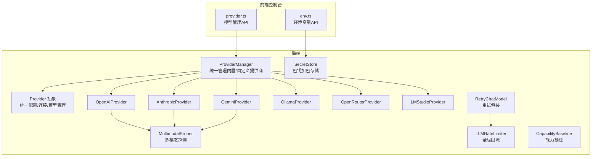
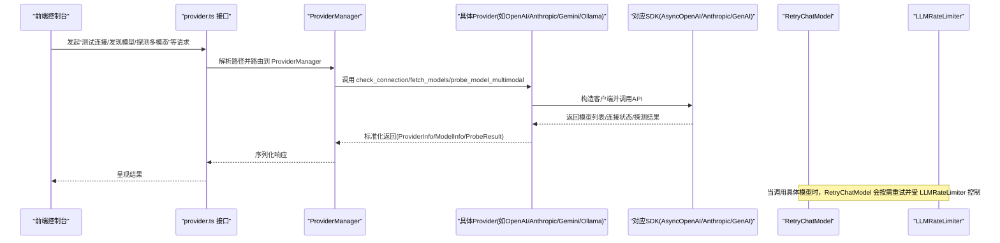
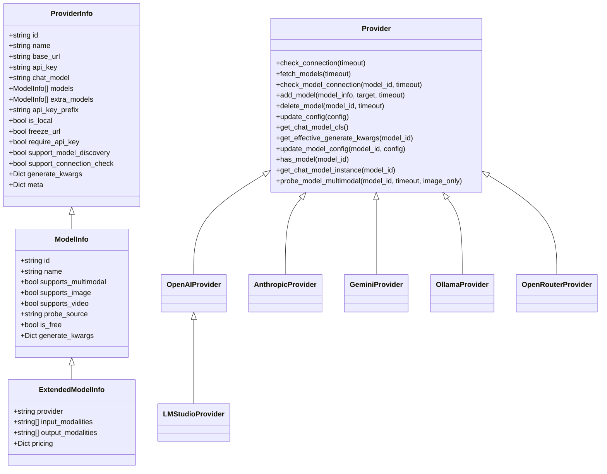
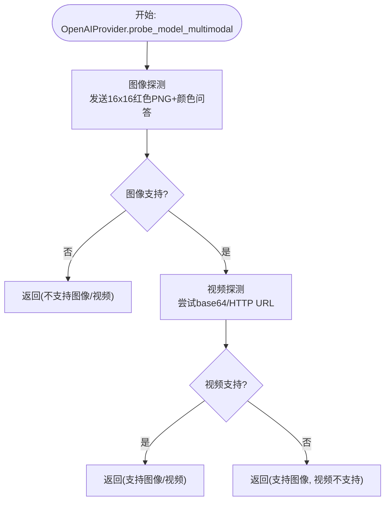
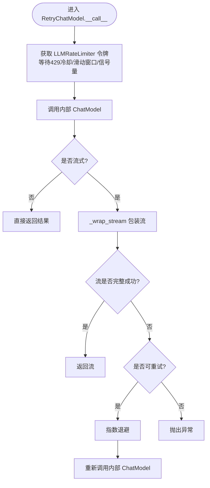
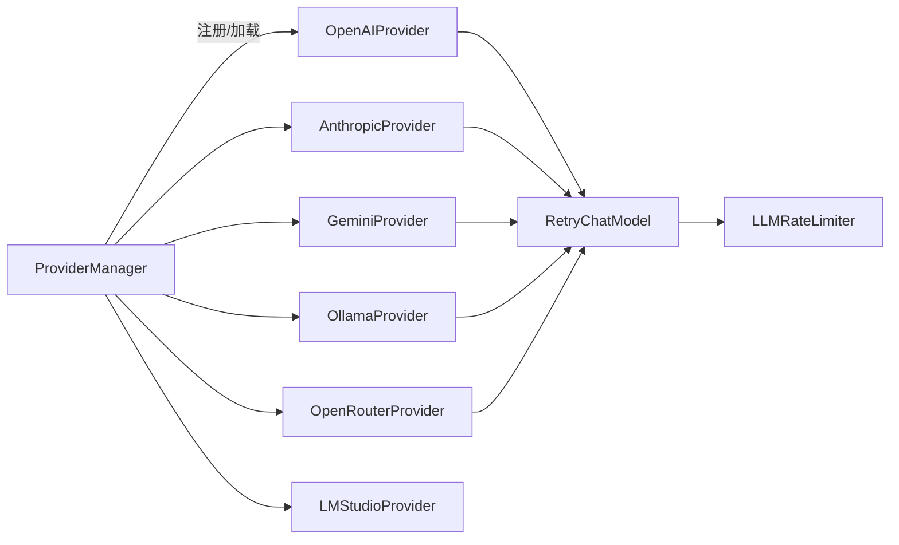

# 云端模型集成

<cite>
**本文引用的文件**
- [provider.py](file://src/qwenpaw/providers/provider.py)
- [provider_manager.py](file://src/qwenpaw/providers/provider_manager.py)
- [openai_provider.py](file://src/qwenpaw/providers/openai_provider.py)
- [anthropic_provider.py](file://src/qwenpaw/providers/anthropic_provider.py)
- [gemini_provider.py](file://src/qwenpaw/providers/gemini_provider.py)
- [ollama_provider.py](file://src/qwenpaw/providers/ollama_provider.py)
- [openrouter_provider.py](file://src/qwenpaw/providers/openrouter_provider.py)
- [lmstudio_provider.py](file://src/qwenpaw/providers/lmstudio_provider.py)
- [multimodal_prober.py](file://src/qwenpaw/providers/multimodal_prober.py)
- [retry_chat_model.py](file://src/qwenpaw/providers/retry_chat_model.py)
- [rate_limiter.py](file://src/qwenpaw/providers/rate_limiter.py)
- [capability_baseline.py](file://src/qwenpaw/providers/capability_baseline.py)
- [constant.py](file://src/qwenpaw/constant.py)
- [secret_store.py](file://src/qwenpaw/security/secret_store.py)
- [provider.ts](file://console/src/api/modules/provider.ts)
- [env.ts](file://console/src/api/modules/env.ts)
</cite>

## 目录
1. [简介](#简介)
2. [项目结构](#项目结构)
3. [核心组件](#核心组件)
4. [架构总览](#架构总览)
5. [详细组件分析](#详细组件分析)
6. [依赖分析](#依赖分析)
7. [性能考虑](#性能考虑)
8. [故障排查指南](#故障排查指南)
9. [结论](#结论)
10. [附录](#附录)

## 简介
本文件面向云端模型提供商的集成与使用，系统性梳理了 OpenAI、Anthropic、Google Gemini、Ollama 等主流提供商的接入方式、认证机制、API 限制与性能特征；同时给出模型参数映射、响应格式标准化、错误处理策略、密钥管理、请求重试与超时配置、以及跨提供商的能力对比、选型标准与迁移策略。文档以代码为依据，辅以图示帮助读者快速定位实现细节。

## 项目结构
该仓库采用“后端 Python 包 + 前端控制台”的分层设计：
- 后端核心位于 src/qwenpaw/providers，提供统一 Provider 抽象、各提供商适配器、重试与限流、多模态探测、能力基线与密钥存储等能力。
- 前端控制台位于 console/src/api，提供与后端模型管理接口的对接（如列出提供商、测试连接、发现模型、探测多模态等）。

**图表来源**
- [provider_manager.py:720-800](file://src/qwenpaw/providers/provider_manager.py#L720-L800)
- [provider.py:147-368](file://src/qwenpaw/providers/provider.py#L147-L368)
- [openai_provider.py:39-518](file://src/qwenpaw/providers/openai_provider.py#L39-L518)
- [anthropic_provider.py:29-270](file://src/qwenpaw/providers/anthropic_provider.py#L29-L270)
- [gemini_provider.py:29-319](file://src/qwenpaw/providers/gemini_provider.py#L29-L319)
- [ollama_provider.py:13-73](file://src/qwenpaw/providers/ollama_provider.py#L13-L73)
- [openrouter_provider.py:19-345](file://src/qwenpaw/providers/openrouter_provider.py#L19-L345)
- [lmstudio_provider.py:7-20](file://src/qwenpaw/providers/lmstudio_provider.py#L7-L20)
- [multimodal_prober.py:75-162](file://src/qwenpaw/providers/multimodal_prober.py#L75-L162)
- [retry_chat_model.py:204-477](file://src/qwenpaw/providers/retry_chat_model.py#L204-L477)
- [rate_limiter.py:30-279](file://src/qwenpaw/providers/rate_limiter.py#L30-L279)
- [capability_baseline.py:55-702](file://src/qwenpaw/providers/capability_baseline.py#L55-L702)
- [secret_store.py:34-334](file://src/qwenpaw/security/secret_store.py#L34-L334)
- [provider.ts:41-173](file://console/src/api/modules/provider.ts#L41-L173)
- [env.ts:4-19](file://console/src/api/modules/env.ts#L4-L19)

**章节来源**
- [provider_manager.py:720-800](file://src/qwenpaw/providers/provider_manager.py#L720-L800)
- [provider.py:147-368](file://src/qwenpaw/providers/provider.py#L147-L368)
- [provider.ts:41-173](file://console/src/api/modules/provider.ts#L41-L173)

## 核心组件
- Provider 抽象与模型信息：定义统一的 ProviderInfo、ModelInfo、ExtendedModelInfo，支持生成参数合并、模型增删、连接检查、模型探测等通用能力。
- 提供商适配器：OpenAI、Anthropic、Google Gemini、Ollama、OpenRouter、LM Studio 等，封装各自 SDK、认证头、模型列表、连接检查、多模态探测与实例化。
- 多模态探测：统一的 ProbeResult 结构与共享探测常量，对图像/视频输入进行一致性验证，避免“静默接受媒体但不处理”的误判。
- 重试与限流：RetryChatModel 对 ChatModelBase 进行透明重试包装，结合 LLMRateLimiter 实现并发、QPM 与 429 全局暂停协调。
- 能力基线：记录官方文档标注的期望能力，用于对比实际探测结果，生成差异报告。
- 密钥存储：基于 Fernet 的透明加解密，优先使用系统钥匙串，回退到本地文件，确保敏感字段安全持久化。
- 常量与配置：集中管理 LLM 重试、限流、超时等运行时参数，支持通过环境变量覆盖。

**章节来源**
- [provider.py:18-368](file://src/qwenpaw/providers/provider.py#L18-L368)
- [multimodal_prober.py:75-162](file://src/qwenpaw/providers/multimodal_prober.py#L75-L162)
- [retry_chat_model.py:204-477](file://src/qwenpaw/providers/retry_chat_model.py#L204-L477)
- [rate_limiter.py:30-279](file://src/qwenpaw/providers/rate_limiter.py#L30-L279)
- [capability_baseline.py:55-702](file://src/qwenpaw/providers/capability_baseline.py#L55-L702)
- [secret_store.py:34-334](file://src/qwenpaw/security/secret_store.py#L34-L334)
- [constant.py:232-295](file://src/qwenpaw/constant.py#L232-L295)

## 架构总览
下图展示从前端发起模型管理请求到后端执行提供商适配器与重试/限流的整体流程。

**图表来源**
- [provider.ts:41-173](file://console/src/api/modules/provider.ts#L41-L173)
- [provider_manager.py:789-800](file://src/qwenpaw/providers/provider_manager.py#L789-L800)
- [openai_provider.py:71-137](file://src/qwenpaw/providers/openai_provider.py#L71-L137)
- [anthropic_provider.py:68-129](file://src/qwenpaw/providers/anthropic_provider.py#L68-L129)
- [gemini_provider.py:70-133](file://src/qwenpaw/providers/gemini_provider.py#L70-L133)
- [ollama_provider.py:51-61](file://src/qwenpaw/providers/ollama_provider.py#L51-L61)
- [retry_chat_model.py:269-354](file://src/qwenpaw/providers/retry_chat_model.py#L269-L354)
- [rate_limiter.py:70-110](file://src/qwenpaw/providers/rate_limiter.py#L70-L110)

## 详细组件分析

### Provider 抽象与模型信息
- 统一配置：ProviderInfo 包含 id、name、base_url、api_key、chat_model、models、extra_models、api_key_prefix、is_local、freeze_url、require_api_key、support_model_discovery、support_connection_check、generate_kwargs、meta 等字段。
- 模型信息：ModelInfo/ExtendedModelInfo 支持 supports_multimodal、supports_image、supports_video、probe_source、is_free、generate_kwargs、provider/input_modalities/output_modalities/pricing 等。
- 通用能力：
  - 连接检查：check_connection(timeout)
  - 模型发现：fetch_models(timeout)
  - 单模型连接检查：check_model_connection(model_id, timeout)
  - 模型增删：add_model/delete_model
  - 配置更新：update_config、update_model_config
  - 参数合并：get_effective_generate_kwargs（provider 层级 + 模型层级深合并）
  - 多模态探测：probe_model_multimodal（默认返回空结果，子类可覆盖）

**图表来源**
- [provider.py:75-368](file://src/qwenpaw/providers/provider.py#L75-L368)

**章节来源**
- [provider.py:75-368](file://src/qwenpaw/providers/provider.py#L75-L368)

### OpenAI 及兼容提供商（OpenAI/OpenRouter/Aliyun/DashScope 等）
- 认证与客户端：使用 AsyncOpenAI，支持 base_url、api_key、timeout，默认注入特定头部（如 DashScope 场景）。
- 连接检查：调用 models.list() 并捕获 APIError。
- 模型发现：解析 payload.data，去重并标准化为 ModelInfo。
- 单模型连接检查：发送最小聊天请求并消费流以验证可用性。
- 多模态探测：图像/视频探测均采用两阶段验证（拒绝即否定，接受后语义校验），避免“静默接受媒体但不处理”的误判。
- 实例化：返回 OpenAIChatModelCompat，支持流式与工具调用解析配置。

**图表来源**
- [openai_provider.py:177-218](file://src/qwenpaw/providers/openai_provider.py#L177-L218)
- [openai_provider.py:219-318](file://src/qwenpaw/providers/openai_provider.py#L219-L318)
- [openai_provider.py:320-442](file://src/qwenpaw/providers/openai_provider.py#L320-L442)
- [multimodal_prober.py:75-162](file://src/qwenpaw/providers/multimodal_prober.py#L75-L162)

**章节来源**
- [openai_provider.py:39-518](file://src/qwenpaw/providers/openai_provider.py#L39-L518)
- [multimodal_prober.py:75-162](file://src/qwenpaw/providers/multimodal_prober.py#L75-L162)

### Anthropic 提供商
- 客户端：AsyncAnthropic，支持 models.list() 获取模型列表。
- 连接检查：messages.create 流式调用以验证可用性。
- 多模态探测：仅支持图像（基于 base64 图像源），视频固定为不支持。
- 实例化：返回 AnthropicChatModel。

**章节来源**
- [anthropic_provider.py:29-270](file://src/qwenpaw/providers/anthropic_provider.py#L29-L270)

### Google Gemini 提供商
- 客户端：genai.Client，异步 models.list() 获取模型。
- 连接检查：generate_content_stream 验证可用性。
- 多模态探测：图像使用 inline_data，视频使用 file_data + URL，均进行语义校验。
- 实例化：返回 GeminiChatModel。

**章节来源**
- [gemini_provider.py:29-319](file://src/qwenpaw/providers/gemini_provider.py#L29-L319)

### Ollama 与 LM Studio（本地）
- Ollama：通过 OpenAI 兼容端点（/v1）访问，自动规范化 base_url，支持动态模型发现与单模型可达性检查。
- LM Studio：继承 OpenAIProvider，模型可达性检查基于已发现模型列表比对。

**章节来源**
- [ollama_provider.py:13-73](file://src/qwenpaw/providers/ollama_provider.py#L13-L73)
- [lmstudio_provider.py:7-20](file://src/qwenpaw/providers/lmstudio_provider.py#L7-L20)

### OpenRouter 提供商
- 特殊头部：HTTP-Referer、X-Title、User-Agent 必填。
- 模型发现：解析数据并提取 provider、input_modalities、output_modalities、pricing，支持 ExtendedModelInfo。
- 过滤：按 provider、输入/输出模态、最大提示价格、是否免费进行过滤。
- 实例化：返回 OpenAIChatModelCompat。

**章节来源**
- [openrouter_provider.py:19-345](file://src/qwenpaw/providers/openrouter_provider.py#L19-L345)

### 多模态探测与能力基线
- 探测统一：共享 ProbeResult、探测图片/视频的二进制载荷与提示词，避免小尺寸或特定格式导致的误判。
- 能力基线：记录官方文档标注的期望能力，对比实际探测结果，生成差异日志与汇总报告。

**章节来源**
- [multimodal_prober.py:75-162](file://src/qwenpaw/providers/multimodal_prober.py#L75-L162)
- [capability_baseline.py:55-702](file://src/qwenpaw/providers/capability_baseline.py#L55-L702)

### 重试与限流（RetryChatModel 与 LLMRateLimiter）
- RetryChatModel：
  - 对非流式与流式调用分别处理，流式失败整包重试。
  - 支持指数退避、状态码 429/500/502/503/504/529 重试。
  - 读取 SDK 异常中的 Retry-After 头部，优先使用。
- LLMRateLimiter：
  - 全局信号量控制并发。
  - 60 秒滑动窗口控制 QPM。
  - 429 时设置全局暂停时间，配合抖动避免“惊群”。

**图表来源**
- [retry_chat_model.py:269-354](file://src/qwenpaw/providers/retry_chat_model.py#L269-L354)
- [retry_chat_model.py:357-476](file://src/qwenpaw/providers/retry_chat_model.py#L357-L476)
- [rate_limiter.py:70-110](file://src/qwenpaw/providers/rate_limiter.py#L70-L110)
- [rate_limiter.py:112-144](file://src/qwenpaw/providers/rate_limiter.py#L112-L144)

**章节来源**
- [retry_chat_model.py:204-477](file://src/qwenpaw/providers/retry_chat_model.py#L204-L477)
- [rate_limiter.py:30-279](file://src/qwenpaw/providers/rate_limiter.py#L30-L279)

### 密钥管理与安全
- 加密存储：Fernet(AES-128-CBC + HMAC-SHA256)，主密钥优先来自系统钥匙串，回退到 SECRET_DIR/.master_key。
- 字段加密：对 Provider 的 api_key 等敏感字段进行透明加解密。
- 前端环境变量：通过 /envs 接口批量读写环境变量，便于注入 API Key 等配置。

**章节来源**
- [secret_store.py:34-334](file://src/qwenpaw/security/secret_store.py#L34-L334)
- [env.ts:4-19](file://console/src/api/modules/env.ts#L4-L19)

## 依赖分析
- ProviderManager 负责内置与自定义提供商的注册、持久化与初始化，统一对外暴露 ProviderInfo 列表与操作入口。
- 各 Provider 适配器在统一抽象之上实现差异化逻辑，保证上层调用的一致性。
- 重试与限流作为横切关注点，通过包装器与全局单例实现，降低对业务代码侵入。

**图表来源**
- [provider_manager.py:720-800](file://src/qwenpaw/providers/provider_manager.py#L720-L800)
- [retry_chat_model.py:204-477](file://src/qwenpaw/providers/retry_chat_model.py#L204-L477)
- [rate_limiter.py:30-279](file://src/qwenpaw/providers/rate_limiter.py#L30-L279)

**章节来源**
- [provider_manager.py:720-800](file://src/qwenpaw/providers/provider_manager.py#L720-L800)

## 性能考虑
- 超时与重试：通过 MODEL_PROVIDER_CHECK_TIMEOUT 控制提供商可达性检查超时；LLM_MAX_RETRIES、LLM_BACKOFF_BASE/LLM_BACKOFF_CAP 控制重试策略；LLM_MAX_CONCURRENT、LLM_MAX_QPM、LLM_RATE_LIMIT_PAUSE、LLM_RATE_LIMIT_JITTER、LLM_ACQUIRE_TIMEOUT 控制并发与速率限制。
- 并发与 QPM：LLMRateLimiter 使用滑动窗口与信号量，避免突发流量触发 429。
- 流式传输：流式失败整包重试，减少中间态开销；首块到达后释放信号量，避免长时间占用。
- 多模态探测：探测采用最小载荷与严格语义校验，避免不必要的大体积请求与误判。

**章节来源**
- [constant.py:168-295](file://src/qwenpaw/constant.py#L168-L295)
- [retry_chat_model.py:204-477](file://src/qwenpaw/providers/retry_chat_model.py#L204-L477)
- [rate_limiter.py:30-279](file://src/qwenpaw/providers/rate_limiter.py#L30-L279)

## 故障排查指南
- 连接失败：
  - 检查 base_url 与 api_key 是否正确配置，必要时冻结/解冻 URL。
  - 使用 /models/{providerId}/test 或 /models/{providerId}/models/test 验证提供商与单模型连通性。
- 多模态误判：
  - 若出现“API 拒绝媒体但模型仍接受”的情况，确认使用的是带语义校验的探测方法。
- 429 与限流：
  - 调整 LLM_MAX_CONCURRENT、LLM_MAX_QPM、LLM_RATE_LIMIT_PAUSE、LLM_RATE_LIMIT_JITTER，观察 LLMRateLimiter 统计。
- 重试无效：
  - 确认异常类型是否属于可重试集合；检查 Retry-After 头部是否被正确解析。
- 密钥问题：
  - 检查 SECRET_DIR/.master_key 与系统钥匙串状态；必要时通过 reload_master_key_from_disk 重载主密钥。

**章节来源**
- [provider.ts:114-146](file://console/src/api/modules/provider.ts#L114-L146)
- [retry_chat_model.py:124-161](file://src/qwenpaw/providers/retry_chat_model.py#L124-L161)
- [rate_limiter.py:152-174](file://src/qwenpaw/providers/rate_limiter.py#L152-L174)
- [secret_store.py:249-290](file://src/qwenpaw/security/secret_store.py#L249-L290)

## 结论
本项目通过 Provider 抽象与多提供商适配器，实现了对 OpenAI、Anthropic、Google Gemini、Ollama、OpenRouter、LM Studio 等的统一接入；借助多模态探测、能力基线、重试与限流、密钥存储等机制，提供了高可靠、可观测且安全的云端模型集成方案。在实际应用中，建议根据场景选择合适的提供商与模型，结合探测结果与成本基线进行选型，并通过重试与限流策略保障稳定性与成本可控。

## 附录

### API 配置与认证要点
- OpenAI/兼容：支持 base_url、api_key、api_key_prefix；部分 DashScope 场景需要额外头部。
- Anthropic：支持 base_url、api_key；多模态探测仅图像。
- Gemini：支持 base_url、api_key；多模态探测图像/视频。
- Ollama/LM Studio：本地平台，通常无需 API Key，支持动态模型发现。

**章节来源**
- [openai_provider.py:42-47](file://src/qwenpaw/providers/openai_provider.py#L42-L47)
- [anthropic_provider.py:32-37](file://src/qwenpaw/providers/anthropic_provider.py#L32-L37)
- [gemini_provider.py:32-36](file://src/qwenpaw/providers/gemini_provider.py#L32-L36)
- [ollama_provider.py:25-49](file://src/qwenpaw/providers/ollama_provider.py#L25-L49)

### 模型参数映射与响应标准化
- Provider.get_effective_generate_kwargs：provider 层级参数与模型层级参数深合并，保证调用时的最终参数集。
- OpenRouter：ExtendedModelInfo 提供 provider、input_modalities、output_modalities、pricing 等扩展元数据，便于筛选与成本评估。

**章节来源**
- [provider.py:270-301](file://src/qwenpaw/providers/provider.py#L270-L301)
- [openrouter_provider.py:136-174](file://src/qwenpaw/providers/openrouter_provider.py#L136-L174)

### 错误处理策略
- 可重试异常：OpenAI/Anthropic SDK 的 RateLimitError、APITimeoutError、APIConnectionError；HTTP 状态码 429/500/502/503/504/529。
- 429 协调：LLMRateLimiter 全局暂停并叠加抖动，避免“惊群”。
- 降级与兜底：探测失败/不可判定时返回明确消息，避免静默失败。

**章节来源**
- [retry_chat_model.py:124-161](file://src/qwenpaw/providers/retry_chat_model.py#L124-L161)
- [rate_limiter.py:152-174](file://src/qwenpaw/providers/rate_limiter.py#L152-L174)

### 跨提供商能力对比与迁移策略
- 能力基线：基于官方文档标注的期望能力，对比实际探测结果，识别“漏检/误检”。
- 选型建议：
  - 需要图像/视频输入：OpenAI/Gemini/Ollama（动态发现）；Anthropic 仅图像。
  - 免费模型：OpenCode Zen 提供聚合，需通过探测或 ExtendedModelInfo 的 is_free 字段判断。
  - 成本控制：利用 OpenRouter 的 pricing 与 filter 接口，按最大提示价格与 provider 过滤。
- 迁移策略：
  - 保持 ProviderInfo/ModelInfo 结构不变，替换 chat_model 或 base_url 即可切换提供商。
  - 使用 get_effective_generate_kwargs 合并参数，减少迁移成本。
  - 通过多模态探测与能力基线，确保迁移前后功能一致。

**章节来源**
- [capability_baseline.py:627-702](file://src/qwenpaw/providers/capability_baseline.py#L627-L702)
- [openrouter_provider.py:231-290](file://src/qwenpaw/providers/openrouter_provider.py#L231-L290)