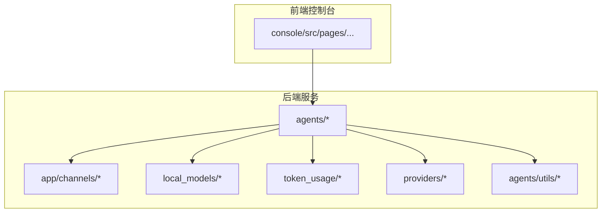
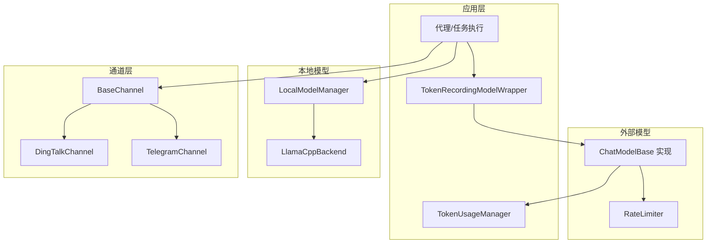
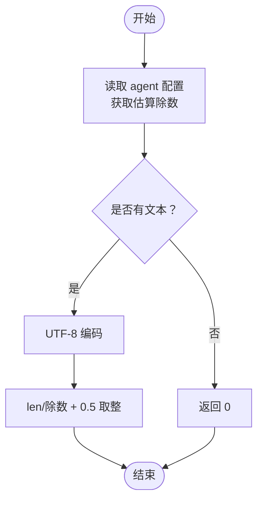
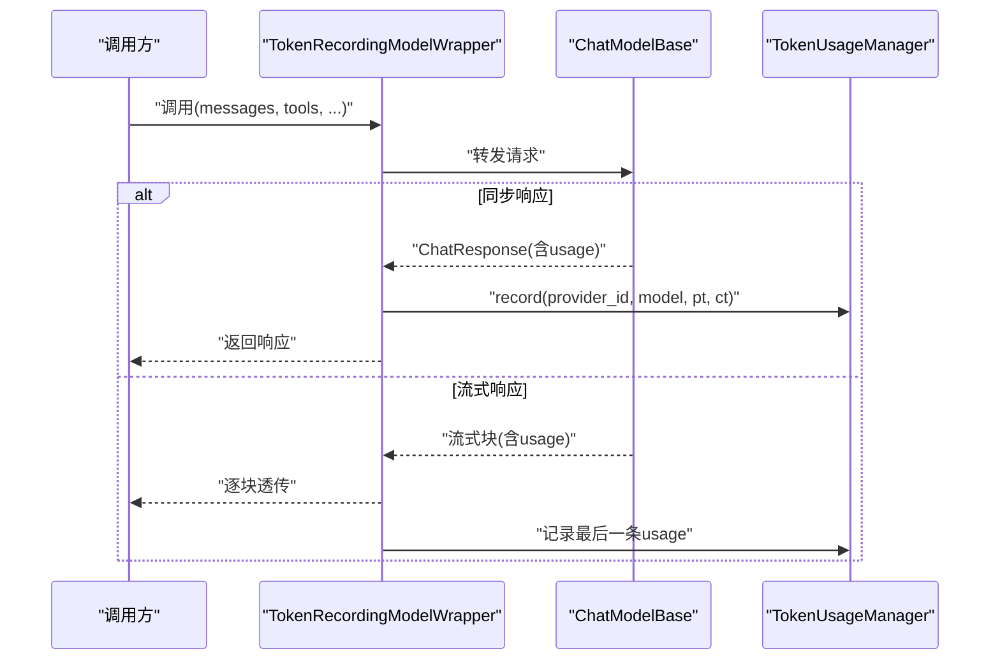
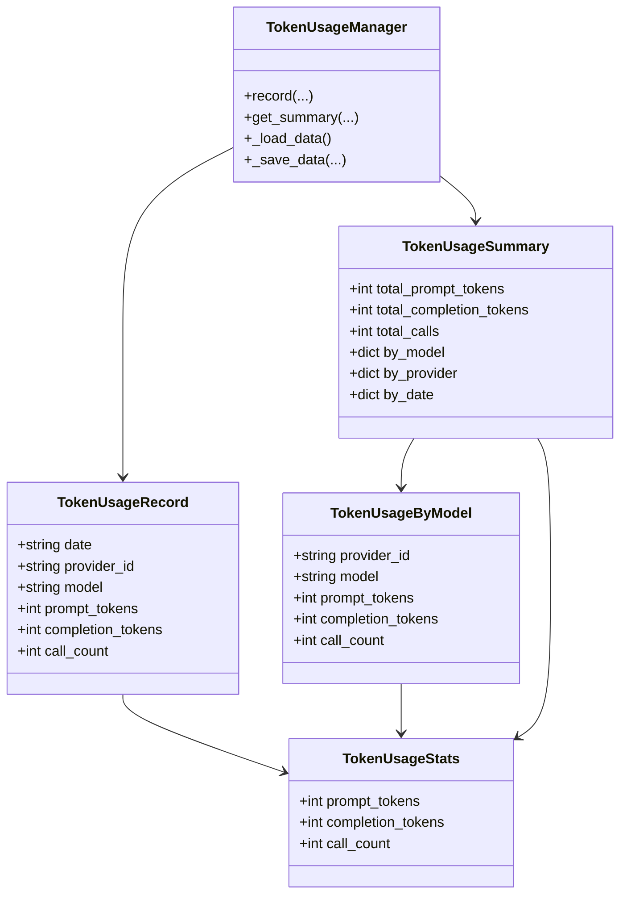
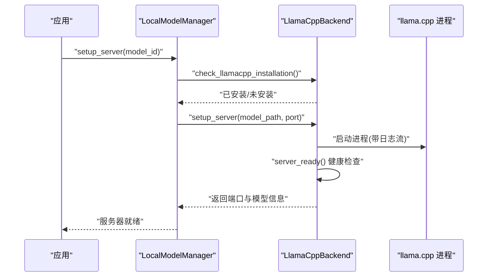
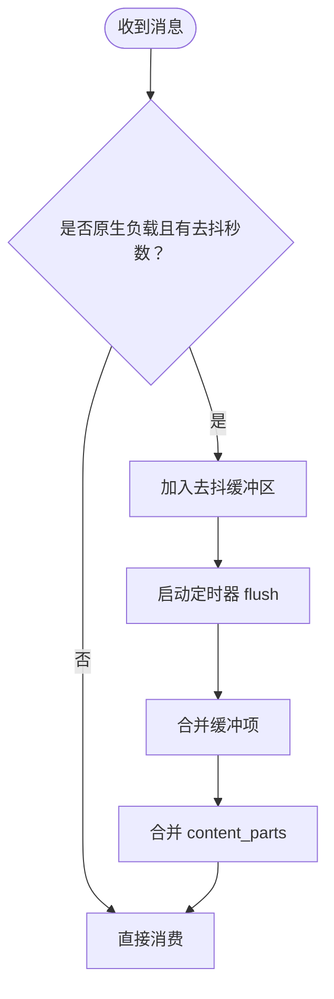
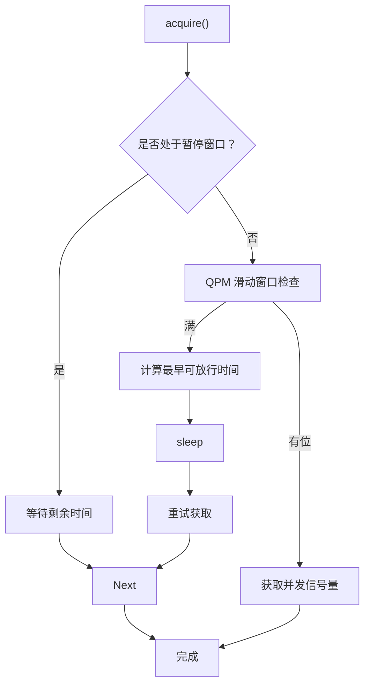
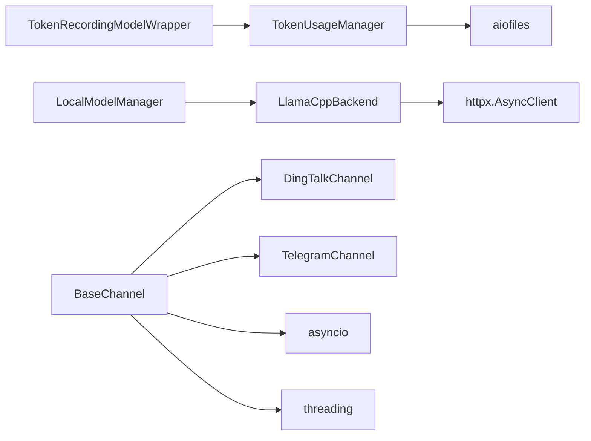

# 性能优化与监控

<cite>
**本文引用的文件**
- [src/qwenpaw/agents/utils/estimate_token_counter.py](file://src/qwenpaw/agents/utils/estimate_token_counter.py)
- [src/qwenpaw/agents/utils/token_counter.py](file://src/qwenpaw/agents/utils/token_counter.py)
- [src/qwenpaw/token_usage/model_wrapper.py](file://src/qwenpaw/token_usage/model_wrapper.py)
- [src/qwenpaw/token_usage/manager.py](file://src/qwenpaw/token_usage/manager.py)
- [src/qwenpaw/local_models/llamacpp.py](file://src/qwenpaw/local_models/llamacpp.py)
- [src/qwenpaw/local_models/manager.py](file://src/qwenpaw/local_models/manager.py)
- [src/qwenpaw/app/channels/base.py](file://src/qwenpaw/app/channels/base.py)
- [src/qwenpaw/app/channels/dingtalk/channel.py](file://src/qwenpaw/app/channels/dingtalk/channel.py)
- [src/qwenpaw/app/channels/telegram/channel.py](file://src/qwenpaw/app/channels/telegram/channel.py)
- [src/qwenpaw/providers/rate_limiter.py](file://src/qwenpaw/providers/rate_limiter.py)
- [tests/unit/local_models/test_llamacpp_backend.py](file://tests/unit/local_models/test_llamacpp_backend.py)
- [website/public/release-notes/v0.0.7.md](file://website/public/release-notes/v0.0.7.md)
</cite>

## 目录
1. [引言](#引言)
2. [项目结构](#项目结构)
3. [核心组件](#核心组件)
4. [架构总览](#架构总览)
5. [详细组件分析](#详细组件分析)
6. [依赖分析](#依赖分析)
7. [性能考量](#性能考量)
8. [故障排查指南](#故障排查指南)
9. [结论](#结论)
10. [附录](#附录)

## 引言
本文件面向模型系统性能优化与监控，围绕以下目标展开：令牌计数器的实现原理与使用方法（准确度优化、批量处理与缓存策略）、令牌使用量统计系统的架构设计（实时监控、历史数据分析与成本预测）、模型响应时间优化（预加载策略、连接池管理与异步处理）、内存使用优化（模型量化、缓存淘汰与垃圾回收策略）、性能基准测试与瓶颈识别、容量规划以及大规模部署的可扩展性与运维监控方案。

## 项目结构
本项目采用分层与模块化组织方式，前端控制台位于 console/，后端服务位于 src/qwenpaw/，包含代理运行时、通道适配、本地模型、令牌统计、速率限制等子系统；测试位于 tests/，发布说明位于 website/public/release-notes/。

图示来源
- [src/qwenpaw/agents/utils/token_counter.py:12-26](file://src/qwenpaw/agents/utils/token_counter.py#L12-L26)
- [src/qwenpaw/token_usage/model_wrapper.py:15-27](file://src/qwenpaw/token_usage/model_wrapper.py#L15-L27)
- [src/qwenpaw/local_models/manager.py:214-243](file://src/qwenpaw/local_models/manager.py#L214-L243)
- [src/qwenpaw/app/channels/base.py:697-801](file://src/qwenpaw/app/channels/base.py#L697-L801)

章节来源
- [src/qwenpaw/agents/utils/token_counter.py:12-26](file://src/qwenpaw/agents/utils/token_counter.py#L12-L26)
- [src/qwenpaw/token_usage/model_wrapper.py:15-27](file://src/qwenpaw/token_usage/model_wrapper.py#L15-L27)
- [src/qwenpaw/local_models/manager.py:214-243](file://src/qwenpaw/local_models/manager.py#L214-L243)
- [src/qwenpaw/app/channels/base.py:697-801](file://src/qwenpaw/app/channels/base.py#L697-L801)

## 核心组件
- 令牌计数器：基于字符长度估算 token 数量，支持按语言调整估算除数，适合轻量场景与快速预算。
- 模型包装器：在调用 ChatModelBase 前后拦截，记录 prompt/completion token 使用量，并按会话聚合。
- 令牌用量管理器：以日期为粒度持久化记录 provider、model 维度的 token 使用与调用次数，提供查询与汇总接口。
- 本地模型管理：封装 llama.cpp 服务器生命周期、下载与版本探测、设备列表查询、健康检查与日志流。
- 通道与消息合并：统一消息消费流程，支持去抖与批量合并，降低下游压力。
- 速率限制器：并发信号量与 QPM 滑动窗口，保障对外部服务调用的稳定性与公平性。

章节来源
- [src/qwenpaw/agents/utils/estimate_token_counter.py:7-39](file://src/qwenpaw/agents/utils/estimate_token_counter.py#L7-L39)
- [src/qwenpaw/token_usage/model_wrapper.py:15-100](file://src/qwenpaw/token_usage/model_wrapper.py#L15-L100)
- [src/qwenpaw/token_usage/manager.py:62-309](file://src/qwenpaw/token_usage/manager.py#L62-L309)
- [src/qwenpaw/local_models/llamacpp.py:51-312](file://src/qwenpaw/local_models/llamacpp.py#L51-L312)
- [src/qwenpaw/app/channels/base.py:697-801](file://src/qwenpaw/app/channels/base.py#L697-L801)
- [src/qwenpaw/providers/rate_limiter.py:43-136](file://src/qwenpaw/providers/rate_limiter.py#L43-L136)

## 架构总览
下图展示从模型调用到令牌统计与通道发送的整体链路，以及本地模型服务与速率限制的集成点。

图示来源
- [src/qwenpaw/token_usage/model_wrapper.py:61-100](file://src/qwenpaw/token_usage/model_wrapper.py#L61-L100)
- [src/qwenpaw/token_usage/manager.py:110-155](file://src/qwenpaw/token_usage/manager.py#L110-L155)
- [src/qwenpaw/providers/rate_limiter.py:70-136](file://src/qwenpaw/providers/rate_limiter.py#L70-L136)
- [src/qwenpaw/local_models/manager.py:214-243](file://src/qwenpaw/local_models/manager.py#L214-L243)
- [src/qwenpaw/local_models/llamacpp.py:217-312](file://src/qwenpaw/local_models/llamacpp.py#L217-L312)
- [src/qwenpaw/app/channels/base.py:697-801](file://src/qwenpaw/app/channels/base.py#L697-L801)
- [src/qwenpaw/app/channels/dingtalk/channel.py:638-690](file://src/qwenpaw/app/channels/dingtalk/channel.py#L638-L690)
- [src/qwenpaw/app/channels/telegram/channel.py:781-833](file://src/qwenpaw/app/channels/telegram/channel.py#L781-L833)

## 详细组件分析

### 令牌计数器与估算策略
- 实现要点
  - 基于字符编码长度与估算除数计算 token 数，避免昂贵的 tokenizer 调用。
  - 通过 agent 配置中的除数参数动态调整估算精度，中文/日文可用更小除数，英文可用更大除数。
- 准确度优化
  - 对于需要精确 token 的场景，建议切换到精确计数器或直接使用模型内置 tokenizer。
  - 在批量处理前对输入文本进行分段与去噪，减少误估偏差。
- 批量处理与缓存
  - 将多轮对话文本合并后一次性估算，减少重复计算。
  - 缓存近期会话的估算结果，命中则直接复用，未命中再重新估算。

图示来源
- [src/qwenpaw/agents/utils/token_counter.py:12-26](file://src/qwenpaw/agents/utils/token_counter.py#L12-L26)
- [src/qwenpaw/agents/utils/estimate_token_counter.py:27-39](file://src/qwenpaw/agents/utils/estimate_token_counter.py#L27-L39)

章节来源
- [src/qwenpaw/agents/utils/token_counter.py:12-26](file://src/qwenpaw/agents/utils/token_counter.py#L12-L26)
- [src/qwenpaw/agents/utils/estimate_token_counter.py:7-39](file://src/qwenpaw/agents/utils/estimate_token_counter.py#L7-L39)

### 模型调用与令牌统计包装器
- 功能概述
  - 包装任意 ChatModelBase，拦截同步与流式响应，提取 ChatUsage 中的 input_tokens 与 output_tokens 并记录。
  - 支持按会话聚合使用量，便于后续追踪与对账。
- 关键行为
  - 流式响应：逐块透传，仅在最后一块记录 usage。
  - 工具调用兼容：自动处理 tool_choice 与 vLLM 兼容性问题。
  - 会话绑定：通过当前会话 ID 存储最近一次使用量，便于上层查询。

图示来源
- [src/qwenpaw/token_usage/model_wrapper.py:61-100](file://src/qwenpaw/token_usage/model_wrapper.py#L61-L100)
- [src/qwenpaw/token_usage/manager.py:110-155](file://src/qwenpaw/token_usage/manager.py#L110-L155)

章节来源
- [src/qwenpaw/token_usage/model_wrapper.py:15-100](file://src/qwenpaw/token_usage/model_wrapper.py#L15-L100)
- [src/qwenpaw/token_usage/manager.py:62-309](file://src/qwenpaw/token_usage/manager.py#L62-L309)

### 令牌使用量统计系统
- 数据模型
  - TokenUsageStats：累计 prompt_tokens、completion_tokens、call_count。
  - TokenUsageRecord：按日期+provider:model 聚合的明细。
  - TokenUsageSummary：按模型、供应商、日期的汇总视图。
- 存储与并发
  - 文件持久化（JSON），写入加锁，读取失败降级为空数据。
  - 提供异步加载与保存，避免阻塞事件循环。
- 查询与汇总
  - 支持按日期范围、模型名、provider 过滤。
  - 汇总时构建 by_model/by_provider/by_date 三类聚合，便于成本分析与趋势预测。

图示来源
- [src/qwenpaw/token_usage/manager.py:19-60](file://src/qwenpaw/token_usage/manager.py#L19-L60)
- [src/qwenpaw/token_usage/manager.py:198-294](file://src/qwenpaw/token_usage/manager.py#L198-L294)

章节来源
- [src/qwenpaw/token_usage/manager.py:62-309](file://src/qwenpaw/token_usage/manager.py#L62-L309)

### 本地模型服务与响应时间优化
- 生命周期管理
  - 单例 LocalModelManager，统一启动/关闭 llama.cpp 服务器，避免重复进程与资源争用。
  - LlamaCppBackend 负责下载、安装、版本探测、设备列表、健康检查与日志流。
- 预加载与连接池
  - 预热：在空闲时段或启动阶段提前启动服务器，设置固定端口，减少首次调用延迟。
  - 连接池：通过固定端口与长连接复用，降低握手开销。
- 异步处理
  - 服务器状态查询、版本查询、设备列表查询均采用异步客户端，避免阻塞主线程。
- 硬件与平台
  - macOS 版本校验、Metal 设备能力探测，确保在支持的硬件上启用加速路径。

图示来源
- [src/qwenpaw/local_models/manager.py:214-243](file://src/qwenpaw/local_models/manager.py#L214-L243)
- [src/qwenpaw/local_models/llamacpp.py:217-312](file://src/qwenpaw/local_models/llamacpp.py#L217-L312)
- [tests/unit/local_models/test_llamacpp_backend.py:371-399](file://tests/unit/local_models/test_llamacpp_backend.py#L371-L399)

章节来源
- [src/qwenpaw/local_models/manager.py:214-243](file://src/qwenpaw/local_models/manager.py#L214-L243)
- [src/qwenpaw/local_models/llamacpp.py:51-312](file://src/qwenpaw/local_models/llamacpp.py#L51-L312)
- [tests/unit/local_models/test_llamacpp_backend.py:371-399](file://tests/unit/local_models/test_llamacpp_backend.py#L371-L399)

### 通道与消息合并（批量与异步）
- 去抖与合并
  - 对无文本内容的消息进行缓冲，待出现文本后再合并发送，减少无效请求与下游压力。
  - 支持时间窗口内的同一会话消息合并，提升吞吐。
- 异步与取消
  - 基于 asyncio 定时器与任务队列，保证合并与发送的异步非阻塞。
  - 任务跟踪与取消支持，避免重复处理与资源泄漏。
- 并发安全
  - 使用线程锁保护共享状态，避免竞态条件。

图示来源
- [src/qwenpaw/app/channels/base.py:697-801](file://src/qwenpaw/app/channels/base.py#L697-L801)
- [src/qwenpaw/app/channels/dingtalk/channel.py:638-690](file://src/qwenpaw/app/channels/dingtalk/channel.py#L638-L690)
- [src/qwenpaw/app/channels/telegram/channel.py:781-833](file://src/qwenpaw/app/channels/telegram/channel.py#L781-L833)

章节来源
- [src/qwenpaw/app/channels/base.py:697-801](file://src/qwenpaw/app/channels/base.py#L697-L801)
- [src/qwenpaw/app/channels/dingtalk/channel.py:638-690](file://src/qwenpaw/app/channels/dingtalk/channel.py#L638-L690)
- [src/qwenpaw/app/channels/telegram/channel.py:781-833](file://src/qwenpaw/app/channels/telegram/channel.py#L781-L833)

### 速率限制与并发控制
- 并发信号量
  - 控制同时进行的外部调用数量，避免过载。
- QPM 滑动窗口
  - 记录最近 60 秒的请求时间戳，当超过阈值时计算最小等待时间并重试。
- 统计指标
  - 统计获取许可次数、暂停次数、QPM 等待次数与限流次数，便于观测与调参。

图示来源
- [src/qwenpaw/providers/rate_limiter.py:70-136](file://src/qwenpaw/providers/rate_limiter.py#L70-L136)

章节来源
- [src/qwenpaw/providers/rate_limiter.py:43-136](file://src/qwenpaw/providers/rate_limiter.py#L43-L136)

## 依赖分析
- 组件耦合
  - TokenRecordingModelWrapper 依赖 TokenUsageManager，形成“调用即记录”的弱耦合。
  - LocalModelManager 与 LlamaCppBackend 之间为组合关系，前者负责生命周期，后者负责具体实现。
  - BaseChannel 与各子通道（如 DingTalk、Telegram）通过继承扩展，共享去抖与合并逻辑。
- 外部依赖
  - httpx 用于异步 HTTP 请求（本地模型健康检查、下载进度）。
  - aiofiles 用于异步文件读写（令牌统计持久化）。
  - asyncio 与 threading 用于并发与线程安全。

图示来源
- [src/qwenpaw/token_usage/model_wrapper.py:12-27](file://src/qwenpaw/token_usage/model_wrapper.py#L12-L27)
- [src/qwenpaw/token_usage/manager.py:11-16](file://src/qwenpaw/token_usage/manager.py#L11-L16)
- [src/qwenpaw/local_models/llamacpp.py:16-41](file://src/qwenpaw/local_models/llamacpp.py#L16-L41)
- [src/qwenpaw/app/channels/base.py:9-47](file://src/qwenpaw/app/channels/base.py#L9-L47)

章节来源
- [src/qwenpaw/token_usage/model_wrapper.py:12-27](file://src/qwenpaw/token_usage/model_wrapper.py#L12-L27)
- [src/qwenpaw/token_usage/manager.py:11-16](file://src/qwenpaw/token_usage/manager.py#L11-L16)
- [src/qwenpaw/local_models/llamacpp.py:16-41](file://src/qwenpaw/local_models/llamacpp.py#L16-L41)
- [src/qwenpaw/app/channels/base.py:9-47](file://src/qwenpaw/app/channels/base.py#L9-L47)

## 性能考量
- 令牌计数
  - 估算除数应结合目标语言与上下文调整；对于高精度需求场景，建议引入精确计数器。
  - 批量估算时注意文本编码一致性，避免 UTF-8 与 GBK 等混用导致的偏差。
- 令牌统计
  - JSON 文件读写加锁，建议在高频写入场景下考虑落盘频率与合并写策略，减少磁盘抖动。
  - 汇总计算复杂度与数据规模线性相关，建议按需过滤与分页查询。
- 本地模型
  - 预热与固定端口可显著降低首包延迟；根据硬件能力选择 GPU 层数与上下文大小。
  - Metal 设备初始化日志显示推荐最大工作集大小，可用于内存上限规划。
- 通道与消息
  - 合理设置去抖时间与合并窗口，平衡实时性与吞吐。
  - 对语音等独立输入类型跳过去抖，避免阻塞。
- 速率限制
  - 并发与 QPM 阈值应结合上游 SLA 与下游处理能力动态调整；通过统计指标持续观测与优化。

章节来源
- [src/qwenpaw/agents/utils/estimate_token_counter.py:15-25](file://src/qwenpaw/agents/utils/estimate_token_counter.py#L15-L25)
- [src/qwenpaw/token_usage/manager.py:73-108](file://src/qwenpaw/token_usage/manager.py#L73-L108)
- [tests/unit/local_models/test_llamacpp_backend.py:380-396](file://tests/unit/local_models/test_llamacpp_backend.py#L380-L396)
- [src/qwenpaw/app/channels/base.py:292-313](file://src/qwenpaw/app/channels/base.py#L292-L313)
- [src/qwenpaw/providers/rate_limiter.py:120-136](file://src/qwenpaw/providers/rate_limiter.py#L120-L136)

## 故障排查指南
- 本地模型启动失败
  - 检查安装状态与可安装性，确认操作系统与架构支持。
  - 观察健康检查超时与日志输出，定位启动异常原因。
- 令牌统计异常
  - 若文件读取失败，系统会记录警告并回退为空数据；检查磁盘权限与路径有效性。
  - 汇总结果不一致时，核对日期范围与过滤条件。
- 通道消息丢失或延迟
  - 检查去抖配置与合并逻辑，确认无文本消息是否被正确缓冲与合并。
  - 对异步任务取消与清理逻辑进行验证，避免资源泄漏。
- 速率限制导致排队
  - 查看统计指标，评估并发与 QPM 阈值是否合理；必要时增加配额或优化上游调用模式。

章节来源
- [src/qwenpaw/local_models/llamacpp.py:90-144](file://src/qwenpaw/local_models/llamacpp.py#L90-L144)
- [src/qwenpaw/token_usage/manager.py:85-91](file://src/qwenpaw/token_usage/manager.py#L85-L91)
- [src/qwenpaw/app/channels/base.py:707-733](file://src/qwenpaw/app/channels/base.py#L707-L733)
- [src/qwenpaw/providers/rate_limiter.py:133-136](file://src/qwenpaw/providers/rate_limiter.py#L133-L136)

## 结论
本项目在令牌计数、使用统计、本地模型服务与通道处理等方面提供了轻量而实用的性能优化方案。通过估算计数器、包装器记录、异步文件存储、去抖合并与速率限制，系统在保证实时性的同时兼顾了成本与稳定性。建议在生产环境中结合业务特征进一步细化估算除数、优化本地模型预热策略与连接池配置，并建立基于统计指标的容量规划与告警机制。

## 附录
- 发布说明中提及的异步改进（工作区压缩、会话加载）有助于整体性能提升，可作为参考实践。

章节来源
- [website/public/release-notes/v0.0.7.md:53-56](file://website/public/release-notes/v0.0.7.md#L53-L56)