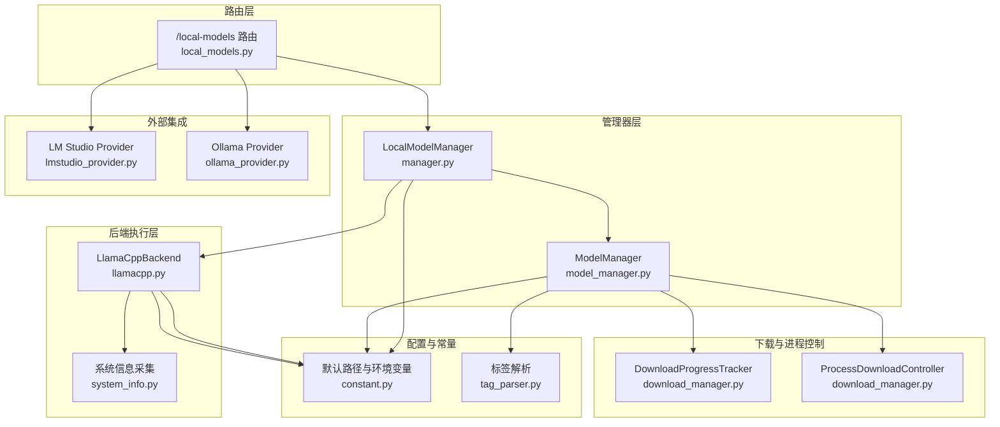
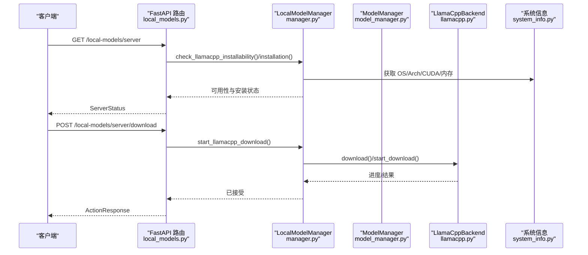
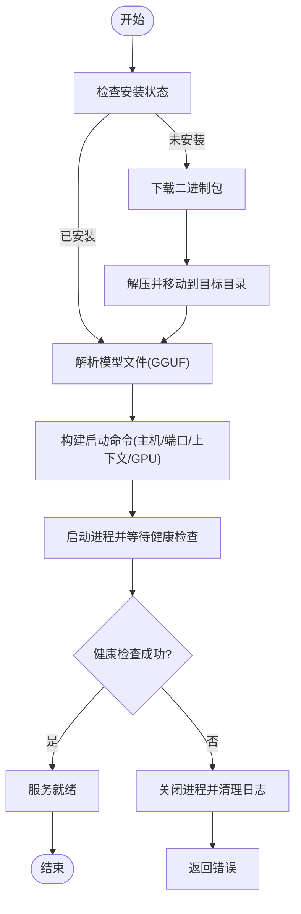
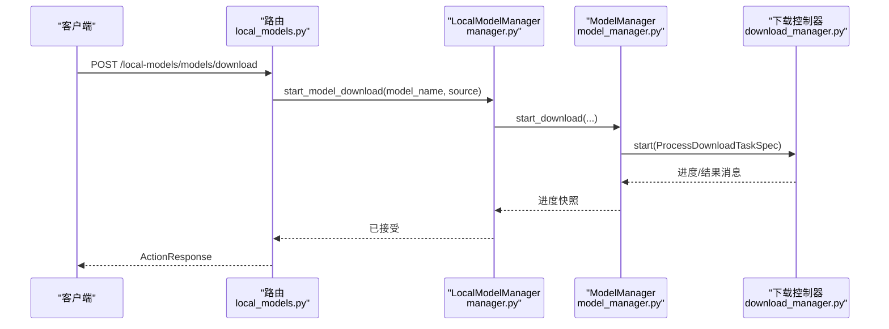
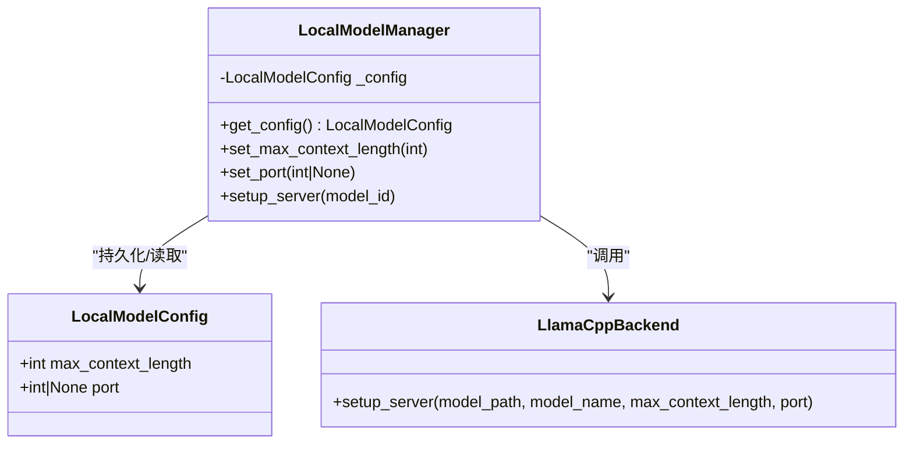
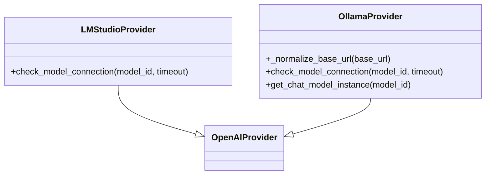
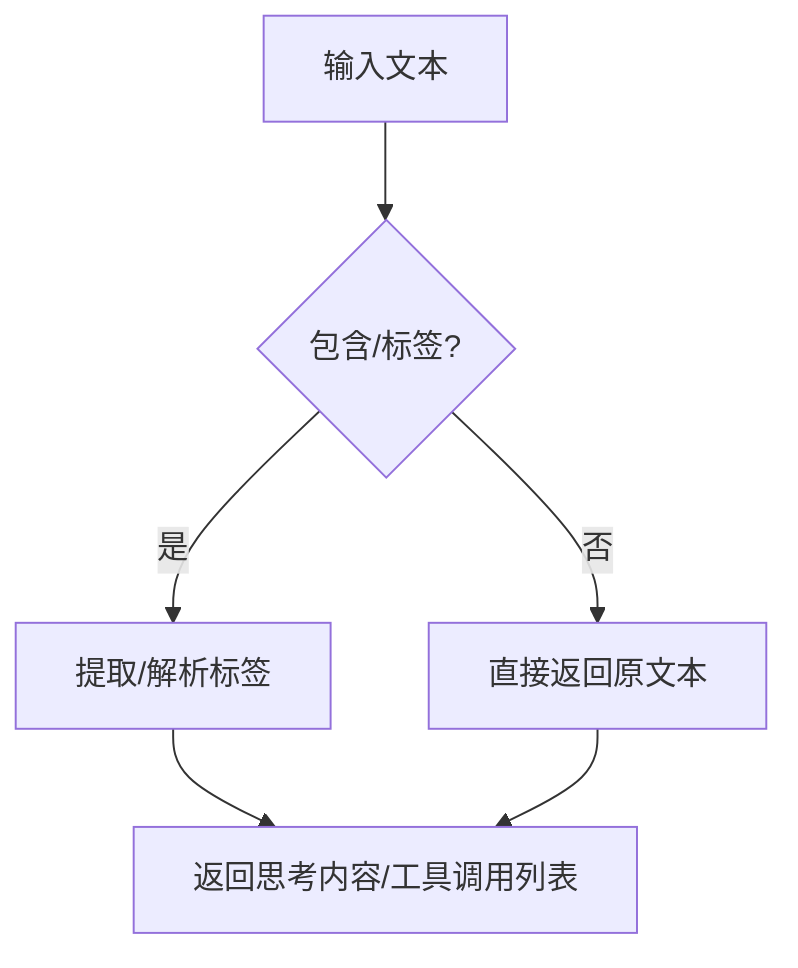
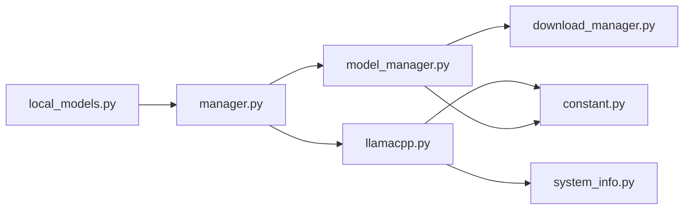

# 本地模型配置

<cite>
**本文引用的文件**
- [src/qwenpaw/local_models/__init__.py](file://src/qwenpaw/local_models/__init__.py)
- [src/qwenpaw/local_models/manager.py](file://src/qwenpaw/local_models/manager.py)
- [src/qwenpaw/local_models/model_manager.py](file://src/qwenpaw/local_models/model_manager.py)
- [src/qwenpaw/local_models/download_manager.py](file://src/qwenpaw/local_models/download_manager.py)
- [src/qwenpaw/local_models/llamacpp.py](file://src/qwenpaw/local_models/llamacpp.py)
- [src/qwenpaw/local_models/tag_parser.py](file://src/qwenpaw/local_models/tag_parser.py)
- [src/qwenpaw/app/routers/local_models.py](file://src/qwenpaw/app/routers/local_models.py)
- [src/qwenpaw/providers/lmstudio_provider.py](file://src/qwenpaw/providers/lmstudio_provider.py)
- [src/qwenpaw/providers/ollama_provider.py](file://src/qwenpaw/providers/ollama_provider.py)
- [src/qwenpaw/utils/system_info.py](file://src/qwenpaw/utils/system_info.py)
- [src/qwenpaw/constant.py](file://src/qwenpaw/constant.py)
- [tests/unit/local_models/test_llamacpp_backend.py](file://tests/unit/local_models/test_llamacpp_backend.py)
</cite>

## 目录
1. [简介](#简介)
2. [项目结构](#项目结构)
3. [核心组件](#核心组件)
4. [架构总览](#架构总览)
5. [详细组件分析](#详细组件分析)
6. [依赖关系分析](#依赖关系分析)
7. [性能与内存优化](#性能与内存优化)
8. [故障排除指南](#故障排除指南)
9. [结论](#结论)
10. [附录](#附录)

## 简介
本技术文档聚焦于本地模型配置与运行，围绕以下目标展开：
- 深入解释 Llama.cpp 后端的安装、配置与使用流程（含二进制下载、模型文件校验、服务启动与健康检查）。
- 说明模型下载与管理：支持从 HuggingFace 与 ModelScope 下载 GGUF 格式模型，进度追踪、取消与清理。
- 集成其他本地推理引擎：LM Studio 与 Ollama 的 OpenAI 兼容接口对接方式。
- 提供模型文件管理、版本控制与缓存策略细节（工作目录、模型目录、日志与二进制缓存）。
- 性能调优参数、内存与 GPU 加速配置、模型标签解析与自动下载机制、错误处理策略与硬件适配。

## 项目结构
本地模型子系统由“路由层”“管理器层”“下载与进程控制层”“后端执行层”“工具与常量层”构成，形成清晰的分层职责与可扩展接口。

图示来源
- [src/qwenpaw/app/routers/local_models.py:1-496](file://src/qwenpaw/app/routers/local_models.py#L1-L496)
- [src/qwenpaw/local_models/manager.py:1-244](file://src/qwenpaw/local_models/manager.py#L1-L244)
- [src/qwenpaw/local_models/model_manager.py:1-654](file://src/qwenpaw/local_models/model_manager.py#L1-L654)
- [src/qwenpaw/local_models/download_manager.py:1-599](file://src/qwenpaw/local_models/download_manager.py#L1-L599)
- [src/qwenpaw/local_models/llamacpp.py:1-926](file://src/qwenpaw/local_models/llamacpp.py#L1-L926)
- [src/qwenpaw/utils/system_info.py:1-253](file://src/qwenpaw/utils/system_info.py#L1-L253)
- [src/qwenpaw/providers/lmstudio_provider.py:1-20](file://src/qwenpaw/providers/lmstudio_provider.py#L1-L20)
- [src/qwenpaw/providers/ollama_provider.py:1-73](file://src/qwenpaw/providers/ollama_provider.py#L1-L73)
- [src/qwenpaw/constant.py:1-325](file://src/qwenpaw/constant.py#L1-L325)

章节来源
- [src/qwenpaw/app/routers/local_models.py:1-496](file://src/qwenpaw/app/routers/local_models.py#L1-L496)
- [src/qwenpaw/local_models/__init__.py:1-17](file://src/qwenpaw/local_models/__init__.py#L1-L17)

## 核心组件
- LocalModelManager：统一入口，负责 llama.cpp 安装状态检查、下载、服务器生命周期管理、配置持久化与推荐模型查询。
- ModelManager：负责模型仓库的下载、进度追踪、取消、删除、大小统计与 GGUF 文件校验。
- LlamaCppBackend：负责 llama.cpp 二进制下载与解压、服务进程启动/停止、健康检查、设备枚举与版本查询。
- DownloadProgressTracker/ProcessDownloadController：跨进程下载任务的状态机、进度采样与结果归并。
- Provider 集成：LM Studio 与 Ollama 基于 OpenAI 兼容接口，通过 ProviderManager 注册到系统中。
- 工具与常量：系统信息采集、默认工作目录与本地模型目录、标签解析工具。

章节来源
- [src/qwenpaw/local_models/manager.py:41-244](file://src/qwenpaw/local_models/manager.py#L41-L244)
- [src/qwenpaw/local_models/model_manager.py:63-654](file://src/qwenpaw/local_models/model_manager.py#L63-L654)
- [src/qwenpaw/local_models/llamacpp.py:51-926](file://src/qwenpaw/local_models/llamacpp.py#L51-L926)
- [src/qwenpaw/local_models/download_manager.py:198-599](file://src/qwenpaw/local_models/download_manager.py#L198-L599)
- [src/qwenpaw/providers/lmstudio_provider.py:1-20](file://src/qwenpaw/providers/lmstudio_provider.py#L1-L20)
- [src/qwenpaw/providers/ollama_provider.py:1-73](file://src/qwenpaw/providers/ollama_provider.py#L1-L73)
- [src/qwenpaw/utils/system_info.py:135-253](file://src/qwenpaw/utils/system_info.py#L135-L253)
- [src/qwenpaw/constant.py:118-120](file://src/qwenpaw/constant.py#L118-L120)

## 架构总览
本地模型配置采用“路由 API -> 管理器 -> 后端执行”的分层设计，配合下载控制器与系统信息探测，实现跨平台、可扩展的本地推理能力。

图示来源
- [src/qwenpaw/app/routers/local_models.py:151-217](file://src/qwenpaw/app/routers/local_models.py#L151-L217)
- [src/qwenpaw/local_models/manager.py:133-155](file://src/qwenpaw/local_models/manager.py#L133-L155)
- [src/qwenpaw/local_models/llamacpp.py:160-216](file://src/qwenpaw/local_models/llamacpp.py#L160-L216)
- [src/qwenpaw/utils/system_info.py:135-144](file://src/qwenpaw/utils/system_info.py#L135-L144)

## 详细组件分析

### Llama.cpp 后端（安装、下载、服务）
- 安装状态检查：验证可安装性（OS/架构/CUDA 版本）、检测已安装可执行文件。
- 二进制下载：根据 OS/架构/CUDA 选择包名，流式下载与进度上报，解压后移动至目标目录。
- 服务启动：解析模型文件（支持单文件或仓库内 GGUF），构建命令行参数（主机、端口、上下文长度、日志、GPU 层数等），启动进程并监控健康。
- 设备与版本：列出可用设备、查询版本号；在 Windows 上按 CUDA 版本映射后端类型。
- 错误处理：对 HTTP 状态码进行语义化提示，异常捕获与日志记录，失败时清理临时文件。

图示来源
- [src/qwenpaw/local_models/llamacpp.py:90-110](file://src/qwenpaw/local_models/llamacpp.py#L90-L110)
- [src/qwenpaw/local_models/llamacpp.py:160-216](file://src/qwenpaw/local_models/llamacpp.py#L160-L216)
- [src/qwenpaw/local_models/llamacpp.py:217-312](file://src/qwenpaw/local_models/llamacpp.py#L217-L312)
- [src/qwenpaw/local_models/llamacpp.py:695-730](file://src/qwenpaw/local_models/llamacpp.py#L695-L730)

章节来源
- [src/qwenpaw/local_models/llamacpp.py:51-926](file://src/qwenpaw/local_models/llamacpp.py#L51-L926)
- [src/qwenpaw/utils/system_info.py:84-144](file://src/qwenpaw/utils/system_info.py#L84-L144)

### 模型下载与管理（GGUF、进度、取消、删除）
- 推荐模型：基于系统内存/显存容量推荐合适规模的模型，标注来源与是否已下载。
- 下载源选择：优先 HuggingFace，不可达则回退 ModelScope；可指定 AUTO 自动探测。
- 下载流程：创建临时目录，启动子进程执行下载，实时计算已下载字节与速度，完成后移动到最终目录。
- 校验与清理：确保仓库包含至少一个 .gguf 文件；删除时清理空父目录；下载失败清理临时文件。
- 进度与取消：通过队列与状态机上报进度；支持取消并优雅退出。

图示来源
- [src/qwenpaw/app/routers/local_models.py:372-391](file://src/qwenpaw/app/routers/local_models.py#L372-L391)
- [src/qwenpaw/local_models/manager.py:194-208](file://src/qwenpaw/local_models/manager.py#L194-L208)
- [src/qwenpaw/local_models/model_manager.py:181-250](file://src/qwenpaw/local_models/model_manager.py#L181-L250)
- [src/qwenpaw/local_models/download_manager.py:368-599](file://src/qwenpaw/local_models/download_manager.py#L368-L599)

章节来源
- [src/qwenpaw/local_models/model_manager.py:63-654](file://src/qwenpaw/local_models/model_manager.py#L63-L654)
- [src/qwenpaw/local_models/download_manager.py:198-599](file://src/qwenpaw/local_models/download_manager.py#L198-L599)

### 配置持久化与运行参数
- LocalModelConfig：持久化最大上下文长度与固定端口；保存到工作目录下的 config.json，权限限制为仅所有者可读写。
- LocalModelManager：提供异步保存与加载，加锁保证并发安全；支持更新最大上下文长度与端口。
- LlamaCppBackend：启动时将上下文长度与端口传入命令行；若未指定端口则自动寻找可用端口。

图示来源
- [src/qwenpaw/local_models/manager.py:23-124](file://src/qwenpaw/local_models/manager.py#L23-L124)
- [src/qwenpaw/local_models/manager.py:214-230](file://src/qwenpaw/local_models/manager.py#L214-L230)
- [src/qwenpaw/local_models/llamacpp.py:217-312](file://src/qwenpaw/local_models/llamacpp.py#L217-L312)

章节来源
- [src/qwenpaw/local_models/manager.py:65-124](file://src/qwenpaw/local_models/manager.py#L65-L124)
- [src/qwenpaw/local_models/manager.py:214-230](file://src/qwenpaw/local_models/manager.py#L214-L230)

### 其他本地推理引擎集成
- LM Studio Provider：继承 OpenAIProvider，通过兼容的 OpenAI 接口访问 LM Studio 本地服务，提供模型可达性检查。
- Ollama Provider：继承 OpenAIProvider，将 base_url 规范化为 /v1 后缀，自动读取环境变量 OLLAMA_HOST，默认 http://127.0.0.1:11434，提供模型列表与连接检查。

图示来源
- [src/qwenpaw/providers/lmstudio_provider.py:7-20](file://src/qwenpaw/providers/lmstudio_provider.py#L7-L20)
- [src/qwenpaw/providers/ollama_provider.py:13-73](file://src/qwenpaw/providers/ollama_provider.py#L13-L73)

章节来源
- [src/qwenpaw/providers/lmstudio_provider.py:1-20](file://src/qwenpaw/providers/lmstudio_provider.py#L1-L20)
- [src/qwenpaw/providers/ollama_provider.py:1-73](file://src/qwenpaw/providers/ollama_provider.py#L1-L73)

### 模型标签解析与自动下载机制
- 标签解析：支持<think>...</think>与<tool_call>...</tool_call>两种本地模型输出标签，提供提取与解析工具，便于在流式场景中处理未闭合标签。
- 自动下载：ModelManager 在下载前探测 HuggingFace 可达性，优先使用 HuggingFace，否则回退 ModelScope；同时校验仓库包含 .gguf 文件。

图示来源
- [src/qwenpaw/local_models/tag_parser.py:271-366](file://src/qwenpaw/local_models/tag_parser.py#L271-L366)
- [src/qwenpaw/local_models/model_manager.py:287-292](file://src/qwenpaw/local_models/model_manager.py#L287-L292)

章节来源
- [src/qwenpaw/local_models/tag_parser.py:1-367](file://src/qwenpaw/local_models/tag_parser.py#L1-L367)
- [src/qwenpaw/local_models/model_manager.py:287-320](file://src/qwenpaw/local_models/model_manager.py#L287-L320)

## 依赖关系分析
- 组件耦合：LocalModelManager 对 LlamaCppBackend 与 ModelManager 存在强依赖；路由层通过依赖注入获取实例。
- 外部依赖：下载模块依赖 huggingface_hub 与 modelscope；系统信息模块依赖 nvidia-smi 与系统命令。
- 并发与线程：下载控制器使用多进程隔离阻塞 SDK，进度追踪使用线程安全的数据结构；服务日志通过异步任务读取。

图示来源
- [src/qwenpaw/app/routers/local_models.py:14-23](file://src/qwenpaw/app/routers/local_models.py#L14-L23)
- [src/qwenpaw/local_models/manager.py:53-63](file://src/qwenpaw/local_models/manager.py#L53-L63)
- [src/qwenpaw/local_models/model_manager.py:22-34](file://src/qwenpaw/local_models/model_manager.py#L22-L34)
- [src/qwenpaw/local_models/download_manager.py:15-19](file://src/qwenpaw/local_models/download_manager.py#L15-L19)
- [src/qwenpaw/local_models/llamacpp.py:19-39](file://src/qwenpaw/local_models/llamacpp.py#L19-L39)
- [src/qwenpaw/utils/system_info.py:1-253](file://src/qwenpaw/utils/system_info.py#L1-L253)
- [src/qwenpaw/constant.py:118-120](file://src/qwenpaw/constant.py#L118-L120)

章节来源
- [src/qwenpaw/app/routers/local_models.py:1-496](file://src/qwenpaw/app/routers/local_models.py#L1-L496)
- [src/qwenpaw/local_models/manager.py:1-244](file://src/qwenpaw/local_models/manager.py#L1-L244)
- [src/qwenpaw/local_models/model_manager.py:1-654](file://src/qwenpaw/local_models/model_manager.py#L1-L654)
- [src/qwenpaw/local_models/download_manager.py:1-599](file://src/qwenpaw/local_models/download_manager.py#L1-L599)
- [src/qwenpaw/local_models/llamacpp.py:1-926](file://src/qwenpaw/local_models/llamacpp.py#L1-L926)
- [src/qwenpaw/utils/system_info.py:1-253](file://src/qwenpaw/utils/system_info.py#L1-L253)
- [src/qwenpaw/constant.py:1-325](file://src/qwenpaw/constant.py#L1-L325)

## 性能与内存优化
- 上下文窗口：通过 LocalModelConfig.max_context_length 控制，影响显存占用与生成延迟。
- 端口分配：未指定端口时自动寻找可用端口，避免冲突；固定端口可用于容器/防火墙场景。
- GPU 加速：Windows 上根据 CUDA 版本映射后端类型；macOS/Linux 默认 CPU 后端；可通过设备列表确认可用设备。
- 内存与显存：系统信息模块优先使用 VRAM（CUDA）作为可用内存估算，用于推荐模型与健康检查。
- 下载性能：流式下载与进度采样，支持取消与重试；临时目录与最终目录分离，减少 IO 抖动。

章节来源
- [src/qwenpaw/local_models/manager.py:23-40](file://src/qwenpaw/local_models/manager.py#L23-L40)
- [src/qwenpaw/local_models/llamacpp.py:364-408](file://src/qwenpaw/local_models/llamacpp.py#L364-L408)
- [src/qwenpaw/local_models/llamacpp.py:314-330](file://src/qwenpaw/local_models/llamacpp.py#L314-L330)
- [src/qwenpaw/utils/system_info.py:84-144](file://src/qwenpaw/utils/system_info.py#L84-L144)

## 故障排除指南
- llama.cpp 无法安装：
  - macOS 版本过低：需 13.3 或以上。
  - Windows CUDA 不匹配：仅支持特定主次版本映射。
- 服务器启动失败：
  - 检查端口占用与健康检查超时；查看日志文件；确认模型文件为 .gguf。
- 下载失败：
  - HTTP 403/404：版本不存在或不受支持；网络问题：重试或更换镜像源。
  - 进程提前退出：检查下载完成后的最终化步骤与文件移动。
- 模型不可用：
  - 确认仓库包含 .gguf 文件；删除运行中的模型会触发 409 冲突。
- Provider 连接问题：
  - LM Studio/Ollama 模型不在列表中时，检查服务地址与模型名称。

章节来源
- [src/qwenpaw/local_models/llamacpp.py:858-876](file://src/qwenpaw/local_models/llamacpp.py#L858-L876)
- [src/qwenpaw/local_models/llamacpp.py:906-925](file://src/qwenpaw/local_models/llamacpp.py#L906-L925)
- [src/qwenpaw/local_models/llamacpp.py:626-659](file://src/qwenpaw/local_models/llamacpp.py#L626-L659)
- [src/qwenpaw/app/routers/local_models.py:432-452](file://src/qwenpaw/app/routers/local_models.py#L432-L452)
- [src/qwenpaw/providers/lmstudio_provider.py:10-19](file://src/qwenpaw/providers/lmstudio_provider.py#L10-L19)
- [src/qwenpaw/providers/ollama_provider.py:51-60](file://src/qwenpaw/providers/ollama_provider.py#L51-L60)

## 结论
该本地模型配置体系以清晰的分层与完善的错误处理为核心，结合跨平台系统信息探测、可扩展的 Provider 集成与稳健的下载/进程控制，为本地推理提供了高可用、可维护的基础设施。通过合理设置上下文长度、端口与 GPU 参数，可在不同硬件上获得稳定且高性能的推理体验。

## 附录
- 默认工作目录与本地模型目录：位于用户家目录下的 .qwenpaw/local_models，包含二进制、模型与日志。
- 常用环境变量：QWENPAW_WORKING_DIR、OLLAMA_HOST 等，用于覆盖默认路径与服务地址。
- 测试参考：单元测试覆盖了下载流程、端口选择、错误映射与归并逻辑，可作为集成与回归测试的依据。

章节来源
- [src/qwenpaw/constant.py:93-120](file://src/qwenpaw/constant.py#L93-L120)
- [src/qwenpaw/providers/ollama_provider.py:34-38](file://src/qwenpaw/providers/ollama_provider.py#L34-L38)
- [tests/unit/local_models/test_llamacpp_backend.py:1-800](file://tests/unit/local_models/test_llamacpp_backend.py#L1-L800)