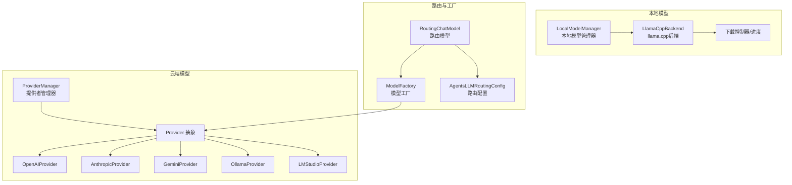
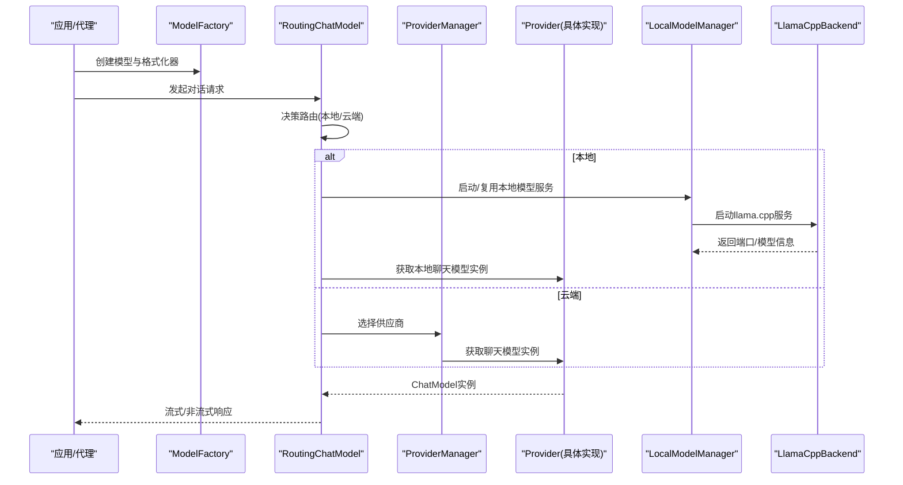
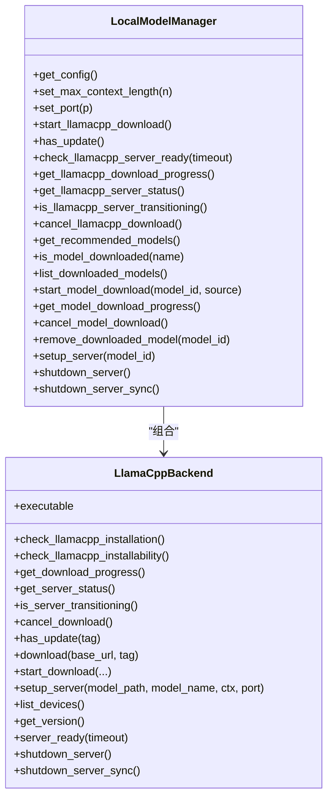
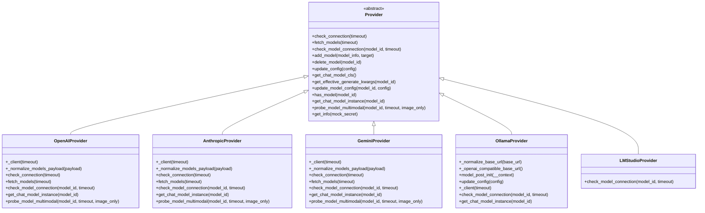
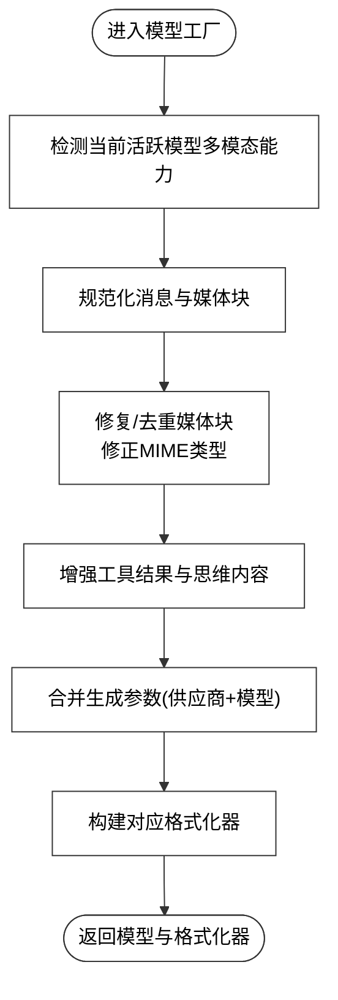
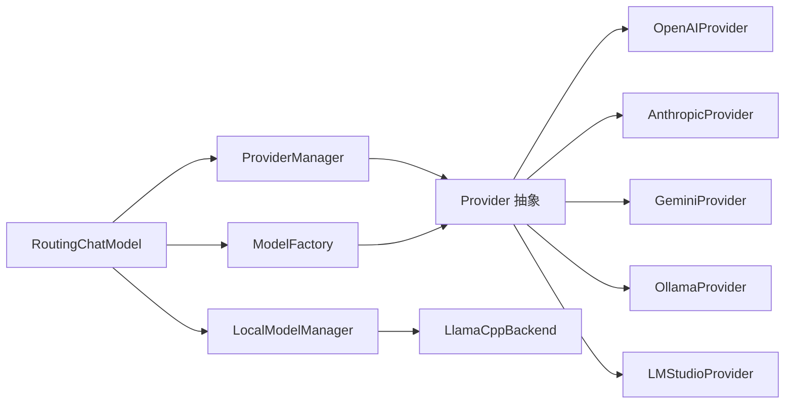

# 模型系统

<cite>
**本文引用的文件**
- [src/qwenpaw/agents/model_factory.py](file://src/qwenpaw/agents/model_factory.py)
- [src/qwenpaw/agents/routing_chat_model.py](file://src/qwenpaw/agents/routing_chat_model.py)
- [src/qwenpaw/providers/provider.py](file://src/qwenpaw/providers/provider.py)
- [src/qwenpaw/providers/provider_manager.py](file://src/qwenpaw/providers/provider_manager.py)
- [src/qwenpaw/providers/openai_provider.py](file://src/qwenpaw/providers/openai_provider.py)
- [src/qwenpaw/providers/anthropic_provider.py](file://src/qwenpaw/providers/anthropic_provider.py)
- [src/qwenpaw/providers/gemini_provider.py](file://src/qwenpaw/providers/gemini_provider.py)
- [src/qwenpaw/providers/ollama_provider.py](file://src/qwenpaw/providers/ollama_provider.py)
- [src/qwenpaw/providers/lmstudio_provider.py](file://src/qwenpaw/providers/lmstudio_provider.py)
- [src/qwenpaw/local_models/manager.py](file://src/qwenpaw/local_models/manager.py)
- [src/qwenpaw/local_models/llamacpp.py](file://src/qwenpaw/local_models/llamacpp.py)
- [src/qwenpaw/config/config.py](file://src/qwenpaw/config/config.py)
</cite>

## 目录
1. [简介](#简介)
2. [项目结构](#项目结构)
3. [核心组件](#核心组件)
4. [架构总览](#架构总览)
5. [详细组件分析](#详细组件分析)
6. [依赖分析](#依赖分析)
7. [性能考虑](#性能考虑)
8. [故障排查指南](#故障排查指南)
9. [结论](#结论)
10. [附录：最佳实践与配置清单](#附录最佳实践与配置清单)

## 简介
本文件面向QwenPaw模型系统的技术文档，聚焦于本地模型支持（llama.cpp、Ollama、LM Studio）与云端模型提供商（OpenAI、Anthropic、Gemini等）的配置与使用；解释模型工厂与路由机制的工作原理（含负载均衡、故障转移与性能优化）；提供模型选择指南、成本控制与性能调优建议；并给出自定义模型提供商的开发框架与集成规范，以及针对不同使用场景的最佳实践。

## 项目结构
- 本地模型子系统：负责llama.cpp二进制下载、安装、服务启动与健康检查，以及本地模型仓库管理与下载进度跟踪。
- 云端模型子系统：以Provider抽象为核心，统一接入OpenAI、Anthropic、Gemini、Ollama、LM Studio等多家供应商，提供连接性检测、模型列表拉取、单模型可用性检测、多模态探测与实例化能力。
- 路由与工厂：通过模型工厂统一格式化消息与生成参数，结合路由策略在本地与云端之间进行选择；配置层提供并发、重试、速率限制等运行时参数。

图表来源
- [src/qwenpaw/local_models/manager.py:41-244](file://src/qwenpaw/local_models/manager.py#L41-L244)
- [src/qwenpaw/local_models/llamacpp.py:51-312](file://src/qwenpaw/local_models/llamacpp.py#L51-L312)
- [src/qwenpaw/providers/provider_manager.py:720-800](file://src/qwenpaw/providers/provider_manager.py#L720-L800)
- [src/qwenpaw/providers/provider.py:147-368](file://src/qwenpaw/providers/provider.py#L147-L368)
- [src/qwenpaw/providers/openai_provider.py:39-176](file://src/qwenpaw/providers/openai_provider.py#L39-L176)
- [src/qwenpaw/providers/anthropic_provider.py:29-166](file://src/qwenpaw/providers/anthropic_provider.py#L29-L166)
- [src/qwenpaw/providers/gemini_provider.py:29-142](file://src/qwenpaw/providers/gemini_provider.py#L29-L142)
- [src/qwenpaw/providers/ollama_provider.py:13-73](file://src/qwenpaw/providers/ollama_provider.py#L13-L73)
- [src/qwenpaw/providers/lmstudio_provider.py:7-20](file://src/qwenpaw/providers/lmstudio_provider.py#L7-L20)
- [src/qwenpaw/agents/model_factory.py:49-800](file://src/qwenpaw/agents/model_factory.py#L49-L800)
- [src/qwenpaw/agents/routing_chat_model.py:65-123](file://src/qwenpaw/agents/routing_chat_model.py#L65-L123)
- [src/qwenpaw/config/config.py:43-54](file://src/qwenpaw/config/config.py#L43-L54)

章节来源
- [src/qwenpaw/local_models/manager.py:41-244](file://src/qwenpaw/local_models/manager.py#L41-L244)
- [src/qwenpaw/providers/provider_manager.py:720-800](file://src/qwenpaw/providers/provider_manager.py#L720-L800)
- [src/qwenpaw/agents/model_factory.py:49-800](file://src/qwenpaw/agents/model_factory.py#L49-L800)
- [src/qwenpaw/agents/routing_chat_model.py:65-123](file://src/qwenpaw/agents/routing_chat_model.py#L65-L123)
- [src/qwenpaw/config/config.py:43-54](file://src/qwenpaw/config/config.py#L43-L54)

## 核心组件
- Provider 抽象与具体实现：统一提供“连接性检测”“模型列表拉取”“单模型可用性检测”“多模态探测”“聊天模型实例化”等接口，屏蔽不同供应商差异。
- ProviderManager：内置多家供应商，支持用户自定义/插件供应商注册，持久化存储与迁移兼容。
- ModelFactory：根据当前活跃模型与供应商特性，统一消息格式化、媒体块处理、推理参数合并与工具结果增强。
- RoutingChatModel：基于配置的路由策略在本地与云端之间切换，记录路由决策原因，便于可观测性与排障。
- 本地模型管理：LocalModelManager封装llama.cpp下载、安装、服务启动、健康检查与状态查询；LlamaCppBackend负责进程生命周期、日志与端口分配。

章节来源
- [src/qwenpaw/providers/provider.py:147-368](file://src/qwenpaw/providers/provider.py#L147-L368)
- [src/qwenpaw/providers/provider_manager.py:720-800](file://src/qwenpaw/providers/provider_manager.py#L720-L800)
- [src/qwenpaw/agents/model_factory.py:49-800](file://src/qwenpaw/agents/model_factory.py#L49-L800)
- [src/qwenpaw/agents/routing_chat_model.py:65-123](file://src/qwenpaw/agents/routing_chat_model.py#L65-L123)
- [src/qwenpaw/local_models/manager.py:41-244](file://src/qwenpaw/local_models/manager.py#L41-L244)
- [src/qwenpaw/local_models/llamacpp.py:51-312](file://src/qwenpaw/local_models/llamacpp.py#L51-L312)

## 架构总览
下图展示从应用侧到本地/云端模型的调用链路与职责边界：

图表来源
- [src/qwenpaw/agents/routing_chat_model.py:65-123](file://src/qwenpaw/agents/routing_chat_model.py#L65-L123)
- [src/qwenpaw/providers/provider_manager.py:720-800](file://src/qwenpaw/providers/provider_manager.py#L720-L800)
- [src/qwenpaw/providers/provider.py:147-368](file://src/qwenpaw/providers/provider.py#L147-L368)
- [src/qwenpaw/local_models/manager.py:214-230](file://src/qwenpaw/local_models/manager.py#L214-L230)
- [src/qwenpaw/local_models/llamacpp.py:217-312](file://src/qwenpaw/local_models/llamacpp.py#L217-L312)

## 详细组件分析

### 本地模型：llama.cpp、Ollama、LM Studio
- llama.cpp 管理
  - LocalModelManager：集中管理配置（最大上下文长度、端口）、下载任务、模型仓库、服务器启停与状态查询。
  - LlamaCppBackend：负责下载进度、进程生命周期、健康检查、端口解析、设备枚举与版本查询。
- Ollama/LM Studio
  - 基于OpenAI兼容接口的适配，自动规范化URL，按需拉取模型列表进行可用性校验。

图表来源
- [src/qwenpaw/local_models/manager.py:41-244](file://src/qwenpaw/local_models/manager.py#L41-L244)
- [src/qwenpaw/local_models/llamacpp.py:51-312](file://src/qwenpaw/local_models/llamacpp.py#L51-L312)

章节来源
- [src/qwenpaw/local_models/manager.py:41-244](file://src/qwenpaw/local_models/manager.py#L41-L244)
- [src/qwenpaw/local_models/llamacpp.py:51-312](file://src/qwenpaw/local_models/llamacpp.py#L51-L312)
- [src/qwenpaw/providers/ollama_provider.py:13-73](file://src/qwenpaw/providers/ollama_provider.py#L13-L73)
- [src/qwenpaw/providers/lmstudio_provider.py:7-20](file://src/qwenpaw/providers/lmstudio_provider.py#L7-L20)

### 云端模型：OpenAI、Anthropic、Gemini、Ollama、LM Studio
- Provider 抽象
  - 统一接口：check_connection/fetch_models/check_model_connection/get_chat_model_instance/probe_model_multimodal。
  - 配置合并：get_effective_generate_kwargs 支持供应商级与模型级参数深度合并。
- 具体实现
  - OpenAIProvider：兼容多种OpenAI生态（含DashScope/ZhiPu等），支持多模态探测、模型列表归一化。
  - AnthropicProvider：Messages API，图像探测，视频不支持。
  - GeminiProvider：原生GeminiChatModel，图像/视频探测。
  - OllamaProvider：OpenAI兼容URL适配，按模型列表校验可用性。
  - LMStudioProvider：OpenAI兼容URL适配，按模型列表校验可用性。

图表来源
- [src/qwenpaw/providers/provider.py:147-368](file://src/qwenpaw/providers/provider.py#L147-L368)
- [src/qwenpaw/providers/openai_provider.py:39-176](file://src/qwenpaw/providers/openai_provider.py#L39-L176)
- [src/qwenpaw/providers/anthropic_provider.py:29-166](file://src/qwenpaw/providers/anthropic_provider.py#L29-L166)
- [src/qwenpaw/providers/gemini_provider.py:29-142](file://src/qwenpaw/providers/gemini_provider.py#L29-L142)
- [src/qwenpaw/providers/ollama_provider.py:13-73](file://src/qwenpaw/providers/ollama_provider.py#L13-L73)
- [src/qwenpaw/providers/lmstudio_provider.py:7-20](file://src/qwenpaw/providers/lmstudio_provider.py#L7-L20)

章节来源
- [src/qwenpaw/providers/provider.py:147-368](file://src/qwenpaw/providers/provider.py#L147-L368)
- [src/qwenpaw/providers/openai_provider.py:39-176](file://src/qwenpaw/providers/openai_provider.py#L39-L176)
- [src/qwenpaw/providers/anthropic_provider.py:29-166](file://src/qwenpaw/providers/anthropic_provider.py#L29-L166)
- [src/qwenpaw/providers/gemini_provider.py:29-142](file://src/qwenpaw/providers/gemini_provider.py#L29-L142)
- [src/qwenpaw/providers/ollama_provider.py:13-73](file://src/qwenpaw/providers/ollama_provider.py#L13-L73)
- [src/qwenpaw/providers/lmstudio_provider.py:7-20](file://src/qwenpaw/providers/lmstudio_provider.py#L7-L20)

### 路由与工厂：模型工厂与路由策略
- ModelFactory
  - 统一消息格式化：针对不同聊天模型家族（OpenAI/Anthropic/Gemini）进行消息规范化、媒体块修复与占位替换。
  - 工具结果增强：支持文件块、思维块、推理内容注入、媒体去重与提示优化。
  - 参数合并：基于当前活跃模型与供应商配置，合并生成参数，保证下游一致性。
- RoutingChatModel
  - 基于配置的路由策略（如“本地优先/云端优先”），记录路由原因，便于审计与排障。
  - 将消息与工具参数透传至选定端点，保持流式/非流式行为一致。

图表来源
- [src/qwenpaw/agents/model_factory.py:679-800](file://src/qwenpaw/agents/model_factory.py#L679-L800)

章节来源
- [src/qwenpaw/agents/model_factory.py:49-800](file://src/qwenpaw/agents/model_factory.py#L49-L800)
- [src/qwenpaw/agents/routing_chat_model.py:65-123](file://src/qwenpaw/agents/routing_chat_model.py#L65-L123)

### ProviderManager：内置供应商与扩展点
- 内置供应商：OpenAI、Azure OpenAI、Anthropic、Google Gemini、Ollama、LM Studio、DashScope/ModelScope、ZhiPu、DeepSeek、Kimi、MiniMax、OpenRouter、SiliconFlow等。
- 自定义/插件供应商：支持动态注册与持久化存储，目录权限安全加固，迁移兼容处理。
- 运行期能力：异步列举供应商信息、加载持久化配置、应用默认注解。

章节来源
- [src/qwenpaw/providers/provider_manager.py:720-800](file://src/qwenpaw/providers/provider_manager.py#L720-L800)

## 依赖分析
- ProviderManager 依赖 Provider 抽象与各具体实现类，形成“统一接口 + 多实现”的分层。
- ModelFactory 依赖 ProviderManager 获取当前活跃模型与供应商实例，并依赖格式化器与消息规范化工具。
- RoutingChatModel 依赖 ProviderManager 与本地模型管理器，依据配置进行路由决策。
- 本地模型路径：LocalModelManager 组合 LlamaCppBackend，后者依赖命令执行、网络与系统信息工具。

图表来源
- [src/qwenpaw/providers/provider_manager.py:720-800](file://src/qwenpaw/providers/provider_manager.py#L720-L800)
- [src/qwenpaw/providers/provider.py:147-368](file://src/qwenpaw/providers/provider.py#L147-L368)
- [src/qwenpaw/agents/model_factory.py:49-800](file://src/qwenpaw/agents/model_factory.py#L49-L800)
- [src/qwenpaw/agents/routing_chat_model.py:65-123](file://src/qwenpaw/agents/routing_chat_model.py#L65-L123)
- [src/qwenpaw/local_models/manager.py:41-244](file://src/qwenpaw/local_models/manager.py#L41-L244)
- [src/qwenpaw/local_models/llamacpp.py:51-312](file://src/qwenpaw/local_models/llamacpp.py#L51-L312)

章节来源
- [src/qwenpaw/providers/provider_manager.py:720-800](file://src/qwenpaw/providers/provider_manager.py#L720-L800)
- [src/qwenpaw/agents/model_factory.py:49-800](file://src/qwenpaw/agents/model_factory.py#L49-L800)
- [src/qwenpaw/agents/routing_chat_model.py:65-123](file://src/qwenpaw/agents/routing_chat_model.py#L65-L123)
- [src/qwenpaw/local_models/manager.py:41-244](file://src/qwenpaw/local_models/manager.py#L41-L244)
- [src/qwenpaw/local_models/llamacpp.py:51-312](file://src/qwenpaw/local_models/llamacpp.py#L51-L312)

## 性能考虑
- 并发与限流
  - 全局并发上限、每分钟查询数限制、指数退避与抖动，避免触发429。
- 路由策略
  - 本地优先可降低网络延迟与带宽成本；云端优先适合高阶推理或多模态需求。
- 本地模型优化
  - 合理设置上下文长度、GPU层数、自动端口分配与健康检查超时，确保稳定可用。
- 多模态探测
  - 仅在必要时进行探测，避免额外开销；对文本-only模型跳过视频探测，减少误判与失败重试。

章节来源
- [src/qwenpaw/config/config.py:712-800](file://src/qwenpaw/config/config.py#L712-L800)
- [src/qwenpaw/agents/routing_chat_model.py:29-53](file://src/qwenpaw/agents/routing_chat_model.py#L29-L53)
- [src/qwenpaw/local_models/llamacpp.py:695-730](file://src/qwenpaw/local_models/llamacpp.py#L695-L730)

## 故障排查指南
- 本地模型
  - 下载失败：检查网络、镜像地址、目标目录权限与磁盘空间；查看错误映射与HTTP状态码。
  - 服务未就绪：确认端口占用、进程退出码、健康检查URL与超时；关注日志输出。
  - 设备/版本不匹配：在macOS上检查最低版本要求，列出可用设备。
- 云端模型
  - 连接失败：验证base_url、API密钥前缀、超时设置；对OpenAI兼容端点检查代理头。
  - 单模型不可用：使用check_model_connection进行最小化请求验证；对多模态探测失败，先检查图像探测再决定是否继续视频探测。
- 路由问题
  - 明确路由决策原因，核对配置模式；若出现异常回退，检查本地服务状态与云端可用性。

章节来源
- [src/qwenpaw/local_models/llamacpp.py:625-660](file://src/qwenpaw/local_models/llamacpp.py#L625-L660)
- [src/qwenpaw/providers/openai_provider.py:71-83](file://src/qwenpaw/providers/openai_provider.py#L71-L83)
- [src/qwenpaw/providers/anthropic_provider.py:68-80](file://src/qwenpaw/providers/anthropic_provider.py#L68-L80)
- [src/qwenpaw/providers/gemini_provider.py:70-88](file://src/qwenpaw/providers/gemini_provider.py#L70-L88)
- [src/qwenpaw/agents/routing_chat_model.py:98-114](file://src/qwenpaw/agents/routing_chat_model.py#L98-L114)

## 结论
QwenPaw通过统一的Provider抽象与路由工厂，实现了对本地与云端模型的一致接入与灵活调度。借助完善的连接性检测、模型可用性校验与多模态探测能力，系统可在成本、性能与功能之间取得平衡。配合可扩展的ProviderManager与本地模型管理器，开发者可以快速集成新供应商或部署本地推理服务。

## 附录：最佳实践与配置清单

- 本地模型最佳实践
  - 使用LocalModelManager持久化上下文长度与端口，避免每次重启重新探测。
  - 在资源受限环境适当降低上下文长度与GPU层数，提升稳定性。
  - 定期检查更新并监控下载进度，确保模型仓库可用。

- 云端模型最佳实践
  - 优先使用支持多模态的模型以获得更丰富的输入能力；对文本-only场景选择免费或低成本模型。
  - 对OpenAI兼容端点正确设置默认头部（如DashScope），避免鉴权或协议不匹配。
  - 启用合理的重试与限流策略，避免突发流量导致429。

- 路由策略建议
  - 开发/测试阶段：本地优先，降低外部依赖风险。
  - 生产阶段：云端优先，结合本地作为降级与缓存加速手段。
  - 动态切换：根据消息内容、工具可用性与成本预算动态调整。

- 自定义模型提供商开发框架
  - 继承Provider抽象，实现必需接口（连接性、模型列表、单模型可用性、实例化、多模态探测）。
  - 提供默认生成参数与模型清单，支持深度参数合并。
  - 注册到ProviderManager，遵循持久化与安全权限策略。

章节来源
- [src/qwenpaw/providers/provider.py:147-368](file://src/qwenpaw/providers/provider.py#L147-L368)
- [src/qwenpaw/providers/provider_manager.py:720-800](file://src/qwenpaw/providers/provider_manager.py#L720-L800)
- [src/qwenpaw/local_models/manager.py:109-123](file://src/qwenpaw/local_models/manager.py#L109-L123)
- [src/qwenpaw/config/config.py:712-800](file://src/qwenpaw/config/config.py#L712-L800)