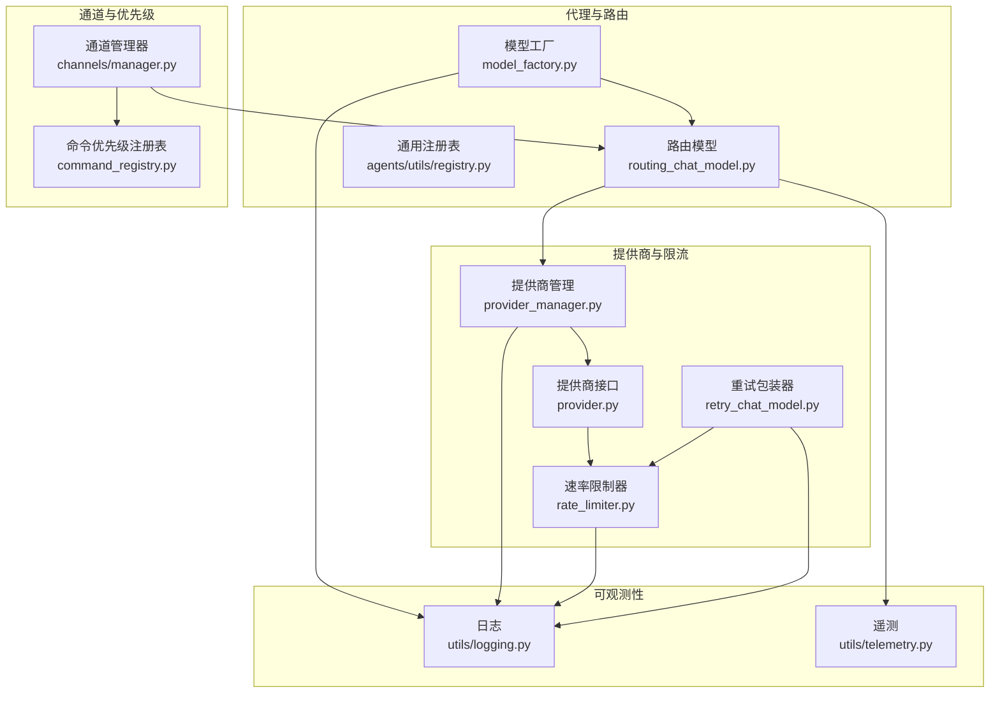
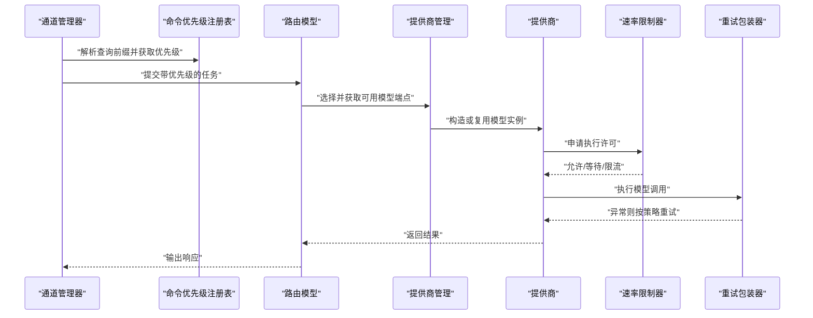
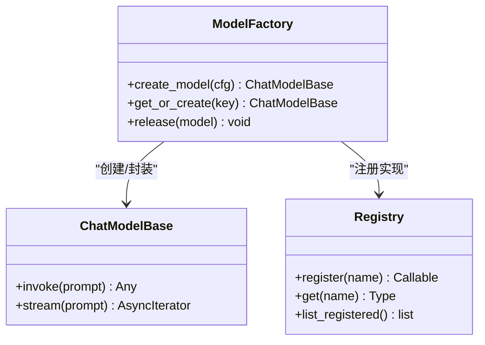
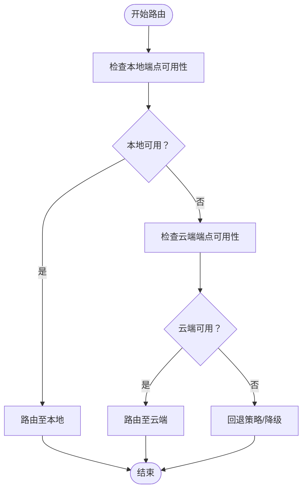
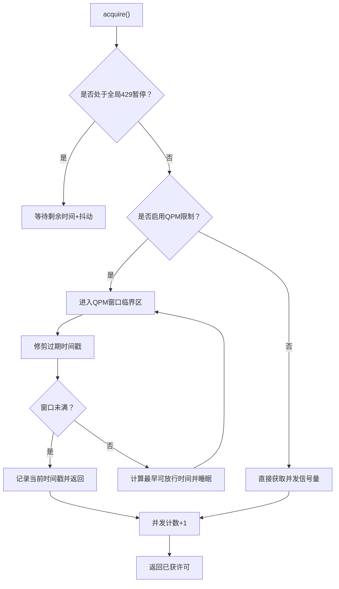
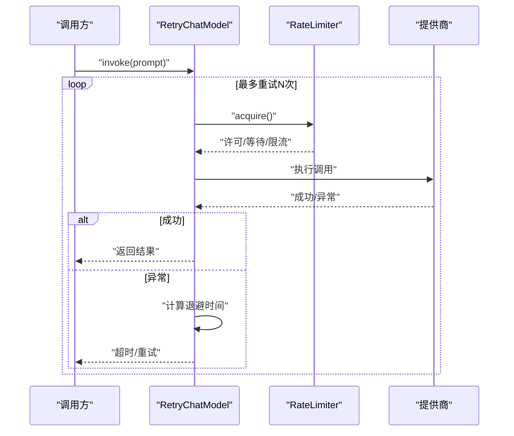
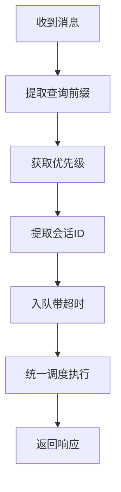
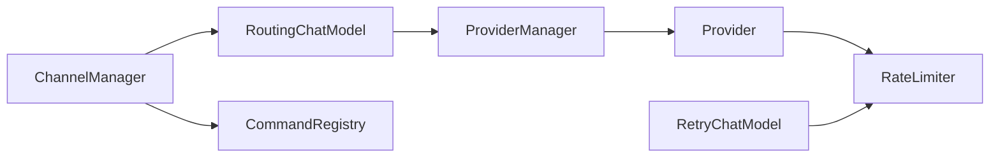

# 模型路由与工厂

<cite>
**本文引用的文件**
- [model_factory.py](file://src/qwenpaw/agents/model_factory.py)
- [routing_chat_model.py](file://src/qwenpaw/agents/routing_chat_model.py)
- [rate_limiter.py](file://src/qwenpaw/providers/rate_limiter.py)
- [retry_chat_model.py](file://src/qwenpaw/providers/retry_chat_model.py)
- [command_registry.py](file://src/qwenpaw/app/channels/command_registry.py)
- [manager.py](file://src/qwenpaw/app/channels/manager.py)
- [registry.py](file://src/qwenpaw/agents/utils/registry.py)
- [provider.py](file://src/qwenpaw/providers/provider.py)
- [provider_manager.py](file://src/qwenpaw/providers/provider_manager.py)
- [logging.py](file://src/qwenpaw/utils/logging.py)
- [telemetry.py](file://src/qwenpaw/utils/telemetry.py)
- [schema.py](file://src/qwenpaw/agents/schema.py)
- [schema.py](file://src/qwenpaw/app/routers/schemas_config.py)
</cite>

## 目录
1. [引言](#引言)
2. [项目结构](#项目结构)
3. [核心组件](#核心组件)
4. [架构总览](#架构总览)
5. [详细组件分析](#详细组件分析)
6. [依赖关系分析](#依赖关系分析)
7. [性能考量](#性能考量)
8. [故障排查指南](#故障排查指南)
9. [结论](#结论)
10. [附录](#附录)

## 引言
本文件聚焦于“模型路由与工厂”机制，系统性阐述以下主题：
- 模型工厂的设计模式与实现原理：模型实例化、生命周期管理、资源池化策略
- 路由算法工作机制：负载均衡、故障转移、优先级调度、性能监控
- 速率限制器：并发控制、队列管理、背压处理
- 重试机制：指数退避、熔断器模式、降级策略
- 性能监控指标、日志记录与调试工具
- 高可用与弹性设计的最佳实践

## 项目结构
围绕模型路由与工厂的关键模块分布如下：
- 代理与路由层：agents/model_factory.py、agents/routing_chat_model.py、agents/utils/registry.py
- 提供商与限流：providers/provider.py、providers/provider_manager.py、providers/rate_limiter.py、providers/retry_chat_model.py
- 通道与优先级：app/channels/manager.py、app/channels/command_registry.py
- 日志与遥测：utils/logging.py、utils/telemetry.py
- 配置与模式：agents/schema.py、app/routers/schemas_config.py

图表来源
- [model_factory.py](file://src/qwenpaw/agents/model_factory.py)
- [routing_chat_model.py](file://src/qwenpaw/agents/routing_chat_model.py)
- [provider_manager.py](file://src/qwenpaw/providers/provider_manager.py)
- [provider.py](file://src/qwenpaw/providers/provider.py)
- [rate_limiter.py](file://src/qwenpaw/providers/rate_limiter.py)
- [retry_chat_model.py](file://src/qwenpaw/providers/retry_chat_model.py)
- [manager.py](file://src/qwenpaw/app/channels/manager.py)
- [command_registry.py](file://src/qwenpaw/app/channels/command_registry.py)
- [logging.py](file://src/qwenpaw/utils/logging.py)
- [telemetry.py](file://src/qwenpaw/utils/telemetry.py)

章节来源
- [model_factory.py](file://src/qwenpaw/agents/model_factory.py)
- [routing_chat_model.py](file://src/qwenpaw/agents/routing_chat_model.py)
- [provider_manager.py](file://src/qwenpaw/providers/provider_manager.py)
- [provider.py](file://src/qwenpaw/providers/provider.py)
- [rate_limiter.py](file://src/qwenpaw/providers/rate_limiter.py)
- [retry_chat_model.py](file://src/qwenpaw/providers/retry_chat_model.py)
- [manager.py](file://src/qwenpaw/app/channels/manager.py)
- [command_registry.py](file://src/qwenpaw/app/channels/command_registry.py)
- [logging.py](file://src/qwenpaw/utils/logging.py)
- [telemetry.py](file://src/qwenpaw/utils/telemetry.py)

## 核心组件
- 模型工厂（Model Factory）：负责根据配置与上下文创建与管理模型实例，支持多提供商适配与统一接口封装。
- 路由模型（RoutingChatModel）：在本地与云端模型之间进行动态路由决策，结合策略配置实现负载均衡与故障转移。
- 速率限制器（RateLimiter）：提供并发信号量与QPM滑动窗口，实现全局429冷却、请求频次限制与背压处理。
- 重试包装器（RetryChatModel）：对任意聊天模型进行透明重试包装，支持指数退避、最大重试次数与超时保护。
- 命令优先级注册表（CommandRegistry）：基于命令前缀的优先级映射，用于消息路由与队列调度。
- 通道管理器（Channel Manager）：接收来自不同渠道的消息，按优先级入队并统一调度执行。

章节来源
- [model_factory.py](file://src/qwenpaw/agents/model_factory.py)
- [routing_chat_model.py](file://src/qwenpaw/agents/routing_chat_model.py)
- [rate_limiter.py](file://src/qwenpaw/providers/rate_limiter.py)
- [retry_chat_model.py](file://src/qwenpaw/providers/retry_chat_model.py)
- [command_registry.py](file://src/qwenpaw/app/channels/command_registry.py)
- [manager.py](file://src/qwenpaw/app/channels/manager.py)

## 架构总览
下图展示了从消息进入系统到模型调用的整体流程，以及各组件之间的交互关系。

图表来源
- [manager.py](file://src/qwenpaw/app/channels/manager.py)
- [command_registry.py](file://src/qwenpaw/app/channels/command_registry.py)
- [routing_chat_model.py](file://src/qwenpaw/agents/routing_chat_model.py)
- [provider_manager.py](file://src/qwenpaw/providers/provider_manager.py)
- [provider.py](file://src/qwenpaw/providers/provider.py)
- [rate_limiter.py](file://src/qwenpaw/providers/rate_limiter.py)
- [retry_chat_model.py](file://src/qwenpaw/providers/retry_chat_model.py)

## 详细组件分析

### 模型工厂（Model Factory）
- 设计模式
  - 工厂方法：依据配置与上下文创建具体模型实例，屏蔽提供商差异。
  - 注册表模式：通过通用注册表对实现类进行注册与检索，便于扩展与替换。
- 生命周期管理
  - 实例缓存：避免重复创建，降低初始化开销。
  - 资源清理：在关闭或回收时释放底层资源（如连接、句柄等）。
- 资源池化策略
  - 连接池：对远程提供商建立长连接池，减少握手成本。
  - 并发隔离：为不同提供商或模型分配独立的并发与限流单元。
- 关键职责
  - 解析模型配置（提供商、模型名、格式化器等）
  - 统一接口封装（ChatModelBase）
  - 与路由模型协作，提供本地/云端端点

图表来源
- [model_factory.py](file://src/qwenpaw/agents/model_factory.py)
- [registry.py](file://src/qwenpaw/agents/utils/registry.py)
- [schema.py](file://src/qwenpaw/agents/schema.py)

章节来源
- [model_factory.py](file://src/qwenpaw/agents/model_factory.py)
- [registry.py](file://src/qwenpaw/agents/utils/registry.py)
- [schema.py](file://src/qwenpaw/agents/schema.py)

### 路由模型（RoutingChatModel）
- 路由决策
  - 条件判断：本地可用性、负载状态、错误历史、策略配置
  - 决策输出：目标端点（本地/云端）、路由原因列表
- 负载均衡与故障转移
  - 端点健康检查：失败计数、冷却时间、熔断阈值
  - 动态切换：当主端点不可用时自动切到备用端点
- 性能监控
  - 路由统计：命中率、延迟分布、失败率
  - 与遥测集成：上报指标与追踪信息

图表来源
- [routing_chat_model.py](file://src/qwenpaw/agents/routing_chat_model.py)

章节来源
- [routing_chat_model.py](file://src/qwenpaw/agents/routing_chat_model.py)

### 速率限制器（RateLimiter）
- 并发控制
  - 信号量：限制同时在途请求数（max_concurrent）
  - 在途计数：内部维护当前并发数，避免私有API依赖
- 队列与背压
  - QPM滑动窗口：60秒内请求数不超过max_qpm
  - 等待与重试：窗口满时计算最早可放行时间，释放锁后睡眠再尝试
- 全局429冷却
  - pause_until：记录全局暂停到期时间，唤醒后加入抖动避免同步爆发
- 统计与可观测性
  - 计数器：总获取、暂停、QPM等待、限流次数
  - 日志：调试级别输出等待详情

图表来源
- [rate_limiter.py](file://src/qwenpaw/providers/rate_limiter.py)

章节来源
- [rate_limiter.py](file://src/qwenpaw/providers/rate_limiter.py)

### 重试包装器（RetryChatModel）
- 指数退避
  - 基于尝试次数计算等待时间，上限受backoff_cap约束
  - 避免过小/过大参数，确保安全边界
- 超时保护
  - 在每个调用点使用wait_for设置硬上限，防止无限等待
- 与速率限制协同
  - acquire()可能因限流而阻塞，重试包装器在超时后决定是否再次尝试
- 降级策略
  - 达到最大重试次数后，可触发降级（如切换端点、返回缓存、提示用户）

图表来源
- [retry_chat_model.py](file://src/qwenpaw/providers/retry_chat_model.py)
- [rate_limiter.py](file://src/qwenpaw/providers/rate_limiter.py)
- [provider.py](file://src/qwenpaw/providers/provider.py)

章节来源
- [retry_chat_model.py](file://src/qwenpaw/providers/retry_chat_model.py)
- [rate_limiter.py](file://src/qwenpaw/providers/rate_limiter.py)
- [provider.py](file://src/qwenpaw/providers/provider.py)

### 命令优先级与队列调度
- 优先级注册表
  - 预定义优先级名称映射到数值（0/10/20/30），支持自定义插入
  - 快速查找：O(1)命令→优先级
- 通道管理器
  - 从消息中提取查询前缀，计算优先级
  - 将任务以session_id为维度入队，结合优先级进行调度
  - 超时保护：入队过程设置超时，避免阻塞

图表来源
- [command_registry.py](file://src/qwenpaw/app/channels/command_registry.py)
- [manager.py](file://src/qwenpaw/app/channels/manager.py)

章节来源
- [command_registry.py](file://src/qwenpaw/app/channels/command_registry.py)
- [manager.py](file://src/qwenpaw/app/channels/manager.py)

## 依赖关系分析
- 组件耦合
  - 路由模型依赖提供商管理器与注册表，以获取可用端点
  - 速率限制器与重试包装器共同作用于提供商调用链
  - 通道管理器通过优先级注册表影响路由与调度
- 外部依赖
  - 异步并发原语（信号量、锁、队列）
  - 时间与随机数（用于抖动与退避）
- 潜在循环依赖
  - 当前结构通过接口与配置解耦，未见明显循环导入

图表来源
- [routing_chat_model.py](file://src/qwenpaw/agents/routing_chat_model.py)
- [provider_manager.py](file://src/qwenpaw/providers/provider_manager.py)
- [provider.py](file://src/qwenpaw/providers/provider.py)
- [rate_limiter.py](file://src/qwenpaw/providers/rate_limiter.py)
- [retry_chat_model.py](file://src/qwenpaw/providers/retry_chat_model.py)
- [manager.py](file://src/qwenpaw/app/channels/manager.py)
- [command_registry.py](file://src/qwenpaw/app/channels/command_registry.py)

章节来源
- [routing_chat_model.py](file://src/qwenpaw/agents/routing_chat_model.py)
- [provider_manager.py](file://src/qwenpaw/providers/provider_manager.py)
- [provider.py](file://src/qwenpaw/providers/provider.py)
- [rate_limiter.py](file://src/qwenpaw/providers/rate_limiter.py)
- [retry_chat_model.py](file://src/qwenpaw/providers/retry_chat_model.py)
- [manager.py](file://src/qwenpaw/app/channels/manager.py)
- [command_registry.py](file://src/qwenpaw/app/channels/command_registry.py)

## 性能考量
- 并发与限流
  - 合理设置max_concurrent与max_qpm，避免突发流量导致下游过载
  - 使用抖动缓解“惊群效应”，提升整体稳定性
- 路由与缓存
  - 缓存本地端点可用性与健康状态，减少重复探测
  - 对热点模型进行实例池化，缩短冷启动时间
- 监控与告警
  - 上报路由命中率、平均/尾延迟、失败率、限流事件
  - 结合日志与遥测定位瓶颈（网络、CPU、IO）

## 故障排查指南
- 速率限制相关
  - 现象：频繁等待、超时、429冷却
  - 排查：检查max_concurrent、max_qpm、pause_seconds；查看日志中的等待详情
- 重试与退避
  - 现象：重试次数过多、延迟增大
  - 排查：调整backoff_base/cap、max_retries；确认超时设置是否合理
- 路由与端点
  - 现象：路由失败、切换频繁
  - 排查：检查端点健康阈值、熔断配置；核对策略规则与原因列表
- 通道与优先级
  - 现象：消息积压、优先级混乱
  - 排查：确认命令前缀匹配、优先级映射、入队超时设置

章节来源
- [rate_limiter.py](file://src/qwenpaw/providers/rate_limiter.py)
- [retry_chat_model.py](file://src/qwenpaw/providers/retry_chat_model.py)
- [routing_chat_model.py](file://src/qwenpaw/agents/routing_chat_model.py)
- [command_registry.py](file://src/qwenpaw/app/channels/command_registry.py)
- [manager.py](file://src/qwenpaw/app/channels/manager.py)
- [logging.py](file://src/qwenpaw/utils/logging.py)

## 结论
本文从工厂与路由两个维度，系统梳理了模型实例化、生命周期管理、资源池化策略，以及路由算法的负载均衡、故障转移、优先级调度与性能监控。配合速率限制器与重试机制，构建了具备高可用与弹性的模型服务框架。建议在生产环境中结合实际流量特征调优并发与限流参数，并完善监控与告警体系，持续优化路由策略与端点健康度量。

## 附录
- 配置参考
  - 模型工厂：模型提供商、模型名、格式化器、缓存策略
  - 路由策略：本地优先、云端兜底、熔断阈值、冷却时间
  - 速率限制：并发上限、QPM上限、默认暂停秒数、抖动范围、获取超时
  - 重试策略：启用开关、最大重试次数、退避基数与上限、超时保护
- 最佳实践
  - 为不同提供商与模型分别配置独立的并发与限流单元
  - 使用遥测采集关键指标，结合日志进行根因分析
  - 定期评估路由策略有效性，动态调整权重与阈值
  - 在高峰期启用更保守的并发与限流参数，保障稳定性